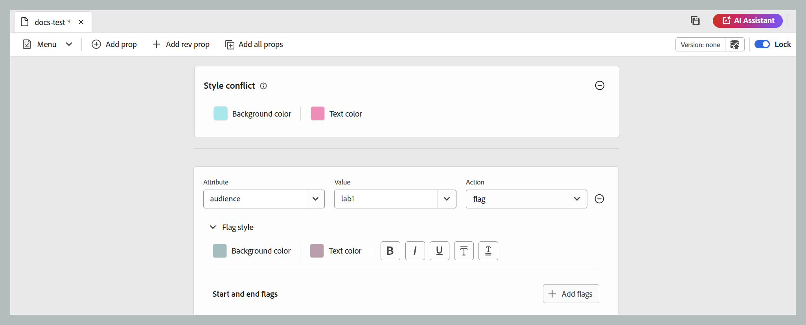

# DITAVAL 편집기 {#ditaval-editor}

DITAVAL 파일은 조건부 출력을 생성하는 데 사용됩니다. 단일 항목에서 요소 속성을 사용하여 조건을 추가하여 콘텐츠를 조건화할 수 있습니다. 그런 다음 컨텐츠를 생성하기 위해 선택해야 하는 조건과 최종 출력에서 제외해야 하는 조건을 지정하는 DITAVAL 파일을 만듭니다.

Adobe Experience Manager Guides을 사용하면 DITAVAL 편집기를 사용하여 DITAVAL 파일을 쉽게 만들고 편집할 수 있습니다. DITAVAL 편집기는 시스템에 정의된 속성(조건으로 사용 가능)을 검색하며, 이를 사용하여 DITAVAL 파일을 생성하거나 편집할 수 있습니다. Adobe Experience Manager에서 조건을 만들고 관리하는 방법에 대한 자세한 내용은 Adobe Experience Manager 설명서의 [태그 관리](https://experienceleague.adobe.com/docs/experience-manager-cloud-service/sites/authoring/features/tags.html?lang=en) 섹션을 참조하십시오.

다음 섹션에서는 Experience Manager Guides에서 DITAVAL 파일에 사용할 수 있는 옵션에 대해 설명합니다.

- [DITAVAL 파일 만들기](#create-ditaval-file)
- [DITAVAL 파일 편집](#edit-ditaval-file)
- [DITAVAl 파일 편집기 뷰](#ditaval-editor-views)
- [Assets UI에서 DITAVAL 파일 작업](#working-with-ditaval-files-in-the-assets-ui)

## DITAVAL 파일 만들기

DITAVAL 파일을 생성하려면 다음 단계를 수행하십시오.

1. 저장소 패널에서 **새 파일** 아이콘을 선택한 다음 드롭다운 메뉴에서 **주제**&#x200B;를 선택합니다.

   {width="350" align="left"}

   [Experience Manager Guides 홈 페이지](./intro-home-page.md)와 저장소 보기에 있는 폴더의 옵션 메뉴에서도 이 옵션에 액세스할 수 있습니다.

2. **새 항목** 대화 상자가 표시됩니다.

3. **새 항목** 대화 상자에서 다음 세부 정보를 제공합니다.
   - 주제 제목.
   - \(선택 사항\)* 항목의 파일 이름입니다. 파일 이름은 제목 항목을 기반으로 자동 제안됩니다. 관리자가 UUID 설정을 기반으로 자동 파일 이름을 활성화한 경우 이름 필드가 표시되지 않습니다.
   - 주제의 기반이 되는 템플릿입니다. DITAVAL 파일의 경우 드롭다운 목록에서 **Ditaval**&#x200B;을(를) 선택합니다.
   - 주제 파일을 저장할 경로입니다. 기본적으로 현재 저장소에서 선택한 폴더의 경로가 경로 필드에 표시됩니다.

   {width="350" align="left"}

4. **만들기**&#x200B;를 선택합니다.

지정한 경로에 주제가 만들어집니다. 또한 편집기에서 편집할 주제가 열립니다.

{align="left"}

## DITAVAL 파일 편집

DITAVAL 주제를 만들면 편집기에서 편집을 위해 열립니다. 기존 DITAVAL 주제를 편집하려면 DITAVAL 주제가 있는 폴더 또는 맵으로 이동한 다음 **옵션** 메뉴에서 **편집**&#x200B;을 선택합니다.

DITAVAL 편집기를 사용하면 편집기 도구 모음의 옵션을 사용하여 아래 나열된 여러 작업을 수행할 수 있습니다.

### 편집기 도구 모음 옵션

#### 메뉴 드롭다운

메뉴 드롭다운에서는 편집 작업, 찾기 및 바꾸기, 버전 기록, 버전 레이블, 병합, 검토 작업 만들기, 변경 내용 추적 및 태그 기능에 액세스할 수 있습니다.
자세한 내용은 [메뉴 드롭다운 옵션](./web-editor-toolbar.md#menu-dropdown)을 참조하세요.

#### Prop 추가

DITAVAL 파일에 단일 속성을 추가합니다.

{width="650" align="left"}

첫 번째 드롭다운에는 DITAVAL 파일에서 사용할 수 있는 허용된 DITA 속성이 나열됩니다.

두 번째 드롭다운 목록에는 선택한 속성에 대해 구성된 값이 표시됩니다. 그런 다음 다음 드롭다운 목록에 선택한 속성에서 구성할 수 있는 작업이 표시됩니다. 작업 드롭다운에서 허용되는 값은 `include`, `exclude`, `passthrough` 및 `flag`입니다. 이러한 값에 대한 자세한 내용은 OASIS DITA 설명서에서 [prop](http://docs.oasis-open.org/dita/dita/v1.3/errata01/os/complete/part3-all-inclusive/langRef/ditaval/ditaval-prop.html#ditaval-prop) 요소의 정의를 참조하십시오. 특성에 추가된 속성의 작업에 대한 자세한 내용은 속성에 대한 [작업](#actions-for-property)을 참조하십시오.

#### 수익 속성 추가

XML의 태그에 특정 개정 번호를 추가하려면 Add rev prop 옵션을 사용할 수 있습니다. 그러면 속성에 대해 선택한 작업과 함께 값 필드에 값이 정의된 rev 속성이 태그에 추가됩니다. 이 개정 속성은 나중에 출력을 생성할 때 지정된 개정 번호를 기준으로 관련 XML 콘텐츠를 필터링하는 데 사용할 수 있습니다.

{width="650" align="left"}

#### 모든 Prop 추가

한 번의 클릭으로 시스템에 정의된 모든 조건부 속성이나 속성을 추가하려면 모든 속성 추가 기능을 사용하십시오. 작업 드롭다운에서 허용되는 값은 `include`, `exclude`, `passthrough` 및 `flag`입니다. 이러한 작업에 대한 자세한 내용은 아래에 나와 있습니다.

>[!NOTE]
>
> 정의된 모든 조건부 속성이 DITAVAL 파일에 이미 있는 경우 속성을 더 추가할 수 없습니다. 이 시나리오에서는 오류 메시지가 표시됩니다.

{width="650" align="left"}

##### 속성에 대한 작업

사용할 수 있는 특정 속성에는 다음과 같은 네 가지 작업이 있습니다.

**포함:** 출력에 콘텐츠를 포함합니다. 별도로 설정되지 않는 경우 이 동작은 기본 동작입니다.

**제외:** 출력에서 콘텐츠를 제외합니다(특정 특성의 모든 값이 제외된 경우).

**통과:** 콘텐츠에 내용을 포함하고, 개별 사용자 설정을 기반으로 하는 런타임 필터링과 같은 런타임 엔진의 추가 처리를 위해 특성 값을 출력 스트림의 일부로 유지합니다.

**플래그 추가:** 출력의 콘텐츠에 플래그를 지정하려면 파일에서 원하는 특성에 대한 작업으로 플래그를 설정할 수 있습니다. 아래 코드 조각에 표시된 대로 **플래그 스타일** 드롭다운을 사용하여 다른 플래그 스타일을 적용할 수도 있습니다.

{width="650" align="left"}

- **배경색**: 배경색에서 색조, 채도, 대비를 선택합니다. 해당 HEX 값은 선택에 따라 자동으로 업데이트됩니다. 드롭다운을 사용하여 색상 공간 형식을 전환하여 HEX, RGB 및 HSB 중에서 선택할 수도 있습니다.

  {width="350" align="left"}

- **텍스트 색상**: 텍스트 색상에서 색조, 채도, 대비를 선택합니다. 해당 HEX 값은 선택에 따라 자동으로 업데이트됩니다. 드롭다운을 사용하여 색상 공간 형식을 전환하여 HEX, RGB 및 HSB 중에서 선택할 수도 있습니다.

  {width="350" align="left"}

- **스타일 옵션**: 굵게, 기울임꼴, 밑줄, 윗줄, 이중 밑줄 등의 일부 스타일 옵션도 추가할 수 있습니다.

  {width="350" align="left"}

- **시작 및 종료 플래그**: **플래그 추가** 단추를 사용하여 이미지를 시작 및 종료 플래그로 삽입할 수 있습니다. 이미지를 선택하려면 **Assets 검색**&#x200B;을 사용하여 Guides 리포지토리에서 선택하거나 **파일 추가**&#x200B;를 사용하여 로컬 시스템에서 업로드하십시오. 또한 이미지에 대한 대체 텍스트를 지정할 수 있습니다.

  {width="350" align="left"}

- **스타일 충돌**: 단일 요소에 다른 플래그 스타일의 여러 속성이 포함되어 있을 때 발생하는 충돌을 해결합니다. 이러한 경우 스타일 충돌 속성에 정의된 값이 선택되어 배경색 및 텍스트 색상에 대한 기본값 선택기 역할을 효과적으로 합니다.

  {width="650" align="left"}

#### 버전 정보 및 새 버전으로 저장

버전 정보 및 새 버전으로 저장 기능은 버전 추적 및 콘텐츠 저장을 단일 기능으로 결합합니다.
자세한 내용은 [새 버전으로 저장](./web-editor-toolbar.md#version-information-and-save-as-new-version)을 참조하세요.

#### 잠금/잠금 해제

현재 파일을 잠그거나 잠금 해제합니다. 파일을 잠그면 파일에 대한 단독 쓰기 액세스 권한이 제공됩니다.
자세한 내용은 [파일 잠금 해제](./web-editor-toolbar.md#lockunlock)를 참조하세요.

### 콘텐츠 저장

DITAVAL 파일 편집이 끝나면 탭 모음에서 **저장**&#x200B;을 선택합니다.

>[!NOTE]
>
> 파일을 저장하지 않고 닫으면 변경 내용이 손실됩니다. 변경 내용을 Adobe Experience Manager 저장소에 커밋하지 않으려면 **닫기**&#x200B;를 선택한 다음 **저장하지 않은 변경 내용** 대화 상자에서 **저장하지 않고 닫기**&#x200B;를 선택합니다.

## DITAVAL 편집기 뷰

Adobe Experience Manager Guides의 DITAVAL 편집기는 두 가지 다른 모드 또는 보기에서 DITAVAL 파일 보기를 지원합니다.

**작성자**:   이는 DITAVAL 편집기의 \(WYSISYG\) 보기에 표시되는 일반적인 모습입니다. 드롭다운 목록에 속성, 해당 값 및 작업을 표시하는 간단한 사용자 인터페이스를 사용하여 속성을 추가하거나 제거할 수 있습니다. 작성자 보기에서는 한 번의 클릭으로 개별 속성을 삽입하고 모든 속성을 삽입할 수 있습니다.

파일 이름 위로 포인터를 가져가면 현재 작업 중인 DITAVAL 파일의 버전을 찾을 수도 있습니다.

**Source**:   Source 보기에는 DITAVAL 파일을 구성하는 기본 XML이 표시됩니다. 이 보기에서 일반 텍스트 편집 작업을 수행할 수 있을 뿐만 아니라 작성자는 스마트 카탈로그를 사용하여 속성을 추가하거나 편집할 수도 있습니다.

스마트 카탈로그를 호출하려면 속성 정의의 끝에 커서를 놓고 &quot;&lt;&quot;를 입력합니다. 해당 위치에 삽입할 수 있는 모든 유효한 XML 요소 목록이 편집기에 표시됩니다.

## Assets UI에서 DITAVAL 파일 작업

Assets UI에서 DITAVAL 파일을 만들 수도 있습니다. 새 DITAVAL 주제를 만드는 단계는 다음과 같습니다.

1. Assets UI에서 DITAVAL 파일을 생성할 위치로 이동합니다.

1. **만들기** \> **DITA 주제**&#x200B;를 선택합니다.

1. 블루프린트 페이지에서 DITAVAL 파일 템플릿을 선택하고 **다음**&#x200B;을(를) 선택합니다.

1. 속성 페이지에서 DITAVAL 파일에 대해 **제목** 및 **이름**&#x200B;을 지정하십시오.

   >[!NOTE]
   >
   > 이 이름은 파일의 제목을 기반으로 자동으로 제안됩니다. 파일 이름을 수동으로 지정하려면 이름에 공백, 아포스트로피 또는 중괄호가 포함되어 있지 않고 .ditaval로 끝나야 합니다.

1. **만들기**&#x200B;를 선택합니다.

   Topic Created 메시지가 나타납니다.

편집할 DITAVAL 파일을 DITAVAL 편집기에서 열거나 주제 파일을 Adobe Experience Manager 저장소에 저장하도록 선택할 수 있습니다.

기존 DITAVAL 파일을 편집하려면 다음 단계를 수행하십시오.

1. Assets UI에서 편집할 DITAVAL 파일로 이동합니다.

1. 파일을 단독으로 잠그려면 파일을 선택하고 **체크 아웃**&#x200B;을 선택합니다.

1. 파일을 선택하고 **편집**&#x200B;을 선택하여 Adobe Experience Manager Guides DITAVAL 편집기에서 파일을 엽니다.

