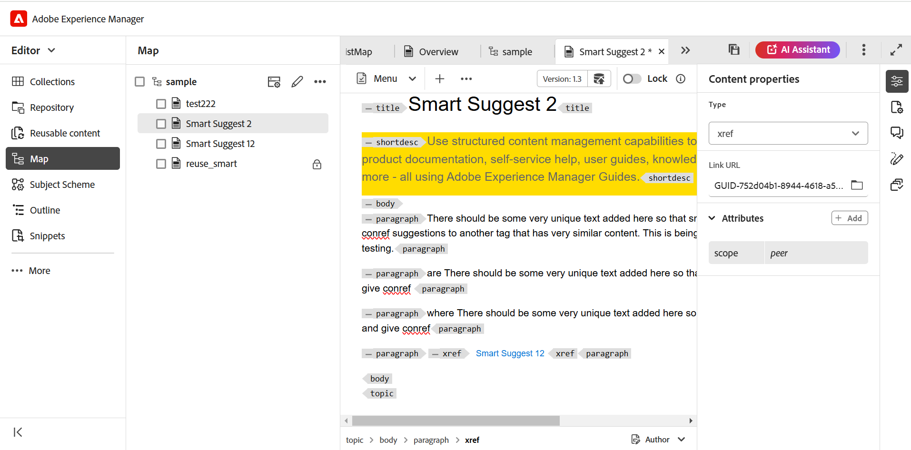

# 맵 대시보드의 AEM Sites 사전 설정 {#id205BE3008SW}

맵 대시보드에서 AEM Sites 사전 설정을 만들고 AEM Sites 출력을 생성하도록 구성할 수 있습니다.

AEM Sites 출력에 사용할 수 있는 옵션은 다음과 같습니다.

| AEM Sites 옵션 | 설명 |
| --- | --- |
| 출력 유형 | 생성하려는 출력의 유형입니다. 응답형 AEM Sites 출력을 생성하려면 AEM Sites 옵션을 선택합니다. |
| 설정 이름 | 생성 중인 AEM Sites 설정에 대한 수사적 이름을 지정합니다. 예를 들어 *내부 고객 출력* 또는 *최종 사용자 출력*&#x200B;을 지정할 수 있습니다. |
| 사이트 이름 | 출력이 AEM 저장소에 저장되는 사이트 이름입니다.  AEM 저장소의 노드가 여기에 지정된 이름으로 만들어집니다. 사이트 이름을 지정하지 않으면 사이트 노드가 DITA 맵 파일 이름으로 생성됩니다.  여기에서 지정한 사이트 이름은 브라우저 탭의 제목으로도 사용됩니다.  사이트 이름을 설정하는 동안 변수를 사용할 수도 있습니다. 변수 사용에 대한 자세한 내용은 [대상 경로, 사이트 이름 또는 파일 이름 옵션 설정에 변수 사용](generate-output-use-variables.md#id18BUG70K05Z)을 참조하십시오. |
| 디자인 | 출력을 생성하는 데 사용할 디자인 템플릿을 선택합니다.  사용자 지정 디자인 서식 파일을 사용하여 출력을 생성하는 방법에 대한 자세한 내용은 게시 관리자에게 문의하십시오. |
| 대상 경로 | 출력이 저장되는 AEM 저장소 내의 경로입니다. 최종 출력을 생성하는 동안 사이트 이름과 대상 경로가 결합됩니다. 예를 들어 사이트 이름을 `user-guide`(으)로 지정하고 대상 경로를 `/content/output/aem-guides`(으)로 지정하면 최종 출력이 `/content/output/aem-guides/user-guide` 노드 아래에 생성됩니다.  대상 경로를 설정하는 동안 변수를 사용할 수도 있습니다. 변수 사용에 대한 자세한 내용은 [대상 경로, 사이트 이름 또는 파일 이름 옵션 설정에 변수 사용](generate-output-use-variables.md#id18BUG70K05Z)을 참조하십시오. |
| 다음을 사용하여 조건 적용 | 다음 옵션 중 하나를 선택하십시오.  **적용되지 않음**: 게시된 출력에 조건을 적용하지 않으려면 이 옵션을 선택하십시오. **DITAVal 파일**: DITAVal 파일을 선택하여 조건부 콘텐츠를 생성합니다. 찾아보기 대화 상자를 사용하거나 파일 경로를 입력하여 여러 DITAVal 파일을 선택할 수 있습니다. 파일 이름 근처에 있는 교차 아이콘을 사용하여 제거합니다. DITAVal 파일은 지정된 순서대로 평가되므로 첫 번째 파일에 지정된 조건이 이후 파일에 지정된 조건과 일치하는 조건보다 우선합니다. 파일을 추가하거나 삭제하여 파일 순서를 유지할 수 있습니다. DITAVal 파일이 다른 위치로 이동되거나 삭제되는 경우 맵 대시보드에서 자동으로 삭제되지 않습니다. 파일이 이동되거나 삭제될 경우에 대비하여 위치를 업데이트해야 합니다. 파일 이름 위로 마우스를 가져가면 파일이 저장된 AEM 저장소의 경로를 볼 수 있습니다. DITAVal 파일만 선택할 수 있으며 다른 파일 유형을 선택한 경우 오류가 표시됩니다. **조건 사전 설정**: 출력을 게시하는 동안 조건을 적용하려면 드롭다운에서 조건 사전 설정을 선택합니다. 이 옵션은 DITA 맵 파일에 대한 조건을 추가한 경우에 표시됩니다. 조건부 설정은 DITA 맵 콘솔의 조건 사전 설정 탭에서 사용할 수 있습니다. 조건 사전 설정에 대한 자세한 내용은 [조건 사전 설정 사용](generate-output-use-condition-presets.md#id1825FL004PN)을 참조하세요. |
| 기존 출력 페이지 | 기존 페이지의 콘텐츠를 덮어쓰려면 **콘텐츠 덮어쓰기** 옵션을 선택하십시오. 이 옵션은 페이지의 콘텐츠 및 헤드 노드 아래에 있는 콘텐츠만 덮어씁니다. 이 옵션을 사용하면 콘텐츠를 혼합 게시할 수 있습니다. 이 옵션을 선택하면 게시된 출력에서 고립 페이지 삭제를 선택하는 옵션이 제공됩니다. 또한 AEM Sites 출력을 만들기 위한 *기본* 옵션입니다.  게시 중에 기존 페이지를 강제로 삭제하려면 **삭제 및 만들기** 옵션을 선택하십시오. 이 옵션은 페이지 노드를 해당 콘텐츠 및 그 아래의 모든 하위 페이지와 함께 삭제합니다. 출력 사전 설정의 디자인 템플릿을 변경했거나 대상에 이미 있는 추가 페이지를 제거하려면 이 옵션을 사용합니다. |
| 분리된 사이트 페이지 삭제 | **기존 출력 페이지** 설정에서 **콘텐츠 덮어쓰기**&#x200B;를 선택하면 이 옵션이 표시됩니다. 이 옵션을 선택하면 모든 고아 페이지가 게시된 AEM 사이트에서 삭제됩니다. 이 기능을 성공적으로 실행하려면 전체 DITA 맵을 게시하고 증분 게시를 사용하지 않아야 합니다.  항목 a.dita, b.dita 및 c.dita가 포함된 DITA 맵을 게시했다고 가정합니다. 맵을 다시 게시하기 전에 맵에서 b.dita 주제를 제거했습니다. 이제 이 옵션을 선택하면 b.dita와 관련된 모든 컨텐츠가 AEM Sites 출력에서 제거되고 a.dita 및 c.dita만 게시됩니다.  이 기능은 게시된 자식 맵을 제거하지 않습니다. 예를 들어 상위 맵에 하위 맵이 포함된 경우 전체 하위 맵을 제거하면 하위 맵 콘텐츠가 게시된 출력에서 삭제되지 않습니다. 그러나 하위 맵에서 주제를 제거하고 다시 게시하면 제거된 주제의 콘텐츠가 사이트 출력에서 삭제됩니다.  또한 참조된 콘텐츠가 있고 해당 콘텐츠가 다시 게시되기 전에 제거되면 참조된 콘텐츠의 데이터는 제거되지 않습니다.  **참고**: 삭제된 고아 페이지에 대한 정보도 출력 생성 로그에 캡처됩니다. 로그 파일 액세스에 대한 자세한 내용은 [로그 파일 보기 및 확인](generate-output-basic-troubleshooting.md#id1821I0Y0G0A__id1822G0P0CHS)을 참조하세요. |
| 임시 파일 유지 | DITA-OT에서 생성한 임시 파일을 유지하려면 이 옵션을 선택합니다. DITA-OT를 통해 출력을 생성하는 동안 오류가 발생하는 경우 임시 파일을 유지하려면 이 옵션을 선택합니다. 그런 다음 이러한 파일을 사용하여 출력 생성 오류를 해결할 수 있습니다.    출력을 생성한 후 **임시 파일 다운로드**  아이콘을 선택하여 임시 파일이 포함된 ZIP 폴더를 다운로드합니다.    **참고**: 생성 중에 파일 속성이 추가되면 출력 임시 파일에 해당 속성이 포함된 *metadata.xml* 파일도 포함됩니다. |
| 각 주제에 대해 별도의 PDF 생성 | 선택하면 DITA 맵의 모든 주제에 대해서도 PDF이 만들어집니다. 이 옵션을 선택하면 새로운 PDF 경로 분할 옵션이 표시됩니다.  PDF 경로 분할 필드에서 각 주제에 대해 생성된 PDF를 저장할 경로를 지정합니다.  **참고**: AEM Guides에서는 pdfx라는 DITA-OT 플러그인을 사용하여 각 주제에 대한 PDF을 생성합니다. 이 플러그인은 즉시 제공된 DITA-OT 패키지와 번들로 제공됩니다. 이 플러그인을 사용자 정의하여 요구 사항에 따라 PDF을 생성할 수 있습니다. 사용자 지정 DITA-OT 플러그인을 사용하는 경우 pdfx 플러그인을 통합하여 주제 수준의 PDF 생성 기능이 있는지 확인하십시오. |
| 사후 생성 워크플로 실행 | 이 옵션을 선택하면 AEM에 구성된 모든 워크플로우를 포함하는 새 사후 생성 워크플로우 드롭다운 목록이 표시됩니다. 출력 생성 워크플로우가 완료된 후 실행할 워크플로우를 선택해야 합니다. |
| 기준선 사용 | 선택한 DITA 맵에 대한 베이스라인을 생성한 경우 이 옵션을 선택하여 게시할 버전을 지정합니다.  **중요**: AEM 사이트에 대한 증분 출력을 생성하는 경우 연결된 기준선이 아닌 파일의 현재 버전을 사용하여 출력이 만들어집니다.  자세한 내용은 [기준선으로 작업](generate-output-use-baseline-for-publishing.md#id1825FI0J0PF)을 참조하세요. |
| 속성 | 메타데이터로 처리할 속성을 선택합니다. 이러한 등록 정보는 DITA 맵 또는 북맵 파일의 등록 정보 페이지에서 설정됩니다. 드롭다운 목록에서 선택한 속성이 **파일 속성** 필드 아래에 나타납니다. 속성 옆에 있는 교차 아이콘을 선택하여 제거합니다.   **참고**: 메타데이터 속성은 대/소문자를 구분합니다.  *기준선을 선택한 경우 속성 값은 선택한 기준선의 버전을 기반으로 합니다. * 기준선을 선택하지 않은 경우 속성의 값은 최신 버전을 기반으로 합니다.  DITA-OT 게시를 사용하여 메타데이터를 출력으로 전달할 수도 있습니다. 자세한 내용은 [DITA-OT를 사용하여 메타데이터를 출력으로 전달](pass-metadata-dita-ot.md#id21BJ00QD0XA)을 참조하세요.  **참고**: 속성 옵션에서 `cq:tags`을(를) 정의하지 않은 경우 게시를 위해 기준선을 선택했더라도 현재 작업 복사본에서 `cq:tags`의 값이 선택됩니다. |
| 맵 속성을 기본값으로 사용 | 선택하면 맵 파일에 대해 정의된 속성도 이러한 속성이 정의되지 않은 항목에 복사됩니다. 이 옵션을 사용하는 동안 다음 사항을 고려하십시오.  *문자열, 날짜 또는 긴(단일 및 다중 값) 속성만 AEM Sites 페이지에 전달할 수 있습니다. * String 형식 속성에 대한 메타데이터 값이 특수 문자(예: `@, #, " "`)를 지원하지 않습니다. * 이 옵션은 `Properties` 옵션과 함께 사용해야 합니다. |

## AEM Sites에 대한 추가 메모

### 맵 콘솔에서 문서 기반 출력 생성

맵 콘솔에서 하나 이상의 주제에 대한 AEM Sites 출력 또는 전체 DITA 맵을 생성할 수 있습니다. DITA 맵에 대한 출력 사전 설정을 만들어야 맵의 AEM Sites 출력을 쉽게 생성할 수 있습니다. 맵에서 몇 가지 주제를 업데이트한 경우 맵 콘솔의 해당 주제에 대해서만 AEM Sites 출력을 생성할 수도 있습니다. 자세한 내용은 [기술 자료 출력 생성](web-editor-article-publishing.md#id218CK0U019I)을 참조하세요.

### 다른 맵에서 연결 주제의 출력 생성

여러 폴더 및 DITA 맵에 걸쳐 큰 문서 세트가 있는 것은 매우 일반적인 시나리오입니다. 다양한 위치에서 연결된 콘텐츠를 게시하는 것은 매우 복잡해집니다. 기본적으로 모든 링크 `<xref>`은(는) `local` `@scope`(으)로 만들어집니다. 이러한 주제를 게시하는 것은 주제에 대한 직접 링크를 사용하므로 문제를 수반하지 않습니다. 주제가 현재 DITA 맵 외부에 있는 경우 링크에 연결된 콘텐츠가 표시되지 않습니다.

콘텐츠를 연결하는 또 다른 방법은 `peer` `@scope`을(를) 사용하여 링크를 만드는 것입니다. 이러한 컨텐트의 경우 파일 제목과 DITA 맵의 게시 컨텍스트에서 링크된 주제에 대해 구성된 컨텍스트를 선택하여 런타임 시 링크가 해결됩니다. 다음 스크린샷은 `peer` `@scope`이(가) 있는 링크의 속성 패널을 보여 줍니다.

{width="800" align="left"}

Adobe Experience Manager Guides을 사용하면 각 출력 사전 설정에 대한 게시 컨텍스트를 설정할 수 있으므로 복잡한 맵과 다른 맵의 다른 주제에 연결되는 주제를 간단히 게시할 수 있습니다.

게시 컨텍스트를 사용하면 특정 출력을 게시하기 위해 사용할 맵의 주제를 지정할 수 있습니다. 예를 들어 이것을 이해해봅시다. 샘플 a, 샘플 b, 샘플 c, 샘플 d의 4개의 폴더가 있다고 가정해 보겠습니다. 각 폴더에는 DITA 맵(DITA 맵 A, DITA 맵 B, DITA 맵 C 및 DITA 맵 D)이 포함되어 있습니다. DITA 맵 A의 주제가 DITA 맵 B, C 또는 D의 주제에 링크될 때 교차 맵 링크가 발생합니다. 다음 스크린샷에서 샘플 개념 주제에는 다른 DITA 맵의 일부인 파일에 대한 \(또는 참조\) 링크가 포함되어 있습니다.

{width="350" align="left"}

이제 이 항목을 포함하는 맵 파일에 대한 AEM Sites 게시 설정을 구성할 때 게시 중에 연결된 컨텐츠에 사용할 게시 컨텍스트를 선택할 수 있습니다. 게시 컨텍스트는 DITA 맵과 해당 출력 사전 설정의 조합입니다. 그러면 출력 사전 설정에 특정 버전의 콘텐츠 및 조건부 사전 설정이 포함됩니다. 이 DITA 맵, 출력 사전 설정, \(files\) 버전 및 조건의 전체 조합은 연결된 맵의 게시 컨텍스트를 정의합니다.

상호 연결된 파일의 게시 컨텍스트를 지정하려면 다음 단계를 수행하십시오.

1. 게시할 DITA 맵의 **출력 사전 설정** 탭을 엽니다.

1. **AEM 사이트** 출력 사전 설정을 선택합니다.

   AEM 사전 설정 및 게시 컨텍스트 탭이 표시됩니다.

   {width="800" align="left"}

1. **게시 컨텍스트** 탭을 엽니다.

   종속 항목 목록이 표시됩니다. 이러한 항목은 현재 맵의 일부 항목에서 연결된 항목이지만 다른 일부 DITA 맵에서 사용할 수 있습니다.

   >[!NOTE]
   >
   > 게시 컨텍스트 탭에는 `peer` `@scope`을(를) 사용하여 연결된 항목만 표시됩니다. `local` `@scope`이(가) 있는 링크의 경우 게시 컨텍스트를 지정할 필요가 없습니다.

   기본적으로 연결된 모든 주제에는 최신 출력 사전 설정과 맵이 선택되어 있습니다.

   {width="800" align="left"}

1. DITA 맵과 사전 설정의 기본 선택을 변경하려면 **편집** \(기본 도구 모음에서\)를 선택합니다.

1. 맵에서 각 종속 파일의 가장 최근에 게시된 출력을 사용하려면 **모든 종속 항목에 대해 가장 최근에 생성된 게시 컨텍스트 사용**&#x200B;을 선택합니다.

1. **상위 맵** 드롭다운 목록에서 현재 맵의 출력을 연결할 출력이 있는 맵 파일을 선택합니다.

   맵 파일을 선택하면 맵의 UUID가 상위 맵 UUID 열에 표시됩니다. 선택한 맵과 연관된 [출력 사전 설정]이 [상위 맵 사전 설정] 목록에 나열됩니다.

1. **상위 맵의 사전 설정** 드롭다운 목록에서 현재 맵의 출력을 연결할 출력 사전 설정을 선택합니다.

1. 모든 종속 항목에 필요한 맵과 해당 출력 사전 설정을 선택하고 **완료**&#x200B;를 선택합니다.

   이제 종속 항목에 대한 컨텍스트가 설정됩니다. 현재 맵의 출력을 생성할 수 있습니다. 출력 생성에 대한 자세한 내용은 맵 콘솔에서 [DITA 맵에 대한 출력 생성](generate-output-for-a-dita-map.md#)을 확인하십시오.

### 혼합 게시

AEM Guides에서는 기존 AEM 사이트 내에서 DITA 콘텐츠 게시를 지원합니다. 예를 들어 기존 사이트가 있는 경우 AEM Sites 출력을 사용하여 해당 사이트에 DITA 콘텐츠만 게시할 수 있습니다. 이 프로세스에서는 기존 비DITA 컨텐트를 게시 프로세스에 의해 수정하지 않습니다. DITA 콘텐츠만 게시하도록 사이트를 설정하는 방법에 대한 자세한 내용은 게시 관리자에게 문의하십시오.

### 게시 `conref`

콘텐츠에서 `conref`을(를) 사용하는 경우 원본 \(또는 참조\) 주제의 콘텐츠와 함께 일반 콘텐츠 또는 포함된 콘텐츠로 게시됩니다. `conref` 콘텐츠는 기본 콘텐츠와 함께 렌더링되며 이에 대해 별도의 사이트 페이지가 만들어지지 않습니다. `conref`에서 참조하는 콘텐츠를 검색할 때 `conref` 콘텐츠가 포함된 기본 항목이나 페이지만 검색 결과에 표시됩니다.

>[!NOTE]
>
>AEM Guides 버전 3.5 이하를 사용하여 `conref` 콘텐츠에 대한 개별 페이지를 생성한 경우 [고아 사이트 페이지 삭제](#delete-orphan-page-aem-site) 옵션을 사용하여 해당 페이지를 정리/삭제하는 것이 좋습니다.

### 콘텐츠 내에서 문자열 검색

AEM Sites 출력에서 문자열을 검색할 수 있습니다. 기본적으로 제목에서만 문자열을 검색할 수 있습니다. 컨텐츠 또는 AEM Sites 출력의 본문에서 문자열을 검색하려면 시스템 관리자에게 문의하여 flattening.enabled 속성을 활성화하십시오.

{width="650" align="left"}

자세한 내용은 Adobe Experience Manager Guides 설치 및 구성 안내서에서 *AEM 사이트 노드 구조의 병합 구성* 섹션을 참조하십시오.

**상위 항목:**[&#x200B;출력 사전 설정 이해](generate-output-understand-presets.md)
