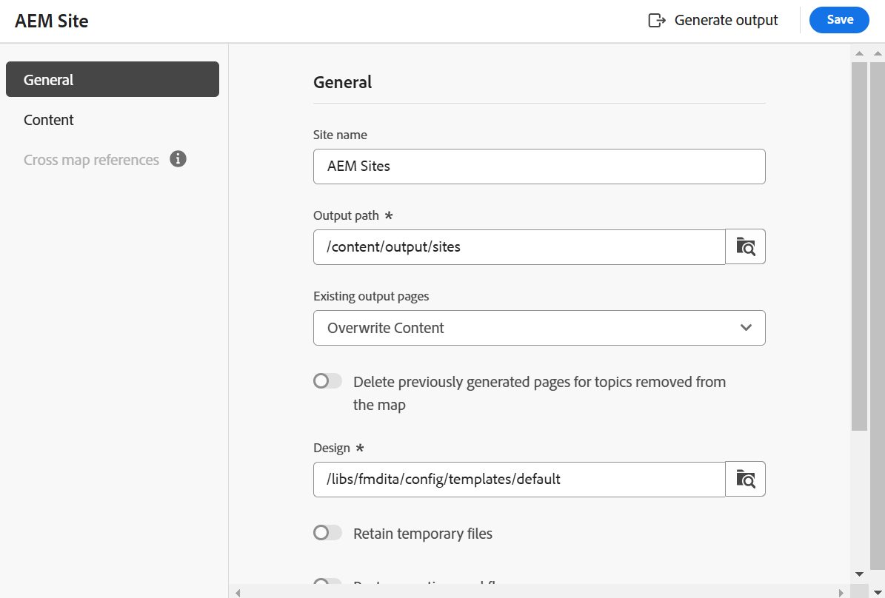

# 맵 콘솔의 AEM Sites 사전 설정

맵 콘솔에서 AEM Sites 사전 설정을 만들고 AEM Sites 출력을 생성하도록 구성할 수 있습니다. AEM Sites 출력을 만드는 방법에는 두 가지가 있습니다.

- [복합 구성 요소 매핑 사용](#use-composite-component-mapping)
- [기존 구성 요소 매핑 사용](#use-legacy-component-mapping)

>[!TIP]
>
> 성능을 향상시키려면 Experience Manager Guides 2502 릴리스와 최신 버전에서 사용할 수 있는 복합 구성 요소 매핑을 사용하는 것이 좋습니다.

## 복합 구성 요소 매핑 사용

복합 구성 요소 매핑은 기존 구성 요소 매핑에 비해 AEM Sites에 더 빠르고 확장 가능한 게시를 제공합니다. AEM 템플릿 편집기를 사용하여 요구 사항에 따라 사용자 정의할 수 있는 편집 가능한 템플릿과 함께 제공됩니다. 템플릿은 WCM 핵심 구성 요소와 특수 `guides-components`을(를) 혼합하여 최종 사용자가 AEM Sites 페이지에서 최상의 경험을 얻을 수 있도록 합니다. 복합 구성 요소 매핑 방법을 사용하여 기존 템플릿을 사용자 정의할 수도 있습니다.

Experience Manager Guides은 AEM Sites을 만들기 위한 사전 정의된 템플릿을 제공합니다. 이러한 템플릿을 사용하면 컨텐츠 레이아웃 및 구조의 일관성을 보장할 수 있습니다.
- 미리 정의된 템플릿을 기반으로 [홈 페이지를 만듭니다](../cs-install-guide/download-install-aem-sites-templates-cs.md#create-a-home-page-using-the-template).
- [주제 템플릿을 편집](../cs-install-guide/download-install-aem-sites-templates-cs.md#package-installation)하고 요구 사항에 따라 스타일을 적용할 수 있습니다.
- [기존 AEM Sites 템플릿을 사용자 지정](../cs-install-guide/download-install-aem-sites-templates-cs.md#customize-existing-aem-sites-templates)할 수도 있습니다.

**AEM Sites 사전 설정 만들기**

복합 구성 요소 매핑을 사용하여 AEM Sites 사전 설정을 만들려면 다음 단계를 수행하십시오.

1. [맵 콘솔에서 DITA 맵 파일을 엽니다](./open-files-map-console.md).
1. **출력 사전 설정** 패널에서 + 아이콘을 선택하여 출력 사전 설정을 만듭니다.
1. **새 출력 사전 설정** 대화 상자의 **유형** 드롭다운에서 **AEM Sites**&#x200B;을(를) 선택합니다.
1. **이전 구성 요소 매핑 사용** 옵션을 선택 취소합니다.
1. **현재 폴더 프로필에 추가** 옵션을 선택하여 현재 폴더 프로필 내에 출력 사전 설정을 만듭니다. 은(는) 폴더 프로필 수준의 사전 설정을 나타냅니다.

   [전역 및 폴더 프로필 출력 사전 설정 관리](./web-editor-manage-output-presets.md)에 대해 자세히 알아보세요.

1. **추가**&#x200B;를 선택합니다.

   AEM Sites용 사전 설정이 생성됩니다.

   {width="300" align="left"}

<!-----------------------
### Generate the AEM Sites output using the templates

Once, the preset is created, you can configure the various options available for AEM Sites output generation. Experience Manager Guides allows you to use the out of the box templates or add your own AEM Sites templates.

You can configure the Out-of-the-box Sites template  in two ways:

- In the **Sites** field, select the AEM sites where you want to publish your output.  For example, `AEMG Docs`.

    The **Publish path** and the **Topic page template** options are automatically set in the dropdown.  For example,  `AEMG-Docs-Site/en/docs/product1` and `Topic page` are set respectively. You can also choose the other options from the dropdown.

- Or, Select the **Use Sites path** option to select the complete Sites path, and then select a **Map page template**. 

    You can browse a predefined Sites path or specify a custom path even if the specified path has not been pre-created within the AEM Sites structure. In such cases, the system creates the necessary structure during the publishing process by using the selected map homepage template.

   For example, you can specify the path `/content/AEMG-Docs-Site/en/docs/product4` where the `product4`does not exist in the strcuture. In this case, the system automatically creates `product4` using the selected **Map page template** and publish the output within this newly created page. 
   
   The **Topic page template** is automatically set as `Topic Page`. However, you can choose to select other available options in the dropdown.

--->

### 합성 구성 요소 매핑을 위한 AEM Sites 사전 설정 구성

>[!NOTE]
>
> Experience Manager Guides용 AEM Sites 사전 설정을 구성하기 전에 관리자가 템플릿을 사용하여 AEM Sites 구조를 만들어야 합니다.

- **온-프레미스 소프트웨어**: 온-프레미스 소프트웨어용 [AEM Sites 템플릿을 다운로드하고 설치](../install-guide/download-install-aem-sites-templates.md)하는 방법에 대해 자세히 알아보세요.
- **Cloud Service**: Cloud Service용 [AEM Sites 템플릿을 다운로드하고 설치](../cs-install-guide/download-install-aem-sites-templates-cs.md)하는 방법에 대해 자세히 알아보세요.

맵 콘솔에서 복합 구성 요소 매핑에 대한 사전 설정된 구성 옵션은 다음 탭 아래에 구성됩니다.

- 일반
- 콘텐츠
- 주제 목록
- 교차 맵 참조

{width="650" align="left"}

**일반**

**일반** 탭에는 다음 구성 옵션이 포함되어 있습니다.

| AEM Sites 옵션 | 설명 |
| --- | --- |
| 사이트 경로 사용 | 이 옵션을 사용하여 콘텐츠를 Experience Manager 사이트에 게시합니다. |
| 사이트 경로 | **이 옵션은**&#x200B;사이트 경로 사용&#x200B;**옵션**&#x200B;을 선택하면 나타납니다. 미리 정의된 Experience Manager 사이트 경로를 찾아보거나 출력을 게시할 사용자 지정 경로를 지정합니다. **사이트 사용 옵션**&#x200B;을 사용하면 지정된 경로가 AEM Sites 구조 내에서 미리 만들어지지 않았더라도 전체 게시 경로를 지정할 수 있습니다. 이러한 경우 시스템은 선택한 맵 홈 페이지 템플릿을 사용하여 게시 프로세스 중에 필요한 구조를 만듭니다. |
| 페이지 템플릿 매핑 | **이 옵션은**&#x200B;사이트 경로 사용&#x200B;**옵션**&#x200B;을 선택하면 나타납니다. 맵 홈 페이지에 적용할 템플릿을 선택합니다. |
| Site | 콘텐츠를 게시할 Experience Manager Sites의 이름입니다. 드롭다운의 옵션은 AEM Sites에서 사용할 수 있는 사이트 목록을 기반으로 채워집니다.  새로 고침&#x200B;**&#x200B;**&#x200B;새로 고침 아이콘 |
| 게시 경로 | 출력이 저장되는 AEM 저장소 내의 경로입니다. 게시 경로는 홈 페이지 템플릿을 기반으로 생성된 페이지를 포함하는 모든 경로로 채워집니다. DITA 맵의 AEM Sites 출력이 이 경로 아래에 생성됩니다.  예를 들어 사이트를 `AEMG-Docs`(으)로 지정하고 게시 경로를 `aemg-docs-en/docs/product-abc.`(으)로 지정하면 AEM Sites 출력이 `aemg-docs-en/docs/product-abc/`의 `crx/de` 노드 아래에 생성됩니다. |
| 주제 페이지 템플릿 | 모든 출력 주제에 적용할 템플릿을 선택합니다. |
| 다음을 기반으로 페이지 이름 생성 | **주제 파일 이름**: DITA 주제의 파일 이름을 사용하여 사이트 URL을 만듭니다.   **주제 제목**: DITA 주제의 제목을 사용하여 Experience Manager 사이트 이름을 만듭니다. |
| 이전에 생성된 페이지 정리 | - **맵에서 제거된 항목에 대해 이전에 생성된 페이지를 삭제합니다**: DTIA 맵의 구조가 변경되면 이 옵션을 사용하여 제거된 항목에 대해 이전에 생성된 페이지를 제거할 수 있습니다. 이 기능은 전체 맵 게시에만 사용할 수 있습니다.  항목 a.dita, b.dita 및 c.dita가 포함된 DITA 맵을 게시했다고 가정합니다. 맵을 다시 게시하기 전에 맵에서 b.dita 주제를 제거했습니다. 이제 이 옵션을 선택하면 b.dita와 관련된 모든 컨텐츠가 AEM Sites 출력에서 제거되고 a.dita 및 c.dita만 게시됩니다.  **참고**: 삭제된 페이지에 대한 정보도 출력 생성 로그에 캡처됩니다. 로그 파일에 액세스하는 방법에 대한 자세한 내용은 [로그 파일을 보고 확인](generate-output-basic-troubleshooting.md#id1821I0Y0G0A__id1822G0P0CHS)하세요.   **주의**: 항목을 삭제하면 게시된 사이트에서 페이지를 사용할 수 없게 됩니다. 따라서 주제가 삭제되기 전에 경고가 나타납니다. 삭제를 확인해야 합니다.  - **이 경로에 있는 다른 원본에서 만든 모든 페이지를 삭제**: 이 옵션을 선택하면 다른 지도, 개별 항목 또는 다른 원본에서 이 경로에 게시된 모든 페이지가 삭제됩니다. 또한 게시된 사이트에서 페이지를 사용할 수 없게 됩니다. 따라서 주제가 삭제되기 전에 경고가 나타납니다. 삭제를 확인해야 합니다. |
| 사후 생성 워크플로 | 이 옵션을 선택하면 AEM에 구성된 모든 워크플로우를 포함하는 새 사후 생성 워크플로우 드롭다운 목록이 표시됩니다. 출력 생성 워크플로우가 완료된 후 실행할 워크플로우를 선택해야 합니다. |

**콘텐츠**

**콘텐츠** 탭에는 다음 구성 옵션이 포함되어 있습니다.

| AEM Sites 옵션 | 설명 |
| --- | --- |
| 기준선 사용 | 선택한 DITA 맵에 대한 베이스라인을 생성한 경우 이 옵션을 선택하여 게시할 버전을 지정합니다.  자세한 내용은 [기준선으로 작업](generate-output-use-baseline-for-publishing.md#id1825FI0J0PF)을 참조하세요. |
| 조건부 필터링 | 다음 옵션 중 하나를 선택하십시오.  **없음**: 게시된 출력에 조건을 적용하지 않으려면 이 옵션을 선택하십시오. **DITAVAL 사용**: DITAVal 파일을 선택하여 조건부 콘텐츠를 생성합니다. 찾아보기 대화 상자를 사용하거나 파일 경로를 입력하여 여러 DITAVal 파일을 선택할 수 있습니다. 파일 이름 근처에 있는 교차 아이콘을 사용하여 제거합니다. DITAVal 파일은 지정된 순서대로 평가되므로 첫 번째 파일에 지정된 조건이 이후 파일에 지정된 조건과 일치하는 조건보다 우선합니다. 파일을 추가하거나 삭제하여 파일 순서를 유지할 수 있습니다. DITAVal 파일이 다른 위치로 이동되거나 삭제되는 경우 맵 대시보드에서 자동으로 삭제되지 않습니다. 파일이 이동되거나 삭제될 경우에 대비하여 위치를 업데이트해야 합니다. 파일 이름 위로 마우스를 가져가면 파일이 저장된 AEM 저장소의 경로를 볼 수 있습니다. DITAVal 파일만 선택할 수 있으며 다른 파일 유형을 선택한 경우 오류가 표시됩니다. **조건 사전 설정**: 출력을 게시하는 동안 조건을 적용하려면 드롭다운에서 조건 사전 설정을 선택합니다. 이 옵션은 DITA 맵 파일에 대한 조건을 추가한 경우에 표시됩니다. 조건부 설정은 DITA 맵 콘솔의 조건 사전 설정 탭에서 사용할 수 있습니다. 조건 사전 설정에 대해 자세히 알아보려면 [조건 사전 설정 사용](generate-output-use-condition-presets.md#id1825FL004PN)을 확인하세요. |
| 추가 DITA-OT 명령줄 인수 | 출력을 생성하는 동안 DITA-OT에서 처리할 추가 인수를 지정합니다. DITA-OT에서 지원되는 명령줄 인수에 대한 자세한 내용은 [DITA-OT 설명서](https://www.dita-ot.org/)를 참조하십시오. |
| 메타데이터    파일(Assets) 속성 | 메타데이터로 처리할 속성을 선택합니다. 이러한 등록 정보는 DITA 맵 또는 북맵 파일의 등록 정보 페이지에서 설정됩니다. 드롭다운 목록에서 선택한 속성이 **파일 속성** 필드 아래에 나타납니다. 속성 옆에 있는 교차 아이콘을 선택하여 제거합니다.   **참고**: 메타데이터 속성은 대/소문자를 구분합니다.  *기준선을 선택한 경우 속성 값은 선택한 기준선의 버전을 기반으로 합니다. * 기준선을 선택하지 않은 경우 속성의 값은 최신 버전을 기반으로 합니다.  DITA-OT 게시를 사용하여 메타데이터를 출력으로 전달할 수도 있습니다. 자세한 내용을 보려면 [DITA-OT를 사용하여 메타데이터를 출력으로 전달](pass-metadata-dita-ot.md#id21BJ00QD0XA)하십시오.  **참고**: 속성 옵션에서 `cq:tags`을(를) 정의하지 않은 경우 게시를 위해 기준선을 선택했더라도 현재 작업 복사본에서 `cq:tags`의 값이 선택됩니다. |
| 메타데이터    맵 속성을 대체 항목으로 사용 | 선택하면 맵 파일에 대해 정의된 속성도 이러한 속성이 정의되지 않은 항목에 복사됩니다. 이 옵션을 사용하는 동안 다음 사항을 고려하십시오.  *문자열, 날짜 또는 긴(단일 및 다중 값) 속성만 AEM 사이트 페이지에 전달할 수 있습니다. * String 형식 속성에 대한 메타데이터 값이 특수 문자(예: `@, #, " "`)를 지원하지 않습니다. * 이 옵션은 `Properties` 옵션과 함께 사용해야 합니다. |

**주제 목록**

**주제 목록** 탭에는 DITA 맵의 현재 작업 복사본에 있는 주제 목록이 표시됩니다. 기본적으로 모든 주제가 포함됩니다. 특정 주제를 선택하고 해당 주제에 대해서만 AEM Sites 출력을 생성할 수 있습니다. 예를 들어 전체 DITA 맵을 게시하는 대신 해당 주제만 게시할 수 있도록 일부 주제를 업데이트했습니다.

 {align="left"}

>[!NOTE]
>
> **콘텐츠** 탭에서 기준선을 선택하면 항목 목록에 첨부된 기준선의 주제 및 해당 버전이 표시됩니다. 또한 맵 구조를 변경하지 않는 경우에만 항목 목록의 증분 게시를 사용해야 합니다. 맵 구조/TOC가 변경된 경우 TOC를 업데이트하려면 전체 맵을 한 번 게시해야 합니다.

**교차 맵 참조**

이 목록에는 `scope ="peer"`의 교차 맵 참조가 포함된 항목이 포함되어 있습니다. 다른 DITA 맵에서 사용할 수 있는 주제에 대해 `scope="peer"`을(를) 사용하는 교차 맵 참조 목록에 대한 게시 컨텍스트를 지정할 수 있습니다. 이 탭은 Experience Manager Guides(UUID) 버전을 사용하는 경우에 나타납니다.

자세한 내용은 아래의 [연결된 항목 작업](#working-with-linked-topics) 섹션을 참조하십시오.

구성이 완료되면 사전 설정에 수행된 변경 내용을 저장하고 **생성**&#x200B;을 선택하여 해당 맵에 대한 AEM Sites을 생성합니다.

>[!NOTE]
>
> AEM 사이트에 콘텐츠를 처음 게시하는 경우 사이트 수준에서 페이지를 게시하는 것이 좋습니다. 이렇게 하면 CSS 중단 없이 **Publish** 인스턴스에 출력이 올바르게 표시됩니다.

## 기존 구성 요소 매핑 사용

기존 구성 요소 매핑을 사용하여 AEM Sites 사전 설정을 만드는 단계는 위의 [구성 요소 매핑](#use-composite-component-mapping) 섹션에 설명된 것과 동일합니다. 그러나 사전 설정을 만드는 동안 **새 출력 사전 설정** 대화 상자에서 **기존 구성 요소 매핑 사용** 옵션을 선택해야 합니다.

 {width="300" align="left"}

맵 콘솔에서 레거시 구성 요소 매핑의 사전 설정 구성 옵션이 다음 탭에 구성됩니다.

- 일반
- 콘텐츠
- 교차 맵 참조

{width="500" align="left"}

**일반**

**일반** 탭에는 다음 구성 옵션이 포함되어 있습니다.

| AEM Sites 옵션 | 설명 |
| --- | --- |
| 사이트 이름 | 출력이 AEM 저장소에 저장되는 사이트 이름입니다.  AEM 저장소의 노드가 여기에 지정된 이름으로 만들어집니다. 사이트 이름을 지정하지 않으면 사이트 노드가 DITA 맵 파일 이름으로 생성됩니다.  여기에서 지정한 사이트 이름은 브라우저 탭의 제목으로도 사용됩니다.  사이트 이름을 설정하는 동안 변수를 사용할 수도 있습니다. |
| 출력 경로 | 출력이 저장되는 AEM 저장소 내의 경로입니다. 최종 출력을 생성하는 동안 사이트 이름과 출력 경로가 결합됩니다. 예를 들어 사이트 이름을 `user-guide`(으)로 지정하고 출력 경로를 `/content/output/aem-guides`(으)로 지정하면 최종 출력이 `/content/output/aem-guides/user-guide` 노드 아래에 생성됩니다.  출력 경로를 설정하는 동안 변수를 사용할 수도 있습니다. |
| 기존 출력 페이지 | 기존 페이지의 콘텐츠를 덮어쓰려면 **콘텐츠 덮어쓰기** 옵션을 선택하십시오. 이 옵션은 페이지의 콘텐츠 및 헤드 노드 아래에 있는 콘텐츠만 덮어씁니다. 이 옵션을 사용하면 콘텐츠를 혼합 게시할 수 있습니다. 이 옵션을 선택하면 게시된 출력에서 고립 페이지 삭제를 선택하는 옵션이 제공됩니다. 또한 AEM Sites 출력을 만들기 위한 *기본* 옵션입니다.  게시 중에 기존 페이지를 강제로 삭제하려면 **삭제 및 만들기** 옵션을 선택하십시오. 이 옵션은 페이지 노드를 해당 콘텐츠 및 그 아래의 모든 하위 페이지와 함께 삭제합니다. 출력 사전 설정의 디자인 템플릿을 변경했거나 대상에 이미 있는 추가 페이지를 제거하려면 이 옵션을 사용합니다. |
| 맵에서 제거된 주제에 대해 이전에 생성된 페이지 삭제 | DTIA 맵의 구조가 변경되는 경우 이 옵션을 사용하여 제거된 주제에 대해 이전에 생성된 페이지를 제거할 수 있습니다. 이 기능은 전체 맵 게시에만 사용할 수 있습니다.  항목 a.dita, b.dita 및 c.dita가 포함된 DITA 맵을 게시했다고 가정합니다. 맵을 다시 게시하기 전에 맵에서 b.dita 주제를 제거했습니다. 이제 이 옵션을 선택하면 b.dita와 관련된 모든 컨텐츠가 AEM Sites 출력에서 제거되고 a.dita 및 c.dita만 게시됩니다.  **참고**: 삭제된 페이지에 대한 정보도 출력 생성 로그에 캡처됩니다. 로그 파일에 액세스하는 방법에 대한 자세한 내용은 [로그 파일을 보고 확인](generate-output-basic-troubleshooting.md#id1821I0Y0G0A__id1822G0P0CHS)하세요.   **주의**: 항목을 삭제하면 게시된 사이트에서 페이지를 사용할 수 없게 됩니다. 따라서 주제가 삭제되기 전에 경고가 나타납니다. 삭제를 확인해야 합니다. |
| 디자인 | 출력을 생성하는 데 사용할 디자인 템플릿을 선택합니다.  사용자 지정 디자인 서식 파일을 사용하여 출력을 생성하는 방법에 대한 자세한 내용은 게시 관리자에게 문의하십시오. |
| 사후 생성 워크플로 | 이 옵션을 선택하면 AEM에 구성된 모든 워크플로우를 포함하는 새 사후 생성 워크플로우 드롭다운 목록이 표시됩니다. 출력 생성 워크플로우가 완료된 후 실행할 워크플로우를 선택해야 합니다. |
| 임시 파일 유지 | DITA-OT에서 생성한 임시 파일을 유지하려면 이 옵션을 선택합니다. DITA-OT를 통해 출력을 생성하는 동안 오류가 발생하는 경우 임시 파일을 유지하려면 이 옵션을 선택합니다. 그런 다음 이러한 파일을 사용하여 출력 생성 오류를 해결할 수 있습니다.    출력을 생성한 후 **임시 파일 다운로드**  아이콘을 선택하여 임시 파일이 포함된 ZIP 폴더를 다운로드합니다.    **참고**: 생성 중에 파일 속성이 추가되면 출력 임시 파일에 해당 속성이 포함된 *metadata.xml* 파일도 포함됩니다. |

**콘텐츠**

{width="650" align="left"}

**콘텐츠** 탭에는 다음 구성 옵션이 포함되어 있습니다.

| AEM Sites 옵션 | 설명 |
| --- | --- |
| 기준선 사용 | 선택한 DITA 맵에 대한 베이스라인을 생성한 경우 이 옵션을 선택하여 게시할 버전을 지정합니다.  자세한 내용은 [기준선으로 작업](./web-editor-baseline.md)을 참조하세요. |
| 조건부 필터링 | 다음 옵션 중 하나를 선택하십시오.  **없음**: 게시된 출력에 조건을 적용하지 않으려면 이 옵션을 선택하십시오. **DITAVAL 사용**: DITAVal 파일을 선택하여 조건부 콘텐츠를 생성합니다. 찾아보기 대화 상자를 사용하거나 파일 경로를 입력하여 여러 DITAVal 파일을 선택할 수 있습니다. 파일 이름 근처에 있는 교차 아이콘을 사용하여 제거합니다. DITAVal 파일은 지정된 순서대로 평가되므로 첫 번째 파일에 지정된 조건이 이후 파일에 지정된 조건과 일치하는 조건보다 우선합니다. 파일을 추가하거나 삭제하여 파일 순서를 유지할 수 있습니다. DITAVal 파일이 다른 위치로 이동되거나 삭제되는 경우 맵 대시보드에서 자동으로 삭제되지 않습니다. 파일이 이동되거나 삭제될 경우에 대비하여 위치를 업데이트해야 합니다. 파일 이름 위로 마우스를 가져가면 파일이 저장된 AEM 저장소의 경로를 볼 수 있습니다. DITAVal 파일만 선택할 수 있으며 다른 파일 유형을 선택한 경우 오류가 표시됩니다. **조건 사전 설정**: 출력을 게시하는 동안 조건을 적용하려면 드롭다운에서 조건 사전 설정을 선택합니다. 이 옵션은 DITA 맵 파일에 대한 조건을 추가한 경우에 표시됩니다. 조건부 설정은 DITA 맵 콘솔의 조건 사전 설정 탭에서 사용할 수 있습니다. 조건 사전 설정에 대해 자세히 알아보려면 [조건 사전 설정 사용](generate-output-use-condition-presets.md#id1825FL004PN)을 확인하세요. |
| 메타데이터    파일(Assets) 속성 | 메타데이터로 처리할 속성을 선택합니다. 이러한 등록 정보는 DITA 맵 또는 북맵 파일의 등록 정보 페이지에서 설정됩니다. 드롭다운 목록에서 선택한 속성이 **파일 속성** 필드 아래에 나타납니다. 속성 옆에 있는 교차 아이콘을 선택하여 제거합니다.   **참고**: 메타데이터 속성은 대/소문자를 구분합니다.  *기준선을 선택한 경우 속성 값은 선택한 기준선의 버전을 기반으로 합니다. * 기준선을 선택하지 않은 경우 속성의 값은 최신 버전을 기반으로 합니다.  DITA-OT 게시를 사용하여 메타데이터를 출력으로 전달할 수도 있습니다. 자세한 내용을 보려면 [DITA-OT를 사용하여 메타데이터를 출력으로 전달](pass-metadata-dita-ot.md#id21BJ00QD0XA)하십시오.  **참고**: 속성 옵션에서 `cq:tags`을(를) 정의하지 않은 경우 게시를 위해 기준선을 선택했더라도 현재 작업 복사본에서 `cq:tags`의 값이 선택됩니다. |
| 메타데이터    맵 속성을 대체 항목으로 사용 | 선택하면 맵 파일에 대해 정의된 속성도 이러한 속성이 정의되지 않은 항목에 복사됩니다. 이 옵션을 사용하는 동안 다음 사항을 고려하십시오.  *문자열, 날짜 또는 긴(단일 및 다중 값) 속성만 AEM 사이트 페이지에 전달할 수 있습니다. * String 형식 속성에 대한 메타데이터 값이 특수 문자(예: `@, #, " "`)를 지원하지 않습니다. * 이 옵션은 `Properties` 옵션과 함께 사용해야 합니다. |

**교차 맵 참조**

이 목록에는 `scope ="peer"`의 교차 맵 참조가 포함된 항목이 포함되어 있습니다. 다른 DITA 맵에서 사용할 수 있는 주제에 대해 `scope="peer"`을(를) 사용하는 교차 맵 참조 목록에 대한 게시 컨텍스트를 지정할 수 있습니다. 이 탭은 Experience Manager Guides(UUID) 버전을 사용하는 경우에 나타납니다.

자세한 내용은 아래의 [연결된 항목 작업](#working-with-linked-topics) 섹션을 참조하십시오.

## 연결된 항목 작업

Experience Manager Guides에서는 `peer @scope`을(를) 사용하여 주제 참조를 만들 수 있습니다. 그런 다음 AEM Sites 사전 설정에서 이러한 참조의 게시 컨텍스트를 정의하고 마지막으로 연결된 주제의 출력을 생성할 수 있습니다.

자세한 내용은 [다른 맵에서 연결 주제의 출력 생성](../user-guide/generate-output-aem-site.md#generate-output-linking-topics-from-other-maps)을 참조하십시오.

상호 연결된 파일의 게시 컨텍스트를 지정하려면 다음 단계를 수행하십시오.

1. **교차 맵 참조** 탭을 엽니다. 이 탭을 보려면 `<xrefs>`에 고유 ID가 있는지 확인하십시오. `<xrefs>`에 대한 고유 ID는 ID가 없는 경우 이전 콘텐츠를 편집/저장할 때 자동으로 생성됩니다.

   다음의 경우 교차 맵 연결을 볼 수 없습니다.
   - 4.6 릴리스 이전에 만든 사전 설정의 경우 상호 참조 탭이 비활성화되고 도구 설명 **맵 대시보드 참조**&#x200B;가 나타납니다.
   - 맵 대시보드에서 만든 사전 설정의 경우 **맵 대시보드를 참조하세요** 도구 설명이 나타납니다.
   - OOTB 사전 설정의 경우 **대시보드 매핑 참조** 도구 설명이 나타납니다.
   - 전역 사전 설정의 경우 이 전역 사전 설정의 로컬 복사본을 만들어 교차 맵 참조를 설정합니다.

1. 주제 및 해당 참조의 목록이 표시됩니다

   >[!NOTE]
   >
   >**교차 맵 참조** 탭에는 `scope="peer"`을(를) 사용하여 연결된 항목만 표시됩니다. `scope="local"`이(가) 있는 링크의 경우 게시 컨텍스트를 지정할 필요가 없습니다.

   연결된 모든 주제에는 기본적으로 최신 출력 사전 설정과 맵이 선택되어 있습니다. 연결된 모든 항목의 게시 컨텍스트는 기본적으로 `<Most recently generated>` 맵으로 설정되어 있습니다.

   

1. 맵에서 각 종속 파일의 가장 최근에 게시된 출력을 사용하려면 모든 종속 항목에 대해 **가장 최근에 생성된 게시 컨텍스트 사용**&#x200B;을 선택합니다.
연결된 항목이 들어 있는 맵을 게시하기 전에 상위 맵으로 선택한 맵을 게시해야 합니다. 연결된 주제가 있는 맵이 게시되지 않으면 해당 링크는 AEM Sites 출력에 하이퍼링크 대신 일반 텍스트로 표시됩니다.
연결된 주제에 대해 동일한 유형의 AEM Sites 사전 설정을 선택해야 합니다. 예를 들어 현재 AEM Sites 사전 설정이 기존 구성 요소 매핑을 사용하는 경우 연결된 주제의 유사한 AEM Sites 사전 설정을 선택합니다.
1. 상위 맵 드롭다운 목록에서 현재 맵의 출력을 연결할 출력이 있는 맵 파일을 선택합니다.
맵 파일을 선택하면 상위 맵 UUID 열에 맵의 UUID가 표시됩니다. 선택한 맵과 연관된 [출력 사전 설정]이 [상위 맵 사전 설정] 목록에 나열됩니다. 예를 들어 맵 A의 항목 1에는 항목 2에 대한 참조가 포함되어 있습니다. 주제 2는 단일 또는 다중 지도에 존재할 수 있다. 각 링크에 대해 상위 맵과 특정 사전 설정 또는 가장 최근에 게시된 출력을 선택할 수 있습니다.

1. 파일에서 동일한 주제가 두 번 이상 참조되는 경우 각 인스턴스에 대해 다른 게시 컨텍스트를 추가할 수 있습니다. 따라서 컨텐츠를 보다 유연하게 제어하고 제어할 수 있습니다. 예를 들어 항목 3은 맵 B와 맵 C 모두에 있습니다. 항목 1에는 항목 3에 대한 두 개의 참조가 포함되어 있습니다. 맵 B를 첫 번째 링크의 상위 맵으로 선택하고 맵 C를 두 번째 링크의 상위 맵으로 선택할 수 있습니다.

1. 상위 맵의 사전 설정 드롭다운 목록에서 현재 맵의 출력을 연결할 출력 사전 설정을 선택합니다.
   >[!NOTE]
   >
   > 현재 맵의 다양한 AEM Sites 사전 설정이 드롭다운 목록에 나타납니다. 사전 설정을 선택하지 않으면 경고 아이콘이 나타나고 출력 생성이 실패합니다.

1. 모든 소스 주제에 필요한 맵과 해당 출력 사전 설정을 선택하고 **생성**&#x200B;을 선택합니다.

**상위 항목:** [출력 사전 설정 이해](generate-output-understand-presets.md)