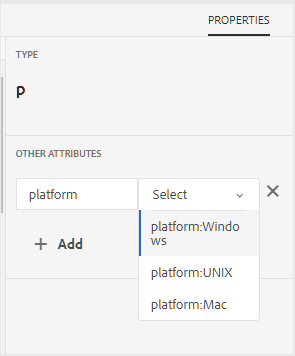

# 조건부 속성 프로파일링 {#id1843I0HN0Y4}

엔터프라이즈 수준에서는 표준 태그 지정 시스템을 갖추는 것이 매우 중요합니다. 태그나 조건부 특성은 저장소의 디지털 에셋과 연결할 수 있으므로 선택한 조건에 따라 출력을 게시하는 데 도움이 됩니다. 예를 들어 Windows 및 Mac 컨텐츠에 대한 조건부 속성을 만들 수 있습니다. 그런 다음 이러한 속성을 주제의 관련 콘텐츠에 추가합니다. 콘텐츠를 게시할 때 Windows 또는 Mac 전용 콘텐츠를 게시할지 여부를 선택할 수 있습니다.

AEM Guides을 사용하면 관련 DITA 속성을 사용하여 조건부 속성을 쉽게 만들고 연결할 수 있습니다. 전역 수준 또는 폴더 수준에서 조건부 속성을 정의할 수 있습니다. 전역적으로 정의된 조건은 모든 프로젝트에 표시되며 폴더별 조건은 지정된 폴더 내에서 생성된 프로젝트에서만 표시됩니다. 콘텐츠 작성자는 이러한 조건부 속성을 사용하여 만들거나 사용하는 DITA 주제 또는 맵의 콘텐츠를 조건화할 수 있습니다. 그런 다음 게시자는 이러한 조건을 사용하여 조건부 사전 설정을 만들 수 있습니다. 조건부 사전 설정을 사용하여 게시자는 게시된 출력에서 포함 및 제외할 조건을 결정할 수 있습니다.

>[!NOTE]
>
> 액세스 권한이 있는 폴더 프로필에서 조건부 속성을 만들거나 편집할 수 있습니다. 시스템 관리자가 폴더 프로필에 대한 액세스 권한을 부여하지 않은 경우 폴더 프로필에서 조건부 속성을 만들거나 편집할 수 없습니다.

조건부 속성을 정의하려면 다음 단계를 수행합니다.

1. 맨 위에 있는 Adobe Experience Manager 링크를 클릭하고 **도구**&#x200B;를 선택합니다.

1. 도구 목록에서 **안내서**&#x200B;를 선택합니다.

1. **폴더 프로필** 타일을 클릭하고 폴더 프로필을 선택합니다.

   >[!NOTE]
   >
   > 글로벌 프로필은 편집할 수 없습니다.

1. **조건부 특성** 탭을 클릭하고 **편집**&#x200B;을 클릭합니다.

   조건부 속성 테이블이 표시됩니다.

1. **추가**&#x200B;를 클릭합니다.

1. 특성의 **이름**, **값** 및 **레이블**&#x200B;을(를) 입력하십시오.

   속성 이름만으로 프로파일을 저장할 수 있습니다. 그러나 속성에 값이 지정된 경우에만 속성을 사용할 수 있습니다. 속성에 -value와 label을 모두 지정하면 웹 편집기에는 여전히 속성 값만 표시됩니다. 조건부 사전 설정을 만들 때 게시 관리자에게 레이블이 표시됩니다.

   다음 스크린샷은 값이 `unix`이고 레이블이 `Red Hat Linux`인 `platform` 특성에 대한 정의를 보여 줍니다.

   {width="800" align="left"}

1. 동일한 특성에 대해 더 많은 값을 추가하려면 **+** 아이콘을 클릭하고 추가 값과 레이블을 입력하십시오.

1. 특성을 더 추가하려면 **추가**&#x200B;를 클릭하세요.

1. 변경 내용을 저장하려면 **저장**&#x200B;을 클릭하세요.

`platform` 특성은 시스템에 저장됩니다. 작성자가 폴더의 DITA 주제에 `platform` 특성을 사용하기로 결정할 때마다 웹 편집기의 속성 탭에 값이 표시됩니다.

{width="350" align="left"}

**상위 항목:**[&#x200B;출력 생성](generate-output.md)
