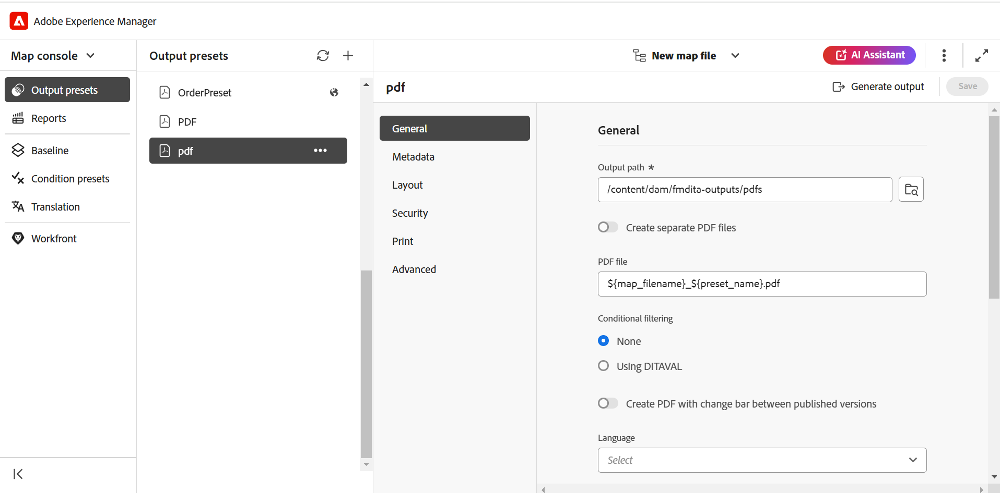

# 출력 생성

DITA 맵에 대한 출력을 생성하는 방법에는 두 가지가 있습니다.

- [맵 콘솔에서 DITA 맵에 대한 출력 생성](#generate-output-for-a-dita-map-from-the-map-console)
- [맵 대시보드에서 DITA 맵에 대한 출력 생성](#generate-output-for-a-dita-map-from-the-map-dashboard)

## 맵 콘솔에서 DITA 맵에 대한 출력 생성

맵 콘솔을 사용하여 DITA 맵에 대한 출력을 생성하려면 다음 단계를 수행하십시오.

1. [맵 콘솔에서 맵 파일을 엽니다](./open-files-map-console.md).
2. DITA 맵 콘솔에는 출력을 생성하는 데 사용할 수 있는 **출력 사전 설정** 목록이 표시됩니다.

3. 출력을 생성하는 데 사용할 사전 설정을 열고 **출력 생성**&#x200B;을 선택하여 생성 프로세스를 시작합니다.

   

   또는 사전 설정 위로 마우스를 가져간 후 사전 설정 컨텍스트 메뉴에서 **생성**&#x200B;을 선택합니다.

   

출력 생성이 완료되면 출력을 보려면 **출력 보기**&#x200B;를 선택하십시오.

**성공** 대화 상자가 화면 오른쪽 아래에 표시됩니다.

출력이 성공하지 않으면 아래 오류 메시지가 표시됩니다.

오류 로그를 보려면 **취소**&#x200B;를 선택하고 선택한 사전 설정 탭을 마우스로 가리킨 다음 사전 설정 컨텍스트 메뉴에서 **로그 보기**&#x200B;를 선택하십시오.

## 맵 대시보드에서 DITA 맵에 대한 출력 생성

맵 대시보드를 사용하여 DITA 맵에 대한 출력을 생성하려면 다음 단계를 수행하십시오.

1. Assets UI에서 로 이동하고 게시할 DITA 맵 파일을 선택합니다.

   DITA 맵 콘솔에는 출력을 생성하는 데 사용할 수 있는 출력 사전 설정 목록이 표시됩니다.

1. 출력을 생성하는 데 사용할 [출력 사전 설정]을 하나 이상 선택합니다.

   {align="left"}

1. **생성** 아이콘을 선택하여 출력 생성 프로세스를 시작합니다.

**출력** 탭에서 출력 생성 요청의 현재 상태를 볼 수 있습니다. 자세한 내용은 [출력 생성 작업의 상태를 확인](./generate-output-manage-process.md#view-the-status-of-the-output-generation-task)하세요.

>[!IMPORTANT]
>
> 사전 설정에 대한 출력 생성 프로세스가 큐에 있거나 진행 중인 경우 동일한 사전 설정에 대해 다른 출력 생성 작업을 시작할 수 없습니다.

맵 콘솔에서 하나 이상의 주제에 대한 AEM Sites 출력 또는 전체 DITA 맵을 생성할 수도 있습니다. 자세한 내용은 [기술 자료 출력 생성](web-editor-article-publishing.md#id218CK0U019I)을 참조하세요.

**상위 항목:**[&#x200B;출력 생성](generate-output.md)
