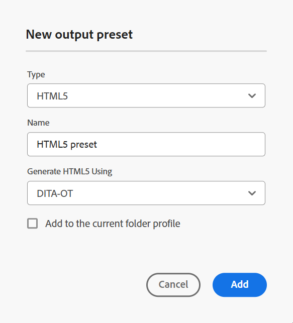

# HTML5 {#id205BE700XO1}

DITA-OT 및 FMPS를 사용하여 출력을 게시하도록 HTML5 출력 사전 설정을 만들 수 있습니다(관리자가 구성한 경우).

다음 두 가지 방법으로 HTML5 사전 설정을 만들 수 있습니다.

- [맵 콘솔에서 HTML5 출력 사전 설정 만들기](#create-html5-output-preset-from-the-map-console)
- [맵 대시보드에서 HTML5 출력 사전 설정 만들기](#create-html5-output-preset-from-the-map-dashboard)

## 맵 콘솔에서 HTML5 출력 사전 설정 만들기

맵 콘솔에서 HTML5 사전 설정을 만들려면 다음 단계를 수행하십시오.

1. [맵 콘솔에서 DITA 맵 파일을 엽니다](./open-files-map-console.md).

   **개요 섹션**&#x200B;의 [최근 파일](./intro-home-page.md#overview) 위젯에서 맵 파일에 액세스할 수도 있습니다. 선택한 맵 파일이 맵 콘솔에서 열립니다.
1. **출력 사전 설정** 탭에서 + 아이콘을 선택하여 출력 사전 설정을 만듭니다.
1. **새 출력 사전 설정** 대화 상자의 유형 드롭다운에서 **HTML5**&#x200B;을(를) 선택합니다.
1. **이름** 필드에서 이 사전 설정의 이름을 입력하십시오.
1. **다음을 사용하여 HTML 생성** 필드에서 DITA-OT를 선택합니다.
1. **현재 폴더 프로필에 추가** 옵션을 선택하여 현재 폴더 프로필 내에 출력 사전 설정을 만듭니다. 은(는) 폴더 프로필 수준의 사전 설정을 나타냅니다.

   [전역 및 폴더 프로필 출력 사전 설정 관리](./web-editor-manage-output-presets.md)에 대해 자세히 알아보세요.

1. **추가**&#x200B;를 선택합니다.

   HTML5용 사전 설정이 생성됩니다.

   {width="300" align="left"}

맵 콘솔에서 사전 설정된 구성 옵션은 **일반** 및 **고급** 탭 아래에 구성됩니다.

**일반** 탭에는 다음 구성 옵션이 포함되어 있습니다.

- 출력 경로
- DITA-OT 명령줄 인수
- 파일 이름
- 조건부 필터링 \(조건이 맵에 대해 정의된 경우\)
- 베이스라인 사용 \(맵에 대한 베이스라인이 작성되는 경우\)
- 사후 생성 워크플로

**고급**

고급 탭에는 다음과 같은 구성 옵션이 있습니다.

- 변형 이름
- 임시 파일 유지
- 파일 계층 구조 평면화
- 파일 속성

사전 설정 구성 옵션에 대한 자세한 내용은 [HTML5 사전 설정 구성](#html5-preset-configuration) 섹션을 참조하십시오.

## 맵 대시보드에서 HTML5 출력 사전 설정 만들기

맵 대시보드에서 HTML5 사전 설정을 만들려면 다음 단계를 수행하십시오.

1. Assets UI에서 로 이동하고 DITA 맵을 선택하여 맵 대시보드에서 엽니다.
1. **출력 사전 설정** 탭을 선택했는지 확인하십시오.
1. 도구 모음에서 **만들기**&#x200B;를 선택합니다.

   새 출력 사전 설정 만들기 양식이 표시됩니다.

1. HTML5 사전 설정에 필요한 구성 세부 정보를 입력합니다.
1. **완료**&#x200B;를 선택하여 사전 설정 설정을 저장합니다.

사전 설정 구성 옵션에 대한 자세한 내용은 [HTML5 사전 설정 구성](#html5-preset-configuration) 섹션을 참조하십시오.

## HTML5 사전 설정 구성

구성 옵션은 사전 설정을 맵 콘솔에서 구성하는지 또는 맵 대시보드에서 구성하는지에 따라 약간 달라집니다. 일부 옵션은 맵 대시보드에만 적용되고 다른 옵션은 두 대시보드에만 적용됩니다.

동일한 구성에 두 개의 서로 다른 필드 레이블이 있는 경우 **/**&#x200B;이(가) 아래 표에서 해당 레이블을 구분합니다. 첫 번째는 맵 콘솔의 레이블을 나타내고 두 번째는 맵 대시보드의 레이블을 나타냅니다.

예를 들어 **출력 경로/대상 경로** - 여기서 **출력 경로**&#x200B;은(는) 맵 콘솔에서 사용되는 레이블이며 **대상 경로**&#x200B;은(는) 동일한 구성의 맵 대시보드에서 사용되는 레이블입니다.

| HTML5 옵션 | 설명 |
| --- | --- |
| 출력 유형(*맵 대시보드에만 적용 가능*) | 생성하려는 출력의 유형입니다. HTML5 출력을 생성하려면 HTML5 옵션을 선택합니다. |
| 설정 이름(*맵 대시보드에만 적용 가능*) | 생성 중인 HTML5 출력 설정을 설명하는 이름을 지정합니다. 예를 들어 _내부 고객 출력_ 또는 _최종 사용자 출력_&#x200B;을 지정할 수 있습니다. |
| 다음을 사용하여 응답형 생성(*맵 대시보드에만 적용 가능*) | **DITA-OT**&#x200B;을(를) 선택하여 HTML5 출력을 생성합니다. 관리자가 이 옵션을 구성한 경우 **FrameMaker Publishing Server**&#x200B;을(를) 선택하십시오. 일부 구성 옵션은 FMPS를 선택할 때 달라집니다. |
| 출력 경로/대상 경로 | HTML5 출력이 저장되는 AEM 저장소 내의 경로입니다. 관리자가 구성한 변수 `${base_output_path}`을(를) 통해 출력 경로를 설정합니다. 출력 경로를 구성하려면 사용 중인 서비스에 따라 [클라우드 서비스에 대한 기본 출력 위치 구성](../native-pdf/configure-base-location-cs.md) 또는 [온프레미스 서비스에 대한 기본 출력 위치 구성](../native-pdf/configure-base-output-location.md)을 봅니다. |
| DITA-OT 명령줄 인수 | 출력을 생성하는 동안 DITA-OT에서 처리할 추가 인수를 지정합니다.    참고: Experience Manager Guides의 2502 릴리스부터 `generate.copy.outer` 매개 변수는 더 이상 내부적으로 관리되지 않습니다. 이 변경 사항은 HTML5 콘텐츠가 맵 디렉터리 외부에 있는 경우 `-Dgenerate.copy.outer=3`DITA-OT 명령줄 인수&#x200B;**필드에서** 매개 변수를 명시적으로 설정해야 함을 의미합니다. 이렇게 하면 콘텐츠가 올바르게 처리되고 출력에 포함됩니다. 맵 디렉터리 외부의 콘텐츠 처리에 대한 자세한 내용은 [DITA-OT 설명서](https://www.dita-ot.org/dev/parameters/generate-copy-outer#:~:text=The%20generate.,located%20outside%20the%20map%20directory/)를 참조하십시오. |
| 파일 이름 | HTML5 출력을 저장할 파일 이름을 지정합니다.  **참고**: 파일 이름을 제공하지 않으면 DITA 맵의 제목이 최종 HTML5 출력 파일 이름을 생성하는 데 사용됩니다. 맵에 제목이 없으면 DITA 맵의 파일 이름을 사용하여 이름을 최종 HTML5 출력으로 지정합니다. 잘못된 문자를 처리하기 위해 시스템에 구성된 규칙을 사용하여 파일 이름을 정리합니다. |
| 다음을 사용하여 필터링/적용 조건 조정 | 다음 옵션 중 하나를 선택하십시오.  * **적용되지 않음**: 게시된 출력에 조건을 적용하지 않으려면 이 옵션을 선택하십시오. * **DITAVAL 파일**: 개인화된 콘텐츠를 생성하려면 DITAVAL 파일을 선택하십시오. 찾아보기 대화 상자를 사용하거나 파일 경로를 입력하여 여러 DITAVAL 파일을 선택할 수 있습니다. 파일 이름 근처에 있는 교차 아이콘을 사용하여 제거합니다. DITAVAL 파일은 지정된 순서대로 평가되므로 첫 번째 파일에 지정된 조건이 이후 파일에 지정된 조건에 우선합니다. 파일을 추가하거나 삭제하여 파일 순서를 유지할 수 있습니다. DITAVAL 파일에 플래그를 적용하여 콘텐츠를 시각적으로 표시할 수도 있습니다. 각 플래그는 이미지를 포함할 수 있으며 굵게 또는 기울임꼴 등의 서식을 사용하여 스타일을 지정할 수 있습니다. 플래그 지정 스타일 사용자 지정 또는 서식 충돌 해결에 대한 자세한 내용은 [DITAVAL 편집기 사용](../user-guide/ditaval-editor.md)을 참조하세요. DITAVAL 파일이 다른 위치로 이동되거나 삭제되는 경우 맵 대시보드에서 자동으로 삭제되지 않습니다. 파일이 이동되거나 삭제될 경우에 대비하여 위치를 업데이트해야 합니다. 파일 이름 위로 마우스를 가져가면 파일이 저장된 AEM 저장소의 경로를 볼 수 있습니다. DITAVAL 파일만 선택할 수 있으며 다른 파일 유형을 선택한 경우 오류가 표시됩니다. FrameMaker Publishing Server은 여러 DITAVAL 파일을 지원하지 않습니다. * **조건 사전 설정**: 출력을 게시하는 동안 조건을 적용하려면 드롭다운에서 조건 사전 설정을 선택합니다. DITA 맵 콘솔의 조건 사전 설정 탭에 있는 조건을 추가한 경우 옵션이 표시됩니다. 조건 사전 설정에 대해 자세히 알아보려면 [조건 사전 설정 사용](generate-output-use-condition-presets.md#id1825FL004PN)을 확인하세요.  **참고**: FrameMaker Publishing Server에서는 여러 DITAVAL 파일을 지원하지 않습니다. |
| 사후 생성 워크플로 | 이 옵션을 선택하면 AEM에 구성된 모든 워크플로우를 포함하는 새 사후 생성 워크플로우 드롭다운 목록이 표시됩니다. 출력 생성 워크플로우가 완료된 후 실행할 워크플로우를 선택해야 합니다.  **사용자 지정 사후 출력 생성 워크플로우를 만드는 방법에 대한 자세한 내용은 Adobe Experience Manager Guides as a Cloud Service 설치 및 구성에서**:For&#x200B;사후 출력 생성 워크플로우 사용자 지정&#x200B;_을 참조하십시오._ |
| 변형 이름 | 생성할 출력 유형을 지정합니다. DITA-OT 플러그인에 통합된 사용자 지정 플러그인을 사용하여 출력을 생성하려는 경우 필요합니다. 예를 들어 XHTML 출력을 생성하려면 `xhtml`을(를) 지정합니다. DITA-OT에서 사용할 수 있는 변형 목록을 보려면 OASIS DITA-OT 사용 안내서에서 [DITA-OT 변형(출력 형식)](http://www.dita-ot.org/2.3/user-guide/AvailableTransforms.html)을 확인하십시오. |
| 임시 파일 유지 | DITA-OT에서 생성한 임시 파일을 유지하려면 이 옵션을 선택합니다. DITA-OT를 통해 출력을 생성하는 동안 오류가 발생하는 경우 임시 파일을 유지하려면 이 옵션을 선택합니다. 그런 다음 이러한 파일을 사용하여 출력 생성 오류를 해결할 수 있습니다.    출력을 생성한 후 **임시 파일 다운로드**  아이콘을 선택하여 임시 파일이 포함된 ZIP 폴더를 다운로드합니다. 다운로드한 파일에는 작성자 URL, 로컬 URL 및 게시 URL에 대한 정보를 제공하는 `system_config.xml` 파일도 포함됩니다. 이러한 URL은 AEM 외부화 설정에 구성되어 `system_config.xml` 파일에 반영됩니다.    **참고**: 생성 중에 파일 속성이 추가되면 출력 임시 파일에 해당 속성이 포함된 *metadata.xml* 파일도 포함됩니다. |
| 기준선 사용 | 선택한 DITA 맵에 대한 베이스라인을 생성한 경우 이 옵션을 선택하여 게시할 버전을 지정합니다.  자세한 내용은 [기준선으로 작업](generate-output-use-baseline-for-publishing.md#id1825FI0J0PF)을 참조하세요. |
| 파일 계층 구조 평면화 | 플랫 폴더 계층에서 HTML5 출력을 생성하는 옵션을 선택합니다. 전체 콘텐츠는 플랫 파일 계층 구조에 HTML5 출력 형식으로 게시되고 단일 폴더에 저장됩니다.   이 옵션을 선택 해제하면 출력이 중첩된 폴더 계층 구조에 생성되고 전체 폴더 구조가 복제됩니다. |
| 파일 속성 | 메타데이터로 처리할 속성을 선택합니다. 이러한 등록 정보는 DITA 맵 또는 북맵 파일의 등록 정보 페이지에서 설정됩니다. 드롭다운 목록에서 선택한 속성이 **파일 속성** 필드 아래에 나타납니다. 속성 옆에 있는 교차 아이콘을 선택하여 제거합니다.   **참고**: DITA-OT 게시를 사용하여 메타데이터를 출력으로 전달할 수도 있습니다. 자세한 내용을 보려면 [DITA-OT를 사용하여 메타데이터를 출력으로 전달](pass-metadata-dita-ot.md#id21BJ00QD0XA)하십시오. |

**상위 항목:**&#x200B;[&#x200B;출력 사전 설정 이해](generate-output-understand-presets.md)
