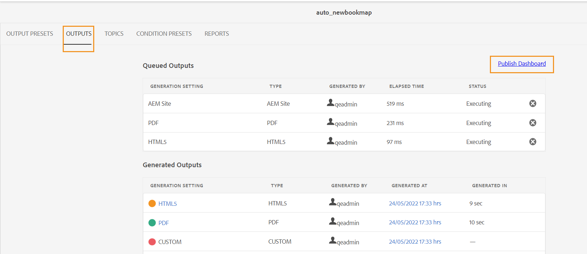
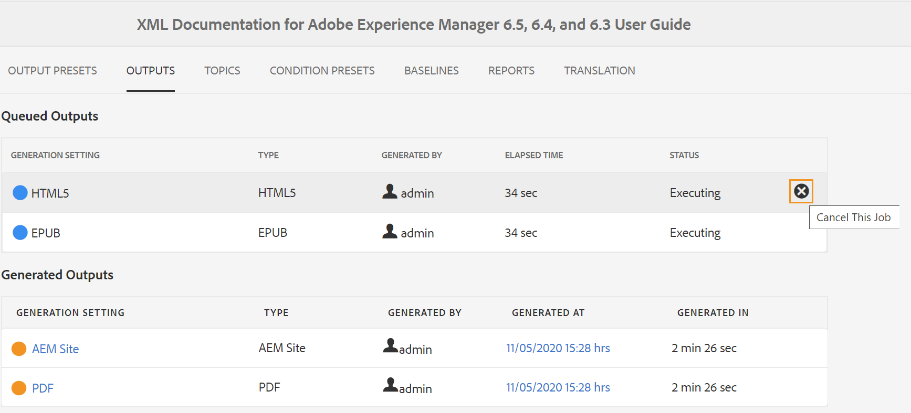
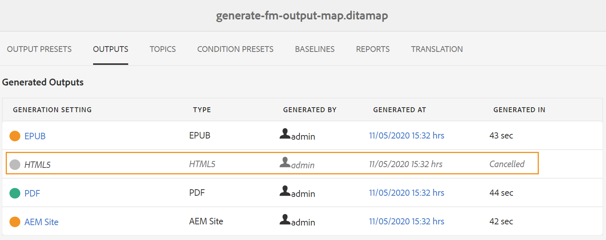
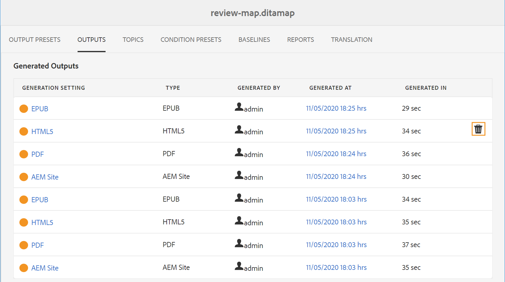

# 출력 생성 프로세스 관리

Adobe Experience Manager Guides을 사용하면 생성된 출력에 대해 다음 작업을 수행할 수 있습니다.

- [출력 생성 작업의 상태를 봅니다](#view-the-status-of-the-output-generation-task)
- [출력 생성 작업 취소](#cancel-an-output-generation-task)
- [출력 작업 삭제](#delete-an-output-task)

## 출력 생성 작업의 상태 보기

맵에 대한 출력 생성 작업을 시작하거나 선택한 주제를 재생성하면 Experience Manager Guides에서 이 작업을 출력 생성 대기열로 보냅니다. 이 큐는 실시간으로 업데이트되며, 큐의 각 출력 생성 작업의 상태를 표시합니다.

1. Assets UI에서 출력 생성 상태를 확인할 맵 파일로 이동하여 엽니다.

1. **출력**&#x200B;을 선택하세요.

   

   [출력] 페이지는 두 부분으로 나뉩니다.

   - **큐에 있는 출력:**

     생성이 대기 중이거나 생성 중인 출력을 나열합니다. 대기열에 있거나 진행 중인 작업은 사전 설정 이름 앞에 파란색 아이콘으로 표시됩니다. 또한 대기열에 추가된 작업에 사용되는 출력 생성 설정 또는 사전 설정, 유형, 작업을 시작한 사용자, 작업이 대기열에 추가된 이후 시간 및 현재 상태를 확인할 수 있습니다.

     **게시 대시보드**&#x200B;에 액세스하고 현재 실행 중인 상태를 보려면 링크를 선택하십시오. 게시 대시보드에서 모든 활성 게시 작업 목록을 사용할 수 있습니다. **대기 중인 출력** 및 **대시보드 게시**&#x200B;링크는 생성을 대기 중이거나 생성 중인 출력이 있는 경우에만 표시됩니다. 출력 작업이 완료되면 표시되지 않습니다.게시 대시보드에 대한 자세한 내용은 [게시 대시보드를 사용하여 게시 작업 관리](generate-output-publish-dashboard.md#)를 참조하십시오.

   - **생성된 출력**

     완료된 출력 작업을 나열합니다. 다시 말하지만, 여기에 표시된 정보는 몇 가지 차이점이 있는 대기열에 추가된 출력 섹션과 유사합니다. 출력 결과 아이콘 및 출력 생성 시간 형식의 새로운 정보 세트가 있습니다.

     이 목록에는 성공적으로 실행된 작업, 메시지로 실행된 작업 또는 실패한 작업이 있을 수 있습니다. 성공한 작업은 녹색 아이콘으로 표시되고, 메시지가 있는 작업은 주황색 아이콘으로 표시되며, 실패한 작업은 빨간색 아이콘으로 표시됩니다.

     모든 작업의 경우 게시 프로세스는 생성된 위치 열에서 링크를 선택하여 액세스할 수 있는 로그 파일 \(logs.txt\)을 만듭니다. 작업이 실패했거나 메시지가 있는 경우 로그 파일을 확인할 수 있습니다. 로그 파일은 [로그 파일 보기 및 확인](generate-output-basic-troubleshooting.md#id1822G0P0CHS) 섹션에 설명되어 있습니다.

     >[!NOTE]
     >
     > 생성된 PDF 출력의 링크를 선택하면 PDF을 다운로드하라는 메시지가 표시됩니다.

## 출력 생성 작업 취소

Experience Manager Guides은 게시자에게 진행 중인 게시 작업을 취소할 수 있는 간단하고 쉬운 방법을 제공합니다. 게시자는 DITA 맵 콘솔 또는 [대시보드 게시](generate-output-publish-dashboard.md#)에서 진행 중인 게시 작업을 취소할 수 있습니다.

DITA 맵 콘솔에서 출력 생성 작업을 취소하려면 다음 단계를 수행하십시오.

1. Assets UI에서 진행 중인 출력 생성 작업을 취소할 맵 파일로 이동하여 엽니다.

1. **출력**&#x200B;을 선택하세요.

1. **큐에 있는 출력** 목록에서 취소할 작업 위에 포인터를 놓습니다.

1. **이 작업 취소** 아이콘을 선택합니다.

   

1. **취소 확인** 메시지 프롬프트에서 **예**&#x200B;을(를) 선택하십시오.

   

   작업이 아직 시작되지 않은 경우 취소 명령이 작업에 대해 실행됩니다. 취소 중인 작업의 경우 상태가 취소로 설정됩니다.

   작업이 성공적으로 취소되면 **취소됨** 상태의 **생성된 출력** 목록으로 이동됩니다. 취소한 작업 위로 마우스를 가져가면 작업을 취소한 사용자의 이름이 표시됩니다. 다음 스크린샷에서는 *HTML5* 작업이 취소되었습니다.

   

## 출력 작업 삭제

DITA 맵에 대해 여러 출력을 생성하면 일정 기간 동안 이러한 맵에 대해 생성된 출력 목록이 매우 길어집니다. 게시자는 *생성된 출력* 목록에서 오래된 작업을 제거하여 맵 파일의 출력 기록을 정리할 수 있습니다. 시스템에서 출력이 제거되지 않고 *생성된 출력* 목록에서 생성된 출력의 항목만 제거됩니다.

생성된 출력 목록에서 출력 작업을 제거하려면 다음 단계를 수행하십시오.

1. Assets UI에서 작업을 삭제할 맵 파일로 이동하여 엽니다.

1. **출력**&#x200B;을 선택하세요.

1. **생성된 출력** 목록에서 삭제할 작업 위로 포인터를 가져갑니다.

1. 삭제 아이콘을 선택합니다.

   

1. **삭제 확인** 메시지 프롬프트에서 **예**&#x200B;을(를) 선택하십시오.

   작업이 생성된 출력 목록에서 삭제됩니다.
