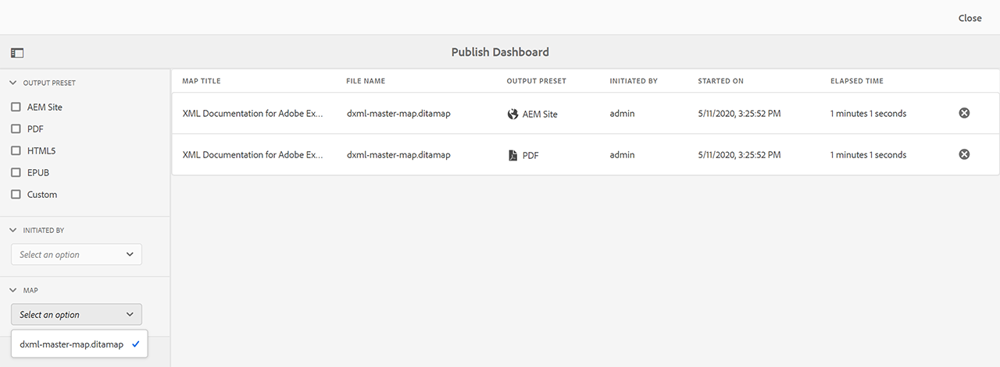
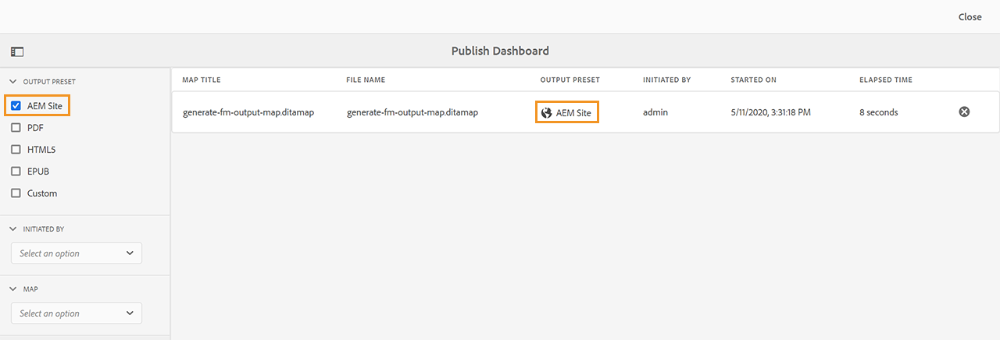
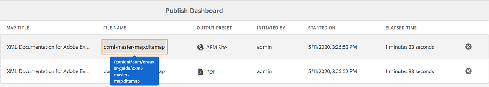
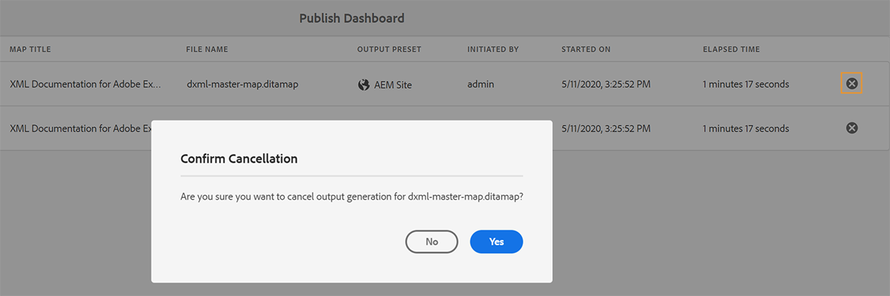

# 게시 대시보드를 사용하여 게시 작업 관리 {#id205CC08305Z}

시스템에서 많은 수의 게시 작업이 실행 중인 경우 각 DITA 맵을 개별적으로 확인하여 게시 작업을 모니터링하는 것이 사실상 불가능해집니다. Adobe Experience Manager Guides은 관리자 및 게시자에게 시스템에서 실행 중인 모든 게시 작업에 대한 하나의 통합된 보기를 제공합니다. 게시 대시보드에서 모든 활성 게시 작업 목록을 사용할 수 있습니다.

게시 대시보드는 시스템에서 현재 실행 중인 모든 게시 작업에 대한 전체 개요를 제공합니다.

게시 대시보드에는 다음 세부 정보가 포함되어 있습니다.

- **맵 제목** - 현재 게시 중이거나 게시 큐에 있는 맵 파일의 제목입니다.

- **파일 이름** - DITA 맵의 파일 이름입니다.

- **출력 사전 설정** - 출력을 생성하는 데 사용되는 출력 사전 설정의 이름입니다.

- **시작한 사람** - 게시 작업을 시작한 사용자의 사용자 이름입니다.

- **시작 날짜** - 게시 작업이 시작된 날짜와 시간입니다.

- **경과 시간** - 시스템에서 게시 작업이 실행되고 있는 이후의 시간입니다.

- **삭제 아이콘** - 게시 작업을 취소하거나 종료합니다.

게시 대시보드의 왼쪽 패널에는 다음과 같은 필터링 옵션이 있습니다.

- **출력 사전 설정** - 현재 활성 게시 작업을 보려는 출력 사전 설정을 하나 이상 선택합니다. 다음 스크린샷에서는 게시 작업이 필터링되어 AEM 사이트 출력 사전 설정을 사용하는 작업만 표시됩니다.

  

- **시작한 사람** - 선택한 사용자가 시작한 게시 작업을 표시하려면 목록에서 사용자 이름을 선택합니다.

- **맵** - 선택한 맵에서 실행 중인 게시 작업을 표시하려면 목록에서 맵 파일을 선택하십시오.

## 게시 대시보드 액세스

[Experience Manager Guides 홈 페이지](./intro-home-page.md)에서 **대시보드 게시**&#x200B;에 직접 액세스할 수 있습니다. 홈 페이지를 열고 왼쪽 패널에서 **큐 게시** 옵션을 선택합니다.

>[!NOTE]
>
> 관리자 또는 게시자만 게시 대시보드에 액세스할 수 있습니다.

Adobe Experience Manager **도구** 페이지에서 **대시보드 게시**&#x200B;에 액세스할 수도 있습니다. 이 방법을 사용하려면 다음 단계를 수행하십시오.

1. 맨 위에 있는 Adobe Experience Manager 로고를 선택한 다음 **도구**&#x200B;를 선택합니다.

1. 도구 목록에서 **안내서**&#x200B;를 선택합니다.

1. **대시보드 게시** 타일을 선택합니다.

   게시 대시보드가 열리고 시스템의 모든 활성 게시 작업 목록이 표시됩니다.

   파일 이름(File Name) 링크를 선택하면 선택한 맵의 DITA 맵 대시보드가 표시됩니다.

   

>[!NOTE]
>
> 맵 대시보드에서 출력을 생성하는 동안 **출력** 탭에서 게시 대시보드에 액세스할 수도 있습니다. 자세한 내용은 [출력 생성 작업의 상태 보기](generate-output-for-a-dita-map.md#viewing_output_history)를 참조하세요.

## 게시 작업 취소

게시 대시보드에서 출력 생성 작업을 취소하려면 다음 단계를 수행하십시오.

1. [게시 대시보드에 액세스](#access-the-publish-dashboard).

1. 활성 게시 작업 목록에서 취소하려는 작업의 삭제 아이콘을 선택합니다.

   

1. **취소 확인** 메시지 프롬프트에서 **예**&#x200B;을(를) 선택하십시오.

   cancel 명령이 수락되고 작업이 활성 상태인 한 취소가 시도됩니다. 작업이 성공적으로 종료되면 현재 활성화된 작업 목록에서 제거됩니다. 작업의 상태도 DITA 맵 대시보드에서 취소됨으로 업데이트됩니다. 다음 스크린샷에서는 *HTML5* 작업이 게시 대시보드에서 취소되고 DITA 맵 대시보드에서도 상태가 변경됩니다.

   

**상위 항목:**[&#x200B;출력 생성](generate-output.md)
