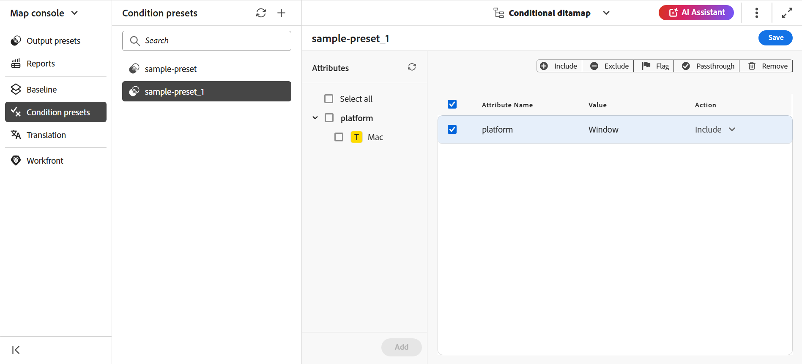

# 조건 사전 설정 사용 {#id1825FL004PN}

DITA 주제에서 속성을 정의하고 조건 사전 설정을 사용하여 최종 출력에서 속성이 발생하는 상황을 지정할 수 있습니다. 예를 들어 컨텐츠에 속성을 버전 1.0 및 버전 2.0으로 추가하고, 조건 사전 설정을 사용하여 릴리스 1.0의 버전 1.0을 포함하고 버전 2.0을 제외할 수 있습니다. 마찬가지로 속성에 OS Windows 및 OS Linux를 추가한 다음 운영 체제에 따라 최종 출력에 관련 컨텐츠를 포함하거나 제외할 수 있습니다.

다음 두 가지 방법으로 조건 사전 설정을 만들 수 있습니다.

- [맵 콘솔에서](#condition-presets-from-the-map-console)
- [맵 대시보드에서](#condition-presets-from-the-map-dashboard)

## 맵 콘솔의 조건 사전 설정

Experience Manager Guides을 사용하면 맵 콘솔에서 조건 사전 설정을 만들고 관리할 수 있으며, **출력 사전 설정**&#x200B;에서 이 사전 설정을 사용하여 최종 조건부 출력을 생성할 수 있습니다.

### 조건 사전 설정 만들기

**조건 사전 설정** 보기는 특성, 값 및 작업과 같은 조건 사전 설정에 대한 자세한 정보를 제공합니다.

다음 단계를 수행하여 항목의 조건 사전 설정을 만들 수 있습니다.

1. [맵 콘솔에서 DITA 맵 파일을 엽니다](./open-files-map-console.md).
1. 왼쪽의 **조건 사전 설정**(으)로 이동합니다. DITA 맵에 대해 정의된 조건 사전 설정 목록이 표시됩니다.
1. **조건 사전 설정** 옆에 있는 + 아이콘을 선택하여 **새 조건 사전 설정** 대화 상자를 엽니다.
1. 사전 설정의 고유한 이름을 입력합니다.

   >[!NOTE]
   >
   > 이름 필드가 비어 있거나 부적합한 문자 또는 기존 조건 사전 설정과 동일한 이름을 입력하면 오류가 표시됩니다. 하이픈 &#39;-&#39; 또는 밑줄 &#39;_&#39;를 구분 기호로 사용할 수 있습니다.

1. **만들기**&#x200B;를 선택합니다.

   새 조건 사전 설정이 목록에 추가됩니다.
1. 속성 및 작업을 보려면 조건 사전 설정을 선택합니다.

   **특성** 패널에는 맵에 있는 모든 참조에 추가된 모든 특성이 표시됩니다. 오른쪽 패널에는 조건 사전 설정에 추가한 조건만 표시됩니다.
1. 다음 중 하나를 수행하여 속성을 추가합니다.
   - 하나 이상의 속성을 선택하여 해당 속성 아래의 모든 값을 조건 사전 설정에 추가합니다. 예를 들어 `platform` 특성을 선택하여 해당 값을 모두 추가할 수 있습니다.
   - 하나 이상의 속성 값을 선택하여 조건 사전 설정에 추가합니다. 예를 들어 platform 특성의 `Unix` 및 `Win` 값을 선택할 수 있습니다
   - 속성 및 값 쌍을 선택하고 가운데 패널로 드래그합니다. 예를 들어 platform 특성의 `Unix` 값을 선택하고 끌어서 놓을 수 있습니다.
   - **모두 선택**&#x200B;하여 모든 특성과 해당 값을 조건 사전 설정에 추가합니다. 기본적으로 특성에 대한 작업은 `Include`입니다.

1. **추가**&#x200B;를 선택합니다. 이 단계를 반복하여 속성을 더 추가할 수 있습니다. 추가하는 속성은 중앙에서 오른쪽 패널로 이동합니다.
1. 오른쪽 패널에서 선택한 특성을 제거하려면 상단의 작업 표시줄에서 **제거**&#x200B;를 선택합니다.
1. (선택 사항) 필요한 경우 속성에 적용된 작업을 재정의할 수 있습니다.

   다음 중 하나를 수행합니다.
속성에 대해 작업 드롭다운 또는 도구 모음에서 다음 작업 중 하나를 선택합니다.

   - 포함
   - 제외
   - 통과
   - 플래그

   오른쪽 패널에서 여러 속성 행을 선택하고 상단의 작업 막대에서 작업을 선택합니다. 예를 들어 선택한 특성에 대해 **제외** 동작을 선택할 수 있습니다.
1. 조건 사전 설정을 저장하려면 **저장**&#x200B;을 선택합니다.

   >[!NOTE]
   >
   > 다른 사전 설정을 선택하거나 저장하지 않고 사전 설정을 닫으면 경고가 표시됩니다.

조건 사전 설정을 만들면 **출력 사전 설정**&#x200B;의 **조건 사전 설정** 드롭다운 아래에 표시됩니다. [PDF 출력을 게시](../web-editor/native-pdf-web-editor.md)하는 방법에 대해 자세히 알아보세요.

### 조건 사전 설정 이름 바꾸기

조건 사전 설정의 이름을 변경하려면 다음 단계를 수행하십시오.

1. **조건 사전 설정** 패널에서 조건 사전 설정 위로 마우스를 가져갑니다.
1. 옵션 메뉴에서 **이름 바꾸기**&#x200B;를 선택하여 **조건 사전 설정 이름 바꾸기** 대화 상자를 엽니다.
1. 조건 사전 설정의 이름을 편집합니다.
1. **이름 바꾸기**&#x200B;를 선택합니다.

### 조건 사전 설정 복제

조건 사전 설정을 복제하려면 다음 단계를 수행하십시오.

1. **조건 사전 설정** 패널에서 조건 사전 설정 위로 마우스를 가져갑니다.
1. 옵션 메뉴에서 **복제**&#x200B;를 선택하여 **복제 조건 사전 설정** 대화 상자를 엽니다.

   >[!NOTE]
   >
   > 사전 설정의 기본 이름은 `<selected condition preset name>_1`입니다. 필요에 따라 이름을 변경할 수 있습니다.

1. **복제**&#x200B;를 선택합니다.

### 조건 사전 설정 삭제

조건 사전 설정을 삭제하려면 다음 단계를 수행하십시오.

1. **조건 사전 설정** 패널에서 조건 사전 설정 위로 마우스를 가져갑니다.
1. 옵션 메뉴에서 **삭제**&#x200B;를 선택하여 **조건 사전 설정 삭제** 대화 상자를 엽니다.
1. **삭제**&#x200B;를 선택합니다.

## 맵 대시보드의 조건 사전 설정

### 조건 사전 설정 만들기

조건 사전 설정을 만들려면 다음 단계를 수행하십시오.

1. DITA 맵 대시보드에서 **조건 사전 설정** 탭을 선택합니다.
1. **만들기**&#x200B;를 선택합니다.
1. **이름 조건**&#x200B;에 사전 설정 이름을 입력하십시오.
1. **기본 작업을**(으)로 설정 드롭다운에서 다음 기본 작업 중 하나를 선택하십시오.

   - 포함
   - 제외
   - 통과
   - 플래그
작업은 조건 사전 설정에 추가되는지 여부에 관계없이 모든 속성에 대한 기본 작업으로 설정됩니다.

   예를 들어 문서에 15개의 조건 속성이 있고 이 중 4개를 조건 사전 설정에 포함했습니다. **exclude**&#x200B;을(를) 기본 작업으로 선택하면 15개의 모든 특성에 적용됩니다.

1. 다음 중 하나를 수행하여 속성을 추가합니다.
   - 조건 사전 설정에 대한 하나의 특성에 **추가**&#x200B;를 선택합니다. 이 단계를 반복하여 속성을 더 추가할 수 있습니다.
   - 조건 사전 설정에 모든 특성을 추가하려면 **모두 추가**&#x200B;를 선택하십시오.
1. \(선택 사항\) 필요한 경우 4단계의 속성에 적용된 기본 작업을 재정의할 수 있습니다. 다음 중 하나를 수행하십시오.
   - 여러 특성을 선택하고 **선택한 조건에 대한 동작을**(으)로 설정하고 **적용**&#x200B;을 선택합니다.
   - **작업** 드롭다운에서 특성에 대한 작업을 선택하십시오.
1. **저장**&#x200B;을 선택합니다.

### 조건 사전 설정 편집

기존 조건 사전 설정을 변경하여 조건 사전 설정의 속성에 적용되는 작업을 변경할 수 있습니다. 조건 사전 설정을 편집하려면 다음 단계를 수행하십시오.

1. DITA 맵 콘솔에서 **조건 사전 설정** 탭을 선택합니다.
1. **편집** 단추를 선택하십시오.
1. 조건 사전 설정의 모든 속성에 대해 필요한 변경을 수행합니다.
1. **저장**&#x200B;을 선택합니다.

### 조건 사전 설정의 복사본 만들기

조건 사전 설정의 복사본을 만든 다음 요구 사항에 따라 수정할 수 있습니다. 조건 사전 설정의 복사본을 만들려면 다음 단계를 수행하십시오.

1. DITA 맵 콘솔에서 **조건 사전 설정** 탭을 선택합니다.
1. **복제** 단추를 선택하십시오.

   >[!NOTE]
   >
   > 사전 설정의 기본 이름은 `<selected condition preset name>_Duplicate`입니다.

   필요에 따라 이름을 변경할 수 있습니다.

1. \(선택 사항\) 조건 사전 설정의 모든 속성에 대해 필요한 사항을 변경합니다.
1. **저장**&#x200B;을 선택합니다.

### 조건 사전 설정 삭제

DITA 맵 콘솔의 **조건 사전 설정** 탭에서 하나 이상의 조건 사전 설정을 삭제할 수 있습니다. 조건 사전 설정을 삭제하려면 다음 단계를 수행하십시오.

1. DITA 맵 콘솔에서 **조건 사전 설정** 탭을 선택합니다.
1. 삭제할 조건 사전 설정을 선택합니다.
1. **제거** 단추를 선택하십시오.
1. **제거**&#x200B;를 선택하여 작업을 확인합니다.

**상위 항목:**&#x200B;[&#x200B;출력 생성](generate-output.md)
