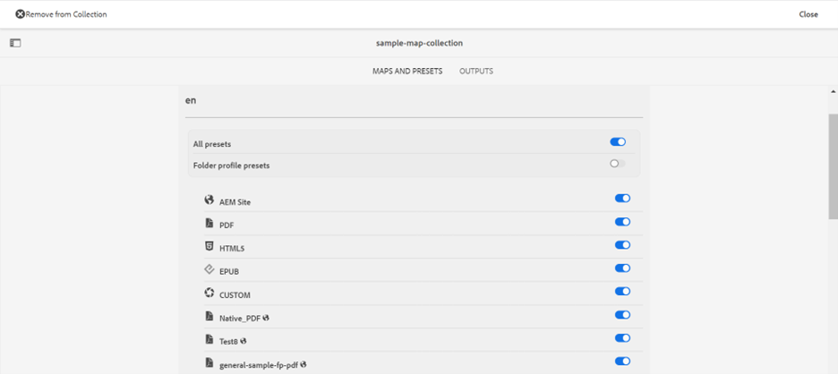

# 출력 생성을 위해 맵 컬렉션 사용 {#id1723F20G0HS}

어느 조직에서나 제품에는 여러 유형의 설명서가 있을 수 있습니다. 게시 전문가는 어떤 문서에 대해 생성할 출력을 제어하려고 합니다. 또한 한 번에 여러 문서를 일괄 게시할 수 있는 방법이 있어야 합니다.

Adobe Experience Manager Guides에서는 맵 컬렉션이라는 대시보드를 사용하여 게시할 콘텐츠를 구성할 수 있습니다. 맵 컬렉션을 사용하면 서로 다른 모든 유형의 문서를 단일 단위로 조합할 수 있습니다. 맵 컬렉션의 각 문서에 대해 생성할 출력 유형을 선택할 수 있습니다. 또한 게시 대시보드에서 출력을 생성하고 출력 생성 진행률을 볼 수도 있습니다.

맵 컬렉션 은 마지막으로 게시된 출력에서 맵이 변경된 경우 볼 수 있는 옵션을 제공합니다. 맵 컬렉션의 맵 및 사전 설정 탭에서 세부 정보를 확인한 다음 필요한 경우 출력을 다시 게시할 수 있습니다.

## 맵 컬렉션 만들기 및 DITA 맵 추가

맵 컬렉션을 만들고 DITA 맵을 컬렉션에 추가하려면 다음 단계를 수행하십시오.

1. [Experience Manager Guides 홈 페이지](./intro-home-page.md#map-collections)를 열고 **컬렉션 매핑**&#x200B;을 선택합니다.

   **컬렉션 매핑** 페이지가 새 탭에서 열립니다.

   {width="350" align="left"}

   >[!NOTE]
   >
   > Assets UI를 열고 **컬렉션 매핑**&#x200B;을 선택할 수도 있습니다. 컬렉션 매핑 페이지를 사용할 수 없는 경우 왼쪽 레일에서 **탐색** 옵션을 선택한 다음 **컬렉션 매핑**&#x200B;을 선택하십시오.

1. **컬렉션 매핑** 페이지에서 오른쪽 상단의 **만들기**&#x200B;를 선택하고 맵 컬렉션에 대한 **컬렉션 제목**&#x200B;을 제공합니다.
1. **만들기**&#x200B;를 선택합니다.

   맵 컬렉션을 만들면 성공 메시지가 표시됩니다.

1. 성공 메시지에서 **닫기**&#x200B;를 선택합니다.

   새로 생성된 맵 파일은 [맵 컬렉션] 페이지에 표시됩니다.

1. 편집할 컬렉션의 타일에서 회색 상자를 선택합니다.
1. 선택한 맵 컬렉션이 맵 컬렉션 대시보드에 열립니다.
1. **편집**&#x200B;을 선택한 다음 **맵 추가**&#x200B;를 선택하십시오.
1. 맵 컬렉션에 추가할 DITA 맵을 찾아 추가합니다.

   기본적으로 맵과 연결된 모든 사전 설정 및 로케일이 자동으로 추가됩니다.

1. 슬라이딩 버튼을 켜거나 끔으로써 원하는 출력을 선택합니다.
1. **완료**&#x200B;를 선택합니다.

   DITA 맵 파일이 맵 컬렉션에 추가됩니다.

   {width="800" align="left"}

**필터링 옵션**

다음 필터링 옵션 및 맵 세부 사항이 컬렉션 페이지에 표시됩니다.

- **필터:** 왼쪽 레일에는 다음 필터가 표시됩니다.
   - **수정됨**: 예 또는 아니오를 선택할 수 있습니다. 예를 선택하면 수정된 DITA 맵만 맵 및 사전 설정 표에 표시됩니다.
   - **사전 설정**: 맵 파일을 필터링할 사전 설정을 선택합니다. 예를 들어 *AEM 사이트* 사전 설정을 선택하면 *AEM 사이트* 출력 사전 설정이 구성된 맵만 표시됩니다.
   - **언어**: 사용 가능한 언어 코드를 선택하고 맵 및 사전 설정 표에 선택한 언어만 표시할 수 있습니다.
- **맵 및 사전 설정** 테이블: 맵 및 사전 설정 테이블은 다음 열에 정보를 제공합니다.
   - **맵**: DITA 맵 파일의 제목을 표시합니다.
   - **파일 이름**: DITA 맵의 파일 이름을 표시합니다.
   - **언어**: DITA 맵의 언어를 표시합니다.
   - **사전 설정**: 맵 파일에 구성된 출력 사전 설정 형식을 표시합니다.
   - **기준선**: 출력 사전 설정에서 사용하는 기준선을 표시합니다.  기준선을 사용하지 않으면 하이픈 &#39;-&#39;이 표시됩니다
   - **수정됨**: 마지막 게시 후 DITA 맵이 업데이트되는지 여부를 나타냅니다. 이 정보를 기반으로 이 DITA 맵에 대한 출력을 다시 게시할지 여부를 결정할 수 있습니다.
   - **마지막으로 생성됨**: 마지막으로 생성된 출력의 날짜와 시간을 표시합니다.

## 맵 컬렉션을 사용하여 출력 구성 및 생성

맵 컬렉션을 사용하여 출력을 구성하고 생성하려면 다음 단계를 수행하십시오.

1. 맵 컬렉션을 엽니다. AEM Sites, PDF(기본 PDF 포함), HTML5, EPUB 및 사용자 지정 사전 설정과 같은 다양한 출력 사전 설정을 볼 수 있습니다. 관리자가 만든 전역 및 폴더 프로필 사전 설정을 볼 수도 있습니다.

    아이콘은 폴더 프로필 수준 사전 설정을 나타냅니다.
1. \(선택 사항\) 요구 사항에 따라 다음 중 하나를 수행합니다.
   - 왼쪽 레일에서 필터 를 적용하여 수정된 맵, 출력 사전 설정 또는 언어를 필터링합니다.
   - 필요한 경우 **편집**&#x200B;을 선택하고 슬라이딩 단추를 설정하거나 해제하여 원하는 출력을 변경합니다.

   >[!NOTE]
   >  
   > 기본적으로 새 사전 설정은 비활성화되어 있습니다.

1. 다음과 같은 방법으로 DITA 맵에 대한 사전 설정을 활성화할 수 있습니다.

   - 개별 사전 설정을 활성화합니다.
   - DITA 맵에 대해 **모든 사전 설정**&#x200B;을 활성화하여 한 번에 모든 사전 설정을 선택합니다. 이 옵션은 기본적으로 비활성화되어 있습니다.
   - DITA 맵에 대해 **폴더 프로필 사전 설정**&#x200B;을 활성화하여 모든 폴더 프로필 사전 설정을 선택합니다. 이 옵션은 기본적으로 비활성화되어 있습니다.

{width="800" align="left"}

1. 다음 중 하나를 수행하십시오.

   - 선택한 맵의 출력을 생성하려면 맵 파일을 선택하고 **선택한 맵 생성**&#x200B;을 선택합니다.
   - 구성된 사전 설정으로 모든 DITA 맵의 출력을 생성하려면 **모두 생성**&#x200B;을 선택합니다.

   >[!IMPORTANT]
   >
   > 사전 설정이나 DITA 맵에 대한 출력 생성 프로세스가 큐에 있거나 진행 중인 경우 동일한 사전 설정이나 맵에 대해 다른 출력 생성 작업을 시작할 수 없습니다.

## 메타데이터 속성 구성

맵 컬렉션에서 DITA 맵에 대한 메타데이터 속성을 일괄적으로 구성할 수 있습니다. **메타데이터 구성**&#x200B;을 선택하여 **자산 메타데이터** 페이지를 엽니다. **자산 메타데이터** 페이지에서 컬렉션에 있는 모든 맵이 왼쪽에 나열됩니다.

{width="800" align="left"}

메타데이터 속성을 구성하려면 다음 단계를 수행하십시오.

1. 메타데이터를 업데이트할 맵을 선택할 수 있습니다. 기본적으로 존재하는 모든 DITA 맵이 선택됩니다.

1. DITA 맵을 선택하면 메타데이터, 일정(비)활성화, 참조, 문서 상태 등의 속성을 볼 수 있습니다.

1. 메타데이터 속성을 업데이트합니다.

1. 업데이트를 저장하려면 맨 위에 있는 **저장 및 닫기**&#x200B;를 선택하십시오.
1. (선택 사항) 태그를 업데이트할 때 **저장 및 닫기** 드롭다운에서 추가를 선택하여 새 태그를 기존 목록에 추가할 수도 있습니다.
1. **저장 및 닫기** 드롭다운에서 **제출**을 선택합니다.
맵 컬렉션에서 일괄 선택하는 DITA 맵에 대해 메타데이터 속성이 업데이트됩니다.

>[!NOTE]
> 
>**문서 상태** 드롭다운의 경우 선택한 모든 DITA 맵에 대해 공통적으로 허용되는 문서 상태만 선택할 수 있습니다. 자세한 내용은 [**문서 상태**](./web-editor-document-states.md)&#x200B;를 참조하세요.

메타데이터 속성이 파일 속성과 동기화됩니다. 업데이트하면 편집기의 **파일 속성** 패널에서 볼 수 있습니다.

## 맵 컬렉션에서 맵 컬렉션 또는 DITA 맵 삭제

- 맵 컬렉션을 삭제하려면 [맵 컬렉션] 페이지에서 컬렉션을 선택한 다음 **삭제**&#x200B;를 선택합니다.
- 맵 컬렉션에서 DITA 맵을 삭제하려면 편집 모드에서 맵 컬렉션을 열고 DITA 맵 파일을 선택한 다음 **컬렉션에서 제거**&#x200B;를 선택합니다.

맵 컬렉션에서 DITA 맵과 관련된 사전 설정이나 로케일도 제거됩니다.

## 맵 컬렉션에서 출력 생성 작업 취소

[DITA 맵 콘솔](generate-output-for-a-dita-map.md#id2061H100T5Z) 또는 [대시보드 게시](generate-output-publish-dashboard.md#)에서 출력 생성 작업을 취소하는 방법과 마찬가지로 맵 컬렉션에서 출력 생성 작업을 취소할 수 있습니다. 맵 컬렉션의 출력 탭에 액세스하여 취소할 게시 작업으로 이동한 다음 **이 작업 취소** 아이콘을 선택하여 게시 작업을 취소합니다.

{width="800" align="left"}

**상위 항목:**[&#x200B;출력 생성](generate-output.md)
