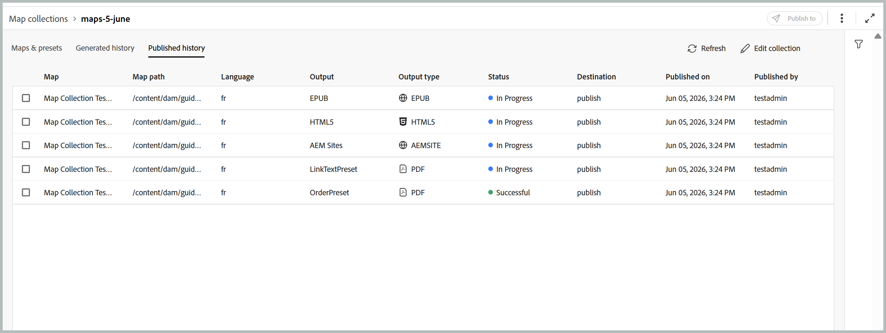

# 출력 생성을 위해 새 맵 컬렉션 사용(Beta)

>[!IMPORTANT]
>
> 새로운 맵 컬렉션은 2026.06.0 릴리스부터 Experience Manager Guides as a Cloud Service에서 사용할 수 있습니다. 이 기능을 활성화하려면 고객 지원 팀에 문의하십시오.

Adobe Experience Manager Guides의 맵 컬렉션을 사용하면 게시 전문가들이 여러 문서를 하나의 컬렉션으로 구성하고, 각 문서에 대해 생성되는 출력을 제어하며, 중앙 집중식 대시보드에서 효율적으로 출력을 생성하고 게시할 수 있습니다. 또한 출력 생성 진행 상황을 확인하고, 마지막으로 게시된 출력 이후 맵에 수행된 변경 사항을 강조 표시하고, 필요한 경우 콘텐츠를 다시 게시할 수 있도록 해줍니다.

새 맵 컬렉션은 이전에 기존 맵 컬렉션에 분산된 기능과 벌크 게시 기능을 하나의 통합 인터페이스로 통합합니다. 활성화되면 한 위치에서 맵, 사전 설정, 생성 내역, 게시 내역, 메타데이터 및 컬렉션 멤버십을 관리할 수 있습니다.

## 맵 컬렉션 만들기 및 DITA 맵 추가

맵 컬렉션을 만들고 맵을 추가하려면 다음 단계를 수행하십시오.

1. Experience Manager Guides 홈 페이지를 열고 **새 맵 컬렉션**&#x200B;을 선택합니다.

   **컬렉션 매핑** 페이지가 열립니다.

   {width="650"}

1. **맵 컬렉션** 페이지에서 오른쪽 상단의 **만들기**&#x200B;를 선택하고 새 맵 컬렉션에 대한 **이름**&#x200B;을(를) 제공합니다.

   {width="350"}

1. **만들기**&#x200B;를 선택합니다.

   맵 컬렉션을 만들면 성공 메시지가 표시됩니다.

1. 맵을 추가할 맵 컬렉션을 엽니다.

   

   맵 컬렉션 제목 위로 마우스를 가져간 후 다음 작업을 수행할 수 있습니다.

   - **내역 생성**: 정의된 사전 설정에 대해 생성된 출력이 있는 모든 맵을 나열하는 [생성된 내역] 탭으로 바로 이동합니다.
   - **게시 기록**: 정의된 사전 설정에 대해 게시된 출력이 있는 모든 맵을 나열하는 [게시된 기록] 탭으로 바로 이동합니다.
   - **이름 바꾸기**: 맵 컬렉션의 이름을 바꿉니다.

1. **컬렉션 편집**&#x200B;을 선택한 다음 **맵 추가**&#x200B;를 선택합니다.

   

1. 원하는 맵을 선택하고 **사용 가능한 번역 선택** 토글을 활성화하여 해당 맵의 사용 가능한 모든 번역 복사본을 맵 컬렉션에 자동으로 추가합니다. 맵에 번역 사본이 없으면 기본 언어가 맵에 추가됩니다.

   

1. **추가**&#x200B;를 선택합니다.

   맵 파일은 사용 가능한 모든 번역본과 함께 나열됩니다. 번역된 사본이 없는 맵의 경우 기본 언어가 표시됩니다.

   

1. 필요한 맵 또는 나열된 모든 맵을 선택한 다음 **사전 설정 가져오기** 단추를 선택하여 선택한 맵에 사용 가능한 사전 설정을 검색합니다.

   선택한 맵에 대해 사용 가능한 모든 사전 설정 목록이 **폴더 프로필 사전 설정** 및 **기타 사전 설정** 범주 아래에 그룹화되었습니다. **폴더 프로필 사전 설정**&#x200B;은(는) 선택한 모든 맵에 공통이지만, **다른 사전 설정**&#x200B;은(는) 개별 맵에 한정됩니다. **다른 사전 설정** 아래의 사전 설정의 경우 해당 전환 옆에 연결된 맵이 표시됩니다.

   

1. 필요에 따라 **모든 사전 설정 사용** 또는 **모든 폴더 프로필 사전 설정 사용**&#x200B;을 선택합니다. 오른쪽의 필터 아이콘을 사용하여 목록의 범위를 좁힐 수도 있습니다. 필터는 두 가지 수준의 필터링을 제공합니다. **나열된 사전 설정 범위를 좁히는 사전 설정 유형**&#x200B;과(와) 맵 패널에서 특정 맵을 선택하는 **맵 상태**.

   

1. **저장**&#x200B;을 선택합니다.

맵 제목, 해당 파일 이름, 사용 가능한 언어 및 구성된 사전 설정으로 원하는 모든 맵의 목록을 가져옵니다.

**맵 및 사전 설정** 탭에는 다음 열에 특정 언어에 대해 선택한 맵을 기반으로 하는 정보가 표시됩니다.

- **사전 설정**: 맵 파일에 구성된 출력 사전 설정 형식을 표시합니다.
- **기준선**: 출력 사전 설정에서 사용하는 기준선을 표시합니다.  기준선을 사용하지 않으면 하이픈 `-`이(가) 표시됩니다.
- **생성 이후 수정됨**: 생성 후 DITA 맵이 업데이트되는지 여부를 나타냅니다. 이 정보를 기반으로 이 DITA 맵에 대한 출력을 게시할지 여부를 결정할 수 있습니다.
- **게시된 이후 수정됨**: 마지막 게시 후 DITA 맵이 업데이트되는지 여부를 나타냅니다. 이 정보를 기반으로 이 DITA 맵에 대한 출력을 다시 게시할지 여부를 결정할 수 있습니다.
- **마지막으로 생성됨**: 마지막으로 생성된 출력의 날짜와 시간을 표시합니다.
- **마지막으로 게시됨**: 마지막으로 게시된 출력의 날짜와 시간을 표시합니다.

**필터링 옵션**

맵 및 사전 설정 페이지의 오른쪽 패널에서 다음 필터링 옵션을 사용할 수 있습니다.

- **생성 이후 수정됨**: 예, 아니요 또는 아직 생성되지 않음 을 선택할 수 있습니다. 예를 선택하면 생성 이후 수정된 맵만 맵 및 사전 설정 탭에 표시됩니다.
- **게시 이후 수정됨**: 예, 아니요 또는 아직 생성되지 않음 을 선택할 수 있습니다. 예를 선택하면 게시 이후 수정된 맵만 맵 및 사전 설정 탭에 표시됩니다.
- **사전 설정**: 맵 파일을 필터링할 사전 설정을 선택합니다. 예를 들어 *AEM 사이트* 사전 설정을 선택하면 *AEM 사이트* 출력 사전 설정이 구성된 맵만 표시됩니다.
- **언어**: 사용 가능한 언어 코드를 선택하고 맵 및 사전 설정 탭에서 선택한 언어만 표시할 수 있습니다.

  

## 맵 컬렉션을 사용하여 출력 생성

맵 컬렉션을 사용하여 출력을 생성하려면 다음 단계를 수행하십시오.

1. 맵 컬렉션을 엽니다. 구성에 따라 AEM Sites, PDF(기본 PDF 포함), HTML5, EPUB 및 사용자 정의 사전 설정과 같은 다양한 출력 사전 설정을 볼 수 있습니다.

1. 선택한 맵의 출력을 생성하려면 필요한 맵 파일과 특정 사전 설정을 선택한 다음 **생성**&#x200B;을 선택하십시오.

   >[!IMPORTANT]
   >
   > 사전 설정이나 DITA 맵에 대한 출력 생성 프로세스가 큐에 있거나 진행 중인 경우 동일한 사전 설정이나 맵에 대해 다른 출력 생성 작업을 시작할 수 없습니다.

1. 출력이 생성되면 **생성된 내역** 탭으로 이동하여 생성된 모든 맵의 목록을 확인합니다. 생성이 실행 중인지 또는 완료되었는지 여부를 나타내는 **상태** 열에서 생성 진행 상황을 추적할 수 있습니다.

   

1. 생성 프로세스의 최신 상태를 보려면 **새로 고침**&#x200B;을 선택하십시오. 상태 열이 업데이트되어 각 맵의 현재 상태 및 관련 사전 설정이 반영됩니다.

   - **완료됨(녹색)**: 생성이 완료되었습니다.
   - **완료됨(빨간색)**: 생성이 완료되었으나 오류가 발생했습니다. 오류 세부 정보는 로그에서 볼 수 있습니다.
   - **실행 중(파란색)**: 생성이 현재 진행 중입니다.

   

1. **생성 취소** 아이콘을 선택하여 작업 상태가 실행될 때까지 출력 생성 작업을 취소할 수도 있습니다.

   

1. 또한 맵 이름을 마우스로 가리키면 표시되는 **출력 열기** 아이콘을 선택하여 출력 생성이 완료된 맵에 대해 생성된 출력을 보거나 인접한 **로그** 아이콘을 선택하여 생성 로그를 볼 수 있습니다.

   

## 맵 컬렉션을 사용하여 출력 게시

맵 컬렉션을 사용하여 출력을 게시(구성된 경우)하려면 다음 단계를 수행하십시오.

1. **맵 및 사전 설정** 탭 또는 **생성된 기록** 탭에서 원하는 맵을 선택하고 **게시 위치**&#x200B;를 선택합니다.
1. 출력을 게시할 대상 환경을 선택하십시오. **미리 보기** 또는 **게시** 인스턴스.

   

1. 게시 작업의 상태를 모니터링하려면 **게시된 기록** 탭으로 전환하십시오.

   

1. 작업의 최신 상태를 보려면 **새로 고침**&#x200B;을 선택하십시오.
1. 상태가 **성공**(으)로 변경되면 선택한 대상 인스턴스에서 게시된 콘텐츠를 확인하십시오.

## 메타데이터 속성 구성

맵 컬렉션에서 DITA 맵에 대한 메타데이터 속성을 일괄적으로 구성할 수 있습니다. **맵 및 사전 설정** 탭에서 **메타데이터 구성** 아이콘을 선택하여 **자산 메타데이터** 페이지를 엽니다. **자산 메타데이터** 페이지에서 컬렉션에 있는 모든 맵이 왼쪽에 나열됩니다.

메타데이터 속성을 구성하려면 다음 단계를 수행하십시오.

1. 메타데이터를 업데이트할 맵을 선택할 수 있습니다. 기본적으로 존재하는 모든 DITA 맵이 선택됩니다.

1. DITA 맵을 선택하면 메타데이터, 일정(비)활성화, 참조, 문서 상태 등의 속성을 볼 수 있습니다.

1. 메타데이터 속성을 업데이트합니다.

1. 업데이트를 저장하려면 맨 위에 있는 **저장 및 닫기**&#x200B;를 선택하십시오.
1. (선택 사항) 태그를 업데이트할 때 **저장 및 닫기** 드롭다운에서 추가를 선택하여 새 태그를 기존 목록에 추가할 수도 있습니다.
1. **저장 및 닫기** 드롭다운에서 **제출**&#x200B;을 선택합니다.
메타데이터 속성은 맵 컬렉션에서 선택한 DITA 맵에 대해 일괄적으로 업데이트됩니다.

>[!NOTE]
> 
>**문서 상태** 드롭다운의 경우 선택한 모든 DITA 맵에 대해 공통적으로 허용되는 문서 상태만 선택할 수 있습니다. 자세한 내용은 [**문서 상태**](./web-editor-document-states.md)&#x200B;를 참조하세요.

메타데이터 속성이 파일 속성과 동기화됩니다. 업데이트하면 편집기의 **파일 속성** 패널에서 볼 수 있습니다.

**상위 항목:**&#x200B;[&#x200B;출력 생성](generate-output.md)
