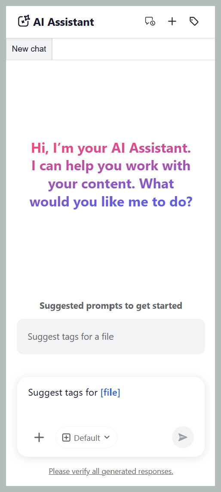
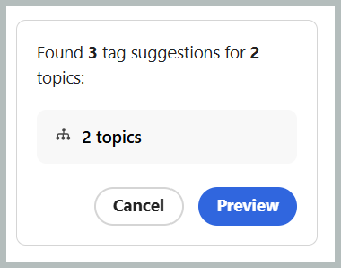
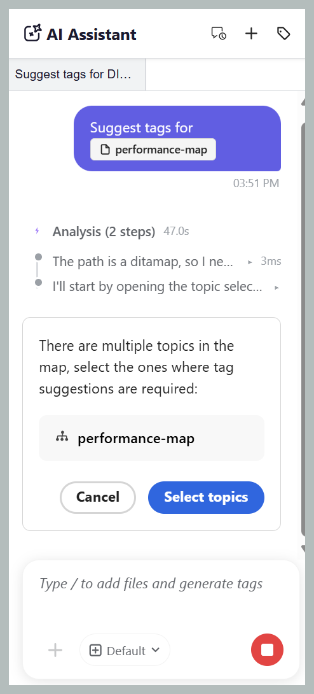

# Guides AI 시작

>[!NOTE]
>
> Guides AI는 2026.08.0 릴리스부터 Experience Manager Guides as a Cloud Service에서 사용할 수 있습니다. 이 기능을 활성화하려면 고객 지원 팀에 문의하십시오.

Guides AI를 통해 콘텐츠에 더 빠르고, 더 쉽고, 일관되게 태그를 지정할 수 있습니다. Guides AI는 Adobe CX Enterprise Coworker의 에이전트 스마트 태그 지정 기술을 사용하여 콘텐츠를 수동으로 읽어 적용할 태그를 결정하는 대신 콘텐츠를 분석하고 조직의 분류법에 따라 관련 태그를 권장합니다. 제안된 태그를 검토하고 적용 또는 거부하도록 선택한 후 선택을 확인하면 됩니다. 이렇게 하면 수작업이 크게 줄어들고, 태그 지정의 정확성이 향상되며, 문서 전체에서 메타데이터가 일관되게 유지됩니다.

## 안내서 AI 패널

안내서 AI 패널은 AI 제안 태그를 생성, 검토 및 적용하는 데 필요한 모든 도구를 제공합니다.

{width="650"}

Guides AI의 다음 구성 요소를 사용하여 파일을 추가하고, 태그 권장 사항을 구성하고, 스마트 태그 지정 워크플로를 관리할 수 있습니다.

- **(A)** 대화 기록: 이전 태그 권장 사항 및 작업을 검토하려면 이전 대화를 보고 다시 여십시오.

  {width="350"}

- **(B)** 새 채팅: 다른 주제, 맵 또는 파일 집합에 대한 새 태그 지정 세션을 시작합니다.
- **(C)** 태그 네임스페이스: Guides AI가 태그 권장 사항을 생성해야 하는 위치에서 분류 네임스페이스를 선택합니다. 선택한 네임스페이스의 태그만 고려됩니다.

  {width="350"}

- **(D)** 응답 공간: AI가 생성한 태그 권장 사항을 검토하고 태그를 적용하기 전에 수락, 거부 또는 수정하도록 선택합니다.
- **(E)** 프롬프트 공간: 선택한 콘텐츠에 대한 태그 권장 사항을 생성하는 프롬프트 요청을 입력합니다.
- **(F)** 파일 첨부 또는 컨텍스트 추가: 로컬 시스템의 주제, 맵 또는 외부 파일을 추가하여 AI가 태그 권장 사항을 위해 분석해야 하는 콘텐츠를 제공합니다.
- **(G)** 모델: 콘텐츠를 분석하고 태그 권장 사항을 생성하는 데 사용되는 AI 모델을 표시합니다. 다양한 OpenAI 및 Anthropic Claude 모델을 선택할 수 있습니다. 기본적으로 **매니페스트 기본값 사용** 옵션이 선택되어 있으며, 이 옵션은 선택한 도우미에 대해 구성된 모델을 사용합니다.
- **(H)** 보내기: AI 기반 태그 권장 사항을 생성하려면 확인 메시지 및 첨부된 콘텐츠를 제출하십시오.

## 스마트 태그 지정 스킬을 사용하여 단일 또는 여러 주제에 태그 적용

스마트 태그 지정 스킬로 단일 또는 여러 주제에 태그를 적용하는 데 Guides AI를 사용하려면 다음 단계를 수행하십시오.

1. Experience Manager Guides에 로그인.
1. 홈 페이지의 탐색 모음에서 **Guides AI**&#x200B;를 선택합니다. 관리자가 가이드 AI 기능을 활성화했는지 확인합니다.
1. 다음 방법 중 하나를 사용하여 태그 권장 사항을 생성할 주제를 추가합니다.

   - **제안된 프롬프트 사용**: 응답 영역에서 첫 번째 채팅을 수행하려면 **파일에 태그 제안** 프롬프트를 선택하십시오. 프롬프트가 프롬프트 공간에 자동으로 추가됩니다. `[file]`을(를) 선택한 다음 **파일 선택** 대화 상자의 리포지토리 또는 컬렉션에서 주제를 선택합니다. **파일 선택** 대화 상자에서 항목을 하나 선택할 수 있습니다.

     {width="650"}

   - **바로 가기 사용**: 프롬프트 필드에 `/`을(를) 입력한 다음 **저장소 참조 추가**&#x200B;를 선택하여 리포지토리에서 주제를 선택하거나 **장치에서 파일 추가**&#x200B;를 선택하여 컴퓨터에서 주제를 업로드합니다.) 제안된 프롬프트를 입력하십시오. *파일에 대한 태그를 제안*.

   - **끌어다 놓기**: 단일 주제 또는 여러 주제를 프롬프트 공간으로 끌어다 놓고 프롬프트 *파일에 태그 제안*&#x200B;을 입력합니다.

     {width="650"}

   - **주제 경로를 지정**: `@`을(를) 입력한 다음 동일하거나 다른 맵의 여러 주제에 대해 쉼표로 구분된 경로를 입력한 다음, *파일에 태그 제안*&#x200B;이라는 메시지를 입력하십시오.

     {width="650"}

1. **보내기**&#x200B;를 선택합니다.

1. 안내서 AI는 주제의 콘텐츠를 분석하고 태그 권장 사항을 생성합니다.

   분석 및 생각하는 동안 Guides AI 패널의 {width="650"}

1. 다음과 같이 제안된 태그를 검토합니다.

   >[!NOTE]
   >
   > 이미 태그가 들어 있는 항목의 경우 Guides AI는 기존 태그를 표시합니다. 이러한 태그는 읽기 전용이므로 수정하거나 제거할 수 없습니다.

   - 단일 항목의 경우 권장 사항을 적용하려면 **수락**&#x200B;하거나 필요하지 않은 경우 **거부**&#x200B;하면 됩니다.

     {width="650"}

   - 여러 주제의 경우:
     1. AI가 생성한 태그 권장 사항을 검토하려면 **미리 보기**&#x200B;를 선택하십시오.

        {width="650"}

     1. 각 주제에 대해 제안된 태그를 검토한 후 다음 작업 중 하나를 선택합니다.
        - **모두 수락**&#x200B;하여 모든 주제에 대해 제안된 태그를 모두 적용합니다.
        - **모두 거부**&#x200B;하여 모든 항목에 대해 제안된 태그를 모두 버립니다.
        - 특정 주제에 대해 제안된 태그를 모두 제거하려면 **모든 제안을 지웁니다**.
        - 개별 태그 제안을 제거하려면 태그 옆에 있는 **X** 아이콘을 선택하십시오.

          {width="650"}

1. 제안된 태그를 수락하면 스마트 태그 지정 스킬은 콘텐츠에 이미 적용된 태그에 AI가 생성한 태그를 추가합니다.

검토를 완료하면 Guides AI에 주제에 적용된 태그 요약과 거부된 태그 권장 사항이 표시됩니다.

{width="650"}

## 스마트 태그 지정 스킬을 사용하여 맵의 여러 주제에 태그 적용

스마트 태그 지정 스킬을 사용하여 맵의 여러 주제에 태그를 적용하는 Guides AI를 사용하려면 다음 단계를 수행하십시오.

1. Experience Manager Guides에 로그인.
1. 홈 페이지의 탐색 모음에서 **Guides AI**&#x200B;를 선택합니다. 관리자가 가이드 AI 기능을 활성화했는지 확인합니다.
1. 주제에 대해 설명된 대로 다음 방법 중 하나를 사용하여 태그 권장 사항을 생성할 맵을 추가합니다.

   - **제안된 프롬프트 사용**: 응답 영역에서 첫 번째 채팅을 수행하려면 **파일에 태그 제안** 프롬프트를 선택하십시오. 프롬프트가 프롬프트 공간에 자동으로 추가됩니다. `[file]`을(를) 선택한 다음 **파일 선택** 대화 상자의 저장소 또는 컬렉션에서 맵을 선택합니다.

   - **드래그 앤 드롭**: 맵을 프롬프트 공간으로 드래그 앤 드롭한 다음 프롬프트 *파일에 태그 제안*&#x200B;을 입력합니다.

   - **바로 가기 사용**: 프롬프트 필드에 `/`을(를) 입력한 다음 **저장소 참조 추가**&#x200B;를 선택하여 리포지토리에서 맵을 선택하거나 **장치에서 파일 추가**&#x200B;를 선택하여 컴퓨터에서 맵을 업로드합니다.) 제안된 프롬프트를 입력하십시오. *파일에 대한 태그를 제안*.

     {width="650"}

1. **보내기**를 선택합니다.
선택한 맵에 여러 주제가 포함되어 있음을 나타내는 메시지가 표시됩니다. 태그를 추천할 주제를 선택하려면 **주제 선택**&#x200B;을 선택하십시오.

   {width="650"}

1. **주제 선택** 대화 상자에서 태그 추천을 원하는 주제를 선택합니다.\
   **주제 선택** 대화 상자는 다음을 제공합니다.

   - **주제 목록:** 선택한 맵의 모든 주제를 표시합니다. 태그 권장 사항을 생성할 주제를 선택합니다.
   - **미리 보기 창:** 선택한 항목의 미리 보기를 기존 태그와 함께 표시합니다.
   - **필터:** 항목을 필터링하여 **태그가 추가된 항목만 표시하거나** 또는 **태그가 추가되지 않은 항목만 표시합니다**.

     {width="650"}

1. **확인**&#x200B;을 선택합니다. 안내서 AI는 선택한 주제를 분석하고 각 주제에 대해 생성된 태그 권장 사항 수를 표시합니다.
1. AI가 생성한 태그 권장 사항을 검토하려면 **미리 보기**&#x200B;를 선택하십시오.
1. 각 주제에 대해 제안된 태그를 검토한 후 다음 작업 중 하나를 선택합니다.
   - **모두 수락**&#x200B;하여 모든 주제에 대해 제안된 태그를 모두 적용합니다.
   - **모두 거부**&#x200B;하여 모든 항목에 대해 제안된 태그를 모두 버립니다.
   - 특정 주제에 대해 제안된 태그를 모두 제거하려면 **모든 제안을 지웁니다**.
   - 개별 태그 제안을 제거하려면 태그 옆에 있는 **X** 아이콘을 선택하십시오.

     >[!NOTE]
     >
     > 이미 태그가 들어 있는 항목의 경우 Guides AI는 기존 태그를 표시합니다. 이러한 태그는 읽기 전용이므로 수정하거나 제거할 수 없습니다.

   {width="650"}

1. 제안된 태그를 수락하면 스마트 태그 지정 스킬은 콘텐츠에 이미 적용된 태그에 AI가 생성한 태그를 추가합니다.

검토를 완료하면 Guides AI에 각 주제에 적용된 태그 요약과 거부된 태그 권장 사항이 표시됩니다.

