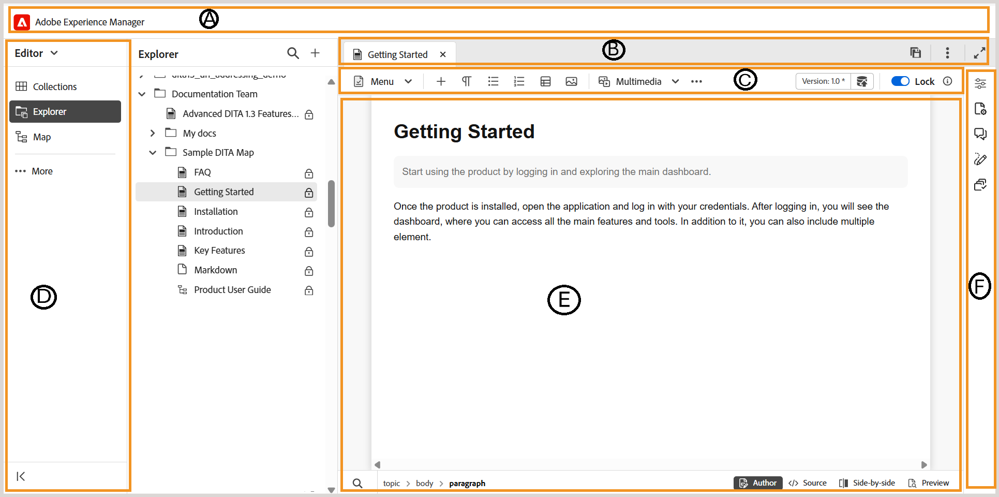

# 개요

이 문서에서는 편집기 인터페이스와 Experience Manager Guides 편집기에서 사용할 수 있는 다양한 기능에 대한 개요를 제공합니다.

>[!BEGINTABS]

>[!TAB 새 편집기]

이 보기는 콘텐츠가 새 편집기에서 렌더링되는 방법을 표시합니다.

>[!TAB 이전 편집기]

이 보기는 콘텐츠가 이전 편집기에서 렌더링되는 방법을 표시합니다

>[!ENDTABS]

Editor 인터페이스는 다음 섹션이나 영역으로 나뉩니다.

- **(A)** [헤더 막대](./web-editor-header-bar.md)
- **(B)** [탭 모음](./web-editor-tab-bar.md)
- **\(C\)** [도구 모음](./web-editor-toolbar.md)
- **(D)** [왼쪽 패널](./web-editor-left-panel.md)
- **&#x200B;**&#x200B;[콘텐츠 편집 영역](./web-editor-content-editing-area.md)
- **(앞)** [오른쪽 패널](./web-editor-right-panel.md)
