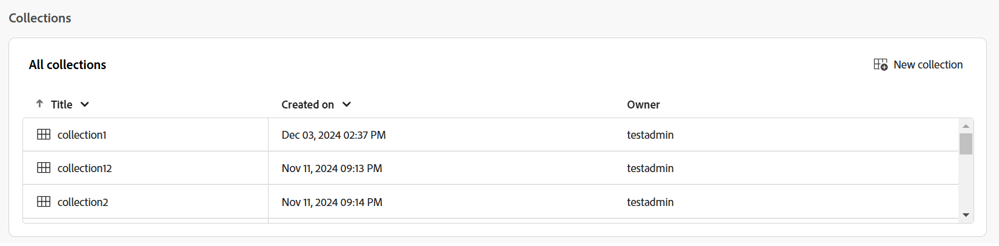

# Experience Manager Guides 홈페이지 경험

홈 페이지는 Experience Manager Guides에 로그인할 때 표시되는 첫 번째 화면입니다. 최근에 액세스한 파일, 컬렉션 등을 빠르게 볼 수 있는 통합적이고 직관적인 시작 화면 경험을 제공합니다.

{align="left"}

Experience Manager Guides 홈 페이지는 다음 섹션으로 나뉩니다.

- 헤더 막대
- 탐색 막대
- 왼쪽 패널

## 헤더 막대

헤더 막대는 Adobe Experience Manager 로고(또는 통합 쉘을 Experience Manager Guides UI로 사용하는 경우 통합 쉘)를 표시하는 홈 페이지의 상단 막대입니다. 로고를 선택하면 Experience Manager 탐색 페이지로 이동합니다.

{align="left"}

## 탐색 막대

탐색 막대는 탐색을 전환하고 개요 레이아웃을 사용자 지정하며 페이지 보기를 조정하는 도구를 표시합니다. 사용 중인 현재 폴더 프로필도 표시됩니다.

>[!NOTE]
>
> Adobe Experience Manager Guides as a Cloud Service을 사용하는 경우 **AI Assistant**(으)로 레이블이 지정된 추가 기능이 탐색 모음에 표시됩니다.

{align="left"}

탐색 모음에서 사용할 수 있는 기능은 다음과 같이 설명되어 있습니다.

- **탐색 전환기**: 다른 페이지로 원활하게 탐색할 수 있습니다.
   - **홈**: Experience Manager Guides에 로그인할 때 표시되는 기본 페이지입니다.
   - **편집기**: Experience Manager Guides에서 구조화된 문서를 만들고 관리할 수 있는 사용하기 쉬운 웹 기반 편집기입니다. [편집기 인터페이스에 대해 알아봅니다](./web-editor.md).
   - **맵 콘솔**: 맵 관리 및 게시의 모든 측면을 처리할 수 있는 전용 작업 영역을 제공합니다. [맵 콘솔 인터페이스에 대해 알아봅니다](./map-console-overview.md).
- **AI Assistant**: 스마트 도움말 기능을 통해 생산성을 높일 수 있도록 설계된 강력한 AI 기반 도구입니다. 또한 편집기 인터페이스에서 작업할 때 콘텐츠 재사용 및 최적화를 위한 인텔리전트 제안을 통해 작성 프로세스를 보다 스마트하고 빠르게 만드는 AI Assistant의 스마트 작성 기능을 활용할 수 있습니다.

  [AI Assistant](./ai-assistant.md) 기능은 현재 Adobe Experience Manager as Cloud Service에서만 사용할 수 있습니다.
- **개요 섹션 사용자 지정**: 위젯 섹션에서 위젯을 숨기거나 표시할 수 있습니다.
- **사용 중인 폴더 프로필**: 현재 사용 중인 폴더 프로필을 표시합니다.
- **추가 작업**: 추가 옵션에 대한 액세스를 제공합니다. 이 버튼을 선택하면 다음 옵션이 있는 메뉴가 열립니다.

   - **Assets**: 설정에 따라 대상으로 이동합니다.
      - **클라우드 서비스**: 클라우드 서비스를 사용하는 경우 **Assets** 옵션을 선택하면 AEM 탐색 페이지로 이동합니다.

      - **온-프레미스 소프트웨어**: Adobe Experience Manager Guides(4.2.1 이상)를 사용하는 경우 **Assets** 옵션을 선택하면 Assets UI의 현재 파일 경로로 이동합니다.
   - **Workspace 설정**: **Workspace 설정** 대화 상자로 이동합니다. 자세한 내용은 [Workspace 설정 구성](../cs-install-guide/workspace-settings.md)을 참조하세요.

     >[!NOTE]
     >
     > 홈페이지에서 Workspace 설정 옵션은 클라우드 서비스 설정에만 사용할 수 있습니다. 온-프레미스 설정에서는 홈 페이지에서 추가 작업 옵션을 사용할 수 없습니다. 그러나 기타 옵션 > 설정으로 이동하여 편집기 인터페이스와 맵 콘솔을 통해 관련 설정에 액세스할 수 있습니다.

- **보기 확장**: **확장** 아이콘을 사용하여 페이지 보기를 확장할 수 있습니다. 이 보기에서는 헤더 막대를 숨겨 콘텐츠 공간을 최대화합니다. 표준 보기로 돌아가려면 **확장된 보기로 끝내기** 아이콘을 사용합니다.

## 왼쪽 패널

왼쪽 패널에서 개요, 맵 컬렉션, 벌크 게시, 게시 큐 및 사용자 환경 설정 기능에 빠르게 액세스할 수 있습니다. 인터페이스의 왼쪽 아래 모서리에 있는 **확장** 아이콘을 선택하여 패널을 확장할 수 있습니다. 확장되면 **축소** 아이콘을 사용하여 패널을 축소합니다.

{width="300" align="left"}

이 패널에서 보는 내용은 사용자 역할에 따라 다릅니다. 다음 표에는 왼쪽 패널에 표시되는 역할 및 해당 섹션이 나열되어 있습니다.

- **관리자 및 게시자**: 패널의 모든 섹션을 보는 기능.
- **작성자**: 게시를 제외한 모든 섹션을 볼 수 있는 기능입니다. 작성자는 맵 컬렉션, 게시 큐 및 벌크 게시 섹션에 액세스할 수 없습니다.
- **검토자**: 개요 섹션만 볼 수 있는 기능입니다. 개요 섹션을 선택하면 Adobe Workfront의 구성 여부에 따라 기본 빈 상태 메시지 또는 Workfront 작업 위젯이 표시됩니다.

왼쪽 패널에서 사용할 수 있는 기능은 다음과 같이 설명되어 있습니다.

- [개요](#overview)
- [컬렉션 매핑](#map-collections)
- [일괄 게시](#bulk-publish)
- [게시 큐](#publish-queue)
- [사용자 환경 설정](#user-preferences)

>[!NOTE]
>
> 또한 관리자가 시스템에서 Adobe Workfront 통합을 구성한 경우 **Workfront** 옵션도 왼쪽 패널에 표시됩니다. Experience Manager Guides의 [Adobe Workfront 통합](./workfront-integration.md)에 대해 알아봅니다.

### 개요

**개요**&#x200B;는 생산성을 향상시키도록 디자인된 개인 맞춤화된 대시보드처럼 작동합니다. 체계적이고 집중된 상태를 유지하는 데 도움이 되는 다양한 위젯이 포함되어 있습니다.

위젯은 열을 정렬하고 크기를 조정할 수 있는 옵션도 제공합니다. 이러한 옵션을 보려면 열 헤더를 선택하면 옵션이 목록에 표시됩니다.

위젯 섹션에 다음 위젯이 있습니다.

- **최근 파일**: 위젯은 최근에 연 파일(편집기에서 액세스한 파일 목록)의 스냅숏과 함께 제목, 파일 이름, 파일 형식, 파일 경로, 액세스한 날짜 등 주요 파일 세부 정보를 제공합니다.

  {align="left"}

  열 드롭다운 메뉴에서 옵션을 선택하여 열을 정렬하고 크기를 조정할 수 있습니다. 기본적으로 데이터는 마지막으로 액세스한 날짜 및 시간을 기준으로 정렬됩니다.

  {align="left"}

  [사용자 환경 설정](#user-preferences)에서 이 위젯에 표시할 수 있는 최대 파일 수를 설정할 수 있습니다. 기본적으로 이 제한은 **20**(으)로 설정됩니다.

  다음 옵션은 파일 위로 마우스를 가져갈 때 사용할 수 있습니다.

   - **편집기에서 열기**: 편집기에서 파일을 열 수 있습니다. 파일을 선택하여 열 수도 있습니다.
   - **고정/고정 해제**: 하나 이상의 파일을 최근 파일 위젯에 고정할 수 있습니다. 고정된 파일은 위젯 목록의 맨 위에 표시됩니다. 파일 고정 해제하려면 **고정 해제** 옵션을 사용하십시오.
   - **제거**: 최근 파일 위젯에서 파일을 제거할 수 있습니다.

  **새 파일 드롭다운 메뉴에서 새 파일 만들기**

  **새 파일** 드롭다운 메뉴를 사용하면 **최근 파일** 위젯에서 바로 주제 또는 DITA 맵을 만들 수 있습니다. 파일이 성공적으로 작성되면 파일에 대해 작업할 수 있는 편집기 인터페이스로 리디렉션됩니다.

- **컬렉션**: 파일이나 폴더 집합에서 작업하는 경우 이 위젯에 추가하여 빠르게 액세스할 수 있습니다. 추가한 후에는 소유자 및 만든 날짜 등 다른 주요 세부 정보와 함께 제목별로 파일을 볼 수 있습니다. 열 드롭다운을 선택하면 열을 정렬하고 크기를 조정하는 옵션을 볼 수 있습니다.

  {align="left"}

  선택한 컬렉션의 이동 경로는 컬렉션 위젯의 맨 위에 표시됩니다. 계층 내 특정 폴더로 돌아가도록 선택할 수 있습니다.

  {align="left"}

  다음 옵션은 컬렉션 위로 마우스를 가져간 후 기타 아이콘 을(를) 선택할 때 사용할 수 있습니다.

   - **이름 바꾸기**: 컬렉션의 이름을 바꿀 수 있습니다.
   - **삭제**: 컬렉션을 삭제할 수 있습니다.
   - **Assets UI에서 보기**: Assets UI에서 컬렉션을 열 수 있습니다.

  컬렉션 제목을 선택하여 컬렉션을 열 수 있습니다. 다음 옵션은 컬렉션 파일을 마우스로 가리키고 자세히 아이콘 을(를) 선택할 때 사용할 수 있습니다.

   - **편집기에서 열기**: 편집기에서 파일을 열 수 있습니다. 또는 파일 제목을 선택하여 파일을 열 수 있습니다.
   - **맵 콘솔에서 열기**: 맵 콘솔에서 맵 파일을 열 수 있습니다. (DITA 맵 파일에만 사용할 수 있습니다.)
   - **컬렉션에 추가**: 새 컬렉션이나 기존 컬렉션에 파일을 추가할 수 있습니다.
   - **컬렉션에서 제거**: 컬렉션 목록에서 파일을 제거할 수 있습니다.
   - **Assets UI에서 보기**: Assets UI에서 파일을 찾을 수 있습니다.

  **새 컬렉션 드롭다운 메뉴에서 새 컬렉션 만들기**

  **새 컬렉션** 드롭다운 메뉴를 사용하여 새 컬렉션을 만들고 **컬렉션** 위젯에 추가할 수 있습니다.

>[!NOTE]
>
> 또한 관리자가 시스템에서 Adobe Workfront 통합을 구성한 경우 **작업** 위젯도 위젯 섹션에 표시됩니다. Experience Manager Guides의 [Adobe Workfront 통합](./workfront-integration.md#working-with-the-your-tasks-widget)에 대해 자세히 알아보세요.

### 컬렉션 매핑

Experience Manager Guides에서는 **컬렉션 매핑**&#x200B;이라는 대시보드를 사용하여 게시할 콘텐츠를 구성할 수 있습니다. 이 기능을 사용하려면 왼쪽 패널에서 **컬렉션 매핑**&#x200B;을 선택하십시오. **Assets UI**&#x200B;의 맵 컬렉션 페이지로 이동하여 [출력 생성에 맵 컬렉션을 사용할 수 있습니다.](./generate-output-use-map-collection-output-generation.md)

### 벌크 게시

벌크 활성화 기능을 사용하면 작성에서 게시 인스턴스로 콘텐츠를 빠르고 쉽게 활성화할 수 있습니다. 이 기능을 사용하려면 왼쪽 패널에서 **일괄 게시**&#x200B;를 선택하십시오. [게시된 콘텐츠의 일괄 활성화를 만들고 관리](./conf-bulk-activation.md)할 수 있는 Assets UI의 일괄 활성화 컬렉션 페이지로 이동합니다.

### 게시 큐

시스템에서 많은 수의 게시 작업이 실행 중인 경우 각 DITA 맵을 개별적으로 확인하여 게시 작업을 모니터링하는 것이 사실상 불가능해집니다. Experience Manager Guides은 관리자 및 게시자에게 시스템에서 실행 중인 모든 게시 작업에 대한 통합 보기를 제공합니다.

이 기능을 사용하려면 왼쪽 패널에서 **큐 게시**&#x200B;를 선택하십시오. 게시 대시보드를 사용하여 [게시 작업을 관리](./generate-output-publish-dashboard.md)할 수 있는 Assets UI의 게시 대시보드 페이지로 이동합니다.

### 사용자 환경 설정

사용자 환경 설정은 모든 작성자가 사용할 수 있습니다. 환경 설정을 사용하여 다음 설정을 구성할 수 있습니다.

- **일반**: 일반 탭에서 다음 설정을 구성할 수 있습니다.

  {align="left"}

   - **폴더 프로필**: 폴더 프로필은 조건부 특성, 작성 템플릿, 출력 사전 설정 및 편집기 구성과 관련된 다양한 구성을 제어합니다. 기본적으로 글로벌 프로필이 표시됩니다. 또한 관리자가 시스템에서 폴더 프로필을 구성한 경우 해당 폴더 프로필이 폴더 프로필 목록에도 표시됩니다.
   - **기본 경로**: 기본적으로 편집기에서 Experience Manager Guides 저장소에 액세스하면 /content/dam 위치에서 자산이 표시됩니다. 작업 폴더는 /content/dam/ 폴더 내에 있는 몇 개의 폴더일 수 있습니다. 기본 경로를 작업 폴더로 설정하고 저장소 보기에 해당 위치의 콘텐츠가 맨 앞에 표시됩니다. 이렇게 하면 작업 폴더에 액세스하는 시간이 줄어듭니다. 또한 항목에 참조 또는 미디어 파일을 삽입하면 파일 찾아보기 위치는 기본 경로에 설정된 폴더로 시작됩니다.
   - **루트 맵 선택**: DITA 맵 파일을 선택하여 키 참조 또는 용어집 항목을 확인합니다. 선택한 루트 맵이 키 참조를 확인하는 데 가장 높은 우선 순위를 갖습니다. 자세한 내용은 [키 참조 확인](./map-editor-other-features.md)을 참조하십시오.
   - **최근 파일의 최대 수**: 이 필드를 사용하여 최근 파일 위젯에 표시되는 파일의 최대 한도를 설정하십시오.
   - **맵의 환경 설정 열기**: 여기서는 DITA 맵 파일을 여는 동안 시스템이 수행할 기본 동작을 선택할 수 있습니다.

- **모양**: 모양 탭에는 응용 프로그램의 테마를 선택하고 콘텐츠 편집 영역의 원본 보기를 선택할 수 있는 옵션이 있습니다. 이 탭을 사용하여 다음 설정을 구성합니다.

  {align="left"}

   - **응용 프로그램 테마 및 Source 보기**: 응용 프로그램 및 소스 보기에 대해 밝은 테마 또는 어두운 테마 중에서 선택할 수 있습니다. 라이트 테마의 경우 도구 모음과 패널은 밝은 회색 배경색을 사용합니다. 어두운 테마의 경우 도구 모음과 패널은 검정색 배경을 사용합니다. **장치 사용** 테마를 선택하여 Experience Manager Guides에서 장치의 테마에 따라 밝은 테마와 어두운 테마를 선택할 수 있도록 합니다.

     모든 테마에서 컨텐츠 편집 영역은 작성자 보기에 흰색 배경색으로 표시됩니다.

   - **편집기 파일에 구성 표시**: 편집기에서 파일을 보는 기본 방법을 선택하십시오. 작성자 보기의 여러 패널에서 제목이나 파일 이름으로 파일 목록을 볼 수 있습니다. 기본적으로 파일은 편집기에서 제목으로 표시됩니다.

   - **항상 저장소에서 파일 찾기**: 편집기에서 편집하는 동안 저장소의 파일 위치를 표시하려면 이 옵션을 선택하십시오.
