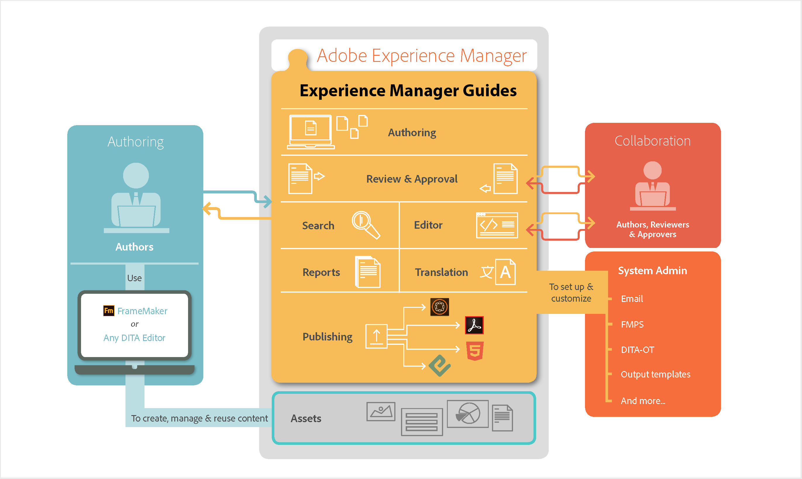

# Adobe Experience Manager Guides 작동 방식 {#id167G9A00DO4}

다음 다이어그램은 Experience Manager Guides이 AEM 및 모든 DITA 편집기를 사용하여 엔터프라이즈 시나리오에서 컨텐츠 관리, 재사용, 번역 및 검토를 활성화하는 방법을 보여 줍니다.

{align="center"}

워크플로우를 통해 작업하는 동안 세션이 오랫동안 비활성 상태로 유지되면 컨텐츠 손실을 방지하기 위해 세션 시간 초과 프롬프트가 트리거됩니다. 자세한 내용은 [세션 시간 초과](./session-timeout-prompt.md)를 확인하세요.

**상위 항목:**&#x200B;[&#x200B; Adobe Experience Manager Guides as a Cloud Service 정보](intro.md)
