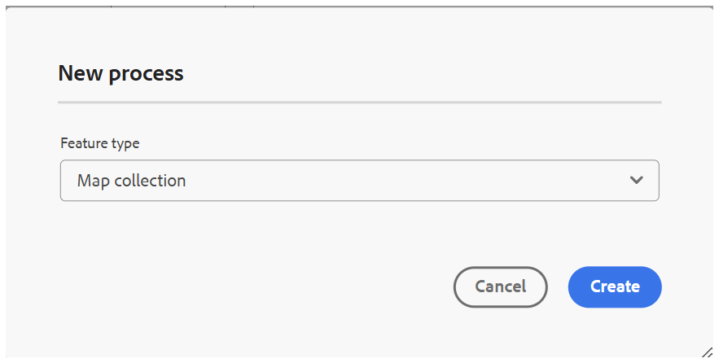

# 이전 맵 컬렉션을 새 맵 컬렉션으로 마이그레이션

이미 이전 형식으로 맵 컬렉션을 설정한 경우 새 경험으로 이동할 때 처음부터 다시 빌드할 필요가 없습니다. 수동으로 다시 만들거나 내장된 마이그레이션 도구를 사용하여 모든 것을 한 단계로 이동할 수 있습니다.

**일괄 프로세서**&#x200B;에서 새 프로세스 유형으로 추가된 마이그레이션 도구는 기존의 이전 맵 컬렉션을 읽고 일치하는 새 맵 컬렉션을 자동으로 만듭니다. 이 문서에서는 마이그레이션 실행 방법을 안내하고 마이그레이션 사용 전에 알아야 하는 몇 가지 주요 동작을 소개합니다.

>[!NOTE]
>
> 벌크 활성화 기능은 새 맵 컬렉션 환경으로 마이그레이션되지 않습니다. 필요한 경우 새 맵 컬렉션 경험에서 벌크 활성화에 사용되는 맵 컬렉션을 다시 만듭니다.

## 새 맵 컬렉션으로 마이그레이션

이전 맵 컬렉션을 새 맵 컬렉션으로 마이그레이션하려면 다음 단계를 수행하십시오.

1. Adobe Experience Manager 로고를 선택하고 **도구**&#x200B;를 선택하세요.
1. **도구** 패널에서 **안내서**&#x200B;를 선택합니다.
1. **일괄 프로세서** 타일을 선택하십시오.

   

1. 다음 세부 정보가 표시된 Guides Bulk Processor 창이 열립니다.

   - **기능 유형**: 실행 중인 프로세스의 기능을 표시합니다.

   - **실행 ID**: 사용자가 수행하는 각 마이그레이션 작업의 고유 ID입니다.

   - **만든 사람**: 작업을 만든 사람을 표시합니다.

   - **시작 시간**: 마이그레이션이 시작된 날짜와 시간을 표시합니다.

   - **종료 시간**: 마이그레이션이 종료되는 날짜와 시간을 표시합니다.

   - **상태**: 마이그레이션 상태를 진행 중, 완료됨 또는 실패로 표시합니다.

   

1. 창 오른쪽 상단의 **새 프로세스** 탭을 선택하여 새 마이그레이션 작업을 시작합니다.

   **새 프로세스** 대화 상자가 열립니다.

    {width="350"}

1. **기능 유형** 드롭다운에서 **맵 컬렉션**&#x200B;을 선택합니다.

    {width="350"}

1. **만들기**&#x200B;를 선택합니다.

이렇게 하면 기존의 모든 기존 맵 컬렉션을 새 맵 컬렉션으로 마이그레이션하는 단일 작업이 실행됩니다. 추가 구성은 필요하지 않습니다.

>[!NOTE]
>
> 마이그레이션 작업이 실패하면 실행 ID를 마우스로 가리키면 **로그 보기** 옵션을 확인할 수 있습니다.

## 중요한 고려 사항

- **마이그레이션 다시 실행:** 마이그레이션 프로세스가 다시 실행되면 원본(이전) 맵 컬렉션의 변경 내용을 확인하지 않습니다. 무조건 다시 마이그레이션하거나 새 맵 컬렉션을 덮어씁니다.
- **타임스탬프 및 고유성:** 마이그레이션된 각 맵 컬렉션에는 처음 마이그레이션된 시점의 타임스탬프가 저장됩니다. 이 타임스탬프는 마이그레이션된 레코드의 고유성을 유지 관리하는 데 사용됩니다. 이러한 이유로 마이그레이션된 맵 컬렉션은 나중에 원본(소스) 맵 컬렉션에 대한 업데이트를 반영하지 않고 마이그레이션 시점의 상태만 캡처됩니다.

