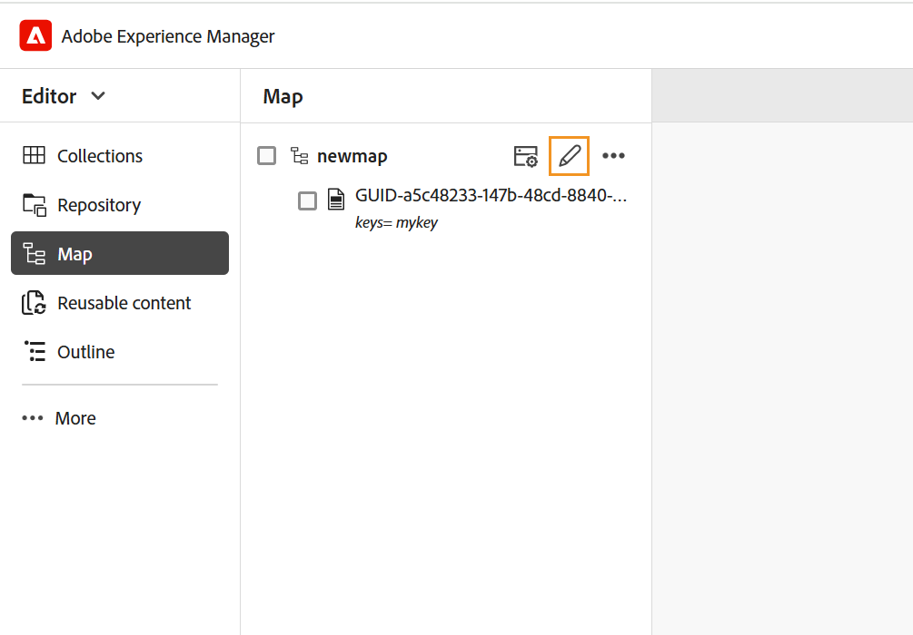
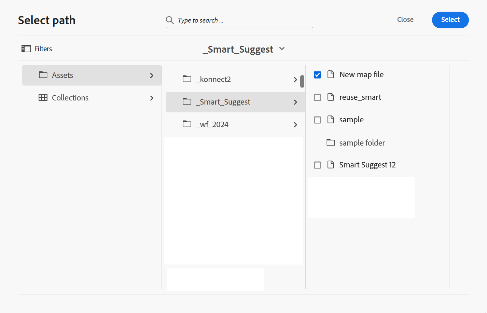

# 고급 맵 편집기 작업 {#id1942D0S0IHS}

고급 맵 편집기는 직관적인 사용자 인터페이스와 함께 제공되며 웹 편집기와 유사합니다. 웹 편집기에서 맵 파일을 열면 고급 맵 편집기 인터페이스를 사용하여 맵 파일을 편집할 수 있는 옵션이 제공됩니다. 고급 맵 편집기를 사용하면 주제 참조, 주요 참조, 콘텐츠 구조 등을 추가할 수 있습니다.

웹 편집기에서 직접 맵 파일을 편집할 수 있을 뿐만 아니라 맵에서 주제 파일을 열어 웹 편집기를 편집할 수도 있습니다. 이 항목에서는 고급 맵 편집기의 기능과 웹 편집기에서 DITA 맵의 파일을 열고 편집하는 방법에 대해 설명합니다.

## 맵 파일에 주제 추가

고급 맵 편집기를 사용하여 맵 파일을 작성하려면 다음 단계를 수행하십시오.

1. Assets UI에서 편집할 맵 파일로 이동합니다.

   >[!NOTE]
   >
   > 자산 선택 모드를 활성화하지 않았는지 확인합니다.

1. 맵 파일에서 단독 잠금을 설정하려면 맵 파일을 선택하고 **체크 아웃**&#x200B;을 클릭하세요.

   >[!NOTE]
   >
   > 맵 파일에 대해 배타적 잠금 기능이 있는 경우 다른 사용자는 맵을 편집할 수 없습니다. 그러나 맵 파일 내의 주제에 대해서는 작업할 수 있습니다. 관리자가 편집하기 전에 파일을 체크 아웃하도록 웹 편집기를 구성한 경우 파일을 체크 아웃할 때까지 편집할 수 없습니다. 마찬가지로 구성된 경우 파일을 닫기 전에 체크 아웃한 파일을 체크 인하라는 메시지가 표시됩니다

1. 맵 파일을 선택한 상태에서 **항목 편집**&#x200B;을 클릭합니다.

   {width="800" align="left"}

   또는 맵 파일의 작업 메뉴에서 **항목 편집** 옵션을 선택할 수도 있습니다.

   {width="800" align="left"}

   웹 편집기에서 편집할 수 있도록 맵 파일이 열립니다.

1. **편집** 아이콘을 클릭합니다.

   {width="550" align="left"}

   맵이 고급 맵 편집기 인터페이스에서 열립니다. 새 맵 파일을 연 경우 편집기에 맵의 제목만 표시됩니다.

   {width="800" align="left"}

   - **A** - \(*기본 도구 모음*\): 웹 편집기의 기본 도구 모음과 유사합니다. 자세한 내용은 웹 편집기의 [기본 도구 모음](web-editor-features.md#id2051EA0G05Z)을 참조하세요.

   - **B** - \(*보조 도구 모음*\) 맵 파일로 작업할 수 있는 보조 도구 모음입니다. 보조 도구 모음을 통해 사용할 수 있는 기능에 대한 자세한 내용은 [고급 맵 편집기의 도구 모음에서 사용할 수 있는 기능](#id205DEC0005Z)을 참조하십시오.

   - **C** - \(*맵 보기*\): 맵 편집기를 레이아웃, 작성자, Source 및 미리 보기 간에 전환할 수 있습니다. **레이아웃**&#x200B;보기를 사용하면 DITA 맵에서 주제를 구성할 수 있습니다. 이렇게 하면 맵의 트리 또는 계층 보기가 제공됩니다. **작성자** 보기를 사용하면 맵 편집기에서 항목을 편집할 수 있습니다. 또한 WYSIWYG 맵 파일의 보기를 제공합니다. **Source** 보기를 사용하면 맵 파일의 기본 XML로 작업할 수 있습니다. 미리보기 를 사용하면 맵 파일 내의 모든 주제 및 하위 맵에 대한 통합 보기를 사용할 수 있습니다. **닫기** 링크가 맵 파일을 닫습니다.

   - **D** - \(*왼쪽 패널*\): 즐겨찾기, 저장소, 맵, 개요 및 기타 기능에 액세스할 수 있는 왼쪽 패널에 대한 액세스 권한을 부여합니다. 사이드바 확장 아이콘 \(\)을 클릭하여 확장하거나 축소할 수 있습니다. 왼쪽 패널에서 사용할 수 있는 기능에 대한 자세한 내용은 웹 편집기에서 [왼쪽 패널](web-editor-features.md#id2051EA0M0HS)을 참조하십시오.

   - **E** - \(*중간 영역*\): 콘텐츠 편집 영역을 매핑합니다.

   - **F** - \(*오른쪽 패널*\): 속성 패널에 액세스할 수 있습니다. 선택한 주제 또는 맵의 콘텐츠 속성 및 맵 속성을 볼 수 있습니다. 이 패널에서 사용할 수 있는 기능에 대한 자세한 내용은 웹 편집기에서 [오른쪽 패널](web-editor-features.md#id2051EB003YK)을 참조하세요.

1. 왼쪽 패널에서 **저장소 보기**(으)로 전환합니다.

1. AEM 저장소에서 추가하려는 주제 또는 하위 맵이 포함된 폴더로 이동합니다.

1. **저장소 보기**&#x200B;에서 주제 또는 맵 파일을 선택하고 \(가운데\) 맵 콘텐츠 편집 영역으로 드래그 앤 드롭하십시오.

   항목이 맵에 추가됩니다.

   {width="800" align="left"}

1. 후속 주제 또는 하위 맵을 추가하려면 주제 또는 하위 맵을 맵의 필요한 위치로 드래그 앤 드롭합니다.

   맵 파일을 작성하는 동안 다음 사항을 고려하십시오.

   - 맵 편집 영역에서 가로 막대가 나타나는 위치에 파일이 추가됩니다. 다음 스크린샷에서는 *개요* 주제가 *일반 설명*&#x200B;과(와) *시작 및 랜딩 사이트* 주제 사이에 추가됩니다.

     {width="350" align="left"}

   - 항목을 바꾸려면 바꿀 항목의 위쪽, 왼쪽 또는 오른쪽에 항목을 배치합니다. 주제의 왼쪽 또는 오른쪽에 있는 세로 막대는 주제가 놓이는 것으로 대체됨을 나타냅니다.

     {width="550" align="left"}

     그러나 항목을 바꾸기 전에 확인 메시지가 표시됩니다. 확인을 한 후에만 주제가 바뀝니다.

     {width="300" align="left"}

   - DITA 맵에 하위 맵을 추가하면 하위 맵이 DITA 맵에 링크로 표시됩니다. 하위 맵의 모든 항목을 보려면 Ctrl 키를 누른 상태에서 하위 맵 링크를 클릭합니다. 하위 맵의 콘텐츠가 새 탭에 표시됩니다. 마찬가지로 DITA 맵에서 주제를 열려면 Ctrl 키를 누른 상태에서 주제 링크를 클릭하면 새 탭에서 열립니다.

   - 단축키 CTRL+Z 및 CTRL+Y 또는 도구 모음의 해당 아이콘을 사용하여 맵의 변경 사항을 실행 취소하거나 재실행할 수 있습니다.

   - 주제의 위치를 변경하려면 \(주제 아이콘\ 을 클릭하여) 주제를 선택한 다음 맵 파일의 원하는 위치에 드래그 앤 드롭합니다. 항목을 배치할 위치에 가로 막대가 표시되는지 확인합니다. 다음 스크린샷에서 *시작 및 랜딩 사이트* 주제가 *개요* 주제 뒤로 이동되고 있습니다.

     {width="350" align="left"}

   - 맵 파일의 속성을 확인하려면 맵 편집 영역의 아무 곳이나 마우스 오른쪽 단추로 클릭하고 상황에 맞는 메뉴에서 **속성**&#x200B;을 선택합니다. AEM 버전을 기반으로 메타데이터, 일정 \(de\) 활성화, 참조, 문서 상태 등의 속성을 볼 수 있습니다.

1. **저장**&#x200B;을 클릭합니다.

## 고급 맵 편집기 도구 모음에서 사용할 수 있는 기능 {#id205DEC0005Z}

고급 맵 편집기의 도구 모음은 웹 편집기 주제와 유사합니다. 왼쪽 패널 전환, 맵 저장, 새 맵 버전 만들기, 마지막 작업 실행 취소/다시 실행 및 선택한 요소 삭제와 같은 기본 작업은 두 편집기에서 공통됩니다. 이러한 작업의 작동 방식에 대한 자세한 내용은 [웹 편집기 기능 이해](web-editor-features.md#) 섹션을 참조하십시오.

레이아웃 및 작성자 보기의 도구 모음에서도 다음 맵별 작업을 사용할 수 있습니다.

## 레이아웃 보기 {#id205DEC0005Z_layout_view}

편집할 맵을 열면 맵 편집기의 레이아웃 보기가 열립니다.레이아웃 보기에는 맵 계층 구조가 트리 보기로 표시되고 맵에서 항목을 구성할 수 있습니다.

>[!NOTE]
>
> 레이아웃 보기에는 맵에 있는 참조만 표시됩니다. 참조가 끊어진 경우 참조 왼쪽에 작은 십자 기호가 표시됩니다

레이아웃 보기에서 다음 작업을 수행할 수 있습니다.

**항목 참조 삽입** - 

주제 검색 대화 상자를 표시합니다. 삽입할 주제/맵 파일로 이동한 다음 선택 을 클릭하여 맵에 추가합니다.
{width="800" align="left"}

**주제 그룹 삽입** - 

`topicgroup` 요소를 삽입합니다. 주제 그룹화에 대한 자세한 내용은 OASIS DITA 언어 사양의 [topicgroup](https://docs.oasis-open.org/dita/v1.0/langspec/topicgroup.html) 설명서를 참조하십시오.

**키 정의 삽입** - 

Keydef 삽입 대화 상자를 표시합니다. 이 대화 상자를 사용하여 맵에서 사용할 키 정의를 정의합니다.

{width="300" align="left"}

**다음 항목 앞에 삽입/다음 항목 뒤에 삽입** -  / 

요소 삽입 대화 상자를 표시합니다. 맵에 삽입할 요소를 선택합니다. 작업에 따라 새 요소는 맵에서 현재 요소의 앞 또는 뒤에 삽입됩니다.

**앞면 문제 삽입** - 

이 아이콘은 편집할 북맵을 열 때 표시됩니다. 목차, 색인, 목차 등 책의 시작 부분에 구성 요소를 삽입할 수 있다.

**다시 삽입** - 

이 아이콘은 편집할 북맵을 열 때 표시됩니다. 색인, 용어집, 그림 목록과 같은 책 끝에 대한 구성 요소를 삽입할 수 있습니다.

**선택한 항목을 왼쪽/오른쪽으로 이동** -  / 

왼쪽 화살표를 클릭하여 항목을 계층 구조에서 왼쪽으로 이동합니다. 이렇게 하면 각 주제가 계층 구조에서 한 수준 위로 승격됩니다. 예를 들어, 하위 항목이 선택되어 있는 동안 왼쪽 화살표를 클릭하면 해당 항목이 위에 있는 항목의 형제 항목이 됩니다. 마찬가지로 오른쪽 화살표를 클릭하면 주제가 오른쪽으로 밀려 주제가 위에 있는 주제의 하위가 됩니다.

**선택한 항목을 위/아래로 이동** - / 

위 또는 아래 화살표 아이콘을 클릭하여 계층 구조에서 항목을 위나 아래로 이동합니다.

>[!NOTE]
>
> 참조를 드래그 앤 드롭하여 맵에서 이동할 수도 있습니다.

**잠금/잠금 해제** -  / 

맵 파일을 잠근 후 잠금을 해제합니다. 맵 파일에 저장하지 않은 변경 사항이 있는 경우 잠금을 해제할 때 맵 파일을 저장하라는 메시지가 표시됩니다. 변경 사항은 맵 파일의 현재 버전에 저장됩니다.

**병합** - 

같은 파일이나 다른 파일의 다른 버전의 콘텐츠를 병합하는 방법에 대한 자세한 내용은 웹 편집기에서 [병합](web-editor-features.md#id205DF04E0HS)을 참조하십시오.

**버전 기록** - 

활성 토픽에서 사용 가능한 버전 및 레이블을 확인하고 편집기 자체의 버전으로 되돌립니다.

**버전 레이블** - 

버전 레이블 관리 대화 상자를 표시합니다. 드롭다운 목록에서 버전을 선택합니다. 선택한 버전에 적용할 레이블을 선택하고 **레이블 추가**&#x200B;를 클릭하여 추가합니다.

**옵션 보기** - 

줄 번호 표시, 확인란 표시 및 파일 이름 표시 옵션을 제공하는 드롭다운을 표시합니다.

- **줄 번호 표시**

각 주제의 줄 번호를 표시하거나 숨깁니다. 라인 번호는 계층 구조의 레벨에 따라 표시됩니다.

- **확인란 표시**

각 주제에 대한 확인란을 표시하거나 숨깁니다. 확인란을 사용하여 항목을 선택하고 옵션 메뉴를 사용하여 다양한 작업을 수행할 수 있습니다. 자세한 내용은 [옵션](#id228ID8006H8) 메뉴를 참조하세요.

- **파일 이름 표시**

주제의 파일 이름을 표시합니다.

>[!NOTE]
>
> 주제 제목 위에 포인터를 놓으면 파일 경로가 표시됩니다.

**조건부 필터를 기준으로 항목을 봅니다**&#x200B;항목에 조건을 적용한 경우 항목 오른쪽에 필터 아이콘이 표시됩니다. 포인터를 필터 아이콘 위에 올리면 적용된 조건과 해당 속성 값이 표시됩니다.

**레이아웃 보기의 옵션 메뉴**

맵 파일의 주제를 구성할 뿐만 아니라 레이아웃 보기의 요소에 사용할 수 있는 옵션 메뉴를 사용하여 다음 작업을 수행할 수도 있습니다.

{width="650" align="left"}

- **추가**: 맵 편집기에서 새 주제 또는 빈 참조를 추가하도록 선택할 수 있습니다.
   - **빈 참조**: 이 옵션을 사용하면 DITA 맵에 빈 참조를 추가할 수 있습니다. 나중에 삽입된 빈 참조를 두 번 클릭하고 항목 세부 사항을 추가할 수 있습니다. 자세한 내용은 웹 편집기에서 [주제 만들기](web-editor-features.md#id228ICI0105U)를 참조하십시오.
   - **새 주제**: 메뉴에서 새 주제를 만들도록 선택하면 새 주제 만들기 대화 상자가 표시됩니다. 새 주제 만들기 대화 상자에서 필요한 세부 정보를 입력하고 만들기 를 클릭합니다. 자세한 내용은 웹 편집기에서 [주제 만들기](web-editor-features.md#id228ICI0105U)를 참조하십시오.
- **이동**: 계층 구조에서 항목을 위/아래/오른쪽/왼쪽으로 이동하도록 선택할 수 있습니다. 또한 저장소 패널에서 맵 편집기에서 연 맵으로 항목이나 맵을 드래그 앤 드롭할 수도 있습니다.
- **실행 취소**: 레이아웃 보기에서 마지막 작업을 실행 취소합니다.
- **다시 실행**: 레이아웃 보기에서 마지막 작업을 다시 실행합니다.
- **복사**: 맵 파일에서 선택한 참조를 복사합니다.

  >[!NOTE]
  >
  > 확인란을 표시한 다음 선택하여 여러 참조를 복사합니다.

- **붙여넣기**: 복사한 참조를 계층 구조의 현재 위치에 붙여넣습니다.
- **삭제**: 맵 파일에서 선택한 참조를 삭제합니다.

  >[!NOTE]
  >
  > 확인란을 표시한 다음 선택하여 여러 참조를 삭제할 수 있습니다.

## 맵 편집기의 오른쪽 패널

오른쪽 패널에는 맵 편집기의 레이아웃 보기에 콘텐츠 속성 및 맵 속성 이 표시됩니다.

**콘텐츠 속성**

콘텐츠 속성 패널에는 맵에서 현재 선택한 주제 유형, 해당 링크 URL 및 해당 속성에 대한 정보가 포함되어 있습니다. 자세한 내용은 웹 편집기에서 [콘텐츠 속성](web-editor-features.md#id228IDB00HMM)을 참조하세요.

- **기타 특성** 관리자가 특성에 대한 프로필을 만든 경우 해당 특성이 구성된 값과 함께 제공됩니다. 콘텐츠 속성 패널을 사용하여 이러한 속성을 선택하고 주제의 관련 콘텐츠에 할당할 수 있습니다. 편집기 설정의 **특성 표시** 탭에서 관리자가 구성한 특성을 할당할 수도 있습니다. 요소에 대해 정의된 속성이 레이아웃 및 아웃라인 뷰에 표시됩니다. 이렇게 하면 특정 속성이 정의된 맵의 모든 항목을 빠르게 볼 수 있습니다. 예를 들어 플랫폼 속성이 &#39;Android&#39;로 정의된 모든 주제입니다.

  {width="650" align="left"}

  자세한 내용은 [왼쪽 패널](web-editor-features.md#id2051EA0M0HS) 섹션에서 *편집기 설정* 기능 설명 내의 *표시 특성*&#x200B;을 참조하세요.

- **메타데이터** 메타데이터 를 사용하여 메타데이터 정보를 설정할 수 있습니다. 탐색 제목, 링크 텍스트, 간단한 설명 및 키워드를 정의할 수 있습니다.

표준 주제 특성 및 메타데이터에 대한 자세한 내용은 OASIS DITA 언어 사양의 [topicref](https://docs.oasis-open.org/dita/v1.2/os/spec/langref/topicref.html) 설명서를 참조하십시오.

**맵 속성**

맵의 속성 및 메타데이터 정보를 설정할 수 있는 [맵 속성] 대화 상자를 표시합니다.

## 작성자 보기 {#id205DEC0005Z_author_view}

**작성자** 보기를 사용하면 웹 편집기에서 DITA 맵을 편집할 수 있습니다. 이는 맵 편집기의 WYSIWYG 보기를 보여주며 작성자 보기에 표시된 일부 아이콘은 레이아웃 보기와 동일합니다. 자세한 내용은 [레이아웃 보기](#id205DEC0005Z_layout_view)를 참조하세요. 또한 다음 아이콘을 보고 작성자 보기에서 관련 작업을 수행할 수 있습니다.

**다음 항목 앞에 삽입/다음 항목 뒤에 삽입** -  / 

요소 삽입 대화 상자를 표시합니다. 맵에 삽입할 요소를 선택합니다. 작업에 따라 새 요소는 맵에서 현재 요소의 앞 또는 뒤에 삽입됩니다.

**요소 삽입** - 

요소 삽입 대화 상자를 표시합니다. 삽입할 요소를 선택합니다. 키보드를 사용하여 요소 목록을 스크롤하고 Enter 키를 눌러 필요한 요소를 삽입할 수 있습니다. 또는 요소를 직접 클릭하여 맵에 삽입할 수 있습니다.

**관계 표 삽입** - 

맵에 관계 테이블을 삽입합니다. 관계 테이블 작업의 개념은 기본 맵 편집기 섹션에서 설명한 것과 동일하므로 자세한 내용은 [기본 맵 편집기에서 관계 테이블 작업](map-editor-basic-map-editor.md#id1944B0I0COB)을 참조하십시오.

**재사용 가능한 콘텐츠 삽입** - 

콘텐츠 재사용 대화 상자를 표시합니다. 이 대화 상자를 사용하여 재사용할 콘텐츠를 맵에 삽입합니다.

**탐색 제목 특성 새로 고침** - 

맵에서 참조된 파일의 `title` 요소를 해당 `@navtitle` 특성에 지정된 값과 동기화합니다. 주제, 참조, 작업, \(하위\) 맵 등과 같은 여러 유형의 참조 파일을 맵에 추가할 수 있습니다. 이러한 파일의 대부분은 `@navtitle` 특성을 지원합니다. 파일에 `@navtitle` 특성이 포함되어 있으면 맵에서 동일한 파일에 대한 `@navtitle` 특성이 업데이트됩니다. `@navtitle` 특성이 없는 경우 `@navtitle` 특성이 해당 참조 파일에 추가되고 해당 `title`도 업데이트되어 `@navtitle`을(를) 표시합니다.

>[!NOTE]
>
> 관리자는 사용자가 맵에 추가하는 모든 참조 파일에 `@navtitle` 특성을 자동으로 추가하도록 구성할 수 있습니다. 자동 추가 `@navtitle` 특성 구성에 대한 자세한 내용은 Adobe Experience Manager Guides as a Cloud Service 설치 및 구성에서 *@navtitle 특성을 기본적으로 포함*&#x200B;을 참조하십시오.

탐색 제목 속성 새로 고침 아이콘을 클릭하여 `title` 요소 및 `@navtitle` 속성 값을 동기화합니다.

**태그 보기 전환** - 

XML 태그를 표시하거나 숨깁니다. 태그는 요소의 경계를 나타내는 시각적 큐 역할을 합니다. 이 모드에서 주제/맵 참조를 삽입하려면 태그 앞 또는 뒤에 원하는 파일을 드래그 앤 드롭하십시오. 가로 막대는 태그 보기 모드에 표시되지 않습니다.

**변경 내용 추적 사용/사용 안 함** - 

변경 내용 추적 모드를 활성화하여 맵 파일에서 수행된 모든 업데이트를 추적할 수 있습니다. 변경 내용 추적을 활성화하면 모든 삽입 및 삭제 내용이 문서에 캡처됩니다. 자세한 내용은 웹 편집기에서 [변경 내용 추적 사용/사용 안 함](web-editor-features.md#id205DF0203Y4)을 참조하세요.

**검토 작업 만들기** - 

웹 편집기에서 직접 현재 주제 또는 맵 파일의 검토 작업을 만들 수 있습니다. 검토 작업을 생성할 파일을 열고 검토 작업 생성을 눌러 검토 생성 프로세스를 시작합니다. 자세한 내용은 [항목 또는 지도 검토](review.md#)에서 설명한 지침을 따르십시오.

## DITA 맵을 통해 주제 편집 {#id17ACJ0F0FHS}

개별 항목을 편집해도 작성자에게 전체 컨텍스트가 제공되지 않습니다. 작성자는 DITA 맵에서 주제가 배치되는 위치에 대한 정보를 가지고 있지 않습니다. 이러한 맥락적 정보가 없으면 저자는 콘텐츠를 만드는 것이 다소 어려워진다.

AEM Guides을 사용하면 작성자가 웹 편집기에서 DITA 맵을 열고 맵 내의 주제 배치를 볼 수 있습니다. 이렇게 하면 작성자가 맵 내에서 주제가 정확히 어디에 배치되는지 알고 보다 관련성 있는 콘텐츠를 만들 수 있습니다. 또한 프로젝트에서 작업 중인 작성자가 여러 명일 경우 맵에서 모든 항목을 사용할 수 있으며, 필요한 경우 콘텐츠를 재사용할 수 있습니다.

DITA 맵을 통해 주제를 편집하려면 다음 단계를 수행합니다.

1. Assets UI에서 편집할 주제가 포함된 DITA 맵으로 이동합니다.
1. DITA 맵을 클릭하여 DITA 맵 콘솔에서 엽니다.
1. DITA 맵에서 사용할 수 있는 주제 목록을 보려면 **주제** 탭을 선택하십시오.

   >[!TIP]
   >
   > 항목 탭에서는 맵 파일을 해당 종속 항목과 함께 다운로드할 수 있는 옵션이 제공됩니다. 자세한 내용은 [DITA 맵 파일 내보내기](authoring-download-assets.md#id218UBA00IXA)를 참조하십시오.

1. 기본 도구 모음에서 **항목 편집**&#x200B;을 클릭합니다.

   DITA 맵이 웹 편집기에서 열립니다.

   >[!NOTE]
   >
   > Assets UI에서 DITA 맵 파일을 선택하고 기본 도구 모음에서 **주제 편집**&#x200B;을 클릭하여 웹 편집기를 실행할 수도 있습니다.

   {width="350" align="left"}

1. \(*선택 사항*\) 편집하기 전에 맵에서 주제를 선택하고 파일을 체크 아웃할 수도 있습니다. 파일을 체크 아웃하려면 왼쪽 창에서 하나 이상의 파일을 선택하고 **체크 아웃**&#x200B;을 클릭합니다. 체크 아웃된 파일을 선택하고 맵 보기에서 **체크 아웃 취소 및 잠금 해제** 아이콘을 클릭하여 모든 파일의 잠금을 해제할 수도 있습니다.

   >[!IMPORTANT]
   >
   > 관리자가 **체크아웃하지 않고 편집 사용 안 함** 옵션을 구성한 경우 편집하기 전에 파일을 체크 아웃해야 합니다. 파일을 체크 아웃하지 않으면 문서가 편집기에서 읽기 전용 모드로 열립니다.

   다음 스크린샷에서는 [체크아웃 및 잠금] \(A\), [체크아웃 취소] 및 [잠금 해제] \(B\), [새 버전으로 저장] 및 [잠금 해제] \(C\), [편집] \(D\), [미리 보기] \(E\), 다른 DITA 파일 유형을 나타내는 다른 아이콘 \(F\) 및 체크 아웃된 파일 \(G\)의 아이콘을 강조 표시합니다.

   {width="550" align="left"}

1. 편집할 웹 편집기에서 항목 링크를 클릭하여 엽니다.

   편집기에서 여러 항목을 열 수 있으며 각 항목은 편집기의 새 탭에서 열립니다. DITA 맵에 하위 맵이 포함되어 있더라도 하위 맵의 주제는 편집을 위해 새 탭에서도 열립니다. 하위 맵 아래의 항목을 보려면 을 클릭하고 하위 맵을 확장할 수 있습니다.

   {width="800" align="left"}

   맵 파일을 클릭하면 웹 브라우저의 새 탭에서 맵이 열립니다.

1. 주제 편집이 끝나면 다음 작업을 수행할 수 있습니다.

   - 개별적으로 저장할 수 있습니다. **저장하지 않고 닫기**&#x200B;를 클릭하면 저장되지 않은 항목을 저장하라는 대화 상자가 표시됩니다.

     {width="550" align="left"}

     선택한 모든 항목을 저장하거나 저장하지 않으려는 항목을 선택 취소할 수 있습니다.

   - **새 버전으로 저장 및 잠금 해제** 단추를 사용하여 항목을 체크 인할 수 있습니다. 주제의 버전을 저장하면 새 버전이 만들어지고 잠금도 해제됩니다.

     파일을 체크 인하기 전에 변경 내용을 저장하는 것이 좋습니다.  변경 사항을 저장하면 XML 파일의 유효성이 검사됩니다.

   - **새 버전으로 저장 및 잠금 해제** 단추를 사용하여 여러 항목을 선택하고 체크 인할 수도 있습니다. 항목 버전을 저장하면 각 항목에 대해 새 버전이 만들어지고 잠금이 해제됩니다. **새 버전으로 저장 및 잠금 해제** 대화 상자에서 항목 체크 인 진행 상황을 볼 수도 있습니다. 파일을 체크 인하면 성공 메시지가 표시됩니다.

   - 관리자가 닫을 때 파일 체크 인 옵션을 활성화한 경우 체크 아웃된 파일을 닫을 때마다 파일을 저장하라는 메시지가 표시됩니다. 이 옵션을 활성화한 상태에서 변경된 파일이 있는 편집기를 닫으면 저장해야 하는 체크 아웃된 파일 목록이 표시됩니다. 체크 아웃된 파일은 잠금 아이콘으로 표시됩니다.

     {width="550" align="left"}

      - **저장하지 않고 닫기** 단추를 클릭하면 변경 내용을 저장하지 않고 파일이 닫힙니다.

      - **저장** 단추를 클릭하면 변경 내용이 저장되지만 파일을 체크 인하지는 않습니다.

      - **파일 확인** 옵션을 선택한 다음 **저장** 단추를 클릭하면 \(다른 버전을 만듭니다\) 파일이 체크 인되고 또한 저장됩니다.

## 맵 미리 보기

맵 내에서 각 주제 파일의 위치를 볼 수 있도록 할 뿐만 아니라, 맵 콘텐츠를 하나의 연속적인 흐름으로 보는 것이 바람직하다. 맵 미리 보기 기능을 사용하면 한 번의 클릭으로 맵 파일의 전체 콘텐츠를 볼 수 있습니다. 맵 파일의 출력을 생성하지 않아도 전체 맵이 게시된 후 어떻게 표시되는지 확인할 수 있습니다. 맵의 미리보기에 간단히 액세스할 수 있으며 모든 주제와 하위 맵이 책 형태로 렌더링됩니다.

다음에서 맵의 미리 보기에 액세스할 수 있습니다.

- **Assets UI**: Assets UI에서 맵 위치로 이동하고 맵 파일을 선택한 다음 도구 모음에서 **맵 미리 보기**&#x200B;를 선택합니다. 맵의 미리보기가 새 탭에 표시됩니다. 미리보기 모드에서 모든 주제의 컨텐트를 볼 수 있습니다. 이 보기에서는 항목을 편집할 수 없습니다.

  >[!NOTE]
  >
  > *맵 미리 보기* 옵션이 기본 도구 모음에 표시되지 않으면 **자세히** 도구 모음 메뉴 아래로 이동했을 수 있습니다.

- **고급 맵 편집기**: 고급 맵 편집기에서 미리 보기 아이콘을 클릭하여 현재 맵의 미리 보기를 확인합니다.

  {width="350" align="left"}

  미리보기 모드에서 다음과 같은 추가 작업을 수행할 수 있습니다.

   - 항목을 마우스 오른쪽 단추로 클릭하고 **편집**&#x200B;을 선택하여 편집할 항목을 새 탭에서 엽니다.

     >[!NOTE]
     >
     > 편집 권한이 없는 경우 주제가 읽기 전용 모드로 열립니다.

   - 맵 트리 \(왼쪽 패널\)에서 주제 제목을 클릭하여 원하는 주제로 이동합니다.

   - 맵 미리 보기의 현재 주제는 맵 트리에서도 강조 표시됩니다.

**상위 항목:**[&#x200B;맵 편집기 작업](map-editor.md)
