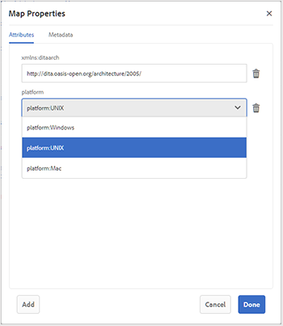

# 기본 맵 편집기 작업 {#id1942CM005Y4}

>[!NOTE]
>
> 이전에 Experience Manager Guides에서 사용할 수 있었던 기본 맵 편집기는 버전 4.3 및 2307부터 더 이상 사용되지 않습니다. 기본 맵 편집기에 액세스하여 DITA 맵을 만들고 관리할 수 없습니다.
>고급 맵 편집기를 사용하는 것이 좋습니다. 고급 맵 편집기는 향상된 기능과 더 나은 사용자 지정 옵션을 제공합니다. [고급 맵 편집기](../user-guide/map-editor-advanced-map-editor.md)를 사용하여 작업하는 방법에 대해 자세히 알아보세요.

기본 맵 편집기는 AEM 저장소에서 주제를 추가하여 DITA 맵이나 북맵을 만드는 손쉬운 드래그 앤 드롭 기능을 제공합니다. 중첩된 항목, 관계 테이블 \(relable\), 속성 및 메타데이터 정보를 추가하고 맵의 유효성을 검사할 수 있습니다.

>[!NOTE]
>
> 관리자가 고급 맵 편집기 옵션을 활성화한 경우 기본 맵 편집기에 액세스할 수 없습니다. 모든 맵 파일은 기본적으로 고급 맵 편집기에서 열립니다.

다음 섹션에서는 기본 맵 편집기에서 사용할 수 있는 다양한 기능에 대해 설명합니다.

## 맵 파일에 주제 추가 {#id193CBL0505Z}

맵 파일이 만들어지면 맵 파일에 항목을 추가해야 합니다. 기본 맵 편집기를 사용하여 주제, 관계 테이블 또는 기타 맵 파일을 추가할 수 있습니다.

맵 파일을 작성하려면 다음 단계를 수행하십시오.

1. Assets UI에서 편집할 맵 파일로 이동합니다.

1. 맵 파일에서 단독 잠금을 설정하려면 맵 파일을 선택하고 **체크 아웃**&#x200B;을 클릭하세요.

   >[!NOTE]
   >
   > 맵 파일에 대해 배타적 잠금 기능이 있는 경우 다른 사용자는 맵을 편집할 수 없습니다. 그러나 맵 파일 내의 주제에 대해서는 작업할 수 있습니다.

1. 맵 파일을 선택한 상태에서 **편집**&#x200B;을 클릭합니다.

   맵 편집기에서 편집할 수 있도록 맵 파일이 열립니다. 맵 편집기를 사용하여 참조 레일에 표시된 현재 사용 가능한 주제를 사용하여 맵을 작성합니다.

   {align="left"}

1. **참조** 레일을 사용하여 추가할 항목이나 하위 맵이 포함된 폴더로 이동합니다.

   >[!NOTE]
   >
   > 참조 레일의 모든 폴더에서 주제나 하위 맵을 추가할 수 있습니다.

1. 맵에 첫 번째 주제를 추가하려면 주제를 기본 맵 편집기로 드래그 앤 드롭하십시오.

   >[!NOTE]
   >
   > 첫 번째 링크를 추가한 후 맵에서 기존 주제 위로 마우스를 가져가면 새 참조 추가 링크를 사용할 수 있습니다.

1. 후속 주제 또는 하위 맵을 추가하려면 주제 또는 하위 맵을 맵의 필요한 위치로 드래그 앤 드롭합니다.

   DITA 맵에 하위 맵을 추가하면 하위 맵이 DITA 맵에 링크로 표시됩니다. 하위 맵의 모든 항목을 보려면 하위 맵 링크를 누릅니다. 하위 맵의 콘텐츠가 새 탭에 표시됩니다.

   >[!NOTE]
   >
   > 맵의 기존 주제에 대한 새 주제를 드롭하면 주제를 바꾸는 것에 대한 메시지가 표시됩니다. 항목을 바꾸려면 [예]를 클릭하고, 항목을 바꾸지 않으려면 [아니요]를 클릭합니다. Ctrl+Z 및 Ctrl+Y를 사용하여 맵의 변경 사항을 실행 취소하거나 재실행할 수 있습니다.

1. **저장**&#x200B;을 클릭합니다.

## 기본 맵 편집기 도구 모음에서 사용할 수 있는 기능

기본 맵 편집기의 기본 도구 모음을 사용하여 다음 작업을 수행할 수 있습니다.

{align="left"}

**A: 검색**

DAM에서 필요한 항목을 검색하고 포함할 수 있습니다. 이 아이콘을 클릭하면 검색 대화 상자가 표시됩니다.

{align="left"}

검색할 키워드를 입력합니다. 이 키워드는 주제의 파일 이름, 컨텐트 및 속성 값에도 일치합니다. 검색 결과를 사용할 수 있게 되면 원하는 항목을 선택하고 확인 버튼을 클릭하여 맵 구조의 끝에 선택한 파일을 추가합니다. 수정 날짜 매개 변수를 지정하여 검색 결과를 필터링할 수 있습니다.

**B: 그룹**

주제 왼쪽에 있는 확인란을 클릭하고 도구 모음에서 그룹 을 클릭하여 선택한 주제를 그룹화합니다. 주제 그룹화에 대한 자세한 내용은 OASIS DITA 언어 사양의 [topicgroup](https://docs.oasis-open.org/dita/v1.0/langspec/topicgroup.html) 설명서를 참조하십시오.

**C: 삭제**

주제 왼쪽에 있는 확인란을 클릭하고 도구 모음에서 삭제 를 클릭하여 선택한 주제를 맵에서 제거합니다.

**D: 숫자 표시/숫자 숨기기**

맵의 항목에 대해 \(또는 숨기기\) 번호 매기기를 표시합니다.

**E: 유효성 검사**

맵이 유효한지 또는 오류가 있는지 확인합니다.

**F: 기본 모드/XML 모드**

**기본 모드**&#x200B;에서 항목 링크를 클릭하면 새 탭에서 항목의 미리 보기가 표시됩니다. **기본 모드** 아이콘을 클릭하면 해당 모드가 **XML 모드**(으)로 변경됩니다. **XML 모드**&#x200B;에서 주제 행의 아무 곳이나 클릭하면 주제 내의 주제 참조에 대한 기본 XML이 표시됩니다. 원본 XML 보기에는 XML 코드를 프레젠테이션 가능하고 읽기 쉬운 형식으로 다시 구성하는 **자동 들여쓰기** 옵션이 있습니다. 맵을 수동으로 편집하는 경우 소스 뷰에서도 유효성 검사를 수행합니다. XML에 오류가 있는 경우 **XML 모드**&#x200B;에서 동일한 항목이 강조 표시되고 DITA 맵 파일을 저장할 수 없습니다. 전체 맵의 XML을 보려면 주제 경계 바깥쪽을 클릭합니다.

**참고:** 기본 모드에서는 키보드 단축키를 사용하여 마지막 작업을 실행 취소하거나 \(`Ctrl+z`\) 다시 실행할 수 있습니다. \(`Ctrl+y`\)

{width="650" align="left"}

**G: 맵 속성**

맵의 속성 및 메타데이터 정보를 설정할 수 있는 [맵 속성] 대화 상자를 표시합니다. 특성을 추가하려면 대화 상자의 왼쪽 하단 모서리에 있는 **추가** 단추를 클릭하여 **특성** 드롭다운 목록을 가져옵니다. 목록에서 추가할 속성을 선택합니다. 선택한 속성에 DTD에 지정된 사전 정의된 값이 있는 경우 해당 값이 새 드롭다운 목록에 표시됩니다. 드롭다운 목록에서 원하는 값을 선택할 수 있습니다. 미리 정의된 값이 없으면 선택한 속성에 대한 값을 입력할 수 있는 텍스트 상자가 표시됩니다.

{width="300" align="left"}

## 기본 맵 편집기의 주제 수준에서 사용할 수 있는 기능

기본 맵 편집기에서 주제 또는 하위 맵 파일 위로 마우스 포인터를 가져가면 다음 작업을 수행할 수 있습니다.

{width="650" align="left"}

**A: 왼쪽으로 이동 또는 오른쪽으로 이동**

왼쪽 또는 오른쪽 화살표 아이콘 을 클릭하여 항목을 왼쪽 또는 오른쪽으로 이동합니다. 이러한 방식으로 항목을 이동하면 해당 항목 위의 항목에 대해 하위 \(nest\) 또는 동위 \(nesting\ 제거)가 됩니다.

**B: 속성**

속성 아이콘을 클릭하여 Topicref 속성 대화 상자를 엽니다. 이 대화 상자를 사용하면 주제 속성 및 메타데이터 정보를 설정할 수 있습니다. 표준 주제 특성 및 메타데이터에 대한 자세한 내용은 OASIS DITA 언어 사양의 [topicref](https://docs.oasis-open.org/dita/v1.2/os/spec/langref/topicref.html) 설명서를 참조하십시오.

{width="350" align="left"}

**C: 새 참조 추가**

새 참조 추가 아이콘을 클릭하여 새 참조를 현재 주제의 동위 멤버로 추가합니다.

**D: 새 키 정의 추가**

키 아이콘을 클릭하여 새 키 정의를 추가합니다. 재정의된 모든 키 또는 맵에서 이미 정의된 키가 빨간색으로 표시됩니다. 키 정의에서 속성 아이콘을 클릭하면 Keydef 속성 대화 상자가 표시됩니다.

## 기본 맵 편집기에서 관계 테이블 작업 {#id1944B0I0COB}

AEM Guides 맵 편집기에는 DITA 맵에서 관계 테이블을 만들고 편집할 수 있는 강력한 기능이 제공됩니다.

기본 맵 편집기에서 관계 테이블로 작업하려면 다음 단계를 수행하십시오.

1. Assets UI에서 관계 테이블을 만들 DITA 맵으로 이동합니다.

1. DITA 맵을 클릭하여 DITA 맵 콘솔에서 엽니다.

1. DITA 맵에서 사용할 수 있는 주제 목록을 보려면 **주제** 탭을 선택하십시오.

   >[!TIP]
   >
   > 항목 탭에서는 맵 파일을 해당 종속 항목과 함께 다운로드할 수 있는 옵션이 제공됩니다. 자세한 내용은 [DITA 맵 파일 내보내기](authoring-download-assets.md#id218UBA00IXA)를 참조하십시오.

1. 기본 도구 모음에서 **편집**&#x200B;을 클릭합니다.

   기본 맵 편집기에서 맵 파일을 엽니다.

1. 도구 모음에서 **Relable**&#x200B;을(를) 선택합니다.

   {width="650" align="left"}

1. 주제 목록에서 관련 있는 편집기로 주제를 드래그 앤 드롭합니다.

   >[!NOTE]
   >
   > 참조 레일의 모든 폴더에서 주제를 추가할 수 있습니다.

   {width="550" align="left"}

1. 관계 테이블에 머리글을 추가하려면 **Relheader 추가**&#x200B;를 클릭합니다.

1. 관계 테이블에 열을 추가하려면 **열 추가**&#x200B;를 클릭하세요.

   {width="550" align="left"}

1. **저장**&#x200B;을 클릭합니다.

관계 테이블 편집기에서 다음 작업을 수행할 수도 있습니다.

**행 또는 열 삭제**

테이블에서 열을 삭제하려면 열 헤더에서 확인란을 선택하고 삭제를 누릅니다. 테이블에서 행을 제거하려면 각 행의 첫 번째 열에 있는 확인란을 선택하고 삭제를 누릅니다.

**주제 삭제**

테이블에서 주제를 삭제하려면 주제 옆에 있는 교차 아이콘을 클릭합니다.

**관계 테이블 삭제**

관계 테이블을 삭제하려면 관계 테이블 외부 아무 곳이나 누르고 삭제를 누릅니다.

**상위 항목:**&#x200B;[&#x200B;맵 편집기 작업](map-editor.md)
