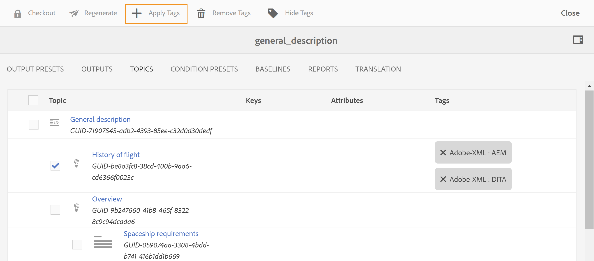

# DITA 콘텐츠의 벌크 태그 지정 {#id179SG0TN05Z}

태그를 사용하여 콘텐츠 저장소 내 및 게시된 출력에서 콘텐츠를 그룹화하거나 분류할 수 있습니다. 컨텐트에 태그를 적용한 경우 DITA 맵에서 컨텐트를 작성하는 데 도움이 되는 관련 주제를 쉽게 찾을 수 있습니다. 게시된 출력을 사용하면 최종 사용자가 적절한 태그를 사용하여 적절한 콘텐츠를 더 빨리 찾을 수 있습니다.

Adobe Experience Manager Guides을 사용하면 몇 가지 단계에서 DITA 콘텐츠에 태그를 지정할 수 있습니다. 벌크 태그 지정 기능을 사용하여 여러 주제, DITA 맵 또는 하위 맵에 여러 태그를 적용할 수 있습니다. 또는 개별 주제에 태그를 적용할 수도 있습니다. 태깅은 Adobe Experience Manager의 기본 기능으로, Adobe Experience Manager 설명서의 [태그 관리](https://experienceleague.adobe.com/docs/experience-manager-cloud-service/sites/authoring/features/tags.html?lang=ko) 섹션에서 태그 만들기 및 관리에 대한 자세한 내용을 찾을 수 있습니다.

기본적으로 Experience Manager Guides은 Adobe Experience Manager 저장소의 모든 태그가 저장된 폴더에 있는 모든 사용자에게 읽기 액세스 권한을 부여하지 않습니다. Adobe Experience Manager 저장소에 정의된 태그를 사용하려면 시스템 관리자에게 태그가 저장된 폴더에 대한 액세스 권한을 부여하도록 요청해야 합니다.

## 일괄 태그 적용

일괄 태그 지정 기능을 사용하여 한 번에 여러 태그를 적용할 수 있습니다. DITA 맵의 주제에 태그를 적용하려면 다음 단계를 수행하십시오.

1. Assets UI에서 DITA 맵 파일을 탐색하고 선택합니다.

   DITA 맵 콘솔이 나타나고 출력을 생성하는 데 사용할 수 있는 출력 사전 설정 목록이 표시됩니다.

1. **주제**&#x200B;를 선택하십시오.

   DITA 맵에서 사용할 수 있는 주제 목록이 표시됩니다. 주제 제목 아래에는 &#39;주제의 UUID&#39;가 표시됩니다.

1. 태그를 적용할 주제 또는 하위 맵을 선택합니다.

   {width="650" align="left"}

   >[!NOTE]
   >
   > 위의 스크린샷은 선택 및 확장된 하위 맵을 보여 줍니다. 하위 맵을 선택하면 하위 맵 아래의 모든 항목도 선택됩니다.

1. **태그 적용**&#x200B;을 선택합니다.

   태그 선택 대화 상자가 나타납니다.

1. 선택한 주제에 적용할 태그를 하나 이상 선택합니다.

1. 선택 내용을 확인합니다.

   선택한 태그는 주제에 적용되고 주제 제목 옆에 표시됩니다.

   >[!NOTE]
   >
   > 주제에 태그를 추가한 후 주제를 이동하거나 삭제하면 해당 주제에 대한 태그도 제거됩니다. 그러나 이 항목은 제거할 때까지 맵에 남아 있습니다.

## 개별 주제에 태그 적용

태그를 개별 주제에 적용하려면 다음 단계를 수행하십시오.

1. Assets UI에서 태그를 적용할 주제 파일로 이동하여 선택합니다.

1. 도구 모음에서 **속성**&#x200B;을 선택합니다.

   주제의 등록 정보 페이지가 나타납니다.

1. 기본 탭에서 **태그** 필드 옆의 찾아보기 아이콘을 선택합니다.

1. 선택한 주제에 적용할 태그를 하나 이상 선택합니다.

1. 선택 내용을 확인합니다.

1. **태그 적용**&#x200B;을 선택합니다.

   선택한 태그가 주제에 적용되고 태그 필드에 표시됩니다.

1. **저장 후 닫기**&#x200B;를 선택합니다.

## 태그 제거

비즈니스 요구 사항에 따라 DITA 주제에 대한 태깅 정보를 변경할 수 있습니다. 모든 태그를 한 번에 쉽게 제거하거나 항목에서 유효하지 않은 태그만 제거할 수 있습니다.

하나 이상의 주제에서 모든 태그를 제거하려면 다음 단계를 수행하십시오.

1. Assets UI에서 로 이동하여 DITA 맵 파일을 선택합니다.

   DITA 맵 콘솔이 나타나고 출력을 생성하는 데 사용할 수 있는 출력 사전 설정 목록이 표시됩니다.

1. **주제**&#x200B;를 선택하십시오.

   DITA 맵에서 사용할 수 있는 주제 목록이 표시됩니다.

1. 태그를 제거할 주제를 선택합니다.

1. **태그 제거**&#x200B;를 선택합니다.

   >[!NOTE]
   >
   > 태그 삭제 아이콘이 보이지 않을 경우 태그 숨기기 기능을 활성화하지 않았는지 확인합니다.

1. 삭제 확인 대화 상자에서 **확인**&#x200B;을 선택하여 선택한 항목에서 태그를 제거합니다.

## 태그 표시 또는 숨기기

주제에 적용되는 태그 목록이 길면 탐색하는 데 다소 번거로울 수 있습니다. 태그 숨기기 아이콘을 선택하여 DITA 맵 콘솔 보기에서 태그를 쉽게 숨길 수 있습니다. 마찬가지로 태그가 표시되지 않는 경우 태그 표시를 선택하면 모든 태그가 표시됩니다.

**상위 항목:**&#x200B;[&#x200B;메타데이터 관리](manage-metadata.md)
