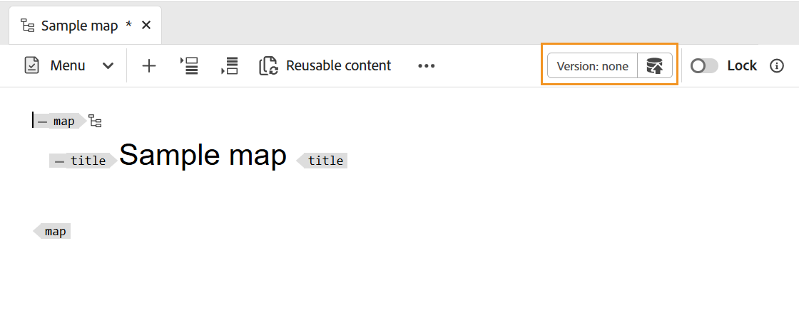

# 맵 만들기 {#id176FEN0D05Z}

Adobe Experience Manager Guides은 DITA 맵과 북맵이라는 두 가지 기본 맵 템플릿을 제공합니다. 또한 고유한 맵 템플릿을 만들고 이를 작성자와 공유하여 맵 파일을 만들 수도 있습니다.

맵을 만들려면 다음 단계를 수행하십시오.

1. 저장소 패널에서 **새 파일** 아이콘을 선택한 다음 드롭다운 메뉴에서 **DITA 맵**&#x200B;을(를) 선택합니다.

   {align="left"}

   [Experience Manager Guides 홈 페이지](./intro-home-page.md)와 저장소 보기에 있는 폴더의 옵션 메뉴에서도 이 옵션에 액세스할 수 있습니다.

2. **새 맵** 대화 상자가 표시됩니다.

3. **새 맵** 대화 상자에서 다음 세부 정보를 제공합니다.
   - 지도의 제목
   - \(선택 사항\)* 맵의 파일 이름입니다. 파일 이름은 제목 항목을 기반으로 자동 제안됩니다. 관리자가 UUID 설정을 기반으로 자동 파일 이름을 활성화한 경우 이름 필드가 표시되지 않습니다.
   - 주제의 기반이 되는 템플릿입니다. 맵 파일의 경우 사용 가능한 옵션은 **Bookmap**, **Map** 및 **제목 체계**&#x200B;입니다.
   - 맵 파일을 저장할 경로입니다. 기본적으로 현재 저장소에서 선택한 폴더의 경로가 경로 필드에 표시됩니다.

   {width="300" align="left"}

4. **만들기**&#x200B;를 선택합니다.

지정한 경로에 맵이 만들어집니다. 또한 맵 편집기에서 편집할 수 있도록 맵이 열립니다.

{align="left"}

## 맵 파일에 주제 추가

편집기에서 직접 맵 파일을 편집할 수 있을 뿐만 아니라 맵에서 주제 파일을 열어 편집기를 편집할 수도 있습니다. 맵 파일에 항목을 추가할 수 있습니다.

맵 콘솔에서 항목을 맵 파일에 추가하려면 다음 단계를 수행하십시오.

1. 저장소 보기에서 편집할 맵 파일로 이동하여 엽니다.
1. **편집** 아이콘을 선택합니다.

   {width="450" align="left"}

1. 맵 파일이 맵 편집기에서 열립니다. 새 맵 파일을 연 경우 편집기에 맵의 제목만 표시됩니다.

   {align="left"}

   - **A** - \(*탭 표시줄*\): 편집기의 탭 표시줄과 비슷합니다. 자세한 내용은 편집기에서 [탭 모음](./web-editor-tab-bar.md)을 참조하세요.

   - **B** - \(*도구 모음*\) 맵 파일로 작업할 수 있는 도구 모음입니다. 도구 모음을 통해 사용할 수 있는 기능에 대한 자세한 내용은 맵 편집기의 도구 모음에서 사용할 수 있는 [기능](#features-available-in-the-map-editors-toolbar)을 참조하세요.

   - **C** - \(*맵 보기*\): 맵 편집기를 레이아웃, 작성자, Source 및 미리 보기 간에 전환할 수 있습니다. **레이아웃** 보기를 사용하면 DITA 맵에서 주제를 구성할 수 있습니다. 이렇게 하면 맵의 트리 또는 계층 보기가 제공됩니다. **작성자** 보기를 사용하면 맵 편집기에서 항목을 편집할 수 있습니다. 또한 WYSIWYG에 맵 파일의 보기를 제공합니다. **Source** 보기를 사용하면 맵 파일의 기본 XML로 작업할 수 있습니다. 미리보기 를 사용하면 맵 파일 내의 모든 주제 및 하위 맵에 대한 통합 보기를 사용할 수 있습니다.

   - **D** - \(*왼쪽 패널*\): 컬렉션, 저장소, 맵, 개요 및 기타 기능에 액세스할 수 있는 왼쪽 패널에 액세스할 수 있습니다. 확장/축소 아이콘을 선택하여 확장 또는 축소할 수 있습니다. 왼쪽 패널에서 사용할 수 있는 기능에 대한 자세한 내용은 편집기에서 [왼쪽 패널](./web-editor-left-panel.md)을 확인하세요.

   - **E** - \(*중간 영역*\): 콘텐츠 편집 영역을 매핑합니다.

   - **F** - \(*오른쪽 패널*\): 속성 패널에 액세스할 수 있습니다. 선택한 주제 또는 맵의 콘텐츠 속성 및 맵 속성을 볼 수 있습니다. 이 패널에서 사용할 수 있는 기능에 대한 자세한 내용은 편집기에서 [오른쪽 패널](web-editor-right-panel.md)을 참조하세요.

1. 왼쪽 패널에서 **저장소** 보기로 전환합니다.

1. Adobe Experience Manager 저장소에서 추가하려는 주제 또는 하위 맵이 포함된 폴더로 이동합니다.

1. **저장소** 보기에서 주제 또는 맵 파일을 선택하고 \(가운데\) 맵 콘텐츠 편집 영역으로 끌어서 놓습니다.

   항목이 맵에 추가됩니다.

   {align="left"}

1. 후속 주제 또는 하위 맵을 추가하려면 주제 또는 하위 맵을 맵의 필요한 위치로 드래그 앤 드롭합니다.

   맵 파일을 작성하는 동안 다음 사항을 고려하십시오.

   - 맵 편집 영역에서 파선 사각형 막대가 나타나는 위치에 파일이 추가됩니다. 다음 스크린샷에서는 *스마트 제안 1*&#x200B;과(와) *스마트 제안 2* 주제 사이에 *샘플 주제* 주제가 추가됩니다.

     {align="left"}

   - 항목을 바꾸려면 바꿀 항목 위에 새 항목을 끌어서 놓습니다. 그리고 드롭하면 해당 항목이 드롭되는 것으로 바뀝니다.

   - DITA 맵에 하위 맵을 추가하면 하위 맵이 DITA 맵에 링크로 표시됩니다. 하위 맵의 모든 항목을 보려면 Ctrl 키를 누른 상태에서 하위 맵 링크를 클릭합니다. 하위 맵의 콘텐츠가 새 탭에 표시됩니다. 마찬가지로 DITA 맵에서 주제를 열려면 Ctrl 키를 누른 상태에서 주제 링크를 클릭하면 새 탭에서 열립니다.

   - 단축키 CTRL+Z 및 CTRL+Y 또는 도구 모음의 해당 아이콘을 사용하여 맵의 변경 사항을 실행 취소하거나 재실행할 수 있습니다.

   - 주제의 위치를 변경하려면 주제 아이콘을 선택하여 주제를 \(선택\) 선택한 다음 맵 파일의 원하는 위치에 드래그 앤 드롭합니다. 다음 스크린샷에서 *스마트 제안 1* 주제가 *샘플 주제* 뒤로 이동되고 있습니다.

     {align="left"}

   - 맵 파일의 속성을 확인하려면 맵 편집 영역의 아무 곳이나 마우스 오른쪽 단추로 클릭하고 상황에 맞는 메뉴에서 **속성**&#x200B;을 선택합니다. Adobe Experience Manager 버전을 기반으로 메타데이터, 일정 \(de\) 활성화, 참조, 문서 상태 등의 속성을 볼 수 있습니다.

1. **저장**&#x200B;을 선택합니다.

## Assets UI에서 맵 만들기

Assets UI에서 맵 파일을 만들고 맵 편집기에서 열어 편집할 수도 있습니다.

Assets UI에서 맵을 만들려면 다음 단계를 수행하십시오.

1. Assets UI에서 맵 파일을 만들 위치로 이동합니다.

1. **만들기** \> **DITA 맵**&#x200B;을(를) 선택합니다.

1. 블루프린트 페이지에서 사용할 맵 템플릿 유형을 선택하고 **다음**&#x200B;을(를) 선택합니다.

   >[!NOTE]
   >
   > 맵 파일에서 주제가 참조되는 방식은 맵 템플릿에 따라 다릅니다. 예를 들어 맵 템플릿을 선택하면 항목 참조 \(`topicref`\)가 항목을 참조하는 데 사용됩니다. 북맵의 경우 DITA의 `chapter` 요소를 사용하여 주제 참조를 만듭니다.

   {align="left"}

1. 속성 페이지에서 맵 **제목**&#x200B;을 지정하십시오.

1. \(선택 사항\) **Name** 파일을 지정합니다.

   관리자가 UUID 설정을 기반으로 자동 파일 이름을 구성한 경우 파일 이름을 지정하는 옵션이 표시되지 않습니다. UUID 기반 파일 이름은 파일에 자동으로 할당됩니다.

   파일 이름 지정 옵션을 사용할 수 있으면 맵의 제목 을 기반으로 이름이 자동으로 제안됩니다. 맵 파일 이름을 수동으로 지정하려면 파일 이름에 공백, 아포스트로피 또는 중괄호가 포함되어 있지 않고 `.ditamap`(으)로 끝나는지 확인하십시오.

1. **만들기**&#x200B;를 선택합니다.

   맵이 생성됨 메시지가 나타납니다.

   Assets UI 또는 편집기에서 만드는 모든 새 맵 파일에는 고유한 맵 ID가 지정됩니다. 또한 새 맵이 DAM에 최신 작업 복사본으로 저장됩니다. 새로 생성된 맵의 개정 버전을 저장할 때까지 버전 내역에 버전 번호가 표시되지 않습니다. 편집할 맵을 열면 맵 파일의 탭 오른쪽 상단 모서리에 버전 정보가 표시됩니다.

   {align="left"}

   새로 만든 맵의 버전 정보가 *없음*(으)로 표시됩니다. 새 버전을 저장하면 버전 번호가 1.0으로 지정됩니다. 새 버전을 저장하는 방법에 대한 자세한 내용은 [새 버전으로 저장](web-editor-features.md#save-as-new-version)을 참조하세요.

   구성된 맵 편집기에서 편집할 맵을 열거나 Adobe Experience Manager 저장소에 맵 파일을 저장하도록 선택할 수 있습니다.

   >[!NOTE]
   >
   > 고급 맵 편집기를 사용하려면 편집기에서 맵 파일에 액세스합니다. 관리자가 고급 맵 편집기를 맵 파일의 기본 편집기로 구성한 경우 맵 파일은 편집을 위해 고급 맵 편집기에서 직접 열립니다. Adobe Experience Manager Guides as a Cloud Service 설치 및 구성에서 *고급 맵 편집기를 기본값으로 설정* 섹션을 봅니다.

### Assets UI에서 맵 파일에 주제 추가

Assets UI에서 항목을 맵 파일에 추가하려면 다음 단계를 수행하십시오.

1. Assets UI에서 편집할 맵 파일로 이동합니다.

   >[!NOTE]
   >
   > 자산 선택 모드를 활성화하지 않았는지 확인합니다.

1. 맵 파일에서 단독 잠금을 가져오려면 맵 파일을 선택한 다음 맨 위에 있는 **체크 아웃** 옵션을 선택하십시오.

   >[!NOTE]
   >
   > 맵 파일에 대해 배타적 잠금 기능이 있는 경우 다른 사용자는 맵을 편집할 수 없습니다. 그러나 맵 파일 내의 주제에 대해서는 작업할 수 있습니다. 관리자가 편집하기 전에 파일을 잠그도록 편집기를 구성한 경우 파일을 잠글 때까지 편집할 수 없습니다.

1. 맵 파일을 선택한 상태에서 **주제 편집**&#x200B;을 선택합니다.

   {align="left"}

   또는 맵 파일의 작업 메뉴에서 **항목 편집** 옵션을 선택할 수도 있습니다.

   {align="left"}

   편집기에서 편집할 수 있도록 맵 파일이 열립니다. 맵 파일에 항목을 추가하려면 [맵 파일에 항목 추가](#add-topics-to-a-map-file)의 (4-8) 단계를 따르십시오.

**상위 항목: [맵 편집기 소개](map-editor.md)
