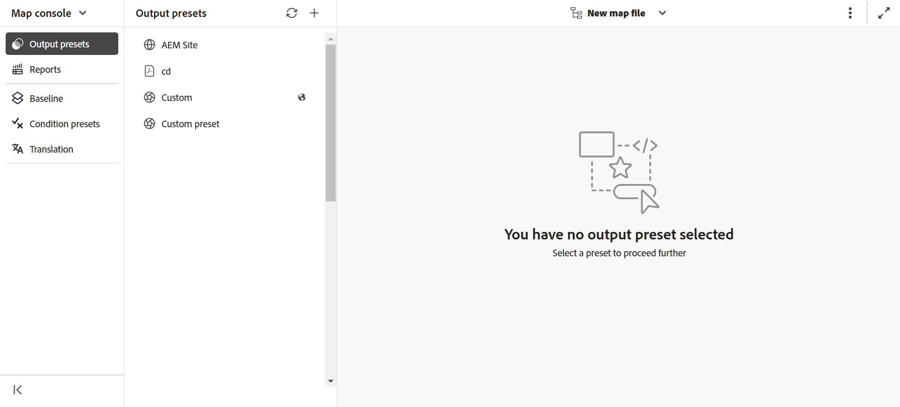

# 맵 콘솔에서 파일 열기

맵 콘솔에서 DITA 맵 파일을 열려면 다음 단계를 수행하십시오.

1. 홈 페이지에서 **맵 콘솔**&#x200B;을 엽니다.

   {width="800"align="left"}

2. 맵 파일을 선택하지 않았으므로 맵 관리 및 게시 기능을 사용할 맵 파일을 선택하라는 메시지가 표시됩니다.

   

3. **맵 선택**&#x200B;을 선택하고 DITA 맵 파일이 있는 경로를 선택합니다.

   맵 파일이 맵 콘솔에서 열립니다. 기본적으로 **출력 사전 설정** 탭이 선택되어 있습니다.

   {width="800"align="left"}

   >[!NOTE]
   >
   >  맵 콘솔에서 열린 맵은 편집기에서 사용할 수 있는 맵 보기와 동기화됩니다.

## 편집기에서 맵 파일 열기

편집기에서 맵 콘솔의 기존 맵 파일을 열 수도 있습니다.

1. 저장소 보기로 이동하여 DITA 맵 파일을 선택합니다.

   맵 파일이 맵 보기에서 열립니다.

2. **맵 콘솔에서 열기** 아이콘을 선택합니다.

   맵 파일이 맵 콘솔에서 열립니다.

   {align="left"}
