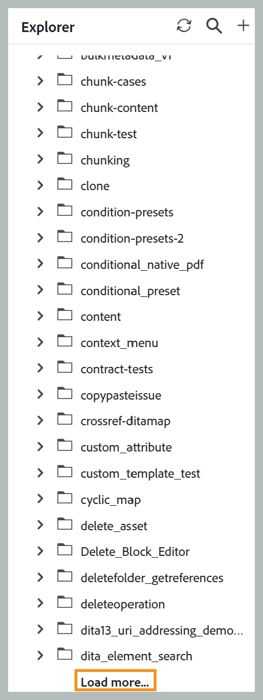
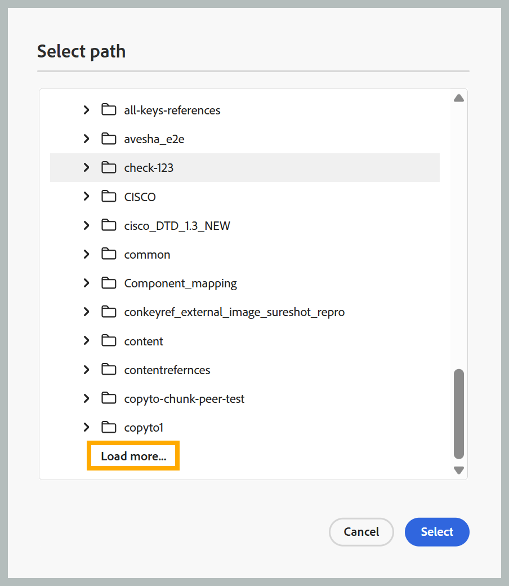

## 페이지 매김된 파일 및 폴더 로드

>[!NOTE]
>
> 이 기능은 기본적으로 활성화되어 있습니다. 비활성화하려면 고객 지원 팀에 문의하십시오.

Experience Manager Guides은 페이지 매김된 API를 사용하여 파일 및 폴더를 로드합니다. 모든 콘텐츠를 한 번에 로드하는 대신 폴더가 일괄 처리로 점진적으로 로드되며, 스크롤할 때 또는 **더 로드** 옵션을 선택하여 추가 자산이 자동으로 검색됩니다.

정렬은 서버측에서 수행되므로 정렬 순서를 적용하면 브라우저에 이미 로드된 데이터를 재정렬하지 않고 새로 정렬된 결과를 가져옵니다. 이름 변경, 삭제, 추가 및 이동과 같은 일반적인 작업은 더 이상 전체 폴더를 다시 로드하지 않습니다. 대신 영향을 받는 항목만 업데이트하거나 결과의 첫 페이지를 새로 고칩니다. *항상 탐색기에서 파일 찾기* 기능도 더 이상 사용할 수 없습니다. 모든 에셋의 경우 컨텍스트 메뉴를 사용하여 탐색기에서 파일을 찾을 수 있습니다.

아래 섹션에서는 이러한 각 항목이 서로 다른 인터페이스, 패널 및 대화 상자에 어떻게 적용되는지 설명합니다.

### 홈 저장소 테이블

- **찾아보기**: 무한 스크롤을 사용합니다. 자산의 첫 번째 배치는 처음에 로드되고, 이후 배치는 스크롤할 때 자동으로 추가됩니다. 폴더를 전환하면 현재 목록이 지워지고 새로 선택한 폴더에서 에셋이 로드됩니다.
- **이름 바꾸기**: 바로 사용. 폴더를 새로 고치지 않습니다.
- **삭제**: 루트 폴더가 새로 고침되어 첫 번째 자산 배치를 표시합니다.
- **추가**: 새 파일이 현재 폴더의 맨 위에 삽입됩니다. 문서 상태, 잠금 상태, 파일 유형, 생성 날짜 및 기타 세부 정보와 같은 추가 메타데이터는 일괄 처리된 단일 백그라운드 요청에서 가져오고 시간이 지나면 자동으로 채워집니다.
- **이동**: 파일을 활성 폴더로 이동하면 맨 위에 추가됩니다. 활성 폴더에서 파일을 이동하면 폴더가 첫 번째 자산 배치로 새로 고쳐집니다.
- **새로 고침 단추**: 활성 폴더를 다시 로드하여 자산의 첫 번째 배치를 표시합니다.
- **정렬**: 무한 스크롤이 있는 첫 번째 정렬된 페이지를 표시합니다.
- **폴더 탐색 패널**: 폴더를 열면 첫 번째 자산 배치가 로드되고 후속 배치에 **추가 항목 로드** 옵션이 추가됩니다.

  폴더 탐색 패널에 대한 {width="650"}

### 컬렉션

- 파일을 추가하면 폴더가 새로 고쳐지지 않고 폴더 맨 위에 삽입됩니다.
- 폴더를 열면 자산의 첫 번째 배치가 로드되고 후속 배치에 **추가 로드** 옵션이 추가됩니다.

  {width="650"}

### 탐색기

- **루트 폴더**: 무한 스크롤입니다. 자산의 첫 번째 배치는 처음에 로드되고, 이후 배치는 스크롤할 때 자동으로 추가됩니다.
- **하위 폴더**: 폴더를 확장하면 첫 번째 자산 배치가 로드되고 후속 배치에 **추가 항목 로드** 옵션이 추가됩니다.

  탐색기의 {width="650"}

- **이름 바꾸기**: 폴더를 새로 고치지 않고 바로 사용할 수 있습니다.
- **삭제**: 루트 폴더가 새로 고침되어 첫 번째 자산 배치를 표시합니다.
- **추가 또는 복제**: 새 파일이 폴더 맨 위에 나타납니다.
- **이동**: 관련되지 않은 폴더 사이를 이동하면 원본 폴더가 첫 번째 자산 배치에 새로 고침되고 대상의 맨 위에 항목이 추가됩니다(대상의 첫 번째 자산 배치가 아직 열려 있지 않은 경우 로드).
- **새로 고침**: [탐색기] 패널 헤더의 새 새로 고침 단추가 루트 수준을 다시 로드하여 자산의 첫 번째 배치를 표시합니다.

### 검색 패널

- 검색 결과 찾아보기는 무한 스크롤을 사용합니다. 자산의 첫 번째 배치는 처음에 로드되고, 이후 배치는 스크롤할 때 자동으로 추가됩니다.

### 템플릿 패널

- 루트 수준에 **맵** 및 **주제** 범주만 표시됩니다. 하위 폴더를 확장하면 자산의 첫 번째 배치가 로드되고 후속 배치에 **추가 로드** 옵션이 추가됩니다.

### 경로 선택 대화 상자

- 각 폴더 노드는 첫 번째 자산 배치를 로드하며 **더 많은 항목 로드** 옵션이 후속 배치에 추가됩니다.

  {width="650"}

- 대화 상자가 열리고 특정 대상 경로로 이동하면 트리가 루트에서 대상으로 자동으로 확장됩니다. 경로에 있는 폴더는 더 큰 페이지 크기로 로드되는 반면 대상 폴더는 표준 배치 크기로 로드됩니다.