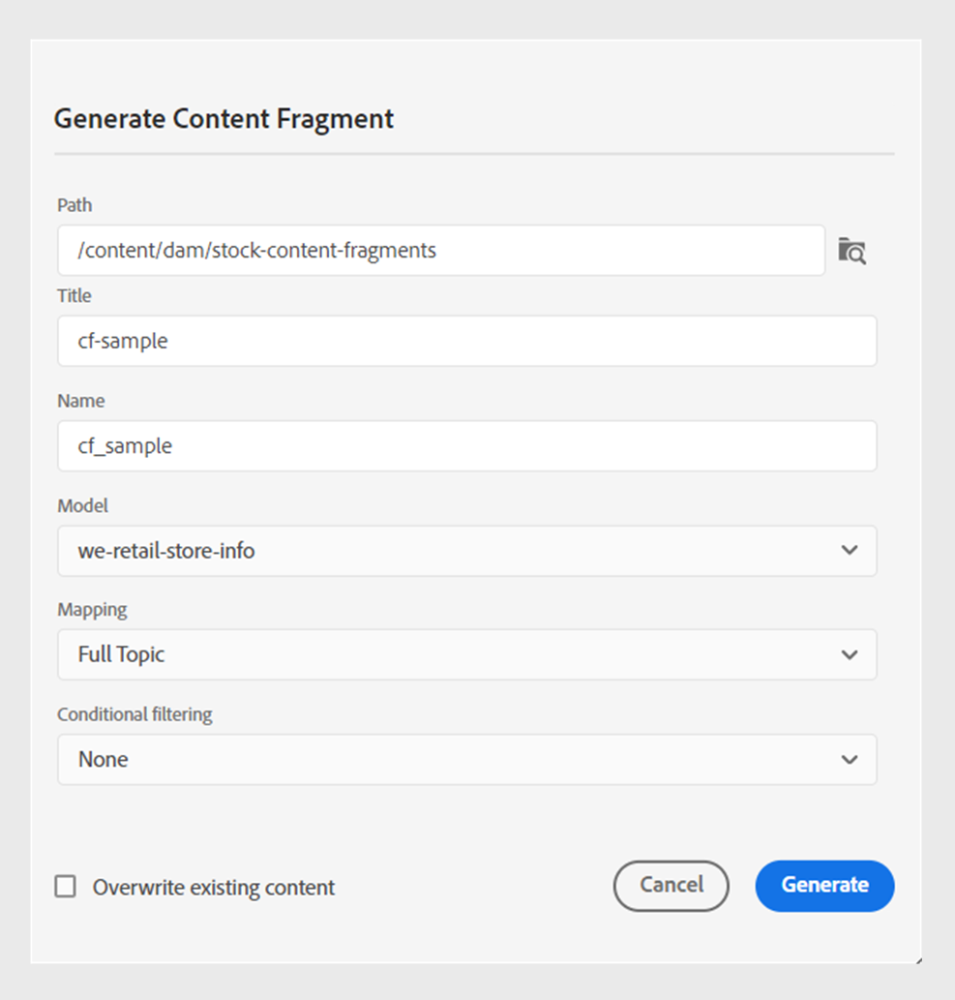

# 콘텐츠 조각에 게시

컨텐츠 조각은 AEM에서 개별 컨텐츠 조각입니다. 이는 콘텐츠 모델을 기반으로 하는 구조화된 콘텐츠입니다. 컨텐츠 조각은 디자인 또는 레이아웃 정보가 없는 순수 컨텐츠입니다. AEM이 지원하는 채널과 독립적으로 작성 및 관리할 수 있습니다. 콘텐츠 조각은 모듈식이며, 콘텐츠는 더 작은 구성 요소로 분류됩니다.

AEM Guides를 사용하면 주제 또는 주제 내의 요소를 콘텐츠 조각에 게시할 수 있습니다. 주제와 콘텐츠 조각 모델 간에 JSON 기반 매핑을 만들 수 있습니다. 이 매핑을 사용하여 주제 또는 주제 내의 요소를 콘텐츠 조각에 게시합니다. 그런 다음 AEM 사이트에서 콘텐츠 조각을 사용하거나 콘텐츠 조각에서 지원하는 API를 통해 세부 정보를 추출할 수 있습니다.

컨텐츠 조각을 만들려면 다음 단계를 수행하십시오.

1. 만들기 [콘텐츠 조각 모델](https://experienceleague.adobe.com/docs/experience-manager-65/assets/content-fragments/content-fragments-models.html?lang=ko) AEM Assets.
1. 콘텐츠 조각 모델을 기반으로 만든 콘텐츠 조각을 저장할 폴더를 만듭니다. 예: &quot;stock-content-fragments&quot;.
1. 폴더의 속성(예: &quot;stock-content-fragments&quot;)을 편집하고 클라우드 구성에 콘텐츠 조각 모델이 포함된 폴더의 경로를 추가합니다.
예: 추가 `/conf/we-retail` 클라우드 구성에서 사용할 수 있습니다. 이 구성은 모든 콘텐츠 조각 모델을 폴더와 연결합니다.\
   {width="650" align="left"}
   *폴더 속성에 클라우드 구성을 추가하여 조각 모델과 연결합니다.*
1. 에 게시할 항목 선택 **저장소 보기**.
1. 다음에서 **옵션** 메뉴, 선택 **다음으로 게시** > **컨텐츠 조각**.
1. 다음에서 **콘텐츠 조각으로 게시** 대화 상자에서 다음 세부 정보를 입력합니다.
   {width="500" align="left"}
   *경로, 모델 및 매핑 세부 정보를 추가하여 주제 또는 해당 요소를 콘텐츠 조각으로 게시합니다. 기존 콘텐츠 조각을 덮어쓸 수 있습니다.*

   * **경로**: 콘텐츠 조각을 게시하려는 폴더의 경로를 찾아 선택합니다. 기존 콘텐츠 조각을 선택하여 게시할 수도 있습니다.
   * **제목**: 콘텐츠 조각의 제목을 입력합니다.
   * **이름**: 콘텐츠 조각의 이름을 입력합니다.
   * **모델**: 콘텐츠 조각을 만드는 데 사용할 콘텐츠 조각 모델을 선택합니다. 모델은 클라우드 서비스에서 구성한 폴더에서 선택됩니다.
   * **매핑**: 드롭다운에서 매핑을 선택합니다. 다음에서 매핑을 선택합니다. *contentFragmentMapping.json* 파일.

     설정에 따라 관리자는 *contentFragmentMapping.json* 파일.

     

        
클라우드 서비스

     방법 자세히 알아보기 [주제와 컨텐츠 조각 간의 매핑 만들기](../cs-install-guide/conf-content-fragment-mapping-cs.md) Cloud Service 설치 및 구성 안내서에서 확인할 수 있습니다.
     

     

        
 On-premise Software

     방법 자세히 알아보기 [주제와 컨텐츠 조각 간의 매핑 만들기](../install-guide/conf-content-fragment-mapping.md) ( 온프레미스 설치 및 구성 안내서)를 참조하십시오.

     

   * 다음 항목 선택 **덮어쓰기** 확인란은 콘텐츠 조각이 이미 존재하고 덮어쓰려는 경우입니다. 확인란을 선택하지 않고 컨텐츠 조각이 이미 존재하는 경우 AEM Guides에 오류가 표시됩니다.
1. 클릭 **만들기** 콘텐츠 조각을 게시합니다.
1. 아래 항목의 콘텐츠 조각을 볼 수 있습니다. **조각** 의 섹션 **파일 속성**.

   {width="300" align="left"}

   *주제에 대해 존재하는 콘텐츠 조각을 보고 다시 게시합니다.*

콘텐츠 조각을 다시 게시하여 DITA 주제의 최신 콘텐츠로 콘텐츠 조각을 업데이트할 수도 있습니다.

콘텐츠 조각을 게시하면 모든 AEM 사이트에서도 사용할 수 있습니다.
