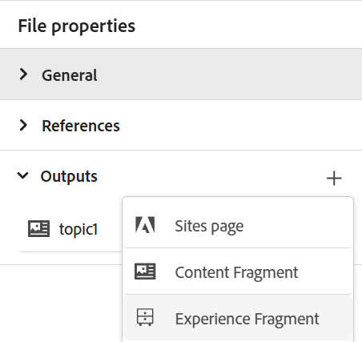

# 경험 조각 게시

경험 조각 은 Adobe Experience Manager의 모듈식 콘텐츠 조각입니다. 이러한 콘텐츠 블록은 템플릿을 기반으로 하며 콘텐츠와 그 레이아웃을 모두 캡슐화합니다. 재사용 가능한 이러한 콘텐츠 조각을 통해 콘텐츠 작성자는 Experience Manager이 지원하는 여러 채널에 걸쳐 일관되고 확장 가능한 경험을 조합하고 제공할 수 있습니다. 이 기능을 사용하면 뉴스레터, 프로모션 배너 및 고객 추천과 같은 일관된 마케팅 경험을 효율적으로 만들 수 있습니다.

Experience Manager Guides을 사용하면 주제 또는 해당 요소를 경험 조각에 게시할 수 있습니다. 경험 조각의 주제와 해당 요소 간에 JSON 기반 매핑을 만들 수 있습니다. 그런 다음 매핑을 사용하여 주제 또는 해당 요소를 경험 조각에 게시합니다. 그런 다음 Experience Manager 사이트에서 경험 조각을 사용하거나 경험 조각에서 지원하는 API를 통해 세부 정보를 추출할 수 있습니다.

경험 조각을 생성하려면 다음 단계를 수행하십시오.

1. 경험 조각에 폴더를 만듭니다. 이 폴더를 사용하여 경험 조각 템플릿을 기반으로 생성되는 경험 조각을 저장합니다. 예: *sales-experience-fragments*.
1. 폴더를 선택한 다음 맨 위에서 **속성** 아이콘을 선택합니다.
1. 폴더의 속성을 편집합니다(예: *sales-experience-fragments*).

   * **제목**: 폴더의 제목을 보거나 편집합니다.

   * **허용된 템플릿**: 경험 조각의 하위 페이지로 추가할 수 있는 템플릿 목록을 포함합니다. 허용된 템플릿을 추가하려면 **허용된 템플릿** 필드에 필요한 템플릿을 검색할 정규식을 지정하십시오.
예:
     `/libs/cq/experience-fragments/components/experiencefragment/template`

     폴더에 대해 허용된 템플릿을 정의하지 않으면 기본적으로 상위 폴더 또는 템플릿 폴더에서 템플릿이 선택됩니다.
   * **정렬 가능**: 폴더 내의 자산 순서를 변경할 수 있습니다.

     {width="650" align="left"}
     *폴더 속성에 클라우드 구성을 추가하여 조각 템플릿과 연결합니다.*
1. 경험 조각을 생성하려면 주제의 **파일 속성**&#x200B;에서 **출력** 섹션에서 **새 출력** 을 선택하십시오.
1. **경험 조각**&#x200B;을 선택합니다.\
   {width="300" align="left"}

   *주제의 파일 속성에서 새 경험 조각을 추가합니다*.

   >[!NOTE]
   >
   > **저장소 보기**&#x200B;에서 경험 조각을 게시할 수도 있습니다. 경험 조각으로 게시할 주제를 선택합니다. 그런 다음 **옵션** 메뉴에서 **다음으로 게시** > **경험 조각**&#x200B;을 선택합니다.

1. **경험 조각 생성** 대화 상자에서 다음 세부 정보를 입력합니다.
   {width="500" align="left"}

   *경로, 템플릿 및 매핑 세부 정보를 추가하여 주제 또는 해당 요소를 경험 조각으로 게시합니다. 기존 경험 조각을 덮어쓸 수 있습니다.*

   * **경로**: 경험 조각을 게시할 폴더의 경로를 찾아 선택합니다. 기존 경험 조각을 선택하여 다시 게시할 수도 있습니다.
   * **제목**: 경험 조각의 제목을 입력합니다. 기본적으로 제목은 주제의 제목으로 채워집니다. 편집할 수 있습니다. 이 제목은 경험 조각의 이름을 생성하는 데 사용됩니다.
   * **이름**: 경험 조각의 이름을 입력합니다. 기본적으로 이름은 주제의 제목으로 채워지고 공백은 &#39;_&#39;로 바뀝니다. 예: *sample_experience_fragment*. 편집할 수 있습니다. 이 이름은 경험 조각의 URL을 생성하는 데 사용됩니다.
   * **템플릿**: 경험 조각을 만드는 데 사용할 경험 조각 템플릿을 선택합니다. 템플릿은 속성에서 구성한 폴더에서 선택됩니다.
   * **매핑**: *experienceFragmentMapping.json* 파일에서 매핑을 선택하고 표시합니다.

     관리자가 *experienceFragmentMapping.json* 파일에 매핑을 추가할 수 있습니다.  설치 및 구성 안내서에서 [주제와 경험 조각 간의 매핑을 만들기](../cs-install-guide/conf-experience-fragment-mapping-cs.md)하는 방법에 대해 자세히 알아보십시오.

   * 다른 조건을 선택하여 콘텐츠를 게시할 수도 있습니다.  다음 옵션 중 하나를 선택합니다.

      * **없음**: 게시된 출력에 조건을 적용하지 않으려면 이 옵션을 선택하십시오.
      * **DITAVAL 사용**: 개인화된 콘텐츠를 생성하려면 DITAVAL 파일을 선택하십시오. 찾아보기 대화 상자를 사용하거나 파일 경로를 입력하여 DITAVAL 파일을 선택할 수 있습니다.
      * **특성 사용**: DITA 주제에 조건 특성을 정의할 수 있습니다. 그런 다음 조건 속성을 선택하여 관련 콘텐츠를 게시합니다.

     >[!NOTE]
     > 
     >조건은 조건 속성이 주제에 정의된 경우에만 활성화됩니다.

   * 경험 조각이 이미 있고 덮어쓰려는 경우 **기존 콘텐츠 덮어쓰기** 확인란을 선택합니다. 확인란을 선택하지 않고 경험 조각이 이미 존재하는 경우 Experience Manager Guides에 오류가 표시됩니다.
1. 경험 조각을 게시하려면 **생성**&#x200B;을 선택합니다.
1. **파일 속성**&#x200B;의 **출력** 섹션 아래에서 주제에 대한 경험 조각을 볼 수 있습니다. 경험 조각은 게시 날짜 및 시간에 따라 나타나며 최신 항목을 첫 번째 조각으로 합니다.

   {width=300 align=&quot;left&quot;}

   *주제에 대한 경험 조각을 보고 다시 게시합니다.*

경험 조각을 게시하면 모든 Adobe Experience Manager 사이트에서도 사용할 수 있습니다.

## 경험 조각용 옵션 메뉴

**옵션** 메뉴에서 경험 조각에 대해 다음 작업을 수행할 수도 있습니다.

* **생성**: 경험 조각을 다시 게시하여 DITA 주제의 최신 콘텐츠로 업데이트합니다. 출력을 재생성할 때 경험 조각의 경로, 이름, 제목 및 템플릿을 변경할 수 없습니다. 그러나 출력을 재생성하는 동안 다른 조건을 선택할 수 있습니다.

* **복제**: 경험 조각을 복제합니다. 경로, 이름, 제목 및 템플릿을 변경할 수 있습니다. 경험 조각을 복제할 때 다른 조건을 선택할 수도 있습니다.

* **제거**: 출력 목록에서 경험 조각을 제거합니다. 확인 프롬프트가 나타납니다. 확인되면 경험 조각이 **출력** 목록에서 제거됩니다. 하지만 경험 조각은 폴더에서 삭제되지 않습니다.

* **보기**: 경험 조각 편집기를 봅니다. 변경 작업을 수행한 후 저장할 수도 있습니다.
