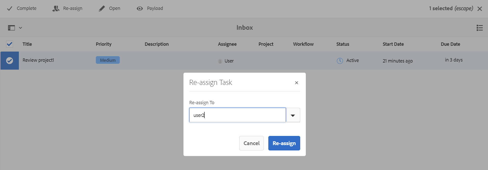

# 알림을 사용하여 검토 작업 재할당 {#id21BNH03M0KS}

귀하에게 할당된 검토 작업을 동일한 검토 프로젝트에 추가된 다른 사용자에게 재할당할 수 있습니다. 받은 편지함에 전달된 검토 알림을 통해 검토 작업을 간편하게 재할당할 수 있습니다. 그러나 검토자는 알림을 사용하는 사용자 그룹이 아닌 개별 사용자에게만 검토 작업을 다시 할당할 수 있습니다.

재할당은 검토자 작업에만 수행할 수 있으며 소유자 작업에는 수행할 수 없습니다.

1. **검토자 작업**: 검토를 위해 검토자에게 할당된 모든 작업입니다.
1. **소유자 작업**: 소유자에 대해서만 만들어진 작업입니다. 검토 작업을 만들어 검토자에게 할당하면 소유자에게 Close &lt; review task name\> \(예: close-reviewtask1\) 이름의 소유자 작업도 제공되지만 이 소유자 작업은 다른 사용자에게 재할당할 수 없습니다.

받은 편지함 알림에서 검토 작업을 다시 할당하려면 다음 단계를 수행하십시오.

1. 받은 편지함에서 검토 작업 알림을 선택합니다.
1. 맨 위에 있는 **다시 할당** 아이콘을 선택합니다.
1. 작업을 재지정할 사용자 이름을 선택합니다.

   >[!IMPORTANT]
   >
   > 검토자는 재할당할 권한이 있어야 하며 사용자 관리자 그룹의 일부여야 합니다.

   {width="800" align="left"}

1. **다시 할당**&#x200B;을 선택합니다.

검토 임무가 재지정되면 임무 책임자(Assignee) 열에 임무가 재지정된 검토자명이 표시됩니다.

할당된 검토자는 다시 할당된 검토 작업에 대한 알림을 받은 편지함에 받게 됩니다.

**상위 항목:**[&#x200B;검토 소개](review.md)
