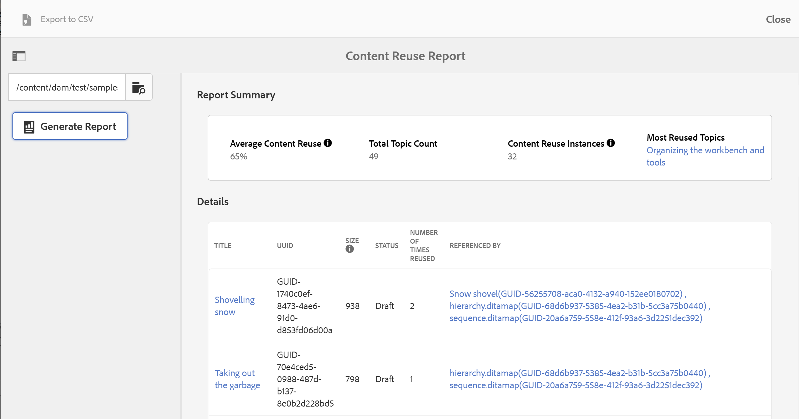

# 컨텐츠 재사용 보고서 {#id205BB900OQD}

생성할 수 있는 또 다른 유용한 보고서는 콘텐츠 재사용 보고서입니다. 이 보고서는 평균 콘텐츠 사용률을 계산합니다. 이는 재사용되는 콘텐츠의 양을 프로젝트 관리자 및 비즈니스 소유자가 확인하는 데 매우 유용합니다.

>[!TIP]
>
> 콘텐츠 재사용 보고서가 제대로 작동하도록 하려면 사후 처리 워크플로를 활성화해야 합니다. 사후 처리 워크플로우를 사용하려면 시스템 관리자에게 문의하십시오.

콘텐츠 재사용 보고서를 보려면 다음 단계를 수행하십시오.

1. 맨 위에 있는 Adobe Experience Manager 링크를 클릭하고 **도구**&#x200B;를 선택합니다.

1. 도구 목록에서 **안내서**&#x200B;를 선택합니다.

1. **콘텐츠 재사용 보고서** 타일을 클릭합니다.

1. **찾아보기**&#x200B;를 클릭하여 주제가 있는 경로를 선택하거나 경로를 수동으로 입력합니다.

   보고서는 상위 및 모든 하위 폴더의 콘텐츠를 스캔하여 생성됩니다.

1. 콘텐츠 재사용 보고서를 가져오려면 **보고서 생성**&#x200B;을 클릭하십시오.

   {width="800" align="left"}

   보고서 페이지는 두 부분으로 나뉘어져 있습니다.

   - **보고서 요약:**

     콘텐츠 재사용 인스턴스/총 주제 수로 계산되는 평균 콘텐츠 재사용을 나열합니다. 이 보고서는 계산을 위한 모든 첫 번째 수준 직접 콘텐츠 참조 및 주제 참조를 고려합니다. 콘텐츠 재사용 인스턴스는 재사용 횟수 필드에 있는 값의 합계로 계산됩니다. 가장 널리 재사용되는 주제는 보고서 요약에도 나열되어 있습니다. 가장 재사용된 항목에서 항목의 링크를 클릭하면 항목의 미리보기가 열립니다.

   - **세부 정보:**

     세부 정보 섹션에는 다음 열이 포함되어 있습니다.

      - **제목**: 주제의 제목입니다. 주제의 제목 링크를 클릭하면 주제 미리보기가 열립니다.

      - **UUID**: 파일의 범용적으로 고유한 식별자 \(UUID\).

      - **크기**: 파일 크기(바이트)입니다.

      - **상태**: 문서의 현재 상태(초안, 검토 중 또는 검토됨)입니다.

      - **다시 사용한 횟수**: 해당 주제가 다시 사용된 횟수입니다. 참조자 열의 항목 합계에서 1을 뺀 값으로 계산됩니다.

      - **참조자**: 해당 항목이 참조된 항목입니다. 여기서는 직접 \(첫 번째 수준\) 참조만 고려합니다. 여러 주제는 쉼표로 구분됩니다. 참조된 파일의 UUID도 대괄호 안에 표시됩니다.주제의 제목 링크를 클릭하면 주제 미리 보기가 열립니다.

>[!NOTE]
>
> 콘텐츠 재사용 보고서를 CSV 형식으로 내보낼 수도 있습니다. 이렇게 하려면 화면 왼쪽 상단 모서리에서 CSV로 내보내기 링크를 클릭하고 CSV 파일을 저장할 위치를 선택합니다. 그런 다음 모든 CSV 편집기에서 이 CSV 파일을 열 수 있습니다.

**상위 항목:**[&#x200B;보고서](reports-intro.md)
