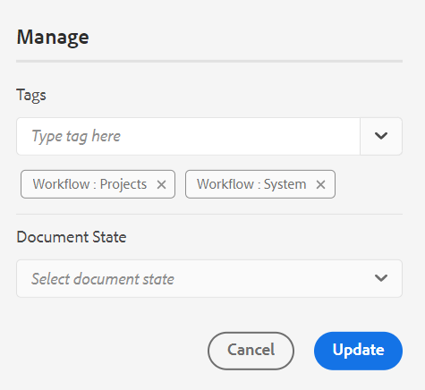

# 웹 편집기의 DITA 맵 보고서 {#id231HF0Z0NXA}

AEM Guides에는 참조의 전체 무결성을 확인하고 보고서를 생성할 수 있는 웹 편집기의 기능이 포함되어 있습니다.

에서 주제 목록을 보고, 모든 참조의 메타데이터를 관리하고, 현재 맵의 멀티미디어 목록을 볼 수 있습니다. **보고서** 웹 편집기의 탭

## 주제 목록 보기에서 CSV 생성

다음 **주제 목록** 보기는 참조 유형, 문서 상태 및 작성자와 같은 주제에 대한 자세한 정보를 제공합니다.

다음 단계를 수행하여 주제 보고서를 만들 수 있습니다.

1. 다음에서 **저장소** 패널, 맵 보기에서 DITA 맵 파일을 엽니다.
1. 다음을 클릭합니다. **관리** 탭.
1. 두 번 클릭 **주제 목록** 왼쪽이요 DITA 맵에 있는 주제 목록이 표시됩니다.

   {width="800" align="left"}

1. 다음에서 **필터** 패널 다음 기준에 따라 항목을 필터링할 수 있습니다. **참조 유형** \(직접 또는 간접\), **문서 상태** \(주제의 현재 상태. 예를 들어 주제가 편집, 검토 중 또는 검토됨 상태인 경우 나 **작성자** 개 항목 중 하나를 선택합니다.

1. 다음 항목 필터링 옵션을 사용하여 목록에 다음 열을 표시하도록 선택할 수도 있습니다.

   - **주제** 주제의 제목은 DITA 맵에 지정됩니다. 항목을 클릭하여 편집할 수 있습니다.
   - **파일 이름** 파일 이름.
   - **UUID** 파일의 UUID\(범용 고유 식별자).
   - **파일 위치** 주제의 전체 경로입니다.
   - **참조 유형** 직접 또는 간접 참조 유형.
   - **문서 상태** 주제의 현재 상태입니다.
   - **작성자** 주제에서 마지막으로 작업한 사용자입니다.
   - **상위 맵** 주제가 직접 참조되는 모든 맵의 목록입니다.
   >[!NOTE]
   >
   > 클릭 **새로 고침** 새로운 주제 목록을 가져오고 맵 파일의 변경 사항을 보거나 주제 파일 내의 참조가 업데이트되는 경우.

1. 클릭 **CSV 다운로드** : DITA 맵에서 주제의 현재 스냅샷을 다운로드합니다. CSV에는 선택한 열과 **주제 목록** 보기. 그런 다음 CSV 편집기에서 이 주제 목록 CSV 파일을 열 수 있습니다.

**메타데이터 보고서에서 메타데이터를 일괄적으로 관리**

AEM Guides를 사용하면 웹 편집기에서 DITA 콘텐츠에 태그를 지정할 수 있습니다. 개별 주제에 태그를 적용하거나 벌크 태그 지정 기능을 사용하여 여러 주제, DITA 맵 또는 하위 맵에 여러 태그를 적용할 수 있습니다. 선택한 모든 주제의 문서 상태를 가능한 다음 공통 문서 상태로 변경할 수도 있습니다.

## 메타데이터 보기

현재 DITA 맵에서 참조의 메타데이터를 보려면 다음 단계를 수행합니다.

1. 저장소 패널의 맵 보기에서 DITA 맵 파일을 엽니다.
1. 다음을 클릭합니다. **관리** 탭.
1. 두 번 클릭 **메타데이터** 왼쪽이요 DITA 맵의 모든 참조에 대한 메타데이터 목록이 표시됩니다. 여기에는 미디어 참조도 포함됩니다.

   {width="800" align="left"}

1. 다음에서 **필터** 패널 다음 기준에 따라 항목을 필터링할 수 있습니다. **문서 상태** \(주제의 현재 상태. 예를 들어 주제가 편집, 검토 중 또는 검토됨 상태인 경우 이러한 항목이 나열됩니다\). **참조** \(직접 또는 간접\), **파일 유형** \(Map, Topic 및 Image\) 참조.
1. 다음 항목만 표시하도록 선택할 수도 있습니다. **태그가 없는 파일** 또는 **태그** 관련된 파일을 보려면 필터링하십시오.
   1. 다음 항목 필터링 옵션을 사용하여 메타데이터 목록에 다음 열을 표시하도록 선택할 수도 있습니다.
      - **제목** \(기본적으로 선택됨\) 참조된 파일의 제목이 DITA 맵에 지정됩니다. 파일을 클릭하여 편집할 수 있습니다.웹 편집기에서 오디오 또는 비디오 파일을 클릭하여 재생할 수도 있습니다. 볼륨 또는 비디오 보기를 변경할 수 있습니다. 바로 가기 메뉴에는 다운로드, 재생 속도 변경 또는 화면 속 화면을 볼 수 있는 옵션도 있습니다.

        >[!NOTE]
        >
        > 체크 아웃된 파일의 제목 근처에 체크 아웃 아이콘도 나타납니다. 아이콘 위로 마우스를 가져가 사용자의 이름을 볼 수 있습니다.

      - **파일 이름** 파일 이름입니다.
      - **파일 위치** 파일의 전체 경로입니다.
      - **태그** \(기본적으로 선택됨\) 파일에 적용된 태그.

        >[!NOTE]
        >
        > 기본적으로 파일에 대한 두 개의 태그를 볼 수 있습니다. 태그를 더 보려면 **더 보기**. 클릭 **간단히 표시** 목록을 다시 계약합니다.

      - **참조 유형** 직접 또는 간접 참조 유형
      - **문서 상태** \(기본적으로 선택됨\) 참조 파일의 현재 상태입니다.
      - **파일 유형** \(기본적으로 선택됨\) 소스 파일의 유형입니다. 사용 가능한 옵션은 맵, 주제 및 이미지입니다.
      - **체크아웃 기준** 파일을 체크 아웃한 사용자입니다.
1. 클릭 **CSV 다운로드** : DITA 맵에서 참조의 현재 스냅샷을 다운로드합니다. CSV에는 선택한 열과 주제 목록 보기에서 필터링된 참조가 포함되어 있습니다. 그런 다음 모든 CSV 편집기에서 이 메타데이터 CSV 파일을 열 수 있습니다.

**메타데이터 업데이트**

1. 메타데이터를 업데이트하려면 업데이트할 파일을 선택합니다.

   >[!NOTE]
   >
   > 체크 아웃된 파일은 선택할 수 없습니다. 체크 아웃된 파일의 제목 근처에 체크 아웃 아이콘도 나타납니다. 아이콘 위로 마우스를 가져가 사용자의 이름을 볼 수 있습니다.

1. 선택 **관리** 위에서부터.

   {width="350" align="left"}

1. 새 태그를 추가하려면 드롭다운 목록에서 새 태그를 선택하여 선택한 모든 주제에 적용합니다. 태그 근처에 있는 교차 아이콘을 클릭하여 태그를 삭제할 수도 있습니다.

   >[!NOTE]
   >
   > 선택한 모든 주제에 적용되는 공통 태그가 나열됩니다.

1. 선택한 모든 참조의 문서 상태를 변경하려면 새 문서 상태를 선택합니다. 드롭다운에는 선택한 모든 주제에 대해 가능한 공통 상태가 표시됩니다. 예를 들어 주제의 현재 상태가 검토 중이면 초안, 승인됨 또는 검토됨 상태를 볼 수 있습니다.
1. 클릭 **업데이트** 메타데이터를 업데이트합니다. 메타데이터가 성공적으로 업데이트되었는지 또는 실패한 업데이트가 있는지 여부에 대한 확인 메시지가 표시됩니다. 을(를) 클릭합니다. **보고서 다운로드** 확인 대화 상자에서 메타데이터 CSV를 다운로드하려면 다음을 수행하십시오. 이 CSV에는 선택한 참조에 대한 업데이트 상태의 세부 정보가 포함되어 있습니다.

## 멀티미디어 보고서 생성

다음 **멀티미디어**&#x200B;보고서는 맵에서 사용된 멀티미디어에 대한 자세한 정보(예: 제목, 유형 \(오디오, 비디오 및 이미지\), 멀티미디어가 사용된 파일 및 사용된 파일의 참조 유형)를 제공합니다. 저장소 내에서 UUID와 멀티미디어의 위치를 볼 수도 있습니다. 다음 단계를 수행하여 멀티미디어의 보고서를 만들 수 있습니다.

1. 다음에서 **저장소** 패널, 맵 보기에서 DITA 맵 파일을 엽니다.
1. 다음을 클릭합니다. **관리** 탭.
1. 두 번 클릭 **멀티미디어** 왼쪽이요 DITA 맵에 있는 멀티미디어 목록이 표시됩니다.
1. 다음에서 **필터** 패널 멀티미디어 또는 참조에 사용된 이름별로 목록의 순서를 지정할 수 있습니다.

   - 다음 기준으로 주문할 때 **멀티미디어****** 첫 번째 열에 멀티미디어의 이름이 표시된 후 해당 이름이 사용된 모든 참조의 이름이 같은 행의 다른 열에 표시됩니다. 예를 들어 다음 스크린샷은 첫 번째 열에 있는 멀티미디어 WarmCoolForC.gif와 이 파일이 사용되는 세 개의 참조가 같은 행의 세 번째 열에 표시되는 것을 보여 줍니다.

     {width="650" align="left"}

   - 주문하시면 **다음에서 사용됨** 열에서, 멀티미디어가 사용된 참조의 이름이 첫 번째 열에 나열되는 반면 멀티미디어 이름이 별도의 행의 다른 열에 나열되는 전치 보기를 봅니다. 예를 들어, 다음 스크린샷은 첫 번째 열에 있는 세 개의 참조 \(시트 온도 조정, 시트 온도 표시 변경 및 승무원 영역\) 이름과 멀티미디어 WarmCoolForC.gif가 세 개의 개별 행의 세 번째 열에 표시됩니다.

     {width="650" align="left"}

1. 다음을 기반으로 멀티미디어를 필터링할 수 있습니다. **멀티미디어 유형**, 및 **참조 유형**. 드롭다운에서 선택한 내용에 따라 멀티미디어 파일 목록이 표시됩니다. 예를 들어, DITA 맵의 오디오 참조만 표시하도록 선택할 수 있으며, 파일에 사용된 오디오 참조만 표시됩니다.

   >[!NOTE]
   >
   > 맵에 사용된 멀티미디어 유형에 따라 이미지, 비디오 및 오디오가 **멀티미디어 유형** 드롭다운에 직접 또는 간접을 나열하면 **참조 유형** 드롭다운입니다.

1. 다음 필터링 옵션을 사용하여 목록에 다음 열을 표시하도록 선택할 수도 있습니다.

   - **멀티미디어** \(기본적으로 선택됨\) 멀티미디어의 제목이 DITA 맵에 지정됩니다. 멀티미디어를 클릭하여 편집할 수 있습니다.
   - **멀티미디어 위치** 멀티미디어의 전체 경로입니다.
   - **멀티미디어 UUID** 파일의 UUID\(범용 고유 식별자).
   - **멀티미디어 유형** \(기본적으로 선택됨\) 멀티미디어의 유형입니다. 사용 가능한 옵션은 오디오, 비디오 또는 이미지입니다.
   - **다음에서 사용됨** \(기본적으로 선택됨\) 멀티미디어가 사용된 참조입니다. 참조를 클릭하여 편집할 수 있습니다.
   - **참조 유형** \(기본적으로 선택됨\) 참조 유형(직접 또는 간접)입니다.
   >[!NOTE]
   >
   > 클릭 **새로 고침** 새 멀티미디어 목록을 가져오고 맵 파일의 변경 사항을 보거나 DITA 맵 내의 멀티미디어가 업데이트되는지 확인합니다.

1. 웹 편집기에서 오디오 또는 비디오 파일을 클릭하여 재생할 수도 있습니다. 볼륨 또는 비디오 보기를 변경할 수 있습니다. 바로 가기 메뉴에는 다운로드, 재생 속도 변경 또는 화면 속 화면을 볼 수 있는 옵션도 있습니다.

   {width="800" align="left"}

1. 클릭 **CSV 다운로드** : DITA 맵에서 멀티미디어의 현재 스냅샷을 다운로드합니다. CSV에는 선택한 열과 **멀티미디어** 보기. 그런 다음 모든 CSV 편집기에서 이 멀티미디어 CSV 파일을 열 수 있습니다.

## 끊어진 링크 보기 및 수정{#report-broken-links}

다음 **끊어진 링크** 는 현재 맵에 있는 끊어진 링크의 세부 정보를 제공하는 유용한 보고서입니다. DITA 주제, 멀티미디어 파일 참조, 컨텐트 키 참조 등에 사용할 수 있는 끊어진 링크를 볼 수 있습니다. 여기 있는 것 자체로도 고칠 수 있습니다.
이 보고서는 끊어진 링크, 링크 유형, 참조가 사용되는 파일 및 이 링크가 사용된 파일 유형과 같은 자세한 정보를 제공합니다.
다음 단계를 수행하여 끊어진 링크에 대한 보고서를 볼 수 있습니다.
1. 다음에서 **저장소** 패널, 맵 보기에서 DITA 맵 파일을 엽니다.
1. 다음을 클릭합니다. **관리** 탭.
1. 두 번 클릭 **끊어진 링크** 왼쪽이요 DITA 맵에 있는 끊어진 링크 또는 참조 목록이 표시됩니다.
1. 다음에서 **필터** 패널 링크 또는 참조에 사용된 이름으로 목록의 순서를 지정할 수 있습니다.

   - 다음 기준으로 주문할 때 **끊어진 링크**&#x200B;는 끊어진 링크의 경로가 첫 번째 열에 표시된 다음 해당 경로가 사용된 모든 참조의 이름이 별도의 행에 있는 다른 열에 표시됩니다. 여러 파일에서 동일한 끊어진 링크가 사용되는 경우 한 행에 표시되고 그룹화되거나 하위 행으로 표시됩니다. 예를 들어 다음 스크린샷은 첫 번째 열에 있는 세 개의 끊어진 링크와 해당 링크가 사용되는 참조를 보여 줍니다. `TestMap.ditamap` 세 번째 열에 세 개의 개별 행으로 표시됩니다.
   {width="800" align="left"}

   - 다음 기준으로 주문하는 경우 **다음에서 사용됨** 열에는 끊어진 링크가 사용된 참조의 이름이 첫 번째 열에 나열되어 있는 반면 끊어진 링크는 같은 행의 다른 열에 나열되어 있는 교차 보기가 표시됩니다. 예를 들어 다음 스크린샷에는 끊어진 링크가 사용되는 참조가 표시됩니다 `TestMap.ditamap` 첫 번째 열에서 끊어진 링크는 같은 행의 세 번째 열에 표시됩니다.
   {width="800" align="left"}
1. 다음을 기반으로 끊어진 링크를 필터링할 수 있습니다. **파일 유형** 및 **링크 유형**. 드롭다운에서 선택한 항목에 따라 끊어진 링크 목록이 표시됩니다. 예를 들어 DITA 맵의 컨텐트 참조만 표시하도록 선택할 수 있으며, 파일에는 이 맵에 사용된 컨텐트 참조만 표시됩니다.

   맵에 사용된 참조 유형에 따라 파일 참조, 키 참조, 콘텐츠 참조, 콘텐츠 키 참조, 이미지 참조 및 멀티미디어 파일 참조가 **링크 유형** 드롭다운 및 **DITA 주제** 또는 **DITA 맵** 다음 목록에 나열됨: **파일 유형** 드롭다운입니다.
1. 다음 필터링 옵션을 사용하여 목록에 다음 열을 표시하도록 선택할 수도 있습니다.

   - **끊어진 링크** (기본적으로 선택됨) 끊어진 링크의 경로가 DITA 맵에 지정됩니다.

   - **링크 유형** (기본적으로 선택됨) 링크의 유형입니다. 사용 가능한 옵션은 컨텐트 키 참조, 컨텐트 참조, DITA 주제, 파일 참조, 이미지 참조, 키 참조 및 멀티미디어 파일 참조입니다.

   - **다음에서 사용됨** (기본적으로 선택됨) 끊어진 링크가 사용된 참조입니다. 참조를 클릭하여 작성자 모드로 볼 수 있습니다.

   - **파일 유형** (기본적으로 선택됨) 참조 유형 - DITA 맵 또는 DITA 주제.
클릭 **새로 고침** 끊어진 링크의 새 목록을 가져오고 맵 파일의 변경 사항을 보거나 DITA 맵 내의 끊어진 링크가 업데이트되었는지 확인합니다.
1. 다음을 클릭할 수 있습니다. **링크 수정** 아이콘()를 클릭하여 끊어진 링크를 수정합니다.

   >[!NOTE]
   >
   > 끊어진 링크 열 아래의 끊어진 링크 경로 위로 마우스를 가져가면 수정 링크가 표시됩니다() 아이콘.

   다음 기준으로 주문하면 두 보기에서 링크를 수정할 수 있습니다. **끊어진 링크** 또는 **다음에서 사용됨**.

   >[!NOTE]
   >
   > 끊어진 링크로 정렬하는 동안 끊어진 링크를 수정하면 링크가 사용되는 모든 파일(단일 행으로 그룹화됨)에서 링크가 수정됩니다.

1. 에서 필요한 참조 세부 정보를 업데이트해야 합니다. **링크 업데이트** 대화 상자. 에 필요한 세부 정보 **링크 업데이트** 대화 상자는 참조 유형에 따라 다릅니다.\
   일단 링크를 수정하면 끊어진 링크 목록 아래에 링크가 표시되지 않습니다. 대신 항목 목록 또는 메타데이터 아래에서 볼 수 있습니다.

1. 클릭 **CSV 다운로드** : DITA 맵에서 끊어진 링크의 현재 스냅샷을 다운로드합니다. CSV에는 끊어진 링크 보기에서 필터링된 선택한 열과 끊어진 링크가 포함되어 있습니다. 그런 다음 CSV 편집기에서 이 CSV 파일을 열고 볼 수 있습니다.

**상위 항목:**[&#x200B;보고서](reports-intro.md)
