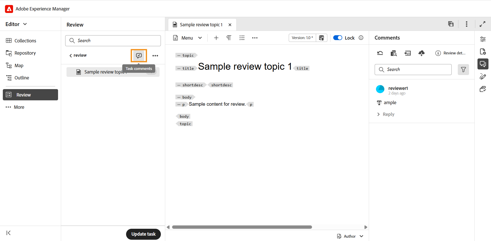
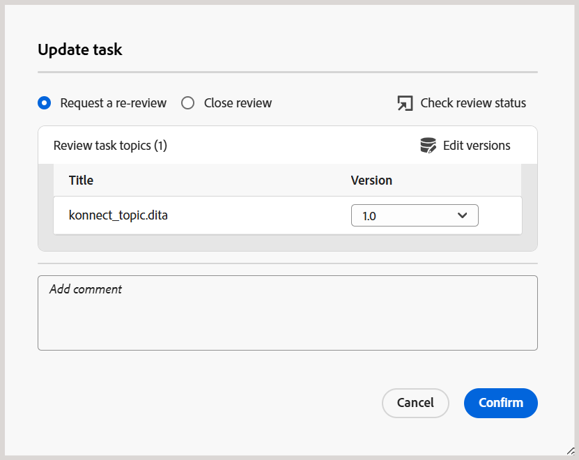
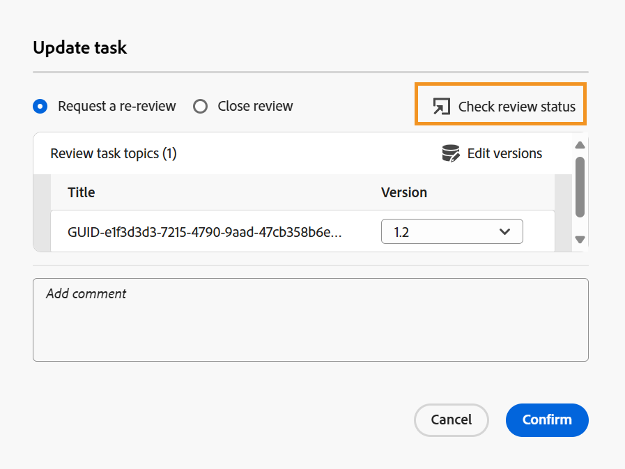

# 작성자로 리뷰 요청 또는 리뷰 작업 닫기

>[!IMPORTANT]
>
> 이 문서에 설명된 새 기능은 Experience Manager Guides as a Cloud Service 2508 릴리스에서 기본적으로 활성화됩니다. 마이그레이션 전에 생성된 검토는 영향을 받지 않으며 이전 워크플로우를 계속 사용합니다. 이러한 업데이트 없이 기존 기능을 계속 사용하려면 고객 지원 팀에 문의하여 새 기능을 비활성화하십시오.

검토자가 검토 작업을 완료됨으로 표시하면 작업 개시자에게 알림이 트리거되어 작업 및 관련 작업 수준 설명에 액세스하고 검토할 수 있습니다.

그런 다음 검토 작업의 개시자로서 피드백을 기반으로 진행할 방법을 결정할 수 있습니다. 사용 가능한 옵션은 다음과 같습니다.

- 재검토 요청
- 리뷰 작업 닫기

## 리뷰 요청 또는 리뷰 작업 닫기

재검토를 요청하거나 검토 작업을 닫으려면 다음 단계를 수행하십시오.

1. 편집기의 왼쪽 패널에서 **검토 패널**&#x200B;을 엽니다.
2. **활성 작업** 목록에서 닫거나 검토를 위해 다시 제출할 검토 작업을 선택하십시오.

   >[!NOTE]
   >
   > **작업 세부 정보** 페이지에 액세스하여 검토 작업을 관리할 수 있습니다. 이렇게 하려면 활성 검토 작업의 옵션 메뉴에서 **작업 세부 정보 열기**&#x200B;를 선택합니다. 프로젝트 콘솔에서 작업 세부 정보가 열립니다.

   
3. 검토자가 추가한 작업 수준 댓글에 액세스하고 검토하려면 **작업 댓글** 아이콘을 선택하십시오.

   

   **작업 설명** 대화 상자가 오른쪽에 표시됩니다.

   {width="350" align="left"}
4. **작업 업데이트**&#x200B;를 선택하여 선택한 검토 작업에 대한 추가 작업을 수행합니다.
5. **작업 업데이트** 대화 상자에서 다음 작업 중 하나를 선택합니다.

   - **다시 검토 요청**: 다른 검토 라운드를 시작합니다. 검토할 항목의 다른 버전을 선택할 수 있습니다. 기본적으로 검토를 위해 보낸 주제 또는 맵 파일의 최신(또는 마지막으로 편집한) 버전이 선택됩니다. 필요에 따라 **버전 편집** 옵션을 사용하여 선택한 항목의 버전을 **최신 버전** 또는 **기준선**(으)로 설정할 수도 있습니다.  이전 검토를 완료한 검토자는 업데이트된 버전에 대한 피드백을 제공하는 알림을 받게 됩니다. 검토 작업을 완료로 표시하지 않은 다른 검토자는 주제 업데이트에 대해 알림을 받습니다.

   - **검토 닫기**: 검토 작업을 닫습니다. 검토 패널 아래쪽에 있는 **작업 업데이트** 단추가 **닫힘**(으)로 바뀌고, 검토 작업에 관련된 모든 사용자에게 닫힘을 알리는 알림이 전송됩니다.

   검토 알림을 트리거하는 방법에 대한 자세한 내용은 [검토 알림 이해](./review-understanding-review-notifications.md)를 참조하세요.

   {width="350" align="left"}

   업데이트 작업 대화 상자에 있는 [검토 상태 확인](./review-manage-tasks-review-dashboard.md#check-the-status-of-a-review-task) 옵션을 사용하여 **검토 작업의 상태를 확인**&#x200B;할 수도 있습니다. 이 옵션을 선택하면 검토 작업의 상태 보고서가 표시되는 검토 대시보드로 이동합니다.

   {width="650" align="left"}

6. **확인**&#x200B;을 선택합니다.

리뷰 작업의 작성자 또는 개시자가 작업을 닫으면 리뷰 패널 아래쪽에 있는 **작업 업데이트** 단추가 **닫힘**(으)로 변경되어 작업이 더 이상 활성 상태가 아닙니다.

{width="350" align="left"}

또한 검토 패널에 있는 **작업 업데이트** 단추는 검토 작업의 다른 사용자가 사용할 수 없도록 설정되어 있습니다. 예를 들어, 검토 작업의 검토자 중 한 명으로서 편집기에서 작업을 열면 **이 작업에 대한 권한이 없습니다** 메시지와 함께 작업 업데이트 단추가 비활성화됩니다. 검토 작업의 개시자만 편집기에서 작업을 업데이트할 수 있는 권한이 있습니다.

{width="350" align="left"}

