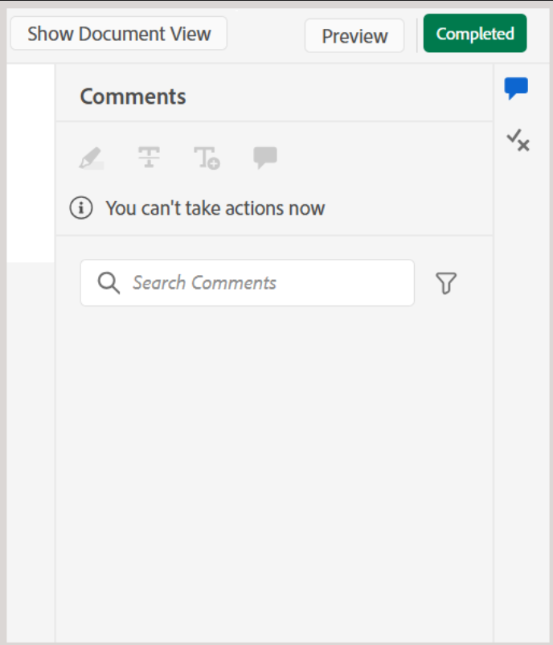

# 검토자로 검토 작업 완료

>[!IMPORTANT]
>
> 이 문서에 설명된 새로운 기능은 Experience Manager Guides as a Cloud Services 2508 릴리스를 통해 기본적으로 활성화됩니다. 마이그레이션 전에 생성된 검토는 영향을 받지 않으며 이전 워크플로우를 계속 사용합니다. 이러한 업데이트 없이 기존 기능을 계속 사용하려면 고객 지원 팀에 문의하여 새 기능을 비활성화하십시오.

검토자는 모든 콘텐츠를 검토한 후 작성자에게 알리고자 하는 경우 검토 작업을 완료로 표시할 수 있습니다. 이 단계에서 최종 주석을 남길 수도 있습니다.

다음 단계를 수행하여 검토 작업을 완료합니다.

1. 할당된 리뷰 작업을 엽니다.
2. 아래와 같이 맨 위에서 **완료로 표시**&#x200B;를 선택합니다.

   {width="350" align="left"}

   **작업 완료** 대화 상자가 표시됩니다.
3. **작업 완료** 대화 상자에서 작성자에 대한 최종 주석을 추가하고 **완료**&#x200B;을 선택합니다.

   >[!NOTE]
   >
   > 작업 수준 주석은 요약 또는 최종 주석 역할을 하며 주제 검토 중에 추가된 텍스트 수준 주석과는 구별됩니다. 이 대화 상자에서는 작성자에게 특정 의견을 설명하고 검토를 위해 작업을 다시 보내도록 요청하는 등의 후속 작업에 대한 개요를 지정하거나 검토가 완료되었음을 나타낼 수 있습니다.

   예를 들어 검토자는 작성자에 대한 후속 작업으로 주석을 추가할 수 있습니다.

   {width="350" align="left"}

   또는 아래와 같이 작업이 완료되었음을 나타내는 주석을 추가합니다.

   {width="350" align="left"}

작업을 완료됨으로 표시했으며 현재 상태가 **완료됨**(으)로 설정되어 있습니다. 작업이 완료된 것으로 표시된 후에는 추가 작업이 허용되지 않습니다. 검토 작업의 작성자 또는 개시자에게 알림이 전송되어 즉각적인 주의가 필요합니다. 검토 알림을 트리거하는 방법에 대한 자세한 내용은 [검토 알림 이해](./review-understanding-review-notifications.md)를 참조하세요.

{width="350" align="left"}

피드백에 따라 작업의 작성자 또는 개시자가 [검토 작업을 닫기](./review-close-review-task.md)로 결정하는 경우 검토 UI의 작업 상태가 **닫힘**(으)로 변경됩니다.

{width="350" align="left"}

## 작업 수준 설명 보기

모든 작업 수준 설명은 읽기 전용 모드에서 사용할 수 있는 **작업 설명** 대화 상자에 표시됩니다. 최종 주석을 사용하여 검토 작업을 완료하면 나중에 참조할 수 있도록 이 대화 상자에 입력이 기록됩니다.

검토 UI에서 작업 수준 설명에 액세스하려면 왼쪽 패널로 이동하여 **작업 설명** 아이콘을 선택하십시오.

{width="350" align="left"}

**작업 설명** 대화 상자가 오른쪽에 표시됩니다.

{width="350" align="left"}

대화 상자 내의 주석은 시간 순서대로 표시되며, 최근 주석이 먼저 표시되고 가장 오래된 주석이 마지막으로 표시됩니다. 이 순서는 시간이 지남에 따라 대화가 진행됨에 따라 도움이 됩니다.

**작업 설명** 대화 상자는 검토 작업의 작성자 또는 시작자와 다른 검토자를 포함하여 검토 작업에 관련된 모든 사용자가 액세스할 수 있습니다. 따라서 다른 검토자의 주석(관련된 경우)도 작업 주석 대화 상자에 나타날 수 있습니다. 이는 검토 프로세스 전반에 걸쳐 명확하고 추적 가능한 커뮤니케이션을 보장하는 데 도움이 됩니다.

작업 수준 피드백을 검토한 후 작성자는 재검토를 요청하거나 검토 작업을 닫을 수 있습니다. 두 경우 모두 검토 프로세스 중에 캡처된 모든 주석은 **작업 주석** 대화 상자에서 참조할 수 있습니다.

