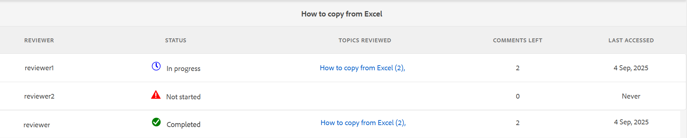

# 검토 대시보드를 사용하여 검토 작업 관리 {#id2056B0Y70X4}

검토 관리 워크플로에는 다양한 작업이 포함될 수 있습니다. 예를 들어 특정 주제에 대한 검토자를 추가하거나 검토 기한을 연장할 수 있습니다. 모든 관련자가 피드백을 제공했다고 생각되면 검토 작업을 완료로 표시할 수도 있습니다. 이러한 작업은 검토 대시보드를 사용하여 관리할 수 있습니다.

검토 대시보드에 액세스하고 사용하려면 다음 단계를 수행하십시오.

>[!NOTE]
>
> 작성자 \(또는 개시자\)인 프로젝트에 대해서만 검토 작업을 관리할 수 있습니다. 검토자 또는 게시자 \(user\)인 경우에도 프로젝트 작업에 액세스할 수 없습니다.

1. **프로젝트** 콘솔에서 관리할 검토 프로젝트를 선택합니다.

   작업 타일이 있는 프로젝트 패널이 표시됩니다.

   {align="left"}

   >[!NOTE]
   >
   > 또는 편집기 왼쪽 패널에서 프로젝트 대시보드에 직접 액세스할 수도 있습니다. [검토 패널](./web-editor-left-panel.md#review)을 열고 검토 패널에 나열된 각 검토 프로젝트에 대해 배치된 **프로젝트 대시보드 열기** 아이콘을 사용합니다.

1. **검토** 타일에서 세 점을 선택합니다.

   [검토 대시보드]가 표시됩니다. 대시보드에는 사용자가 생성한 모든 검토 작업이 나열됩니다.

   {align="left"}

   검토 대시보드에는 검토를 시작한 작업 이름, 검토를 시작한 날짜, 기한, 상태, 작성자가 수락 또는 거부하지 않은 새 주석 수, 검토자 이름 등 검토 작업에 대한 세부 정보가 표시됩니다. 작업은 새로 생성된 작업에서 이전 작업으로의 순서로 나열됩니다.

   검토 대시보드에서 **상태** 필드에 다음 값 중 하나가 표시될 수 있습니다.
   - **진행 중**: 검토를 계속 진행 중임을 나타냅니다.
   - **닫힘**: 검토 작업이 완료되었음을 나타냅니다.

   >[!NOTE]
   >
   > [작업 검토] 링크를 선택하면 검토를 위해 전송된 주제 또는 맵 파일이 열립니다.

1. 리뷰 작업을 선택합니다.

   도구 모음에 속성 편집 및 [상태](#check-review-status-id199RF0A0UHS) 옵션이 표시됩니다.

1. **속성 편집**&#x200B;을 선택하면 작업 세부 정보 페이지가 표시됩니다.

   [작업 세부 정보] 페이지에는 작업, 내용 및 검토자의 세 가지 탭이 있습니다. 다음 섹션에서는 각 탭에서 사용할 수 있는 다양한 기능에 대해 설명합니다.

## 작업 탭

{align="left"}

**작업** 탭에서 다음 작업을 수행할 수 있습니다.

- **제목** 필드에서 작업 제목을 수정합니다.
- **할당 대상** 드롭다운 목록에 기본 피할당자를 추가합니다. 여기에서 추가하는 검토자에게는 이 검토 작업에 포함된 모든 주제를 검토할 수 있는 액세스 권한이 제공됩니다. [검토자 탭](#Reviewer-tab-id199RF0N0MUI)에서 특정 주제에 더 많은 검토자를 제거하거나 선택적으로 추가할 수 있습니다.
- **설명** 필드에서 작업의 설명을 업데이트합니다.
- **기한**&#x200B;을(를) 수정합니다. 작업 완료 기한을 미리 준비하거나 연기할 수 있습니다.
- 사용자에게 할당된 주제만 검토하도록 사용자를 제한하는 옵션을 선택합니다.
- **업데이트**&#x200B;를 선택하여 수정된 세부 정보를 업데이트합니다.

  업데이트 성공 여부를 확인하는 알림 메시지가 표시됩니다.
- 기한 전에 검토 작업을 완료로 표시하려면 **완료**&#x200B;를 선택하십시오. 개별 주제의 작업이 완료로 표시되면 선택한 주제에 대한 검토가 닫힙니다. 그러나 DITA 맵을 통해 검토용으로 공유된 주제의 경우 DITA 맵 작업을 완료로 표시하면 검토용으로 공유된 맵 내의 모든 주제에 대한 검토가 닫힙니다.
- **복제**&#x200B;를 선택하여 검토 작업의 복사본을 만드십시오. 중복검토작업을 생성하는 과정은 새로운 검토작업을 생성하는 과정과 유사하다. 중복 작업 워크플로우를 시작하면 검토 작업 만들기 페이지가 표시됩니다. [검토할 항목 보내기](review-send-topics-for-review.md#)에 설명된 대로 새 작업 세부 정보를 제공해야 합니다.

  DITA 맵에서 만든 검토 작업을 선택한 경우 맵의 특정 주제가 표시됩니다. 그런 다음 새 검토 작업에 포함할 항목을 선택할 수 있습니다.

  하나 이상의 주제 검토에서 중복되는 검토 작업의 경우 해당 주제만 검토 작업 목록에 표시됩니다. 이러한 항목을 다른 검토자 세트와 공유하도록 선택할 수 있습니다.

- 받은 편지함 페이지로 이동하려면 **닫기**&#x200B;를 선택하십시오.

## 컨텐츠 탭

{align="left"}

**콘텐츠** 탭에서 다음 작업을 수행할 수 있습니다.

- 검토를 위해 보낸 주제의 버전을 변경합니다. 주제의 최신 버전, 날짜의 버전, 특정 레이블이 있는 버전 또는 특정 베이스라인 \(DITA 맵의 경우\)이 있는 버전을 선택할 수 있습니다.

- **업데이트**&#x200B;를 선택하여 검토자와 업데이트된 버전의 주제를 공유합니다. 검토자는 최신 버전의 주제가 검토를 위해 전송되었다는 이메일 알림을 받게 됩니다. 다음에 검토자가 주제를 열면 해당 주제의 업데이트된 버전이 표시됩니다.

  >[!NOTE]
  >
  > 주제의 업데이트된 버전의 경우 이전 주석은 최신 버전에도 유지됩니다. 검토자는 두 버전 간의 차이점을 볼 수도 있습니다.

- 기한 전에 검토 작업을 완료로 표시하려면 **완료**&#x200B;를 선택하십시오. 개별 주제의 작업이 완료로 표시되면 선택한 주제에 대한 검토가 닫힙니다. 그러나 DITA 맵을 통해 검토용으로 공유된 주제의 경우 DITA 맵 작업을 완료로 표시하면 검토용으로 공유된 맵 내의 모든 주제에 대한 검토가 닫힙니다.

- 현재 작업을 기준으로 새 검토 작업을 만들려면 **복제**&#x200B;를 선택하십시오.

## 검토자 탭 {#Reviewer-tab-id199RF0N0MUI}

{align="left"}

**검토자** 탭에서 다음 작업을 수행할 수 있습니다.

- **모두 선택**: 주제 목록의 모든 주제를 선택합니다. 모든 항목을 선택한 후 일괄 작업을 쉽게 수행할 수 있습니다.
- **선택 항목 지우기**: 항목 목록에서 선택한 항목을 선택 취소합니다.

  >[!NOTE]
  >
  > 항목 옆에 있는 확인란을 선택하여 항목을 개별적으로 선택하거나 선택 취소할 수도 있습니다.

- **추가**: 검토자 추가 대화 상자를 표시합니다. 선택한 항목에 검토자로 추가할 검토자 또는 사용자 역할 \(또는 group\)의 이름을 입력할 수 있습니다.
- **제거**: 검토자 제거 대화 상자를 표시합니다. 선택한 항목에서 검토자로 제거할 검토자 또는 사용자 역할 \(또는 group\)의 이름을 입력할 수 있습니다.
- **다시 할당**: 검토자 다시 할당 대화 상자를 표시합니다. 검토 작업을 할당할 검토자 또는 사용자 역할 \(또는 group\)의 이름을 입력할 수 있습니다. 이렇게 하면 선택한 주제에서 기존 검토자가 모두 제거되고 새로 선택한 검토자가 해당 주제에 할당됩니다.
- **내보내기**: 검토 작업 세부 사항을 CSV 파일로 내보낼 수 있습니다. 이 파일에는 주제의 경로 및 제목, 검토자 이름, 검토를 위해 보낸 주제 버전 등의 세부 정보가 포함되어 있습니다.
- **검토자 편집**: 항목 목록에서 아이콘을 선택하면 검토자 편집 대화 상자가 표시됩니다. 이 대화 상자에서 선택한 주제에 대한 검토자를 추가하거나 제거할 수 있습니다.

## 리뷰 작업 상태 확인 {#check-review-status-id199RF0A0UHS}

Experience Manager Guides에서 각 검토 작업은 현재 상태를 반영하는 상태를 가집니다. 검토 대시보드에서 작업을 선택하고 **상태** 옵션을 선택하여 이 정보에 액세스할 수 있습니다.

{width="650" align="left"}

다음과 같이 검토 작업의 상태 보고서가 열립니다.

{width="650" align="left"}

또는 편집기의 [검토 패널](./web-editor-left-panel.md#review)에서 직접 상태 보고서에 액세스할 수 있습니다. [검토] 패널에서 활성 검토 작업을 열고 **작업 업데이트**&#x200B;를 선택한 다음 **검토 상태 확인**&#x200B;을 선택합니다.

검토 작업에 대한 상태 보고서에는 다음 세부 정보가 포함되어 있습니다.

- 검토 작업이 할당된 검토자의 이름입니다.
- 상태 열은 검토 상태를 나타냅니다. 상태는 다음 중 하나일 수 있습니다.
   - **시작되지 않음**: 검토자가 검토 작업을 아직 열지 않았습니다.
   - **진행 중**: 검토자가 검토 작업을 열었고 항목을 검토 중입니다.
   - **완료**: 검토자가 검토를 완료하고 검토 UI에서 작업을 완료로 표시했습니다. 검토 작업은 각 검토자의 AEM 알림 받은 편지함에 있습니다.
- 검토자가 검토 링크를 열고 검토된 주제 목록에 추가된 특정 주제로 이동하면 이렇게 하면 작성자가 검토자가 각 섹션을 열었는지 여부를 확인하는 데 도움이 됩니다. 댓글이 주어지면 대괄호 안에 표시됩니다.
- 모든 주제에 대한 총 댓글 수입니다. 검토 중인 주제가 여러 개인 경우 각 주제의 설명 수는 주제 이름에 \(대괄호\)로 표시됩니다.
- 검토자가 마지막으로 주제에 액세스한 날짜입니다.

**상위 항목:**&#x200B;[&#x200B;검토 소개](review.md)
