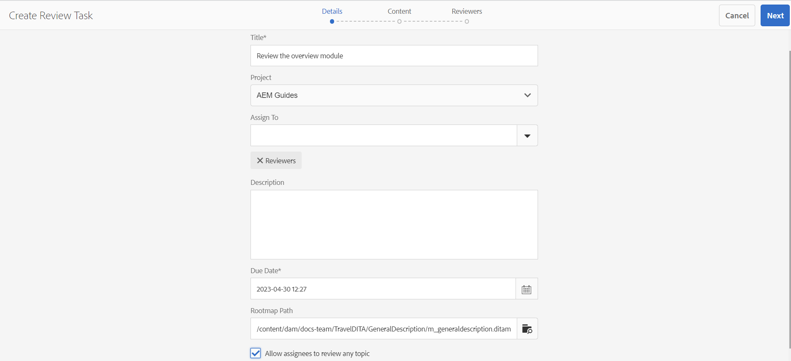

# 검토할 항목 보내기 {#id199RD0S035Z}

검토 워크플로우는 개시자가 검토할 주제 목록을 지정하고, 여러 검토자를 추가하고, 검토 작업에 대한 타임라인을 지정하는 다중 검토자 환경을 만듭니다. Adobe Experience Manager Guides을 사용하면 Authors 및 Publishers 그룹에 속한 사용자가 검토를 시작할 수 있습니다.

검토 워크플로우는 프로젝트에 따라 다르므로 검토 개시자는 프로젝트 팀의 일부이거나 프로젝트를 만들 권한이 있어야 합니다. 프로젝트를 만들 때 프로젝트에 대한 팀원을 정의하고 팀원에게 다양한 역할 또는 그룹을 할당합니다. 프로젝트에 대한 자세한 내용은 [DITA 프로젝트 만들기](authoring-create-dita-project.md#)를 참조하십시오.

다음 위치에서 검토 작업을 만들 수 있습니다.

- **편집기**: 검토를 위해 개별 주제나 DITA 맵을 보낼 수 있습니다. 검토 작업을 만드는 워크플로우는 편집기 및 Assets UI에서 공통입니다. 검토 워크플로를 시작하는 방법만 다릅니다. 편집기에서 검토 워크플로를 시작하는 방법에 대한 자세한 내용은 편집기에서 [검토 작업 만들기](web-editor-left-panel.md#review) 기능을 참조하십시오.

- **Assets UI**: 검토를 위해 하나 이상의 주제와 DITA 맵을 보낼 수 있습니다. Assets UI 워크플로에서 검토할 문서 공유는 이 주제에서 다룹니다.

Assets UI에서 작성자/게시자가 검토 작업을 만들 수 있는 방법에는 두 가지가 있습니다.

- 검토할 하나 이상의 항목 보내기
- 검토를 위해 DITA 맵에서 여러 주제 보내기

## 검토할 하나 이상의 항목 보내기 {#id1721E600FY4}

>[!IMPORTANT]
>
> 검토 작업을 만들기 전에 프로젝트를 만들고 검토자를 해당 프로젝트에 추가했는지 확인하십시오.

검토 작업을 만들고 검토할 항목을 보내려면 다음 단계를 수행합니다.

>[!NOTE]
>
> DITA 프로젝트의 작성자 또는 게시자인 경우에만 검토 작업을 만들 수 있습니다.

1. Assets UI에서 필요한 폴더로 이동합니다.

1. 빠른 작업에서 **선택** 아이콘을 선택하고 검토를 위해 보낼 항목을 선택합니다.

   {width="300" align="left"}

1. 도구 모음에서 **검토 작업 만들기**&#x200B;를 선택합니다. [검토 작업 생성] 페이지가 표시됩니다.

   >[!NOTE]
   >
   > 수정 사항이 있는 주제에 대해서만 검토 작업을 생성할 수 있습니다. 선택한 항목에 수정 사항이 없는 경우 프롬프트가 표시됩니다.

   {width="650" align="left"}

1. 작업에 대한 **제목**&#x200B;을 입력하고 DITA 프로젝트를 선택하십시오.

1. **프로젝트** 드롭다운 필드에서 이 검토 작업에 대한 DITA 프로젝트를 선택합니다. 프로젝트 이름을 입력하여 드롭다운 목록에서 빠르게 찾을 수도 있습니다.

1. **할당 대상** 드롭다운 필드에서 검토할 항목을 보낼 검토자를 선택합니다.

   프로젝트의 개별 사용자 또는 사용자 그룹에 검토 작업을 할당할 수 있습니다. 프로젝트의 관리자 그룹에 속해 있는 경우에만 개별 사용자에게 검토 작업을 할당할 수 있습니다. 그렇지 않으면 할당 대상 필드에 사용자 그룹만 표시됩니다.

   >[!NOTE]
   >
   > 검토 워크플로우는 프로젝트별로 다릅니다. 프로젝트를 만들 때 팀 구성원을 프로젝트에 추가하고 그룹에 할당합니다. 따라서 여기에서 프로젝트를 선택하면 해당 프로젝트에 속한 구성원을 선택할 수 있습니다. 프로젝트에 대한 자세한 내용은 [DITA 프로젝트 만들기](authoring-create-dita-project.md#)를 참조하십시오.

1. 작업에 대한 **설명**&#x200B;을(를) 입력하십시오.

   이 설명은 검토자에게 전송된 알림 이메일의 본문으로 사용됩니다.

1. **기한**&#x200B;과 시간을 선택하여 검토 기한을 표시하십시오.

   >[!NOTE]
   >
   > 기한이 되면 검토 작업이 완료되었음을 알리는 이메일이 개시자에게 전송됩니다. 개시자는 [검토 대시보드](review-manage-tasks-review-dashboard.md#)에서 검토 작업의 기한을 연장할 수 있습니다.

1. **Rootmap 경로**&#x200B;에서 루트 맵을 선택하십시오. 이 루트 맵은 검토 콘텐츠에 사용된 모든 주요 참조 및 용어집을 해결하는 데 사용됩니다. Rootmap을 선택하지 않으면 검토를 위해 주제를 보내기 전에 DITA 주제와 연관된 주요 참조 또는 용어집 용어가 확인되지 않습니다.

   DITA 맵에 대한 리뷰를 만드는 경우 기본적으로 **Rootmap 경로**&#x200B;가 해당 맵의 경로로 설정됩니다. 하나 또는 여러 주제에 대한 검토를 만드는 경우 기본적으로 **Rootmap 경로**&#x200B;가 사용자 환경 설정에 정의된 맵으로 설정됩니다.

   >[!NOTE]
   >
   > 선택한 루트 맵이 키 참조를 확인하는 데 가장 높은 우선 순위를 갖습니다. 자세한 내용은 [키 참조 확인](map-editor-other-features.md#id176GD01H05Z)을 참조하십시오.

1. 다른 주제에 다른 검토자를 할당할 수 있으므로 **피할당자가 모든 주제를 검토할 수 있도록 허용** 옵션은 검토자가 검토 작업의 모든 주제를 검토할 수 있는지 또는 검토에 할당된 주제만 검토할 수 있는지 제어합니다.

   모든 검토자가 검토 작업의 항목을 검토할 수 있도록 허용하려면 **피할당자가 항목을 검토할 수 있도록 허용**&#x200B;을 선택하십시오.

   이 옵션을 선택하지 않으면 **할당 대상** 필드에 추가된 검토자는 할당된 항목만 검토할 수 있는 액세스 권한을 갖게 됩니다.

1. **다음**&#x200B;을 선택합니다.

   콘텐츠 페이지가 표시됩니다.

   {align="left"}

1. 컨텐트 페이지에서 검토를 위해 공유할 주제의 버전을 선택합니다.

   다음 방법 중 하나를 사용하여 버전을 선택할 수 있습니다.

   - *\(기본값\)* **최신 버전** 옵션을 선택하여 마지막으로 저장된 항목 개정을 선택합니다.
   - **버전 설정** 옵션을 선택하고 지정된 날짜 및 시간과 같이 버전을 선택할 날짜 및 시간을 지정합니다. 지정된 날짜에 사용 가능한 항목의 버전이 없는 경우 지정된 날짜 및 시간 직후에 사용 가능한 버전이 선택됩니다.
   - **레이블 선택** 옵션을 선택하고 드롭다운 목록에서 레이블을 선택합니다.
1. 버전을 선택한 후 **적용**&#x200B;을 선택하세요.

   선택한 옵션을 기반으로 하는 버전이 주제에 대해 선택됩니다.

   >[!NOTE]
   >
   > 각 항목의 **버전** 드롭다운 목록에서 원하는 버전을 수동으로 선택할 수도 있습니다.

1. **다음**&#x200B;을 선택합니다.

   검토자를 추가하거나 제거할 수 있는 검토자 페이지가 표시됩니다. 할당 대상 필드에 추가된 검토자는 기본적으로 검토를 위해 선택한 각 주제에 자동으로 추가됩니다.

   {width="650" align="left"}

1. 검토자 페이지에서 검토자를 추가하거나 제거할 수 있습니다. 검토자 페이지에서 다음 작업을 사용할 수 있습니다.

   - **모두 선택**: 주제 목록의 모든 주제를 선택합니다. 모든 항목을 선택한 후 일괄 작업을 쉽게 수행할 수 있습니다.
   - **선택 항목 지우기**: 항목 목록에서 선택한 항목을 선택 취소합니다.

     >[!NOTE]
     >
     > 항목 옆에 있는 확인란을 선택하여 항목을 개별적으로 선택하거나 선택 취소할 수도 있습니다.

   - **추가**: 검토자 추가 대화 상자를 표시합니다. 선택한 항목에 검토자로 추가할 검토자 또는 사용자 역할 \(또는 group\)의 이름을 입력할 수 있습니다.
   - **제거**: 검토자 제거 대화 상자를 표시합니다. 선택한 항목에서 검토자로 제거할 검토자 또는 사용자 역할 \(또는 group\)의 이름을 입력할 수 있습니다.

     >[!NOTE]
     >
     > 검토자 상자에서 상호 기호를 선택하여 주제에서 검토를 제거할 수도 있습니다.

   - **다시 할당**: 검토자 다시 할당 대화 상자를 표시합니다. 검토 작업을 할당할 검토자 또는 사용자 역할 \(또는 group\)의 이름을 입력할 수 있습니다. 이렇게 하면 선택한 주제에서 기존 검토자가 모두 제거되고 새로 선택한 검토자가 해당 주제에 할당됩니다.
   - **내보내기**: 검토 작업 세부 사항을 CSV 파일로 내보낼 수 있습니다. 이 파일에는 주제의 경로 및 제목, 검토자 이름, 검토를 위해 보낸 주제 버전 등의 세부 정보가 포함되어 있습니다.
   - **검토자 편집**: 항목 목록에서 아이콘을 선택하면 검토자 편집 대화 상자가 표시됩니다. 이 대화 상자에서 선택한 주제에 대한 검토자를 추가하거나 제거할 수 있습니다.
1. **만들기**&#x200B;를 선택하여 리뷰 작업을 만듭니다.

   검토 작업이 성공적으로 생성되면 확인 메시지가 표시됩니다. 검토를 위해 보낸 항목에 대한 [문서 상태](web-editor-document-states.md#)가 [검토 중]으로 설정되어 있습니다.

   >[!NOTE]
   >
   > 화면 오른쪽 상단에 있는 알림 벨을 선택하고 검토 작업이 성공적으로 생성되었는지 확인할 수도 있습니다. 알림 패널에는 검토 작업에 포함된 검토자에 대한 알림과 검토 개시자에 대한 알림이 각각 하나씩 있습니다.

모든 검토자에게 이메일이 전송되어 검토를 위해 주제 또는 여러 주제가 할당되었음을 알립니다. 이메일에는 브라우저 창의 주제에 액세스하는 데 사용할 수 있는 직접 링크가 포함되어 있습니다.

여러 주제가 할당된 경우 검토자는 웹 브라우저의 주제 드롭다운 목록에서 해당 주제를 보고 선택할 수 있습니다.

## DITA 맵에서 검토할 여러 주제 보내기

DITA 맵은 책 내의 주제 논리적 구성입니다. 검토를 위해 개별 주제를 보낼 때 검토자는 해당 주제가 책에 있는 위치에 대한 정보를 얻지 못합니다. 검토자가 검토 중인 주제의 정확한 위치에 대한 정보를 가지고 있는 경우 검토자는 검토 중인 주제의 컨텍스트를 더 잘 알 수 있습니다.

Experience Manager Guides을 사용하면 DITA 맵에서 하나 이상의 주제를 동시에 보내어 검토할 수 있습니다. 검토자는 검토를 위해 공유된 주제와 함께 전체 맵 파일을 볼 수 있습니다. 이렇게 하면 검토자가 지도나 책 파일에서 주제의 컨텍스트를 더 쉽게 얻을 수 있습니다.

여러 검토 작업에서 검토하기 위해에서 동일한 DITA 맵을 공유할 수 있습니다. 예를 들어 DITA 맵에 주제 A, B, C, D 및 E가 있을 경우 한 검토 작업에서는 검토를 위해 A, B 및 C를 공유할 수 있고 다른 검토 작업에서는 검토를 위해 항목 C, D 및 E를 보낼 수 있습니다. 검토 프로세스를 통해 여러 검토 작업에서 동일한 주제 및 맵 파일을 공유할 수 있습니다. 여러 검토 작업의 일반적인 항목에 대해 한 검토 작업에 제공된 주석은 다른 검토 작업의 주석으로 덮어쓰거나 병합되지 않습니다.

>[!IMPORTANT]
>
> 맵 파일의 주제가 여러 검토 작업에서 공유된 경우 모든 검토 작업이 완료될 때까지 해당 상태가 [검토 중]으로 표시됩니다.

검토할 맵 파일과 함께 하나 이상의 주제를 보내려면 다음 단계를 수행합니다.

>[!IMPORTANT]
>
> 맵 파일을 통해 검토를 시작한 후에는 새 주제를 추가하거나 기존 주제를 제거하여 맵 파일의 구조를 변경하지 말아야 합니다.

1. Assets UI에서 필요한 폴더로 이동합니다.

   >[!NOTE]
   >
   > 콘솔 보기가 카드 보기 또는 목록 보기로 설정되어 있는지 확인합니다.

1. 검토할 항목을 보낼 위치에서 맵을 선택합니다.

1. 도구 모음에서 **검토 작업 만들기**&#x200B;를 선택합니다. [검토 작업 생성] 페이지가 표시됩니다.

1. 작업에 대한 **제목**&#x200B;을 입력하십시오.

1. **프로젝트** 드롭다운 필드에서 이 검토 작업에 대한 DITA 프로젝트를 선택합니다. 프로젝트 이름을 입력하여 드롭다운 목록에서 빠르게 찾을 수도 있습니다.

   >[!NOTE]
   >
   > 수정 사항이 있는 주제에 대해서만 검토 작업을 생성할 수 있습니다. 맵에 수정 버전이 없는 항목이 포함되어 있는 경우 이러한 파일 목록이 포함된 프롬프트가 표시됩니다. 수정 버전이 없는 파일은 검토 작업에서 제외됩니다.

1. **할당 대상** 드롭다운 필드에서 검토할 항목을 보낼 검토자를 선택합니다.

   프로젝트의 개별 사용자 또는 사용자 그룹에 검토 작업을 할당할 수 있습니다. 프로젝트의 관리자 그룹에 속해 있는 경우에만 개별 사용자에게 검토 작업을 할당할 수 있습니다. 그렇지 않으면 할당 대상 필드에 사용자 그룹만 표시됩니다.

   >[!NOTE]
   >
   > 검토 워크플로우는 프로젝트별로 다릅니다. 프로젝트를 만들 때 팀 구성원을 프로젝트에 추가하고 그룹에 할당합니다. 따라서 여기에서 프로젝트를 선택하면 해당 프로젝트에 속한 구성원을 선택할 수 있습니다. 프로젝트에 대한 자세한 내용은 [DITA 프로젝트 만들기](authoring-create-dita-project.md#)를 참조하십시오.

1. 작업에 대한 **설명**&#x200B;을(를) 입력하십시오.

   이 설명은 검토자에게 전송된 알림 이메일의 본문으로 사용됩니다.

1. **기한**&#x200B;과 시간을 선택하여 검토 기한을 표시하십시오.

   >[!NOTE]
   >
   > 기한이 되면 검토 작업이 완료되었음을 알리는 이메일이 개시자에게 전송됩니다. 개시자는 [검토 대시보드](review-manage-tasks-review-dashboard.md#)에서 검토 작업의 기한을 연장할 수 있습니다.

1. 다른 주제에 다른 검토자를 할당할 수 있으므로 **피할당자가 모든 주제를 검토할 수 있도록 허용** 옵션은 검토자가 검토 작업의 모든 주제를 검토할 수 있는지 또는 검토에 할당된 주제만 검토할 수 있는지 제어합니다.

   모든 검토자가 검토 작업의 항목을 검토할 수 있도록 허용하려면 **피할당자가 항목을 검토할 수 있도록 허용**&#x200B;을 선택하십시오.

   이 옵션을 선택하지 않으면 **할당 대상** 필드에 추가된 검토자는 할당된 항목만 검토할 수 있는 액세스 권한을 갖게 됩니다.

1. **다음**&#x200B;을 선택합니다.

   맵 파일에서 참조된 모든 주제가 포함된 컨텐트 페이지가 표시됩니다. DITA 맵에 중첩된 맵이 포함된 경우 중첩된 맵의 항목도 여기에 나열됩니다.

   {align="left"}

1. 컨텐트 페이지에서 검토를 위해 공유할 주제의 버전을 선택합니다.

   다음 방법 중 하나를 사용하여 버전을 선택할 수 있습니다.

   - *\(기본값\)* **최신 버전** 옵션을 선택하여 마지막으로 저장된 항목 개정을 선택합니다.
   - **버전 설정** 옵션을 선택하고 날짜 및 시간을 지정하여 날짜 및 시간에 따라 버전을 선택하십시오. 지정된 날짜에 사용 가능한 항목의 버전이 없는 경우 지정된 날짜 및 시간 직후에 사용 가능한 버전이 선택됩니다.
   - **레이블 선택** 옵션을 선택하고 드롭다운 목록에서 레이블을 선택합니다. **버전** 드롭다운 목록에서 선택한 레이블이 포함된 모든 항목이 선택됩니다.
   - **기준선 선택** 옵션을 선택하고 드롭다운 목록에서 기준선을 선택합니다. **버전** 드롭다운 목록에서 선택한 기준선에 속하는 모든 주제 버전을 선택합니다.
1. 버전을 선택한 후 **적용**&#x200B;을 선택하세요.

   선택한 옵션을 기반으로 하는 버전이 주제에 대해 선택됩니다.

   >[!NOTE]
   >
   > 각 항목의 **버전** 드롭다운 목록에서 원하는 버전을 수동으로 선택할 수도 있습니다.

1. **다음**&#x200B;을 선택합니다.

   검토자를 추가하거나 제거할 수 있는 검토자 페이지가 표시됩니다. 할당 대상 필드에 추가된 검토자는 기본적으로 검토를 위해 선택한 각 주제에 자동으로 추가됩니다.

1. 검토자 페이지에서 검토자를 추가하거나 제거할 수 있습니다. 검토자 페이지에서 다음 작업을 사용할 수 있습니다.

   - **모두 선택**: 주제 목록의 모든 주제를 선택합니다. 모든 항목을 선택한 후 일괄 작업을 쉽게 수행할 수 있습니다.
   - **선택 항목 지우기**: 항목 목록에서 선택한 항목을 선택 취소합니다.

     >[!NOTE]
     >
     > 항목 옆에 있는 확인란을 선택하여 항목을 개별적으로 선택하거나 선택 취소할 수도 있습니다.

   - **추가**: 검토자 추가 대화 상자를 표시합니다. 선택한 항목에 검토자로 추가할 검토자 또는 사용자 역할 \(또는 group\)의 이름을 입력할 수 있습니다.
   - **제거**: 검토자 제거 대화 상자를 표시합니다. 선택한 항목에서 검토자로 제거할 검토자 또는 사용자 역할 \(또는 group\)의 이름을 입력할 수 있습니다.
   - **다시 할당**: 검토자 다시 할당 대화 상자를 표시합니다. 검토 작업을 할당할 검토자 또는 사용자 역할 \(또는 group\)의 이름을 입력할 수 있습니다. 이렇게 하면 선택한 주제에서 기존 검토자가 모두 제거되고 새로 선택한 검토자가 해당 주제에 할당됩니다.
   - **내보내기**: 검토 작업 세부 사항을 CSV 파일로 내보낼 수 있습니다. 이 파일에는 주제의 경로 및 제목, 검토자 이름, 검토를 위해 보낸 주제 버전 등의 세부 정보가 포함되어 있습니다.
   - **검토자 편집**: 항목 목록에서 아이콘을 선택하면 검토자 편집 대화 상자가 표시됩니다. 이 대화 상자에서 선택한 주제에 대한 검토자를 추가하거나 제거할 수 있습니다.
   >[!IMPORTANT]
   >
   > 검토 작업을 만들려면 검토자를 한 명 이상 할당해야 합니다.

1. **만들기**&#x200B;를 선택하여 리뷰 작업을 만듭니다.

   검토 작업이 성공적으로 생성되면 확인 메시지가 표시됩니다. 검토를 위해 보낸 항목에 대한 [문서 상태](web-editor-document-states.md#)가 [검토 중]으로 설정되어 있습니다.

   >[!NOTE]
   >
   > 또한 인터페이스 오른쪽 상단의 알림 패널을 선택하고 작업이 성공적으로 생성되었는지 확인할 수 있습니다. 알림 패널에는 검토 작업에 포함된 검토에 대한 알림과 검토 개시자에 대한 알림이 각각 하나씩 있습니다.

   >[!IMPORTANT]
   >
   > 검토를 시작한 후에는 DITA 맵이나 주제를 다른 위치로 이동하거나 삭제해서는 안 됩니다. 이렇게 하면 검토 프로세스에 공백이 생깁니다.

모든 검토자에게 검토를 위한 항목이 할당되었음을 알리는 이메일이 전송됩니다. 이메일에는 브라우저 창의 주제에 액세스하는 데 사용할 수 있는 직접 링크가 포함되어 있습니다. DITA 맵과 함께 주제가 검토 모드에서 열립니다.

**상위 항목:**&#x200B;[&#x200B;검토 소개](review.md)
