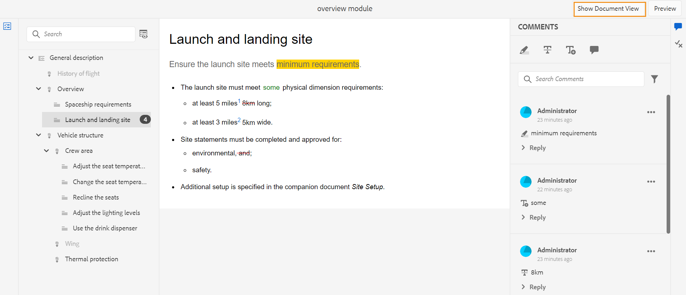

# 주제 검토 {#id2056B0W0FBI}

검토자인 경우 검토 주제에 대한 링크가 포함된 검토 요청 이메일을 받게 됩니다. 링크를 클릭하면 공유 주제에 대한 피드백을 추가할 수 있는 검토 페이지로 이동합니다.

항목을 검토하려면 다음 단계를 수행하십시오.

1. 검토 요청 이메일에 제공된 직접 링크를 클릭합니다.

   주제 또는 맵 링크가 브라우저에서 열립니다.

   >[!NOTE]
   >
   > AEM 사용자 인터페이스의 받은 편지함 알림 영역에서 주제 검토 링크에 액세스할 수도 있습니다.

1. 주제 검토를 시작하는 방법에 따라 다음 두 화면 중 하나를 볼 수 있습니다.

   >[!NOTE]
   >
   > 다음에서 검토를 만든 경우 UI가 다를 수 있습니다.
   >
   > - AEM Guides as a Cloud Service 2022년 11월 릴리스 또는 이전
   > - AEM Guides 버전 4.1 이하

   DITA 맵을 사용하여 검토 워크플로우를 시작하면 다음 화면이 나타납니다.

   {width="800" align="left"}

   이 화면에서는 다음 옵션을 사용할 수 있습니다.

   - **A**: 리뷰 작업의 이름.
   - **B**: 주제 보기 아이콘을 클릭하여 주제 패널을 표시하거나 숨깁니다.

   - **C**: 검색 막대에 제목 또는 파일 경로 텍스트의 일부를 입력하여 필요한 항목을 검색할 수 있습니다.

     선택   검색 창 가까이에서 모든 항목을 보거나 의견이 있는 항목을 볼 수 있습니다. 기본적으로 검토 작업에 있는 모든 주제를 볼 수 있습니다.

   - **D**: 강조 표시된 숫자 ***F*** 여기에서 원하는 필터 옵션을 선택하여 필터링할 수 있습니다. 해당 유형, 상태, 검토자 또는 버전별로 주석을 필터링할 수 있습니다. 예를 들어, 아래의 각 검토 항목에서 얼마나 많은 취소선 주석이 작성되었는지 확인하려면 필터 아이콘을 클릭한 다음 을 선택합니다 **리뷰 유형** \> **삭제**.

     >[!NOTE]
     >
     > 필터를 적용하면 선택한 필터와 일치하는 주석만 [주석] 패널에 표시됩니다. 필터링된 주석 수는 주제 패널의 왼쪽에 표시됩니다.

   - **E**: 현재 검토자에게 검토하도록 할당된 주제가 검정색으로 표시되고 클릭할 수 있습니다. 검토자가 주제 링크를 클릭하면 해당 주제가 화면 맨 위로 이동됩니다.
   - **F**: 검토할 수 없는 주제가 회색으로 표시됩니다. 주제가 읽기 전용 모드로 표시되며, 이러한 주제에 대한 검토 설명을 추가할 수 없습니다.

   - **G**: 주제에 대해 받은 댓글 수입니다. 이 숫자는 적용하는 필터에 따라 변경됩니다.

   맵의 모든 주제가 하나의 복합 문서로 표시됩니다. 검토자가 검토할 수 있는 주제가 정상적으로 표시됩니다. 검토가 허용되지 않는 항목은 표시되지 않습니다.

   {width="800" align="left"}

   위의 스크린샷에서는 현재 검토자를 검토하기 위해 일반 설명 주제가 공유되며 이는 정상적으로 표시됩니다. 그러나 다음 항목인 비행 기록 컨텐츠는 검토를 위해 공유되지 않으며 읽기 전용 모드로 표시됩니다. 현재 초점이 맞춰진 주제는 목차에도 강조 표시되어 있습니다.

   검토를 위해 하나 이상의 주제를 선택하고 공유할 때 다음 화면이 나타납니다.

   {width="800" align="left"}

   >[!NOTE]
   >
   > 여러 주제의 경우 문서 보기에서 하나의 복합 문서로 표시됩니다. 위의 스크린샷은 단일 보기에서 차례로 제공된 두 개의 서로 다른 주제를 강조 표시합니다.

1. 다음을 클릭하여 [주석] 패널을 엽니다. **댓글** 아이콘 을 클릭하여 제품에서 사용할 수 있습니다.

   도구 모음에서 적절한 설명 유형을 선택하여 검토 설명을 제공하고 Enter 키를 눌러 설명을 제출합니다.

   >[!NOTE]
   >
   > [주석] 패널에는 현재 주제에 지정된 주석만 표시됩니다. 포커스를 다른 주제로 이동하면 다른 주제에 제공된 주석이 표시됩니다.

1. 클릭 **닫기** 주제 검토를 마치면 버튼을 누릅니다. 클릭 시 **닫기** 버튼을 누르면 검토 주제에 액세스한 페이지로 리디렉션됩니다.

## 검토 화면에서 사용할 수 있는 추가 기능

**문서 보기 및 주제 보기** - 기본적으로 검토를 위해 여러 주제가 공유되면 주제의 복합 문서 보기가 검토자에게 표시됩니다. DITA 맵 검토의 경우 맵의 모든 주제가 책 보기와 유사하게 단일 문서 형태로 표시됩니다. 원하는 경우 특정 주제를 클릭하면 해당 주제만 검토 화면에 표시됩니다.

단일 항목을 보면 문서 보기로 다시 전환하는 추가 옵션이 제공됩니다. 다음 스크린샷에서는 맵 파일의 특정 주제가 검토를 위해 열립니다. 강조 표시된 옵션 — **문서 보기 표시** 사용자가 맵 파일의 문서 보기로 다시 전환할 수 있도록 허용합니다.

{width="800" align="left"}

**다양한 유형의 댓글 도구 작업** - 텍스트를 강조 표시하거나, 텍스트를 취소하거나, 텍스트를 삽입하거나, 주석 메모를 추가하여 인라인 주석을 추가할 수 있습니다. [주석] 도구 모음에 제공된 다양한 유형의 주석 도구가 아래에 설명되어 있습니다.

{width="350" align="left"}

- **강조** \(\): 강조 표시 설명을 추가하려면 텍스트를 선택하고 강조 표시 아이콘을 클릭합니다. 또는 강조 표시 아이콘을 클릭하고 원하는 텍스트를 선택합니다.

  {width="650" align="left"}

  [주석] 패널에 강조 표시된 콘텐츠에 대한 주석을 추가할 수 있는 팝업이 나타납니다.

- **취소선** \(\): 컨텐츠 제거를 제안하려면 컨텐츠를 선택하고 취소선 아이콘을 클릭하면 됩니다. 또는 원하는 텍스트를 선택하고 Delete 키를 클릭합니다.

  [주석] 패널에 팝업이 나타나며, 팝업에서 삭제된 콘텐츠에 대한 주석을 추가할 수 있습니다.

- **텍스트 삽입** \(\): 텍스트를 삽입하려면 텍스트 삽입 아이콘을 클릭하고 텍스트를 삽입하려는 위치에 커서를 놓고 정보를 입력합니다. 또는 텍스트를 삽입할 위치에 커서를 놓고 입력을 시작합니다. 추가된 정보는 녹색으로 표시됩니다.

- **주석 추가**\(\): 스티커 메모 유형의 주석을 추가하려면 [주석 추가] 아이콘을 클릭하고 팝업에 주석을 입력합니다.

**상황별 도구 모음**

상황별 도구 모음을 사용하여 텍스트를 빠르게 강조 표시하거나 취소하여 표시할 수도 있습니다. 상황별 도구 모음을 사용하여 댓글을 달려면 다음 단계를 수행하십시오.

1. 강조하거나 취소하려는 텍스트를 선택합니다. 상황별 도구 모음이 나타납니다.

   {width="550" align="left"}

1. 다음을 클릭합니다. **강조**&#x200B;또는 **취소선** 아이콘.
1. 설명 패널에서 강조 표시 또는 취소선 작업에 대한 설명을 추가할 수 있습니다.

**[주석] 패널을 사용하여 검토** - [주석] 패널에 현재 주제에 지정된 주석 목록이 표시됩니다. 주제가 여러 검토자에게 전송된 경우 이 패널에는 다른 검토자의 주석도 나열됩니다. [주석] 패널의 각 주석은 현재 주제의 해당 텍스트에 연결됩니다. 주석을 단 텍스트를 식별하는 데 도움이 됩니다. 각 주석은 타임스탬프와 함께 주석을 추가한 검토자의 이름을 표시합니다.

주석은 문서에 있는 주석 텍스트 순서대로 표시됩니다. 예를 들어 첫 번째 문장에 강조 표시 주석이 있고 첫 번째 단락의 두 번째 문장에 텍스트 삽입 주석이 있으면 강조 표시 텍스트 주석이 삽입된 텍스트 주석 앞에 표시됩니다.

설명 패널을 사용하여 수행할 수 있는 작업은 아래에 설명되어 있습니다.

- 주석을 클릭하면 문서에서 해당 주석의 위치가 강조 표시되고 표시됩니다.
- 댓글에 답글을 추가할 수 있습니다.
- [주석] 패널에서 주석 처리된 텍스트를 클릭한 다음 을 선택하여 주석을 편집할 수 있습니다 **편집** 을 클릭합니다.
- [주석] 패널에서 주석을 클릭한 다음 을 선택하여 자신의 주석을 삭제할 수 있습니다. **삭제** 옵션 메뉴의 옵션을 선택합니다.

  {width="300" align="left"}

  >[!NOTE]
  >
  > 옵션 메뉴는 자신의 댓글 위에 마우스를 올려 놓을 때만 나타납니다. 다른 검토자의 주석에는 표시되지 않습니다.

- 모든 참여 사용자는 다른 사용자가 제출한 의견에 응답할 수 있습니다. 댓글에서 **답변** Enter 키를 눌러 응답을 제출합니다.

**미리보기 모드**

- 미리보기 모드에서 주제를 열면 모든 변경 사항을 적용한 후 작성자가 주제를 볼 때 주제가 표시되는 방식이 표시됩니다. 예를 들어, 삽입된 모든 텍스트는 일반 텍스트로 표시되며 모든 스트라이크된 \(삭제된\) 텍스트는 콘텐츠에서 제거됩니다.

- 다음 스크린샷은에서 콘텐츠를 보여 줍니다. *리뷰* 모드:

{width="550" align="left"}

다음 스크린샷은에서 콘텐츠를 보여 줍니다. *미리 보기* 모드:

{width="550" align="left"}

**댓글에 첨부 파일 추가** - 다른 파일에서 사용할 수 있는 추가 정보를 제공하여 댓글을 보완하려는 경우 댓글과 함께 첨부하면 됩니다. 검토자는 로컬 시스템에서 하나 이상의 파일을 주석에 쉽게 추가할 수 있습니다. 강조, 취소선, 텍스트 삽입 또는 댓글과 같이 지원되는 모든 형식의 댓글에 파일을 추가할 수 있습니다.

주석을 삽입하면 주석 팝업이 나타납니다. 팝업에 추가 의견이나 정보를 제공한 후 Enter 키를 눌러 제출합니다. 댓글이 추가되면 해당 댓글에 첨부 파일을 추가할 수 있는 옵션이 제공됩니다.

{width="800" align="left"}

위의 스크린샷에서 문서에는 강조 표시 주석의 팝업이 포함되어 있으며 주석은 [주석] 패널에도 추가됩니다. 첨부 파일 아이콘 는 두 위치에서 주석과 함께 사용할 수 있습니다.

댓글에 첨부 파일을 추가하려면 다음 단계를 수행하십시오.

1. 다음을 클릭합니다. *첨부 파일 추가* 아이콘  첨부 파일을 추가할 댓글에.

   파일 열기 대화 상자가 나타납니다.

1. 첨부할 파일을 하나 이상 선택합니다.

   선택한 파일이 [주석] 패널에 주석과 함께 표시됩니다.

   [주석] 패널에서 파일 이름과 크기를 볼 수 있습니다. 삭제 아이콘을 클릭하여 파일을 제거하는 옵션도 있습니다  를 파일 이름과 연결했습니다.

1. **제출**&#x200B;을 클릭합니다.

   첨부 파일이 업로드되고 댓글에 추가됩니다.

**첨부 파일 작업에 대한 추가 참고 사항:**

- 기본적으로 댓글이 첨부된 파일은 두 개만 표시됩니다. 파일이 더 있으면 **첨부 파일 보기** 오른쪽의 단추는 주석에 연결된 모든 첨부 파일의 수를 \(둘 이상) 표시합니다. 번호를 클릭하여 모든 첨부 파일을 볼 수 있습니다. 예를 들어 댓글이 있는 첨부 파일이 4개 있는 경우 버튼에 +2가 표시됩니다.

{width="550" align="left"}

- 첨부 파일 위로 마우스 포인터를 가져가면 첨부 파일을 다운로드하거나 제거할 수 있는 옵션이 제공됩니다. 다음 스크린샷과 같이 현재 검토자가 해당 주석을 추가한 경우에만 첨부 파일을 제거할 수 있습니다.

{width="550" align="left"}

다른 검토자 또는 작성자는 첨부 파일 다운로드 옵션만 받습니다.

{width="550" align="left"}

- 에서 댓글과 관련된 모든 첨부 파일을 다운로드할 수 있습니다. **첨부 파일 보기** 대화 상자. 첨부 파일을 선택하고 **다운로드** 아이콘(댓글 수준).

- 또한 다음 위치에서 댓글과 연결된 첨부 파일을 삭제할 수 있습니다. **첨부 파일 보기** 대화 상자. 첨부 파일을 선택하고 **삭제** 아이콘.

{width="550" align="left"}

**조건 패널** - 주제에 조건부 콘텐츠가 있으면 다음 내용이 표시됩니다. **조건** \(\) 오른쪽에 있는 아이콘입니다. 클릭 중 **조건** 아이콘 은 항목의 사용 가능한 조건에 따라 콘텐츠를 강조 표시할 수 있는 조건 패널을 엽니다.

: 기본적으로 **모든 조건 강조 표시** 옵션이 활성화되고, 모든 조건이 선택되고, 전체 콘텐츠가 표시되고, 맞춤화된 콘텐츠가 검토 및 미리보기 모드에서 모두 강조 표시된 상태로 표시됩니다.

: 을 비활성화할 수 있습니다 **모든 조건 강조 표시** 을 선택하고 강조 표시 없이 주제에 있는 모든 콘텐츠를 일반 텍스트로 볼 수 있습니다.

{width="350" align="left"}

특정 조건을 숨기거나 표시하도록 선택할 수 있습니다.

- 조건을 숨기면 해당 조건이 있는 콘텐츠가 검토 모드에서 강조 표시되지 않습니다.
- 조건을 표시하는 경우 검토 모드에서 조건이 지정된 콘텐츠가 강조 표시됩니다. 예를 들어 다음 스크린샷에서는 콘텐츠에만 두 가지 조건( `win` 및 `mac` 강조 표시됩니다.

{width="650" align="left"}

미리보기 모드에서 비조건부 콘텐츠 및 표시된 두 조건 - 을 사용하는 조건부 콘텐츠 `win` 및 `mac` 이 표시됩니다. 조건이 숨겨진 나머지 조건부 콘텐츠는 표시되지 않습니다.

**실시간 검토** - 댓글 패널은 댓글과 댓글에 대한 작성자의 피드백 또는 작업으로 실시간으로 업데이트됩니다.

- 여러 검토자가 동일한 문서에 동시에 댓글을 달거나 댓글에 답글을 달 수 있습니다. 화면 오른쪽 상단의 사용자 아이콘 위에 마우스를 올려 놓으면 현재 문서를 검토하고 있는 사용자를 확인할 수 있습니다.

- 주제가 여러 검토 작업의 일부인 경우 한 작업에서 작성한 댓글은 다른 작업에 표시되지 않습니다.

- 오래된 설명 아이콘 \(\) 문서의 최신 버전과 주석 버전 간의 차이점이 표시됩니다. 비교 중인 버전의 버전 번호 \(은)가 문서 맨 위에 표시됩니다.

  {width="800" align="left"}

  >[!NOTE]
  >
  > 오래된 설명 아이콘 위로 마우스를 가져가면 설명이 추가된 주제의 버전 번호가 표시됩니다. 예를 들어 버전 1.0에서 댓글이 제공되면 동일한 내용이 표시됩니다.

- 오래된 설명을 클릭하면 왼쪽 패널에서 해당 주석의 버전이 열립니다. 이전 버전은 왼쪽 패널에 표시되고 현재 버전은 오른쪽 패널에 표시됩니다. 오래된 버전의 모든 주석을 왼쪽에 가져옵니다. 이전 버전과 현재 버전을 비교할 수 있습니다.

**댓글 필터링** - 문서의 주석을 필터링하여 필요에 따라 특정 주석을 볼 수 있습니다. 주석을 필터링하려면 **필터** 아이콘 \(\) [주석] 패널의 [주석 검색] 텍스트 상자 오른쪽에 있는 메뉴에 나타납니다.

에서 다음 필터링 옵션 중 하나 이상을 선택합니다 **필터 유형** 대화 상자 및 클릭 **적용**.

- **리뷰 유형** - 설명 유형(강조, 삭제, 삽입 또는 설명)을 기준으로 필터링합니다.
- **상태 검토** - 수락됨, 거부됨 또는 없음 등 댓글의 상태를 기준으로 필터링합니다.
- **검토자** - 검토자 이름을 기준으로 필터링합니다.

- **버전** - 특정 버전의 주제에 대해 받은 댓글을 기반으로 필터링합니다.

  필터를 사용할 때 오른쪽 패널의 주석이 선택에 따라 필터링되고 왼쪽 패널의 주석 수가 그에 따라 업데이트됩니다.

필터를 제거하고 모든 주석을 보려면 **필터 유형** 대화 상자 및 클릭 **적용**.

**상위 항목:**[&#x200B;주제 또는 맵 검토](review.md)
