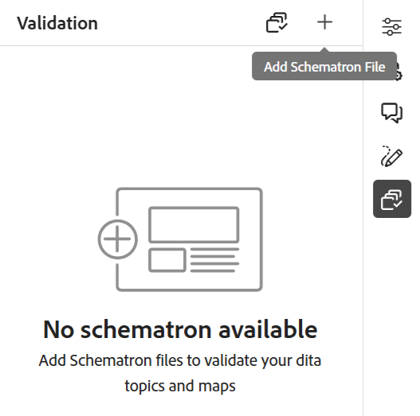

# Schematron 파일 지원

&quot;Schematron&quot;은 XML 파일에 대한 테스트를 정의하는 데 사용되는 규칙 기반 유효성 검사 언어를 나타냅니다. 웹 편집기는 Schematron 파일을 지원합니다. Schematron 파일을 가져와서 웹 편집기에서 편집할 수도 있습니다. Schematron 파일을 사용하여 특정 규칙을 정의한 다음 DITA 주제 또는 맵의 유효성을 검사할 수 있습니다.

>[!NOTE]
>
> 웹 편집기는 ISO Schematron을 지원합니다.


## Schematron 파일 가져오기

Schematron 파일을 가져오려면 다음 단계를 수행하십시오.

{width="300" align="left"}

1. *저장소 보기*&#x200B;에서 필요한 폴더(파일을 업로드할 위치)로 이동합니다.
1. **옵션** 아이콘을 클릭하여 컨텍스트 메뉴를 열고 **Assets 업로드**&#x200B;를 선택합니다.
1. **Assets 업로드** 대화 상자에서 **에셋 폴더 선택** 필드에서 대상 폴더를 변경할 수 있습니다.
1. **파일 선택**&#x200B;을 클릭하고 Schematron 파일을 찾아 선택합니다. 하나 이상의 Schematron 파일을 선택한 다음 **업로드**&#x200B;를 클릭할 수 있습니다.

## Schematron을 사용하여 DITA 주제 또는 맵의 유효성 검사

Schematron 파일을 가져온 후 웹 편집기에서 편집할 수 있습니다. Schematron 파일을 사용하여 주제 또는 DITA 맵의 유효성을 검사할 수 있습니다. 예를 들어 DITA 맵 또는 주제에 대해 다음 규칙을 만들 수 있습니다.

* 제목은 DITA 맵에 대해 정의됩니다.
* 특정 길이에 대한 간단한 설명이 추가되었습니다.
* 지도에 topicref가 하나 이상 있어야 합니다.

웹 편집기에서 항목을 열면 오른쪽에 Schematron Validation 패널이 나타납니다. Schematron 파일로 주제 또는 맵을 추가하고 확인하려면 다음 단계를 수행하십시오.
{width="300" align="left"}

1. Schematron 아이콘()을 클릭하여 Schematron 패널을 엽니다.
1. Add Schematron File 을 사용하여 Schematron 파일을 추가합니다.
1. Schematron 파일에 오류가 없는 경우 이 파일이 추가되고 유효성 검사 패널에 나열됩니다. 오류가 포함된 Schematron 파일에 대한 오류 메시지가 표시됩니다.
   >[!NOTE]
   >
   >Schematron 파일 이름 근처에 있는 교차 아이콘을 사용하여 제거할 수 있습니다.
1. Validate with Schematron 을 클릭하여 항목의 유효성을 검사합니다.

   * 항목이 규칙을 위반하지 않으면 파일에 대한 유효성 검사 성공 메시지가 표시됩니다.
   * 주제가 규칙을 어기면, 예를 들어 제목이 포함되어 있지 않고 위의 주어진 Schematron에 대해 유효성이 검사되면 유효성 검사 오류가 표시됩니다.

1. 오류 메시지를 클릭하여 열린 항목/맵에서 오류가 포함된 요소를 강조 표시합니다.

웹 편집기의 Schematron 지원을 통해 규칙 세트에 대한 파일의 유효성을 검사하고 전체 항목의 일관성과 정확성을 유지할 수 있습니다.

## 어설션 및 보고서 문을 사용하여 규칙 확인{#schematron-assert-report}

AEM Guides은 Schematron에서 assert 및 report 문도 지원합니다. 이러한 문은 DITA 주제의 유효성을 검사하는 데 도움이 됩니다.

### Assert 문

어설션 문은 테스트 문이 false로 평가될 때 메시지를 생성합니다. 예를 들어 제목을 굵게 하려면 어설션 문을 정의할 수 있습니다.

```XML
<sch:rule context="title"> 
    <sch:assert test = "b"> Title should be bold </sch:assert>
  </sch:rule>
```

Schematron을 사용하여 DITA 주제의 유효성을 검사하면 제목이 굵게 표시되지 않은 주제에 대한 메시지가 표시됩니다.

### 보고서 문

보고서 문은 테스트 문이 true로 평가될 때 메시지를 생성합니다. 예를 들어 간단한 설명이 150자 이하이도록 하려면 보고서 문을 정의하여 간단한 설명이 150자를 초과하는 항목을 확인할 수 있습니다.
Schematron을 사용하여 DITA 주제의 유효성을 검사하면 보고서 문이 true로 평가되는 규칙에 대한 전체 보고서를 얻을 수 있습니다. 따라서 짧은 설명이 150자를 초과하는 주제에 대한 메시지가 표시됩니다.


```XML
<sch:rule context="shortdesc"> 
        <sch:let name="characters" value="string-length(.)"/> 
        <sch:report test="$characters &gt; 150">  
        The short description has <sch:value-of select="$characters"/> characters. It should contain more than 150 characters.      
        </sch:report>   
    </sch:rule> 
```

>[!NOTE]
>
> Schematron 규칙을 작성하는 동안에는 Xpath 2.0 표현식만 사용하십시오.

## 정규 표현식 사용{#schematron-regex-espressions}

Regex 표현식을 사용하여 matches() 함수를 사용하는 규칙을 정의한 다음 Schematron 파일을 사용하여 유효성 검사를 수행할 수도 있습니다.

예를 들어 제목에 한 단어만 포함된 경우 메시지를 표시하는 데 사용할 수 있습니다.

```XML
<assert test="not(matches(.,'^\w+$'))"> 
No one word titles.
</assert>  
```


## 추상 패턴 정의{#schematron-abstract-patterns}

AEM Guides은 Schematron의 추상적인 패턴도 지원합니다. 일반 추상 패턴을 정의할 수 있으며 이러한 추상 패턴을 재사용할 수 있습니다.  실제 패턴을 지정하는 자리 표시자 매개변수를 생성할 수 있습니다.


추상 패턴을 사용하면 규칙의 중복을 줄이고 유효성 검사 논리를 보다 쉽게 관리 및 업데이트할 수 있으므로 스키마 스키마를 단순화할 수 있습니다. 또한 복잡한 유효성 검사 논리를 스키마 전체에서 재사용할 수 있는 단일 추상 패턴으로 정의할 수 있으므로 스키마를 더 쉽게 이해할 수 있습니다.


예를 들어 다음 XML 코드는 추상적인 패턴을 만든 다음 실제 패턴은 ID를 사용하여 이를 참조합니다.

```XML
<sch:pattern abstract="true" id="LimitNoOfWords"> 

<sch:rule context="$parentElement"> 

<sch:let name="words" value="string-length(.)"/> 

<sch:assert test="$words &lt; $maxWords"> 

You have <sch:value-of select="$words"/> letters. This should be lesser than <sch:value-of select="$maxWords"/>. 

</sch:assert>  

<sch:assert test="$words &gt; $minWords"> 

You have <sch:value-of select="$words"/> letters. This should be greater than <sch:value-of select="$minWords"/>. 

</sch:assert>  

</sch:rule> 

</sch:pattern> 

<sch:pattern is-a="LimitNoOfWords" id="extend-LimitNoOfWords"> 

<sch:param name="parentElement" value="title"/> 

<param name="minWords" value="1"/> 

<param name="maxWords" value="8"/> 

</sch:pattern> 
```
