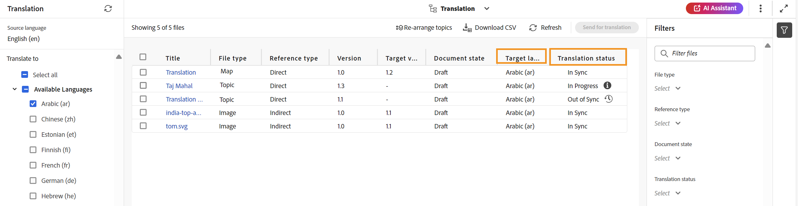

# 번역 상태 보기 {#id169SEK00KOW}

DITA 맵에서 각 주제에 대한 번역 상태 및 번역된 언어 사본을 볼 수 있습니다.

DITA 맵의 변환 상태를 보려면 다음 단계를 수행하십시오.

1. 편집기의 **맵 콘솔**&#x200B;을 통해 필요한 DITA 맵 파일로 이동합니다.
1. **번역** 탭을 선택합니다.
1. 왼쪽의 **번역** 패널에서 상태를 확인할 **사용 가능한 언어** 목록에서 언어를 체크인하고 **적용**&#x200B;을 선택합니다.
1. 타겟 언어가 선택된 상태로 있는 모든 주제가 번역 상태와 함께 표시됩니다.

   >[!NOTE]
   >
   > 번역 상태 \(동기화되지 않은 사본, 진행 중 또는 동기화 중\), Source 유형 \(모두, DITA, DITA 맵 또는 리소스\) 및 수정 날짜를 기준으로 콘텐츠를 추가로 필터링할 수 있습니다. 또한 키워드를 입력하여 특정 주제를 검색할 수 있습니다. 변경된 사항이 있으면 **새로 고침**&#x200B;을 사용하여 상태를 업데이트할 수 있습니다.

   

**상위 항목:**[&#x200B;콘텐츠 번역 개요](translation.md)
