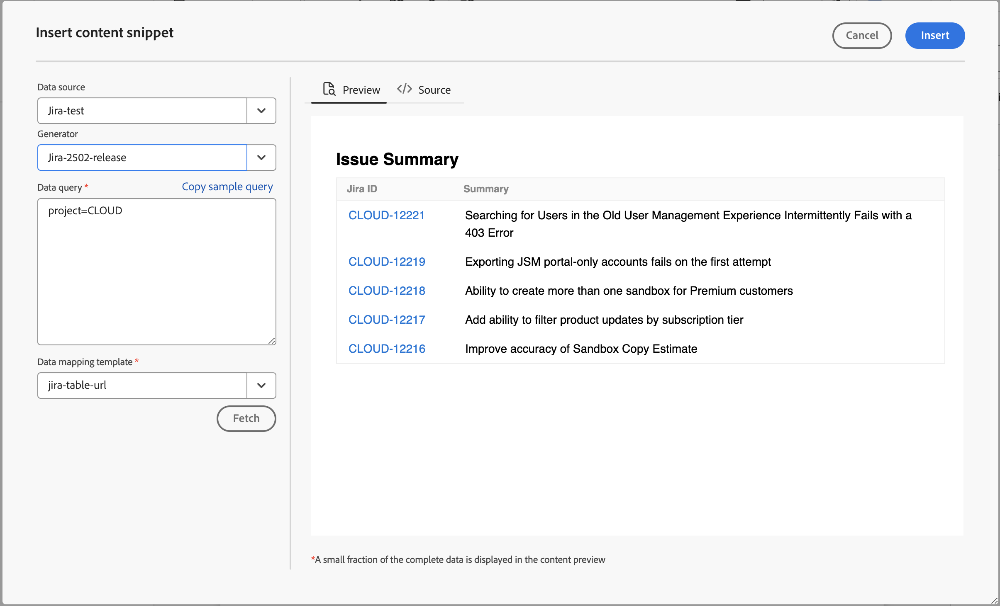

# 데이터 소스의 데이터 사용

**데이터 원본**&#x200B;은(는) 조직의 데이터를 저장하고 관리하는 시스템입니다. JIRA, SQL 데이터베이스, PIM 또는 PLM과 같은 기록 시스템입니다. AEM Guides은 데이터 소스와 연결하여 해당 소스의 데이터를 사용할 수 있는 기능을 제공합니다.

파일 커넥터를 사용하여 JSON 데이터 파일에 연결할 수도 있습니다. 컴퓨터에서 JSON 파일을 업로드하거나 Adobe Experience Manager 자산에서 해당 파일을 찾아봅니다. 그런 다음 생성기를 사용하여 콘텐츠 조각 또는 주제를 만듭니다.

## 데이터 소스 패널

연결된 데이터 원본을 보려면 왼쪽 패널에서 **데이터 원본** 을 선택하십시오. 데이터 소스 패널이 열리고 연결된 모든 데이터 소스가 표시됩니다.

설정에 따라 관리자가 데이터 소스 커넥터를 구성할 수 있습니다.

 클라우드 서비스 

- 2023년 10월 릴리스 이상을 사용 중인 경우 Cloud Services 설치 및 구성 안내서에서 [사용자 인터페이스에서 데이터 소스 커넥터를 구성](../cs-install-guide/conf-data-source-connector-tools.md)하는 방법을 알아보세요.

- 2023년 7월 또는 2023년 9월 릴리스를 사용 중인 경우 Cloud Services 설치 및 구성 안내서에서 [데이터 소스 커넥터를 구성](../cs-install-guide/conf-data-source-connector.md)하는 방법을 알아보세요.

    

  On-premise Software 

- 4.3.1 이상 릴리스를 사용하는 경우 On-Premise 설치 및 구성 안내서에서 [사용자 인터페이스에서 데이터 소스 커넥터를 구성](../cs-install-guide/conf-data-source-connector-tools.md)하는 방법을 알아보세요.

- 4.3 릴리스를 사용 중인 경우 On-Premise 설치 및 구성 안내서에서 [데이터 원본 커넥터를 구성](../cs-install-guide/conf-data-source-connector.md)하는 방법을 알아보세요.

>[!NOTE]
>
> 관리자가 커넥터를 구성한 데이터 소스를 볼 수 있습니다.

## 목록 보기 또는 타일 보기 표시

목록 보기 또는 타일 보기 간을 전환하여 목록 또는 타일 형식으로 다양한 데이터 소스를 볼 수 있습니다.

데이터 소스를 선택하여 선택한 데이터 소스에 사용할 수 있는 콘텐츠 조각 생성기 및 주제 생성기를 확인합니다.

### 목록 보기

{width="300" align="left"}

*연결된 데이터 원본 목록입니다.*

### 타일 보기

{width="300" align="left"}

*연결된 데이터 원본을 타일로 봅니다.*

다음 두 가지 방법으로 데이터 소스의 데이터를 사용할 수 있습니다.
- 콘텐츠 조각 삽입
- 주제 만들기

## 데이터 소스에서 콘텐츠 조각 삽입

Adobe Experience Manager Guides은 데이터 소스와 연결하는 기능을 제공합니다. 데이터를 가져와 주제에 삽입하고 편집할 수 있습니다. 콘텐츠 조각 생성기를 사용하여 콘텐츠 조각을 쉽게 만들고 주제 내에서 재사용할 수 있습니다.

콘텐츠 조각 생성기를 사용하여 콘텐츠 조각을 만들고 항목에 삽입하려면 다음 단계를 수행하십시오.

1. 연결된 데이터 원본을 보려면 왼쪽 패널에서 **데이터 원본** 을(를) 선택하십시오.

1. 선택한 데이터 소스에 사용할 수 있는 콘텐츠 조각 생성기를 보려면 데이터 소스를 선택하십시오.

   {width="300" align="left"}

   *데이터 원본 패널에 사용 가능한 콘텐츠 조각 생성기가 나열됩니다.*

1. 새 콘텐츠 조각 생성기를 추가하려면 **추가**&#x200B;를 선택하십시오. **콘텐츠 조각 생성기 추가** 패널이 열립니다.

   {width="500" align="left"}

1. **데이터 쿼리** 텍스트 상자에 쿼리를 입력하십시오.  데이터 쿼리를 빠르게 복사하려면 **샘플 쿼리 복사**&#x200B;를 선택하십시오. 쿼리를 수동으로 만드는 대신 샘플 쿼리를 복사하여 **데이터 쿼리** 텍스트 상자에 붙여 넣을 수 있습니다. 그런 다음 데이터 요구 사항에 따라 쿼리를 편집하면 됩니다.

   >[!NOTE]
   >
   > Experience Manager은 다양한 데이터 소스의 모든 리소스에 대해 다양한 샘플 쿼리를 제공합니다. 이러한 지표는 데이터를 가져오는 데이터 소스에 매핑됩니다.

1. 파일 커넥터를 사용하는 경우 컴퓨터에서 JSON 파일을 업로드하거나 Adobe Experience Manager 자산에서 JSON 파일을 검색할 수 있습니다.

   >[!NOTE]
   >
   > 파일 커넥터를 사용하는 경우 데이터 쿼리 대신 파일을 업로드하거나 검색하는 옵션을 볼 수 있습니다.

1. **데이터 매핑 템플릿** 드롭다운에서 데이터 소스와 매핑할 템플릿을 선택합니다.
선택한 데이터 소스에 대한 기본 제공 템플릿이 드롭다운에 표시됩니다. 예를 들어 &quot;PostgreSQL&quot; 데이터 소스의 &quot;sql-table&quot; 템플릿을 볼 수 있습니다.

   >[!NOTE]
   >  
   > 관리자가 사용자 정의된 템플릿을 구성하면 관리자가 수행한 템플릿 경로 구성에 따라 드롭다운 목록에도 해당 템플릿이 표시됩니다.
   >   
   >템플릿에서 속도 도구를 사용할 수도 있습니다. [Velocity 도구를 사용](#use-velocity-tools)하는 방법에 대해 자세히 알아보세요.

1. REST Client, Salsify, Akeneo 및 Microsoft ADO와 같은 일부 커넥터에 대해 **Resource** 드롭다운이 나타납니다.  드롭다운에서 리소스를 선택하고 리소스를 연결하여 콘텐츠 조각 또는 해당 리소스에 대한 생성기를 사용하여 항목을 만듭니다.

   >[!NOTE]
   >
   > 관리자는 기본 리소스를 구성하거나 데이터 소스 커넥터를 구성하는 동안 여러 URL에 대한 리소스를 추가할 수 있습니다.

1. 데이터 원본에서 데이터를 가져오고 SQL 쿼리에서 얻은 데이터에 템플릿을 적용하려면 **가져오기**&#x200B;를 선택하십시오.

1. 미리보기 또는 DITA 소스 뷰에서 데이터를 볼 수 있습니다.

   1. 미리보기는 콘텐츠에 삽입할 때 데이터가 표시되는 방식을 보여 줍니다. 미리 보기에는 데이터의 작은 부분이 선택한 템플릿의 형식으로 표시됩니다.
예:
      - SQL 테이블 템플릿을 선택한 경우 SQL 데이터를 테이블 형식으로 볼 수 있습니다.
      - jira 순차 목록 템플릿을 선택한 경우 Jira 문제에 대한 순차 목록을 볼 수 있습니다.

   1. 소스 뷰에는 DITA 소스 뷰의 데이터가 표시됩니다.

      {width="500" align="left"}
      *콘텐츠 조각 생성기를 추가합니다. 원본 또는 미리 보기 모드에서 데이터를 봅니다.*

1. 쿼리 결과를 저장하려면 생성기 이름을 입력한 다음 **추가**&#x200B;를 선택하십시오.   새 콘텐츠 조각 생성기가 목록에 추가됩니다.

   >[!NOTE]
   >
   > 새 콘텐츠 생성기의 이름에 대한 파일 이름 지정 규칙을 따라야 합니다. 콘텐츠 조각 생성기 이름에는 공백을 사용할 수 없습니다. 또한 기존 컨텐츠 생성기의 이름으로 새 컨텐츠 생성기를 저장할 수 없습니다. 오류가 발생했습니다.

### 콘텐츠 조각 생성기 옵션

콘텐츠 조각 생성기를 마우스 오른쪽 단추로 클릭하여 옵션을 엽니다. 옵션을 사용하여 다음 작업을 수행할 수 있습니다.

- **미리 보기**: 이 옵션을 사용하여 창을 열고 데이터가 출력에서 표시되는 방식의 일부를 볼 수 있습니다.
- **삽입**: 편집기에서 편집하기 위해 연 항목에 선택한 콘텐츠 조각을 삽입하려면 이 옵션을 사용합니다. 데이터가 코드 조각으로 삽입되면 편집기에서 주제 내의 데이터를 편집할 수도 있습니다.

  >[!NOTE]
  > 
  > 삽입 옵션은 항목을 편집하는 동안에만 나타납니다.

- **편집**: 이 옵션을 사용하여 콘텐츠 조각 생성기를 변경하고 저장합니다.
- **삭제**: 이 옵션을 사용하여 선택한 콘텐츠 조각 생성기를 삭제합니다.
- **복제**: 이 옵션을 사용하여 선택한 콘텐츠 조각 생성기의 복제나 복사본을 만드십시오. 복제본은 기본적으로 접미사(예: generator_1)로 생성됩니다.

### 쿼리 데이터 삽입

도구 모음에서 **데이터 쿼리** 를 사용하여 데이터 코드 조각을 주제에 삽입할 수도 있습니다.  드롭다운에서 생성기를 선택하거나 쿼리를 편집하거나 템플릿을 변경하고 주제에 데이터를 삽입할 수 있습니다.

{width="800" align="left"}

*데이터 코드 조각을 편집하고 삽입하십시오.*

## 주제 생성기를 사용하여 주제 생성

주제 생성기는 소스의 데이터가 포함된 주제를 생성하는 데 도움이 됩니다. 주제 생성기를 빠르게 생성한 다음 생성기를 사용하여 주제를 생성할 수 있습니다. 각 주제에는 표, 목록, 단락 등 다양한 형식의 데이터가 포함될 수 있습니다.   예를 들어 한 항목에서 모든 새 제품에 대한 세부 정보와 판매 중단될 모든 제품 목록이 포함된 테이블을 추가할 수 있습니다.

주제 생성기는 모든 주제에 대한 데이터 및 DITA 맵이 포함된 주제를 생성할 수 있습니다. 콘텐츠에서 이러한 주제를 `<conref>`할 수도 있습니다. 이렇게 하면 데이터를 데이터 소스와 계속 동기화할 수 있으며 쉽게 업데이트할 수 있습니다.

### 주제 만들기

주제 생성기를 사용하여 주제를 작성하려면 다음 단계를 수행합니다.

1. 데이터 소스를 선택하여 선택한 데이터 소스에 사용할 수 있는 콘텐츠 조각 생성기 및 주제 생성기를 확인합니다.

   {width="300" align="left"}

   *연결된 데이터 원본에 대한 항목 생성기를 추가합니다.*

1. **추가** 을(를) 선택하고 드롭다운에서 **주제 생성기**&#x200B;를 선택하여 새 주제 생성기를 추가합니다. **주제 생성기 추가** 패널이 열립니다.

1. **주제 생성기 추가** 패널의 다음 세 가지 탭 아래의 필드에 값을 입력하십시오.

   **구성 가져오기**

   {width="300" align="left"}

   *항목 생성기에 대한 데이터 쿼리, 데이터 매핑 템플릿 및 루트 노드 세부 정보를 추가하고 [구성 가져오기] 패널에서 고유한 이름을 지정합니다.*

   1. **데이터 쿼리** 텍스트 상자에 쿼리를 입력하십시오. 데이터 쿼리를 빠르게 복사하려면 **샘플 쿼리 복사**&#x200B;를 선택하십시오. 쿼리를 수동으로 만드는 대신 샘플 쿼리를 복사하여 **데이터 쿼리** 텍스트 상자에 붙여 넣을 수 있습니다. 그런 다음 데이터 요구 사항에 따라 쿼리를 편집하면 됩니다.

      >[!NOTE]
      >
      >Experience Manager은 다양한 데이터 소스의 모든 리소스에 대해 다양한 샘플 쿼리를 제공합니다. 이러한 지표는 데이터를 가져오는 데이터 소스에 매핑됩니다.

   1. 파일 커넥터를 사용하는 경우 컴퓨터에서 JSON 파일을 업로드하거나 Adobe Experience Manager 자산에서 JSON 파일을 검색할 수 있습니다.

      >[!NOTE]
      >
      > 파일 커넥터를 사용하는 경우 데이터 쿼리 대신 파일을 업로드하거나 검색하는 옵션을 볼 수 있습니다.

   1. **데이터 매핑 템플릿** 드롭다운에서 데이터 소스와 매핑할 템플릿을 선택합니다.

      >[!NOTE]
      >
      > 관리자가 사용자 정의된 템플릿을 구성한 경우 드롭다운 목록에도 해당 템플릿이 표시됩니다(관리자가 수행한 템플릿 경로 구성에 따라). 예를 들어 정렬된 목록, 표, 단락 또는 기타 DITA 요소가 들어 있는 주제 템플릿을 만들 수 있습니다.

   1. **루트 노드**&#x200B;를 입력하십시오. 데이터에 액세스하려는 노드입니다. 그런 다음 주제 생성기는 루트 노드에 정의된 수준에서 각 주제를 생성합니다. 예를 들어 &#39;issues&#39;를 Jira의 루트 노드로 추가할 수 있습니다. 따라서 쿼리가 13개의 문제를 반환하는 경우 각 문제에 대해 1개의 주제씩 13개의 주제가 제공됩니다.

   1. 데이터 원본에서 데이터를 가져오고 SQL 쿼리에서 얻은 데이터에 템플릿을 적용하려면 **가져오기**&#x200B;를 선택하십시오. 미리 보기에는 주제가 선택한 템플릿의 형식으로 표시되는 방식이 일부 표시됩니다. 예를 들어 쿼리의 결과로 발생하는 모든 필드에 대한 단일 Jira 문제를 볼 수 있습니다.
   1. 주제 생성기의 이름을 입력합니다.

      >[!NOTE]
      > 
      > 새 주제 생성기의 이름에 대한 파일 이름 지정 규칙을 따라야 합니다. 주제 생성기 이름에는 공백을 사용할 수 없습니다. 또한 기존 주제 생성기의 이름으로 새 주제 생성기를 저장할 수 없습니다. 오류가 발생했습니다.

   **출력 구성**

   {width="300" align="left"}

   *[출력 구성] 패널에 [출력 경로] 및 [항목 명명 규칙] 세부 정보를 입력합니다. DITA 맵을 생성하고 이름을 지정합니다.*

   1. 항목을 저장할 **출력 경로** 세부 정보를 입력하십시오.
   1. **항목 명명 규칙**&#x200B;에서 속도 태그가 있는 값 또는 변수를 입력할 수 있습니다. 새 주제는 규칙을 따릅니다. 예를 들어 `$key`을(를) 입력하여 Jira 키를 기반으로 주제를 만들 수 있습니다.
   1. 생성된 모든 항목이 포함된 맵을 만들려면 **맵 생성** 옵션을 활성화합니다.
   1. 새 DITA 맵의 이름을 입력합니다.

   >[!NOTE]
   >
   > 주제 생성기는 주제와 동일한 출력 경로에서 DITA 맵을 생성합니다.

   **메타데이터**

   드롭다운에서 메타데이터 속성을 선택하여 주제에 전달합니다. **이름** 드롭다운에 사용자 지정 속성과 기본 속성이 모두 나열됩니다.

   예를 들어 다음 스크린샷에서 `dc:description`, `dc:language`, `dc:title` 및 `docstate`은 값을 정의할 수 있는 기본 속성입니다. 작성자와 같은 사용자 지정 속성을 만들고 해당 값을 정의할 수 있습니다.

   {width="300" align="left"}

   *주제에 전달할 메타데이터 패널의 메타데이터 속성을 추가하십시오.*

1. 생성기 이름을 입력하고 **저장**&#x200B;을 선택하여 쿼리 결과를 저장합니다. 새 주제 생성기가 목록에 추가됩니다.

1. **저장 및 생성**&#x200B;을 선택하여 주제 생성기를 저장하고 주제 생성기에서 새 주제를 생성합니다.

   {width="800" align="left"}

   *기존 항목 생성기에서 새 항목을 생성합니다.*

   >[!NOTE]
   >
   > 주제가 이미 있는 경우 생성기는 기존 주제의 데이터를 업데이트합니다.

### 주제 생성기 옵션

항목 생성기를 마우스 오른쪽 단추로 클릭하여 **옵션**&#x200B;을 엽니다. 옵션을 사용하여 다음 작업을 수행할 수 있습니다.

- **생성**: 이 옵션은 선택한 항목 생성기에 대한 항목을 생성합니다. 이 옵션을 사용하여 기존 항목을 업데이트할 수도 있습니다. 데이터 소스에 연결하고 업데이트된 데이터를 가져옵니다. 콘텐츠를 생성하는 동안 이 옵션이 비활성화되고 로더가 표시됩니다.
  >[!NOTE]
  >
  >주제가 이미 있는 경우 주제의 데이터를 덮어쓰거나 새 버전으로 저장할 수 있습니다.

  

  *주제를 생성하고 파일이 이미 있으면 새 버전으로 저장하거나 덮어씁니다.*
- **로그 보기**: 콘텐츠 생성 로그 파일을 보려면 이 옵션을 선택하십시오. 로그 파일이 새 탭에서 열립니다. 로그 파일에서 오류, 경고, 정보 메시지 및 예외를 볼 수 있습니다. 이 옵션은 선택한 주제 생성기에 대한 콘텐츠를 생성한 경우 활성화됩니다.

- **미리 보기**: 이 옵션을 사용하여 창을 열고 데이터가 출력에서 표시되는 방식의 일부를 볼 수 있습니다.

- **편집**: 항목 생성기를 변경하고 저장하려면 이 옵션을 사용합니다. 이 옵션은 콘텐츠를 생성하는 동안 비활성화됩니다.
- **삭제**: 선택한 항목 생성기를 삭제하려면 이 옵션을 사용하십시오. 이 옵션은 콘텐츠를 생성하는 동안 비활성화됩니다.
- **복제**: 이 옵션은 선택한 항목 생성기의 복제나 복사본을 만듭니다. 중복은 기본적으로 접미사(예: `topic-sample_1`)로 만들어집니다.

## 데이터 소스 템플릿에서 Velocity 도구 사용 {#use-velocity-tools}

Experience Manager 템플릿도 Velocity 도구(버전 2.0)를 지원합니다. 이러한 도구를 사용하면 데이터 소스에서 가져온 데이터에 다양한 함수를 적용할 수 있습니다. [Velocity 도구](https://velocity.apache.org/tools/2.0/generic.html)의 사용 및 적용할 수 있는 함수에 대해 자세히 알아보세요.

템플릿에서 속도 도구를 사용하려면 다음 단계를 수행하십시오.
1. 편집기에서 Velocity 템플릿을 편집합니다.
1. 도구와 해당 함수를 `<tool.function>` 형식으로 추가합니다. 예:
   - 계산 도구를 사용하여 난수를 생성하려면 `$mathTool.random`을(를) 사용합니다.
   - 계산 도구를 사용하여 숫자 합계를 생성하려면 `$mathTool.add(num1, num2)`을(를) 사용합니다.
1. 템플릿을 사용하여 콘텐츠 조각 또는 주제를 만듭니다.
1. 템플릿에 데이터를 적용하면 미리보기 또는 DITA 소스 뷰에서 데이터를 볼 수 있습니다.

속도 템플릿 내의 다음 도구를 사용하여 커넥터에서 가져오는 데이터에 다양한 기능을 적용할 수 있습니다.
-`$alternatorTool`
- `$classTool`
- `$contextTool`
- `$conversionTool`
- `$dateTool`
- `$comparisonDateTool`
- `$displayTool`
- `$escapeTool`
- `$fieldTool`
- `$loopTool`
- `$linkTool`
- `$listTool`
- `$mathTool`
- `$numberTool`
- `$renderTool`
- `$resourceTool`
- `$sortTool`
