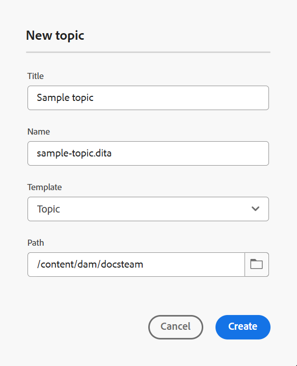

# 주제 만들기 {#id2056AL00O5Z}

Adobe Experience Manager Guides을 사용하면 주제, 작업, 개념, 참조, 용어집, DITAVAL, Markdown 등의 유형의 DITA 주제를 만들 수 있습니다. 기본 제공 템플릿을 기반으로 주제를 만드는 것 외에도 사용자 지정 템플릿을 정의할 수도 있습니다. 이러한 템플릿은 폴더 프로필에 추가해야 템플릿 선택 블루프린트 및 편집기에 표시됩니다.

>[!NOTE]
>
> 전역 및 폴더 프로필 구성은 폴더 수준 관리 사용자만 사용할 수 있습니다. 전역 및 폴더 수준 프로필을 설정하는 방법에 대한 자세한 내용은 설치 및 설치에 대한 Adobe Experience Manager Guides 구성에서 *작성 템플릿 구성*&#x200B;을 참조하십시오.

Experience Manager Guides에서 주제를 만드는 방법에는 두 가지가 있습니다.

- [편집기에서 주제 만들기](#create-topics-from-the-editor)
- [Assets UI에서 주제 만들기](#create-topics-from-the-assets-ui)

## 편집기에서 주제 만들기

편집기에서 항목을 만들려면 다음 단계를 수행하십시오.

1. 저장소 패널에서 **새 파일** 아이콘을 선택한 다음 드롭다운 메뉴에서 **주제**&#x200B;를 선택합니다.

   {width="500" align="left"}

   [Experience Manager Guides 홈 페이지](./intro-home-page.md)와 저장소 보기에 있는 폴더의 옵션 메뉴에서도 이 옵션에 액세스할 수 있습니다.

2. **새 항목** 대화 상자가 표시됩니다.

3. **새 항목** 대화 상자에서 다음 세부 정보를 제공합니다.
   - 주제 제목.
   - \(선택 사항\)* 항목의 파일 이름입니다. 파일 이름은 제목 항목을 기반으로 자동 제안됩니다. 관리자가 UUID 설정을 기반으로 자동 파일 이름을 활성화한 경우 이름 필드가 표시되지 않습니다.
   - 주제의 기반이 되는 템플릿입니다. 예를 들어 기본 설정의 경우 빈 템플릿, 개념, DITAVAL, 참조, 작업, 주제, Markdown, 용어집 및 문제 해결 템플릿 중에서 선택할 수 있습니다. 폴더에 폴더 프로필이 구성되어 있으면 폴더 프로필에 구성된 주제 템플릿만 표시됩니다.
   - 주제 파일을 저장할 경로입니다. 기본적으로 현재 저장소에서 선택한 폴더의 경로가 경로 필드에 표시됩니다.

4. **만들기**&#x200B;를 선택합니다.

   {width="300" align="left"}

지정한 경로에 주제가 만들어집니다. 또한 편집기에서 편집할 주제가 열립니다.

{align="left"}

## Assets UI에서 주제 만들기

Assets UI에서 주제를 만들려면 다음 단계를 수행하십시오.

1. Assets UI에서 주제를 만들 위치로 이동합니다.

1. 새 주제를 만들려면 **만들기** \> **DITA 주제**&#x200B;를 선택하십시오.

1. 블루프린트 페이지에서 만들려는 DITA 문서의 유형을 선택하고 **다음**&#x200B;을 선택합니다.

   {align="left"}

   기본적으로 Experience Manager Guides은 가장 일반적으로 사용되는 DITA 주제 템플릿을 제공합니다. 조직 요구 사항에 따라 더 많은 주제 템플릿을 구성하고, 설정에 맞게 Adobe Experience Manager Guides 설치 및 구성에서 *작성 템플릿 구성*&#x200B;을 볼 수 있습니다.

   >[!NOTE]
   >
   > Assets UI의 목록 보기에서 DITA 주제 유형은 유형 열에 주제, 작업, 개념, 참조, 용어집, Markdown 또는 DITAVAL로 표시됩니다. DITA 맵은 맵으로 표시됩니다.

1. 속성 페이지에서 **제목** 문서를 지정하십시오.

1. \(선택 사항\) **Name** 파일을 지정합니다.

   관리자가 UUID 설정을 기반으로 자동 파일 이름을 구성한 경우 파일 이름을 지정하는 옵션이 표시되지 않습니다. UUID 기반 파일 이름은 파일에 자동으로 할당됩니다.

   파일 이름 지정 옵션을 사용할 수 있으면 문서의 **제목**&#x200B;을 기반으로 이름이 자동으로 제안됩니다. 문서 이름을 수동으로 지정하려면 **Name**&#x200B;에 공백, 아포스트로피, 중괄호가 포함되어 있지 않고 .xml 또는.dita로 끝나는지 확인하십시오. 기본적으로 Experience Manager Guides은 모든 특수 문자를 하이픈으로 바꿉니다. DITA 파일 이름 지정에 대한 우수 사례를 알려면 우수 사례 안내서의 파일 이름 섹션을 참조하십시오.

1. **만들기**&#x200B;를 선택합니다. Topic Created 메시지가 나타납니다.

   편집기에서 편집할 주제를 열거나 Adobe Experience Manager 저장소에 주제 파일을 저장하도록 선택할 수 있습니다.

**추가 정보**

1. Assets UI **만들기** \> **DITA 주제** 또는 편집기에서 만드는 모든 새 주제에는 고유한 주제 ID가 할당됩니다. 이 ID의 값은 파일 이름 자체입니다. 또한 새 문서는 DAM에 항목의 최신 작업 복사본으로 저장됩니다. 새로 만든 항목의 수정 내용을 저장할 때까지 버전 내역에서 버전 번호를 볼 수 없습니다. 편집할 항목을 열면 도구 모음의 오른쪽 상단 모서리에 버전 정보가 표시됩니다.

   {width="550" align="left"}

2. 새로 만든 항목의 버전 정보가 *없음*(으)로 표시됩니다. 새 버전을 저장하면 버전 번호가 1.0으로 지정됩니다.

3. 관리자가 편집하기 전에 파일을 잠그도록 편집기를 구성한 경우 파일을 잠글 때까지 편집할 수 없습니다. 마찬가지로 구성된 경우 잠긴 파일을 닫기 전에 잠금 해제하라는 메시지가 표시됩니다.

4. DITA 주제를 생성한 후에는 작업 복사본에 변경 사항을 계속 저장하고 주제에 대한 업데이트를 완료한 후 새 버전을 만듭니다.

**상위 항목:**&#x200B;[&#x200B;항목 만들기 및 미리 보기](create-preview-topics.md)
