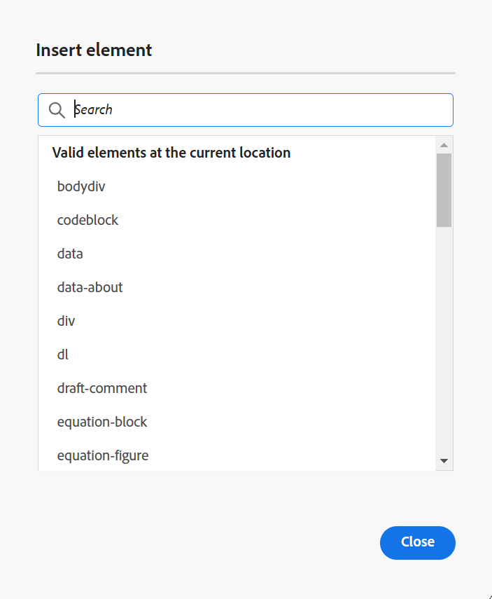

# 편집기에서 주제 편집 {#id2056B040VUI}

편집기에는 주제 파일을 쉽게 만들거나 수정할 수 있는 다양한 편집 기능이 포함되어 있습니다. 편집기에서 항목을 편집하려면 크게 다음 단계를 수행해야 합니다.

>[!IMPORTANT]
>
> 편집기에서 작업하는 동안 응용 프로그램 오류가 발생하면 페이지를 새로 고쳐 작업을 계속하십시오.

1. 항목을 변경하려면 필요한 요소의 텍스트 경계 내에서 를 클릭하고 편집을 시작합니다.

1. 특정 요소를 삽입하려면 요소 끝에 있는 커서를 이동한 다음 새 요소를 삽입하고 도구 모음에서 필요한 요소 아이콘을 선택합니다. 키보드 단축키 `Alt+1`을(를) 사용하여 **요소 삽입** 팝업을 호출할 수도 있습니다.

   주제에 사용할 수 있는 요소 목록이 나타납니다. Experience Manager Guides은 항목에서 요소의 유효한 위치에 따라 요소를 지능적으로 배치합니다.

   >[!NOTE]
   >
   > `ui_config.json`에 있는 `/etc/designs/fmdita/clientlibs/xmleditor/` 파일을 구성하여 도구 모음에 표시할 아이콘을 선택할 수도 있습니다. 기능 사용자 지정에 대한 자세한 내용은 시스템 관리자에게 문의하십시오.

1. 문서 편집이 끝나면 **모두 저장**&#x200B;을 선택합니다.

   >[!NOTE]
   >
   > 변경 내용을 Adobe Experience Manager 저장소에 커밋하지 않으려면 **닫기**&#x200B;를 선택한 다음 저장하지 않은 변경 내용 대화 상자에서 **저장하지 않고 닫기**&#x200B;를 선택합니다.

## 요소 간 콘텐츠 부분 선택

Experience Manager Guides에서는 여러 요소의 콘텐츠를 선택할 수도 있습니다. 콘텐츠를 선택한 후 다음 작업을 수행할 수 있습니다.

- 서식 지정 및 삭제: 선택한 컨텐츠를 굵게, 기울임꼴, 밑줄 또는 삭제로 만듭니다. 그런 다음 유효한 열린 태그의 콘텐츠가 병합되어 단일 요소 아래에 나타납니다. 예를 들어 단락 내의 콘텐츠를 선택하고 선택 영역을 다른 단락으로 확장할 수 있습니다. 그런 다음 선택한 컨텐츠를 굵게 만들면 열려 있는 태그의 모든 굵은 컨텐츠가 병합되어 단일 단락 요소 아래에 나타납니다.

마찬가지로 선택한 컨텐츠를 삭제하면 열려 있는 태그에서 삭제 후 남은 컨텐츠가 병합됩니다.

- 콘텐츠를 유효한 요소로 둘러싸기: 콘텐츠를 유효한 요소로 둘러싸려면 다음 단계를 수행하십시오.

   - 요소 내의 콘텐츠를 선택합니다.
   - 상단의 도구 모음에서  아이콘을 선택하여 **요소 삽입** 대화 상자를 표시합니다. 대화 상자에는 선택한 콘텐츠에 대한 유효한 요소가 나열됩니다.
     >[!NOTE]
     >
     > 선택한 컨텐츠의 컨텍스트 메뉴를 선택하여 요소 삽입 대화 상자를 볼 수도 있습니다.

   - 대화 상자에서 요소를 선택합니다. 선택한 콘텐츠는 해당 요소 아래에 래핑됩니다. 예를 들어, 단락의 내용을 선택한 다음 `<note>`요소 삽입&#x200B;**대화 상자에서** 요소를 선택하면 선택한 내용이 메모 아래에 나타납니다.

      {width="300" align="left"}

## 파일을 편집하는 동안 브라우저 새로 고침

Experience Manager Guides에서는 편집기에서 콘텐츠를 편집하는 동안 브라우저를 새로 고칠 수 있도록 지원합니다. 이 기능을 사용하면 작업하는 동안 응용 프로그램 오류가 발생할 경우 콘텐츠를 계속 편집할 수 있습니다. 저장하지 않은 변경 내용이 있는 하나 이상의 파일을 편집하기 위해 여는 동안 브라우저를 새로 고치면 저장하지 않은 변경 내용이 손실될 수 있다는 경고가 표시됩니다. 새로 고침 작업을 취소하고 변경 사항을 보존하기 위해 파일을 저장하는 옵션이 제공됩니다.

브라우저를 새로 고칠 때에도 왼쪽 및 오른쪽 패널의 보기는 편집기에 유지됩니다. Experience Manager Guides은 브라우저를 새로 고칠 때 편집기에서 연 파일의 마지막으로 저장된 상태를 복원합니다. 예를 들어 [저장소] 패널에서 연 파일이 다시 열립니다. 맵 패널은 이전에 연 맵과 함께 유지됩니다.

활성 주제 또는 DITA 맵이 컨텐트 편집 영역에 다시 열립니다.

오른쪽 패널도 다시 열리고 새로 고침 전과 동일한 보기가 표시됩니다.

## 작업 복사 표시기

Experience Manager Guides은 파일의 현재 \(working copy\)가 저장된 버전과 동기화 상태인지 여부를 보여 주는 작업 복사 표시기를 제공합니다. 현재 복사본을 변경하고 파일을 저장하지 않은 경우 항목의 파일 탭에 제목과 함께 \* 표시가 나타납니다. 이 표시기는 변경 사항을 저장하는 알림 메시지 역할을 하며 파일을 저장하면 사라집니다.

{width="550" align="left"}

Experience Manager Guides은 또한 파일의 마지막으로 저장된 \(작업\) 복사본이 저장된 버전과 동기화되고 있는지 여부를 나타냅니다. 작업 복사본과 마지막으로 저장된 버전 사이에 저장되지 않은 변경 사항이 있는 경우 항목의 파일 탭 오른쪽 상단 모서리에 표시된 버전 정보와 함께 \* 표시가 나타납니다. 이 표시기는 파일의 현재 \(작업\) 복사본에서 버전을 저장하고 만드는 알림 메시지 역할을 합니다.

{width="550" align="left"}

## 작성자 및 Source 모드에서 잠긴 파일에 액세스

다른 사용자가 DITA 또는 Markdown 파일을 잠그거나 체크 아웃하면 내용을 편집하거나 수정할 수 없습니다. 그러나 **미리 보기** 모드 외에도 **작성자** 및 **Source** 모드 모두에서 읽기 전용 형식으로 파일을 볼 수 있습니다.

읽기 전용 모드에서는 **작성자** 또는 **Source** 모드 내에서 컨텐츠, 태그 및 특성을 볼 수 있습니다. 파일 속성을 수정할 수도 있습니다.

>[!NOTE]
>
> 관리자는 다른 사람이 잠근 파일의 잠금을 해제할 수 있는 **강제 잠금 해제** 기능에 액세스할 수 있습니다.

<!-- This is no more available -->
<!--
The toolbar displays the following icons for read-only access:

- Toggle Tags view
- Version History
- Version Label

Experience Manager Guides also displays a **Read only access** indicator near the version number.
 

You can access the **Layout** view for read-only DITA maps. This view lets you see the DITA map and its properties but prevents edits.

>[!NOTE]
>
> Your folder-level administrative users must update *ui_config.json* so that you can harmoniously access the read-only files in the  Author, Source, and Layout modes.

 -->

## 탐색기에서 열린 파일 찾기

편집기에서 파일을 여는 동안 Experience Manager Guides에서는 탐색기에서 파일을 찾는 기능을 제공합니다. 예를 들어 편집하는 동안 현재 주제를 찾습니다.

**사용자 환경 설정**&#x200B;의 **모양** 탭에서 **항상 탐색기에서 파일 찾기** 옵션을 사용하여 파일을 찾는 기능을 끌 수 있습니다.

>[!NOTE]
>
>2025.11.0 릴리스부터 **저장소에서 항상 파일 찾기** 설정의 이름이 **탐색기에서 항상 파일 찾기**(으)로 바뀝니다. 온-프레미스 설정의 경우 Experience Manager Guides 5.1 릴리스까지 저장소에서 파일을 찾을 때 계속 사용할 수 있습니다.

**상위 항목:**[&#x200B;편집기 작업](web-editor.md)
