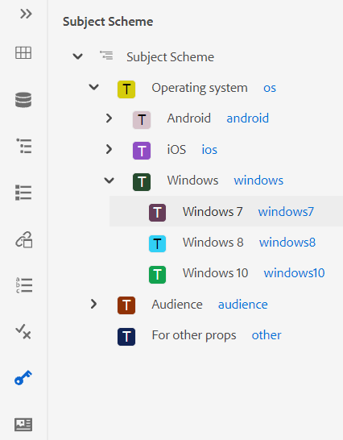
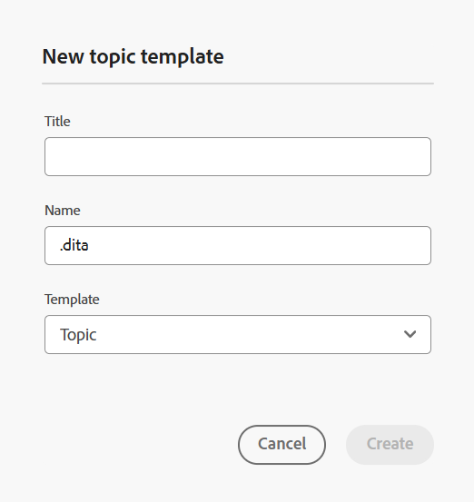
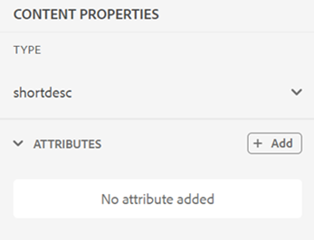

# 웹 편집기 기능 이해 {#id176NC500V5Z}

이 섹션에서는 웹 편집기에서 사용할 수 있는 다양한 기능에 대해 설명합니다. 웹 편집기는 다음 섹션이나 영역으로 나눌 수 있습니다.

- [기본 도구 모음](#id2051EA0G05Z)
- [보조 도구 모음](#id2051EA0J0Y4)
- [왼쪽 패널](#id2051EA0M0HS)
- [콘텐츠 편집 영역](#id2051EB000UI)
- [오른쪽 패널](#id2051EB003YK)

다음 하위 섹션은 웹 편집기의 다양한 섹션에 대해 자세히 설명합니다.

## 기본 도구 모음 {#id2051EA0G05Z}

기본 도구 모음은 웹 편집기의 인터페이스 맨 위에 있으며 웹 편집기에서 사용할 수 있는 파일 수준 기능과 다양한 작성 모드를 제공합니다. 상단 도구 모음에서 사용할 수 있는 기능은 다음과 같이 설명되어 있습니다.

**모두 저장** - 

열려 있는 모든 항목에서 변경한 내용을 저장합니다. 웹 편집기에 여러 개의 항목이 열려 있는 경우 **모두 저장** 또는 **Crtl**+**S** 바로 가기 키는 한 번의 클릭으로 모든 문서를 저장합니다. 각 문서를 개별적으로 저장할 필요는 없습니다.

>[!NOTE]
>
> 저장 작업에서는 새 버전의 주제가 만들어지지 않습니다. 새 버전을 생성하려면 새 버전으로 저장을 선택합니다.

**새 버전으로 저장** - 

주제의 변경 사항을 저장하고 주제의 새 버전도 만듭니다. 새로 만든 주제에 대해 작업하는 경우 버전 정보는 다음과 같이 표시됩니다. **없음**.

{width="800" align="left"}

버전 번호는 주제 또는 맵 파일에 대해 생성되는 모든 새 버전에 따라 변경됩니다.

다음을 사용하여 주제 또는 맵을 저장하도록 선택하는 경우 **새 버전으로 저장**, 다음과 같은 대화 상자가 나타납니다.

{width="300" align="left"}

변경 사항을 식별하기 위한 주석과 버전 레이블을 입력하고 를 클릭합니다 **저장** 를 클릭하여 파일의 새 버전을 만듭니다.

다음을 선택할 때 *새 버전으로 저장*: 주제의 첫 번째 버전이 DAM에 만들어지고 이 버전도 주제의 현재 활성 버전이 됩니다. 나중에 주제의 이전 버전으로 되돌릴 경우 해당 버전이 주제의 현재 활성 버전이 됩니다.

관리자가 버전 레이블을 미리 구성한 경우 드롭다운 목록에 해당 레이블이 표시됩니다. 사용 가능한 레이블 목록에서 레이블을 선택하고 문서를 저장할 수 있습니다.

{width="300" align="left"}

주제를 저장할 때 주제의 변경 사항을 지정하는 주석을 추가할 수 있습니다. 이 설명은 주제의 버전 기록에 표시됩니다.

주제가 검토 중인 경우 검토자는 새로운 버전의 주제를 사용할 수 있다는 알림을 받게 됩니다. 문서의 최신 수정 버전에 쉽게 액세스하고 주제의 최신 버전을 계속 검토할 수 있습니다.

항목 제목 위에 포인터를 놓으면 파일 경로와 버전 번호가 표시됩니다.

{width="800" align="left"}

>[!NOTE]
>
> 항목의 버전을 사용할 수 있게 되면 항목에 레이블을 추가할 수도 있습니다. 그런 다음 이러한 레이블을 사용하여 문서의 특정 버전을 게시하기 위한 기준선을 만들 수 있습니다. 주제에서 레이블을 사용하는 방법에 대한 자세한 내용은 [레이블 사용](web-editor-use-label.md#).

**실행 취소 및 다시 실행** -  / 

마지막 작업을 실행 취소하거나 다시 실행합니다.

**요소 삭제** - 

현재 선택한 요소나 커서가 있는 요소를 삭제합니다.

**찾기 및 바꾸기** - 

찾기 및 바꾸기 기능은 작성자 및 소스 보기 모드에서 사용할 수 있습니다. 항목 편집 영역 하단에 찾기 및 바꾸기 텍스트 막대가 나타납니다. 바로 가기 키를 사용할 수 있습니다 **CTRL**+**F** 찾기 및 바꾸기 막대를 호출합니다.

{width="800" align="left"}

설정 아이콘 \(\), **대소문자 무시** 및 **단어 단위만** 검색 옵션을 참조하십시오. 대소문자를 구분하지 않는 검색을 수행하려면 다음을 설정하십시오. **대소문자 무시** 옵션을 선택합니다. 또는 대/소문자를 구분하는 검색을 수행하려면 를 끄거나 선택 해제합니다\. **대소문자 무시** 옵션을 선택합니다. 전체 단어를 검색하도록 선택할 수도 있습니다.

검색은 즉시 수행됩니다. 즉, 검색 구문이나 단어를 **찾기** 필드에서 용어가 즉시 검색되고 항목에서 선택됩니다. 마찬가지로 주제의 텍스트를 바꾸려면 각 필드에 검색어와 해당 바꾸기를 입력하고 **바꾸기** 또는 **모두 바꾸기** 단추를 클릭합니다.

소스 뷰에서 찾기 및 바꾸기는 특정 요소나 속성을 검색하는 데 매우 유용합니다. 예를 들어 의 값을 `@product` 속성을 사용하면 소스 보기에서 쉽게 수행할 수 있습니다. 작성자 보기에서는 속성 또는 요소를 기준으로 검색할 수 없습니다. 그러나 를 사용하는 동안에는 주의해야 합니다. **모두 바꾸기** XML 코드를 덮어쓸 수 있는 기능입니다.

**편집기 설정** - 

편집기 설정은 관리자 사용자만 사용할 수 있습니다. 관리자는 기본 설정을 사용하여 다음 설정을 구성할 수 있습니다.

>[!NOTE]
>
> 기본 설정을 업데이트하는 경우 변경 사항을 적용하려면 문서를 다시 열어야 합니다.

- **일반**: 일반 설정을 사용하면 웹 편집기에서 사용할 사전을 구성할 수 있습니다. 이 탭에는 다음 세 개의 섹션이 포함되어 있습니다. **맞춤법 검사**, **조건**, 및 **작성**.

  {width="650" align="left"}

   - **맞춤법 검사**: 다음 두 가지 옵션이 있습니다. **AEM 맞춤법 검사** 및 **브라우저 맞춤법 검사**. 기본적으로 편집기는 브라우저의 빌드 내 사전을 사용하여 맞춤법 검사가 수행되는 브라우저 맞춤법 검사 기능을 사용합니다. AEM 맞춤법 검사로 전환하여 AEM 사전을 사용할 수 있습니다. 사용자 지정 단어 목록을 추가하도록 사용자 지정할 수도 있습니다. AEM 사전 사용자 지정에 대한 자세한 내용은 *AEM 기본 사전 사용자 지정* [Adobe Experience Manager Guides as a Cloud Service 설치 및 구성] 섹션에 설명되어 있습니다.


   - **조건**

      - **작성자 보기에서 조건부 텍스트 강조 표시**: 작성자 보기에서 조건부 텍스트를 강조 표시하려면 이 옵션을 선택합니다. 조건부 콘텐츠는 조건에 대해 정의된 색상을 사용하여 강조 표시됩니다.

      - **조건 속성을 사용하여 유효성 검사**: 속성에 대해 정의된 값의 유효성 검사를 허용하려면 이 옵션을 선택합니다. 이렇게 하면 잘못된 값을 추가할 수 없습니다.

      - **제목 구성표 패널에 제목이 있는 키 표시**: 제목 구성표의 제목과 함께 키를 표시하려면 이 항목을 선택합니다. 이 옵션을 선택하지 않으면 제목만 표시됩니다. 예를 들어 여기에 &#39;os&#39;, &#39;audience&#39; 및 &#39;other&#39; 키도 제목과 함께 표시됩니다.

        {width="550" align="left"}

      - **조건 패널에 주제 스키마 표시**: 조건 패널에서 주제 스키마를 보려면 이 항목을 선택합니다. 이 옵션을 선택 취소하면 정의된 조건이 [조건] 패널에 표시됩니다.

   - **작성**

      - **모두 바꾸기 활성화**: 찾기 및 바꾸기 패널에서 모두 바꾸기 아이콘을 보려면 이 옵션을 선택합니다.


   - **인용**
인용 유형을 변경합니다. 프로젝트에서 사용할 드롭다운에서 인용 스타일을 선택합니다. 자세한 내용은 다음을 참조하십시오. [인용 스타일 변경](./web-editor-apply-citations.md#change-citation-style).


**패널**: 이 설정은 편집기의 왼쪽 패널에 표시되는 패널을 제어합니다. 원하는 패널을 표시하거나 숨기도록 스위치를 전환할 수 있습니다.

{width="650" align="left"}

>[!NOTE]
>
> 사용자 지정 패널이 구성된 경우 패널 목록에도 표시됩니다. 스위치를 전환하여 사용자 지정 패널을 표시하거나 숨길 수 있습니다. 구성에 대한 자세한 내용은 *왼쪽 패널에서 사용자 정의 패널 구성* [Adobe Experience Manager Guides as a Cloud Service 설치 및 구성] 섹션에 설명되어 있습니다.

- **요소 목록**: 관리자는 작성자가 를 사용하여 삽입할 수 있는 요소 목록을 제어할 수 있습니다. [요소 삽입](#id204SG30105Z) 요소에 대한 표시 이름도 정의합니다. 요소 목록 설정을 사용하면 DITA 사양에 따라 요소의 이름과 DITA 정의 요소 이름 대신 사용할 레이블을 지정할 수 있습니다.

  {width="650" align="left"}

위의 스크린샷에서 `b` 요소에 굵게 레이블이 지정됨, `codeblock` 일부 다른 요소와 함께 코드 블록 레이블이 지정됩니다. 을(를) 선택하는 경우 **위의 요소만 사용** 옵션을 선택하면 이 목록의 유효한 요소 \(현재 삽입 지점\)만 [요소 삽입] 팝업에 표시됩니다.

다음 스크린샷에서는 이전 스크린샷에서 구성된 4개 요소 중 3개만 현재 컨텍스트에 표시됩니다.

{width="300" align="left"}

- **속성 목록**: 요소 목록과 유사하게 속성 목록 및 해당 표시 이름이 요소의 속성 목록에 표시되도록 제어할 수 있습니다. 다음 스크린샷에서는 3개의 속성만 요소의 속성 목록에 표시되도록 구성되었습니다.

  {width="650" align="left"}

  이 설정을 사용하면 요소에 특성을 추가하려고 할 때 목록에 구성된 특성 목록만 표시됩니다.

  {width="300" align="left"}

- **프로필 게시**: 여기에는 를 게시하는 데 사용할 수 있는 게시 프로필이 포함되어 있습니다. **기술 자료** 출력. 대상 기술 자료에 대한 새 프로필을 만들 수 있습니다. 예: Salesforce 또는 ServiceNow.

   - **Salesforce 게시 프로필 만들기**

     **전제 조건**

      - Salesforce용 연결된 앱을 만듭니다. 자세한 내용은 다음을 참조하십시오. [API 통합에 대한 OAuth 설정 활성화](https://help.salesforce.com/s/articleView?id=sf.connected_app_create_api_integration.htm&amp;type=5).

      - 연결된 앱을 구성하는 동안 다음을 확인하십시오.

         - 콜백을 지정합니다.

           `URL: http://<server name>:<port>/bin/dxml/thirdparty/callback/salesforce`

         - 다음 OAuth 범위를 선택하십시오.
            - 전체 액세스(전체)
            - API(Manage user data via API)를 선택합니다

  앱이 구성되면 Salesforce는 **소비자 키** 및 **소비자 암호**.

  Salesforce 게시 프로필을 만드는 데 사용할 수 있습니다.


   - Salesforce 게시 프로필을 만들려면 **Salesforce** 기술 자료 **서버 유형** 드롭다운입니다. 프로필 이름을 입력합니다. 다음에서 **사이트 URL**&#x200B;를 클릭하고 출력을 게시하는 데 사용할 소비자 사이트를 입력한 다음 을(를) 추가합니다. **소비자 키** 및 **소비자 암호** salesforce 소비자 사이트에서 제공합니다. 그런 다음, **유효성 검사** 및 **저장** 새로 만든 프로필입니다.
     {width="550" align="left"}

     >[!NOTE]
     >
     >Experience Manager 안내서에서 Salesforce용 프록시를 구성하려면 AEM에서 Apache HTTP 구성 요소 프록시 구성을 사용하십시오. 방법 알아보기 [AEM 링크 검사기에 대한 프록시 구성](https://helpx.adobe.com/experience-manager/kb/How-to-configure-proxy-for-the-AEM-Link-Checker-AEM.html).


   - **ServiceNow 게시 프로필 만들기**

     **전제 조건**

     자산을 업로드하도록 ServiceNow 서버를 구성합니다.
      - 에 연결 **ServiceNow** 서버입니다.
      - 다음으로 이동 **시스템 속성** > **보안**.
      - 다음 옵션을 선택 취소합니다.

        **업로드를 위해 MIME 유형 검사를 활성화하려면 이 속성을 설정해야 합니다(모든 버전 유레카 이상). 첨부 파일에 대한 MIME 유형 유효성 검사를 활성화(true)하거나 비활성화(false)합니다. glide.attachment.extensions를 통해 구성된 파일 확장자는 업로드하는 동안 MIME 유형을 확인합니다.**

      - **저장**&#x200B;을 클릭합니다.

     앱을 구성했으면 다음을 만듭니다. **ServiceNow** 프로필 게시.
   - 게시 프로필을 만들려면 다음에서 ServiceNow 기술 자료를 선택합니다. **서버 유형** 드롭다운입니다. 프로필 입력 **이름**. 다음에서 **ServiceNow URL**&#x200B;를 클릭하고 출력을 게시하는 데 사용할 소비자 사이트를 입력한 다음 을(를) 추가합니다. **사용자 이름** 및 **암호** serviceNow 소비자 사이트에서 제공합니다. 그런 다음, **유효성 검사** 및 **저장** 새로 만든 프로필입니다.

     {width="550" align="left"}

  유효성을 검사한 후 DITA 맵의 출력 사전 설정에서 게시 프로필을 선택하고 이를 사용하여  **Salesforce** 또는 **ServiceNow** 선택한 서버입니다.

  에 대해 자세히 알아보기 [기술 자료](../user-guide/generate-output-knowledge-base.md) 출력 사전 설정.


- **유효성 검사**: 이 탭에는 웹 편집기에서 Schematron 유효성 검사를 구성하는 옵션이 포함되어 있습니다. 다음 기능을 활성화할 수 있습니다.

   - **파일을 저장하기 전에 유효성 검사 실행**: 저장 작업 전에 선택한 Schematron 파일을 사용하여 Schematron 유효성 검사를 실행하려면 이 옵션을 선택합니다. + 아이콘을 클릭하여 Schematron 파일을 추가할 수 있습니다. 선택한 Schematron 파일이 나열됩니다.

     >[!NOTE]
     >선택한 Schematron 파일이 선택한 폴더 프로필에 대해 유지됩니다.

     {width="550" align="left"}
이렇게 하면 사용자가 선택한 Schematron 파일에 정의된 규칙을 벗어나는 파일을 저장할 수 없습니다. 이 옵션을 선택하지 않으면 변경 내용을 저장하기 전에 파일의 유효성을 검사하지 않습니다.

   - **모든 사용자가 유효성 검사 패널에서 schematron 파일을 추가하도록 허용**: 사용자가 웹 편집기의 유효성 검사 패널에서 Schematron 파일을 추가할 수 있도록 하려면 이 옵션을 선택합니다. 이를 통해 사용자는 Schematron 파일을 추가한 다음 Schematron 파일에 대해 항목을 확인할 수 있습니다. 이 옵션을 선택하지 않으면 **Schematron 파일 추가** 의 사용자는 버튼을 사용할 수 없습니다. **유효성 검사 패널** 웹 편집기의


- **속성 표시**: 속성 목록과 마찬가지로 요소의 속성 목록에 표시할 속성 목록을 제어할 수 있습니다. 기본적으로 4개 **속성 표시** — 대상자, 플랫폼, 제품 및 prop이 요소의 속성 목록에 표시되도록 구성되었습니다. 를 사용하여 표시 속성을 추가할 수도 있습니다. **추가** 맨 위에 있는 아이콘. 를 사용하여 표시 속성을 삭제할 수도 있습니다. **삭제** 아이콘.

  요소에 대해 정의된 속성이 레이아웃 및 아웃라인 뷰에 표시됩니다.

  {width="550" align="left"}

- **번역**: 이 탭에는 언어 그룹을 만들고, 소스 레이블을 타겟 버전에 전파하고, 번역 프로젝트를 정리하는 옵션이 포함되어 있습니다.
  {width="550" align="left"}

   - **언어 그룹**: 관리자는 언어 그룹을 만들고 세트로 사용하여 콘텐츠를 번역할 수 있습니다.\
     새 언어 그룹을 만들려면 다음 단계를 수행하십시오.
      1. 추가 선택  아이콘.
      1. 언어 그룹 이름을 입력합니다. 각 언어에는 고유한 이름이 있어야 합니다. 이름 필드가 비어 있거나 이름이 고유하지 않은 경우 오류를 볼 수 있습니다.
      1. 드롭다운에서 언어를 선택합니다. 여러 언어를 선택할 수 있습니다.

     원하는 언어를 필터링하려면 언어의 처음 몇 글자 또는 언어 코드를 입력합니다. 예를 들어 &#39;en&#39;을 입력하면 &#39;en&#39;이 포함된 모든 언어를 이름이나 코드의 시작 부분에 필터링합니다.
      1. 선택 **완료** 을 눌러 선택한 언어를 그룹에 추가합니다. 언어가 표시됩니다. 3개 이상의 언어를 추가할 때 **더 보기** 표시됩니다. 다음을 선택할 수 있습니다. **더 보기** 그룹에 있는 모든 언어를 봅니다.
         >[!TIP]
         >
         > 전환 **더 보기** 끝 **간단히 표시** 몇 가지 언어만 볼 수 있습니다.

      1. 편집할 그룹의 언어 위로 마우스 오버  또는 삭제  언어 그룹.
      1. 저장 **편집기 설정**.

         >[!NOTE]
         >
         >사용자는 폴더 프로필에 구성된 언어 그룹을 볼 수 있습니다.

   - **소스 버전 레이블을 대상 버전에 전파**: 소스 파일 버전의 레이블을 번역된 파일에 전달하려면 이 옵션을 선택합니다. 기본적으로 비활성화되어 있습니다.
   - **완료 후 번역 프로젝트 정리**: 번역 프로젝트를 번역 후 자동으로 비활성화하거나 삭제하도록 구성하려면 이 옵션을 선택합니다. 기본적으로, **없음** 이(가) 선택되었으므로 프로젝트가 번역 후에 존재합니다.

     나중에 사용하려면 번역 프로젝트를 비활성화할 수 있습니다. 프로젝트를 삭제하면 프로젝트에 있는 모든 파일과 폴더가 영구적으로 삭제됩니다.


- **메타데이터**: 주제의 버전 메타데이터와 해당 값을 **버전 기록** 대화 상자.  메타데이터 경로에서 메타데이터를 선택할 노드의 위치를 지정합니다. 메타데이터의 사용자 지정 이름을 레이블로 정의할 수도 있습니다. 기본 등록 정보는 제목, 문서 상태 및 태그입니다.

  메타데이터는 아래의 모든 속성에서 선택할 수 있습니다 `/jcr:content` 속성의 경로를 메타데이터 경로로 추가할 수 있도록 에셋의 노드입니다.


  메타데이터 경로가 비어 있으면 오류가 표시됩니다. 레이블을 비워 두면 마지막 요소가 레이블로 선택됩니다.


  {width="550" align="left"}

  *다음에 대한 메타데이터 구성&#x200B;**버전 기록**대화 상자.*


  이러한 메타데이터 태그가 표시되는 순서를 정의할 수도 있습니다. 이러한 태그의 기본 순서를 변경하려면 점선 막대를 선택하여 원하는 위치에 태그를 드래그하여 놓습니다.
메타데이터 레이블은 **버전 기록** 웹 편집기의


**사용자 환경 설정** - 

사용자 환경 설정은 모든 작성자가 사용할 수 있습니다. 작성자는 환경 설정을 사용하여 다음 설정을 구성할 수 있습니다.


- **일반**: 일반 탭에서는 다음 설정을 구성할 수 있습니다.

  {width="550" align="left"}

   - **폴더 프로필**: 폴더 프로필은 조건부 속성, 작성 템플릿, 출력 사전 설정 및 웹 편집기 구성과 관련된 다양한 구성을 제어합니다. 기본적으로 글로벌 프로필이 표시됩니다. 또한 관리자가 시스템에서 폴더 프로필을 구성한 경우 해당 폴더 프로필이 폴더 프로필 목록에도 표시됩니다.

     관리자가 폴더 프로필에서 정의할 수 있는 웹 편집기의 구성에는 도구 모음 아이콘, 웹 편집기의 레이아웃, 코드 조각 및 루트 맵을 포함하여 사용자 인터페이스 사용자 지정이 포함됩니다. 자세한 내용은 *전역 또는 폴더 수준 프로필 구성* 에서 Adobe Experience Manager Guides as a Cloud Service 설치 및 구성 을 참조하십시오.

     >[!NOTE]
     >
     > 현재 폴더 프로필의 이름이 기본 도구 모음에 사용자 기본 설정 아이콘의 레이블로 표시됩니다.

   - **기본 경로**: 기본적으로 웹 편집기에서 AEM 저장소에 액세스하면 /content/dam 위치에서 자산이 표시됩니다. 작업 폴더는 /content/dam/ 폴더 내에 있는 몇 개의 폴더일 수 있습니다. 매번 작업 폴더에 도달하려면 몇 번의 클릭이 필요합니다. 기본 경로를 작업 폴더로 설정하고 저장소 보기에 해당 위치의 콘텐츠가 맨 앞에 표시됩니다. 이렇게 하면 작업 폴더에 액세스하는 시간이 줄어듭니다. 또한 항목에 참조 또는 미디어 파일을 삽입하면 파일 찾아보기 위치는 기본 경로에 설정된 폴더로 시작됩니다.

   - **루트 맵 선택**: DITA 맵 파일을 선택하여 주요 참조 또는 용어집 항목을 확인합니다. 선택한 루트 맵이 키 참조를 확인하는 데 가장 높은 우선 순위를 갖습니다. 자세한 내용은 [키 참조 확인](map-editor-other-features.md#id176GD01H05Z).

     >[!NOTE]
     >    
     > 루트 맵을 사용하지 않으려면 **루트 맵 선택** 필드가 비어 있습니다.

- **모양**: 웹 편집기 애플리케이션의 테마와 콘텐츠 편집 영역의 소스 보기를 선택합니다.

  {width="550" align="left"}

   - **파일 보기 기준**: 웹 편집기에서 파일을 보는 기본 방법을 선택합니다. 의 여러 패널에서 제목 또는 파일 이름별로 파일 목록을 볼 수 있습니다. **작성자** 보기.
     >[!NOTE]
     >
     > 기본적으로 파일은 웹 편집기에서 제목으로 표시됩니다.

   - **애플리케이션 테마**: 다음 중에서 선택할 수 있습니다. **밝게** 또는 **어둡게** 애플리케이션에 대한 테마입니다. 의 경우 **밝게** 테마, 도구 모음 및 패널은 밝은 회색 배경색을 사용합니다. 의 경우 **어둡게** 테마, 도구 모음 및 패널은 검정색 배경을 사용합니다. 선택 **장치 테마 사용** Experience Manager 안내서에서 장치의 테마를 기준으로 밝은 테마와 어두운 테마를 선택할 수 있도록 합니다.  모든 테마에서 컨텐츠 편집 영역은 **작성자** 보기.

   - **소스 보기 테마**: - 다음 중에서 선택할 수 있습니다. **밝게** 또는 **어둡게** 소스 보기의 콘텐츠 편집 영역에 대한 테마입니다. 의 경우 **밝게** 테마의 경우 콘텐츠 편집 영역은 소스 보기에 밝은 회색 색상 배경을 사용합니다. **어둡게** 테마에서는 검정색 배경을 사용합니다. 선택 **장치 테마 사용** Experience Manager 안내서에서 장치의 테마를 기준으로 밝은 테마와 어두운 테마를 선택할 수 있도록 합니다.

   - **저장소에서 항상 파일 찾기**: 웹 편집기에서 파일을 편집하는 동안 저장소의 파일 위치를 표시하려면 이 옵션을 선택합니다.

   - **작성자 모드에서 줄바꿈하지 않는 공백 표시기 표시**: 웹 편집기에서 편집하는 동안 줄바꿈하지 않는 공백에 대한 표시기를 표시하려면 이 옵션을 선택합니다. 기본적으로 활성화되어 있습니다.

**작성자, 소스 및 미리보기 모드**

다양한 작성 및 문서 보기 모드에 대한 자세한 내용은 [웹 편집기 보기](web-editor-views.md#).

## 보조 도구 모음 {#id2051EA0J0Y4}

보조 도구 모음은 웹 편집기에서 편집할 항목을 열 때 나타납니다. 보조 도구 모음에서 사용할 수 있는 기능은 다음과 같이 설명되어 있습니다.

**요소 삽입** - 

현재 또는 다음 유효한 위치에 유효한 요소를 삽입합니다. 키보드 단축키를 사용할 수도 있습니다 ***대체***+***입력*** 요소 삽입 팝업을 엽니다. 예를 들어 단락을 편집한 다음 **요소 삽입** 팝업에 단락에 삽입할 수 있는 요소 목록이 나타납니다. 삽입할 요소를 선택합니다. 키보드를 사용하여 요소 목록을 스크롤하고 를 누를 수 있습니다 ***입력*** 필요한 요소를 삽입합니다.

다음 두 가지 유형의 유효한 요소를 볼 수 있습니다.

- **현재 위치의 유효한 요소**: 현재 커서 위치 자체에 삽입할 수 있는 요소가 목록에 표시됩니다.

- **현재 위치 외부의 유효한 요소**: 요소 계층 내에서 현재 요소의 상위 항목 뒤에 삽입할 수 있는 요소가 목록에 표시됩니다.


예를 들어, 인라인 내에 있는 경우 `<b>` 요소, 다음과 같은 요소를 삽입할 수 있습니다. `<u>`, `<xref>`, `<i>` 현재 위치에 있습니다. 이와 반대로 다음과 같은 요소를 삽입할 수 있습니다 `<table>` 및 `<topic>` 현재 위치 밖에 있습니다.

검색 상자에 문자나 문자열을 입력하고 문자열로 시작되는 요소를 검색할 수도 있습니다.


{width="300" align="left"}

*&#39;t&#39;로 시작하는 유효한 모든 요소를 검색하려면 &#39;t&#39;를 입력하십시오.*

와 같은 블록 요소 내에서 작업하는 경우 `note`를 클릭한 다음 요소 삽입 아이콘을 사용하여 뒤에 새 요소를 삽입합니다. `note` 요소를 생성하지 않습니다. 다음 스크린샷에서는 참고 요소가 p \(paragraph\) 요소 내부에 삽입되었습니다.

{width="800" align="left"}

메모 요소에서 Enter 키를 누르면 메모 요소 자체에 새 단락이 만들어집니다. 메모 외부에 새 요소를 삽입하려면 요소 경로에서 p 요소 \(스크린샷으로 강조 표시\)를 클릭하고 요소 삽입 아이콘을 클릭하거나 &lt;스페이스바>를 누릅니다 ***대체***+***입력*** 요소 삽입 팝업을 엽니다. 그런 다음 원하는 요소를 선택하고 Enter 키를 눌러 메모 요소 뒤에 선택한 요소를 삽입합니다.

깜박이는 블록 커서가 나타날 때 두 요소 사이에 요소를 추가할 수도 있습니다.

{width="300" align="left"}

예를 들어, DITA 주제에서 작업 중일 때 짧은 설명과 본문 사이에 블록 커서가 깜박이면 다음을 추가할 수 있습니다 `prolog` 요소를 입력한 다음 저작권, 작성자 및 기타 세부 정보를 추가합니다.

새 요소를 입력하는 또 다른 방법은 문맥 메뉴를 사용하는 것입니다. 문서의 아무 곳이나 마우스 오른쪽 버튼으로 클릭하여 컨텍스트 메뉴를 호출합니다. 이 메뉴에서 다음을 선택합니다. **요소 삽입** 을(를) 표시하려면 **요소 삽입** 대화 상자를 클릭하고 삽입할 요소를 선택합니다.

{width="300" align="left"}

**단락 삽입** - 

현재 또는 다음 유효한 위치에 단락 요소를 삽입합니다.

**번호 매기기 목록 삽입/제거** - 

현재 또는 다음 유효한 위치에 번호 매기기 목록을 만듭니다. 번호 매기기 목록에 있는 경우 이 아이콘을 클릭하면 항목이 일반 단락으로 변환됩니다.

**글머리 기호 목록 삽입/제거** - 

현재 또는 다음 유효한 위치에 글머리 기호 목록을 만듭니다. 글머리 기호 목록에 있는 경우 이 아이콘을 클릭하면 항목이 일반 단락으로 변환됩니다.

>[!NOTE]
>
>다음을 선택할 수도 있습니다. **목록 분할** 현재 목록을 분할하고 동일한 수준에서 새 목록을 시작하는 목록 항목의 상황에 맞는 메뉴 옵션입니다.

**표 삽입** - 

현재 또는 다음 유효한 위치에 표를 삽입합니다. 표 삽입 아이콘을 클릭하여 표 삽입 대화 상자를 엽니다.

{width="550" align="left"}

테이블에 필요한 행 및 열의 수를 지정할 수 있습니다. 첫 번째 행을 테이블 머리글로 유지하려면 첫 번째 행을 머리글로 설정 옵션을 선택합니다. 테이블에 제목을 추가하려면 제목 필드에 제목을 입력합니다.

테이블이 삽입되면 컨텍스트 메뉴를 사용하여 테이블을 수정할 수 있습니다.

{width="550" align="left"}

테이블의 컨텍스트 메뉴를 사용하여 다음과 같은 작업을 수행할 수 있습니다.

- 셀, 행 또는 열 삽입

- 오른쪽 및 아래쪽 방향으로 셀 병합

- 수평 또는 수직으로 셀 분할

- 셀, 행 또는 열 삭제

- 테이블에서 코드 조각 만들기

- ID 생성


테이블의 여러 셀, 전체 행 또는 열에 속성을 정의할 수도 있습니다. 예를 들어 표 셀을 정렬하려면 필요한 셀을 끌어서 선택합니다. 컨텐츠 속성 패널(오른쪽)에서 **유형** 변경 사항 **다중 항목**.

1. 다음에서 **속성** 섹션, 클릭 **+추가**.
1. 다음 항목 선택 `@valign` 속성 위치: **속성** 드롭다운 목록입니다.
1. 값 드롭다운 목록에서 선택한 테이블 셀에 적용할 원하는 텍스트 정렬을 선택합니다.
1. 클릭 **추가.**

{width="800" align="left"}

**이미지 삽입** - 

현재 또는 다음 유효한 위치에 이미지를 삽입합니다. [이미지 삽입] 아이콘을 클릭하여 [이미지 삽입] 대화 상자를 연 다음 삽입할 이미지를 검색하여 선택합니다.

>[!NOTE]
>
> 이미지를 로컬 시스템에서 문서에 끌어다 놓아 추가할 수도 있습니다. 이 경우 이미지 파일은 **자산 업로드** 워크플로입니다.  자세한 내용은 **자산 업로드** 의 워크플로 [왼쪽 패널](web-editor-features.md#id2051EA0M0HS) 섹션.


{width="650" align="left"}

이미지 삽입 대화 상자에서 이미지에 대한 이미지/그림 제목 및 그림 설명 텍스트를 추가할 수 있습니다.

맨 위에 있는 검색할 유형 막대에 파일 이름을 입력하여 필요한 이미지 파일을 검색할 수 있으며, 또한 경로 \(검색할 경로\), 컬렉션, 파일 유형 및 태그로 검색 결과를 필터링할 수도 있습니다. 필요한 이미지 파일을 찾으면 해당 파일을 선택하고 선택 을 클릭하여 문서에 이미지를 삽입합니다. 다음과 같은 다양한 형식의 이미지 파일을 삽입할 수 있습니다 `.png`, `.svg`, `.gif`, `.jpg`, `.eps`, `.ai`, `.psd`등.

이미지를 삽입하면 [컨텐츠 속성] 패널에서 높이, 너비, 배치 및 속성을 변경할 수 있습니다. 이미지 파일을 클릭한 다음 오른쪽 레일의 콘텐츠 속성 패널에서 변경 작업을 수행합니다.

{width="800" align="left"}

소스 필드는 삽입된 이미지 파일의 UUID를 표시합니다. 마우스 포인터를 소스 필드 위로 가져가면 삽입된 이미지 파일의 전체 경로를 찾을 수 있습니다. 경로는 도구 설명에 표시됩니다.

이미지 파일에 [높이] 또는 [폭] 값을 제공하여 이미지 크기를 조정할 수 있습니다. 이미지의 종횡비는 자동으로 유지됩니다. 원할 경우 [종횡비 유지]의 잠금 아이콘 \(\)을 클릭하고 [높이] 및 [폭] 값을 제공하여 이미지 파일의 종횡비를 유지하지 않도록 선택할 수도 있습니다.

이미지에 대한 [배치] 설정을 [인라인] 또는 [나누기]로 지정할 수도 있습니다. 브레이크 배치 옵션을 사용하도록 선택한 경우 이미지를 정렬할 위치(왼쪽, 가운데 또는 오른쪽)를 선택할 수 있습니다.

에서 필요한 속성을 선택하여 이미지 파일에 대한 다른 속성을 추가할 수도 있습니다. **속성** 필드.

>[!NOTE]
>
>이미지에서 클릭 가능한 영역 \(image map\)을 정의할 수도 있습니다. 자세한 내용은 **이미지 맵 삽입/편집** 의 기능 설명 [왼쪽 패널](web-editor-features.md#id2051EA0M0HS) 섹션.

**이미지 또는 미디어 파일에 대한 상황에 맞는 메뉴**

상황에 맞는 메뉴를 사용하여 이미지 및 미디어 파일에 대한 몇 가지 일반적인 작업을 수행할 수도 있습니다. 이미지의 아무 곳이나 마우스 오른쪽 버튼으로 클릭하여 컨텍스트 메뉴를 호출합니다.

컨텍스트 메뉴에서는 이미지 또는 미디어를 잘라내거나 복사하거나 붙여넣을 수 있는 옵션을 제공합니다. 선택한 요소 앞 또는 뒤에 요소를 삽입할 수 있습니다. 요소의 이름을 바꾸거나 요소의 래핑을 취소할 수 있는 옵션도 있습니다. 저장소에서 선택한 이미지 또는 미디어를 찾거나 에셋 UI에서 파일 미리보기를 볼 수 있습니다.

컨텍스트 메뉴의 다른 옵션을 사용하면 경로를 복사하거나, 이미지 맵을 편집하거나, 코드 조각을 만들거나, 선택한 요소에 대한 ID를 생성할 수 있습니다.

**멀티미디어 삽입** - 

다양한 유형의 멀티미디어 파일을 삽입합니다. [멀티미디어 삽입] 아이콘을 클릭하고 삽입할 파일 유형을 선택합니다. 지원되는 멀티미디어 형식은 다음과 같습니다.

- 오디오 파일
- 비디오 파일
- YouTube
- Vimeo

오디오 또는 비디오 파일 옵션을 선택하면 원하는 파일을 찾아 선택할 수 있는 저장소 보기가 표시됩니다. YouTube 또는 Vimeo를 선택하면 멀티미디어 삽입 대화 상자가 표시됩니다. 웹 링크 필드에 비디오 파일의 링크를 붙여넣고 삽입 을 클릭하여 문서의 현재 또는 다음 유효한 위치에 비디오를 추가합니다.

>[!NOTE]
>
> YouTube 비디오 링크를 추가하는 동안 문자열을 바꾸어야 합니다 `watch?v=` 포함 `embed` 를 입력합니다. 예를 들어 YouTube 비디오 링크를 추가하려면: `https://www.youtube.com/**watch?v**=WlIKQOrmZcs`, 다음과 같이 추가해야 합니다. `https://www.youtube.com/**embed/**WlIKQOrmZcs`. 이 변경 사항으로 인해 비디오가 AEM 사이트 및 PDF 출력에 임베드됩니다.

멀티미디어 삽입 대화 상자에서 오디오 또는 비디오 파일을 추가할 수도 있습니다. 오디오/비디오 파일 옵션을 선택하고 찾아보기 아이콘을 클릭하여 저장소 보기를 시작합니다. 저장소에서 오디오 또는 비디오 파일을 선택하고 선택 을 클릭하여 [오디오/비디오 파일] 필드에 파일의 링크를 추가합니다. 비디오 파일을 선택하면 파일의 미리 보기가 [미리 보기] 영역에도 표시됩니다. 비디오 파일을 재생하여 미리 보기를 볼 수 있습니다.

{width="650" align="left"}

**상호 참조 삽입** - 

유형의 참조 삽입 — 컨텐츠 참조, 컨텐츠 키 참조, 키 참조, 파일 참조, 웹 링크 또는 이메일 링크.

다음을 클릭합니다. **파일 선택** 아이콘 \(컨텐츠 참조 및 파일 참조\) 또는 **맵 선택** 아이콘 \(Content Key Reference 및 Key Reference\)을 클릭하고 링크할 파일 또는 컨텐츠를 선택합니다.

{width="650" align="left"}

선택한 참조의 링크가 문서에 추가됩니다. 링크의 컨텍스트 메뉴에서는 다음 옵션을 사용할 수 있습니다.

- **요소 삽입**: 특정 컨텍스트에 삽입할 수 있는 유효한 요소 목록을 표시합니다.
- **UUID 복사**: 삽입된 참조의 UUID를 복사합니다.
- **경로 복사**: 삽입된 참조의 전체 경로를 복사합니다.
- **코드 조각 만들기**: 삽입된 참조에서 재사용 가능한 스니펫을 만듭니다.
- **ID 생성**: 삽입된 참조에 대한 고유 ID를 생성합니다.

참조할 파일의 UUID를 사용하여 검색할 수도 있습니다. 컨텐트 및 키 참조 링크의 경우 링크할 파일의 UUID를 입력하면 파일이 자동으로 검색되어 미리보기 섹션에 표시됩니다. 파일의 UUID를 지정할 때 .xml 파일의 파일 확장명을 명시적으로 언급할 필요가 없습니다. .xml 확장명이 UUID에 자동으로 추가됩니다.

{width="650" align="left"}

관리자가 에서 UUID 옵션을 활성화한 경우 *XMLEditorConfig*&#x200B;을 입력하면 참조된 콘텐츠의 UUID가 **링크** 속성.

{width="800" align="left"}

>[!NOTE]
>
> 다음과 같은 경우 **UUID 활성화** 옵션이 활성화되지 않으면 참조된 콘텐츠의 상대 경로가 표시됩니다.

>[!IMPORTANT]
>
> 참조된 콘텐츠의 상대 경로가 **링크** 내부적으로 링크는 참조된 콘텐츠의 UUID를 사용하여 생성됩니다.

>[!TIP]
>
> 콘텐츠 참조에 대한 우수 사례를 알려면 우수 사례 안내서의 참조 섹션을 참조하십시오.

**검색 필터링**

AEM 저장소의 선택한 경로에 있는 파일에서 일부 텍스트를 검색할 수 있습니다. 예를 들어 아래 스크린샷에서는 &#39;general&#39;이 검색됩니다. 향상된 필터를 사용하여 검색 범위를 좁힐 수도 있습니다. 선택한 경로에 있는 DITA 주제 및 DITA 맵과 같은 모든 DITA 파일을 찾을 수 있습니다.

선택한 경로에서 이미지 파일, 멀티미디어 및 문서와 같은 비 DITA 파일을 검색할 수 있습니다. DITA 요소의 속성에서 특정 값을 검색할 수도 있습니다. 지정된 사용자가 체크 아웃한 파일을 찾을 수도 있습니다.

{width="650" align="left"}

>[!NOTE]
>
> 시스템 관리자는 텍스트 필터를 구성하고 다른 필터를 표시하거나 숨길 수도 있습니다. 자세한 내용은 Adobe Experience Manager Guides as a Cloud Service 설치 및 구성 의 텍스트 필터 구성 섹션을 참조하십시오.

검색된 텍스트가 포함된 필터링된 파일 목록이 표시됩니다. 예를 들어 위 스크린샷에는 &#39;general&#39;이라는 텍스트가 포함된 파일이 나열됩니다. 파일 내용을 미리 볼 수도 있습니다.

**재사용 가능한 콘텐츠 삽입** - 

프로젝트의 다른 문서 내에 있는 콘텐츠를 재사용합니다. 파일의 내용에 직접 연결하거나 키 참조를 사용하여 내용을 삽입할 수 있습니다. [키 참조 확인](map-editor-other-features.md#id176GD01H05Z). 재사용 가능한 콘텐츠 삽입 아이콘을 클릭하면 콘텐츠 재사용 대화 상자가 표시됩니다.

{width="650" align="left"}

컨텐트 재사용 대화 상자에서 파일 참조에 대한 DITA 파일이나 키 참조가 포함된 DITA 맵 파일을 선택합니다. 선택하면 주제 또는 주요 참조가 대화 상자에 표시됩니다. 삽입하려는 주제의 ID/키를 선택하고 완료 를 클릭하여 주제 내에 콘텐츠를 삽입할 수 있습니다.

콘텐츠 참조를 삽입하려면 파일의 UUID를 입력하면 해당 파일에서 재사용 가능한 콘텐츠가 미리보기 섹션에 나열됩니다.

링크 삽입 설정에 따라 속성 패널 또는 소스 코드 보기에서 삽입된 콘텐츠의 UUID 또는 상대 경로를 볼 수 있습니다. 링크는 항상 참조된 콘텐츠의 UUID를 사용하여 생성됩니다. Adobe Experience Manager Guides as a Cloud Service 설치 및 구성 의 UUID 기반 링크 구성 을 참조하십시오.

>[!NOTE]
>
> 참조된 콘텐츠의 앞 또는 뒤에 콘텐츠를 추가하려면 *대체*+*왼쪽* 화살표 또는 Alt+*오른쪽* 커서를 원하는 위치로 이동하는 화살표 키입니다.

참조된 콘텐츠를 마우스 오른쪽 단추로 클릭하고 를 선택하여 참조된 콘텐츠를 주제 내에 포함할 수도 있습니다 **참조를 콘텐츠로 바꾸기** 컨텍스트 메뉴 아래의 제품에서 사용할 수 있습니다.

**특수 문자 삽입** -  

항목에 특수 문자를 삽입합니다. 특수 문자 삽입 아이콘을 클릭하여 특수 문자 삽입 대화 상자를 엽니다.

>[!NOTE]
>
> AEM Guides에서는 이동 및 크기 변경이 가능한 대화 상자를 제공합니다. 오른쪽 아래 모서리에 두 개의 십자선이 있는 대화 상자의 크기를 조정할 수 있습니다. 특수 문자 대화 상자의 십자선이 아래에 표시됩니다.

{width="550" align="left"}

특수 문자 삽입 대화 상자에서 이름을 사용하여 특수 문자를 검색할 수 있습니다. 모든 특수 문자는 다양한 카테고리에 저장됩니다. 범주 선택 드롭다운 목록을 사용하여 범주를 선택합니다. 선택한 범주 내에서 사용할 수 있는 특수 문자가 표시됩니다. 화살표 키를 사용하여 특수 문자 목록을 탐색하거나 삽입하려는 문자를 클릭할 수 있습니다. 선택한 특수 문자의 이름 및 16진수 코드가 목록 아래에 표시됩니다. [삽입]을 클릭하여 선택한 문자를 문서에 삽입합니다.

**키워드 삽입** - 

DITA 맵에 정의된 키워드를 삽입합니다. 키워드 삽입 아이콘을 클릭하여 키 참조 대화 상자를 엽니다.

{width="550" align="left"}

키워드는 알파벳 순서로 나열되며 검색 상자에 검색 문자열을 입력하여 키워드를 검색할 수도 있습니다. 검색 결과는 ID 또는 값의 문자열을 포함하는 키워드를 반환합니다. DITA 맵에 정의된 키워드가 이 대화 상자에 나열됩니다. 삽입할 키워드를 선택하고 **삽입**.

키워드를 마우스 오른쪽 단추로 클릭하고 속성 옵션을 선택하여 삽입된 키워드의 속성을 변경할 수도 있습니다. [키워드에 대한 속성] 대화 상자가 열립니다.

{width="550" align="left"}

키워드의 속성을 변경하거나 키워드에 새 속성을 추가할 수 있습니다.

**코드 조각 삽입** - 

현재 또는 다음 유효한 위치에 코드 조각을 삽입합니다. 이 기능을 사용하려면 시스템에 스니펫이 정의되어 있어야 합니다. 코드 조각 추가에 대한 자세한 내용은 **코드 조각** 의 기능 설명 [왼쪽 패널](web-editor-features.md#id2051EA0M0HS) 섹션.

코드 조각 삽입 아이콘을 클릭하면 코드 조각 삽입 카탈로그가 표시됩니다. 카탈로그는 컨텍스트에 따라 다르며, 이는 현재 위치에서 허용된 경우에만 코드 조각이 표시됨을 나타냅니다.

다음 예제에서는 문서의 현재 위치에 삽입할 수 있는 두 개의 사전 구성된 코드 조각(경고 및 오류)을 보여 줍니다.

{width="300" align="left"}

목록에서 코드 조각을 선택하면 문서의 현재 또는 다음 유효한 위치에 코드 조각이 삽입됩니다. 다음 스크린샷은 문서에 삽입된 오류 코드 조각을 보여 줍니다.

{width="400" align="left"}

**이미지 맵 삽입/편집** - 

선택한 이미지에 이미지 맵을 삽입합니다. 항목 또는 웹 페이지에 연결되는 클릭 가능한 영역이 있는 이미지를 이미지 맵이라고 합니다.

현재 주제의 이미지를 선택하고 이미지 맵 삽입/편집 아이콘을 클릭하여 이미지 맵 삽입 대화 상자를 엽니다.

{width="650" align="left"}

원하는 도형 선택 사각형 , 원 , 또는 다각형  링크로 사용할 이미지 위의 영역을 정의합니다. 영역을 정의한 후 내부 또는 외부 콘텐츠에 대한 링크를 지정해야 하는 참조 대화 상자가 나타납니다.

{width="650" align="left"}

영역이 겹치는 경우 도구 모음에서 해당 아이콘을 클릭하여 모양을 앞으로 가져오거나 뒤로 보낼 수 있습니다. 영역을 선택하고 삭제 아이콘을 클릭하여 제거할 수도 있습니다. 영역을 두 번 클릭하면 대상 링크를 변경할 수 있는 참조 대화 상자가 열립니다. 이미지의 필수 영역을 표시한 후 완료 를 클릭하여 변경 사항을 저장합니다.

**체크아웃/체크인** - / 

현재 파일을 체크 아웃하거나 체크 인합니다. 파일을 체크 아웃하면 사용자에게 파일에 대한 단독 쓰기 액세스 권한이 부여됩니다. 파일을 체크 인하면 변경 내용이 파일의 현재 버전에 저장됩니다.

맵 보기에서 상위 맵을 확장하는 경우 한 번의 클릭으로 맵의 모든 파일을 체크 아웃할 수 있습니다. 상위 맵 파일을 확장하고 상위 파일을 선택하면 맵 내의 모든 파일이 선택됩니다. 그런 다음 다음을 선택할 수 있습니다. **체크아웃**   를 클릭하여 맵 내의 모든 파일을 잠급니다.

>[!NOTE]
>
> 저장하지 않은 변경 내용이 있는 파일을 체크 인하면 변경 내용을 저장하라는 메시지가 표시됩니다. 변경 내용을 저장하지 않으면 파일만 체크 인됩니다.

체크 인/체크 아웃에 대한 도구 설명은 의 제목 속성에 의해 결정됩니다 `ui_config.json` 파일.

자세한 내용은 [체크인 및 체크아웃 아이콘의 제목 구성](../install-guide/conf-checkin-checkout-title.md) ( 온프레미스 설치 및 구성 안내서)를 참조하십시오.


**태그 보기 전환** - 

태그는 요소의 경계를 나타내는 시각적 큐입니다. 요소 경계는 요소의 시작과 끝을 표시합니다. 그런 다음 이러한 경계를 시각적 단서로 사용하여 삽입점을 배치하거나 경계 내에서 텍스트를 선택할 수 있습니다. 문서의 요소 앞이나 뒤에 다른 요소를 삽입하려면 요소의 열기 또는 닫기 경계 앞이나 뒤에 삽입 포인터를 놓으면 됩니다.

다음 스크린샷은에 태그 보기가 있는 문서를 보여 줍니다.

{width="650" align="left"}

태그 보기가 있는 문서에서 다음 작업을 수행할 수 있습니다.

- **요소 선택**: 요소의 열기 또는 닫기 태그를 클릭하여 해당 콘텐츠를 선택합니다.

- **태그 확장 또는 축소**: 태그를 확장하거나 축소하려면 + 또는 - 기호를 클릭합니다.

- **상황에 맞는 메뉴 사용**: 컨텍스트 메뉴는 선택한 요소를 잘라내거나, 복사하거나, 붙여넣을 수 있는 옵션을 제공합니다. 선택한 요소 앞 또는 뒤에 요소를 삽입할 수도 있습니다. 다른 옵션을 사용하면 ID를 생성하거나 선택한 요소에 대한 속성 패널을 열 수 있습니다.

- **요소 드래그 앤 드롭**: 요소의 태그를 선택하여 문서에 쉽게 드래그 앤 드롭합니다. 드롭 위치가 요소가 허용되는 유효한 위치인 경우 요소는 드롭된 위치에 배치됩니다.


>[!NOTE]
>
> 사용자가 웹 편집기에서 태그 보기를 활성화하면 세션 중에도 활성화된 상태로 유지됩니다. 즉, 나중에 액세스할 수 있도록 태그 보기를 다시 활성화할 필요가 없습니다. 새 사용자 세션에 대한 태그 보기의 기본값은 ui\_config.json 파일의 tagsView 속성에 의해 결정됩니다. 자세한 내용은 *태그 보기에 대한 기본값 구성* 섹션: Adobe Experience Manager Guides as a Cloud Service 설치 및 구성

**변경 내용 추적 활성화/비활성화** 

변경 내용 추적 모드를 활성화하여 문서에 대해 수행된 모든 업데이트를 추적할 수 있습니다. 변경 내용 추적을 활성화하면 모든 삽입 및 삭제 내용이 문서에 캡처됩니다. 삭제된 모든 콘텐츠는 취소선을 사용하여 강조 표시되고 모든 삽입은 녹색 텍스트로 강조 표시됩니다. 또한 항목 페이지의 가장자리에 변경 막대가 표시됩니다. 삭제된 컨텐츠에 대해서는 빨간색 막대가 표시되고 추가된 컨텐츠에 대해서는 녹색 막대가 표시됩니다. 동일한 줄에 추가와 삭제가 있는 경우 녹색 막대와 빨간색 막대가 모두 표시됩니다.

다음 스크린샷에서는 변경 막대와 함께 삭제되고 삽입된 콘텐츠를 강조 표시합니다.

{width="650" align="left"}

문서의 변경 내용을 추적하는 일반적인 사용 사례는 동료 검토를 수행하는 것입니다. 변경 내용 추적을 활성화하고 문서를 공유하여 검토할 수 있습니다. 그러면 검토자가 변경 내용 추적을 켜고 변경합니다. 문서를 받으면 변경 사항을 수락하거나 거부할 수 있는 편리한 방법과 함께 제안된 업데이트를 볼 수 있는 메커니즘이 있어야 합니다.

AEM Guides에서는 문서에서 수행한 업데이트에 대한 정보가 포함된 변경 내용 추적 기능을 제공합니다. 변경 내용 추적 기능은 수행한 업데이트, 수행한 사용자 및 시간에 대한 정보를 제공합니다. 변경 내용 추적 기능을 사용하면 문서에서 제안된 업데이트를 쉽게 수락하거나 거부할 수 있습니다.

이 기능에 액세스하려면 오른쪽 패널에서 [추적된 변경 사항] 아이콘을 클릭합니다.

{width="300" align="left"}

변경 사항을 클릭하면 문서에서 변경된 내용이 선택됩니다. 변경 내용 적용 아이콘을 선택하여 변경 내용을 적용하거나, 변경 내용 거부를 선택하여 변경 내용을 거부할 수 있습니다.

한 번의 클릭으로 모든 변경 내용을 적용하거나 거부하려면 **모두 수락** 또는 **모두 거부**.

>[!NOTE]
>
> 미리보기 모드에서는 변경된 컨텐트의 마크업을 사용하거나 사용하지 않고 문서를 볼 수 있습니다. 자세한 내용은 [미리 보기](web-editor-views.md#preview-mode-id19AAGL00163) 모드.

**병합** - 

다중 작성자 환경에서 작업할 때 다른 작성자가 주제나 맵에서 변경한 내용을 추적하기가 어려워집니다. 병합 기능을 사용하면 변경 내용을 볼 수 있을 뿐만 아니라 문서의 최신 버전에서 유지되는 변경 내용도 보다 세밀하게 제어할 수 있습니다.

**주제 파일 병합**

항목의 변경 내용을 병합하려면 다음 단계를 수행합니다.

1. 웹 편집기에서 주제를 엽니다.

1. 클릭 **병합**.

   병합 대화 상자가 나타납니다.

   {width="550" align="left"}

1. *\(선택 사항\)* 저장소의 다른 위치에서 새 파일을 찾아 선택할 수도 있습니다.

1. 파일의 현재 버전을 비교할 파일 버전을 선택합니다.

1. 옵션에서 다음을 선택합니다.

   - **선택한 버전에서 변경 내용 추적**: 이 옵션은 변경 내용 추적 형식으로 모든 콘텐츠 업데이트를 표시합니다. 그런 다음 한 번에 하나씩 또는 한 번에 모두 문서의 변경 내용을 적용하거나 거부하도록 선택할 수 있습니다.

   - **선택한 버전으로 되돌리기**: 이 옵션은 문서의 현재 버전을 선택한 버전으로 되돌립니다. 이 옵션은 수락 또는 거부되는 콘텐츠에 대한 제어 권한을 제공하지 않습니다.

1. **완료**&#x200B;를 클릭합니다.

1. 다음을 선택한 경우 **선택한 버전에서 변경된 내용 추적** 옵션을 선택하면 선택한 버전의 모든 변경 내용이 오른쪽 패널의 [추적된 변경 내용] 기능에 표시됩니다.

   [추적된 변경 내용] 패널의 모든 주석을 수락 또는 거부하거나 개별 주석을 수락 또는 거부하도록 선택할 수 있습니다.


**맵 파일 병합**

맵 파일에서 변경 사항을 병합하려면 다음 단계를 수행하십시오.

1. 웹 편집기에서 맵을 엽니다.

1. 클릭 **병합**.

   병합 대화 상자가 나타납니다.

   {width="550" align="left"}

1. *\(선택 사항\)* 저장소의 다른 위치에서 새 파일을 찾아 선택할 수도 있습니다.

1. 파일의 현재 버전을 비교할 파일 버전을 선택합니다.

1. 옵션에서 다음을 선택합니다.

   - **선택한 버전에서 변경 내용 추적**: 이 옵션은 변경 내용 추적 형식으로 모든 콘텐츠 업데이트를 표시합니다. 그런 다음 한 번에 하나씩 또는 한 번에 모두 문서의 변경 내용을 적용하거나 거부하도록 선택할 수 있습니다.

   - **선택한 버전으로 되돌리기**: 이 옵션은 문서의 현재 버전을 선택한 버전으로 되돌립니다. 이 옵션은 수락 또는 거부되는 콘텐츠에 대한 제어 권한을 제공하지 않습니다.

1. **완료**&#x200B;를 클릭합니다.

   1. 다음을 선택한 경우 **선택한 버전에서 변경된 내용 추적** 옵션을 선택하면 선택한 버전의 모든 변경 내용이 [추적된 변경 내용] 패널 \(오른쪽\)에 표시됩니다.

      [변경 내용 추적] 패널에서 모든 변경 내용을 적용하거나 거부하도록 선택하거나 맵 파일에서 개별 변경 내용을 적용하거나 거부하도록 선택할 수 있습니다.


**버전 기록** - 


다음 **버전 기록** 웹 편집기의 기능을 사용하면 사용 가능한 DITA 파일 버전을 확인하고, 비교하고, 편집기 자체의 버전으로 되돌릴 수 있습니다.

버전 기록에서 현재 버전(작업 복사본일 수도 있음)의 콘텐츠 및 메타데이터를 동일한 파일의 이전 버전과 비교할 수 있습니다. 비교 버전에 대한 레이블과 주석을 볼 수도 있습니다.

버전 기록에 액세스하고 주제의 특정 버전으로 되돌리려면 다음 단계를 수행합니다.

1. 웹 편집기에서 주제를 엽니다.

1. 클릭 **버전 기록**.

   다음 **버전 기록** 대화 상자가 나타납니다.

   {width="550" align="left"}
   *주제의 다른 버전에서 변경 사항을 미리 봅니다.*

1. 에서 비교하거나 되돌릴 항목의 버전을 선택합니다. **비교 대상** 드롭다운 목록입니다.

   >[!NOTE]
   >
   > 버전에 레이블이 적용된 경우 버전 번호와 함께 \(대괄호\)로 표시됩니다.


1. 사용 **레이블 및 주석 보기** 현재 및 비교 버전에 적용된 레이블 및 설명을 보는 옵션입니다.

1. 또한 **버전 기록** 대화 상자:

   **미리 보기** 탭: 새로 추가한 컨텐츠는 녹색 글꼴이고 삭제된 컨텐츠는 빨간색 글꼴입니다.

   **메타데이터** 탭: 새로 추가한 메타데이터는 녹색 글꼴이고 삭제된 메타데이터는 빨간색 글꼴입니다.
   {width="550" align="left"}
   *버전 기록에서 다른 버전의 메타데이터를 비교합니다.*

   >[!NOTE]
   >
   > 시스템 관리자는 편집기 설정의 메타데이터 탭에서 표시할 메타데이터를 변경할 수 있습니다.

   현재 및 비교 버전의 사용자 및 시간 세부 사항을 볼 수도 있습니다.


1. 드롭다운 목록에서 버전을 선택하면 **선택한 버전으로 되돌리기 옵션** 을(를) 사용할 수 있습니다. 미리보기 창에는 현재 버전과 선택한 항목 버전 간의 차이점이 표시됩니다.


1. 클릭 **선택한 버전으로 되돌리기** 을 눌러 선택한 버전의 주제가 있는 작업 사본을 되돌립니다.

   [버전 되돌리기] 대화 상자가 나타납니다.

   {width="550" align="left"}

1. \(*선택 사항*\) 이전 버전으로 되돌리는 이유를 입력합니다. 주제의 현재 활성 작업 복사본에 대한 새 버전을 만들 수도 있습니다.

1. 클릭 **확인합니다.**

   파일의 작업 복사본이 선택한 버전으로 되돌아갑니다. 현재 활성 작업 복사본의 새 버전을 만들도록 선택하면 모든 작업 변경 사항과 함께 파일의 새 버전도 만들어집니다.


이전 버전으로 되돌리면 현재 작업 중인 버전이 최신 버전이 아님을 나타내는 시각적 큐가 표시됩니다.

{width="800" align="left"}

**버전 레이블 관리** -  

레이블은 DDLC \(Document Development Life Cycle\)에 특정 주제가 있는 단계를 식별하는 데 도움이 됩니다. 예를 들어 한 주제에 대해 작업할 때 레이블을 &quot;승인됨&quot;으로 설정할 수 있습니다. 주제가 게시되어 고객이 사용할 수 있게 되면 해당 주제에 &quot;릴리스됨&quot; 레이블을 할당할 수 있습니다.

AEM Guides를 사용하면 자유 형식 텍스트 형식으로 레이블을 지정하거나 사전 정의된 레이블 세트를 사용할 수 있습니다. 사용자 지정 레이블을 사용하면 시스템의 모든 작성자가 선택에 따라 레이블을 지정할 수 있습니다. 이렇게 하면 유연성이 제공되지만 시스템에 일관되지 않은 레이블이 도입됩니다. 이 문제를 해결하기 위해 관리자는 사전 정의된 레이블 세트를 구성할 수 있습니다. 사전 정의된 레이블 구성에 대한 자세한 내용은 *XML Web Editor 구성 및 사용자 지정* 에서 Adobe Experience Manager Guides as a Cloud Service 설치 및 구성 을 참조하십시오.

이러한 레이블은 작성자가 레이블을 지정해야 하는 경우 드롭다운 목록 형태로 표시됩니다. 이렇게 하면 미리 정의된 일관된 레이블만 시스템에서 사용됩니다.

여러 가지 방법으로 주제에 레이블을 적용할 수 있습니다. [버전 기록](web-editor-use-label.md) 자산 UI의 패널, [기준선](/help/product-guide/user-guide/generate-output-use-baseline-for-publishing.md) UI 및 웹 편집기. 웹 편집기의 버전 레이블 기능을 사용하면 작성자가 주제에 레이블을 빠르고 쉽게 할당할 수 있습니다.

웹 편집기에서 주제에 레이블을 추가하려면 다음 단계를 수행하십시오.

1. 웹 편집기에서 주제를 엽니다.

1. 클릭 **버전 레이블**.

   버전 레이블 관리 대화 상자가 나타납니다.

   {width="650" align="left"}

   버전 레이블 관리 대화 상자는 두 부분으로 분할됩니다. 왼쪽 패널에는 레이블 드롭다운 목록 \(또는 레이블을 입력할 텍스트 상자\)과 함께 주제에 사용할 수 있는 버전 목록이 있으며 오른쪽 패널에는 주제를 미리 볼 수 있습니다.

1. 레이블을 적용할 버전을 선택합니다.

   버전 목록에서 다른 버전의 항목을 선택하면 미리보기 패널에 현재 버전과 선택한 버전의 항목 사이에 변경 사항이 표시됩니다

   >[!NOTE]
   >
   > 레이블이 버전에 이미 적용된 경우 드롭다운 목록의 버전 번호 옆에 버전 선택 목록 아래에 표시됩니다. \(**x**\) 아이콘을 클릭합니다.

1. 관리자가 레이블 목록을 정의한 경우 적용할 레이블을 선택할 수 있는 레이블의 드롭다운 목록이 표시됩니다. 드롭다운 목록에서 여러 레이블을 선택할 수 있습니다.

   또는 주제에 추가할 레이블을 입력할 수 있는 텍스트 상자가 표시됩니다.

   >[!NOTE]
   >
   > 여러 버전의 주제에 동일한 레이블을 적용할 수 없습니다. 기존 레이블을 연결하려고 하면 기존 버전에서 레이블을 제거하고 선택한 항목 버전에 적용할 수 있는 옵션이 제공됩니다.

1. 클릭 **레이블 추가**.

1. 레이블 적용 확인 메시지에서 **레이블 이동** 기존 버전에서 선택한 버전으로 레이블을 이동하는 옵션입니다. 이 옵션을 선택하지 않고 주제의 다른 버전에 지정된 레이블이 있는 경우 선택한 주제의 버전으로 이동되지 않습니다. 이러한 레이블은 레이블 적용 프로세스에서 무시됩니다.


**리뷰 작업 만들기** -  

웹 편집기에서 직접 현재 주제 또는 맵 파일의 검토 작업을 만들 수 있습니다. 검토 작업을 생성할 파일을 열고 검토 작업 생성을 눌러 검토 생성 프로세스를 시작합니다.

>[!NOTE]
>
> 리뷰 패널 \(오른쪽\)에서 리뷰 작업을 만들 수도 있습니다.

에 제공된 지침을 따르십시오. [주제 또는 맵 검토](review.md#) 을 참조하십시오.

## 왼쪽 패널 {#id2051EA0M0HS}

왼쪽 패널은 영구 패널입니다. 사이드바 확장 아이콘 \( )을 클릭하여 확장하거나 축소할 수 있습니다\). 확장된 보기에서는 축소된 보기에서 도구 설명으로 나타나는 아이콘의 이름을 표시합니다.

>[!NOTE]
>
> 왼쪽 패널의 크기는 조정할 수 있습니다. 패널 크기를 조정하려면 패널 경계에 커서를 놓고 커서가 양방향 화살표로 바뀌고 을 클릭하고 드래그하여 패널 너비의 크기를 조정합니다.

왼쪽 패널에서 다음 기능에 액세스할 수 있습니다.

**즐겨찾기** -  

파일 또는 폴더 세트에서 작업하는 경우 즐겨찾는 목록에 추가하여 빠르게 액세스할 수 있습니다. 즐겨찾기 목록은 추가한 문서 목록과 다른 사용자가 공개적으로 액세스할 수 있는 즐겨찾기 문서 목록을 표시합니다.
기본적으로 제목별로 파일을 볼 수 있습니다. 파일 위로 마우스를 가져가면 파일 제목과 파일 경로를 도구 설명으로 볼 수 있습니다.
>[!NOTE]
>
> 관리자는 웹 편집기에서 파일 이름별로 파일 목록을 보도록 선택할 수도 있습니다. 다음 항목 선택 **파일 이름** 옵션 **파일 보기 기준** 의 섹션 **사용자 환경 설정** .

즐겨찾기 목록 또는 컬렉션을 만들려면 즐겨찾기 패널 옆에 있는 + 아이콘을 클릭하여 새 컬렉션 대화 상자 로그를 표시합니다.

{width="300" align="left"}

만들려는 즐겨찾는 컬렉션의 제목과 설명을 입력합니다. 다음을 선택하는 경우 **공용**&#x200B;을 클릭하면 이 즐겨찾기가 다른 사용자에게도 표시됩니다.

즐겨 찾는 컬렉션에 파일을 추가하려면 다음 방법 중 하나를 사용하십시오.

- 저장소 보기에서 필요한 파일 또는 폴더로 이동한 다음 *옵션* 아이콘을 클릭하여 컨텍스트 메뉴를 열고 **즐겨찾기에 추가**. 즐겨찾기에 추가 대화 상자에서 파일/폴더를 기존 즐겨찾기에 추가하거나 새 즐겨찾기를 만들 수 있습니다.

  {width="300" align="left"}

- 편집기에서 파일의 탭을 마우스 오른쪽 단추로 클릭하여 컨텍스트 메뉴를 엽니다. 선택 **추가 대상** > **즐겨찾기** 즐겨찾기 목록에 파일을 추가합니다.

  {width="400" align="left"}

>[!NOTE]
>
> - 즐겨찾기 목록에서 항목을 제거하려면 즐겨찾기 컬렉션의 항목 옆에 있는 옵션 아이콘을 선택하고 **즐겨찾기에서 제거**.
> - 파일을 열지 않고 미리 보려면 파일을 선택한 다음 를 선택합니다 **미리 보기** 을 클릭합니다.


**Favroties 컬렉션에 대한 옵션 메뉴**\
즐겨찾기 컬렉션에 사용할 수 있는 옵션 메뉴를 사용하여 여러 가지 작업을 수행할 수도 있습니다.

{width="400" align="left"}
- **이름 바꾸기**: 선택한 컬렉션의 이름을 변경합니다.
- **삭제**: 선택한 컬렉션을 삭제합니다.
- **새로 고침**: 저장소에서 파일 및 폴더의 새 목록을 가져옵니다.
- **에셋 UI에서 보기**: 에셋 UI에 파일 또는 폴더 콘텐츠를 표시합니다.

>[!NOTE]
>
> 맨 위에 있는 새로 고침 아이콘을 사용하여 목록을 새로 고칠 수도 있습니다.


**저장소 보기** - 

저장소 보기 아이콘을 클릭하면 DAM에서 사용할 수 있는 파일 및 폴더 목록이 표시됩니다. 기본적으로 제목별로 파일을 볼 수 있습니다. 파일 위로 마우스를 가져가면 파일 제목과 파일 이름을 도구 설명으로 볼 수 있습니다.

>[!NOTE]
>
> 관리자는 웹 편집기에서 파일 이름별로 파일 목록을 보도록 선택할 수도 있습니다. 다음 항목 선택 **파일 이름** 옵션 **파일 보기 기준** 의 섹션 **사용자 환경 설정** .


한 번에 75개의 파일이 로드됩니다. 을 클릭할 때마다 **추가 로드**... 75개의 파일이 로드되고 모든 파일이 나열되면 버튼이 표시되지 않습니다. 이 배치 로드는 효율적이며 폴더에 있는 모든 파일을 로드하는 것에 비해 파일에 더 빨리 액세스할 수 있습니다.

DAM 내에서 필요한 파일로 이동하여 웹 편집기에서 열 수 있습니다. 파일을 편집하는 데 필요한 액세스 권한이 있는 경우 그렇게 할 수 있습니다.

웹 편집기에서 오디오 또는 비디오 파일을 클릭하여 재생할 수도 있습니다. 볼륨 또는 비디오 보기를 변경할 수 있습니다. 바로 가기 메뉴에는 다운로드, 재생 속도 변경 또는 화면 속 화면을 볼 수 있는 옵션도 있습니다.


맵을 선택하고 Enter 키를 누르거나 더블 클릭하여 **맵 보기**. 자세한 내용은 **맵 보기** 의 기능 설명 [왼쪽 패널](web-editor-features.md#id2051EA0M0HS) 섹션. 항목을 선택하고 Enter 키를 누르거나 두 번 클릭하여 [콘텐츠 편집 영역](#id2051EB000UI). 웹 편집기에서 직접 파일을 탐색하고 열 수 있으므로 시간이 절약되고 생산성이 향상됩니다.

**검색 필터링**

웹 편집기에서 텍스트 검색에 대한 향상된 필터를 제공합니다. Adobe Experience Manager 저장소의 선택한 경로에 있는 파일에서 텍스트를 검색하고 필터링할 수 있습니다. 파일의 제목, 파일 이름 및 내용을 검색합니다.


{width="300" align="left"}

*필터를 적용하여 텍스트가 포함된 파일 검색`general purpose.`*

다음 항목 선택 **검색 필터링** \(아이콘을 클릭하여 필터 기준 팝업을 엽니다.

>[!NOTE]
>
> 텍스트를 검색하거나 파일을 필터링하면 **검색 필터링**  \(\) 아이콘은 검색 패널에 있으며 일부 필터가 적용되었음을 나타냅니다.


다음과 같은 옵션을 사용하여 파일을 필터링하고 Adobe Experience Manager 저장소에서 검색 범위를 좁힐 수 있습니다.

- **DITA 파일**: 모든 항목을 찾을 수 있습니다 **DITA 주제** 및 **DITA 맵** 선택한 경로에 있습니다. 기본적으로 선택되어 있습니다.
- **비DITA 파일**: 다음을 검색할 수 있습니다. **Ditaval 파일**,  **이미지 파일**, **멀티미디어**, **문서**, 및 **Json** 을 선택합니다.

 {width="300" align="left"}

*빠른 필터를 사용하여 DITA 및 비 DITA 파일을 검색합니다.*

**고급 필터링**

다음 항목 선택 **고급 필터링** 보기 아이콘 **고급 필터** 대화 상자.

아래에서 다음 옵션을 볼 수 있습니다. **일반** 및 **고급** 탭.

 {width="800" align="left"}


**일반**

- **검색 결과는 다음과 같습니다**: Adobe Experience Manager 저장소의 선택한 경로에 있는 파일에서 일부 텍스트를 검색합니다. 텍스트는 파일의 제목, 파일 이름 및 콘텐츠에서 검색됩니다.

저장소 창의 검색 상자와 동기화됩니다. 예를 들어, `general purpose` 저장소 패널의 검색 상자도 **고급 필터** 대화 상자와 그 반대의 경우도 가능합니다.

- **검색 위치**: Adobe Experience Manager 저장소에 있는 파일을 검색할 경로를 선택합니다.

- **체크아웃 기준**: 지정한 사용자가 체크 아웃한 파일을 찾을 수 있습니다.
- **마지막 수정일**: 선택한 날짜 이후에 선택한 날짜 이전에 마지막으로 수정된 파일을 찾을 수 있습니다.
- **다음 날짜 이전에 수정됨**: 선택한 날짜 이전에 마지막으로 수정된 파일을 찾을 수 있습니다.
- **시간대**: 지난 2시간, 지난 주, 지난 달 또는 작년에 마지막으로 수정한 파일을 찾을 수도 있습니다.
- **태그**: 특정 태그가 적용된 파일을 찾을 수 있습니다. 태그를 입력하거나 드롭다운 목록에서 선택할 수 있습니다.

**고급**

- **DITA 요소**: 지정된 DITA 요소의 속성에서 특정 값을 검색할 수도 있습니다.
   - 선택 **요소 추가**  요소, 속성 및 값을 추가합니다.
   - 선택한 필터를 적용합니다.

- 선택 **모두 지우기** 적용된 모든 필터를 지웁니다.


- 다음 항목 선택 **필터 닫기**  아이콘을 클릭하여 필터를 닫고 저장소의 트리 보기로 돌아갑니다.
  >[!NOTE]
  >
  >시스템 관리자는 텍스트 필터를 구성하고 다른 필터를 표시하거나 숨길 수도 있습니다. 자세한 내용은 다음을 참조하십시오. *텍스트 필터 구성* [Adobe Experience Manager Guides as a Cloud Service 설치 및 구성] 섹션에 설명되어 있습니다.

  검색된 텍스트가 포함된 필터링된 파일 목록이 표시됩니다. 예를 들어 텍스트가 포함된 파일 `general purpose` 이전 스크린샷에 나열되어 있습니다. 필터링된 목록에서 여러 파일을 선택하여 편집을 위해 연 맵으로 끌어서 놓을 수 있습니다.


**옵션 메뉴**

왼쪽 패널에서 파일을 여는 것 외에도 저장소 보기에서 사용할 수 있는 옵션 메뉴를 사용하여 여러 작업을 수행할 수도 있습니다. 폴더, 주제 파일 또는 미디어 파일 중 어느 것을 선택하느냐에 따라 다른 옵션이 표시됩니다.

**폴더 옵션**

에 사용할 수 있는 옵션 메뉴를 사용하여 다음 작업을 수행할 수 있습니다. *폴더* 저장소 보기에서 다음을 수행합니다.

{width="550" align="left"}


- **만들기**: 새 DITA 주제, DITA 맵 또는 폴더를 만듭니다. 자세한 내용은  **저장소 보기에서 주제 만들기** 의 프로시저 [왼쪽 패널](web-editor-features.md#id2051EA0M0HS) 섹션.


- **자산 업로드**: 로컬 시스템에서 Adobe Experience Manager 저장소의 선택한 폴더로 파일을 업로드합니다. 로컬 시스템에서 현재 작업 주제로 파일을 드래그 앤 드롭할 수도 있습니다. 로컬 시스템의 이미지를 주제에 삽입하려는 경우 매우 유용합니다.

  {width="550" align="left"}

  파일을 업로드할 폴더를 선택할 수 있으며 이미지 미리 보기도 표시됩니다. 파일 이름을 바꾸려면 파일 이름 텍스트 상자에서 이름을 바꿀 수 있습니다. 업로드 를 클릭하여 파일 업로드 프로세스를 완료합니다. 주제에 이미지 파일을 드래그하여 놓은 경우 문서에 이미지 파일이 추가되고 업로드됩니다.

  관리자가 에서 UUID 옵션을 활성화한 경우 *XMLEditorConfig*&#x200B;을 클릭하면 업로드된 이미지의 UUID가 **소스** 속성.

  {width="800" align="left"}

- **폴더에서 파일 찾기**: 검색어를 입력할 수 있는 저장소 검색으로 포커스를 이동합니다. 검색은 저장소의 선택한 폴더에서 수행됩니다. 필터를 적용하여 DITA 파일, 이미지 파일 또는 둘 다 반환할 수도 있습니다.

  {width="400" align="left"}

  파일의 UUID를 사용하여 검색할 수도 있습니다. 이 경우 검색 결과에 DITA/XML 파일의 제목이 표시되고 파일이 이미지 파일인 경우 파일의 UUID가 표시됩니다. 다음 검색 예에서 이미지 파일의 UUID를 검색하고 검색 결과에 원본 이미지 파일의 UUID와 해당 이미지가 참조된 파일의 주제 제목이 표시됩니다.

  {width="300" align="left"}

- **모두 축소**: 저장소의 열려 있는 모든 폴더를 축소하고 루트 수준 폴더만 표시합니다.

  >[!NOTE]
  >
  > 사용 **\>** 아이콘을 클릭하면 폴더가 확장됩니다.

- **즐겨찾기에 추가**: 선택한 폴더를 즐겨찾기에 추가합니다. 기존 또는 새 즐겨찾기 컬렉션에 추가할 수 있습니다.

- **새로 고침**: 저장소에서 파일 및 폴더의 새 목록을 가져옵니다.
- **에셋 UI에서 보기**: 에셋 UI에 폴더 콘텐츠를 표시합니다.

**파일 옵션**

미디어 파일을 선택했는지 DITA 파일을 선택했는지에 따라 옵션 메뉴에 다른 옵션이 표시됩니다. 미디어 및 DITA 파일 모두에서 사용할 수 있는 몇 가지 일반적인 옵션은 다음과 같습니다.

- 복제
- 체크아웃/체크인
- 미리보기
- 다음으로 이동
- 이름 바꾸기
- 삭제
- 복사
- 모두 축소
- 즐겨찾기에 추가
- 속성
- 에셋 UI에서 보기

{width="550" align="left"}

옵션 메뉴의 다양한 옵션은 아래에 설명되어 있습니다.

- **편집**: 편집할 파일을 엽니다. .ditamap/.bookmap 파일의 경우 [고급 맵 편집기](map-editor-advanced-map-editor.md#) 편집할 수 있습니다.

- **복제**: 이 옵션을 사용하여 선택한 파일의 복제본이나 사본을 만들 수 있습니다. 또한 Duplicate Asset 프롬프트에서 중복 파일의 이름을 바꿀 수도 있습니다. 기본적으로 파일은 접미사 \(예: filename\_1.extension\)로 작성됩니다. 파일 제목은 소스 파일과 동일하게 유지되며 새 파일은 버전 1.0으로 시작됩니다. 모든 참조, 태그 및 메타데이터는 복사되며 기준선은 중복 파일에 복사되지 않습니다.
- **체크아웃**: 편집하기 위해 선택한 파일을 잠급니다. 잠긴 파일의 경우 이 옵션은 다음으로 변경됩니다. **체크인**.

  >[!NOTE]
  >
  > - 사용자가 파일을 잠갔거나 체크 아웃한 경우 잠금 아이콘 위로 마우스 포인터를 가져가면 파일을 잠근 사용자 \(name\)가 표시됩니다.
  > - 저장하지 않은 변경 내용이 있는 파일을 체크 인하면 변경 내용을 저장하라는 메시지가 표시됩니다. 변경 내용을 저장하지 않으면 파일만 체크 인됩니다.

- **미리 보기**: 파일(.dita, .xml, 오디오, 비디오 또는 이미지)을 열지 않고 빠르게 미리 볼 수 있습니다. 미리 보기 창의 크기를 조정할 수 있습니다. 콘텐츠에 포함된 경우 `<xref>` 또는 `<conref>`를 선택한 다음 새 탭에서 열 수 있습니다. 파일 제목이 창에 나타납니다. 제목이 없으면 파일 이름이 나타납니다. 닫으려면 **미리 보기** 창에서 닫기 아이콘을 선택하거나 창 외부 아무 곳이나 클릭할 수 있습니다.

  {width="800" align="left"}

- **이름 바꾸기**: 이 옵션을 사용하여 선택한 파일의 이름을 변경합니다. 새 파일 이름을 **에셋 이름 바꾸기** 대화 상자.
   - 모든 유형의 파일 이름을 바꿀 수 있습니다.
   - 파일의 확장자는 변경할 수 없습니다.
   - 두 파일의 이름은 같을 수 없습니다. 따라서 파일 이름을 이미 존재하는 이름으로 바꿀 수는 없습니다. 오류가 표시됩니다.

- **이동 위치:**: 이 옵션을 사용하여 선택한 파일을 다른 폴더로 이동합니다.
   - 대상 폴더의 이름을 입력하거나 **경로 선택** 대상 폴더를 선택합니다.
   - 모든 유형의 파일을 콘텐츠 폴더 내의 모든 대상으로 이동할 수 있습니다.
   - 두 파일의 이름은 같을 수 없습니다. 따라서 같은 이름의 파일이 이미 있는 폴더로 파일을 이동할 수 없습니다.

  이름이 같지만 제목이 다른 파일이 있는 폴더로 파일을 이동하려고 하면 파일 이름 바꾸기 및 이동 대화 상자가 표시되고 파일을 이동하기 전에 파일 이름을 변경해야 합니다. 대상 폴더에서 이동된 파일의 새 파일 이름이 표시됩니다.

  {width="550" align="left"}

  >[!NOTE]
  > 파일을 다른 대상 폴더로 끌어다 놓을 수도 있습니다.

  **제외 시나리오**

  AEM Guides에서는 다음 시나리오에서 파일 이름을 바꾸거나 파일을 이동할 수 없습니다.

   - 검토 또는 번역 워크플로의 일부인 파일은 이동하거나 이름을 바꿀 수 없습니다.

   - 다른 사용자가 체크 아웃한 파일의 이름을 바꾸거나 이동할 수 없는 경우 파일에 대한 이름 바꾸기 또는 이동 옵션이 표시되지 않습니다.

  >[!NOTE]
  > 관리자가 폴더에 대한 권한을 부여한 경우 **이름 바꾸기** 또는 **이동 위치:** 옵션이 표시됩니다.

  <details>
    <summary> 클라우드 서비스 </summary>

  모든 파일에 고유한 UUID가 있으므로 파일 이름을 바꾸거나 파일을 이동해도 파일에 대한 기존 참조가 손상되지 않습니다.
  </details>


- **삭제**: 이 옵션을 사용하여 선택한 파일을 삭제합니다. 파일을 삭제하기 전에 확인 메시지가 표시됩니다.

   - 파일을 삭제하기 전에 확인 메시지가 표시됩니다.
   - 파일이 다른 파일에서 참조되지 않으면 삭제되고 성공 메시지가 표시됩니다.
   - 파일이 체크 아웃되면 삭제할 수 없으며 오류 메시지가 표시됩니다.

     >[!NOTE]
     >
     > 관리자가 체크 아웃된 파일의 삭제를 금지한 경우 오류 메시지만 표시됩니다. 자세한 내용은 *체크 아웃된 파일의 삭제 방지* [Adobe Experience Manager Guides as a Cloud Service 설치 및 구성] 섹션에 설명되어 있습니다.

   - 파일이 즐겨찾기 컬렉션에 추가되면 **강제 삭제** 대화 상자가 표시되면 강제로 삭제할 수 있습니다.
   - 파일이 다른 파일에서 참조되는 경우 **강제 삭제** 확인 메시지가 표시된 대화 상자가 표시되면 파일을 강제로 삭제할 수 있습니다.

     {width="550" align="left"}

     >[!NOTE]
     >
     > 관리자가 파일 삭제 권한을 부여한 경우 **강제 삭제** 이(가) 활성화되었습니다. Else, **강제 삭제** 가 비활성화되어 있고 참조된 파일을 삭제할 권한이 없다는 메시지가 표시됩니다. 자세한 내용은 *참조된 파일 삭제 방지* [Adobe Experience Manager Guides as a Cloud Service 설치 및 구성] 섹션에 설명되어 있습니다.

   - 참조된 항목을 삭제하고 편집을 위해 참조가 포함된 파일을 연 경우 참조된 파일에 대한 끊어진 링크가 표시됩니다.

  >[!NOTE]
  >
  > 키보드의 Delete 키를 사용하여 선택한 파일을 삭제할 수도 있습니다.

- **복사**: 다음 옵션 중에서 선택할 수 있습니다.

   - **UUID 복사**: 선택한 파일의 UUID를 클립보드에 복사합니다.

   - **경로 복사**: 선택한 파일의 전체 경로를 클립보드에 복사합니다.

- **모두 축소**: 저장소의 모든 파일을 축소합니다. 저장소의 최상위 폴더만 표시됩니다.
- **추가 대상**: 다음 옵션 중에서 선택할 수 있습니다.
   - **즐겨찾기**: 선택한 파일을 즐겨찾기에 추가합니다. 기존 또는 새 즐겨찾기 컬렉션에 추가할 수 있습니다.

   - **재사용 가능한 콘텐츠**: 선택한 파일을 왼쪽 패널의 재사용 가능한 콘텐츠 목록에 추가합니다.

- **속성**: 선택한 파일의 속성 페이지를 여는 데 사용합니다. 파일을 선택하고 도구 모음에서 속성 아이콘을 클릭하여 Assets UI에서 이 속성 페이지에 액세스할 수도 있습니다.

- **맵 대시보드 열기**: 선택한 파일이 DITA 맵인 경우 이 옵션은 맵 대시보드를 엽니다.

- **Oxygen에서 편집**: Oxygen 커넥터 플러그인에서 선택한 파일을 편집하려면 이 옵션을 선택합니다. 편집할 파일이 열립니다.

  >[!NOTE]
  >
  >고객 지원 팀에 문의하여 이 기능을 환경에서 활성화하십시오. 이 기능은 기본 지원의 일부로 활성화되지 않습니다. 자세한 내용은 [Oxygen에서 편집할 옵션 구성](../cs-install-guide/conf-edit-in-oxygen.md) 섹션에 자세히 설명되어 있습니다.


- **에셋 UI에서 보기**: 자산 UI에서 .dita/.xml 파일의 미리보기를 표시할 때 사용합니다. .ditamap/.bookmap 파일의 경우 맵 내의 모든 주제 파일이 하나의 통합된 페이지별 보기로 표시됩니다.

- **PDF으로 다운로드**: 옵션을 사용하여 PDF 출력을 생성하고 다운로드합니다.

- **다음으로 게시**: 주제 또는 주제 내의 요소를 콘텐츠 조각에 게시하려면 옵션을 사용합니다.

- **빠른 생성**: 선택한 파일에 대한 출력을 생성합니다. 출력 사전 설정의 일부인 파일에 대해서만 출력을 생성할 수 있습니다. 자세한 내용은 [웹 편집기에서 문서 기반 게시](web-editor-article-publishing.md#id218CK0U019I).


**저장소 보기에서 주제 만들기**

저장소 패널 옆의 + 아이콘이나 저장소 보기에 있는 폴더의 컨텍스트 메뉴에서 새 주제, 맵 또는 폴더를 만들도록 선택할 수 있습니다.

***주제 만들기***

다음을 선택할 때 *새 주제 만들기* 메뉴에서 다음과 같은 대화 상자가 표시됩니다.

{width="300" align="left"}

다음에서 **새 주제 만들기** 대화 상자에서 다음 세부 정보를 제공합니다.

- 주제의 기반이 되는 템플릿입니다. 예를 들어 기본 설정의 경우 빈 템플릿, 개념, DITAVAL, 참조, 작업, 주제 및 문제 해결 템플릿 중에서 선택할 수 있습니다.

  폴더에 폴더 프로필이 구성되어 있으면 폴더 프로필에 구성된 주제 템플릿만 표시됩니다.

- 주제 파일을 저장할 경로입니다. 기본적으로 현재 저장소에서 선택한 폴더의 경로가 경로 필드에 표시됩니다.
- 주제 제목.

- *\(선택 사항\)* 주제의 파일 이름입니다. 파일 이름은 제목 항목을 기반으로 자동 제안됩니다.

  관리자가 UUID 설정을 기반으로 자동 파일 이름을 활성화한 경우 다음 스크린샷과 같이 이름 필드가 표시되지 않습니다.

  {width="300" align="left"}


다음을 클릭: **만들기**: 지정된 경로에 주제가 만들어집니다. 또한 편집할 웹 편집기에서 주제가 열립니다.

***DITA 맵 만들기***

다음을 선택할 때 *새 DITA 맵 만들기*, 다음과 같은 대화 상자가 표시됩니다.

{width="300" align="left"}

다음에서 **새 맵 만들기** 대화 상자에서 다음 세부 정보를 제공합니다.

- 맵의 기반이 되는 템플릿입니다. 예를 들어 기본 설정의 경우 북맵 또는 DITA 맵 템플릿 중에서 선택할 수 있습니다.

- 맵 파일을 저장할 경로입니다. 기본적으로 현재 저장소에서 선택한 폴더의 경로가 경로 필드에 표시됩니다.
- A **제목** 지도요.

- *\(선택 사항\)* 맵의 파일 이름입니다. 맵 제목 을 기반으로 파일 이름이 자동으로 제안됩니다.

  관리자가 UUID 설정을 기반으로 자동 파일 이름을 활성화한 경우 이름 필드가 표시되지 않습니다.


다음을 클릭: **만들기**: 맵이 경로 필드에 지정된 폴더 내에 만들어지고 추가됩니다. 또한 맵은 맵 보기에서 열립니다. 맵 편집기에서 맵 파일을 열고 항목을 추가할 수 있습니다. 맵 파일에 항목을 추가하는 방법에 대한 자세한 내용은 [맵 만들기](map-editor-create-map.md#).

***폴더 만들기***

다음을 선택할 때 *새 폴더 만들기*, 다음을 얻을 수 있습니다. **새 폴더 만들기** 대화 상자:

{width="300" align="left"}

입력 **제목** 폴더 이름으로 자동 변환되는 폴더의 경우. 경로는 맵 파일을 저장할 위치입니다. 기본적으로 현재 저장소에서 선택한 폴더의 경로가 경로 필드에 표시됩니다. 다음을 클릭: **만들기**, 폴더가 만들어지고 폴더 만들기 옵션이 실행된 폴더 내에 추가됩니다.

**맵 보기** -  

맵 보기 아이콘을 클릭하면 맵 파일 내에 주제 목록이 표시됩니다. 맵 파일을 열지 않은 경우 맵 보기가 비어 있습니다. 맵 파일을 두 번 클릭하면 이 보기에서 맵 파일이 열립니다. 맵 내의 파일을 두 번 클릭하여 웹 편집기에서 열 수 있습니다.

기본적으로 제목별로 파일을 볼 수 있습니다. 파일 위로 마우스를 가져가면 파일 제목과 파일 경로를 도구 설명으로 볼 수 있습니다.
>[!NOTE]
>
>관리자는 맵 보기에서 현재 열려 있는 상위 맵의 파일 이름을 보도록 선택할 수도 있습니다. 다음 항목 선택 **파일 이름** 옵션 **파일 보기 기준** 의 섹션 **사용자 환경 설정** .


맵 보기에서 맵을 열면 현재 맵의 제목이 기본 도구 모음의 중앙에 표시됩니다. 제목이 너무 길면 줄임표가 표시되고 제목 위로 마우스를 가져가면 도구 설명에 전체 제목을 볼 수도 있습니다.

주제 또는 맵 참조에 대한 키 속성을 정의하면 왼쪽 패널에서 제목, 해당 아이콘 및 키를 볼 수 있습니다. 키가 다음으로 표시됩니다. `keys=<key-name>`.

{width="300" align="left"}

맵 파일에 대한 편집 권한이 있으면 파일도 편집할 수 있습니다. DITA 맵을 통해 주제를 열고 편집하는 방법에 대한 자세한 내용은 [DITA 맵을 통해 주제 편집](map-editor-advanced-map-editor.md#id17ACJ0F0FHS).


맵 파일의 옵션 메뉴를 사용하여 다음 작업을 수행할 수 있습니다.

{width="550" align="left"}

- **편집**: 고급 맵 편집기에서 편집할 맵 파일을 엽니다.

- **모두 선택**: 맵에서 모든 파일을 선택합니다.

- **선택 항목 지우기**: 맵에서 선택한 파일을 선택 취소합니다.

- **체크아웃 및 잠금**: 맵에서 선택한 파일을 체크아웃하고 잠급니다.

- **체크아웃 취소 및 잠금 해제**: 맵 파일의 잠금을 해제하고 편집할 수 있도록 합니다. 변경 사항을 이전 버전으로 되돌리지 않습니다.

- **새 버전으로 저장 및 잠금 해제**: 최신 버전을 만들고 맵에서 선택한 파일에 대한 잠금을 해제합니다.

- **미리 보기**: 맵 파일의 미리보기를 엽니다. 이 보기에서 맵 내의 모든 주제 파일은 페이지별로 통합된 단일 보기에 표시됩니다.

- **복사**: 다음 옵션 중에서 선택할 수 있습니다.
   - **UUID 복사**: 맵 파일의 UUID를 클립보드에 복사합니다.
   - **경로 복사**: 맵 파일의 전체 경로를 클립보드에 복사합니다.

- **저장소에서 찾기**: 저장소 \(또는 DAM\)에서 맵 파일의 위치를 표시합니다.

- **추가 대상**: 다음 옵션 중에서 선택할 수 있습니다.
   - **즐겨찾기**: 맵 파일을 즐겨찾기에 추가합니다. 기존 또는 새 즐겨찾기 컬렉션에 추가할 수 있습니다.

   - **재사용 가능한 콘텐츠**: 맵 파일을 왼쪽 패널의 재사용 가능한 콘텐츠 목록에 추가합니다.

- **속성**: 맵 파일의 속성 페이지를 여는 데 사용합니다. 파일을 선택하고 도구 모음에서 속성 아이콘을 클릭하여 Assets UI에서 이 속성 페이지에 액세스할 수도 있습니다.

- **맵 대시보드 열기**: 맵 대시보드를 엽니다.

- **에셋 UI에서 보기**: 자산 UI에서 맵 파일의 미리보기를 표시할 때 사용합니다. 이 보기에서 맵 내의 모든 주제 파일은 페이지별로 통합된 단일 보기에 표시됩니다.
- **맵 다운로드**: 이 옵션을 선택하여 **맵 다운로드** 대화 상자.
다음에서 **맵 다운로드** 대화 상자에서 다음 옵션을 선택할 수 있습니다.
   - **기준선 사용**: DITA 맵에 대해 생성된 기준선 목록을 가져오려면 이 옵션을 선택하십시오. 특정 기준선을 기준으로 맵 파일과 해당 내용을 다운로드하려면 드롭다운 목록에서 기준선을 선택합니다. 기준선 작업에 대한 자세한 내용은 다음을 참조하십시오 [기준선으로 작업](./generate-output-use-baseline-for-publishing.md).
   - **파일 계층 구조 평면화**: 참조된 모든 주제 및 미디어 파일을 단일 폴더에 저장하려면 이 옵션을 선택합니다.

  옵션을 선택하지 않고 맵 파일을 다운로드할 수도 있습니다. 이 경우 참조된 주제 및 미디어 파일의 마지막 지속 버전이 다운로드됩니다.


  다음을 클릭하면 **다운로드** 단추를 클릭하면 맵 내보내기 패키지 요청이 큐에 대기됩니다. 다음 **성공** 패키지가 성공적으로 만들어지면 대화 상자가 표시됩니다.  다음을 클릭할 수 있습니다 **다운로드** 단추 **성공** 대화 상자.

  맵을 다운로드할 준비가 되면 맵 다운로드 준비 알림을 받습니다. 다운로드가 실패할 경우 맵 다운로드가 실패했다는 알림을 받게 됩니다.

  AEM 알림 받은 편지함에서 다운로드 링크에 액세스할 수 있습니다. 받은 편지함에서 생성된 맵 알림을 선택하여 .zip 형식으로 맵을 다운로드합니다.

  >[!NOTE]
  >
  >  기본적으로 다운로드한 맵은 AEM 알림 받은 편지함에 5일 동안 유지됩니다.

- **출력 생성**: 선택한 맵 파일에 대한 출력을 생성합니다. 출력 사전 설정의 일부인 파일에 대해서만 출력을 생성할 수 있습니다. 자세한 내용은 [웹 편집기에서 문서 기반 게시](web-editor-article-publishing.md#id218CK0U019I).
- **닫기**: 맵 파일을 닫습니다.


다음 스크린샷은 DITA 맵 뷰의 파일에 대한 옵션 메뉴를 보여 줍니다.

{width="550" align="left"}

옵션 메뉴를 사용하여 다음 작업을 수행할 수 있습니다.

- **편집**: 편집할 파일을 엽니다. .ditamap/.bookmap 파일의 경우 [고급 맵 편집기](map-editor-advanced-map-editor.md#) 편집할 수 있습니다.

- **체크아웃**: 선택한 파일을 체크 아웃합니다. 체크 아웃된 파일의 경우 이 옵션은 다음으로 변경됩니다. **체크인**.


  >[!NOTE]
  >
  > - 사용자가 파일을 잠갔거나 체크 아웃한 경우 잠금 아이콘 위로 마우스 포인터를 가져가면 파일을 잠근 사용자 \(name\)가 표시됩니다.
  > - 파일을 체크 인하면 변경 내용을 저장하라는 메시지가 표시됩니다. 변경 내용을 저장하지 않으면 파일만 체크 인됩니다.

- **미리 보기**: 파일(.dita, .xml, 오디오, 비디오 또는 이미지)을 열지 않고 빠르게 미리 볼 수 있습니다. 미리 보기 창의 크기를 조정할 수 있습니다. 콘텐츠에 포함된 경우 `<xref>` 또는 `<conref>`를 선택한 다음 새 탭에서 열 수 있습니다.  파일 제목이 창에 나타납니다. 제목이 없으면 파일 이름이 나타납니다. 닫으려면 **미리 보기** 창에서 닫기 아이콘을 선택하거나 창 외부 아무 곳이나 클릭할 수 있습니다.
- **복사**: 다음 옵션 중에서 선택할 수 있습니다.
   - **UUID 복사**: 선택한 파일의 UUID를 클립보드에 복사합니다.
   - **경로 복사**: 선택한 파일의 전체 경로를 클립보드에 복사합니다.


- **저장소에서 찾기**: 저장소 \(또는 DAM\)에서 선택한 파일의 위치를 표시합니다.
- **모두 확장**: 맵 파일의 모든 항목을 확장합니다.

- **모두 축소**: 현재 맵 파일의 일부인 모든 항목을 축소합니다.

- **추가 대상**: 다음 옵션 중에서 선택할 수 있습니다.
   - **즐겨찾기**: 선택한 파일을 즐겨찾기에 추가합니다. 기존 또는 새 즐겨찾기 컬렉션에 추가할 수 있습니다.

   - **재사용 가능한 콘텐츠**: 선택한 파일을 왼쪽 패널의 재사용 가능한 콘텐츠 목록에 추가합니다.

- **속성**: 선택한 파일의 속성 페이지를 여는 데 사용합니다. 파일을 선택하고 도구 모음에서 속성 아이콘을 클릭하여 Assets UI에서 이 속성 페이지에 액세스할 수도 있습니다.

- **에셋 UI에서 보기**: 자산 UI에서 .dita/.xml 파일의 미리보기를 표시할 때 사용합니다. .ditamap/.bookmap 파일의 경우 맵 내의 모든 주제 파일이 하나의 통합된 페이지별 보기로 표시됩니다.

- **빠른 생성**: 선택한 파일에 대한 출력을 생성합니다. 출력 사전 설정의 일부인 파일에 대해서만 출력을 생성할 수 있습니다. 자세한 내용은 [웹 편집기에서 문서 기반 게시](web-editor-article-publishing.md#id218CK0U019I).

>[!NOTE]
>
> DITA 맵에서 선택한 주제의 속성을 열고 편집할 수도 있습니다. **추가 옵션** 메뉴 아래의 맵 보기를 참조하십시오.

**개요 보기** -  

개요 보기 아이콘을 클릭하면 문서에 사용된 요소의 계층 보기가 표시됩니다.

{width="300" align="left"}

개요 보기에서는 다음 기능을 사용할 수 있습니다.

- 문서에 사용된 모든 요소의 트리 보기입니다.

- 요소에 ID, 속성 및 텍스트가 있는 경우 요소와 함께 해당 요소를 볼 수 있습니다.

- 작성자 및 소스 보기 모두에서 개요 보기에 액세스합니다.

- 필터 드롭다운 목록을 사용하여 모든 요소를 표시하거나 끊어진 참조만 표시합니다.

- 개요 보기에서 요소를 클릭하면 작성자 또는 소스 보기에서 요소의 콘텐츠가 선택됩니다. 개요 보기는 작성자 및 소스 보기와 계속 동기화됩니다. 모든 보기에서 변경 작업을 수행하면 아웃라인 보기에서 변경 작업을 볼 수 있습니다. 예를 들어 작성자 보기에서 단락을 추가하거나 요소를 업데이트하면 아웃라인 보기에 표시됩니다.

  {width="650" align="left"}

- 요소를 끌어서 놓습니다. 다른 요소를 끌어 놓아 요소를 쉽게 바꿀 수 있습니다. 요소를 다른 요소 위에 끌어다 놓으면 요소 주위에 사각형 상자가 표시되면 요소가 교체됨을 나타냅니다. 요소가 드롭된 요소를 대체합니다.

  {width="300" align="left"}

  요소를 드래그하여 놓으면 파선 사각형이 요소가 현재 위치에 배치될 수 있음을 나타냅니다. 드래그 앤 드롭이 유효하지 않은 경우, 작업이 허용되지 않음을 나타내는 오류 메시지가 표시됩니다.

  {width="300" align="left"}

- 다음 **옵션** 의 메뉴 *개요 보기* 잘라내기, 복사, 삭제, ID 생성, 현재 요소 앞 또는 뒤에 요소 삽입, 요소 이름 바꾸기 또는 바꾸기, 요소 래핑, 요소 래핑 취소, 선택한 요소로부터 코드 조각 만들기와 같은 일반 작업을 수행할 수 있습니다.

>[!NOTE]
>
>ID 생성, 현재 요소 앞 또는 뒤에 요소 삽입 및 요소 래핑 해제에 대한 자세한 내용은 다음을 참조하십시오. [웹 편집기의 기타 기능](web-editor-other-features.md#).

**개요 보기 패널에 대한 보기 옵션**

보기 옵션 드롭다운을 사용하여 요소에 다음 항목이 있는 경우 이를 표시하도록 선택할 수 있습니다.

- **ID 표시**: 요소의 ID를 표시합니다.
- **속성 표시**: 속성과 해당 값을 함께 표시합니다.
- **텍스트 표시**: 텍스트를 표시합니다. 텍스트가 20자를 초과하는 경우 줄임표가 표시됩니다.

블록 요소에 자체 텍스트가 있는 경우 해당 블록 요소와 함께 표시됩니다. 자체 텍스트가 없는 경우 첫 번째 하위 요소의 텍스트가 해당 블록 요소와 함께 표시됩니다.

{width="550" align="left"}

관리자가 속성에 대한 프로필을 만든 경우 해당 속성과 구성된 값을 가져옵니다. 또한 관리자가 구성한 디스플레이 속성을 **속성 표시** 편집기 설정의 탭입니다. 요소에 대해 정의된 속성이 레이아웃 및 아웃라인 뷰에 표시됩니다.


자세한 내용은 *속성 표시* 다음 범위 내 *편집기 설정* 의 기능 설명 [왼쪽 패널](web-editor-features.md#id2051EA0M0HS) 섹션.

**검색 기능**
검색 기능을 사용하여 이름, ID, 텍스트 또는 속성 값으로 요소를 검색할 수 있습니다.

검색은 대/소문자를 구분하지 않으며 문자열과 정확히 일치합니다. 검색 결과는 문서의 요소 위치를 기반으로 정렬됩니다.

개요 보기 패널에 표시된 경우 요소에서 문자열을 검색할 수 있습니다. 예를 들어 문자열 &quot;Adobe&quot;가 요소의 텍스트에 있고 [개요 보기] 패널에 표시된 경우(선택한 대로) **텍스트 표시** 옵션 보기 드롭다운에서 포함 요소를 필터링합니다. 그러나 텍스트를 [개요 보기] 패널에 표시하지 않은 경우(선택하지 않은 경우) **텍스트 표시** 보기 옵션 드롭다운에서 포함 요소는 필터링되지 않습니다. 마찬가지로 문자열을 선택한 경우 ID 또는 속성에서 찾을 수 있습니다.


**재사용 가능한 콘텐츠** -  

DITA의 주요 기능 중 하나는 콘텐츠를 재사용하는 기능입니다. 재사용 가능한 컨텐트 패널에서는 일반적으로 재사용 가능한 컨텐트를 삽입하는 위치에 DITA 파일을 저장할 수 있습니다. 추가한 DITA 파일은 세션 간 재사용 가능한 컨텐트 패널에 남아 있습니다. 즉, 나중에 액세스하기 위해 DITA 파일을 다시 추가할 필요가 없습니다.

재사용 가능한 컨텐츠를 패널에서 현재 주제로 드래그하여 놓으면 쉽고 빠르게 삽입됩니다. 문서에 삽입하기 전에 내용을 미리 볼 수도 있습니다.

기본적으로 제목별로 파일을 볼 수 있습니다. 파일 위로 마우스를 가져가면 파일 제목과 파일 경로를 도구 설명으로 볼 수 있습니다.
>[!NOTE]
>
> 관리자는 웹 편집기에서 파일 이름별로 파일 목록을 보도록 선택할 수도 있습니다. 다음 항목 선택 **파일 이름** 옵션 **파일 보기 기준** 의 섹션 **사용자 환경 설정** .

재사용 가능한 컨텐트 패널에 DITA 파일을 추가하려면 다음 방법 중 하나를 사용합니다.

- 재사용 가능한 콘텐츠 옆에 있는 + 아이콘을 클릭하여 파일 찾아보기 대화 상자를 엽니다. 추가할 파일을 선택하고 **추가** 을 클릭하여 프로세스를 완료합니다.

  {width="650" align="left"}

- 저장소 보기에서 원하는 파일의 옵션 아이콘을 클릭하고 **재사용 가능한 콘텐츠에 추가** 컨텍스트 메뉴 아래의 제품에서 사용할 수 있습니다.

- 편집기에서 파일의 탭을 마우스 오른쪽 단추로 클릭하여 컨텍스트 메뉴를 열고 을 선택합니다 **재사용 가능한 콘텐츠에 추가**.


파일이 추가되면 재사용 가능한 콘텐츠 패널의 파일에서 재사용 가능한 콘텐츠 요소를 모두 볼 수 있습니다. 재사용 가능한 컨텐츠가 해당 ID 및 요소 이름과 함께 표시됩니다.

재사용 가능한 콘텐츠 목록에 파일을 추가하면 파일의 UUID 대신 파일 제목이 표시됩니다. 파일의 UUID를 확인하려면 파일 제목 위로 마우스를 가져가면 파일의 UUID가 도구 설명에 표시됩니다.

{width="300" align="left"}

>[!NOTE]
>
> 재사용 가능한 콘텐츠 목록에 여러 파일을 추가할 수 있습니다. 그런 다음 재사용 가능한 콘텐츠 패널에서 원하는 콘텐츠를 문서에 삽입할 수 있습니다.

**새로 고침**: 재사용 가능한 모든 콘텐츠를 다시 확인하고 재사용 가능한 콘텐츠의 새 목록을 표시합니다.

재사용 가능한 콘텐츠 패널에서 콘텐츠를 삽입하려면 다음 방법 중 하나를 사용합니다.

- 삽입할 요소 위에 마우스 포인터를 놓고 옵션 아이콘을 클릭한 다음 선택합니다 **재사용 가능한 콘텐츠 삽입**.

  {width="400" align="left"}

  >[!NOTE]
  >
  > 파일을 선택한 다음 을 선택합니다. **미리 보기** 다음에서 **옵션** 메뉴를 사용하여 파일을 열지 않고 미리 볼 수 있습니다. 주제에 있는 참조를 미리 볼 수도 있습니다. 참조 ID가 창에 나타납니다.
  >
  > 다음 **미리 보기** 옵션은 **옵션** 요소의 메뉴 - 요소를 삽입하기 전에 요소를 빠르게 미리 볼 수 있습니다.

- 패널에서 문서의 원하는 위치에 재사용 가능한 콘텐츠 항목을 드래그 앤 드롭합니다.


**용어집** -  

AEM Guides를 사용하면 용어집 유형 문서를 쉽게 만들고 사용할 수 있습니다. 용어집 주제 파일을 만든 다음 공통 용어집 맵에 포함할 수 있습니다. 이 맵이 루트 맵으로 추가되면 용어집 항목이 용어집 패널에 표시됩니다.

{width="650" align="left"}

용어집에서 용어를 삽입하려면 패널에서 주제의 원하는 위치로 항목을 드래그 앤 드롭하면 됩니다. 용어집 용어의 [옵션] 메뉴를 사용하면 간단한 작업을 수행할 수 있습니다 **미리 보기** 입력 용어 중, **경로 복사** 저장소에서 검색어 파일 또는 검색어 파일을 찾습니다.

다음 단계를 수행하여 텍스트 용어를 검색하고 용어집 약어로 바꿉니다.

1. 텍스트나 용어를 검색하여 변환할 DITA 주제나 맵을 엽니다.
1. 용어집 패널을 선택하여 루트 맵에 있는 용어집 용어를 확인합니다. 이 용어를 드래그 앤 드롭하여 열린 주제에 추가할 수 있습니다.
1. 다음 항목 선택 **핫스팟** 도구 \( \) [용어집] 패널에서 특정 텍스트 용어를 검색하여 연결된 용어집 약어로 변환합니다. 또는 그 반대로 용어집 약어를 검색하고 이를 텍스트 용어로 변환할 수 있습니다.

{width="300" align="left"}

핫스팟 도구의 다음 설정을 구성할 수 있습니다.

{width="300" align="left"}

- **용어집 키**: 선택한 주제의 검색에 사용할 DITA 맵에서 용어집 키를 선택합니다. 선택한 키가 아래에 표시됩니다. 다음을 클릭하여 선택한 키를 제거할 수 있습니다. **제거** 아이콘.

- **주제**: 다음 중 하나를 선택합니다. **현재 주제** 웹 편집기에서 열림, 모두 **열린 항목** 현재 맵에서 또는 **현재 맵** 용어 검색을 위해 맵 편집기에서 편집 중입니다.
- **상태별 항목 필터링**: 검색을 선택한 문서 상태의 주제로 제한하도록 선택할 수 있습니다. 주제는 초안, 편집, 검토 중, 승인됨, 검토됨, 완료 상태 또는 조직에서 구성한 상태 중 하나에 있을 수 있습니다.
- **작업**: 용어집 키를 검색할 수 있습니다 **각 주제에 대해 수동으로** 또는 **모든 항목에 대해 자동으로**. 다음을 선택하는 경우 **각 주제에 대해 수동으로**&#x200B;모든 항목에서 각 용어를 변환하기 전에 확인하라는 메시지가 표시됩니다. 다음을 선택하는 경우 **모든 항목에 대해 자동으로**&#x200B;모든 주제의 모든 용어를 자동으로 변환합니다.
- **전환**: 검색된 을 변환할 수 있습니다 **용어집 용어에 대한 텍스트** 또는 **용어집을 텍스트로 변환.**
- **옵션**: 다음 옵션 중에서 선택할 수 있습니다.
   - **대/소문자 일치**: 대/소문자가 동일한 일치 항목을 찾기 위해 용어를 검색합니다. 예를 들어 &#39;USB&#39;는 &#39;usb&#39;와 일치하지 않습니다.
   - **첫 번째 인스턴스만 변환**: 검색된 용어의 여러 인스턴스가 주제에 있는 경우 첫 번째 인스턴스만 변환됩니다.
   - **변환 전 파일 체크 아웃**: 검색어를 변환하기 전에 검색된 파일을 체크 아웃합니다.
   - **변환 후 새 버전 만들기**: 용어 변환이 완료된 후 주제의 새 버전이 만들어집니다.
- **다음** 을 선택하면 버튼이 표시됩니다. **각 주제에 대해 수동으로** 옵션을 선택합니다. 클릭 **다음** 을 눌러 선택한 설정을 기반으로 각 항목의 용어를 변환합니다. 각 항목에서 용어를 변환할지 묻는 메시지가 나타나고 다음 파일로 이동합니다. 용어를 변환하거나 건너뛰고 다음 용어로 이동하도록 선택할 수 있습니다.

  {width="300" align="left"}

- **전환** 을 선택하면 버튼이 표시됩니다. **모든 항목에 대해 자동으로** 옵션을 선택합니다. 선택 **전환** 문서에 있는 모든 용어를 연결된 용어집 약어로 변환합니다.

의 목록 **항목 업데이트됨** 변환된 용어 및 **오류가 있는 주제** 이 표시됩니다. \( \) 자세한 오류 정보를 보려면 오류가 있는 항목 옆의 아이콘을 클릭합니다.

{width="300" align="left"}

>[!NOTE]
>
> 주제를 새로 고쳐 변환된 용어를 봅니다.

**조건** -  

조건 패널에는 관리자가 글로벌 또는 폴더 수준 프로필에서 정의한 조건부 속성이 표시됩니다. 원하는 조건을 콘텐츠에 끌어다 놓기만 하면 콘텐츠에 조건을 추가할 수 있습니다. 조건부 콘텐츠는 쉽게 식별할 수 있도록 조건에 대해 정의된 색상을 사용하여 강조 표시됩니다.

요소에 여러 조건을 끌어다 놓아 요소에 여러 조건을 적용할 수도 있습니다. 요소에 여러 조건을 적용하면 속성 패널에 적용된 조건이 쉼표로 구분되어 표시됩니다.

{width="800" align="left"}

단, 코드 보기에서 조건은 공백 구분 기호를 사용하여 구분됩니다. 코드 보기에서 조건을 추가하거나 편집할 때는 공백을 사용하여 여러 조건이 구분되어야 합니다.

>[!IMPORTANT]
>
> 다음 스크린샷은 관리 권한이 있는 사용자의 스크린샷입니다. 관리 권한이 있는 사용자는 조건을 추가, 편집 및 삭제할 수 있습니다. 그렇지 않으면 일반 작성자는 조건을 적용할 수 있는 옵션만 제공됩니다.

{width="800" align="left"}

조건을 추가하거나 정의하려면 [조건] 패널 옆에 있는 + 아이콘을 클릭하여 [조건 정의] 대화 상자를 표시합니다.

{width="400" align="left"}

속성 목록에서 정의할 조건부 속성을 선택하고 조건 값을 입력한 다음 조건 패널에 표시되는 레이블을 지정합니다. 조건의 색상을 정의할 수도 있습니다. 이 색상은 조건이 적용되는 콘텐츠의 배경색으로 설정됩니다

조건을 편집하려면 다음을 선택합니다 **편집** 을 클릭합니다. 조건 편집 대화 상자가 나타납니다.

{width="400" align="left"}

새 조건을 정의하는 동안 구성된 것과 동일한 방식으로 세부 사항을 지정합니다.

**주제 계획** -  

주제 체계 맵은 분류 체계 주제와 통제 값을 정의하는 데 사용되는 특수한 형식의 DITA 맵입니다. 요구 사항에 따라 주제 체계 맵을 만들고 루트 맵 파일 내에서 참조할 수 있습니다. AEM Guides를 사용하면 주제 체계에서 주제 정의의 중첩 수준 계층을 정의할 수 있습니다.

제목 구성표 맵에서 제목 구성표를 쉽게 만든 다음 사용할 수 있습니다. 이 맵이 루트 맵으로 추가되면 주제 체계가 [주제 체계] 패널에 표시됩니다. 주제 구성표 패널에는 사용 가능한 주제 구성표가 중첩 또는 계층 방식으로 표시됩니다.

AEM Guides는 중첩 수준 제목 체계 맵을 지원하며 루트 제목 체계 맵 아래에 여러 제목 체계를 정의할 수 있습니다.

다음 예에서는 AEM Guides에서 제목 구성표를 사용하는 방법을 보여 줍니다.

1. 원하는 도구로 주제 스키마 파일을 만듭니다. 다음 XML 코드에서는 `platform` 특성.

   ```XML
   <?xml version="1.0" encoding="UTF-8"?>
   <!DOCTYPE subjectScheme PUBLIC "-//OASIS//DTD DITA Subject Scheme Map//EN" "subjectScheme.dtd">
   <subjectScheme id="GUID-4f942f63-9a20-4355-999f-eab7c6273270">
       <title>rw</title>
       <!-- Define new OS values that are merged with those in the unixOS scheme -->
       <subjectdef keys="os">
           <subjectdef keys="linux">    </subjectdef>
           <subjectdef keys="mswin">    </subjectdef>
           <subjectdef keys="zos">    </subjectdef>
       </subjectdef>
       <!-- Define application values -->
       <subjectdef keys="app" navtitle="Applications">
           <subjectdef keys="apacheserv">    </subjectdef>
           <subjectdef keys="mysql">    </subjectdef>
       </subjectdef>
       <!-- Define an enumeration of the platform attribute, equal to       each value in the OS subject. This makes the following values       valid for the platform attribute: linux, mswin, zos -->
       <enumerationdef>
           <attributedef name="platform">    </attributedef>
           <subjectdef keyref="os">    </subjectdef>
       </enumerationdef>
       <!-- Define an enumeration of the otherprops attribute, equal to       each value in the application subjects.       This makes the following values valid for the otherprops attribute:       apacheserv, mysql -->
       <enumerationdef>
           <attributedef name="otherprops">    </attributedef>
           <subjectdef keyref="app">    </subjectdef>
       </enumerationdef>
   </subjectScheme>
   ```

   {width="300" align="left"}

1. 파일을 a.ditamap 확장으로 저장하고 DAM의 폴더에 업로드합니다.

   >[!NOTE]
   >
   > 상위 DITA 맵에서 주제 구성표 파일에 대한 참조를 추가할 수 있습니다.

   {width="550" align="left"}

1. 상위 맵을 의 루트 맵으로 설정 **사용자 환경 설정**. 이 맵이 루트 맵으로 추가되면 주제 체계가 [주제 체계] 패널에 표시됩니다.

   {width="400" align="left"}

1. 웹 편집기에서 제목 구성표 정의를 사용할 파일을 엽니다.
1. 원하는 제목 구성표를 콘텐츠에 끌어다 놓기만 하면 콘텐츠에 주제 구성표를 적용할 수 있습니다. 그러면 정의된 색상으로 내용이 강조 표시됩니다.

   {width="650" align="left"}

**제목 정의 및 열거형의 계층 구조 정의 처리**

동일한 맵에 있는 열거형과 주제 정의를 처리하는 것 외에도 AEM Guides에서는 두 개의 별도 맵에서 열거형과 주제 정의를 정의하는 기능을 제공합니다. 맵에서 하나 이상의 주제 정의를 정의하고 다른 맵에서 열거 정의를 정의한 다음 맵 참조를 추가할 수 있습니다. 예를 들어 다음 XML 코드는 두 개의 별도 맵에서 주제 정의와 열거형 정의를 만듭니다.

제목 정의는에 정의되어 있습니다. `subject_scheme_map_1.ditamap`


```XML
  <?xml version="1.0" encoding="UTF-8"?> 
    <!DOCTYPE subjectScheme PUBLIC "-//OASIS//DTD DITA Subject Scheme Map//EN" "../dtd/libs/fmdita/dita_resources/DITA-1.3/dtd/subjectScheme/dtd/subjectScheme.dtd"> 
    <subjectScheme id="subject-scheme.ditamap_f0bfda58-377b-446f-bf49-e31bc87792b3"> 

    <title>subject_scheme_map_1</title> 
    
    <subjectdef keys="os" navtitle="Operating system">
        <subjectdef keys="linux" navtitle="Linux">
        <subjectdef keys="redhat" navtitle="RedHat Linux">
        </subjectdef>
        <subjectdef keys="suse" navtitle="SuSE Linux">
        </subjectdef>
        </subjectdef>
        <subjectdef keys="windows" navtitle="Windows">
        </subjectdef>
        <subjectdef keys="zos" navtitle="z/OS">
        </subjectdef>
        </subjectdef>
        <subjectdef keys="deliveryTargetValues">
        <subjectdef keys="print">
        </subjectdef>
        <subjectdef keys="online">
        </subjectdef>
    </subjectdef>
    <subjectdef keys="mobile" navtitle="Mobile">
        <subjectdef keys="android" navtitle="Android">
        </subjectdef>
        <subjectdef keys="ios" navtitle="iOS">
    </subjectdef>
    </subjectdef>
    <subjectdef keys="cloud" navtitle="Cloud">
        <subjectdef keys="aws" navtitle="Amazon Web Services">
        </subjectdef>
        <subjectdef keys="azure" navtitle="Microsoft Azure">
        </subjectdef>
        <subjectdef keys="gcp" navtitle="Google Cloud Platform">
        </subjectdef>
    </subjectdef>
    </subjectScheme>
```

열거형 정의는 subject_scheme_map_2.ditamap에 있습니다.

```XML
    ?xml version="1.0" encoding="UTF-8"?> 
        <!DOCTYPE subjectScheme PUBLIC "-//OASIS//DTD DITA Subject Scheme Map//EN" "../dtd/libs/fmdita/dita_resources/DITA-1.3/dtd/subjectScheme/dtd/subjectScheme.dtd"> 
        <subjectScheme id="subject-scheme.ditamap_17c433d9-0558-44d4-826e-3a3373a4c5ae"> 
        <title>subject_scheme_map_2</title> 
        <mapref format="ditamap" href="subject_scheme_map_1.ditamap" type="subjectScheme"> 
        </mapref> 
        <enumerationdef>
        <attributedef name="platform">
        </attributedef>
        <subjectdef keyref="mobile">
        </subjectdef>
        <subjectdef keyref="cloud">
        </subjectdef>
        </enumerationdef>
        </subjectScheme>
```

여기에서 주제 정의는 다음에 정의되어 있습니다. `subject_scheme_map_1.ditamap`  열거형 def가에 있는 동안 `subject_scheme_map_2.ditamap`. 에 대한 참조 `subject_scheme_map_1.ditamap` 도 추가됩니다. `subject_scheme_map_2.ditamap`.

>[!NOTE]
>
> 다음으로: `subject_scheme_map_1.ditamap` 및 `subject_scheme_map_2.ditamap` 서로 참조되므로 주제 구성표가 해결됩니다.

주제 열거형 참조는 다음 우선 순위 순서로 해결됩니다.

1. 동일한 맵
1. 참조된 맵


동일한 맵과 참조된 맵에서 열거를 찾을 수 없는 경우 참조가 확인되지 않습니다.


**값을 특정 요소로 제한**

항목 내의 일부 요소로 조건을 제한할 수도 있습니다. 사용 `<elementdef>` 태그로 요소 및 `<attributedef>` 태그에 추가하여 요소에 적용할 수 있는 조건을 정의합니다.  추가하지 않으면 `<elementdef>` 태그를 지정하면 모든 요소에 조건을 적용할 수 있습니다.
예를 들어 다음 열거형을 사용하여 `@platform` 속성 `<shortdesc>` 요소를 생성하지 않습니다.  다른 조건은 모든 요소에 대해 표시됩니다.

```XML
<enumerationdef>
    <elementdef name="shortdesc">
    </elementdef>
    <attributedef name="platform">
    </attributedef>
    <subjectdef keyref="deliveryTargetValues">
    </subjectdef>
    <subjectdef keyref="os">
    </subjectdef>
  </enumerationdef>
```

</details>


**속성** 드롭다운

를 사용하여 주제 체계의 값을 변경할 수도 있습니다. **속성** 드롭다운 **컨텐츠 속성** 패널 위치: **작성자** 보기.
{width="200" align="left"}
값을 변경하려면 다음 단계를 수행하십시오.

1. 에서 속성 선택 **속성** 드롭다운입니다.
1. 선택 **편집** .
1. 다음에서 필요한 값을 선택합니다. **값** 드롭다운입니다.
1. **업데이트**&#x200B;를 클릭합니다.


드롭다운에서 여러 값을 선택하여 속성에 대한 값을 적용할 수도 있습니다.

**소스 보기**

소스 보기에서 속성 드롭다운의 값을 변경할 수도 있습니다. 또한 소스 뷰에서는 잘못된 값을 추가할 수 없습니다.

{width="550" align="left"}

**조건 패널에서 주제 스키마를 보고 적용합니다.**

조건 패널에서 주제 스키마를 보고 적용할 수도 있습니다.

조건 패널에서 주제 체계를 보려면 시스템 관리자가 옵션을 선택해야 합니다 **조건 패널에 주제 스키마 표시** 를 클릭합니다. 자세한 내용은 [조건 탭](#id21BMNE0602V).

조건 패널에는 주제 구성표 내의 주제 정의에 대한 플랫 수직 구조가 표시됩니다.

{width="300" align="left"}

원하는 조건을 콘텐츠에 끌어다 놓아 콘텐츠에 조건을 추가할 수 있습니다. 조건부 콘텐츠는 조건에 대해 정의된 색상을 사용하여 강조 표시됩니다.

**코드 조각** -  

스니펫은 설명서 프로젝트의 다양한 주제에서 재사용할 수 있는 작은 콘텐츠 조각입니다. [코드 조각] 패널에는 사용자가 만든 콘텐츠 코드 조각의 컬렉션이 표시됩니다. 코드 조각을 삽입하려면 패널에서 주제의 원하는 위치로 코드 조각을 드래그 앤 드롭합니다. [코드 조각] 패널에서는 코드 조각을 추가, 편집, 삭제, 미리 보기 및 삽입할 수 있습니다.

>[!IMPORTANT]
>
> 다음 스크린샷은 관리 권한이 있는 사용자의 스크린샷입니다. 관리자 권한이 있는 사용자는 코드 조각을 추가, 편집 및 삭제할 수 있습니다. 또는 일반 작성자는 코드 조각을 미리 보고 삽입하는 옵션만 사용할 수 있습니다.

{width="400" align="left"}

코드 조각을 추가하려면 다음 방법 중 하나를 사용하십시오.

- 코드 조각 옆에 있는 + 아이콘을 클릭하여 새 코드 조각 대화 상자를 엽니다.

  {width="550" align="left"}

  새 코드 조각 대화 상자에서 [코드 조각] 패널에 나타나는 제목, 만들려는 코드 조각 콘텐츠의 설명 및 XML 코드를 제공합니다. 클릭 **만들기** 코드 조각을 저장하고 만듭니다.

- 콘텐츠 편집 영역에서 코드 조각으로 사용할 요소의 이동 경로를 마우스 오른쪽 단추로 클릭하고 을 선택합니다 **코드 조각 만들기** 컨텍스트 메뉴 아래의 제품에서 사용할 수 있습니다. 선택한 요소의 XML 코드가 채워진 새 코드 조각 대화 상자가 나타납니다 **콘텐츠** 필드. 다음을 입력합니다. **제목** 및 **설명** 코드 조각 및 클릭 **만들기** 코드 조각을 저장합니다.

- 콘텐츠 편집 영역에서 스니펫으로 사용할 콘텐츠의 아무 곳이나 마우스 오른쪽 버튼으로 클릭하고 를 선택합니다 **코드 조각 만들기** 컨텍스트 메뉴 아래의 제품에서 사용할 수 있습니다. 선택한 요소의 XML 코드가 채워진 새 코드 조각 대화 상자가 나타납니다 **콘텐츠** 필드. 다음을 입력합니다. **제목** 및 **설명** 코드 조각 및 클릭 **만들기** 코드 조각을 저장합니다.

  다음 스크린샷에서는 컨텍스트 메뉴를 호출할 수 있는 이동 경로와 컨텐츠 영역을 강조 표시합니다.

  {width="350" align="left"}


코드 조각을 삽입하려면 다음 방법 중 하나를 사용하십시오.

- [코드 조각] 패널에서 코드 조각을 선택하고 주제의 원하는 위치에 드래그 앤 드롭합니다.

- 코드 조각을 삽입할 위치에 삽입 포인터를 놓고 필요한 코드 조각의 옵션 메뉴에서 코드 조각 삽입을 선택합니다.


>[!NOTE]
>
> 코드 조각 항목의 컨텍스트 메뉴에서 [편집], [삭제], [미리 보기] 또는 [코드 조각 삽입]을 선택할 수도 있습니다.

**템플릿** -  

템플릿 패널은 관리자만 사용할 수 있습니다. 관리자는 이 패널을 사용하여 작성자가 사용할 수 있는 템플릿을 쉽게 만들고 관리할 수 있습니다. 기본적으로 템플릿은 *맵* 및 *주제* 템플릿을 입력합니다.

{width="550" align="left"}

기본적으로 제목별로 파일을 볼 수 있습니다. 템플릿 위로 마우스를 가져가면 파일 제목과 파일 이름을 도구 설명으로 볼 수 있습니다.

>[!NOTE]
>
> 관리자는 웹 편집기에서 파일 목록을 보도록 선택할 수도 있습니다. 다음 항목 선택 **파일 이름** 옵션 **파일 보기 기준** 의 섹션 **사용자 환경 설정** .

템플릿을 만들려면 템플릿 옆에 있는 + 아이콘을 클릭하고 만들 템플릿을 선택합니다. 다음을 선택하는 경우 **주제 템플릿**&#x200B;그러면 새 주제 템플릿 만들기 대화 상자가 나타납니다.

{width="400" align="left"}

에서 만들려는 템플릿 유형을 선택합니다. **템플릿** 드롭다운 목록입니다. 다음을 제공합니다 **제목**: 템플릿 패널에 표시됩니다. 다음 **이름** 의 템플릿은 제목을 기반으로 자동 제안되지만 다른 파일 이름을 제공할 수 있습니다.

>[!NOTE]
>
> 관리자가 UUID 설정을 기반으로 자동 파일 이름을 활성화한 경우 이름 필드가 표시되지 않습니다.

템플릿이 생성되면 전역 또는 폴더 수준 프로필에 추가해야 합니다. 템플릿이 추가되면 작성자는 주제/맵 작성 프로세스에서 새 템플릿을 보기 시작합니다.

기존 템플릿의 옵션 메뉴를 사용하여 다음을 선택할 수 있습니다. **편집** 또는 **복제** 그래. 복제하는 경우 템플릿의 구조 및 유형 \(of document\)은 유지되며, 재사용하여 템플릿에서 다른 템플릿을 만들 수 있습니다.

**리뷰** -  

AEM Guides는 프로젝트의 모든 검토 작업을 표시하는 기능을 제공합니다. 의 일부인 모든 검토 프로젝트 및 검토 프로젝트 내에서 활성 검토 작업을 볼 수 있습니다. **리뷰** 패널.  그런 다음 검토 작업을 열어 다양한 검토자의 주석을 볼 수 있습니다.
검토 패널에는 검토 작업이 표시됩니다. 기본적으로 제목별로 파일을 볼 수 있습니다. 파일 위로 마우스를 가져가면 파일 제목과 파일 경로를 도구 설명으로 볼 수 있습니다.
>[!NOTE]
>
> 관리자는 웹 편집기에서 파일 이름별로 파일 목록을 보도록 선택할 수도 있습니다. 다음 항목 선택 **파일 이름** 옵션 **파일 보기 기준** 의 섹션 **사용자 환경 설정** .

작성자는 웹 편집기를 사용하여 주제의 주석을 처리할 수 있습니다.


프로젝트에 있는 활성 검토 작업에서 검토 주석을 보려면 다음 단계를 수행하십시오.

1. 리뷰 선택    왼쪽 패널에서 다음 **리뷰** 패널이 열립니다.  사용자가 속한 모든 검토 프로젝트 및 검토 프로젝트 내의 활성 검토 작업이 표시됩니다.

   {width="300" align="left"}
1. 검토 프로젝트를 선택한 다음 목록에서 검토 작업을 선택하여 엽니다.
1. 다음 방법으로 프로젝트를 필터링할 수도 있습니다.

   - 프로젝트 제목에서 찾을 검색어 또는 텍스트를 입력합니다. 그런 다음 Enter 키를 눌러 검색을 수행합니다. 예를 들어 제목에 &#39;space&#39;라는 용어가 있는 모든 프로젝트를 검색할 수 있습니다.

   - 선택   을(를) 열려면 **필터** 대화 상자. 모든 프로젝트를 선택하거나 특정 프로젝트만 선택할 수 있습니다. 선택한 프로젝트가 다음에 나열됩니다. **리뷰** 패널.
     {width="300" align="left"}

     다음 **내가 시작한 작업** 옵션은 기본적으로 활성화되어 있습니다. 시작한 작업만 볼 수 있습니다.

1. 기본적으로 검토 프로젝트에서는 연결된 주석이 있는 일반적인 주제 목록을 볼 수 있습니다. 왼쪽 레일에서 필요한 필터를 적용하여 주제에 있는 검토 설명을 기반으로 주제를 필터링합니다.

   - **모든 항목 보기**: 프로젝트에 있는 모든 주제를 나열합니다.
   - **댓글이 있는 주제 보기**: 검토 주석이 포함된 주제만 나열합니다.
1. 항목의 제목이나 파일 경로에서 찾을 검색어나 텍스트를 입력할 수도 있습니다. 제목 또는 파일 경로에 있는 용어가 포함된 항목이 나열됩니다.
1. 항목을 두 번 클릭하여 작성자 보기에서 엽니다. 다음에서 주석을 볼 수 있습니다. **댓글** 패널.
   {width="800" align="left"}


   >[!NOTE]
   > 
   > 다음 **리뷰** 패널 및 **댓글** 패널이 항상 동기화됩니다. [주석] 패널에서는 [검토] 패널에서 로드한 검토 작업에 따라 주석이 로드됩니다.
   > 주석을 처리하는 방법에 대한 자세한 내용은 [리뷰 댓글 처리](review-address-review-comments.md#).

**찾기 및 바꾸기** -  

찾기 및 바꾸기 아이콘은 왼쪽 패널 하단에 있습니다. 찾기 및 바꾸기 패널을 사용하면 맵 또는 저장소 내의 폴더에 있는 파일에서 텍스트를 검색하고 바꿀 수 있습니다. 맵의 모든 주제와 맵 내의 하위 맵에 있는 주제를 찾아서 바꿀 수 있습니다.

{width="800" align="left"}

기본적으로 제목별로 파일을 볼 수 있습니다. 파일 위로 마우스를 가져가면 파일 제목과 파일 경로를 도구 설명으로 볼 수 있습니다.
>[!NOTE]
>
> 관리자는 웹 편집기에서 파일 이름 목록을 보도록 선택할 수도 있습니다. 다음 항목 선택 **파일 이름** 옵션 **파일 보기 기준** 의 섹션 **사용자 환경 설정** .

글로벌 검색 및 바꾸기를 수행하려면 다음 단계를 수행합니다.

1. 글로벌 열기 **찾기 및 바꾸기** 패널.
1. 다음을 클릭합니다. **다음을 살펴보십시오.** 드롭다운 다음 옵션 중 하나를 선택하여 검색을 수행합니다.
   - **현재 맵**: 현재 열려 있는 맵에서 검색

     >[!NOTE]
     >
     > 이 옵션은 편집할 맵을 이미 연 경우에 나타납니다.

   - **경로**: 선택한 경로에서 검색
   - **맵 선택**: 선택한 맵에서 검색

1. 다음을 클릭할 수 있습니다 **옵션** 드롭다운을 클릭하고 다음 옵션 중에서 선택합니다.

   - **바꾸기 전 파일 체크 아웃**: 검색어를 바꾸기 전에 파일을 자동으로 체크 아웃하려면 이 옵션을 선택합니다. 이 설정은 관리자가 편집하기 전에 파일을 체크아웃하도록 구성을 활성화한 경우에 더 관련이 있습니다. 백엔드 설정이 활성화된 상태에서 이 옵션을 선택해야 합니다. 이렇게 하면 파일 체크 아웃 대화 상자에서 변경하기 전에 모든 파일을 체크 아웃하라는 메시지가 표시되지 않습니다. 이 옵션을 선택하지 않으면 편집을 위해 파일을 열기 전에 프롬프트가 나타납니다.
   - **단어 단위만**: 전체 검색 문자열을 검색하려면 이 옵션을 선택합니다. 예를 들어 검색 문자열에 를 입력하면 검색 결과는 over 및 overview와 같은 단어가 포함된 모든 파일을 반환합니다. 입력한 용어와 정확히 일치하는 용어를 반환하도록 검색을 제한하려면 이 옵션을 선택합니다.
   - **바꾸기 후 새 버전 만들기**: 텍스트를 바꾸도록 선택한 주제의 새 버전을 만들려면 이 옵션을 선택합니다. 업데이트된 각 파일과 함께 추가될 버전 설명을 제공할 수도 있습니다.

     이 옵션을 선택하지 않으면 변경 사항이 주제의 현재 버전에 저장되고 새 버전이 만들어지지 않습니다.

   - **간접 참조 포함**: DITA 맵 내에서도 간접 참조에 있는 문자열을 검색하려면 이 옵션을 선택합니다. 기본적으로 비활성화되어 있으므로 직접 참조에서만 검색이 수행됩니다.

1. 찾을 검색어 또는 텍스트를 입력합니다.
1. 검색어를 바꿀 텍스트를 입력합니다.
1. Enter 키를 누르거나 선택 **검색** 아이콘 \( \) 검색할 수 있습니다.
1. 검색 결과 목록에서 파일을 선택합니다. 검색된 용어가 콘텐츠에서 강조 표시된 상태로 파일이 콘텐츠 편집 영역에서 열립니다.
1. 글로벌 열기 **찾기 및 바꾸기** 패널.
1. 다음을 클릭합니다. **다음을 살펴보십시오.** 드롭다운 다음 옵션 중 하나를 선택하여 검색을 수행합니다.

   - **현재 맵**: 현재 열려 있는 맵에서 검색

     >[!NOTE]
     >
     > 이 옵션은 편집할 맵을 이미 연 경우에 나타납니다.

   - **경로**: 선택한 경로에서 검색
   - **맵 선택**: 선택한 맵에서 검색

1. 다음을 클릭할 수 있습니다 **옵션** 드롭다운을 클릭하고 다음 옵션 중에서 선택합니다.

   - **바꾸기 전 파일 체크 아웃**: 검색어를 바꾸기 전에 파일을 자동으로 체크 아웃하려면 이 옵션을 선택합니다. 이 설정은 관리자가 편집하기 전에 파일을 체크아웃하도록 구성을 활성화한 경우에 더 관련이 있습니다. 백엔드 설정이 활성화된 상태에서 이 옵션을 선택해야 합니다. 이렇게 하면 파일 체크 아웃 대화 상자에서 변경하기 전에 모든 파일을 체크 아웃하라는 메시지가 표시되지 않습니다. 이 옵션을 선택하지 않으면 편집을 위해 파일을 열기 전에 프롬프트가 나타납니다.

   - **단어 단위만**: 전체 검색 문자열을 검색하려면 이 옵션을 선택합니다. 예를 들어 검색 문자열에 를 입력하면 검색 결과는 over 및 overview와 같은 단어가 포함된 모든 파일을 반환합니다. 입력한 용어와 정확히 일치하는 용어를 반환하도록 검색을 제한하려면 이 옵션을 선택합니다.

   - **바꾸기 후 새 버전 만들기**: 텍스트를 바꾸도록 선택한 주제의 새 버전을 만들려면 이 옵션을 선택합니다. 업데이트된 각 파일과 함께 추가될 버전 설명을 제공할 수도 있습니다.

     이 옵션을 선택하지 않으면 변경 사항이 주제의 현재 버전에 저장되고 새 버전이 만들어지지 않습니다.

   - **간접 참조 포함**: DITA 맵 내에서도 간접 참조에 있는 문자열을 검색하려면 이 옵션을 선택합니다. 기본적으로 비활성화되어 있으므로 직접 참조에서만 검색이 수행됩니다.

1. 찾을 검색어 또는 텍스트를 입력합니다.

1. 검색어를 바꿀 텍스트를 입력합니다.

1. Enter 키를 누르거나 선택 **검색** 아이콘 \( \) 검색할 수 있습니다.
1. 검색 결과 목록에서 파일을 선택합니다. 검색된 용어가 콘텐츠에서 강조 표시된 상태로 파일이 콘텐츠 편집 영역에서 열립니다.

1. 클릭 **단일 발생 항목 바꾸기** \( \) 항목에서 현재 강조 표시된 검색어를 바꾸거나 다음 일치 을 클릭합니다  또는  이전 일치 - 텍스트의 다음 또는 이전 발생으로 이동합니다.

1. 클릭 **파일의 모두 바꾸기** \( 한 번의 클릭으로 검색어를 모두 바꿀 수 있습니다. 선택한 파일에서 모든 발생 항목을 바꾼 후에 알림이 표시됩니다.

   >[!NOTE]
   >
   > 검색 결과 목록의 파일 위로 마우스를 가져가면 오른쪽의 파일에서 모두 바꾸기 아이콘을 볼 수 있습니다. 또한 파일 무시 아이콘을 클릭하여 검색 결과에서 파일을 제거할 수도 있습니다. 무시하는 파일은 목록에서 제거되고 검색된 용어는 대체되지 않습니다.

1. 클릭 **모두 바꾸기** \( \) 한 번의 클릭으로 모든 파일에서 검색된 용어의 모든 항목을 용어 바꾸기로 목록 맨 위에 있는 오른쪽에 있는 를 사용하십시오.

   >[!NOTE]
   >
   > 활성화하려면 **모두 바꾸기** 아이콘, 시스템 관리자는 옵션을 선택해야 합니다. **모두 바꾸기 활성화** 다음 아래에 **일반** 의 탭 **편집기 설정**.


전체 시스템에서 한 번에 하나의 모두 바꾸기 작업만 수행할 수 있으며 작업이 수행될 때까지 &quot;모두 바꾸기 진행 중&quot; 상태가 표시됩니다. 사이에서의 모두 바꾸기 작업을 중단하거나 로그 보고서를 볼 수도 있습니다. 작업을 중단하면 받은 편지함에 작업에 대한 알림이 표시됩니다. 선택한 파일에서 모든 발생 항목을 바꾼 후에 성공 알림이 표시됩니다.

{width="400" align="left"}

다음을 사용할 수도 있습니다 **맵에서 찾기** 옵션에서 **옵션** 맵의 메뉴를 사용하여 맵에서 텍스트를 찾아 바꿀 수 있습니다. 이 옵션은 저장소 패널 또는 맵 보기에서 연 맵에 대해 나타납니다.

{width="550" align="left"}

## 콘텐츠 편집 영역 {#id2051EB000UI}

콘텐츠 편집 영역은 주제나 맵의 콘텐츠가 표시되는 위치입니다. 이 영역에서 모든 콘텐츠를 편집합니다. 편집 중인 콘텐츠에 대한 WYSIWYG 보기를 제공합니다. 여러 개의 주제를 동시에 열어 각 탭에 표시할 수 있습니다.

기본적으로 탭에서 파일 제목을 볼 수 있습니다. 파일 위로 마우스를 가져가면 파일 제목과 파일 경로를 도구 설명으로 볼 수 있습니다.
>[!NOTE]
>
> 관리자는 탭에서 파일 이름별로 파일 목록을 보도록 선택할 수도 있습니다. 다음 항목 선택 **파일 이름** 옵션 **파일 보기 기준** 의 섹션 **사용자 환경 설정** .

파일의 탭 아래에는 현재 커서 위치에 있는 요소의 이동 경로가 있습니다. 컨텐츠 편집 영역의 오른쪽 상단 모서리에는 현재 주제의 버전 번호가 표시됩니다.

{width="650" align="left"}

## 오른쪽 패널 {#id2051EB003YK}

오른쪽 패널은 현재 선택한 문서에 대한 정보가 포함된 영구 패널입니다.

>[!NOTE]
>
> 오른쪽 패널의 크기는 조정할 수 있습니다. 패널 크기를 조정하려면 패널 경계에 커서를 놓고 커서가 양방향 화살표로 바뀌고 을 클릭하고 드래그하여 패널 너비의 크기를 조정합니다.

오른쪽 패널에서는 다음 기능에 액세스할 수 있습니다.

**컨텐츠 속성** -  

다음에 액세스할 수 있습니다. **컨텐츠 속성** 을(를) 선택하여 기능 **컨텐츠 속성** 오른쪽 패널의 아이콘 다음 **컨텐츠 속성** 패널에는 문서에서 현재 선택한 요소의 유형과 해당 속성에 대한 정보가 포함되어 있습니다.

**유형**: 드롭다운에서 현재 태그에 대한 전체 계층 구조의 태그를 보고 선택할 수 있습니다.

**속성**: **속성** 드롭다운 패널은 레이아웃, 작성자 및 소스 보기에서 사용할 수 있습니다. 속성을 쉽게 추가, 편집 또는 삭제할 수 있습니다.

1. 클릭 **+ 추가**.

   {width="300" align="left"}

1. 다음에서 **속성** 드롭다운 패널에서 드롭다운 목록에서 속성을 선택하고 속성 값을 지정합니다.  그런 다음 **추가**.

   {width="300" align="left"}

1. 속성을 편집하려면 속성 위로 마우스를 가져간 다음 선택합니다 **편집** .
   {width="300" align="left"}

1. 속성을 삭제하려면 해당 속성 위로 마우스를 가져간 다음 를 선택합니다 **삭제** .


>[!NOTE]
>
> 주제에 참조된 콘텐츠가 포함되어 있더라도 속성 패널을 사용하여 속성에 속성을 추가할 수 있습니다.

관리자가 속성에 대한 프로필을 만든 경우 해당 속성과 구성된 값을 가져옵니다. 콘텐츠 속성 패널을 사용하여 이러한 속성을 선택하고 주제의 관련 콘텐츠에 할당할 수 있습니다. 이러한 방식으로 조건부 컨텐츠를 만든 다음 이를 사용하여 조건부 출력을 만들 수도 있습니다. 조건부 사전 설정을 사용하여 출력을 생성하는 방법에 대한 자세한 내용은 [조건 사전 설정 사용](generate-output-use-condition-presets.md#).


**파일 속성** -  

파일 등록 정보를 클릭하여 선택한 파일의 등록 정보를 봅니다  오른쪽 패널의 아이콘 [파일 속성] 기능은 [레이아웃], [작성자], [소스] 및 [미리보기]의 네 가지 모드 또는 보기에서 모두 사용할 수 있습니다.

파일 속성에는 다음과 같은 두 개의 섹션이 있습니다.

**일반**

일반 사항 섹션에서는 다음 기능에 액세스할 수 있습니다.

{width="300" align="left"}

- **이름**: 선택한 주제의 파일 이름을 표시합니다. 파일 이름이 선택한 파일의 속성 페이지에 하이퍼링크됩니다.
- **ID**: 선택한 주제의 ID를 표시합니다.
- **태그**: 주제의 메타데이터 태그입니다. 속성 페이지의 태그 필드에서 설정됩니다. 드롭다운에서 입력하거나 선택할 수 있습니다.  드롭다운 아래에 태그가 표시됩니다. 태그를 삭제하려면 태그 옆에 있는 교차 아이콘을 선택합니다.
- **더 많은 속성 편집**: 파일 속성 페이지에서 더 많은 속성을 편집할 수 있습니다.
- **언어**: 주제의 언어를 표시합니다. 속성 페이지의 언어 필드에서 설정됩니다.
- **만든 날짜**: 주제가 생성된 날짜와 시간을 표시합니다.
- **체크아웃 기준**: 주제를 체크아웃한 사용자를 표시합니다.
- **문서 상태**: 현재 열려 있는 주제의 문서 상태를 선택하고 업데이트할 수 있습니다. 자세한 내용은 [문서 상태&#x200B;](web-editor-document-states.md#)*.*

**참고:** 파일 속성에 있는 다양한 필드의 속성 값을 클립보드에 복사할 수 있습니다.

**참조**

참조(References) 섹션에서는 다음 기능에 액세스할 수 있습니다.

{width="300" align="left"}

- **다음에서 사용됨**: 참조에 사용 : 현재 파일이 참조되거나 사용되는 문서가 나열됩니다.
- **발신 링크:** 나가는 링크에는 현재 문서에서 참조되는 문서가 나열됩니다.

기본적으로 제목별로 파일을 볼 수 있습니다. 파일 위로 마우스를 가져가면 파일 제목과 파일 경로를 도구 설명으로 볼 수 있습니다.
>[!NOTE]
>
> 관리자는 웹 편집기에서 파일 이름별로 파일 목록을 보도록 선택할 수도 있습니다. 다음 항목 선택 **파일 이름** 옵션 **파일 보기 기준** 의 섹션 **사용자 환경 설정** .

**참고:** 모든 Used In 및 Outgoing 참조는 문서에 하이퍼링크됩니다. 연결된 문서를 쉽게 열고 편집할 수 있습니다.

파일을 여는 것 외에도 다음을 사용하여 다양한 작업을 수행할 수 있습니다. **옵션** 참조(References) 섹션의 메뉴입니다. 수행할 수 있는 작업에는 편집, 미리 보기, UUID 복사, 경로 복사, 즐겨찾기에 추가, 속성 및 맵 열기 대시보드 등이 있습니다.

**리뷰** -  

검토(Review) 아이콘을 클릭하면 현재 열려 있는 문서에 대한 검토 작업을 만들 수 있는 검토 패널이 열립니다.

{width="300" align="left"}

여러 검토 프로젝트를 만든 경우 드롭다운에서 하나를 선택하고 검토 설명에 액세스할 수 있습니다.

리뷰 패널을 사용하여 주제에 대해 제공된 댓글을 보고 답글을 달 수 있습니다. 주석을 하나씩 수락하거나 거부할 수 있습니다.

자세한 내용은 [리뷰 댓글 처리](review-address-review-comments.md#).

**추적된 변경 내용** -  

오른쪽 패널의 [추적된 변경 내용] 기능을 사용하여 문서에서 수행한 모든 업데이트 정보를 볼 수 있습니다. 문서에 대한 특정 업데이트를 검색할 수도 있습니다.

>[!NOTE]
>
> 추적된 변경 사항 기능은 기본 도구 모음의 변경 사항 추적 활성화/비활성화 기능을 사용하여 추적된 모든 업데이트를 표시합니다. 자세한 내용은 [변경 내용 추적 활성화/비활성화](#id205DF0203Y4).

**상위 항목:**[&#x200B;웹 편집기 작업](web-editor.md)

