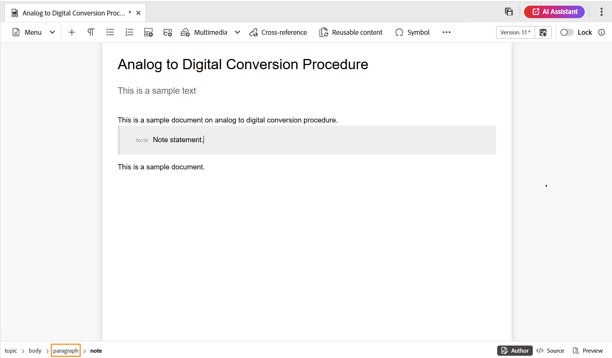
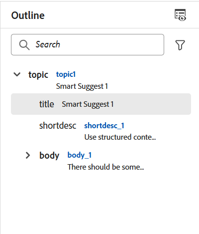
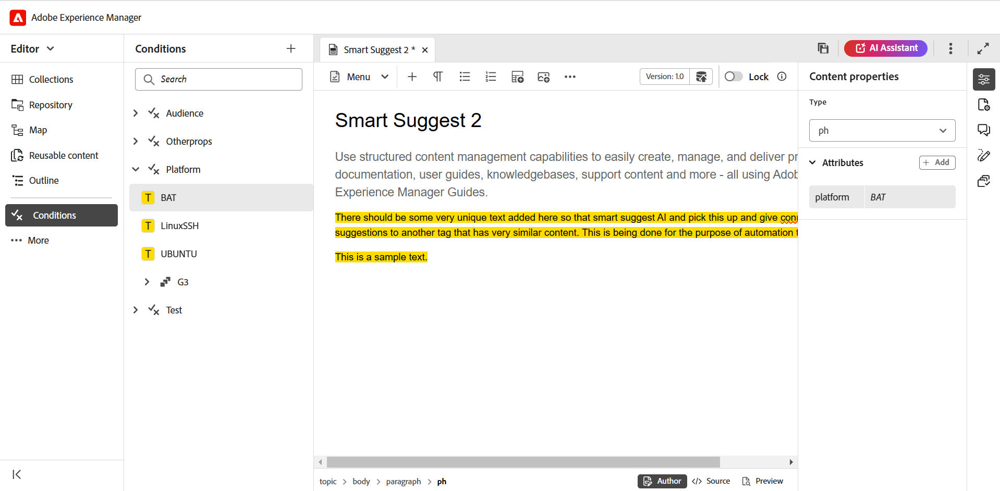
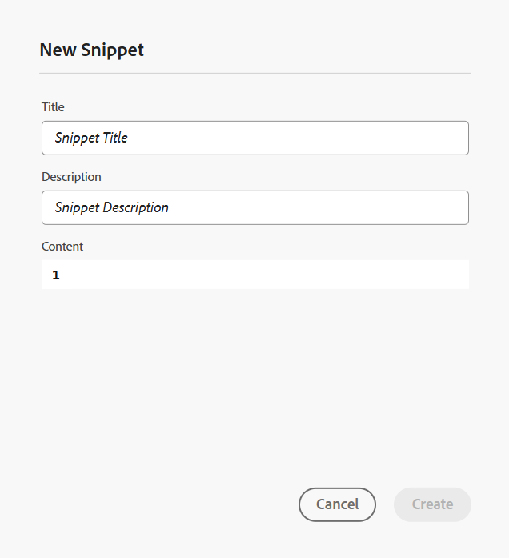

# 편집기 기능 이해 {#id176NC500V5Z}

이 섹션에서는 편집기에서 사용할 수 있는 다양한 기능에 대해 설명합니다. 편집기는 다음 섹션이나 영역으로 나눌 수 있습니다.

- [헤더 막대](#header-bar)
- [탭 표시줄](#tab-bar)
- [도구 모음](#toolbar)
- [왼쪽 패널](#left-panel)
- [콘텐츠 편집 영역](#content-editing-area)
- [오른쪽 패널](#right-panel)

다음 하위 섹션에서는 편집기의 다양한 섹션에 대해 자세히 설명합니다.

## 헤더 막대

헤더 막대는 Adobe Experience Manager 로고(또는 통합 쉘을 Experience Manager Guides UI로 사용하는 경우 통합 쉘)를 표시하는 편집기의 상단 표시줄입니다. 로고를 선택하면 Experience Manager 탐색 페이지로 이동합니다.


도구 모음의 **확장** 아이콘을 사용하여 헤더 표시줄을 숨기고 콘텐츠 영역을 최대화합니다. 표준 보기를 복원하려면 **확장된 보기 종료**&#x200B;를 선택합니다.


## 탭 표시줄

탭 표시줄은 편집기 인터페이스 맨 위에 있으며 다음 기능에 대한 액세스를 제공합니다.


**탭**

편집기에서 현재 열려 있는 주제를 파일 탭으로 표시합니다. 여러 개의 주제를 동시에 열 수 있으며 탭 표시줄의 각 탭에 표시됩니다. 기본적으로 탭에서 파일 제목을 볼 수 있습니다. 파일 위로 마우스를 가져가면 파일 제목과 파일 경로를 도구 설명으로 볼 수 있습니다.

>[!NOTE]
>
> 관리자는 탭에서 파일 이름별로 파일 목록을 보도록 선택할 수도 있습니다. [사용자 환경 설정](./intro-home-page.md#user-preferences)에서 **편집기 파일 표시 구성** 섹션의 **파일 이름** 옵션을 선택하십시오.

파일 탭을 선택하면 새 버전으로 저장, 복사, 위치, 추가, 속성, 분할, PDF으로 다운로드 및 닫기 옵션이 있는 컨텍스트 메뉴가 열립니다.

**모두 저장**

열려 있는 모든 항목에서 변경한 내용을 저장합니다. 편집기에서 여러 항목을 연 경우 **모두 저장**&#x200B;을 선택하거나 **Ctrl**+**S** 바로 가기 키를 사용하면 한 번의 클릭으로 모든 문서가 저장됩니다. 각 문서를 개별적으로 저장할 필요는 없습니다.

>[!NOTE]
>
> **모두 저장** 작업은 새 버전의 주제를 만들지 않습니다. 새 버전을 만들려면 **새 버전으로 저장** 옵션을 사용하십시오.

**AI 길잡이**

스마트 도움말 및 작성 기능을 통해 생산성을 향상시키도록 설계된 강력한 AI 기반 도구입니다. 강력한 두 가지 AI 기능(**작성** 및 **도움말**)을 Experience Manager Guides 인터페이스에 포함시켜 콘텐츠를 작성하고 Experience Manager Guides 설명서에서 정보에 보다 빠르고 효율적으로 액세스할 수 있도록 합니다.

>[!NOTE]
>
>AI Assistant 기능은 현재 Adobe Experience Manager Guides as a Cloud Service에서 사용할 수 있습니다.

**보기 확장**: **확장** 아이콘을 사용하여 페이지 보기를 확장할 수 있습니다. 이 보기에서는 Adobe Experience Manager 로고가 포함된 헤더 막대가 숨겨집니다. 이렇게 하면 편집할 컨텐츠 공간이 최대화됩니다. 표준 보기로 돌아가려면 **확장된 보기로 끝내기** 아이콘을 사용합니다.

**추가 작업**: **Assets** 및 **설정**(으)로 이동할 수 있습니다.

**Assets** 옵션을 사용하면 설정에 따라 대상으로 이동할 수 있습니다.

- **클라우드 서비스**: 클라우드 서비스를 사용하는 경우 **Assets** 옵션을 선택하면 AEM 탐색 페이지로 이동합니다.

- **온-프레미스 소프트웨어**: Adobe Experience Manager Guides(4.2.1 이상)를 사용하는 경우 **Assets** 옵션을 선택하면 Assets UI의 현재 파일 경로로 이동합니다.


**설정** 옵션은 관리자 및 폴더 프로필 관리자만 사용할 수 있으며, 다음 설정을 구성할 수 있습니다.

>[!NOTE]
>
> 기본 설정을 업데이트하는 경우 변경 사항을 적용하려면 문서를 다시 열어야 합니다.

- **일반**: 일반 설정을 사용하면 편집기에서 사용할 사전을 구성할 수 있습니다. 이 탭에는 **맞춤법 검사**, **조건**, **작성** 및 **인용**, 이렇게 네 개의 섹션이 있습니다.

  {width="650" align="left"}

   - **맞춤법 검사**: 두 가지 옵션이 있습니다. **AEM 맞춤법 검사** 및 **브라우저 맞춤법 검사**. 기본적으로 편집기는 브라우저의 기본 제공 사전을 사용하여 맞춤법 검사가 수행되는 브라우저 맞춤법 검사 기능을 사용합니다. AEM 맞춤법 검사로 전환하여 Adobe Experience Manager 사전을 사용할 수 있습니다. 사용자 지정 단어 목록을 추가하도록 사용자 지정할 수도 있습니다. AEM 사전 사용자 지정에 대한 자세한 내용은 Adobe Experience Manager Guides as a Cloud Service 설치 및 구성 섹션에서 [AEM의 기본 사전 사용자 지정](../cs-install-guide/customize-aem-custom-dictionary.md) 섹션을 참조하십시오.

   - **조건**

      - **작성자 보기에서 조건부 텍스트 강조 표시**: 작성자 보기에서 조건부 텍스트를 강조 표시하려면 이 항목을 선택합니다. 조건부 콘텐츠는 조건에 대해 정의된 색상을 사용하여 강조 표시됩니다.

      - **조건 특성으로 유효성 검사**: 특성에 대해 정의된 값의 유효성 검사를 허용하려면 이 항목을 선택하십시오. 이렇게 하면 잘못된 값을 추가할 수 없습니다.

      - **제목 구성표 패널에 제목이 있는 키 표시**: 제목 구성표의 제목과 함께 키를 표시하려면 이 항목을 선택하십시오. 이 옵션을 선택하지 않으면 제목만 표시됩니다. 예를 들어 여기에 &#39;os&#39;, &#39;audience&#39; 및 &#39;other&#39; 키도 제목과 함께 표시됩니다.

        {width="550" align="left"}

      - **조건 패널에 주제 구성표 표시**: 조건 패널에서 주제 구성표를 보려면 이 항목을 선택하십시오. 이 옵션을 선택 취소하면 정의된 조건이 [조건] 패널에 표시됩니다.

   - **작성**

      - **모두 바꾸기 사용**: **찾기 및 바꾸기** 패널에서 **모두 바꾸기** 아이콘을 보려면 이 항목을 선택하십시오.

   - **인용**
인용 유형을 변경합니다. 프로젝트에서 사용할 드롭다운에서 인용 스타일을 선택합니다. 자세한 내용은 [인용 스타일 변경](./web-editor-apply-citations.md#change-citation-style)을 참조하세요.

   - **AI 길잡이**
Experience Manager Guides에서 [AI Assistant](./ai-assistant.md) 기능을 활성화하려면 이 옵션을 선택하십시오. 기능을 비활성화하려면 선택 취소합니다.

**패널**: 이 설정은 편집기 및 맵 콘솔의 왼쪽 및 오른쪽 패널에 표시되는 패널을 제어합니다. 버튼을 전환하여 원하는 패널을 표시하거나 숨길 수 있습니다.

{width="650" align="left"}

패널에 있는 피쳐가 표시되는 순서를 정의할 수도 있습니다. 패널에서 사용할 수 있는 피쳐의 기본 순서를 변경하려면 점선 막대를 선택하여 피쳐 탭을 원하는 위치에 끌어다 놓습니다. 요구 사항에 따라 기능을 **자세히** 섹션에서 패널의 주 섹션으로 이동할 수도 있고 그 반대로 이동할 수도 있습니다. 재정렬되면 피쳐가 오른쪽 및 왼쪽 패널의 동일한 시퀀스에 나타납니다.

{width="650" align="left"}


한 번에 최대 8개의 패널을 표시할 수 있습니다. 패널 설정의 변경 사항은 즉시 적용됩니다.


>[!NOTE]
>
> 사용자 지정 패널이 구성된 경우 패널 목록에도 표시됩니다. 스위치를 전환하여 사용자 지정 패널을 표시하거나 숨길 수 있습니다.

- **요소 목록**: 관리자는 작성자가 파일에 삽입할 수 있는 요소 목록을 제어하고 요소의 표시 이름도 정의할 수 있습니다. 요소 목록 설정을 사용하면 DITA 사양에 따라 요소의 이름과 DITA 정의 요소 이름 대신 사용할 레이블을 지정할 수 있습니다.

  {width="650" align="left"}

위의 스크린샷에서 `p` 요소에는 단락 레이블이 지정되었고, `codeblock`에는 다른 일부 요소와 함께 코드 블록 레이블이 지정됩니다. **위의 요소만 사용** 옵션을 선택하면 **요소 삽입** 대화 상자에 이 목록의 유효한 요소 \(현재 삽입 지점\)만 표시됩니다.

다음 스크린샷에서는 이전 스크린샷에서 구성된 4개 요소 중 3개만 현재 컨텍스트에 표시됩니다.

{width="300" align="left"}

- **특성 목록**: 요소 목록과 마찬가지로, 요소의 특성 목록에 특성 목록과 표시 이름을 표시하도록 제어할 수 있습니다. 다음 스크린샷에서는 3개의 속성만 요소의 속성 목록에 표시되도록 구성되었습니다.

  {width="650" align="left"}

  이 설정을 사용하면 요소에 속성을 추가하려고 할 때 목록에 구성된 속성 목록만 표시됩니다.

  {width="300" align="left"}

- **색상**: **조건**&#x200B;에 대해 미리 구성된 배경색 목록을 표시합니다. 사용자는 주제에 조건을 적용할 때 배경색을 선택할 수 있습니다. 관리자는 사용자 지정 배경색을 만들어 목록에 추가할 수도 있습니다. 새 색상을 추가하려면 **색상 이름** 필드에 원하는 이름을 입력하고 사용자 지정 색상을 선택한 다음 **+** 아이콘을 선택합니다. 사용자 정의 색상은 색상 목록 끝에 나타납니다.

- **프로필 게시**: 여기에는 **기술 자료** 출력을 게시하는 데 사용할 수 있는 프로필이 포함되어 있습니다. 대상 기술 자료에 대한 새 프로필을 만들 수 있습니다. 예를 들어 Salesforce 또는 ServiceNow가 있습니다.

   - **Salesforce 프로필 만들기**

     **전제 조건**

      - Salesforce에 연결된 앱을 만듭니다. 자세한 내용은 [API 통합을 위해 OAuth 설정 사용](https://help.salesforce.com/s/articleView?id=sf.connected_app_create_api_integration.htm&amp;type=5)을 참조하세요.

      - 연결된 앱을 구성하는 동안 다음을 확인하십시오.

         - 콜백을 지정합니다.

           `URL: http://<server name>:<port>/bin/dxml/thirdparty/callback/salesforce`

         - 다음 OAuth 범위를 선택하십시오.
            - 전체 액세스(전체)
            - API(Manage user data via API)를 선택합니다

     앱이 구성되면 Salesforce에서 **소비자 키** 및 **소비자 암호**&#x200B;를 제공합니다. Salesforce 프로필을 만드는 데 사용할 수 있습니다.


   - Salesforce 프로필을 만들려면 **서버 유형** 드롭다운에서 **Salesforce** 기술 자료를 선택하십시오. 프로필 이름을 입력합니다. **사이트 URL**&#x200B;에서 출력을 게시하는 데 사용할 소비자 사이트를 입력한 다음 Salesforce 소비자 사이트에서 제공한 **소비자 키** 및 **소비자 암호**&#x200B;를 추가하십시오. 그런 다음 새로 만든 프로필을 **확인**&#x200B;하고 **저장**&#x200B;합니다.

     편집기 설정의 {width="550" align="left"}

     >[!NOTE]
     >
     >Experience Manager Guides에서 Salesforce용 프록시를 구성하려면 AEM에서 Apache HTTP 구성 요소 프록시 구성 을 사용합니다. [AEM 링크 검사기에 대한 프록시를 구성](https://helpx.adobe.com/experience-manager/kb/How-to-configure-proxy-for-the-AEM-Link-Checker-AEM.html)하는 방법을 알아봅니다.


   - **ServiceNow 프로필 만들기**

     **전제 조건**

     자산을 업로드하도록 ServiceNow 서버를 구성합니다.
      - **ServiceNow** 서버에 연결합니다.
      - **시스템 속성** > **보안**(으)로 이동합니다.
      - 다음 옵션을 선택 취소합니다.

        **업로드를 위해 MIME 유형 검사를 활성화하려면 이 속성을 설정해야 합니다(모든 버전 유레카 이상). 첨부 파일에 대한 MIME 유형 유효성 검사를 활성화(true)하거나 비활성화(false)합니다. Glide.attachment.extensions를 통해 구성된 파일 확장명은 업로드하는 동안 MIME 형식을 확인합니다.**

      - **저장**&#x200B;을 선택합니다.

     앱을 구성했으면 **ServiceNow** 프로필을 만듭니다.

   - 프로필을 만들려면 **서버 유형** 드롭다운에서 ServiceNow 기술 자료를 선택하십시오. **이름** 프로필을 입력하십시오. **ServiceNow URL**&#x200B;에서 출력을 게시하는 데 사용할 소비자 사이트를 입력한 다음 ServiceNow 소비자 사이트에서 제공한 **사용자 이름** 및 **암호**&#x200B;를 추가하십시오. 그런 다음 새로 만든 프로필을 **확인**&#x200B;하고 **저장**&#x200B;합니다.

     {width="550" align="left"}

  유효성을 검사한 후 DITA 맵의 출력 사전 설정에서 게시 프로필을 선택하고 이를 사용하여 선택한 **Salesforce** 또는 **ServiceNow** 서버에 대한 출력을 생성할 수 있습니다.

  [기술 자료](../user-guide/generate-output-knowledge-base.md) 출력 사전 설정에 대해 자세히 알아보세요.


- **유효성 검사**: 이 탭에는 편집기에서 스키마 유효성 검사를 구성하는 옵션이 포함되어 있습니다. 다음 기능을 활성화할 수 있습니다.

   - **파일을 저장하기 전에 유효성 검사 실행**: 저장 작업 전에 선택한 Schematron 파일을 사용하여 Schematron 유효성 검사를 실행하려면 이 옵션을 선택하십시오. + 아이콘을 선택하여 Schematron 파일을 추가할 수 있습니다. 선택한 Schematron 파일이 나열됩니다.

     >[!NOTE]
     >
     >선택한 Schematron 파일이 선택한 폴더 프로필에 대해 유지됩니다.

     {width="550" align="left"}

     이렇게 하면 사용자가 선택한 Schematron 파일에 정의된 규칙을 벗어나는 파일을 저장할 수 없습니다. 이 옵션을 선택하지 않으면 변경 내용을 저장하기 전에 파일의 유효성을 검사하지 않습니다.

   - **모든 사용자가 유효성 검사 패널에서 스키마 원본 파일을 추가할 수 있도록 허용**: 사용자가 편집기의 유효성 검사 패널에서 스키마 원본 파일을 추가할 수 있도록 하려면 이 옵션을 선택하십시오. 이를 통해 사용자는 Schematron 파일을 추가한 다음 Schematron 파일에 대해 항목을 확인할 수 있습니다. 이 옵션을 선택하지 않으면 편집기의 **유효성 검사 패널**&#x200B;에서 사용자가 **Schematron 파일 추가** 단추를 추가하는 옵션을 사용할 수 없습니다.


- **특성 표시**: 특성 목록과 마찬가지로, 요소의 특성 목록에 표시할 특성 목록을 제어할 수 있습니다. 기본적으로 네 개의 **표시 특성**(대상, 플랫폼, 제품 및 prop)이 요소의 특성 목록에 표시되도록 구성되었습니다. 맨 위에 있는 **추가** 아이콘을 사용하여 표시 특성을 추가할 수도 있습니다. **삭제** 아이콘을 사용하여 표시 특성을 삭제할 수도 있습니다.

  요소에 대해 정의된 속성이 레이아웃 및 아웃라인 뷰에 표시됩니다.

  {width="550" align="left"}

- **번역**: 이 탭에는 언어 그룹을 만들고, 원본 레이블을 대상 버전에 전파하고, 번역 프로젝트를 정리하는 옵션이 포함되어 있습니다.

  {width="550" align="left"}

   - **언어 그룹**: 관리자는 언어 그룹을 만들어 콘텐츠를 번역할 수 있습니다.

     새 언어 그룹을 만들려면 다음 단계를 수행하십시오.

      1. **추가**&#x200B;를 선택합니다.
      1. 언어 그룹 이름을 입력합니다. 각 언어에는 고유한 이름이 있어야 합니다. 이름 필드가 비어 있거나 이름이 고유하지 않은 경우 오류를 볼 수 있습니다.
      1. 드롭다운에서 언어를 선택합니다. 여러 언어를 선택할 수 있습니다.

         원하는 언어를 필터링하려면 언어의 처음 몇 글자 또는 언어 코드를 입력합니다. 예를 들어 &#39;en&#39;을 입력하면 &#39;en&#39;이 포함된 모든 언어를 이름이나 코드의 시작 부분에 필터링합니다.

      1. 완료 아이콘을 선택하여 선택한 언어를 그룹에 추가합니다. 언어가 표시됩니다. 3개 이상의 언어를 추가하면 **더 보기** 옵션이 표시됩니다. **자세히 표시**&#x200B;를 선택하여 그룹에 있는 모든 언어를 볼 수 있습니다.

         >[!TIP]
         >
         >**자세히 표시**&#x200B;에서 **간단히 표시**(으)로 전환하고 일부 언어만 봅니다.

      1. 그룹의 언어 위로 마우스를 가져가 을 편집하거나 언어 그룹을 합니다.
      1. **설정**&#x200B;을 저장합니다.

         >[!NOTE]
         >
         >사용자는 폴더 프로필에 구성된 언어 그룹을 볼 수 있습니다.

   - **원본 버전 레이블을 대상 버전에 전파**: 원본 파일 버전 레이블을 번역된 파일에 전달하려면 이 옵션을 선택하십시오. 기본적으로 비활성화되어 있습니다.
   - **완료 후 번역 프로젝트 정리**: 번역 프로젝트를 번역 후 자동으로 사용하지 않도록 설정하거나 삭제하도록 구성하려면 이 옵션을 선택하십시오. 번역 후 프로젝트가 존재하도록 기본적으로 **없음**&#x200B;이 선택됩니다.

     나중에 사용하려면 번역 프로젝트를 비활성화할 수 있습니다. 프로젝트를 삭제하면 프로젝트에 있는 모든 파일과 폴더가 영구적으로 삭제됩니다.


- **메타데이터**: 항목의 버전 메타데이터와 해당 값이 **버전 기록** 대화 상자에 표시되도록 제어할 수 있습니다.  메타데이터 경로에서 메타데이터를 선택할 노드의 위치를 지정합니다. 메타데이터의 사용자 지정 이름을 레이블로 정의할 수도 있습니다. 기본 등록 정보는 제목, 문서 상태 및 태그입니다.

  에셋의 `/jcr:content` 노드 아래에 있는 모든 속성에서 메타데이터를 선택할 수 있으므로 속성의 경로를 메타데이터 경로로 추가할 수 있습니다.


  메타데이터 경로가 비어 있으면 오류가 표시됩니다. 레이블을 비워 두면 마지막 요소가 레이블로 선택됩니다.


  편집기 설정의 {width="550" align="left"}

  ***버전 기록**대화 상자에 대한 메타데이터를 구성합니다.*


  이러한 메타데이터 태그가 표시되는 순서를 정의할 수도 있습니다. 이러한 태그의 기본 순서를 변경하려면 점선 막대를 선택하여 원하는 위치에 태그를 드래그하여 놓습니다.
메타데이터 레이블은 편집기의 **버전 기록** 대화 상자에서 동일한 순서로 나타납니다.

## 도구 모음

도구 모음은 편집기에서 편집할 주제 또는 맵을 열 때 나타납니다. 도구 모음에서 사용할 수 있는 기능은 다음과 같습니다.

- [메뉴 드롭다운](#menu-dropdown)
- [콘텐츠 삽입 옵션](#content-insertion-options)
- [버전 정보 및 새 버전으로 저장 버튼](#save-as-new-version)
- [잠금/잠금 해제](#lockunlock)

>[!NOTE]
>
> 위에 나열된 기능은 주제 파일에만 적용됩니다. 맵 파일로 작업할 때 현재 맵 편집기 뷰를 기준으로 도구 모음에 다른 옵션이 표시됩니다. [맵 편집기 기능](./map-editor-advanced-map-editor.md) 문서에서 맵 편집기 도구 모음 옵션에 대해 알아봅니다.

### 메뉴 드롭다운

메뉴 드롭다운에서는 편집 작업, 찾기 및 바꾸기, 버전 기록, 버전 레이블, 병합, 검토 작업 만들기, 변경 내용 추적 및 태그 기능에 액세스할 수 있습니다.

이러한 기능에 대한 자세한 설명은 다음과 같습니다.

**작업 편집**

편집기에서 주제를 편집할 때 메뉴 드롭다운에 있는 **잘라내기** 또는 ***Ctrl***+***X*** , **복사** 또는 ***Ctrl***+***C*** , **실행 취소** 또는 ***Ctrl***+***Z*** , **다시 실행** 또는 ***Ctrl***+***Y*** 및 **삭제** 등의 다양한 편집 작업에 액세스하십시오.


**찾기 및 바꾸기**

**찾기 및 바꾸기** 기능은 작성자 및 Source 보기 모드에서 사용할 수 있습니다. 활성화되면 항목 편집 영역 하단에 찾기 및 바꾸기 텍스트 막대가 나타납니다. 바로 가기 키 **CTRL**+**F**&#x200B;을 사용하여 찾기 및 바꾸기 표시줄을 호출할 수 있습니다.

{width="800" align="left"}

설정 아이콘 \(\)을 사용하여 **대/소문자 무시** 및 **단어 단위만** 검색 옵션을 전환할 수 있습니다. 대/소문자를 구분하지 않는 검색을 수행하려면 **대/소문자 무시** 옵션을 켜거나 선택합니다. 대/소문자를 구분하는 검색을 수행하려면 **대/소문자 무시** 옵션을 끄거나 선택 취소하십시오. 전체 단어를 검색하도록 선택할 수도 있습니다.

검색은 즉시 수행됩니다. 즉, **찾기** 필드에 검색 구문이나 단어를 입력하면 검색어가 즉시 검색되어 항목에서 선택됩니다. 마찬가지로 주제의 텍스트를 바꾸려면 각 필드에 검색어와 바꾸기 항목을 입력하고 **바꾸기** 또는 **모두 바꾸기** 단추를 선택합니다.

Source 보기에서 **찾기 및 바꾸기** 기능은 특정 요소나 특성을 검색하는 데 매우 유용합니다. 예를 들어 `@product` 특성의 값을 바꾸려면 Source 보기에서 쉽게 수행할 수 있습니다. 작성자 보기에서는 속성 또는 요소를 기준으로 검색할 수 없습니다. 그러나 **모두 바꾸기** 기능을 사용하는 동안에는 XML 코드를 덮어쓸 수 있으므로 주의해야 합니다.

**버전 기록**

편집기의 **버전 기록** 기능을 사용하면 사용 가능한 DITA 파일 버전을 확인하고, 비교하고, 편집기 자체의 버전으로 되돌릴 수 있습니다. 현재 버전(작업 복사본일 수도 있음)의 콘텐츠 및 메타데이터와 동일한 파일의 이전 버전을 비교할 수 있습니다. 비교 버전에 대한 레이블과 주석을 볼 수도 있습니다.

>[!NOTE]
>
> 버전 기록 옵션은 주제나 맵의 첫 번째 버전에 변경 사항이 있는 경우에만 나타납니다.

버전 기록에 액세스하고 주제의 특정 버전으로 되돌리려면 다음 단계를 수행합니다.

1. 편집기에서 주제를 엽니다.
1. **메뉴** 드롭다운에서 **버전 기록**&#x200B;을 선택합니다.

   **버전 기록** 대화 상자가 나타납니다.

   {width="550" align="left"}

   *주제의 다른 버전에서 변경 내용을 미리 봅니다.*

1. **비교 대상** 드롭다운 목록에서 비교하거나 되돌릴 항목의 버전을 선택합니다.

   >[!NOTE]
   >
   > 버전에 레이블이 적용된 경우 버전 번호와 함께 \(대괄호\)로 표시됩니다.

1. 현재 및 비교 버전에 적용된 레이블 및 설명을 보려면 **레이블 및 설명 보기** 옵션을 활성화하십시오.
1. **버전 기록** 대화 상자에서도 다음 정보를 볼 수 있습니다.

   **미리 보기** 탭: 새로 추가된 콘텐츠는 녹색 글꼴이고 삭제된 콘텐츠는 빨간색 글꼴입니다.

   **메타데이터** 탭: 새로 추가된 메타데이터는 녹색 글꼴이고 삭제된 메타데이터는 빨간색 글꼴입니다.

   ](images/metadata-version-diff.png){width="550" align="left"} 버전에 대한 ![메타데이터 차이점

   *버전 기록에서 다른 버전의 메타데이터를 비교합니다.*

   >[!NOTE]
   >
   > 시스템 관리자는 **설정**&#x200B;의 메타데이터 탭에서 표시할 메타데이터를 변경할 수 있습니다. 자세한 내용은 [탭 모음](#tab-bar)의 **추가 작업** 섹션을 참조하세요.

   현재 및 비교 버전의 사용자 및 시간 세부 사항을 볼 수도 있습니다.

   드롭다운 목록에서 버전을 선택하면 **선택한 버전으로 되돌리기** 옵션이 제공됩니다. 미리보기 창에는 현재 버전과 선택한 항목 버전 간의 차이점이 표시됩니다.

1. **선택한 버전으로 되돌리기**&#x200B;를 선택하여 선택한 버전의 항목으로 작업 복사본을 되돌립니다.

   버전 되돌리기 대화 상자가 나타납니다.

   {width="550" align="left"}

1. \(*선택 사항*\) 이전 버전으로 되돌리는 이유를 제공합니다. 주제의 현재 활성 작업 복사본에 대한 새 버전을 만들 수도 있습니다.

1. **확인**&#x200B;을 선택합니다.

   파일의 작업 복사본이 선택한 버전으로 되돌아갑니다. 현재 활성 작업 복사본의 새 버전을 만들도록 선택하면 모든 작업 변경 사항과 함께 파일의 새 버전도 만들어집니다.

   이전 버전으로 되돌리면 현재 작업 중인 버전이 최신 버전이 아님을 나타내는 시각적 큐가 표시됩니다.

   {width="800" align="left"}

**버전 레이블**

레이블은 DDLC(Document Development Life Cycle)에서 특정 주제가 포함된 단계를 식별하는 데 도움이 됩니다. 예를 들어 한 주제에 대해 작업할 때 레이블을 &quot;승인됨&quot;으로 설정할 수 있습니다. 주제가 게시되어 고객이 사용할 수 있게 되면 해당 주제에 &quot;릴리스됨&quot; 레이블을 할당할 수 있습니다.

Experience Manager Guides을 사용하면 자유 형식 텍스트 형식으로 레이블을 지정하거나 사전 정의된 레이블 세트를 사용할 수 있습니다. 사용자 지정 레이블을 사용하면 시스템의 모든 작성자가 선택에 따라 레이블을 지정할 수 있습니다. 이렇게 하면 유연성이 제공되지만 시스템에 일관되지 않은 레이블이 도입됩니다. 이 문제를 해결하기 위해 관리자는 사전 정의된 레이블 세트를 구성할 수 있습니다. 미리 정의된 레이블을 구성하는 방법에 대한 자세한 내용은 Adobe Experience Manager Guides as a Cloud Service 설치 및 구성에서 *XML Web Editor 구성 및 사용자 지정*&#x200B;을 참조하십시오.

이러한 레이블은 작성자가 레이블을 지정해야 하는 경우 드롭다운 목록 형태로 표시됩니다. 이렇게 하면 미리 정의된 일관된 레이블만 시스템에서 사용됩니다.

Assets UI의 [버전 내역](web-editor-use-label.md) 패널, [기준선](/help/product-guide/user-guide/generate-output-use-baseline-for-publishing.md) UI 및 편집기와 같이 주제에 레이블을 적용할 수 있는 다양한 방법이 있습니다. 편집기의 버전 레이블 기능을 사용하면 작성자가 주제에 레이블을 빠르고 쉽게 할당할 수 있습니다.

편집기에서 주제에 레이블을 추가하려면 다음 단계를 수행하십시오.

1. 편집기에서 주제를 엽니다.

1. 메뉴 드롭다운에서 **버전 레이블**&#x200B;을 선택합니다.

   [버전 레이블 관리] 대화 상자가 표시됩니다.

   {width="650" align="left"}

   버전 레이블 관리 대화 상자는 두 부분으로 분할됩니다. 왼쪽 패널에는 레이블 드롭다운 목록 \(또는 레이블을 입력할 텍스트 상자\)과 함께 주제에 사용할 수 있는 버전 목록이 있고 오른쪽 패널에는 주제를 미리 볼 수 있습니다.

1. 레이블을 적용할 버전을 선택합니다.

   버전 목록에서 다른 버전의 항목을 선택하면 미리보기 패널에 현재 버전과 선택한 버전의 항목 사이에 변경 사항이 표시됩니다

   >[!NOTE]
   >
   > 레이블이 버전에 이미 적용된 경우 드롭다운 목록의 버전 번호 옆에 버전 선택 목록 아래에 표시됩니다. 레이블 옆에 있는 \(**x**\) 아이콘을 선택하여 기존 레이블을 제거할 수 있습니다.

1. 관리자가 레이블 목록을 정의한 경우 적용할 레이블을 선택할 수 있는 레이블의 드롭다운 목록이 표시됩니다. 드롭다운 목록에서 여러 레이블을 선택할 수 있습니다.

   또는 주제에 추가할 레이블을 입력할 수 있는 텍스트 상자가 표시됩니다.

   >[!NOTE]
   >
   > 여러 버전의 주제에 동일한 레이블을 적용할 수 없습니다. 기존 레이블을 연결하려고 하면 기존 버전에서 레이블을 제거하고 선택한 항목 버전에 적용할 수 있는 옵션이 제공됩니다.

1. **레이블 추가**&#x200B;를 선택합니다.

1. 레이블 적용 확인 메시지에서 레이블을 기존 버전에서 선택한 버전으로 이동하려면 **레이블 이동(다른 버전에서 사용하는 경우)** 옵션을 선택합니다. 이 옵션을 선택하지 않고 주제의 다른 버전에 지정된 레이블이 있는 경우 선택한 주제의 버전으로 이동되지 않습니다. 이러한 레이블은 레이블 적용 프로세스에서 무시됩니다.

**병합**

다중 작성자 환경에서 작업할 때 다른 작성자가 주제나 맵에서 변경한 내용을 추적하기가 어려워집니다. 병합 기능을 사용하면 변경 내용을 볼 수 있을 뿐만 아니라 문서의 최신 버전에서 유지되는 변경 내용도 보다 세밀하게 제어할 수 있습니다.

- **주제 파일 병합**

  항목의 변경 내용을 병합하려면 다음 단계를 수행합니다.

   1. 편집기에서 주제를 엽니다.

   1. **병합**&#x200B;을 선택합니다.

      병합 대화 상자가 나타납니다.

      {width="550" align="left"}

   1. *\(선택 사항\)* 저장소의 다른 위치에서 새 파일을 찾아 선택할 수도 있습니다.

   1. 파일의 현재 버전을 비교할 파일 버전을 선택합니다.

   1. 옵션에서 다음을 선택합니다.

      - **선택한 버전에서 변경 내용 추적**: 이 옵션은 모든 콘텐츠 업데이트를 추적된 변경 내용 형식으로 표시합니다. 그런 다음 한 번에 하나씩 또는 한 번에 모두 문서의 변경 내용을 적용하거나 거부하도록 선택할 수 있습니다.

      - **선택한 버전으로 되돌리기**: 이 옵션은 문서의 현재 버전을 선택한 버전으로 되돌립니다. 이 옵션은 수락 또는 거부되는 콘텐츠에 대한 제어 권한을 제공하지 않습니다.

   1. **완료**&#x200B;를 선택합니다.

   1. **선택한 버전에서 변경 내용 추적** 옵션을 선택한 경우 선택한 버전에서 모든 변경 내용이 오른쪽 패널의 [추적된 변경 내용] 기능에 표시됩니다.

      [추적된 변경 내용] 패널의 모든 주석을 수락 또는 거부하거나 개별 주석을 수락 또는 거부하도록 선택할 수 있습니다.


- **맵 파일 병합**

  맵 파일에서 변경 사항을 병합하려면 다음 단계를 수행하십시오.

   1. 편집기에서 맵을 엽니다.

   1. **병합**&#x200B;을 선택합니다.

      병합 대화 상자가 나타납니다.

      {width="550" align="left"}

   1. *\(선택 사항\)* 저장소의 다른 위치에서 새 파일을 찾아 선택할 수도 있습니다.

   1. 파일의 현재 버전을 비교할 파일 버전을 선택합니다.

   1. 옵션에서 다음을 선택합니다.

      - **선택한 버전에서 변경 내용 추적**: 이 옵션은 변경 내용 추적 형식으로 모든 콘텐츠 업데이트를 표시합니다. 그런 다음 한 번에 하나씩 또는 한 번에 모두 문서의 변경 내용을 적용하거나 거부하도록 선택할 수 있습니다.

      - **선택한 버전으로 되돌리기**: 이 옵션은 문서의 현재 버전을 선택한 버전으로 되돌립니다. 이 옵션은 수락 또는 거부되는 콘텐츠에 대한 제어 권한을 제공하지 않습니다.

   1. **완료**&#x200B;를 선택합니다.

   1. **선택한 버전의 변경 내용 추적** 옵션을 선택한 경우 선택한 버전의 모든 변경 내용이 [추적된 변경 내용] 패널 \(오른쪽\)에 표시됩니다.

      [변경 내용 추적] 패널에서 모든 변경 내용을 적용하거나 거부하도록 선택하거나 맵 파일에서 개별 변경 내용을 적용하거나 거부하도록 선택할 수 있습니다.


**검토 작업 만들기**

편집기에서 직접 현재 주제 또는 맵 파일의 [검토 작업을 만들](./review-send-topics-for-review.md)수 있습니다. 리뷰 작업을 만들 파일을 열고 메뉴 드롭다운에서 **리뷰 작업 만들기**&#x200B;를 선택하여 리뷰 만들기 프로세스를 시작합니다.

**변경 내용 추적**

변경 내용 추적 모드를 활성화하여 문서에 대해 수행된 모든 업데이트를 추적할 수 있습니다. 변경 내용 추적을 활성화하면 모든 삽입 및 삭제 내용이 문서에 캡처됩니다. 삭제된 모든 콘텐츠는 취소선을 사용하여 강조 표시되고 모든 삽입은 녹색 텍스트로 강조 표시됩니다. 또한 항목 페이지의 가장자리에 변경 막대가 표시됩니다. 삭제된 컨텐츠에 대해서는 빨간색 막대가 표시되고 추가된 컨텐츠에 대해서는 녹색 막대가 표시됩니다. 동일한 줄에 추가와 삭제가 있는 경우 녹색 막대와 빨간색 막대가 모두 표시됩니다.

다음 스크린샷에서는 변경 막대와 함께 삭제되고 삽입된 콘텐츠를 강조 표시합니다.

{width="650" align="left"}

문서의 변경 내용을 추적하는 일반적인 사용 사례는 동료 검토를 수행하는 것입니다. 변경 내용 추적을 활성화하고 검토할 문서를 공유할 수 있습니다. 그러면 검토자가 변경 내용 추적을 켜고 변경합니다. 문서를 받으면 변경 사항을 수락하거나 거부할 수 있는 편리한 방법과 함께 제안된 업데이트를 볼 수 있는 메커니즘이 있어야 합니다.

Experience Manager Guides은 문서에서 수행한 업데이트에 대한 정보가 포함된 추적된 변경 사항 기능을 제공합니다. 추적된 변경 내용 기능은 수행한 업데이트, 수행한 사용자 및 시간에 대한 정보를 제공합니다. 변경 내용 추적 기능을 사용하면 문서에서 제안된 업데이트를 쉽게 수락하거나 거부할 수 있습니다.

기능에 액세스하려면 오른쪽 패널에서 **변경 내용 추적** 아이콘을 선택하십시오.

{width="300" align="left"}

변경 내용을 추적하면 문서에서 변경된 내용이 선택됩니다. 변경 내용 적용 아이콘을 선택하여 변경 내용을 적용하거나, 변경 내용 거부를 선택하여 변경 내용을 거부할 수 있습니다.

한 번의 클릭으로 모든 변경 내용을 적용하거나 거부하려면 **모든 변경 내용 적용** 또는 **모든 변경 내용 적용 취소**&#x200B;를 선택합니다.

>[!NOTE]
>
> 미리보기 모드에서는 변경된 컨텐트의 마크업을 사용하거나 사용하지 않고 문서를 볼 수 있습니다. 자세한 내용은 [미리 보기](web-editor-views.md#preview-mode-id19AAGL00163) 모드를 참조하십시오.

**태그**

편집기의 **태그** 기능은 DITA 요소의 가시성을 제어하는 토글 단추입니다. 활성화되면 컨텐츠 내에 구조적 태그가 표시되어 기본 DITA 요소를 보다 효과적으로 보고 관리할 수 있습니다. 비활성화되면 편집기는 이러한 태그를 숨겨 보다 깨끗하고 집중적인 작성 환경을 제공합니다.

다음 스크린샷은 태그 보기가 활성화된 문서를 보여 줍니다.

{width="650" align="left"}

태그를 사용하는 문서에서 다음 작업을 수행할 수 있습니다.

- **요소 선택**: 요소의 열기 또는 닫기 태그를 선택하여 해당 콘텐츠를 선택합니다.

- **태그 확장 또는 축소**: 태그를 확장하거나 축소하려면 + 또는 - 기호를 선택합니다.

- **상황에 맞는 메뉴 사용**: 상황에 맞는 메뉴는 선택한 요소를 잘라내거나 복사하거나 붙여넣을 수 있는 옵션을 제공합니다. 선택한 요소 앞 또는 뒤에 요소를 삽입할 수도 있습니다. 다른 옵션을 사용하면 ID를 생성하거나 선택한 요소에 대한 속성 패널을 열 수 있습니다.

- **요소 드래그 앤 드롭**: 요소의 태그를 선택하여 문서에 쉽게 드래그 앤 드롭할 수 있습니다. 드롭 위치가 요소가 허용되는 유효한 위치인 경우 요소는 드롭된 위치에 배치됩니다.


>[!NOTE]
>
> 사용자가 편집기에서 태그 보기를 활성화하면 세션 중에도 활성화된 상태로 유지됩니다. 즉, 나중에 액세스하기 위해 태그 보기를 다시 활성화할 필요가 없습니다. 새 사용자의 세션에 대한 태그 보기의 기본값은 `ui\_config.json` 파일의 `tagsView` 속성에 의해 결정됩니다. 자세한 내용은 Adobe Experience Manager Guides as a Cloud Service 설치 및 구성에서 [태그 보기에 대한 기본값 구성](../cs-install-guide/configure-default-value-tags-view.md) 섹션을 참조하십시오.

### 콘텐츠 삽입 옵션

**요소** - 

현재 또는 다음 유효한 위치에 유효한 요소를 삽입합니다. 키보드 단축키 ***Alt***+***Enter***&#x200B;를 사용하여 요소 대화 상자를 열 수도 있습니다. 예를 들어, 단락을 편집한 다음 **요소** 대화 상자에서 단락에 삽입할 수 있는 요소 목록이 나타납니다. 삽입할 요소를 선택합니다. 키보드를 사용하여 요소 목록을 스크롤하고 ***Enter***&#x200B;를 눌러 필요한 요소를 삽입할 수 있습니다.

다음 두 가지 유형의 유효한 요소를 볼 수 있습니다.

- **현재 위치의 올바른 요소**: 현재 커서 위치 자체에 삽입할 수 있는 요소가 목록에 표시됩니다.

- **현재 위치 외부의 올바른 요소**: 요소 계층 구조 내에서 현재 요소의 부모 뒤에 삽입할 수 있는 요소가 목록에 표시됩니다.

예를 들어 인라인 `<b>` 요소 내에 있는 경우 `<u>`, `<xref>`, `<i>`과(와) 같은 요소를 현재 위치에 삽입할 수 있습니다. 반대로 `<table>` 및 `<topic>`과(와) 같은 요소를 현재 위치 외부에 삽입할 수 있습니다.

검색 상자에 문자나 문자열을 입력하고 문자열로 시작되는 요소를 검색할 수도 있습니다.

{width="300" align="left"}

*&#39;t&#39;로 시작하는 모든 유효한 요소를 검색하려면 &#39;t&#39;를 입력하십시오.*

`note`과(와) 같은 블록 요소 내에서 작업하는 경우 요소 삽입 아이콘을 사용하여 `note` 요소 뒤에 새 요소를 삽입합니다. 다음 스크린샷에서는 참고 요소가 p \(paragraph\) 요소 내부에 삽입되었습니다.

{width="800" align="left"}

메모 요소에서 Enter 키를 누르면 메모 요소 자체에 새 단락이 만들어집니다. 메모 외부에 새 요소를 삽입하려면 요소 경로에서 p 요소 \(스크린샷에 강조 표시\)를 선택한 다음 요소 아이콘을 선택하거나 ***Alt***+***Enter***&#x200B;를 눌러 요소 삽입 대화 상자를 엽니다. 그런 다음 원하는 요소를 선택하고 Enter 키를 눌러 메모 요소 뒤에 선택한 요소를 삽입합니다.

깜박이는 블록 커서가 나타날 때 두 요소 사이에 요소를 추가할 수도 있습니다.


{width="300" align="left"}

예를 들어, DITA 주제에서 작업 중일 때 짧은 설명과 본문 사이에 블록 커서가 깜박이면 `prolog` 요소를 추가한 다음 저작권, 작성자 및 기타 세부 정보를 추가할 수 있습니다.

컨텍스트 메뉴를 사용하여 새 요소를 입력할 수도 있습니다. 문서의 아무 곳이나 마우스 오른쪽 버튼으로 클릭하여 컨텍스트 메뉴를 호출합니다. 이 메뉴에서 **요소 삽입**&#x200B;을 선택하여 **요소 삽입** 대화 상자를 표시하고 삽입할 요소를 선택합니다.

{width="300" align="left"}

**단락** - 

현재 또는 다음 유효한 위치에 단락 요소를 삽입합니다.

**글머리 기호 목록** - 

현재 또는 다음 유효한 위치에 글머리 기호 목록을 만듭니다. 글머리 기호 목록에 있는 경우 이 아이콘을 선택하면 항목이 일반 단락으로 변환됩니다.

**번호 매기기 목록** - 

현재 또는 다음 유효한 위치에 번호 매기기 목록을 만듭니다. 번호 매기기 목록에서 이 아이콘을 선택하면 항목이 일반 단락으로 변환됩니다.

>[!NOTE]
>
>목록 항목의 컨텍스트 메뉴에서 **목록 분할** 옵션을 선택하여 현재 목록을 분할하고 동일한 수준에서 새 목록을 시작할 수도 있습니다.

**테이블** - 

현재 또는 다음 유효한 위치에 표를 삽입합니다. 표 아이콘을 선택하여 간단한 표 삽입 대화 상자를 엽니다.

{width="550" align="left"}

>[!NOTE]
>
> MS Word 또는 Excel에서 표를 복사하여 Experience Manager Guides 주제 파일에 붙여넣을 수도 있습니다. 복사된 테이블은 XML 편집기 구성에 구성된 설정에 따라 `<simpletable>` 또는 `<tgroup>`(으)로 붙여넣어집니다. 자세한 내용은 [붙여 넣은 테이블 표시 구성](../cs-install-guide/conf-pasted-tables.md)을 참조하십시오.

테이블에 필요한 행 및 열의 수를 지정할 수 있습니다. 첫 행을 테이블 머리글로 유지하려면 **첫 행을 머리글로 설정** 옵션을 선택합니다. 테이블에 제목을 추가하려면 제목 필드에 제목을 입력합니다.

테이블이 삽입되면 컨텍스트 메뉴를 사용하여 테이블을 수정할 수 있습니다.

{width="550" align="left"}


테이블의 컨텍스트 메뉴를 사용하여 다음과 같은 작업을 수행할 수 있습니다.

- 셀, 행 또는 열 삽입

- 오른쪽 및 아래쪽 방향으로 셀 병합

- 수평 또는 수직으로 셀 분할

- 셀, 행 또는 열 삭제

- ID 생성


테이블의 여러 셀, 전체 행 또는 열에 속성을 정의할 수도 있습니다. 예를 들어 표 셀을 정렬하려면 필요한 셀을 끌어서 선택합니다. 콘텐츠 속성 패널(오른쪽)에서 속성 **Type**&#x200B;이(가) **entry**(으)로 변경됩니다.

1. **특성** 섹션에서 **+추가**&#x200B;를 선택합니다.
1. **특성** 드롭다운 목록에서 `@valign` 특성을 선택합니다.
1. 값 드롭다운 목록에서 선택한 테이블 셀에 적용할 원하는 텍스트 정렬을 선택합니다.
1. **추가** 선택

{width="800" align="left"}

**이미지** - 

현재 또는 다음 유효한 위치에 이미지를 삽입합니다. 이미지 아이콘을 선택하여 이미지 삽입 대화 상자를 연 다음 삽입할 이미지를 검색하여 선택합니다.

>[!NOTE]
>
> 이미지를 로컬 시스템에서 문서에 끌어다 놓아 추가할 수도 있습니다. 이 경우 이미지 파일은 **Assets 업로드** 워크플로우를 사용하여 추가됩니다.  자세한 내용은 [왼쪽 패널](#left-panel) 섹션에서 **Assets 업로드** 워크플로우를 참조하십시오.


{width="650" align="left"}

이미지 삽입 대화 상자에서 이미지에 대한 이미지/그림 제목과 그림 설명을 추가할 수 있습니다.

>
>
> 이미지를 삽입하고 이미지에 대한 대체 텍스트를 지정하면 최신 DITA 표준에 따라 `<alt>` 요소 내에 추가됩니다. 대체 텍스트에 대한 `@alt` 특성은 더 이상 사용되지 않지만 이전 DITA 버전에서 지원됩니다.

**파일 선택** 옵션을 사용하면 파일 이름별로 필요한 이미지 파일을 검색할 수 있습니다. 또한 경로 \(\), 컬렉션, 파일 유형 및 태그로 검색 결과를 필터링할 수도 있습니다. 필요한 이미지 파일을 찾으면 파일을 선택하고 **선택**&#x200B;을 선택하여 문서에 이미지를 삽입합니다. `.png`, `.svg`, `.gif`, `.jpg`, `.eps`, `.ai`, `.psd` 등 다양한 형식의 이미지 파일을 삽입할 수 있습니다.

이미지를 삽입하면 [컨텐트 속성] 패널에서 높이, 너비, 배치 및 속성을 변경할 수 있습니다. 이미지 파일을 선택한 다음 오른쪽 패널의 [내용 속성] 패널에서 변경 작업을 수행합니다.

{width="800" align="left"}

Source 필드는 삽입된 이미지 파일의 UUID를 표시합니다. 마우스 포인터를 Source 필드 위로 가져가면 삽입된 이미지 파일의 전체 경로를 찾을 수 있습니다. 경로는 도구 설명에 표시됩니다.

이미지 파일에 [높이] 또는 [폭] 값을 제공하여 이미지 크기를 조정할 수 있습니다. 이미지의 종횡비는 자동으로 유지됩니다. 원할 경우 [종횡비 유지]의 잠금 아이콘 \(\)을 선택하고 [높이] 및 [폭] 값을 제공하여 이미지 파일의 종횡비를 유지하지 않도록 선택할 수도 있습니다.

이미지에 대한 [배치] 설정을 [인라인] 또는 [나누기]로 지정할 수도 있습니다. 브레이크 배치 옵션을 사용하도록 선택한 경우 이미지를 정렬할 위치(왼쪽, 가운데 또는 오른쪽)를 선택할 수 있습니다.

**특성** 필드에서 필요한 속성을 선택하여 이미지 파일에 대한 다른 속성을 추가할 수도 있습니다.

>[!NOTE]
>
>이미지에서 클릭 가능한 영역 \(image map\)을 정의할 수도 있습니다. 자세한 내용은 [왼쪽 패널](web-editor-features.md#left-panel) 섹션에서 **이미지 맵 삽입/편집** 기능 설명을 참조하십시오.

**이미지 또는 미디어 파일에 대한 상황에 맞는 메뉴**

상황에 맞는 메뉴를 사용하여 이미지 및 미디어 파일에 대한 몇 가지 일반적인 작업을 수행할 수도 있습니다. 이미지의 아무 곳이나 마우스 오른쪽 버튼으로 클릭하여 컨텍스트 메뉴를 호출합니다.

컨텍스트 메뉴에서는 이미지 또는 미디어를 잘라내거나 복사하거나 붙여넣을 수 있는 옵션을 제공합니다. 선택한 요소 앞 또는 뒤에 요소를 삽입할 수 있습니다. 요소의 이름을 바꾸거나 요소의 래핑을 취소할 수 있는 옵션도 있습니다. 저장소에서 선택한 이미지 또는 미디어를 찾거나 Assets UI에서 파일의 미리보기를 볼 수 있습니다.

컨텍스트 메뉴의 다른 옵션을 사용하면 경로를 복사하거나, 이미지 맵을 편집하거나, 요소 이름을 바꾸거나, 코드 조각을 만들거나, 선택한 요소에 대한 ID를 생성할 수 있습니다.

**이미지 맵 삽입/편집**

선택한 이미지에 이미지 맵을 삽입합니다. 항목 또는 웹 페이지에 연결되는 클릭 가능한 영역이 있는 이미지를 이미지 맵이라고 합니다.

현재 주제의 이미지를 선택하고 이미지 맵 삽입/편집 아이콘을 선택하여 이미지 맵 삽입 대화 상자를 엽니다.

{width="650" align="left"}

원하는 모양 사각형 , 원형  또는 다각형 을(를) 선택하여 링크로 사용할 이미지 위에 영역을 정의합니다. 영역을 정의한 후 내부 또는 외부 콘텐츠에 대한 링크를 지정해야 하는 참조 대화 상자가 나타납니다.

{width="650" align="left"}

영역이 겹치는 경우 도구 모음에서 해당 아이콘을 클릭하여 모양을 앞으로 가져오거나 뒤로 보낼 수 있습니다. 영역을 선택하고 삭제 아이콘을 클릭하여 제거할 수도 있습니다. 영역을 두 번 클릭하면 대상 링크를 변경할 수 있는 참조 대화 상자가 열립니다. 이미지의 필수 영역을 표시했으면 **완료**&#x200B;를 선택하여 변경 내용을 저장합니다.


**멀티미디어**

다양한 유형의 멀티미디어 파일을 삽입합니다. 멀티미디어 드롭다운 아이콘을 선택하고 삽입할 파일 유형을 선택합니다. 지원되는 멀티미디어 형식은 다음과 같습니다.

- 오디오 파일
- 비디오 파일
- YouTube
- Vimeo

오디오 또는 비디오 파일 옵션을 선택하면 원하는 파일을 찾아 선택할 수 있는 저장소 보기가 표시됩니다. YouTube 또는 Vimeo를 선택하면 멀티미디어 삽입 대화 상자가 표시됩니다. 웹 링크 필드에 비디오 파일의 링크를 붙여넣고 삽입 을 선택하여 문서의 현재 또는 다음 유효한 위치에 비디오를 추가합니다.

>[!NOTE]
>
> YouTube 비디오 링크를 추가하는 동안 URL에서 문자열 `watch?v=`을(를) `embed`(으)로 바꾸어야 합니다. 예를 들어 YouTube 비디오 링크 `https://www.youtube.com/**watch?v**=WlIKQOrmZcs`을(를) 추가하려면 `https://www.youtube.com/**embed/**WlIKQOrmZcs`(으)로 추가해야 합니다. 이 변경 사항으로 인해 비디오가 AEM 사이트 및 PDF 출력에 임베드됩니다.

멀티미디어 삽입 대화 상자에서 오디오 또는 비디오 파일을 추가할 수도 있습니다. 오디오/비디오 파일 옵션을 선택한 다음 찾아보기 아이콘을 선택하여 저장소 보기를 시작합니다. 리포지토리에서 오디오 또는 비디오 파일을 선택하고 **선택**&#x200B;을(를) 선택하여 오디오/비디오 파일 필드에 파일 링크를 추가합니다. 비디오 파일을 선택하면 파일의 미리 보기가 [미리 보기] 영역에도 표시됩니다. 비디오 파일을 재생하여 미리 보기를 볼 수 있습니다.

{width="650" align="left"}

**상호 참조**

유형의 참조 삽입 — 컨텐츠 참조, 컨텐츠 키 참조, 키 참조, 파일 참조, 웹 링크 또는 이메일 링크.

**파일 선택** 아이콘 \(컨텐츠 참조 및 파일 참조\) 또는 **루트 맵 선택** 아이콘 \(컨텐츠 키 참조 및 키 참조\)을 선택하고 연결할 파일이나 컨텐츠를 선택합니다.

{width="650" align="left"}

선택한 참조의 링크가 문서에 추가됩니다. 링크의 컨텍스트 메뉴에서는 다음 옵션을 사용할 수 있습니다.

- **요소 삽입**: 해당 컨텍스트에 삽입할 수 있는 올바른 요소 목록을 표시합니다.
- **UUID 복사**: 삽입된 참조의 UUID를 복사합니다.
- **경로 복사**: 삽입된 참조의 전체 경로를 복사합니다.
- **ID 생성**: 삽입된 참조에 대한 고유 ID를 생성합니다.

참조할 파일의 UUID를 사용하여 검색할 수도 있습니다. 컨텐트 및 키 참조 링크의 경우 링크할 파일의 UUID를 입력하면 파일이 자동으로 검색되어 미리보기 섹션에 표시됩니다. 파일의 UUID를 지정할 때 .xml 파일의 파일 확장명을 명시적으로 언급할 필요가 없습니다. .xml 확장명이 UUID에 자동으로 추가됩니다.

{width="650" align="left"}

관리자가 *XMLEditorConfig*&#x200B;에서 UUID 옵션을 활성화한 경우 **Link** 속성에서 참조된 콘텐츠의 UUID를 보게 됩니다.

{width="800" align="left"}

>[!NOTE]
>
> **UUID 활성화** 옵션이 활성화되어 있지 않으면 참조된 콘텐츠의 상대 경로가 표시됩니다.

>[!IMPORTANT]
>
> 참조된 콘텐츠의 상대 경로가 **Link** 속성에 표시되더라도 내부적으로 참조된 콘텐츠의 UUID를 사용하여 링크가 만들어집니다.

>[!TIP]
>
> 콘텐츠 참조에 대한 우수 사례를 알려면 우수 사례 안내서의 참조 섹션을 참조하십시오.

**검색 필터링**

AEM 저장소의 선택한 경로에 있는 파일에서 일부 텍스트를 검색할 수 있습니다. 예를 들어 &#39;general&#39;은 아래 스크린샷에서 검색됩니다. 향상된 필터를 사용하여 검색 범위를 좁힐 수도 있습니다. 선택한 경로에 있는 DITA 주제 및 DITA 맵과 같은 모든 DITA 파일을 찾을 수 있습니다.

선택한 경로에서 이미지 파일, 멀티미디어 및 문서와 같은 비 DITA 파일을 검색할 수 있습니다. DITA 요소의 속성에서 특정 값을 검색할 수도 있습니다. 지정된 사용자가 체크 아웃한 파일을 찾을 수도 있습니다.

{width="650" align="left"}

>[!NOTE]
>
> 시스템 관리자는 텍스트 필터를 구성하고 다른 필터를 표시하거나 숨길 수도 있습니다. 자세한 내용은 Adobe Experience Manager Guides as a Cloud Service 설치 및 구성 의 *텍스트 필터 구성* 섹션을 참조하십시오.

검색된 텍스트가 포함된 필터링된 파일 목록이 표시됩니다. 예를 들어 위 스크린샷에는 &#39;general&#39;이라는 텍스트가 포함된 파일이 나열됩니다. 파일 내용을 미리 볼 수도 있습니다.


**재사용 가능한 콘텐츠** - 

프로젝트의 다른 문서 내에 있는 콘텐츠를 재사용합니다. 파일의 콘텐츠에 직접 연결하거나 키 참조를 사용하여 콘텐츠를 삽입할 수 있습니다. [키 참조 확인](map-editor-other-features.md#id176GD01H05Z)을 보세요. 재사용 가능한 콘텐츠 아이콘을 선택하면 콘텐츠 재사용 대화 상자가 표시됩니다.

{width="650" align="left"}

컨텐트 재사용(Reuse Content) 대화상자에서 파일 참조에 대한 DITA 파일이나 키 참조가 포함된 DITA 맵 파일을 선택합니다. 선택하면 주제 또는 주요 참조가 대화 상자에 표시됩니다. 삽입하려는 주제의 ID/키를 선택하고 **완료**&#x200B;를 선택하여 주제 내에 콘텐츠를 삽입할 수 있습니다.

콘텐츠 참조를 삽입하려면 파일의 UUID를 입력하면 해당 파일에서 재사용 가능한 콘텐츠가 미리보기 섹션에 나열됩니다.

링크 삽입 설정에 따라 속성 패널 또는 Source 코드 보기에서 삽입된 콘텐츠의 UUID 또는 상대 경로를 볼 수 있습니다. 링크는 항상 참조된 콘텐츠의 UUID를 사용하여 생성됩니다. Adobe Experience Manager Guides as a Cloud Service 설치 및 구성에서 *UUID 기반 링크 구성*&#x200B;을 봅니다.

>[!NOTE]
>
> 참조된 콘텐츠의 앞 또는 뒤에 콘텐츠를 추가하려면 *Alt*+*왼쪽* 화살표 또는 Alt+*오른쪽* 화살표 키를 사용하여 커서를 원하는 위치로 이동합니다.

참조된 콘텐츠를 마우스 오른쪽 단추로 클릭하고 컨텍스트 메뉴에서 **참조로 바꾸기**&#x200B;를 선택하여 참조된 콘텐츠를 주제 내에 포함할 수도 있습니다.

**기호** - 

항목에 특수 문자를 삽입합니다. 기호 아이콘을 선택하여 특수 문자 삽입 대화 상자를 엽니다.

>[!NOTE]
>
> Experience Manager Guides은 이동 가능하고 크기 조정 가능한 대화 상자를 제공합니다. 오른쪽 아래 모서리에 두 개의 십자선이 있는 대화 상자의 크기를 조정할 수 있습니다. 특수 문자 대화 상자의 십자선이 아래에 표시됩니다.

{width="550" align="left"}

특수 문자 삽입 대화 상자에서 이름을 사용하여 특수 문자를 검색할 수 있습니다. 모든 특수 문자는 다양한 카테고리에 저장됩니다. 범주 선택 드롭다운 목록을 사용하여 범주를 선택합니다. 선택한 범주 내에서 사용할 수 있는 특수 문자가 표시됩니다. 화살표 키를 사용하여 특수 문자 목록을 탐색하거나 삽입하려는 문자를 선택할 수 있습니다. 선택한 특수 문자의 이름 및 16진수 코드가 목록 아래에 표시됩니다. **삽입**&#x200B;을 선택하여 문서에 선택한 문자를 삽입합니다.

**키워드** - 

DITA 맵에 정의된 키워드를 삽입합니다. 키워드 옵션을 선택하여 키 참조 대화 상자를 엽니다.

{width="550" align="left"}

키워드는 알파벳 순서로 나열되며 검색 상자에 검색 문자열을 입력하여 키워드를 검색할 수도 있습니다. 검색 결과는 ID 또는 값의 문자열을 포함하는 키워드를 반환합니다. DITA 맵에 정의된 키워드가 이 대화 상자에 나열됩니다. 삽입하려는 키워드를 선택하고 **삽입**&#x200B;을 선택합니다.

키워드를 마우스 오른쪽 단추로 클릭하고 속성 옵션을 선택하여 삽입된 키워드의 속성을 변경할 수도 있습니다. **Attributes for Keyword 대화 상자가 열립니다.

{width="550" align="left"}

키워드의 속성을 변경하거나 키워드에 새 속성을 추가할 수 있습니다.

**코드 조각** - 

현재 또는 다음 유효한 위치에 코드 조각을 삽입합니다. 이 기능을 사용하려면 시스템에 스니펫이 정의되어 있어야 합니다. 코드 조각 추가에 대한 자세한 내용은 [왼쪽 패널](web-editor-features.md#left-panel) 섹션에서 **코드 조각** 기능 설명을 참조하십시오.

코드 조각 옵션을 선택하면 코드 조각 삽입 카탈로그가 표시됩니다. 카탈로그는 컨텍스트에 따라 다르며, 이는 현재 위치에서 허용된 경우에만 코드 조각이 표시됨을 나타냅니다.

다음 예제에서는 문서의 현재 위치에 삽입할 수 있는 두 개의 사전 구성된 코드 조각(경고 및 오류)을 보여 줍니다.

{width="300" align="left"}

목록에서 코드 조각을 선택하면 문서의 현재 또는 다음 유효한 위치에 코드 조각이 삽입됩니다. 다음 스크린샷은 문서에 삽입된 오류 코드 조각을 보여 줍니다.

{width="400" align="left"}

**인용** - 

인용 부호를 만들어 콘텐츠에 추가합니다. [콘텐츠에 인용을 추가하고 관리하는 방법](./web-editor-apply-citations.md)을 알아보세요.

**쿼리 데이터** - 

데이터 소스와 연결하고 데이터를 사용하여 콘텐츠를 만듭니다. [데이터 소스의 데이터를 사용하는 방법](./web-editor-content-snippet.md)에 대해 알아봅니다.

### 버전 정보 및 새 버전으로 저장

**버전 정보 및 새 버전으로 저장** 기능은 버전 추적 및 콘텐츠 저장을 하나의 기능으로 결합합니다.

- 버전 정보에는 주제 또는 맵의 현재 버전이 표시됩니다. 버전 번호 옆에 저장되지 않은 변경 내용을 나타내는 별표(*)가 나타납니다.

  버전 번호는 주제 또는 맵 파일에 대해 생성되는 모든 새 버전에 따라 변경됩니다. 새로 만든 문서에서 작업하는 경우 버전 정보는 **없음**&#x200B;으로 표시됩니다.

  {width="800" align="left"}


- **새 버전으로 저장**&#x200B;은(는) 주제에 대한 변경 사항을 저장하고 새로운 버전의 주제도 만드는 단추입니다.

  {width="800" align="left"}


**새 버전으로 저장**&#x200B;을 사용하여 주제 또는 맵을 저장하도록 선택하면 다음과 같은 대화 상자가 나타납니다.

{width="300" align="left"}

변경 내용을 식별하는 설명 및 버전 레이블을 입력하고 **저장**&#x200B;을(를) 선택하여 파일의 새 버전을 만듭니다.

**새 버전으로 저장** 옵션을 선택하면 DAM에 첫 번째 버전의 주제가 만들어지고 이 버전도 현재 활성화된 버전의 주제가 됩니다. 나중에 주제의 이전 버전으로 되돌릴 경우 해당 버전이 주제의 현재 활성 버전이 됩니다.

관리자가 버전 레이블을 미리 구성한 경우 드롭다운 목록에서 해당 레이블을 보게 됩니다. 사용 가능한 레이블 목록에서 레이블을 선택하고 문서를 저장할 수 있습니다.

{width="300" align="left"}

주제를 저장할 때 주제의 변경 사항을 지정하는 주석을 추가할 수 있습니다. 이 설명은 주제의 버전 기록에 표시됩니다.

주제가 검토 중인 경우 검토자는 새로운 버전의 주제를 사용할 수 있다는 알림을 받게 됩니다. 문서의 최신 수정 버전에 쉽게 액세스하고 주제의 최신 버전을 계속 검토할 수 있습니다.

주제 제목 위에 포인터를 놓으면 파일 제목, 파일 경로 및 버전 번호가 표시됩니다.

{width="800" align="left"}

>[!NOTE]
>
> 항목의 버전을 사용할 수 있게 되면 항목에 레이블을 추가할 수도 있습니다. 그런 다음 이러한 레이블을 사용하여 문서의 특정 버전을 게시하기 위한 기준선을 만들 수 있습니다. 항목에서 레이블을 사용하는 방법에 대한 자세한 내용은 [레이블 사용](web-editor-use-label.md#)을 참조하세요.

### 잠금/잠금 해제

현재 파일을 잠그거나 잠금 해제합니다. 파일을 잠그면 파일에 대한 단독 쓰기 액세스 권한이 제공됩니다. 이렇게 하면 다른 사용자가 파일을 편집할 수 없습니다. 다른 사용자가 편집 액세스 권한을 갖게 하려면 파일 잠금을 해제하십시오. 파일의 잠금이 해제되면 변경 사항이 파일의 현재 버전에 저장됩니다.

{width="800" align="left"}

맵 보기에서 상위 맵을 확장하는 경우 한 번의 클릭으로 맵의 모든 파일을 잠글 수 있습니다. 상위 맵 파일을 확장하고 상위 파일을 선택하면 맵 내의 모든 파일이 선택됩니다. **잠금** 을(를) 선택하여 맵 내의 모든 파일을 잠글 수 있습니다.

저장소 패널에서는 잠긴 파일이 잠금 아이콘과 함께 표시됩니다. 이 잠금 아이콘 위로 마우스를 가져가면 잠근 사용자/사용자 이름이 툴팁으로 표시됩니다.

{width="350" align="left"}

다른 사용자가 파일을 잠근 경우 저장소의 잠금 아이콘 위로 마우스를 가져가면 파일을 잠근 사용자의 이름이 표시됩니다. 이 경우 파일이 읽기 전용 모드로 열리고 버전 정보 옆에 **읽기 전용 액세스**&#x200B;가 표시됩니다.

관리자는 다른 사용자가 잠근 파일의 잠금을 해제할 수 있는 **잠금 해제 강제** 기능에 액세스할 수도 있습니다. 이 기능을 사용하여 다른 사용자가 잠근 파일의 편집 권한에 액세스할 수 있습니다.

{width="350" align="left"}

## 왼쪽 패널

왼쪽 패널에서 컬렉션, 저장소 보기, 맵 보기 및 기타 기능에 빠르게 액세스할 수 있습니다. 인터페이스의 왼쪽 아래 모서리에 있는 **확장** 아이콘을 선택하여 패널을 확장할 수 있습니다. 확장되면 **축소** 아이콘을 사용하여 패널을 축소합니다. 확장된 보기에서는 축소된 보기에서 도구 설명으로 나타나는 아이콘의 이름을 표시합니다.

>[!NOTE]
>
> 왼쪽 패널의 크기는 조정할 수 있습니다. 패널 크기를 조정하려면 패널 경계에 커서를 놓고 커서가 양방향 화살표로 바뀌면 을 선택하고 드래그하여 패널 폭의 크기를 조정합니다.

왼쪽 패널에서 다음 기능에 액세스할 수 있습니다.

- [컬렉션](#collections)
- [저장소](#repository)
- [맵](#map)
- [재사용 가능한 콘텐츠](#reusable-content)
- [개요](#outline)

왼쪽 패널의 기능 중 일부는 **자세히** 섹션에서 사용할 수 있습니다. 아래 기능에 액세스하려면 자세히 아이콘 을(를) 선택하십시오.

- [용어 설명](#glossary)
- [조건](#conditions)
- [주제 계획](#subject-scheme)
- [스니펫](#snippets)
- [템플릿](#templates)
- [인용](#citations)
- [언어 변수](#language-variables)
- [변수](#variables)
- [찾기 및 바꾸기](#find-and-replace)
- [PDF 템플릿](#pdf-templates)
- [검토](#review)


Adobe Workfront이 구성된 경우 **Workfront**(으)로 레이블이 지정된 추가 옵션이 왼쪽 패널에도 표시됩니다.

자세한 내용은 [Workfront 통합](./workfront-integration.md)을 참조하세요.

>[!NOTE]
>
> 왼쪽 패널에서 사용할 수 있는 기능은 관리자가 관리하므로 왼쪽 패널에 있는 개별 기능을 활성화하거나 비활성화할 수 있습니다. 활성화된 피쳐만 왼쪽 패널에 표시됩니다. 자세한 내용은 [탭 모음](#tab-bar)의 **패널** 섹션을 참조하십시오.

왼쪽 패널 기능에 대한 자세한 설명은 다음과 같습니다.

### 컬렉션

파일 또는 폴더 세트에서 작업하는 경우 즐겨찾는 목록에 추가하여 빠르게 액세스할 수 있습니다. **컬렉션**&#x200B;은(는) 추가한 문서 목록과 다른 사용자가 공개적으로 액세스할 수 있는 문서 목록을 표시합니다.

기본적으로 제목별로 파일을 볼 수 있습니다. 파일 위로 마우스를 가져가면 파일 제목과 파일 경로를 도구 설명으로 볼 수 있습니다.

>[!NOTE]
>
> 관리자는 편집기에서 파일 이름별로 파일 목록을 보도록 선택할 수도 있습니다. **사용자 환경 설정**&#x200B;에서 **편집기 파일 표시 구성** 섹션의 **파일 이름** 옵션을 선택하십시오.

새 컬렉션을 만들려면 컬렉션 패널 옆에 있는 + 아이콘을 선택하여 **새 컬렉션** 대화 상자를 표시합니다.

{width="300" align="left"}

만들려는 컬렉션의 제목과 설명을 입력합니다. **공개**&#x200B;를 선택하면 이 즐겨찾기가 다른 사용자에게도 표시됩니다.

>[!NOTE]
>
> Experience Manager Guides 홈 페이지에서 컬렉션을 만들 수도 있습니다. 홈 페이지를 열고 [개요 섹션](./intro-home-page.md#overview)에서 **컬렉션** 위젯으로 이동한 다음 **새 컬렉션**&#x200B;을 선택합니다.

파일을 컬렉션에 추가하려면 다음 방법 중 하나를 사용하십시오.

- 저장소 보기에서 필요한 파일 또는 폴더로 이동하고 *옵션* 아이콘을 선택하여 컨텍스트 메뉴를 열고 **추가** > **컬렉션**&#x200B;을 선택합니다. **컬렉션에 추가** 대화 상자에서 기존 즐겨찾기에 파일/폴더를 추가하거나 새 즐겨찾기를 만들 수 있습니다.

  {width="300" align="left"}

- 편집기에서 파일의 탭을 마우스 오른쪽 단추로 클릭하여 컨텍스트 메뉴를 엽니다. 즐겨찾기 목록에 파일을 추가하려면 **다음에 추가** > **컬렉션**&#x200B;을 선택하십시오.

  {width="800" align="left"}


>[!NOTE]
>
> - 즐겨찾기 목록에서 항목을 제거하려면 즐겨찾기 컬렉션의 항목 옆에 있는 옵션 아이콘을 선택하고 **컬렉션에서 제거**&#x200B;를 선택하십시오.
> - 파일을 열지 않고 미리 보려면 파일을 선택한 다음 옵션 메뉴에서 **미리 보기**&#x200B;를 선택합니다.

**컬렉션에 대한 옵션 메뉴**

컬렉션에 사용할 수 있는 옵션 메뉴를 사용하여 여러 작업을 수행할 수도 있습니다.

{width="650" align="left"}

- **이름 바꾸기**: 선택한 컬렉션의 이름을 바꿉니다.
- **삭제**: 선택한 컬렉션을 삭제합니다.
- **새로 고침**: 저장소에서 파일 및 폴더의 새 목록을 가져옵니다.
- **Assets UI에서 보기**: Assets UI에 파일 또는 폴더 내용을 표시합니다.

>[!NOTE]
>
> 맨 위에 있는 새로 고침 아이콘을 사용하여 목록을 새로 고칠 수도 있습니다.


### 저장소

저장소 아이콘을 선택하면 DAM에서 사용할 수 있는 파일 및 폴더 목록이 표시됩니다. 기본적으로 제목별로 파일을 볼 수 있습니다. 파일 위로 마우스를 가져가면 파일 제목과 파일 이름을 도구 설명으로 볼 수 있습니다.

>[!NOTE]
>
> 관리자는 편집기에서 파일 이름별로 파일 목록을 보도록 선택할 수도 있습니다. **사용자 환경 설정**&#x200B;에서 **편집기 파일 표시 구성** 섹션의 **파일 이름** 옵션을 선택하십시오.

한 번에 75개의 파일이 로드됩니다. **추가 로드**...를 선택할 때마다 75개의 파일이 로드되고 모든 파일이 나열되면 단추가 표시되지 않습니다. 이 배치 로드는 효율적이며 폴더에 있는 모든 파일을 로드하는 것에 비해 파일에 더 빨리 액세스할 수 있습니다.

DAM 내에서 필요한 파일로 이동하여 편집기에서 열 수 있습니다. 파일을 편집하는 데 필요한 액세스 권한이 있는 경우 그렇게 할 수 있습니다.

편집기에서 오디오 또는 비디오 파일을 선택하여 재생할 수도 있습니다. 볼륨을 변경하거나
비디오 보기입니다. 바로 가기 메뉴에는 다운로드 옵션을 사용하여 재생을 변경할 수도 있습니다
속력 또는 화면 속 화면을 봅니다.

맵을 선택하고 Enter 키를 누르거나 두 번 클릭하여 **맵 보기**&#x200B;에서 엽니다. 자세한 내용은 [왼쪽 패널](#left-panel) 섹션에서 **맵 보기** 기능 설명을 참조하십시오. 항목을 선택하고 Enter 키를 누르거나 두 번 클릭하여 [콘텐츠 편집 영역](#content-editing-area)에서 엽니다. 편집기에서 직접 파일을 탐색하고 열 수 있으므로 시간이 절약되고 생산성이 향상됩니다.

**저장소에서 검색 필터링**

편집기에서 텍스트 검색을 위해 향상된 필터를 제공합니다. Adobe Experience Manager 저장소의 선택한 경로에 있는 파일에서 텍스트를 검색하고 필터링할 수 있습니다. 파일의 제목, 파일 이름 및 내용을 검색합니다.


{width="300" align="left"}

*필터를 적용하여`personal spaceship.`* 텍스트가 포함된 파일을 검색합니다.

**필터 검색** \(\) 아이콘을 선택하여 필터 팝업을 엽니다.

>[!NOTE]
>
> 텍스트를 검색하거나 파일을 필터링하면 **필터 검색** \(\) 아이콘에 파란색 점이 표시되어 검색 패널에 있으며 일부 필터가 적용되었음을 나타냅니다.


다음과 같은 옵션을 사용하여 파일을 필터링하고 Adobe Experience Manager 저장소에서 검색 범위를 좁힐 수 있습니다.

- **DITA 파일**: 선택한 경로에 있는 모든 **DITA 주제** 및 **DITA 맵**&#x200B;을(를) 찾을 수 있습니다. 기본적으로 선택되어 있습니다.
- **DITA가 아닌 파일**: 선택한 경로에서 **Ditaval 파일**, **이미지 파일**, **멀티미디어**, **문서** 및 **JSON**&#x200B;을 검색할 수 있습니다.

   {width="300" align="left"}

  *빠른 필터를 사용하여 DITA 및 비 DITA 파일을 검색합니다.*

**고급 필터링**

**고급 필터링** 아이콘을 선택하여 **고급 필터** 대화 상자를 표시합니다.

**일반** 및 **고급** 탭에서 다음 옵션을 볼 수 있습니다.

 {width="650" align="left"}


**일반**

- **검색 결과 사용**: Adobe Experience Manager 저장소의 선택한 경로에 있는 파일에서 일부 텍스트를 검색합니다. 텍스트는 파일의 제목, 파일 이름 및 콘텐츠에서 검색됩니다.

저장소 창의 검색 상자와 동기화됩니다. 예를 들어 저장소 패널의 검색 상자에 `general purpose`을(를) 입력하면 **고급 필터** 대화 상자도 표시되고 그 반대의 경우도 마찬가지입니다.

- **다음에서 검색**: Adobe Experience Manager 저장소에 있는 파일을 검색할 경로를 선택하십시오.

**고급**

- **DITA 요소**: 지정된 DITA 요소의 특성에서 특정 값을 검색할 수도 있습니다.
   - 요소, 특성 및 값을 추가하려면 **요소 추가**&#x200B;를 선택하십시오.
   - 선택한 필터를 적용합니다.

- 적용된 필터를 모두 지우려면 **모두 지우기**&#x200B;를 선택하십시오.


- **필터 닫기**  아이콘을 선택하여 필터를 닫고 저장소의 트리 보기로 돌아갑니다.

  >[!NOTE]
  >
  >시스템 관리자는 텍스트 필터를 구성하고 다른 필터를 표시하거나 숨길 수도 있습니다. 자세한 내용은 Adobe Experience Manager Guides as a Cloud Service 설치 및 구성 의 *텍스트 필터 구성* 섹션을 참조하십시오.
  >
  >검색된 텍스트가 포함된 필터링된 파일 목록이 표시됩니다. 예를 들어 `personal spaceship` 텍스트가 포함된 파일은 이전 스크린샷에 나열됩니다. 필터링된 목록에서 여러 파일을 선택하여 편집을 위해 연 맵으로 끌어서 놓을 수 있습니다.

**옵션 메뉴**

왼쪽 패널에서 파일을 여는 것 외에도 저장소 보기에서 사용할 수 있는 옵션 메뉴를 사용하여 여러 작업을 수행할 수도 있습니다. 폴더, 주제 파일 또는 미디어 파일 중 어느 것을 선택하느냐에 따라 다른 옵션이 표시됩니다.

**폴더 옵션**

저장소 보기의 *폴더*&#x200B;에 사용할 수 있는 옵션 메뉴를 사용하여 다음 작업을 수행할 수 있습니다.

{width="550" align="left"}


- **새로 만들기**: 새 DITA 주제, DITA 맵 또는 폴더를 만듭니다.

  새 주제를 만드는 단계:
   1. **새로 만들기** > **주제**&#x200B;를 선택합니다.
   2. **새 항목** 대화 상자가 표시됩니다.

      {width="300" align="left"}

   3. **새 항목** 대화 상자에서 다음 세부 정보를 제공합니다.
      - 주제 제목.
      - \(선택 사항\)* 항목의 파일 이름입니다. 파일 이름은 제목 항목을 기반으로 자동 제안됩니다. 관리자가 UUID 설정을 기반으로 자동 파일 이름을 활성화한 경우 이름 필드가 표시되지 않습니다.
      - 주제의 기반이 되는 템플릿입니다. 예를 들어 기본 설정의 경우 빈 템플릿, 개념, DITAVAL, 참조, 작업, 주제, Markdown, 용어집 및 문제 해결 템플릿 중에서 선택할 수 있습니다. 폴더에 폴더 프로필이 구성되어 있으면 폴더 프로필에 구성된 주제 템플릿만 표시됩니다.

      - 주제 파일을 저장할 경로입니다. 기본적으로 현재 저장소에서 선택한 폴더의 경로가 경로 필드에 표시됩니다.

   4. **만들기**&#x200B;를 선택합니다. 지정한 경로에 주제가 만들어집니다. 또한 편집기에서 편집할 주제가 열립니다.

  새 DITA 맵을 만드는 단계:

   1. **새로 만들기** > **DITA 맵**&#x200B;을 선택합니다.
   2. **새 맵** 대화 상자가 표시됩니다.

      {width="300" align="left"}

   3. **새 맵** 대화 상자에서 다음 세부 정보를 제공합니다.
      - 지도의 제목
      - *\(선택 사항\)* 맵의 파일 이름입니다. 맵 제목을 기반으로 파일 이름이 자동으로 제안됩니다. 관리자가 UUID 설정을 기반으로 자동 파일 이름을 활성화한 경우 이름 필드가 표시되지 않습니다.
      - 맵의 기반이 되는 템플릿입니다. 예를 들어 기본 설정의 경우 북맵 또는 DITA 맵 템플릿 중에서 선택할 수 있습니다.
      - 맵 파일을 저장할 경로입니다. 기본적으로 현재 저장소에서 선택한 폴더의 경로가 경로 필드에 표시됩니다.
   4. **만들기**&#x200B;를 선택합니다. 맵이 생성되고 경로 필드에 지정된 폴더 내에 추가됩니다. 또한 맵은 맵 보기에서 열립니다. 맵 편집기에서 맵 파일을 열고 항목을 추가할 수 있습니다. 맵 파일에 항목을 추가하는 방법에 대한 자세한 내용은 [맵 만들기](map-editor-create-map.md#)를 참조하십시오. 또는 **맵 콘솔에서 열기**&#x200B;를 선택하여 맵 콘솔에서 맵을 엽니다.

  새 폴더를 만드는 단계:

   1. **새로 만들기** > **폴더**&#x200B;를 선택합니다.
   2. **새 폴더** 대화 상자가 표시됩니다.

      {width="300" align="left"}

   3. **새 폴더** 대화 상자에서 다음 세부 정보를 제공합니다.
      - 폴더 이름으로 자동 변환되는 폴더의 제목
      - 폴더를 저장할 경로입니다. 기본적으로 현재 저장소에서 선택한 폴더의 경로가 경로 필드에 표시됩니다.
   4. **만들기**&#x200B;를 선택합니다. 폴더가 만들어지고 폴더 만들기 옵션이 실행된 폴더 내에 추가됩니다.

- **Assets 업로드**: 로컬 시스템에서 Adobe Experience Manager 저장소의 선택한 폴더로 파일을 업로드합니다. 로컬 시스템에서 현재 작업 주제로 파일을 드래그 앤 드롭할 수도 있습니다. 로컬 시스템의 이미지를 주제에 삽입하려는 경우 매우 유용합니다.

  {width="300" align="left"}

  파일을 업로드할 폴더를 선택할 수 있으며 이미지 미리 보기도 표시됩니다. 파일 이름을 바꾸려면 파일 이름 텍스트 상자에서 이름을 바꿀 수 있습니다. **업로드**&#x200B;를 선택하여 파일 업로드 프로세스를 완료합니다. 주제에 이미지 파일을 드래그하여 놓은 경우 문서에 이미지 파일이 추가되고 업로드됩니다.

  관리자가 *XMLEditorConfig*&#x200B;에서 UUID 옵션을 활성화한 경우 **Source** 속성에서 업로드된 이미지의 UUID를 볼 수 있습니다.

  {width="800" align="left"}

- **폴더에서 파일 찾기**: 검색어를 입력할 수 있는 저장소 검색으로 포커스를 이동합니다. 검색은 저장소의 선택한 폴더에서 수행됩니다. 필터를 적용하여 DITA 파일, 이미지 파일 또는 둘 다 반환할 수도 있습니다.

  {width="300" align="left"}

  파일의 UUID를 사용하여 검색할 수도 있습니다. 이 경우 검색 결과에 DITA/XML 파일의 제목이 표시되고 파일이 이미지 파일인 경우 파일의 UUID가 표시됩니다. 다음 검색 예에서 이미지 파일의 UUID를 검색하고 검색 결과에 원본 이미지 파일의 UUID와 해당 이미지가 참조된 파일의 주제 제목이 표시됩니다.

  {width="300" align="left"}

- **축소**: 저장소에서 선택한 폴더를 축소합니다.

  >[!NOTE]
  >
  > 폴더 옆에 있는 **\>** 아이콘을 사용하여 확장하십시오.

- **컬렉션에 추가**: 선택한 폴더를 즐겨찾기에 추가합니다. 기존 또는 새 컬렉션에 추가할 수 있습니다.

- **새로 고침**: 저장소에서 파일 및 폴더의 새 목록을 가져옵니다.
- **Assets UI에서 보기**: Assets UI에서 폴더 콘텐츠를 표시합니다.

**파일에 대한 옵션**

미디어 파일을 선택했는지 DITA 파일을 선택했는지에 따라 옵션 메뉴의 다른 옵션에 액세스할 수 있습니다. 미디어 및 DITA 파일 모두에서 사용할 수 있는 몇 가지 일반적인 옵션은 다음과 같습니다.

- 편집
- FrameMaker에서 열기
- 복제
- 잠금/잠금 해제
- 미리보기
- 다음으로 이동
- 이름 바꾸기
- 삭제
- 생성
- PDF으로 다운로드
- 추가
- 복사
- Assets UI에서 보기
- 속성


저장소 보기에 있는 파일의 {width="550" align="left"}

옵션 메뉴의 다양한 옵션은 아래에 설명되어 있습니다.

- **편집**: 편집할 파일을 엽니다. .ditamap/.bookmap 파일의 경우 편집할 수 있도록 [맵 편집기](map-editor-advanced-map-editor.md#)에서 열립니다.

- **복제**: 이 옵션을 사용하여 선택한 파일의 복제나 복사본을 만드십시오. 또한 Duplicate Asset 프롬프트에서 중복 파일의 이름을 바꿀 수도 있습니다. 기본적으로 파일은 접미사 \(예: filename\_1.extension\)로 작성됩니다. 파일 제목은 소스 파일과 동일하게 유지되며 새 파일은 버전 1.0으로 시작됩니다. 모든 참조, 태그 및 메타데이터는 복사되며 기준선은 중복 파일에 복사되지 않습니다.
- **잠금**: 편집하기 위해 선택한 파일을 잠급니다. 파일이 잠겨 있으면 잠금 아이콘 위로 마우스 포인터를 가져가면 사용자가 잠근 경우 **사용자가 잠근 경우**, 다른 사용자가 잠근 경우 **사용자가 잠근 경우 [사용자 이름]**&#x200B;이 표시됩니다.

- **미리 보기**: 파일(.dita, .xml, 오디오, 비디오 또는 이미지)을 열지 않고 빠르게 미리 봅니다. 미리 보기 창의 크기를 조정할 수 있습니다. 콘텐츠에 `<xref>` 또는 `<conref>`이(가) 포함되어 있으면 선택하여 새 탭에서 열 수 있습니다. 파일 제목이 창에 나타납니다. 제목이 없으면 파일 이름이 나타납니다. **미리 보기** 패널을 닫으려면 닫기 아이콘을 선택하거나 창 바깥쪽을 선택할 수 있습니다.

  {width="800" align="left"}

- **이름 바꾸기**: 선택한 파일의 이름을 바꾸려면 이 옵션을 사용합니다. **자산 이름 바꾸기** 대화 상자에 새 파일 이름을 입력하십시오.
   - 모든 유형의 파일 이름을 바꿀 수 있습니다.
   - 파일의 확장자는 변경할 수 없습니다.
   - 두 파일의 이름은 같을 수 없습니다. 따라서 파일 이름을 이미 존재하는 이름으로 바꿀 수는 없습니다. 오류가 표시됩니다.

- **이동**: 선택한 파일을 다른 폴더로 이동하려면 이 옵션을 사용합니다.
   - 대상 폴더의 이름을 입력하거나 **경로 선택**&#x200B;을 선택하여 대상 폴더를 선택할 수 있습니다.
   - 모든 유형의 파일을 콘텐츠 폴더 내의 모든 대상으로 이동할 수 있습니다.
   - 두 파일의 이름은 같을 수 없습니다. 따라서 같은 이름의 파일이 이미 있는 폴더로 파일을 이동할 수 없습니다.

  이름이 같지만 제목이 다른 파일이 있는 폴더로 파일을 이동하려고 하면 파일 이름 바꾸기 및 이동 대화 상자가 표시되고 파일을 이동하기 전에 파일 이름을 변경해야 합니다. 대상 폴더에서 이동된 파일의 새 파일 이름이 표시됩니다.

  {width="550" align="left"}

  >[!NOTE]
  >
  > 파일을 다른 대상 폴더로 끌어다 놓을 수도 있습니다.

  **제외 시나리오**

  Experience Manager Guides에서는 다음 시나리오에서 파일 이름을 바꾸거나 파일을 이동할 수 없습니다.

   - 검토 또는 번역 워크플로의 일부인 파일은 이동하거나 이름을 바꿀 수 없습니다.

   - 다른 사용자가 파일을 잠근 경우 해당 파일의 이름을 바꾸거나 이동할 수 없으면 파일에 대한 이름 바꾸기 또는 이동 옵션이 표시되지 않습니다.

  >[!NOTE]
  >
  > 관리자가 폴더에 대한 권한을 부여한 경우 **이름 바꾸기** 또는 **이동** 옵션만 표시됩니다.

  <details>
    <summary> 클라우드 서비스 </summary>

  모든 파일에 고유한 UUID가 있으므로 파일 이름을 바꾸거나 파일을 이동해도 파일에 대한 기존 참조가 손상되지 않습니다.
  </details>

- **삭제**: 선택한 파일을 삭제하려면 이 옵션을 사용하십시오. 파일을 삭제하기 전에 확인 메시지가 표시됩니다.

   - 파일을 삭제하기 전에 확인 메시지가 표시됩니다.
   - 파일이 다른 파일에서 참조되지 않으면 삭제되고 성공 메시지가 표시됩니다.
   - 파일이 잠겨 있으면 삭제할 수 없으며 오류 메시지가 표시됩니다.

     >[!NOTE]
     >
     > 관리자가 잠긴 파일의 삭제를 금지한 경우 오류 메시지만 표시됩니다. 자세한 내용은 Adobe Experience Manager Guides as a Cloud Service 설치 및 구성 섹션에서 *체크 아웃된 파일의 삭제 방지* 섹션을 참조하십시오.

   - 파일을 컬렉션에 추가하면 **강제 삭제** 대화 상자가 표시되고 파일을 강제로 삭제할 수 있습니다.
   - 파일이 다른 파일에서 참조되는 경우 확인 메시지가 포함된 **강제 삭제** 대화 상자가 표시되고 파일을 강제로 삭제할 수 있습니다.

     {width="300" align="left"}

     >[!NOTE]
     >
     > 관리자가 파일 삭제 권한을 부여한 경우 **강제 삭제**&#x200B;을(를) 사용할 수 있습니다. 그렇지 않으면 **강제 삭제**&#x200B;가 비활성화되고 참조된 파일을 삭제할 권한이 없다는 메시지가 표시됩니다. 자세한 내용은 Adobe Experience Manager Guides as a Cloud Service 설치 및 구성 섹션에서 *참조된 파일 삭제 방지* 섹션을 참조하십시오.

   - 참조된 항목을 삭제하고 편집을 위해 참조가 포함된 파일을 연 경우 참조된 파일에 대한 끊어진 링크가 표시됩니다.

  >[!NOTE]
  >
  > 키보드의 Delete 키를 사용하여 선택한 파일을 삭제할 수도 있습니다.

- **복사**: 다음 옵션 중에서 선택할 수 있습니다.

   - **UUID 복사**: 선택한 파일의 UUID를 클립보드에 복사합니다.

   - **경로 복사**: 선택한 파일의 전체 경로를 클립보드에 복사합니다.

- **추가**: 다음 옵션 중에서 선택할 수 있습니다.
   - **컬렉션**: 선택한 파일을 컬렉션에 추가합니다. 기존 또는 새 컬렉션에 추가할 수 있습니다.

   - **재사용 가능한 콘텐츠**: 선택한 파일을 왼쪽 패널의 재사용 가능한 콘텐츠 목록에 추가합니다.

- **속성**: 선택한 파일의 속성 페이지를 여는 데 사용합니다. 파일을 선택한 다음 도구 모음에서 속성 아이콘을 선택하여 Assets UI에서 이 속성 페이지에 액세스할 수도 있습니다.

- **맵 대시보드에서 열기**: 선택한 파일이 DITA 맵인 경우 이 옵션은 맵 대시보드를 엽니다.

- **맵 콘솔에서 열기**: 선택한 파일이 DITA 맵인 경우 이 옵션을 사용하면 맵 콘솔이 열립니다.

- **산소에서 편집**: Oxygen 커넥터 플러그인에서 선택한 파일을 편집하려면 이 옵션을 선택하십시오. 편집할 파일이 열립니다.

  >[!NOTE]
  >
  >고객 지원 팀에 문의하여 이 기능을 환경에서 활성화하십시오. 이 기능은 기본 지원의 일부로 활성화되지 않습니다. 자세한 내용은 설치 및 구성 안내서의 [Configure to edit in Oxygen](../cs-install-guide/conf-edit-in-oxygen.md) 섹션을 참조하십시오.


- **Assets UI에서 보기**: Assets UI에서 .dita/.xml 파일의 미리 보기를 표시할 때 사용합니다. .ditamap/.bookmap 파일의 경우 맵 내의 모든 주제 파일이 하나의 통합된 페이지별 보기로 표시됩니다.

- **PDF으로 다운로드**: 옵션을 사용하여 PDF 출력을 생성하고 다운로드합니다.

- **생성**: 맵 내의 항목을 Sites 페이지, 콘텐츠 조각 또는 경험 조각에 게시하려면 옵션을 사용합니다.

### 맵

맵 보기 아이콘을 선택하면 맵 파일 내의 주제 목록이 표시되는 맵 보기가 표시됩니다. 맵 파일을 열지 않은 경우 맵 보기가 비어 있습니다. 맵 파일을 두 번 클릭하면 이 보기에서 맵 파일이 열립니다. 맵 내의 파일을 두 번 클릭하여 편집기에서 열 수 있습니다.

기본적으로 제목별로 파일을 볼 수 있습니다. 파일 위로 마우스를 가져가면 파일 제목과 파일 경로를 도구 설명으로 볼 수 있습니다.

>[!NOTE]
>
>관리자는 맵 보기에서 현재 열려 있는 상위 맵의 파일 이름을 보도록 선택할 수도 있습니다. **사용자 환경 설정**&#x200B;에서 **편집기 파일 표시 구성** 섹션의 **파일 이름** 옵션을 선택하십시오.


맵 보기에서 맵을 열면 현재 맵의 제목이 탭 모음 중앙에 표시됩니다. 제목이 너무 길면 줄임표가 표시되고 제목 위로 마우스를 가져가면 도구 설명에 전체 제목을 볼 수도 있습니다.

주제 또는 맵 참조에 대한 키 속성을 정의하면 왼쪽 패널에서 제목, 해당 아이콘 및 키를 볼 수 있습니다. 키가 `keys=<key-name>`(으)로 표시됩니다.

맵 보기의 {width="300" align="left"}

맵 파일에 대한 편집 권한이 있으면 파일도 편집할 수 있습니다. DITA 맵을 통해 주제를 열고 편집하는 방법에 대한 자세한 내용은 [DITA 맵을 통해 주제 편집](map-editor-advanced-map-editor.md#id17ACJ0F0FHS)을 참조하십시오.

맵 보기의 맵 파일에 대해 다음 옵션을 사용할 수 있습니다.

- **맵 콘솔에서 열기**: 맵 콘솔에서 맵 파일을 엽니다.
- **편집**: 편집할 맵 파일을 엽니다.
- **옵션**: 선택한 맵 파일의 컨텍스트 메뉴를 엽니다.

맵 파일의 옵션 메뉴를 사용하여 다음 작업을 수행할 수 있습니다.

{width="800" align="left"}

- **편집**: 맵 편집기에서 편집할 맵 파일을 엽니다.

- **모두 선택**: 맵에서 모든 파일을 선택합니다.

- **선택 항목 지우기**: 맵에서 선택한 파일을 선택 취소합니다.

- **잠금**: 맵에서 선택한 파일을 잠급니다.

- **잠금 해제**: 맵 파일의 잠금을 해제하고 편집할 수 있도록 합니다. 변경 사항을 이전 버전으로 되돌리지 않습니다.

- **새 버전으로 저장 및 잠금 해제**: 새 버전을 만들고 맵에서 선택한 파일의 잠금을 해제합니다.

- **미리 보기**: 맵 파일의 미리 보기를 엽니다. 이 보기에서 맵 내의 모든 주제 파일은 페이지별로 통합된 단일 보기에 표시됩니다.

- **복사**: 다음 옵션 중에서 선택할 수 있습니다.
   - **UUID 복사**: 맵 파일의 UUID를 클립보드에 복사합니다.
   - **경로 복사**: 맵 파일의 전체 경로를 클립보드에 복사합니다.

- **저장소에서 찾기**: 저장소 \(또는 DAM\)에서 맵 파일의 위치를 표시합니다.

- **추가**: 다음 옵션 중에서 선택할 수 있습니다.
   - **컬렉션**: 맵 파일을 컬렉션에 추가합니다. 기존 또는 새 컬렉션에 추가할 수 있습니다.

   - **재사용 가능한 콘텐츠**: 맵 파일을 왼쪽 패널의 재사용 가능한 콘텐츠 목록에 추가합니다.

- **속성**: 맵 파일의 속성 페이지를 여는 데 사용합니다. 파일을 선택하고 도구 모음에서 속성 아이콘을 선택하여 Assets UI에서 이 속성 페이지에 액세스할 수도 있습니다.

- **맵 대시보드 열기**: 맵 대시보드를 엽니다.

- **Assets UI에서 보기**: Assets UI에서 맵 파일의 미리 보기를 표시할 때 사용합니다. 이 보기에서 맵 내의 모든 주제 파일은 페이지별로 통합된 단일 보기에 표시됩니다.
- **맵 다운로드**: **맵 다운로드** 대화 상자를 열려면 이 옵션을 선택하십시오.

  **맵 다운로드** 대화 상자에서 다음 옵션을 선택할 수 있습니다.

  **기준선 사용**: DITA 맵에 대해 만든 기준선 목록을 가져오려면 이 옵션을 선택하십시오. 특정 기준선을 기준으로 맵 파일과 해당 내용을 다운로드하려면 드롭다운 목록에서 기준선을 선택합니다. 기준선을 사용한 작업에 대한 자세한 내용은 [기준선을 사용한 작업](./generate-output-use-baseline-for-publishing.md)을 참조하세요.

  **파일 계층 구조 병합**: 참조된 모든 항목 및 미디어 파일을 단일 폴더에 저장하려면 이 옵션을 선택합니다.

  옵션을 선택하지 않고 맵 파일을 다운로드할 수도 있습니다. 이 경우 참조된 주제 및 미디어 파일의 마지막 지속 버전이 다운로드됩니다.

  **다운로드** 단추를 선택하면 맵 내보내기 패키지 요청이 큐에 대기됩니다. 패키지가 성공적으로 만들어지면 **성공** 대화 상자가 표시됩니다.  **성공** 대화 상자에서 **다운로드** 단추를 선택할 수 있습니다.

  맵을 다운로드할 준비가 되면 맵 다운로드 준비 알림을 받습니다. 다운로드가 실패할 경우 맵 다운로드가 실패했다는 알림을 받게 됩니다.

  Adobe Experience Manager 알림 받은 편지함에서 다운로드 링크에 액세스할 수 있습니다. 받은 편지함에서 생성된 맵 알림을 선택하여 .zip 형식으로 맵을 다운로드합니다.

  >[!NOTE]
  >
  >  기본적으로 다운로드한 맵은 Adobe Experience Manager 알림 받은 편지함에 5일 동안 유지됩니다.

- **맵 컨텍스트 닫기**: 맵 파일을 닫습니다.

다음 스크린샷은 맵 보기에서 파일에 대한 옵션 메뉴를 보여 줍니다.

{width="800" align="left"}

옵션 메뉴를 사용하여 다음 작업을 수행할 수 있습니다.

- **편집**: 편집할 파일을 엽니다. .ditamap/.bookmap 파일의 경우 편집할 수 있도록 [맵 편집기](map-editor-advanced-map-editor.md#)에서 열립니다.

- **잠금**: 선택한 파일을 잠급니다. 잠긴 파일의 경우 이 옵션은 **잠금 해제**(으)로 변경됩니다.


  >[!NOTE]
  >
  > - 사용자가 파일을 잠근 경우 잠금 아이콘 위로 마우스 포인터를 가져가면 파일을 잠근 사용자 \(name\)가 표시됩니다.
  > - 파일을 체크 인하면 변경 내용을 저장하라는 메시지가 표시됩니다. 변경 내용을 저장하지 않으면 파일만 체크 인됩니다.

- **미리 보기**: 파일(.dita, .xml, 오디오, 비디오 또는 이미지)을 열지 않고 빠르게 미리 봅니다. 미리 보기 창의 크기를 조정할 수 있습니다. 콘텐츠에 `<xref>` 또는 `<conref>`이(가) 포함되어 있으면 선택하여 새 탭에서 열 수 있습니다.  파일 제목이 창에 나타납니다. 제목이 없으면 파일 이름이 나타납니다. **미리 보기** 창을 닫으려면 닫기 아이콘을 선택하거나 창 밖의 아무 곳이나 선택할 수 있습니다.
- **복사**: 다음 옵션 중에서 선택할 수 있습니다.
   - **UUID 복사**: 선택한 파일의 UUID를 클립보드에 복사합니다.
   - **경로 복사**: 선택한 파일의 전체 경로를 클립보드에 복사합니다.


- **저장소에서 찾기**: 저장소 \(또는 DAM\)에서 선택한 파일의 위치를 표시합니다.
- **모두 확장**: 맵 파일의 모든 항목을 확장합니다.

- **모두 축소**: 현재 맵 파일의 일부인 모든 항목을 축소합니다.

- **추가**: 다음 옵션 중에서 선택할 수 있습니다.
   - **컬렉션**: 선택한 파일을 컬렉션에 추가합니다. 기존 또는 새 컬렉션에 추가할 수 있습니다.

   - **재사용 가능한 콘텐츠**: 선택한 파일을 왼쪽 패널의 재사용 가능한 콘텐츠 목록에 추가합니다.

- **속성**: 선택한 파일의 속성 페이지를 여는 데 사용합니다. 파일을 선택하고 도구 모음에서 속성 아이콘을 선택하여 Assets UI에서 이 속성 페이지에 액세스할 수도 있습니다.

- **Assets UI에서 보기**: Assets UI에서 .dita/.xml 파일의 미리 보기를 표시할 때 사용합니다. .ditamap/.bookmap 파일의 경우 맵 내의 모든 주제 파일이 하나의 통합된 페이지별 보기로 표시됩니다.

- **생성**: 사이트 페이지, 콘텐츠 조각 또는 경험 조각에서 선택한 파일에 대한 출력을 생성합니다.

>[!NOTE]
>
> 참조 아래의 **추가 옵션** 메뉴에서 DITA 맵에서 선택한 주제의 속성을 열고 편집할 수도 있습니다.

### 재사용 가능한 콘텐츠

DITA의 주요 기능 중 하나는 콘텐츠를 재사용하는 기능입니다. **재사용 가능한 콘텐츠** 패널은 일반적으로 재사용 가능한 콘텐츠를 삽입하는 곳에서 DITA 파일을 저장할 수 있습니다. 추가한 DITA 파일은 세션 간 재사용 가능한 컨텐트 패널에 남아 있습니다. 즉, 나중에 액세스하기 위해 DITA 파일을 다시 추가할 필요가 없습니다.

재사용 가능한 컨텐츠를 패널에서 현재 주제로 드래그하여 놓으면 쉽고 빠르게 삽입됩니다. 문서에 삽입하기 전에 내용을 미리 볼 수도 있습니다.

기본적으로 제목별로 파일을 볼 수 있습니다. 파일 위로 마우스를 가져가면 파일 제목과 파일 경로를 도구 설명으로 볼 수 있습니다.

>[!NOTE]
>
> 관리자는 편집기에서 파일 이름별로 파일 목록을 보도록 선택할 수도 있습니다. **사용자 환경 설정**&#x200B;에서 **편집기 파일 표시 구성** 섹션의 **파일 이름** 옵션을 선택하십시오.

재사용 가능한 컨텐트 패널에 DITA 파일을 추가하려면 다음 방법 중 하나를 사용합니다.

- 재사용 가능한 콘텐츠 옆의 **+** 아이콘을 선택하여 파일 찾아보기 대화 상자를 엽니다. 추가할 파일을 선택한 다음 **추가**&#x200B;를 선택하여 프로세스를 완료합니다.

- 저장소 보기에서 원하는 파일의 **옵션** 아이콘을 선택하고 상황에 맞는 메뉴에서 **추가** > **재사용 가능한 콘텐츠**&#x200B;를 선택합니다.

- 편집기에서 파일 탭을 마우스 오른쪽 단추로 클릭하여 컨텍스트 메뉴를 열고 **추가 대상** > **재사용 가능한 콘텐츠**&#x200B;를 선택합니다.


파일이 추가되면 재사용 가능한 콘텐츠 패널의 파일에서 재사용 가능한 모든 콘텐츠 요소를 볼 수 있습니다. 재사용 가능한 컨텐츠가 해당 ID 및 요소 이름과 함께 표시됩니다.

재사용 가능한 콘텐츠 목록에 파일을 추가하면 파일의 UUID 대신 파일 제목이 표시됩니다. 파일의 UUID를 확인하려면 파일 제목 위로 마우스를 가져가면 파일의 UUID가 도구 설명에 표시됩니다.

{width="400" align="left"}

>[!NOTE]
>
> 재사용 가능한 콘텐츠 목록에 여러 파일을 추가할 수 있습니다. 그런 다음 재사용 가능한 콘텐츠 패널에서 원하는 콘텐츠를 문서에 삽입할 수 있습니다.

**새로 고침**: 재사용 가능한 모든 콘텐츠를 다시 확인하고 재사용 가능한 콘텐츠의 새 목록을 표시합니다.

재사용 가능한 콘텐츠 패널에서 콘텐츠를 삽입하려면 다음 방법 중 하나를 사용합니다.

- 삽입하려는 요소 위에 마우스 포인터를 놓고 **옵션** 아이콘을 선택한 다음 드롭다운에서 **재사용 가능한 콘텐츠 삽입**&#x200B;을 선택합니다.

  {width="400" align="left"}

  >[!NOTE]
  >
  > 파일을 선택한 다음 **옵션** 메뉴에서 **미리 보기**&#x200B;를 선택하여 파일을 열지 않고 미리 봅니다. 주제에 있는 참조를 미리 볼 수도 있습니다. 참조 ID가 창에 나타납니다.
  >
  > 요소의 **옵션** 메뉴에서도 **미리 보기** 옵션을 사용할 수 있습니다. 이 옵션을 사용하면 요소를 삽입하기 전에 요소를 빠르게 미리 볼 수 있습니다.

- 패널에서 문서의 원하는 위치에 재사용 가능한 콘텐츠 항목을 드래그 앤 드롭합니다.

### 개요

**개요** 아이콘을 선택하면 문서에 사용된 요소의 계층 보기가 표시됩니다.

{width="300" align="left"}

개요 보기는 다음 기능을 제공합니다.

- 문서에 사용된 모든 요소의 트리 보기입니다.

- 요소에 ID, 속성 및 텍스트가 있는 경우 요소와 함께 볼 수 있습니다.

- 작성자 및 Source 보기 모두에서 개요 보기에 액세스합니다.

- 필터 드롭다운 목록을 사용하여 모든 요소를 표시하거나 끊어진 참조만 표시합니다.

- 개요 보기에서 요소를 선택하면 작성자 또는 Source 보기에서 요소의 콘텐츠가 선택됩니다. 개요 보기는 작성자 및 Source 보기와 계속 동기화됩니다. 모든 보기에서 변경 작업을 수행하면 아웃라인 보기에서 변경할 수 있습니다. 예를 들어 작성자 보기에서 단락을 추가하거나 요소를 업데이트하면 아웃라인 보기에 표시됩니다.

  {width="650" align="left"}

- 요소를 끌어서 놓습니다. 다른 요소를 끌어 놓아 요소를 쉽게 바꿀 수 있습니다. 요소를 다른 요소 위로 끌어다 놓고 요소 주위에 파선 사각형 상자를 보면 요소가 교체됨을 나타냅니다. 요소가 드롭된 요소를 대체합니다.

  {width="800" align="left"}

  요소를 드래그하여 놓으면 파선 사각형이 요소가 현재 위치에 배치될 수 있음을 나타냅니다. 드래그 앤 드롭이 유효하지 않은 경우, 작업이 허용되지 않음을 나타내는 오류 메시지가 표시됩니다.

  {width="800" align="left"}

- *개요* 보기의 **옵션** 메뉴를 사용하면 현재 요소 앞 또는 뒤에 요소 삽입, 요소 이름 바꾸기 또는 바꾸기, 요소 줄 바꿈, 요소 줄 바꿈 취소, 선택한 요소에서 코드 조각 만들기와 같은 일반 작업을 수행할 수 있습니다.

>[!NOTE]
>
>ID 생성, 현재 요소 앞 또는 뒤에 요소 삽입 및 요소 래핑 해제에 대한 자세한 내용은 [편집기의 기타 기능](web-editor-other-features.md#)을 참조하세요.

**구성 보기**

**구성 보기** 옵션을 사용하면 다음을 볼 수 있습니다.

- **ID 표시**: 요소의 ID를 표시합니다.
- **특성 표시**: 해당 값과 함께 특성을 표시합니다.
- **텍스트 표시**: 텍스트를 표시합니다. 텍스트가 20자를 초과하는 경우 줄임표가 표시됩니다.

블록 요소에 자체 텍스트가 있는 경우 해당 블록 요소와 함께 표시됩니다. 자체 텍스트가 없는 경우 첫 번째 하위 요소의 텍스트가 해당 블록 요소와 함께 표시됩니다.

{width="550" align="left"}

관리자가 속성에 대한 프로필을 만든 경우 해당 속성과 구성된 값을 가져옵니다. **설정**&#x200B;의 **표시 특성** 탭에서 관리자가 구성한 표시 특성을 할당할 수도 있습니다. 요소에 대해 정의된 속성이 레이아웃 및 아웃라인 뷰에 표시됩니다.


자세한 내용은 [왼쪽 패널](#left-panel) 섹션에서 *설정* 기능 설명 내의 *표시 특성*&#x200B;을(를) 참조하십시오.

**검색 기능**

검색 기능을 사용하여 이름, ID, 텍스트 또는 속성 값으로 요소를 검색할 수 있습니다.

검색은 대/소문자를 구분하지 않으며 문자열과 정확히 일치합니다. 검색 결과는 문서에서 요소의 위치를 기반으로 정렬됩니다.

**Outline** 보기에 표시된 경우 요소에서 문자열을 검색할 수 있습니다. 예를 들어 문자열 &quot;Adobe&quot;가 요소의 텍스트에 있고 [보기 옵션] 드롭다운에서 **텍스트 표시**&#x200B;를 선택한 대로 [개요 보기] 패널에 표시되면 포함된 요소가 필터링됩니다. 하지만 [보기 옵션] 드롭다운에서 **텍스트 표시**&#x200B;를 선택하지 않았으므로 텍스트가 [개요 보기] 패널에 표시되지 않으면 포함된 요소가 필터링되지 않습니다. 마찬가지로 문자열을 선택한 경우 ID 또는 속성에서 찾을 수 있습니다.

### 용어 설명

Experience Manager Guides을 사용하면 용어집 유형 문서를 손쉽게 만들고 사용할 수 있습니다. 용어집 주제 파일을 만든 다음 공통 용어집 맵에 포함할 수 있습니다. 이 맵이 루트 맵으로 추가되면 용어집 항목이 용어집 패널에 표시됩니다.

{width="650" align="left"}

용어집에서 용어를 삽입하려면 패널에서 주제의 원하는 위치로 항목을 드래그 앤 드롭하면 됩니다. 용어집 용어의 [옵션] 메뉴를 사용하면 항목집 용어의 빠른 **미리 보기**, 항목집 용어 파일의 **경로 복사**&#x200B;를 가져오거나 저장소에서 항목집 용어 파일을 찾을 수 있습니다.

다음 단계를 수행하여 텍스트 용어를 검색하고 용어집 약어로 바꿉니다.

1. 텍스트나 용어를 검색하여 변환할 DITA 주제나 맵을 엽니다.
1. 용어집 패널을 선택하여 루트 맵에 있는 용어집 용어를 확인합니다. 이 용어를 드래그 앤 드롭하여 열린 주제에 추가할 수 있습니다.
1. 용어집 패널에서 **핫스팟** 도구 \(\)를 선택하여 특정 텍스트 용어를 검색하여 연결된 용어집 약어로 변환합니다. 또는 그 반대로 용어집 약어를 검색하고 이를 텍스트 용어로 변환할 수 있습니다.


핫스팟 도구의 다음 설정을 구성할 수 있습니다.

{width="300" align="left"}


- **용어집 키**: 선택한 항목에서 검색에 사용할 DITA 맵의 용어집 키를 선택합니다. 선택한 키가 아래에 표시됩니다. **제거** 아이콘을 선택하여 선택한 키를 제거할 수 있습니다.

- **주제**: 편집기에서 연 **현재 주제**, 현재 맵에서 연 모든 **주제** 또는 맵 편집기에서 편집 중인 **현재 맵**&#x200B;을(를) 선택하여 용어를 검색합니다.
- **상태별로 항목 필터링**: 검색을 선택한 문서 상태의 항목으로 제한할 수 있습니다. 주제는 초안, 편집, 검토 중, 승인됨, 검토됨, 완료 상태 또는 조직에서 구성한 상태 중 하나에 있을 수 있습니다.
- **작업**: 용어집 키를 검색하도록 선택할 수 있습니다. **각 항목에 대해 수동으로** 또는 **모든 항목에 대해 자동으로**. **각 주제에 대해 수동으로**&#x200B;를 선택하는 경우 모든 주제에서 각 용어를 변환하기 전에 확인하라는 메시지가 표시됩니다. **모든 항목에 대해 자동으로**&#x200B;을(를) 선택하면 모든 항목의 모든 용어가 자동으로 변환됩니다.
- **변환**: 검색된 **텍스트를 용어집으로 변환** 또는 **용어집을 텍스트로 변환**&#x200B;할 수 있습니다.
- **옵션**: 다음 옵션 중에서 선택할 수 있습니다.
   - **대/소문자 구분 일치**: 대/소문자가 같은 일치 항목을 찾기 위해 용어를 검색합니다. 예를 들어 &#39;USB&#39;는 &#39;usb&#39;와 일치하지 않습니다.
   - **첫 번째 인스턴스만 변환**: 검색된 용어의 여러 인스턴스가 주제에 있으면 첫 번째 인스턴스만 변환됩니다.
   - **변환 전 파일 잠금**: 검색어를 변환하기 전에 검색된 파일이 잠겨 있습니다.
   - **변환 후 새 버전을 만듭니다**: 용어 변환이 완료된 후 주제의 새 버전이 만들어집니다.
- **각 주제에 대해 수동으로** 옵션을 선택하면 **다음** 단추가 표시됩니다. **다음**&#x200B;을(를) 선택하여 선택한 설정에 따라 각 항목의 용어를 변환하세요. 각 항목에서 용어를 변환할지 묻는 메시지가 나타나고 다음 파일로 이동합니다. 용어를 변환하거나 건너뛰고 다음 용어로 이동하도록 선택할 수 있습니다.

  {width="300" align="left"}

- **모든 항목에 대해 자동으로** 옵션을 선택하면 **전환** 단추가 표시됩니다. 문서에 있는 모든 용어를 연결된 용어집 약어로 변환하려면 **변환**&#x200B;을 선택하세요.

변환된 용어와 **오류가 있는 항목**&#x200B;이(가) 있는 **업데이트된 항목** 목록이 표시됩니다. 오류가 있는 항목 옆의 정보 아이콘 위로 마우스를 가져가면 오류에 대한 세부 정보를 볼 수 있습니다.

>[!NOTE]
>
> 주제를 새로 고쳐 변환된 용어를 봅니다.

### 조건

조건 패널에는 관리자가 글로벌 또는 폴더 수준 프로필에서 정의한 조건부 속성이 표시됩니다. 원하는 조건을 콘텐츠에 끌어다 놓기만 하면 콘텐츠에 조건을 추가할 수 있습니다. 조건부 콘텐츠는 쉽게 식별할 수 있도록 조건에 대해 정의된 색상을 사용하여 강조 표시됩니다.

요소에 여러 조건을 끌어다 놓아 요소에 여러 조건을 적용할 수도 있습니다. 요소에 여러 조건을 적용하면 속성 패널에 적용된 조건이 쉼표로 구분되어 표시됩니다.

{width="800" align="left"}

단, 코드 보기에서 조건은 공백 구분 기호를 사용하여 구분됩니다. 코드 보기에서 조건을 추가하거나 편집할 때는 공백을 사용하여 여러 조건이 구분되어야 합니다.

>[!IMPORTANT]
>
> 다음 스크린샷은 관리 권한이 있는 사용자의 스크린샷입니다. 관리 권한이 있는 사용자는 조건을 추가, 편집 및 삭제할 수 있습니다. 그렇지 않으면 일반 작성자는 조건을 적용할 수 있는 옵션만 제공됩니다.

{width="800" align="left"}

조건을 추가하거나 정의하려면 조건 패널 옆에 있는 + 아이콘을 선택하여 조건 정의 대화 상자를 표시합니다.

{width="400" align="left"}

속성 목록에서 정의할 조건부 속성을 선택하고 조건 값을 입력한 다음 조건 패널에 표시되는 레이블을 지정합니다. 조건에 대한 그룹을 정의합니다. 그룹에 여러 조건을 추가할 수 있습니다. 조건의 색상을 정의할 수도 있습니다. 이 색상은 조건이 적용되는 콘텐츠의 배경색으로 설정됩니다.

조건을 그룹화하고 중첩된 폴더에 구성할 수 있습니다. 그룹을 사용하면 여러 수준에서 조건을 만들고 이를 콘텐츠에서 사용할 수 있도록 더 잘 구성할 수 있습니다.

예를 들어 *Acrobat* 및 *AEM Guides*&#x200B;과 같은 제품의 조건 그룹을 만들 수 있습니다. 두 그룹 모두에 대해 조건부 속성을 선택할 수 있습니다. 각 그룹에는 *사용자*, *관리자*, *검토자*, *작성자*&#x200B;와 같은 특정 값이 있을 수 있습니다.

>[!NOTE]
>
> 를 입력하여 새 그룹을 생성하거나 특정 속성에 대한 기존 그룹을 선택합니다.

`/`을(를) 사용하고 `AEM Guides/Cloud Service` 같은 하위 그룹을 정의할 수 있습니다.


{width="300" align="left"}


조건을 편집하려면 옵션 메뉴에서 **편집**&#x200B;을 선택하세요. 조건 편집 대화 상자가 표시됩니다.

{width="400" align="left"}

새 조건을 정의하는 동안 구성된 것과 동일한 방식으로 세부 사항을 지정합니다.

### 주제 계획

주제 체계 맵은 분류 체계 주제와 통제 값을 정의하는 데 사용되는 특수한 형식의 DITA 맵입니다. 요구 사항에 따라 주제 체계 맵을 만들고 루트 맵 파일 내에서 참조할 수 있습니다. Experience Manager Guides을 사용하면 주체 체계에서 주체 정의의 중첩 수준 계층을 정의할 수 있습니다.

제목 구성표 맵에서 제목 구성표를 쉽게 만든 다음 사용할 수 있습니다. 이 맵이 루트 맵으로 추가되면 주제 체계가 [주제 체계] 패널에 표시됩니다. 주제 구성표 패널에는 사용 가능한 주제 구성표가 중첩되거나 계층적으로 표시됩니다.

Experience Manager Guides은 또한 중첩된 수준 제목 체계 맵을 지원하며, 루트 제목 체계 맵 아래에 여러 제목 체계를 정의할 수 있습니다.

다음 예제는 Experience Manager Guides에서 주체 스키마를 사용하는 방법을 보여 줍니다.

1. 원하는 도구로 주제 스키마 파일을 만듭니다. 다음 XML 코드는 `platform` 특성의 값을 바인딩하는 주체 체계를 만듭니다.

```XML
<?xml version="1.0" encoding="UTF-8"?>
    <!DOCTYPE subjectScheme PUBLIC "-//OASIS//DTD DITA Subject Scheme Map//EN" "subjectScheme.dtd">
    <subjectScheme id="GUID-4f942f63-9a20-4355-999f-eab7c6273270">
        <title>rw</title>
        <!-- Define new OS values that are merged with those in the unixOS scheme -->
        <subjectdef keys="os">
            <subjectdef keys="linux">    </subjectdef>
            <subjectdef keys="mswin">    </subjectdef>
            <subjectdef keys="zos">    </subjectdef>
        </subjectdef>
        <!-- Define application values -->
        <subjectdef keys="app" navtitle="Applications">
            <subjectdef keys="apacheserv">    </subjectdef>
            <subjectdef keys="mysql">    </subjectdef>
        </subjectdef>
        <!-- Define an enumeration of the platform attribute, equal to       each value in the OS subject. This makes the following values       valid for the platform attribute: linux, mswin, zos -->
        <enumerationdef>
            <attributedef name="platform">    </attributedef>
            <subjectdef keyref="os">    </subjectdef>
        </enumerationdef>
        <!-- Define an enumeration of the otherprops attribute, equal to       each value in the application subjects.       This makes the following values valid for the otherprops attribute:       apacheserv, mysql -->
        <enumerationdef>
            <attributedef name="otherprops">    </attributedef>
            <subjectdef keyref="app">    </subjectdef>
        </enumerationdef>
    </subjectScheme>
```

{width="300" align="left"}

1. 파일을 a.ditamap 확장으로 저장하고 DAM의 폴더에 업로드합니다.

   >[!NOTE]
   >
   > 상위 DITA 맵에서 주제 구성표 파일에 대한 참조를 추가할 수 있습니다.

   {width="550" align="left"}

1. **사용자 환경 설정**&#x200B;에서 부모 맵을 루트 맵으로 설정하십시오. 이 맵이 루트 맵으로 추가되면 제목 구성표가 제목 구성표 패널에 표시됩니다.

   {width="650" align="left"}


1. 편집기에서 주제 스키마 정의를 사용할 파일을 엽니다.
1. 원하는 제목 구성표를 콘텐츠에 끌어다 놓기만 하면 콘텐츠에 주제 구성표를 적용할 수 있습니다. 그러면 정의된 색상으로 내용이 강조 표시됩니다.


**제목 정의 및 열거형의 계층적 정의 처리**

동일한 맵에 있는 열거형과 주제 정의를 처리하는 것 외에도 Experience Manager Guides에서는 두 개의 별도 맵에서 열거형과 주제 정의를 정의하는 기능을 제공합니다. 맵에서 하나 이상의 주제 정의를 정의하고 다른 맵에서 열거 정의를 정의한 다음 맵 참조를 추가할 수 있습니다. 예를 들어 다음 XML 코드는 두 개의 별도 맵에서 주제 정의와 열거형 정의를 만듭니다.

`subject_scheme_map_1.ditamap`에 제목 정의가 정의되어 있습니다.


```XML
<?xml version="1.0" encoding="UTF-8"?> 
    <!DOCTYPE subjectScheme PUBLIC "-//OASIS//DTD DITA Subject Scheme Map//EN" "../dtd/libs/fmdita/dita_resources/DITA-1.3/dtd/subjectScheme/dtd/subjectScheme.dtd"> 
    <subjectScheme id="subject-scheme.ditamap_f0bfda58-377b-446f-bf49-e31bc87792b3"> 

    <title>subject_scheme_map_1</title> 
    
    <subjectdef keys="os" navtitle="Operating system">
        <subjectdef keys="linux" navtitle="Linux">
        <subjectdef keys="redhat" navtitle="RedHat Linux">
        </subjectdef>
        <subjectdef keys="suse" navtitle="SuSE Linux">
        </subjectdef>
        </subjectdef>
        <subjectdef keys="windows" navtitle="Windows">
        </subjectdef>
        <subjectdef keys="zos" navtitle="z/OS">
        </subjectdef>
        </subjectdef>
        <subjectdef keys="deliveryTargetValues">
        <subjectdef keys="print">
        </subjectdef>
        <subjectdef keys="online">
        </subjectdef>
    </subjectdef>
    <subjectdef keys="mobile" navtitle="Mobile">
        <subjectdef keys="android" navtitle="Android">
        </subjectdef>
        <subjectdef keys="ios" navtitle="iOS">
    </subjectdef>
    </subjectdef>
    <subjectdef keys="cloud" navtitle="Cloud">
        <subjectdef keys="aws" navtitle="Amazon Web Services">
        </subjectdef>
        <subjectdef keys="azure" navtitle="Microsoft Azure">
        </subjectdef>
        <subjectdef keys="gcp" navtitle="Google Cloud Platform">
        </subjectdef>
    </subjectdef>
    </subjectScheme>
```

열거형 정의는에 있습니다.    subject_scheme_map_2.ditamap.

```XML
<?xml version="1.0" encoding="UTF-8"?> 
        <!DOCTYPE subjectScheme PUBLIC "-//OASIS//DTD DITA Subject Scheme Map//EN" "../dtd/libs/fmdita/dita_resources/DITA-1.3/dtd/subjectScheme/dtd/subjectScheme.dtd"> 
        <subjectScheme id="subject-scheme.ditamap_17c433d9-0558-44d4-826e-3a3373a4c5ae"> 
        <title>subject_scheme_map_2</title> 
        <mapref format="ditamap" href="subject_scheme_map_1.ditamap" type="subjectScheme"> 
        </mapref> 
        <enumerationdef>
        <attributedef name="platform">
        </attributedef>
        <subjectdef keyref="mobile">
        </subjectdef>
        <subjectdef keyref="cloud">
        </subjectdef>
        </enumerationdef>
        </subjectScheme>
```

열거형 정의가 `subject_scheme_map_2.ditamap`에 있는 동안 `subject_scheme_map_1.ditamap`에서 주체 정의가 정의됩니다. `subject_scheme_map_1.ditamap`에 대한 참조도 `subject_scheme_map_2.ditamap`에 추가되었습니다.

>[!NOTE]
>
> `subject_scheme_map_1.ditamap`과(와) `subject_scheme_map_2.ditamap`이(가) 서로 참조되므로 제목 구성표가 해결됩니다.

주제 열거형 참조는 다음 우선 순위 순서로 해결됩니다.

1. 동일한 맵
1. 참조된 맵


동일한 맵과 참조된 맵에서 열거를 찾을 수 없는 경우 참조가 확인되지 않습니다.

**값을 특정 요소로 제한**

항목 내의 일부 요소로 조건을 제한할 수도 있습니다. `<elementdef>` 태그를 사용하여 요소를 정의하고 `<attributedef>` 태그를 사용하여 요소에 적용할 수 있는 조건을 정의합니다.  `<elementdef>` 태그를 추가하지 않으면 모든 요소에 조건을 적용할 수 있습니다.
예를들어 다음 열거형을 사용하여 `@platform` 특성을 `<shortdesc>` 요소로 제한합니다.  다른 조건은 모든 요소에 대해 표시됩니다.

```XML
<enumerationdef>
    <elementdef name="shortdesc">
    </elementdef>
    <attributedef name="platform">
    </attributedef>
    <subjectdef keyref="deliveryTargetValues">
    </subjectdef>
    <subjectdef keyref="os">
    </subjectdef>
  </enumerationdef>
```


**특성** 드롭다운

**작성자** 보기의 **콘텐츠 속성** 패널에서 **특성** 드롭다운을 사용하여 제목 구성표의 값을 변경할 수도 있습니다.

값을 변경하려면 다음 단계를 수행하십시오.

1. **특성** 드롭다운에서 특성을 선택합니다.
1. **편집**&#x200B;을 선택합니다.
1. **값** 드롭다운에서 필요한 값을 선택합니다.
1. **업데이트**&#x200B;를 선택합니다.

드롭다운에서 여러 값을 선택하여 속성에 대한 값을 적용할 수도 있습니다.

**Source 보기**

Source 보기에서 속성 드롭다운의 값을 변경할 수도 있습니다. Source 보기에서도 잘못된 값을 추가할 수 없습니다.

{width="550" align="left"}

**조건 패널에서 제목 구성표를 보고 적용합니다**

조건 패널에서 주제 스키마를 보고 적용할 수도 있습니다.

조건 패널에서 제목 구성표를 보려면 시스템 관리자는 [설정]의 [일반] 탭에서 **조건 패널에 제목 구성표 표시** 옵션을 선택해야 합니다. 자세한 내용은 [탭 모음](#tab-bar)의 **설정** 섹션을 참조하십시오.

조건 패널에는 주제 구성표 내의 주제 정의에 대한 플랫 수직 구조가 표시됩니다.

원하는 조건을 콘텐츠에 끌어다 놓아 콘텐츠에 조건을 추가할 수 있습니다. 조건부 콘텐츠는 조건에 대해 정의된 색상을 사용하여 강조 표시됩니다.

### 스니펫

스니펫은 설명서 프로젝트의 다양한 주제에서 재사용할 수 있는 작은 콘텐츠 조각입니다. [코드 조각] 패널에는 사용자가 만든 콘텐츠 코드 조각의 컬렉션이 표시됩니다. 코드 조각을 삽입하려면 패널에서 주제의 원하는 위치로 코드 조각을 드래그 앤 드롭합니다. [코드 조각] 패널에서는 코드 조각을 추가, 편집, 삭제, 미리 보기 및 삽입할 수 있습니다.

>[!IMPORTANT]
>
> 다음 스크린샷은 관리 권한이 있는 사용자의 스크린샷입니다. 관리자 권한이 있는 사용자는 코드 조각을 추가, 편집 및 삭제할 수 있습니다. 또는 일반 작성자는 코드 조각을 미리 보고 삽입하는 옵션만 사용할 수 있습니다.

{width="800" align="left"}

코드 조각을 추가하려면 다음 방법 중 하나를 사용하십시오.

- 코드 조각 옆의 **+** 아이콘을 선택하여 **새 코드 조각** 대화 상자를 엽니다.

  {width="300" align="left"}

  새 코드 조각 대화 상자에서 [코드 조각] 패널에 나타나는 제목, 만들려는 코드 조각 콘텐츠의 설명 및 XML 코드를 제공합니다. 코드 조각을 저장하고 만들려면 **만들기**&#x200B;를 선택하십시오.

- 콘텐츠 편집 영역에서 코드 조각으로 사용할 요소의 이동 경로를 마우스 오른쪽 단추로 클릭하고 컨텍스트 메뉴에서 **코드 조각 만들기**&#x200B;를 선택합니다. 선택한 요소의 XML 코드가 **Content** 필드에 채워진 새 코드 조각 대화 상자가 나타납니다. 코드 조각에 대한 **제목** 및 **설명**&#x200B;을 입력하고 **만들기**&#x200B;를 선택하여 코드 조각을 저장합니다.

- 콘텐츠 편집 영역에서 코드 조각으로 사용할 콘텐츠의 아무 곳이나 마우스 오른쪽 단추로 클릭하고 상황에 맞는 메뉴에서 **코드 조각 만들기**&#x200B;를 선택합니다. 선택한 요소의 XML 코드가 **Content** 필드에 채워진 새 코드 조각 대화 상자가 나타납니다. 코드 조각에 대한 **제목** 및 **설명**&#x200B;을 입력하고 **만들기**&#x200B;를 선택하여 코드 조각을 저장합니다.

  다음 스크린샷에서는 컨텍스트 메뉴를 호출할 수 있는 이동 경로와 컨텐츠 영역을 강조 표시합니다.

  {width="350" align="left"}


코드 조각을 삽입하려면 다음 방법 중 하나를 사용하십시오.

- [코드 조각] 패널에서 코드 조각을 선택하고 주제의 원하는 위치에 드래그 앤 드롭합니다.

- 코드 조각을 삽입할 위치에 삽입 포인터를 놓고 필요한 코드 조각의 옵션 메뉴에서 코드 조각 삽입을 선택합니다.


>[!NOTE]
>
> 코드 조각 항목의 컨텍스트 메뉴에서 [편집], [삭제], [미리 보기] 또는 [코드 조각 삽입]을 선택할 수도 있습니다.

### 템플릿

템플릿 패널은 관리자만 사용할 수 있습니다. 관리자는 이 패널을 사용하여 작성자가 사용할 수 있는 템플릿을 쉽게 만들고 관리할 수 있습니다. 기본적으로 템플릿은 *맵* 및 *주제* 형식 템플릿에서 분류됩니다.

{width="300" align="left"}

기본적으로 제목별로 파일을 볼 수 있습니다. 템플릿 위로 마우스를 가져가면 파일 제목과 파일 이름을 도구 설명으로 볼 수 있습니다.

>[!NOTE]
>
> 관리자는 편집기에서 파일 목록을 보도록 선택할 수도 있습니다. **사용자 환경 설정**&#x200B;에서 **편집기 파일 표시 구성** 섹션의 **파일 이름** 옵션을 선택하십시오.

사용자 지정 서식 파일을 만드는 방법을 알아보려면 [사용자 지정된 서식 파일을 기반으로 맵 만들기](./create-maps-customized-templates.md)를 확인하세요.

### 인용

Experience Manager Guides에서 인용을 추가 및 가져와서 콘텐츠에 적용할 수 있습니다. 책, 웹 사이트 및 저널의 모든 소스에서 이러한 인용구를 추가할 수 있습니다.

자세한 내용은 [콘텐츠의 인용 항목 추가 및 관리](./web-editor-apply-citations.md)를 참조하십시오.

### 언어 변수

Experience Manager Guides은 기본 PDF 출력에서 언어 변수를 사용하는 기능을 제공합니다. 언어 변수를 사용하여 PDF 출력에서 지역화된 문자열을 정의하거나 출력 템플릿에서 정적 텍스트를 지역화할 수 있습니다. CSS 스타일을 사용하여 CSS에서 오는 문자열을 현지화할 수 있습니다.

자세한 내용은 [언어 변수 지원](../native-pdf/native-pdf-language-variables.md)을 참조하세요.

### 변수

Experience Manager Guides을 사용하면 기본 PDF 게시를 위한 변수를 만들고 관리할 수 있습니다. 자세한 내용은 PDF 출력의 [변수](../native-pdf/native-pdf-variables.md)를 참조하십시오.


### 찾기 및 바꾸기

찾기 및 바꾸기 아이콘은 왼쪽 패널 하단에 있습니다. 찾기 및 바꾸기 패널을 사용하면 맵 또는 저장소 내 폴더에 있는 파일에서 텍스트를 검색하고 바꿀 수 있습니다. 맵의 모든 주제와 맵 내의 하위 맵에 있는 주제를 찾아서 바꿀 수 있습니다.

{width="800" align="left"}

기본적으로 제목별로 파일을 볼 수 있습니다. 파일 위로 마우스를 가져가면 파일 제목과 파일 경로를 도구 설명으로 볼 수 있습니다.

>[!NOTE]
>
> 관리자는 편집기에서 파일 이름 목록을 보도록 선택할 수도 있습니다. **사용자 환경 설정**&#x200B;에서 **편집기 파일 표시 구성** 섹션의 **파일 이름** 옵션을 선택하십시오.

글로벌 검색 및 바꾸기를 수행하려면 다음 단계를 수행합니다.

1. 전역 **찾기 및 바꾸기** 패널을 엽니다.
1. **검색** 드롭다운을 선택하고 다음 옵션 중 하나를 선택하여 검색을 수행합니다.

   - **현재 맵**: 현재 열려 있는 맵에서 검색

     >[!NOTE]
     >
     > 이 옵션은 편집할 맵을 이미 연 경우에 나타납니다.

   - **경로**: 선택한 경로에서 검색하려면
   - **맵 선택**: 선택한 맵에서 검색하려면

1. **옵션** 드롭다운을 사용하고 다음 옵션 중에서 선택할 수 있습니다.

   - **바꾸기 전에 파일 잠금**: 검색어를 바꾸기 전에 파일을 자동으로 잠그려면 이 옵션을 선택하십시오. 이 설정은 관리자가 편집하기 전에 파일을 잠그도록 구성을 활성화한 경우에 더 관련이 있습니다. 백엔드 설정이 활성화된 상태에서 이 옵션을 선택해야 합니다. 이 옵션을 사용하면 변경하기 전에 모든 파일을 잠그라는 메시지가 표시되지 않습니다. 이 옵션을 선택하지 않으면 편집을 위해 파일을 열기 전에 프롬프트가 나타납니다.
   - **단어 단위로**: 전체 검색 문자열을 검색하려면 이 옵션을 선택하십시오. 예를 들어 검색 문자열에 를 입력하면 검색 결과는 over 및 overview와 같은 단어가 포함된 모든 파일을 반환합니다. 입력한 용어와 정확히 일치하는 용어를 반환하도록 검색을 제한하려면 이 옵션을 선택합니다.
   - **바꾸기 후 새 버전을 만듭니다**: 텍스트를 바꾸도록 선택한 항목의 새 버전을 만들려면 이 옵션을 선택합니다. 업데이트된 각 파일과 함께 추가될 버전 설명을 제공할 수도 있습니다.

     이 옵션을 선택하지 않으면 변경 사항이 주제의 현재 버전에 저장되고 새 버전이 만들어지지 않습니다.

   - **간접 참조 포함**: DITA 맵 내에서도 간접 참조에서 문자열을 검색하려면 이 옵션을 선택하십시오. 기본적으로 비활성화되어 있으므로 직접 참조에서만 검색이 수행됩니다.

1. 찾을 검색어 또는 텍스트를 입력합니다.
1. 검색어를 바꿀 텍스트를 입력합니다.
1. Enter 키를 누르거나 **검색** 아이콘 \(\)을 선택하여 검색을 수행합니다.
1. 검색 결과 목록에서 파일을 선택합니다. 검색된 용어가 콘텐츠에서 강조 표시된 상태로 파일이 콘텐츠 편집 영역에서 열립니다.

1. 주제의 현재 강조 표시된 검색어를 바꾸려면 **단일 항목 바꾸기** \( \)를 선택하거나, 다음 일치  또는  이전 일치 항목을 선택하여 텍스트의 다음 또는 이전 항목으로 이동합니다.
1. **모두 바꾸기** \(\)를 선택하여 한 번의 클릭으로 검색된 모든 단어를 바꾸기 용어로 바꿉니다. 선택한 파일에서 모든 발생 항목을 바꾼 후 알림이 표시됩니다.

**모두 바꾸기** 아이콘을 사용하려면 시스템 관리자가 **설정**&#x200B;의 **일반** 탭에서 **모두 바꾸기** 옵션을 선택해야 합니다.

>[!NOTE]
>
> 검색 결과 목록의 파일 위로 마우스를 가져가면 오른쪽의 파일에서 모두 바꾸기 아이콘을 볼 수 있습니다. 또한 파일 무시 아이콘을 클릭하여 검색 결과에서 파일을 제거할 수도 있습니다. 무시하는 파일은 목록에서 제거되고 검색된 용어는 대체되지 않습니다.

전체 시스템에서 한 번에 하나의 모두 바꾸기 작업만 수행할 수 있으며 작업이 수행될 때까지 &quot;모두 바꾸기 진행 중&quot; 상태를 볼 수 있습니다. 사이 또는 로그 보고서 보기에서 모두 바꾸기 작업을 중단할 수도 있습니다. 작업을 중단하면 받은 편지함에 작업에 대한 알림이 표시됩니다. 선택한 파일에서 모든 발생 항목을 바꾼 후에 성공 알림이 표시됩니다.

{width="300" align="left"}

맵의 **옵션** 메뉴에서 **맵에서 찾기** 옵션을 사용하여 맵에서 텍스트를 찾아 바꿀 수도 있습니다. 이 옵션은 저장소 패널 또는 맵 보기에서 연 맵에 대해 나타납니다.

{width="550" align="left"}

### PDF 템플릿

다양한 PDF 템플릿으로 작업할 수 있습니다. 자세한 내용은 [PDF 템플릿](../native-pdf/pdf-template.md)을 참조하세요.

### 검토

Experience Manager Guides은 프로젝트의 모든 검토 작업을 표시하는 기능을 제공합니다. **검토** 패널에서 속한 모든 검토 프로젝트와 검토 프로젝트 내의 활성 검토 작업을 볼 수 있습니다.  그런 다음 검토 작업을 열어 다양한 검토자의 주석을 볼 수 있습니다.

검토 패널에는 검토 작업이 표시됩니다. 기본적으로 제목별로 파일을 볼 수 있습니다. 파일 위로 마우스를 가져가면 파일 제목과 파일 경로를 도구 설명으로 볼 수 있습니다.

>[!NOTE]
>
> 관리자는 편집기에서 파일 이름별로 파일 목록을 보도록 선택할 수도 있습니다. **사용자 환경 설정**&#x200B;에서 **편집기 파일 표시 구성** 섹션의 **파일 이름** 옵션을 선택하십시오.

작성자는 편집기를 사용하여 주제의 주석을 처리할 수 있습니다.

프로젝트에 있는 활성 검토 작업에서 검토 주석을 보려면 다음 단계를 수행하십시오.

1. 왼쪽 패널에서 [검토]를 선택합니다. **검토** 패널이 열립니다.  사용자가 속한 모든 검토 프로젝트 및 검토 프로젝트 내의 활성 검토 작업이 표시됩니다.

   {width="300" align="left"}
1. 검토 프로젝트를 선택한 다음 목록에서 검토 작업을 선택하여 엽니다.
1. 다음 방법으로 프로젝트를 필터링할 수도 있습니다.

   - 프로젝트 제목에서 찾을 검색어 또는 텍스트를 입력합니다. 그런 다음 Enter 키를 눌러 검색을 수행합니다. 예를 들어 제목에 &#39;space&#39;라는 용어가 있는 모든 프로젝트를 검색할 수 있습니다.

   - 을(를) 선택하여 **필터** 대화 상자를 엽니다. 모든 프로젝트를 선택하거나 특정 프로젝트만 선택할 수 있습니다. 선택한 프로젝트가 **검토** 패널에 나열됩니다.

     {width="300" align="left"}

     내가 시작한 **작업** 옵션을 사용하면 시작한 작업만 볼 수 있습니다. 이 옵션의 전환 상태는 페이지를 새로 고친 후에도 유지됩니다. 현재 활성 상태인 작업을 표시하도록 프로젝트 목록을 필터링하려면 **활성 작업만 표시** 옵션을 활성화하십시오.

1. 기본적으로 검토 프로젝트에서는 연결된 주석이 있는 일반적인 주제 목록을 볼 수 있습니다. 왼쪽 레일에서 필요한 필터를 적용하여 주제에 있는 검토 설명을 기반으로 주제를 필터링합니다.

   - **모든 항목 보기**: 프로젝트에 있는 모든 항목을 나열합니다.
   - **댓글이 있는 주제 보기**: 검토 댓글이 포함된 주제만 나열합니다.
1. 항목의 제목이나 파일 경로에서 찾을 검색어나 텍스트를 입력할 수도 있습니다. 제목 또는 파일 경로에 있는 용어가 포함된 항목이 나열됩니다.
1. 항목을 두 번 클릭하여 작성자 보기에서 엽니다. **댓글** 패널에서 댓글을 볼 수 있습니다.

   {width="800" align="left"}

   >[!NOTE]
   > 
   > **검토** 패널과 **댓글** 패널이 항상 동기화됩니다. [주석] 패널에서는 [검토] 패널에서 로드한 검토 작업에 따라 주석이 로드됩니다.
   >[검토] 패널의 왼쪽 레일에서 활성 검토 작업과 함께 마감된 검토 작업을 볼 수 있습니다.
   >또한 닫힌 검토 작업의 경우 오른쪽에 있는 [주석] 패널에서 검토 주석을 볼 수 있지만 **주석 가져오기** 및 **버전 되돌리기** 단추가 비활성화되어 있습니다.
   >댓글을 해결하는 방법에 대한 자세한 내용은 [주소 검토 댓글](review-address-review-comments.md#)을 참조하세요.


## 콘텐츠 편집 영역

콘텐츠 편집 영역은 주제나 맵의 콘텐츠가 표시되는 위치입니다. 이 영역에서 모든 콘텐츠를 편집합니다. 편집 중인 콘텐츠의 WYSIWYG 보기를 제공합니다.

콘텐츠 편집 영역의 왼쪽 하단에 있는 현재 커서 위치에 요소의 이동 경로가 있습니다. 오른쪽 하단 모서리에 사용 가능한 편집기 보기가 표시됩니다.

{width="800" align="left"}

콘텐츠 편집 영역의 주제 파일에 사용할 수 있는 편집기 보기에 대한 자세한 내용은 [편집기 보기](./web-editor-views.md)를 참조하세요.

>[!NOTE]
>
> 맵 파일에서 작업하는 경우 맵 파일에 대한 **레이아웃** 보기를 포함하여 다양한 옵션 또는 보기가 콘텐츠 편집 영역에 표시됩니다. 자세한 내용은 [맵 편집기 기능](./map-editor-advanced-map-editor.md)을 참조하세요.

## 오른쪽 패널

오른쪽 패널에는 현재 선택한 문서에 대한 정보가 포함되어 있습니다.

>[!NOTE]
>
> 오른쪽 패널의 크기는 조정할 수 있습니다. 패널 크기를 조정하려면 패널 경계에 커서를 놓고 커서가 양방향 화살표로 바뀌면 을 선택하고 드래그하여 패널 폭의 크기를 조정합니다.

오른쪽 패널에서는 다음 기능에 액세스할 수 있습니다.

- [컨텐츠 속성](#content-properties)
- [파일 속성](#file-properties)
- [검토](#review-1)
- [변경 내용 추적](#track-changes)
- [도식 문자](#schematron)

### 컨텐츠 속성

오른쪽 패널에서 **콘텐츠 속성** 아이콘을 선택하여 **콘텐츠 속성** 기능에 액세스할 수 있습니다. **콘텐츠 속성** 패널에는 문서에서 현재 선택한 요소의 유형과 해당 특성에 대한 정보가 포함되어 있습니다.

**유형**: 드롭다운에서 현재 태그에 대한 전체 계층 구조의 태그를 보고 선택할 수 있습니다.

**특성**: **특성** 드롭다운 패널을 레이아웃, 작성자 및 Source 보기에서 사용할 수 있습니다. 속성을 쉽게 추가, 편집 또는 삭제할 수 있습니다.

1. **추가**&#x200B;를 선택합니다.

   콘텐츠 속성의 {width="300" align="left"}

1. **특성** 드롭다운 패널의 드롭다운 목록에서 특성을 선택하고 특성 값을 지정합니다.  **추가**&#x200B;를 선택합니다.

   여러 특성이 있는 {width="300" align="left"}

1. 특성을 편집하려면 해당 특성을 마우스로 가리킨 다음 **편집** 을 선택하세요.

1. 특성을 삭제하려면 해당 특성을 마우스로 가리킨 다음 **삭제** 을 선택합니다.


>[!NOTE]
>
> 주제에 참조된 콘텐츠가 포함되어 있더라도 속성 패널을 사용하여 속성에 속성을 추가할 수 있습니다.

관리자가 속성에 대한 프로필을 만든 경우 해당 속성과 구성된 값을 가져옵니다. 콘텐츠 속성 패널을 사용하여 이러한 속성을 선택하고 주제의 관련 콘텐츠에 할당할 수 있습니다. 이러한 방식으로 조건부 컨텐츠를 만든 다음 이를 사용하여 조건부 출력을 만들 수도 있습니다. 조건부 사전 설정을 사용하여 출력을 생성하는 방법에 대한 자세한 내용은 [조건 사전 설정 사용](generate-output-use-condition-presets.md#)을 참조하십시오.

### 파일 속성

오른쪽 패널에서 [파일] 속성 아이콘을 선택하여 선택한 파일의 속성을 확인합니다. 파일 속성 기능은 레이아웃, 작성자, Source 및 미리보기의 네 가지 모드 또는 보기에서 모두 사용할 수 있습니다.

파일 속성에는 다음과 같은 두 개의 섹션이 있습니다.

**일반**

일반 사항 섹션에서는 다음 기능에 액세스할 수 있습니다.

{width="300" align="left"}

- **파일 이름**: 선택한 항목의 파일 이름을 표시합니다. 파일 이름이 선택한 파일의 속성 페이지에 하이퍼링크됩니다.
- **ID**: 선택한 주제의 ID를 표시합니다.
- **태그**: 주제의 메타데이터 태그입니다. 속성 페이지의 태그 필드에서 설정됩니다. 드롭다운에서 입력하거나 선택할 수 있습니다.  드롭다운 아래에 태그가 표시됩니다. 태그를 삭제하려면 태그 옆에 있는 교차 아이콘을 선택합니다.
- **추가 속성 편집**: 파일 속성 페이지에서 추가 속성을 편집할 수 있습니다.
- **언어**: 주제의 언어를 표시합니다. 속성 페이지의 언어 필드에서 설정됩니다.
- **만든 날짜**: 항목을 만든 날짜와 시간을 표시합니다.
- **수정일**: 주제를 수정한 날짜와 시간을 표시합니다.
- **잠근 사용자**: 항목을 잠근 사용자를 표시합니다.
- **문서 상태**: 현재 열려 있는 항목의 문서 상태를 선택하고 업데이트할 수 있습니다. 자세한 내용은 [문서 상태](web-editor-document-states.md#)를 참조하세요.

>[!NOTE]
>
> 파일 속성에 있는 다양한 필드의 속성 값을 클립보드에 복사할 수 있습니다.

**참조**

참조(References) 섹션에서는 다음 기능에 액세스할 수 있습니다.

{width="300" align="left"}

- **다음에서 사용됨**: 참조에서 사용됨 목록에는 현재 파일이 참조되거나 사용되는 문서가 있습니다.
- **송신 링크:** 송신 링크는 현재 문서에서 참조되는 문서를 나열합니다.

기본적으로 제목별로 파일을 볼 수 있습니다. 파일 위로 마우스를 가져가면 파일 제목과 파일 경로를 도구 설명으로 볼 수 있습니다.

>[!NOTE]
>
> 관리자는 편집기에서 파일 이름별로 파일 목록을 보도록 선택할 수도 있습니다. **사용자 환경 설정**&#x200B;에서 **편집기 파일 표시 구성** 섹션의 **파일 이름** 옵션을 선택하십시오.

>[!NOTE]
>
> 에서 사용되는 모든 참조와 나가는 참조는 문서에 하이퍼링크됩니다. 연결된 문서를 쉽게 열고 편집할 수 있습니다.

파일을 여는 것 외에도 참조 섹션의 **옵션** 메뉴를 사용하여 여러 작업을 수행할 수 있습니다. 수행할 수 있는 작업에는 편집, 미리보기, UUID 복사, 경로 복사, 컬렉션에 추가, 속성 등이 있습니다.

### 검토

검토 아이콘을 선택하면 현재 열려 있는 문서에 대한 검토 작업을 선택하고 주석을 볼 수 있는 검토 패널이 열립니다.

{width="300" align="left"}

여러 검토 프로젝트를 만든 경우 드롭다운에서 하나를 선택하고 검토 설명에 액세스할 수 있습니다.

리뷰 패널을 사용하여 주제에 대해 제공된 댓글을 보고 답글을 달 수 있습니다. 주석을 하나씩 수락하거나 거부할 수 있습니다.

>[!NOTE]
>
> 주석 상자 및 회신 상자는 여러 줄 항목을 지원하며 사용자가 필요에 따라 주석을 확장하여 포괄적인 주석은 물론 주석에 대한 자세한 회신을 제공할 수 있습니다. 댓글이나 답글을 작성하는 동안 **Shift** + **Enter**&#x200B;를 사용하여 다음 줄로 이동할 수 있습니다.

자세한 내용은 [주소 검토 의견](review-address-review-comments.md#)을 참조하세요.

### 변경 내용 추적

오른쪽 패널의 [추적된 변경 내용] 기능을 사용하여 문서에서 수행한 모든 업데이트 정보를 볼 수 있습니다. 문서에 대한 특정 업데이트를 검색할 수도 있습니다.

>[!NOTE]
>
> 추적된 변경 내용 기능은 [탭 모음](#tab-bar)의 변경 내용 추적 사용/사용 안 함 기능을 사용하여 추적된 모든 업데이트를 표시합니다.

### 도식 문자

&quot;Schematron&quot;은 XML 파일에 대한 테스트를 정의하는 데 사용되는 규칙 기반 유효성 검사 언어를 나타냅니다. 편집기는 Schematron 파일을 지원합니다. Schematron 파일을 가져와서 편집기에서 편집할 수도 있습니다. Schematron 파일을 사용하여 특정 규칙을 정의한 다음 DITA 주제 또는 맵의 유효성을 검사할 수 있습니다.

Experience Manager Guides에서 Schematron 파일로 작업하는 방법에 대해 알아보려면 [Schematron 파일에 대한 지원](./support-schematron-file.md)을 참조하세요.


**상위 항목**: [편집기 소개](web-editor.md)
