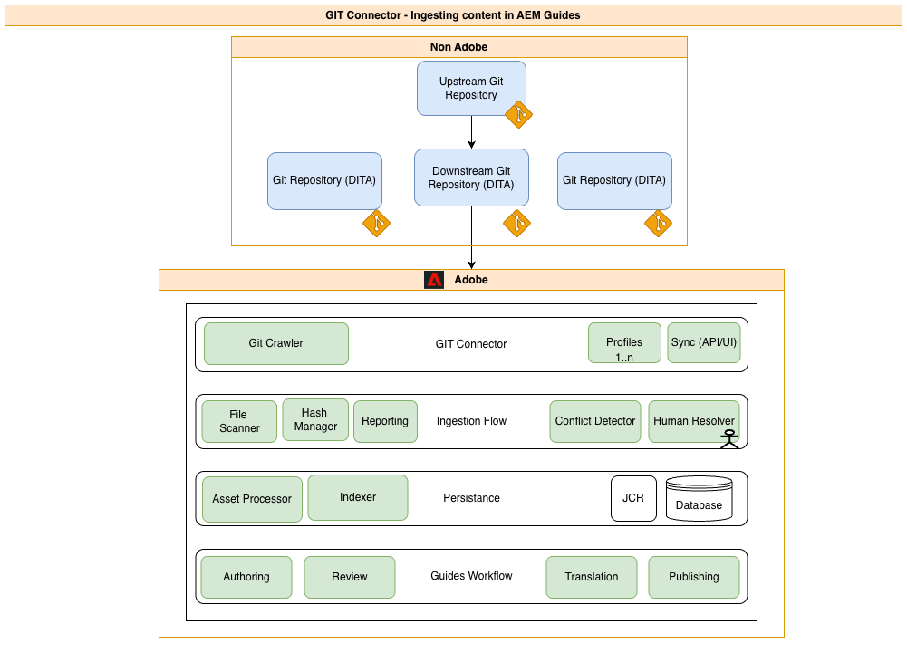
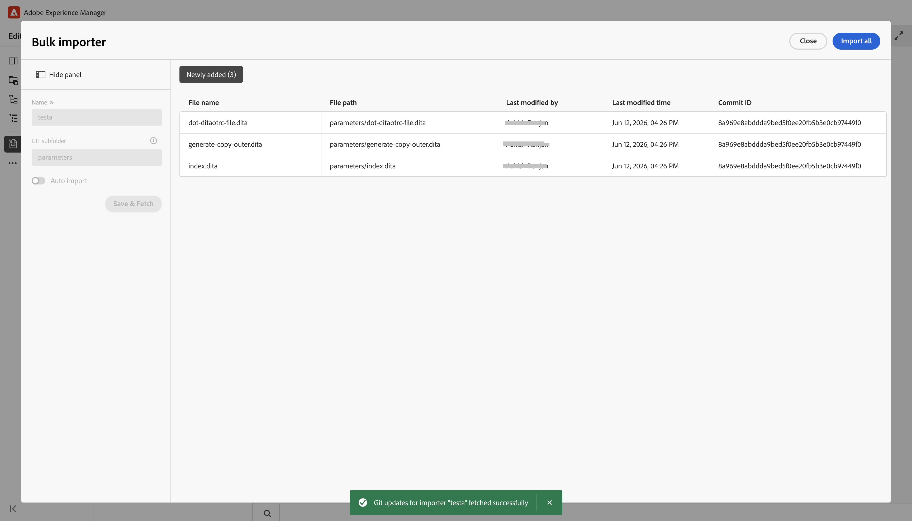
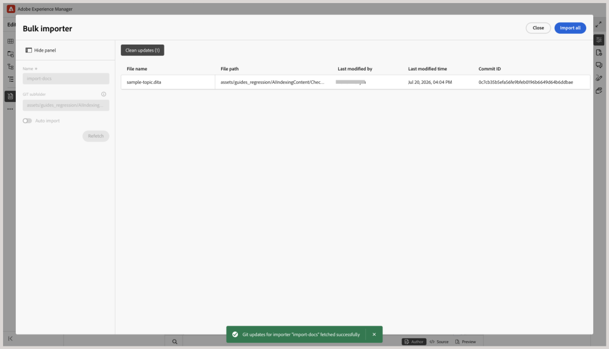

# Git 커넥터를 사용하여 콘텐츠 가져오기

>[!NOTE]
>
> 이 기능은 기본적으로 비활성화되어 있습니다. 환경에서 활성화하려면 고객 지원 팀에 문의하십시오.

Git 커넥터를 사용하면 [연결된 Git 저장소에서 Experience Manager Guides으로 콘텐츠를 가져오기](#import-content-from-the-connected-git-repository)할 수 있습니다. 콘텐츠를 가져온 다음에는 Experience Manager Guides 작성, 검토, 번역 및 게시 기능을 사용하여 설명서를 개발 및 게재할 수 있습니다.

소스 저장소에서 콘텐츠가 변경되면 업데이트를 다시 가져오고, 충돌을 검토하고, 최신 변경 내용을 Experience Manager Guides과 동기화할 수 있습니다.

## 주요 기능

Git 커넥터를 사용하면 작성자가 수동으로 파일을 전송하지 않고 Git 저장소에서 Experience Manager Guides으로 직접 콘텐츠를 가져올 수 있습니다. 구성이 완료되면 작성자는 다음 기능에 액세스할 수 있습니다.

**콘텐츠 수집**

- 모든 Git 저장소(공개 또는 비공개)의 파일을 Experience Manager Guides에 동기화합니다.
- 소스 폴더 경로를 기준으로 필터링하여 전체 저장소가 아닌 단일 하위 디렉터리를 수집합니다.
- `gitignore-aware` 규칙 엔진을 사용하여 `.gitignore` 패턴 또는 사용자 지정 규칙으로 제외된 파일을 자동으로 건너뜁니다.
- 업데이트 후 기존 DITA 상호 참조를 그대로 유지하도록 다시 동기화할 때 GUID를 유지합니다.

**증분(델타) 동기화**

- 마지막으로 동기화된 커밋을 추적하고 전체 저장소를 다시 가져오는 대신 후속 동기화 시 추가, 수정 또는 삭제된 파일만 가져옵니다.
- 가져오기 전에 변경된 모든 파일과 해당 변경 유형을 나열하는 델타 보고서를 생성합니다.
- 저장소 크기에 상관없이 일관된 가져오기 시간을 유지합니다. 벤치마크 데이터의 경우 [성능 벤치마크](#performance-benchmarks)를 확인하십시오.

## Git 커넥터 작동 방식

다음 다이어그램은 Git 커넥터가 어떻게 콘텐츠를 소스 저장소에서 Experience Manager Guides으로 이동하는지를 보여 줍니다.

Git 커넥터는 4단계로 Git 저장소의 콘텐츠를 Experience Manager Guides으로 이동합니다.

1. **크롤링 및 동기화**: 웹 크롤러가 구성된 Git 저장소에 연결하고 콘텐츠를 요청 시 커넥터로 동기화합니다.
1. **충돌 수집 및 감지**: 들어오는 파일을 스캔하고 Experience Manager Guides에 이미 있는 파일을 기준으로 해시합니다. 충돌하는 변경 내용이 없는 파일은 자동으로 이동하며, 충돌하는 변경 내용이 있는 파일은 수동 확인 표시가 됩니다.
1. **유지**: 확인된 콘텐츠가 처리되고 다른 Experience Manager Guides 콘텐츠와 함께 AEM에 저장됩니다.
1. **Experience Manager Guides 워크플로**: 지속되면 다른 Experience Manager Guides 콘텐츠처럼 작성, 검토, 번역 및 게시할 수 있습니다.

## 성능 벤치마크

다음 벤치마크는 저장소 규모가 증가할 때 Experience Manager as a Cloud Service의 전체(증분 아님) **일괄 가져오기** 동기화 시간을 보여 줍니다.

| 크기 조절 | 가져오기 시간 | 가져오기 시간 | 총 시간 | 배치 | 처리량 |
|---|---|---|---|---|---|
| 1,000개 파일 | 100만분 | 300만대 | 5분 29초 | 10×100 | ~286개 파일/분 |
| 5,000개 파일 | 100만분 | 1,800만불 | 2,000만불 | 20×250 | ~273개 파일/분 |
| 10,000개의 파일 | 100만대 | 3,600만불 | 3,700만불 | 40×250 | ~267개 파일/분 |
| 50,000개의 파일 | 1분 25초 | 2시간 43분 | 2시간 58분 | 200×250 | ~270개 파일/분 |

## Git 커넥터를 사용하여 콘텐츠 가져오기

관리자가 Experience Manager Guides에서 Git 커넥터를 구성한 다음에는 편집기에서 이를 사용하여 Git 저장소에서 콘텐츠를 가져올 수 있습니다.

## 사전 요구 사항

이 기능을 사용하기 전에 다음을 확인하십시오.

- 귀하의 환경에 대해 Git 커넥터 기능을 활성화해야 합니다.
- (*활성화된 경우*) 관리자가 환경에 Git 커넥터를 구성했습니다. 자세한 내용은 사용자 인터페이스에서 [Git 커넥터 만들기 및 구성](../install-conf-guide/conf-git-connector.md)을 참조하십시오.
- 가져올 콘텐츠가 포함된 Git 저장소에 대한 *읽기* 액세스 권한이 있습니다.
- 가져올 저장소 분기 및 소스 폴더를 알고 있습니다.
- 가져온 콘텐츠가 저장될 Experience Manager Guides의 대상 폴더를 알 수 있습니다.

## 연결된 Git 저장소에서 콘텐츠 가져오기

Git 저장소에서 콘텐츠를 가져오려면 다음 단계를 수행하십시오.

1. 편집기에서 왼쪽 패널을 엽니다.
1. **데이터 원본**&#x200B;을 선택하세요.

   연결된 데이터 소스가 표시됩니다.

1. **Git 커넥터** 타일을 선택합니다.

1. + 아이콘을 선택한 다음 **일괄 가져오기**&#x200B;를 선택합니다.

   **일괄 가져오기** 대화 상자가 표시됩니다.

   

1. **일괄 가져오기** 대화 상자에서 가져오기 이름을 입력하고 구성된 Git 저장소에서 하위 폴더를 선택한 다음 **저장 및 가져오기**&#x200B;를 선택합니다.  대화 상자에 가져올 수 있는 파일 목록이 표시됩니다. 계속하기 전에 목록을 검토하고 콘텐츠의 유효성을 검사하십시오.

   

1. 파일을 검토한 후 **모두 가져오기**&#x200B;를 선택하여 콘텐츠를 Experience Manager Guides으로 가져옵니다.

   >[!NOTE]
   >
   > 1.0.1 이전 버전의 Git Connector를 사용하는 경우 가져오기 작업 중에 Git 하위 모듈을 포함하는 저장소를 가져오지 못할 수 있습니다. 이 문제를 방지하려면 Git Connector 버전 1.0.1 이상으로 업그레이드하십시오. 버전 1.0.1부터 복제 및 가져오기 중에 Git 하위 모듈을 건너뛰고 주 리포지토리의 콘텐츠만 가져옵니다.

1. *(선택 사항)* **자동 동기화**&#x200B;를 사용하도록 설정하여 Git 저장소에서 Experience Manager Guides으로 콘텐츠를 자동으로 동기화하고 가져올 수 있습니다. 오류가 감지되면 자동 동기화가 트리거되지 않으며 작성자는 **모두 가져오기**&#x200B;를 선택하여 콘텐츠를 수동으로 가져와야 합니다. 자동 동기화가 활성화되면 가져오기에 대해 자동 동기화를 비활성화할 수 없습니다.

콘텐츠를 가져온 후에는 Git 커넥터를 설정할 때 구성된 **Target AEM 루트 경로** 아래에 저장됩니다.

## Git으로 가져온 콘텐츠 관리

콘텐츠를 Experience Manager Guides으로 가져온 다음에는 사용 가능한 작업을 사용하여 콘텐츠를 관리하고 소스 저장소의 변경 사항과 동기화를 유지할 수 있습니다.

{width="600"}

- **미리 보기**: 가져온 콘텐츠를 미리 봅니다. 원본 리포지토리에 업데이트가 포함된 경우 차이점을 검토하고 **다시 가져오기** 옵션을 사용하여 최신 변경 내용을 가져옵니다. 차이점에 병합이 필요한 경우 [Git 커넥터 충돌 해결](#review-and-resolve-content-conflicts)을 확인하십시오.
- **삭제**: 더 이상 필요하지 않은 가져오기를 제거합니다.
- **이름 바꾸기**: 쉽게 식별할 수 있도록 가져오기 이름을 바꿉니다.
- **로그 보기**: 가져오기 작업의 세부 정보를 검토하려면 가져오기 로그를 봅니다.
- **보고서 보기**: 다음과 같은 세부 정보가 포함된 **일괄 가져오기 보고서**&#x200B;를 보고 다운로드합니다.

  - 가져온 총 파일 수
  - 성공한 가져오기 수
  - 실패한 가져오기 수

  {width="600"}

  상세 보고서를 다운로드할 수도 있습니다. 일부 파일을 가져오지 못한 경우 **실패한 가져오기 다시 시도**&#x200B;를 사용하여 파일을 다시 가져오십시오.

## 콘텐츠 충돌 검토 및 해결

Git 저장소에서 콘텐츠를 다시 가져오면 저장소 버전과 Experience Manager Guides에서 사용할 수 있는 해당 콘텐츠 간의 콘텐츠 차이가 충돌로 표시됩니다. 데이터를 Experience Manager Guides으로 가져오기 전에 이러한 충돌을 해결하고 병합해야 합니다.

충돌을 해결하고 병합하려면 다음 단계를 수행하십시오.

1. 일괄 가져오기 대화 상자를 열고 **다시 가져오기**&#x200B;를 선택합니다.
1. 충돌이 감지되면 **병합 필요** 탭이 나타나고 충돌이 있는 파일이 나열됩니다. **병합 필요** 탭을 선택한 다음 목록에서 파일을 선택하여 충돌을 검토하고 해결합니다.
1. 충돌이 있는 파일의 경우 3방향 병합 보기가 표시됩니다.

   

   왼쪽 창(**AEM**)에는 AEM 저장소의 현재 콘텐츠가 표시되고 오른쪽 창(**GIT**)에는 원격 Git 저장소에서 들어오는 콘텐츠가 표시됩니다. 중간 창(**결과**)은 처음에 AEM 저장소 콘텐츠로 채워지고 충돌을 해결하는 병합 편집기 역할을 합니다. 최종 병합된 결과가 생성되고 이 중간 창에 표시됩니다.

1. 편집기에서 강조된 차이점을 검토하고 병합 컨트롤을 사용하여 충돌을 해결합니다.

   - Git 저장소의 최신 변경 사항을 사용하려면 **GIT** 섹션에서 충돌 확인란이 선택되어 있는지 확인한 다음 해당 `<<<` 컨트롤을 선택합니다. 선택한 Git 콘텐츠는 **결과** 섹션에서 충돌하는 콘텐츠를 대체합니다.

     

   - 두 버전 모두에서 콘텐츠를 유지하려면 충돌에 대한 확인란의 선택을 취소한 다음 `<<<` 컨트롤을 사용하여 기존 콘텐츠를 바꾸지 않고 필요한 콘텐츠를 **Result** 섹션에 추가하십시오.

     

   - 마찬가지로 AEM 섹션의 `>>>` 컨트롤을 사용하여 Experience Manager Guides에서 현재 사용 가능한 버전을 유지할 수 있습니다.

1. 병합된 콘텐츠를 검토한 후 다음 작업 중 하나를 수행합니다.

   - **AEM 수락**&#x200B;을 사용하여 **결과** 섹션의 콘텐츠를 **AEM** 섹션의 버전으로 완전히 바꾸고 로컬 변경 사항을 유지합니다.
   - **GIT 수락**&#x200B;을 사용하여 **결과** 섹션의 콘텐츠를 **GIT** 섹션의 버전으로 완전히 바꾸고 저장소를 계속 변경합니다.

위에서 사용하는 옵션에 관계없이 **병합 완료**&#x200B;이 필요합니다. 이 옵션을 선택하면 **Result**&#x200B;의 현재 내용이 해당 파일에 대해 확인된 버전으로 잠기고 파일이 병합된 것으로 표시됩니다.

충돌이 있는 모든 파일이 병합된 것으로 표시되면 **모두 가져오기** 단추가 활성화됩니다. 충돌 해결 프로세스를 완료하려면 **모두 가져오기**&#x200B;를 선택하십시오.

파일이 Git 저장소에서 변경되었지만 Experience Manager Guides에서 수정되지 않은 경우 병합이 필요하지 않습니다. 이러한 파일은 **업데이트 정리**&#x200B;에 자동으로 포함되며 직접 가져올 수 있습니다.

{width="600"}