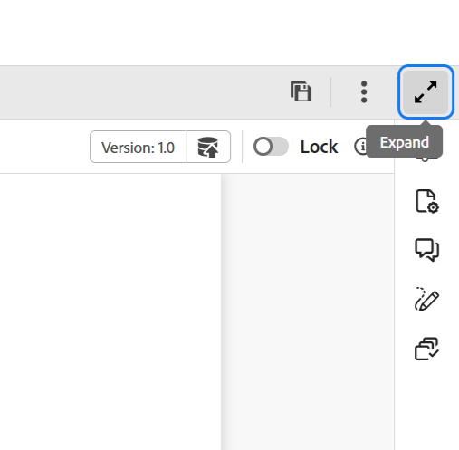

# 편집기의 헤더 막대

헤더 막대는 Adobe Experience Manager 로고(또는 통합 쉘을 Experience Manager Guides UI로 사용하는 경우 통합 쉘)를 표시하는 편집기의 상단 표시줄입니다. 로고를 선택하면 Experience Manager 탐색 페이지로 이동합니다.

>[!BEGINTABS]

>[!TAB 새 편집기]

이 보기는 콘텐츠가 새 편집기에서 렌더링되는 방법을 표시합니다.

>[!TAB 이전 편집기]

이 보기는 콘텐츠가 이전 편집기에서 렌더링되는 방법을 표시합니다

>[!ENDTABS]

도구 모음의 **확장** 아이콘을 사용하여 헤더 표시줄을 숨기고 콘텐츠 영역을 최대화합니다. 표준 보기를 복원하려면 **확장된 보기 종료**&#x200B;를 선택합니다.

{width="350"}

**상위 항목:**&#x200B;[&#x200B;편집기 소개](web-editor.md)
