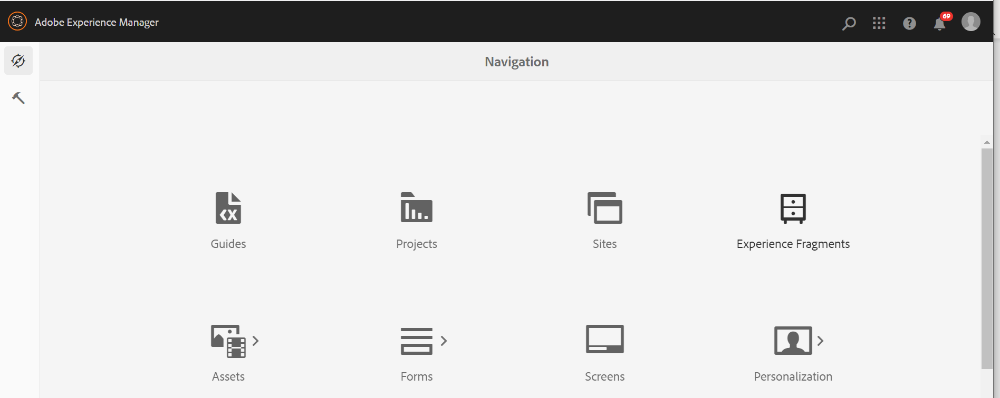
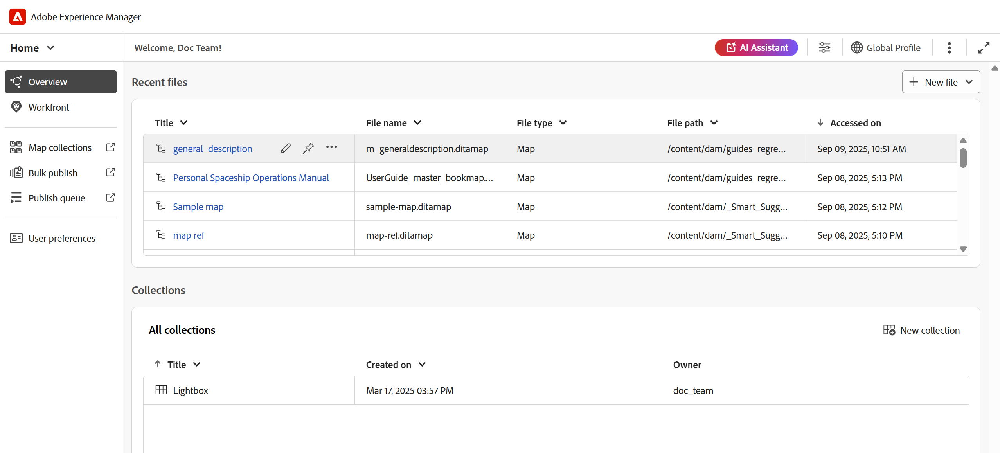

# 편집기 실행 {#id2056B0140HS}

편집기는 다음 위치에서 시작할 수 있습니다.

- [Adobe Experience Manager 탐색 페이지](#adobe-experience-manager-navigation-page)
- [ADOBE EXPERIENCE MANAGER ASSETS UI](#adobe-experience-manager-assets-ui)
- [맵 콘솔](#map-console)

다음 섹션에서는 다양한 위치에서 편집기에 액세스하고 시작할 수 있는 방법에 대한 세부 정보를 다룹니다.

## Adobe Experience Manager 탐색 페이지

Experience Manager에 로그인하면 탐색 페이지가 표시됩니다.

{width="800" align="left"}

**안내서** 링크를 선택하면 [Adobe Experience Manager Guides 홈 페이지](./intro-home-page.md)(으)로 이동합니다.

{width="800" align="left"}

편집기를 시작하려면 탐색 표시줄로 이동한 다음 드롭다운에서 **편집기**&#x200B;를 선택합니다. 기본적으로 홈 페이지가 선택됩니다.

{width="350" align="left"}

파일을 선택하지 않고 편집기를 시작하면 빈 편집기 화면이 표시됩니다. Experience Manager **저장소** 또는 **컬렉션**&#x200B;에서 편집할 파일을 열 수 있습니다.

{width="800" align="left"}

또는 [Adobe Experience Manager Guides 홈 페이지 경험](./intro-home-page.md)의 **최근 파일** 위젯 및 **컬렉션** 위젯에 있는 기존 파일을 열어 편집기를 시작할 수도 있습니다.

Experience Manager 탐색 페이지로 돌아가려면 상단 헤더의 왼쪽 상단 모서리에 있는 Adobe Experience Manager 로고를 선택합니다.

## ADOBE EXPERIENCE MANAGER ASSETS UI

편집기를 시작할 수 있는 다른 위치는 Experience Manager Assets UI에서 가져온 것입니다. 하나 이상의 주제를 선택하여 편집기에서 직접 열 수 있습니다.

편집기에서 항목을 열려면 다음 단계를 수행합니다.

1. Assets UI에서 편집할 항목으로 이동합니다.

   >[!NOTE]
   >
   > 주제의 UUID를 볼 수도 있습니다.

   {width="800" align="left"}

   >[!IMPORTANT]
   >
   > 편집할 주제가 포함된 폴더에 대한 읽기 및 쓰기 권한이 있는지 확인합니다.

1. 주제를 단독으로 잠그려면 주제를 선택하고 **체크 아웃**&#x200B;을 선택합니다.

   >[!IMPORTANT]
   >
   > 관리자가 **파일을 잠그지 않고 편집 비활성화** 옵션을 구성한 경우 편집하기 전에 파일을 체크 아웃해야 합니다. 파일을 체크 아웃하지 않으면 편집 옵션을 볼 수 없습니다.

1. 에셋 선택 모드를 닫고 편집할 항목을 선택합니다.

   주제의 미리보기가 표시됩니다.

   편집기는 목록 보기, 카드 보기 및 미리보기 모드에서 열 수 있습니다.

   >[!IMPORTANT]
   >
   > 편집할 항목을 여러 개 열려면 자산 UI에서 원하는 항목을 선택하고 **편집**&#x200B;을 선택합니다. 브라우저에 팝업 차단이 활성화되어 있지 않은지, 아니면 선택한 목록의 첫 번째 주제만 편집을 위해 열려 있는지 확인합니다.

   {width="800" align="left"}

   항목을 미리 보지 않고 편집기에서 직접 열려면 카드 보기의 빠른 작업 메뉴에서 **편집** 아이콘을 선택합니다.

   {width="800" align="left"}

   항목이 편집기에서 열립니다.

   {width="800" align="left"}

Assets UI에서 맵 파일을 열고 편집기를 실행하여 맵 파일의 항목을 편집할 수도 있습니다.

편집기에서 맵을 열려면 다음 단계를 수행합니다.

1. Assets UI에서 편집할 주제가 포함된 맵 파일로 이동하여 선택합니다.
1. DITA 맵 콘솔에서 **주제** 탭으로 이동합니다. 맵 파일의 주제 목록이 표시됩니다.
1. 편집할 주제 파일을 선택합니다.
1. **주제 편집**&#x200B;을 선택합니다.

   {width="800" align="left"}

1. 항목이 편집기에서 열립니다.

   >[!IMPORTANT]
   >
   > 관리자가 **파일을 잠그지 않고 편집 비활성화** 옵션을 구성한 경우 편집하기 전에 파일을 체크 아웃해야 합니다. 파일을 체크 아웃하지 않으면 문서가 편집기에서 읽기 전용 모드로 열립니다.

## 맵 콘솔

맵 콘솔에서 편집기를 열려면 다음 단계를 따르십시오.

1. 홈 페이지를 열고 맵 콘솔을 시작합니다.

   {width="350" align="left"}

   맵 파일을 선택하지 않고 맵 콘솔을 시작하면 빈 맵 콘솔 화면이 표시됩니다. Experience Manager **저장소** 또는 **컬렉션**&#x200B;에서 맵 파일을 열 수도 있습니다.

   {width="500" align="left"}

1. 편집기에서 편집할 항목이 들어 있는 맵 파일을 열려면 **맵 선택**&#x200B;을 선택하십시오.
1. 맵 파일이 있는 경로를 선택합니다. 선택한 맵 파일이 맵 콘솔에 추가됩니다.
1. 맵 파일로 이동하여 드롭다운에서 **편집기에서 열기**&#x200B;를 선택합니다.

   {width="800" align="left"}

   항목이 들어 있는 맵 파일이 편집기에서 편집을 위해 열려 있습니다.

   {width="800" align="left"}

**상위 항목**: [편집기 소개](web-editor.md)
