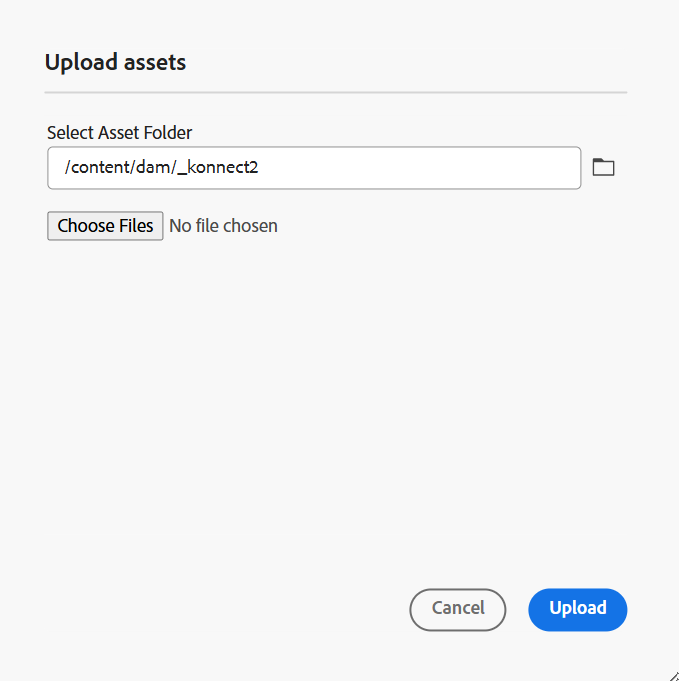
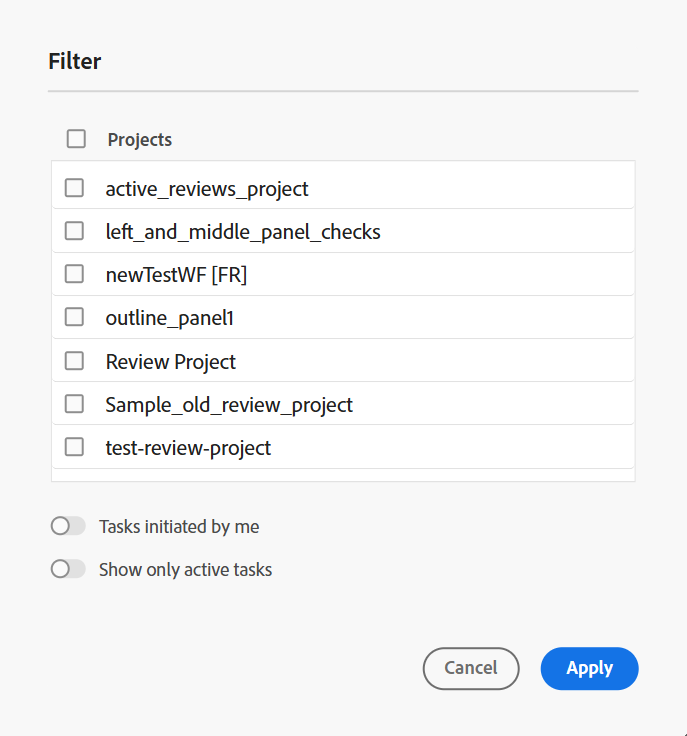

# 편집기의 왼쪽 패널

왼쪽 패널에서 컬렉션, 저장소 보기, 맵 보기 및 기타 기능에 빠르게 액세스할 수 있습니다. 인터페이스의 왼쪽 아래 모서리에 있는 **확장** 아이콘을 선택하여 패널을 확장할 수 있습니다. 확장되면 **축소** 아이콘을 사용하여 패널을 축소합니다. 확장된 보기에서는 축소된 보기에서 도구 설명으로 나타나는 아이콘의 이름을 표시합니다.

>[!NOTE]
>
> 왼쪽 패널의 크기는 조정할 수 있습니다. 패널 크기를 조정하려면 패널 경계에 커서를 놓고 커서가 양방향 화살표로 바뀌면 을 선택하고 드래그하여 패널 폭의 크기를 조정합니다.

왼쪽 패널에서 다음 기능에 액세스할 수 있습니다.

- [컬렉션](#collections)
- [저장소](#repository)
- [맵](#map)
- [재사용 가능한 콘텐츠](#reusable-content)
- [개요](#outline)

왼쪽 패널의 기능 중 일부는 **자세히** 섹션에서 사용할 수 있습니다. 아래 기능에 액세스하려면 자세히 아이콘 을(를) 선택하십시오.

- [용어 설명](#glossary)
- [조건](#conditions)
- [주제 계획](#subject-scheme)
- [스니펫](#snippets)
- [템플릿](#templates)
- [인용](#citations)
- [언어 변수](#language-variables)
- [변수](#variables)
- [찾기 및 바꾸기](#find-and-replace)
- [PDF 템플릿](#pdf-templates)
- [검토](#review)


Adobe Workfront이 구성된 경우 **Workfront**(으)로 레이블이 지정된 추가 옵션이 왼쪽 패널에도 표시됩니다.

자세한 내용은 [Workfront 통합](./workfront-integration.md)을 참조하세요.

>[!NOTE]
>
> 왼쪽 패널에서 사용할 수 있는 기능은 관리자가 관리하므로 왼쪽 패널에 있는 개별 기능을 활성화하거나 비활성화할 수 있습니다. 활성화된 피쳐만 왼쪽 패널에 표시됩니다. 자세한 내용은 **탭 모음**&#x200B;의 [패널](./web-editor-tab-bar.md) 섹션을 참조하십시오.

왼쪽 패널 기능에 대한 자세한 설명은 다음과 같습니다.

## 컬렉션

파일 또는 폴더 세트에서 작업하는 경우 즐겨찾는 목록에 추가하여 빠르게 액세스할 수 있습니다. **컬렉션**&#x200B;은(는) 추가한 문서 목록과 다른 사용자가 공개적으로 액세스할 수 있는 문서 목록을 표시합니다.

기본적으로 제목별로 파일을 볼 수 있습니다. 파일 위로 마우스를 가져가면 파일 제목과 파일 경로를 도구 설명으로 볼 수 있습니다.

>[!NOTE]
>
> 관리자는 편집기에서 파일 이름별로 파일 목록을 보도록 선택할 수도 있습니다. **사용자 환경 설정**&#x200B;에서 **편집기 파일 표시 구성** 섹션의 **파일 이름** 옵션을 선택하십시오.

<details>
    <summary> 새로운 컬렉션 만들기 </summary>


새 컬렉션을 만들려면 컬렉션 패널 옆에 있는 + 아이콘을 선택하여 **새 컬렉션** 대화 상자를 표시합니다.

{width="300" align="left"}

만들려는 컬렉션의 제목과 설명을 입력합니다. **공개**&#x200B;를 선택하면 이 즐겨찾기가 다른 사용자에게도 표시됩니다.

>[!NOTE]
>
> Experience Manager Guides 홈 페이지에서 컬렉션을 만들 수도 있습니다. 홈 페이지를 열고 **개요 섹션**&#x200B;에서 [컬렉션](./intro-home-page.md#overview) 위젯으로 이동한 다음 **새 컬렉션**&#x200B;을 선택합니다.

</details>

<details>
    <summary> 컬렉션에 파일 추가 </summary>


파일을 컬렉션에 추가하려면 다음 방법 중 하나를 사용하십시오.

- 저장소 보기에서 필요한 파일 또는 폴더로 이동하고 *옵션* 아이콘을 선택하여 컨텍스트 메뉴를 열고 **추가** > **컬렉션**&#x200B;을 선택합니다. **컬렉션에 추가** 대화 상자에서 기존 즐겨찾기에 파일/폴더를 추가하거나 새 즐겨찾기를 만들 수 있습니다.

  {width="300" align="left"}

- 편집기에서 파일의 탭을 마우스 오른쪽 단추로 클릭하여 컨텍스트 메뉴를 엽니다. 즐겨찾기 목록에 파일을 추가하려면 **다음에 추가** > **컬렉션**&#x200B;을 선택하십시오.

  {align="left"}


>[!NOTE]
>
> - 즐겨찾기 목록에서 항목을 제거하려면 즐겨찾기 컬렉션의 항목 옆에 있는 옵션 아이콘을 선택하고 **컬렉션에서 제거**&#x200B;를 선택하십시오.
> - 파일을 열지 않고 미리 보려면 파일을 선택한 다음 옵션 메뉴에서 **미리 보기**&#x200B;를 선택합니다.

</details>

**컬렉션에 대한 옵션 메뉴**

컬렉션에 사용할 수 있는 옵션 메뉴를 사용하여 여러 작업을 수행할 수도 있습니다.

{width="650" align="left"}

- **이름 바꾸기**: 선택한 컬렉션의 이름을 바꿉니다.
- **삭제**: 선택한 컬렉션을 삭제합니다.
- **새로 고침**: 저장소에서 파일 및 폴더의 새 목록을 가져옵니다.
- **Assets UI에서 보기**: Assets UI에 파일 또는 폴더 내용을 표시합니다.

>[!NOTE]
>
> 맨 위에 있는 **새로 고침** 아이콘을 사용하여 목록을 새로 고칠 수 있습니다. 또한 목록을 새로 고치면 컬렉션이 다시 로드되므로 패널의 확장된 컬렉션이 축소됩니다.


## 저장소

저장소 아이콘을 선택하면 DAM에서 사용할 수 있는 파일 및 폴더 목록이 표시됩니다. 기본적으로 제목별로 파일을 볼 수 있습니다. 파일 위로 마우스를 가져가면 파일 제목과 파일 이름을 도구 설명으로 볼 수 있습니다.

>[!NOTE]
>
> 관리자는 편집기에서 파일 이름별로 파일 목록을 보도록 선택할 수도 있습니다. **사용자 환경 설정**&#x200B;에서 **편집기 파일 표시 구성** 섹션의 **파일 이름** 옵션을 선택하십시오.

한 번에 75개의 파일이 로드됩니다. **추가 로드**...를 선택할 때마다 75개의 파일이 로드되고 모든 파일이 나열되면 단추가 표시되지 않습니다. 이 배치 로드는 효율적이며 폴더에 있는 모든 파일을 로드하는 것에 비해 파일에 더 빨리 액세스할 수 있습니다.

DAM 내에서 필요한 파일로 이동하여 편집기에서 열 수 있습니다. 파일을 편집하는 데 필요한 액세스 권한이 있는 경우 그렇게 할 수 있습니다.

편집기에서 오디오 또는 비디오 파일을 선택하여 재생할 수도 있습니다. 볼륨을 변경하거나
비디오 보기입니다. 바로 가기 메뉴에는 다운로드 옵션을 사용하여 재생을 변경할 수도 있습니다
속력 또는 화면 속 화면을 봅니다.

맵을 선택하고 Enter 키를 누르거나 두 번 클릭하여 **맵 보기**&#x200B;에서 엽니다. 자세한 내용은 왼쪽 패널에서 **맵 보기** 기능 설명을 참조하십시오. 항목을 선택하고 Enter 키를 누르거나 두 번 클릭하여 [콘텐츠 편집 영역](./web-editor-content-editing-area.md)에서 엽니다. 편집기에서 직접 파일을 탐색하고 열 수 있으므로 시간이 절약되고 생산성이 향상됩니다.

**저장소에서 검색 필터링**

편집기에서 텍스트 검색을 위해 향상된 필터를 제공합니다. Adobe Experience Manager 저장소의 선택한 경로에 있는 파일에서 텍스트를 검색하고 필터링할 수 있습니다. 파일의 제목, 파일 이름 및 내용을 검색합니다.


{width="300" align="left"}

*필터를 적용하여`personal spaceship.`* 텍스트가 포함된 파일을 검색합니다.

**필터 검색** \(\) 아이콘을 선택하여 필터 팝업을 엽니다.

>[!NOTE]
>
> 텍스트를 검색하거나 파일을 필터링하면 **필터 검색** \(\) 아이콘에 파란색 점이 표시되어 검색 패널에 있으며 일부 필터가 적용되었음을 나타냅니다.


다음과 같은 옵션을 사용하여 파일을 필터링하고 Adobe Experience Manager 저장소에서 검색 범위를 좁힐 수 있습니다.

- **DITA 파일**: 선택한 경로에 있는 모든 **DITA 주제** 및 **DITA 맵**&#x200B;을(를) 찾을 수 있습니다. 기본적으로 선택되어 있습니다.
- **DITA가 아닌 파일**: 선택한 경로에서 **Ditaval 파일**, **이미지 파일**, **멀티미디어**, **문서** 및 **JSON**&#x200B;을 검색할 수 있습니다.

   {width="300" align="left"}

  *빠른 필터를 사용하여 DITA 및 비 DITA 파일을 검색합니다.*

>[!NOTE]
>
> 또한 **DITA 항목** 필터를 사용하여 제목, 주제 내용 및 속성을 비롯하여 저장소의 Markdown 파일과 관련된 내용을 검색할 수 있습니다. 이 기능은 현재 새로 만든 Markdown 파일에만 적용됩니다.

**고급 필터링**

**고급 필터링** 아이콘을 선택하여 **고급 필터** 대화 상자를 표시합니다.

**일반** 및 **고급** 탭에서 다음 옵션을 볼 수 있습니다.

 {width="650" align="left"}


**일반**

- **검색 결과 사용**: Adobe Experience Manager 저장소의 선택한 경로에 있는 파일에서 일부 텍스트를 검색합니다. 텍스트는 파일의 제목, 파일 이름 및 콘텐츠에서 검색됩니다.

저장소 창의 검색 상자와 동기화됩니다. 예를 들어 저장소 패널의 검색 상자에 `general purpose`을(를) 입력하면 **고급 필터** 대화 상자도 표시되고 그 반대의 경우도 마찬가지입니다.

- **다음에서 검색**: Adobe Experience Manager 저장소에 있는 파일을 검색할 경로를 선택하십시오.
- **DITA 파일**: 선택한 경로에 있는 모든 **DITA 주제** 및 **DITA 맵**&#x200B;을(를) 찾을 수 있습니다. 기본적으로 선택되어 있습니다.
- **DITA가 아닌 파일**: 선택한 경로에서 **Ditaval 파일**, **이미지 파일**, **멀티미디어**, **문서** 및 **JSON**&#x200B;을 검색할 수 있습니다.
- **잠근 사용자**: 사용자 목록을 표시합니다. 목록의 페이지가 매겨지고 비동기적으로 로드되어 한 번에 제한된 사용자 세트를 표시하고 스크롤하거나 이동할 때 더 많은 사용자를 가져옵니다. 따라서 특히 많은 수의 사용자로 작업할 때 로드 속도와 전체 성능이 향상됩니다.
- **다음 날짜 이후에 수정됨** / **다음 날짜 이전에 수정됨**: 수정 날짜를 기준으로 콘텐츠를 필터링합니다. 달력에서 날짜 범위를 선택하거나 다음 시간대 옵션 중 하나를 선택합니다.
   - 지난 2시간
   - 지난 주
   - 지난 달
   - 작년
- **태그**: 태그를 기반으로 콘텐츠를 필터링합니다.

**고급**

- **DITA 요소**: 지정된 DITA 요소의 특성에서 특정 값을 검색할 수도 있습니다.
   - 요소, 특성 및 값을 추가하려면 **요소 추가**&#x200B;를 선택하십시오.
   - 선택한 필터를 적용합니다.

- 적용된 필터를 모두 지우려면 **모두 지우기**&#x200B;를 선택하십시오.


- **필터 닫기**  아이콘을 선택하여 필터를 닫고 저장소의 트리 보기로 돌아갑니다.

  >[!NOTE]
  >
  >시스템 관리자는 텍스트 필터를 구성하고 다른 필터를 표시하거나 숨길 수도 있습니다. 자세한 내용은 Adobe Experience Manager Guides as a Cloud Service 설치 및 구성 의 *텍스트 필터 구성* 섹션을 참조하십시오.
  >
  >검색된 텍스트가 포함된 필터링된 파일 목록이 표시됩니다. 예를 들어 `personal spaceship` 텍스트가 포함된 파일은 이전 스크린샷에 나열됩니다. 필터링된 목록에서 여러 파일을 선택하여 편집을 위해 연 맵으로 끌어서 놓을 수 있습니다.

**옵션 메뉴**

왼쪽 패널에서 파일을 여는 것 외에도 저장소 보기에서 사용할 수 있는 옵션 메뉴를 사용하여 여러 작업을 수행할 수도 있습니다. 폴더, 주제 파일 또는 미디어 파일 중 어느 것을 선택하느냐에 따라 다른 옵션이 표시됩니다.

**폴더 옵션**

저장소 보기의 *폴더*&#x200B;에 사용할 수 있는 옵션 메뉴를 사용하여 다음 작업을 수행할 수 있습니다.

{width="550" align="left"}


- **새로 만들기**: 새 DITA 주제, DITA 맵 또는 폴더를 만듭니다.

<details>
    <summary> 새 주제를 만드는 단계 </summary>

새 주제를 만드는 단계:
1. **새로 만들기** > **주제**&#x200B;를 선택합니다.
2. **새 항목** 대화 상자가 표시됩니다.

   {width="300" align="left"}

3. **새 항목** 대화 상자에서 다음 세부 정보를 제공합니다.
   - 주제 제목.
   - \(선택 사항\)* 항목의 파일 이름입니다. 파일 이름은 제목 항목을 기반으로 자동 제안됩니다. 관리자가 UUID 설정을 기반으로 자동 파일 이름을 활성화한 경우 이름 필드가 표시되지 않습니다.
   - 주제의 기반이 되는 템플릿입니다. 예를 들어 기본 설정의 경우 빈 템플릿, 개념, DITAVAL, 참조, 작업, 주제, Markdown, 용어집 및 문제 해결 템플릿 중에서 선택할 수 있습니다. 폴더에 폴더 프로필이 구성되어 있으면 폴더 프로필에 구성된 주제 템플릿만 표시됩니다.

   - 주제 파일을 저장할 경로입니다. 기본적으로 현재 저장소에서 선택한 폴더의 경로가 경로 필드에 표시됩니다.
4. **만들기**&#x200B;를 선택합니다. 지정한 경로에 주제가 만들어집니다. 또한 편집기에서 편집할 주제가 열립니다.

</details>

<details>
<summary> 새 DITA 맵을 만드는 단계 </summary>


새 DITA 맵을 만드는 단계:

1. **새로 만들기** > **DITA 맵**&#x200B;을 선택합니다.
2. **새 맵** 대화 상자가 표시됩니다.

   {width="300" align="left"}

3. **새 맵** 대화 상자에서 다음 세부 정보를 제공합니다.
   - 지도의 제목
   - *\(선택 사항\)* 맵의 파일 이름입니다. 맵 제목을 기반으로 파일 이름이 자동으로 제안됩니다. 관리자가 UUID 설정을 기반으로 자동 파일 이름을 활성화한 경우 이름 필드가 표시되지 않습니다.
   - 맵의 기반이 되는 템플릿입니다. 예를 들어 기본 설정의 경우 북맵 또는 DITA 맵 템플릿 중에서 선택할 수 있습니다.
   - 맵 파일을 저장할 경로입니다. 기본적으로 현재 저장소에서 선택한 폴더의 경로가 경로 필드에 표시됩니다.
4. **만들기**&#x200B;를 선택합니다. 맵이 생성되고 경로 필드에 지정된 폴더 내에 추가됩니다. 또한 맵은 맵 보기에서 열립니다. 맵 편집기에서 맵 파일을 열고 항목을 추가할 수 있습니다. 맵 파일에 항목을 추가하는 방법에 대한 자세한 내용은 [맵 만들기](map-editor-create-map.md#)를 참조하십시오. 또는 **맵 콘솔에서 열기**&#x200B;를 선택하여 맵 콘솔에서 맵을 엽니다.
</details>

<details>
<summary> 새 폴더를 만드는 단계 </summary>

새 폴더를 만드는 단계:

1. **새로 만들기** > **폴더**&#x200B;를 선택합니다.
2. **새 폴더** 대화 상자가 표시됩니다.

   {width="300" align="left"}

3. **새 폴더** 대화 상자에서 다음 세부 정보를 제공합니다.
   - 폴더 이름으로 자동 변환되는 폴더의 제목
   - 폴더를 저장할 경로입니다. 기본적으로 현재 저장소에서 선택한 폴더의 경로가 경로 필드에 표시됩니다.
4. **만들기**&#x200B;를 선택합니다. 폴더가 만들어지고 폴더 만들기 옵션이 실행된 폴더 내에 추가됩니다.

</details>

- **Assets 업로드**: 로컬 시스템에서 Adobe Experience Manager 저장소의 선택한 폴더로 파일을 업로드합니다. 로컬 시스템에서 현재 작업 주제로 파일을 드래그 앤 드롭할 수도 있습니다. 로컬 시스템의 이미지를 주제에 삽입하려는 경우 매우 유용합니다.

  {width="300" align="left"}

  파일을 업로드할 폴더를 선택할 수 있으며 이미지 미리 보기도 표시됩니다. 파일 이름을 바꾸려면 파일 이름 텍스트 상자에서 이름을 바꿀 수 있습니다. **업로드**&#x200B;를 선택하여 파일 업로드 프로세스를 완료합니다. 주제에 이미지 파일을 드래그하여 놓은 경우 문서에 이미지 파일이 추가되고 업로드됩니다.

  관리자가 *XMLEditorConfig*&#x200B;에서 UUID 옵션을 활성화한 경우 **Source** 속성에서 업로드된 이미지의 UUID를 볼 수 있습니다.

  {align="left"}

- **폴더에서 파일 찾기**: 검색어를 입력할 수 있는 저장소 검색으로 포커스를 이동합니다. 검색은 저장소의 선택한 폴더에서 수행됩니다. 필터를 적용하여 DITA 파일, 이미지 파일 또는 둘 다 반환할 수도 있습니다.

  {width="300" align="left"}

  파일의 UUID를 사용하여 검색할 수도 있습니다. 이 경우 검색 결과에 DITA/XML 파일의 제목이 표시되고 파일이 이미지 파일인 경우 파일의 UUID가 표시됩니다. 다음 검색 예에서 이미지 파일의 UUID를 검색하고 검색 결과에 원본 이미지 파일의 UUID와 해당 이미지가 참조된 파일의 주제 제목이 표시됩니다.

  {width="300" align="left"}

- **축소**: 저장소에서 선택한 폴더를 축소합니다.

  >[!NOTE]
  >
  > 폴더 옆에 있는 **\>** 아이콘을 사용하여 확장하십시오.

- **컬렉션에 추가**: 선택한 폴더를 즐겨찾기에 추가합니다. 기존 또는 새 컬렉션에 추가할 수 있습니다.

- **새로 고침**: 저장소에서 파일 및 폴더의 새 목록을 가져옵니다.
- **Assets UI에서 보기**: Assets UI에서 폴더 콘텐츠를 표시합니다.

**파일에 대한 옵션**

미디어 파일을 선택했는지 DITA 파일을 선택했는지에 따라 옵션 메뉴의 다른 옵션에 액세스할 수 있습니다. 미디어 및 DITA 파일 모두에서 사용할 수 있는 몇 가지 일반적인 옵션은 다음과 같습니다.

- 편집
- FrameMaker에서 열기
- 복제
- 잠금/잠금 해제
- 미리보기
- 다음으로 이동
- 이름 바꾸기
- 삭제
- 생성
- PDF으로 다운로드
- 추가
- 복사
- Assets UI에서 보기
- 속성


저장소 보기에 있는 파일의 {width="550" align="left"}

옵션 메뉴의 다양한 옵션은 아래에 설명되어 있습니다.

- **편집**: 편집할 파일을 엽니다. .ditamap/.bookmap 파일의 경우 편집할 수 있도록 [맵 편집기](map-editor-advanced-map-editor.md#)에서 열립니다.

- **복제**: 이 옵션을 사용하여 선택한 파일의 복제나 복사본을 만드십시오. 또한 Duplicate Asset 프롬프트에서 중복 파일의 이름을 바꿀 수도 있습니다. 기본적으로 파일은 접미사 \(예: filename\_1.extension\)로 작성됩니다. 파일 제목은 소스 파일과 동일하게 유지되며 새 파일은 버전 1.0으로 시작됩니다. 모든 참조, 태그 및 메타데이터는 복사되며 기준선은 중복 파일에 복사되지 않습니다.
- **잠금**: 편집하기 위해 선택한 파일을 잠급니다. 파일이 잠겨 있으면 잠금 아이콘 위로 마우스 포인터를 가져가면 사용자가 잠근 경우 **사용자가 잠근 경우**, 다른 사용자가 잠근 경우 **사용자가 잠근 경우 [사용자 이름]**&#x200B;이 표시됩니다.

- **미리 보기**: 파일(.dita, .xml, 오디오, 비디오 또는 이미지)을 열지 않고 빠르게 미리 봅니다. 미리 보기 창의 크기를 조정할 수 있습니다. 콘텐츠에 `<xref>` 또는 `<conref>`이(가) 포함되어 있으면 선택하여 새 탭에서 열 수 있습니다. 파일 제목이 창에 나타납니다. 제목이 없으면 파일 이름이 나타납니다. **미리 보기** 패널을 닫으려면 닫기 아이콘을 선택하거나 창 바깥쪽을 선택할 수 있습니다.

  {align="left"}

- **이름 바꾸기**: 선택한 파일의 이름을 바꾸려면 이 옵션을 사용합니다. **자산 이름 바꾸기** 대화 상자에 새 파일 이름을 입력하십시오.
   - 모든 유형의 파일 이름을 바꿀 수 있습니다.
   - 파일의 확장자는 변경할 수 없습니다.
   - 두 파일의 이름은 같을 수 없습니다. 따라서 파일 이름을 이미 존재하는 이름으로 바꿀 수는 없습니다. 오류가 표시됩니다.

- **이동**: 선택한 파일을 다른 폴더로 이동하려면 이 옵션을 사용합니다.
   - 대상 폴더의 이름을 입력하거나 **경로 선택**&#x200B;을 선택하여 대상 폴더를 선택할 수 있습니다.
   - 모든 유형의 파일을 콘텐츠 폴더 내의 모든 대상으로 이동할 수 있습니다.
   - 두 파일의 이름은 같을 수 없습니다. 따라서 같은 이름의 파일이 이미 있는 폴더로 파일을 이동할 수 없습니다.

  이름이 같지만 제목이 다른 파일이 있는 폴더로 파일을 이동하려고 하면 파일 이름 바꾸기 및 이동 대화 상자가 표시되고 파일을 이동하기 전에 파일 이름을 변경해야 합니다. 대상 폴더에서 이동된 파일의 새 파일 이름이 표시됩니다.

  {width="550" align="left"}

  >[!NOTE]
  >
  > 파일을 다른 대상 폴더로 끌어다 놓을 수도 있습니다.

  **제외 시나리오**

  Experience Manager Guides에서는 다음 시나리오에서 파일 이름을 바꾸거나 파일을 이동할 수 없습니다.

   - 검토 또는 번역 워크플로의 일부인 파일은 이동하거나 이름을 바꿀 수 없습니다.

   - 다른 사용자가 파일을 잠근 경우 해당 파일의 이름을 바꾸거나 이동할 수 없으면 파일에 대한 이름 바꾸기 또는 이동 옵션이 표시되지 않습니다.

  >[!NOTE]
  >
  > 관리자가 폴더에 대한 권한을 부여한 경우 **이름 바꾸기** 또는 **이동** 옵션만 표시됩니다.

  <details>
    <summary> 클라우드 서비스 </summary>

  모든 파일에 고유한 UUID가 있으므로 파일 이름을 바꾸거나 파일을 이동해도 파일에 대한 기존 참조가 손상되지 않습니다.
  </details>

- **삭제**: 선택한 파일을 삭제하려면 이 옵션을 사용하십시오. 파일을 삭제하기 전에 확인 메시지가 표시됩니다.

   - 파일을 삭제하기 전에 확인 메시지가 표시됩니다.
   - 파일이 다른 파일에서 참조되지 않으면 삭제되고 성공 메시지가 표시됩니다.
   - 파일이 잠겨 있으면 삭제할 수 없으며 오류 메시지가 표시됩니다.

     >[!NOTE]
     >
     > 관리자가 잠긴 파일의 삭제를 금지한 경우 오류 메시지만 표시됩니다. 자세한 내용은 Adobe Experience Manager Guides as a Cloud Service 설치 및 구성 섹션에서 *체크 아웃된 파일의 삭제 방지* 섹션을 참조하십시오.

   - 파일을 컬렉션에 추가하면 **강제 삭제** 대화 상자가 표시되고 파일을 강제로 삭제할 수 있습니다.
   - 파일이 다른 파일에서 참조되는 경우 확인 메시지가 포함된 **강제 삭제** 대화 상자가 표시되고 파일을 강제로 삭제할 수 있습니다.

     {width="300" align="left"}

     >[!NOTE]
     >
     > 관리자가 파일 삭제 권한을 부여한 경우 **강제 삭제**&#x200B;을(를) 사용할 수 있습니다. 그렇지 않으면 **강제 삭제**&#x200B;가 비활성화되고 참조된 파일을 삭제할 권한이 없다는 메시지가 표시됩니다. 자세한 내용은 Adobe Experience Manager Guides as a Cloud Service 설치 및 구성 섹션에서 *참조된 파일 삭제 방지* 섹션을 참조하십시오.

   - 참조된 항목을 삭제하고 편집을 위해 참조가 포함된 파일을 연 경우 참조된 파일에 대한 끊어진 링크가 표시됩니다.

  >[!NOTE]
  >
  > 키보드의 Delete 키를 사용하여 선택한 파일을 삭제할 수도 있습니다.

- **복사**: 다음 옵션 중에서 선택할 수 있습니다.

   - **UUID 복사**: 선택한 파일의 UUID를 클립보드에 복사합니다.

   - **경로 복사**: 선택한 파일의 전체 경로를 클립보드에 복사합니다.

- **추가**: 다음 옵션 중에서 선택할 수 있습니다.
   - **컬렉션**: 선택한 파일을 컬렉션에 추가합니다. 기존 또는 새 컬렉션에 추가할 수 있습니다.

   - **재사용 가능한 콘텐츠**: 선택한 파일을 왼쪽 패널의 재사용 가능한 콘텐츠 목록에 추가합니다.

- **속성**: 선택한 파일의 속성 페이지를 여는 데 사용합니다. 파일을 선택한 다음 도구 모음에서 속성 아이콘을 선택하여 Assets UI에서 이 속성 페이지에 액세스할 수도 있습니다.

- **맵 대시보드에서 열기**: 선택한 파일이 DITA 맵인 경우 이 옵션은 맵 대시보드를 엽니다.

- **맵 콘솔에서 열기**: 선택한 파일이 DITA 맵인 경우 이 옵션을 사용하면 맵 콘솔이 열립니다.

- **산소에서 편집**: Oxygen 커넥터 플러그인에서 선택한 파일을 편집하려면 이 옵션을 선택하십시오. 편집할 파일이 열립니다.

  >[!NOTE]
  >
  >고객 지원 팀에 문의하여 이 기능을 환경에서 활성화하십시오. 이 기능은 기본 지원의 일부로 활성화되지 않습니다. 자세한 내용은 설치 및 구성 안내서의 [Configure to edit in Oxygen](../cs-install-guide/conf-edit-in-oxygen.md) 섹션을 참조하십시오.


- **Assets UI에서 보기**: Assets UI에서 .dita/.xml 파일의 미리 보기를 표시할 때 사용합니다. .ditamap/.bookmap 파일의 경우 맵 내의 모든 주제 파일이 하나의 통합된 페이지별 보기로 표시됩니다.

- **PDF으로 다운로드**: 옵션을 사용하여 PDF 출력을 생성하고 다운로드합니다.

- **생성**: 맵 내의 항목을 Sites 페이지, 콘텐츠 조각 또는 경험 조각에 게시하려면 옵션을 사용합니다.

## 맵

맵 보기 아이콘을 선택하면 맵 파일 내의 주제 목록이 표시되는 맵 보기가 표시됩니다. 맵 파일을 열지 않은 경우 맵 보기가 비어 있습니다. 맵 파일을 두 번 클릭하면 이 보기에서 맵 파일이 열립니다. 맵 내의 파일을 두 번 클릭하여 편집기에서 열 수 있습니다.

기본적으로 제목별로 파일을 볼 수 있습니다. 파일 위로 마우스를 가져가면 파일 제목과 파일 경로를 도구 설명으로 볼 수 있습니다.

>[!NOTE]
>
>관리자는 맵 보기에서 현재 열려 있는 상위 맵의 파일 이름을 보도록 선택할 수도 있습니다. **사용자 환경 설정**&#x200B;에서 **편집기 파일 표시 구성** 섹션의 **파일 이름** 옵션을 선택하십시오.


맵 보기에서 맵을 열면 현재 맵의 제목이 탭 모음 중앙에 표시됩니다. 제목이 너무 길면 줄임표가 표시되고 제목 위로 마우스를 가져가면 도구 설명에 전체 제목을 볼 수도 있습니다.

주제 또는 맵 참조에 대한 키 속성을 정의하면 왼쪽 패널에서 제목, 해당 아이콘 및 키를 볼 수 있습니다. 키가 `keys=<key-name>`(으)로 표시됩니다.

맵 보기의 {width="300" align="left"}

맵 파일에 대한 편집 권한이 있으면 파일도 편집할 수 있습니다. DITA 맵을 통해 주제를 열고 편집하는 방법에 대한 자세한 내용은 [DITA 맵을 통해 주제 편집](map-editor-advanced-map-editor.md#id17ACJ0F0FHS)을 참조하십시오.

맵 보기의 맵 파일에 대해 다음 옵션을 사용할 수 있습니다.

- **맵 콘솔에서 열기**: 맵 콘솔에서 맵 파일을 엽니다.
- **편집**: 편집할 맵 파일을 엽니다.
- **옵션**: 선택한 맵 파일의 컨텍스트 메뉴를 엽니다.

맵 파일의 옵션 메뉴를 사용하여 다음 작업을 수행할 수 있습니다.

{align="left"}

- **편집**: 맵 편집기에서 편집할 맵 파일을 엽니다.

- **모두 선택**: 맵에서 모든 파일을 선택합니다.

- **선택 항목 지우기**: 맵에서 선택한 파일을 선택 취소합니다.

- **잠금**: 맵에서 선택한 파일을 잠급니다.

- **잠금 해제**: 맵 파일의 잠금을 해제하고 편집할 수 있도록 합니다. 변경 사항을 이전 버전으로 되돌리지 않습니다.

- **새 버전으로 저장 및 잠금 해제**: 새 버전을 만들고 맵에서 선택한 파일의 잠금을 해제합니다.

- **미리 보기**: 맵 파일의 미리 보기를 엽니다. 이 보기에서 맵 내의 모든 주제 파일은 페이지별로 통합된 단일 보기에 표시됩니다.

- **복사**: 다음 옵션 중에서 선택할 수 있습니다.
   - **UUID 복사**: 맵 파일의 UUID를 클립보드에 복사합니다.
   - **경로 복사**: 맵 파일의 전체 경로를 클립보드에 복사합니다.

- **저장소에서 찾기**: 저장소 \(또는 DAM\)에서 맵 파일의 위치를 표시합니다.

- **추가**: 다음 옵션 중에서 선택할 수 있습니다.
   - **컬렉션**: 맵 파일을 컬렉션에 추가합니다. 기존 또는 새 컬렉션에 추가할 수 있습니다.

   - **재사용 가능한 콘텐츠**: 맵 파일을 왼쪽 패널의 재사용 가능한 콘텐츠 목록에 추가합니다.

- **속성**: 맵 파일의 속성 페이지를 여는 데 사용합니다. 파일을 선택하고 도구 모음에서 속성 아이콘을 선택하여 Assets UI에서 이 속성 페이지에 액세스할 수도 있습니다.

- **맵 대시보드 열기**: 맵 대시보드를 엽니다.

- **Assets UI에서 보기**: Assets UI에서 맵 파일의 미리 보기를 표시할 때 사용합니다. 이 보기에서 맵 내의 모든 주제 파일은 페이지별로 통합된 단일 보기에 표시됩니다.
- **맵 다운로드**: **맵 다운로드** 대화 상자를 열려면 이 옵션을 선택하십시오.

  **맵 다운로드** 대화 상자에서 다음 옵션을 선택할 수 있습니다.

  **기준선 사용**: DITA 맵에 대해 만든 기준선 목록을 가져오려면 이 옵션을 선택하십시오. 특정 기준선을 기준으로 맵 파일과 해당 내용을 다운로드하려면 드롭다운 목록에서 기준선을 선택합니다. 기준선을 사용한 작업에 대한 자세한 내용은 [기준선을 사용한 작업](./generate-output-use-baseline-for-publishing.md)을 참조하세요.

  **파일 계층 구조 병합**: 참조된 모든 항목 및 미디어 파일을 단일 폴더에 저장하려면 이 옵션을 선택합니다.

  옵션을 선택하지 않고 맵 파일을 다운로드할 수도 있습니다. 이 경우 참조된 주제 및 미디어 파일의 마지막 지속 버전이 다운로드됩니다.

  **다운로드** 단추를 선택하면 맵 내보내기 패키지 요청이 큐에 대기됩니다. 패키지가 성공적으로 만들어지면 **성공** 대화 상자가 표시됩니다.  **성공** 대화 상자에서 **다운로드** 단추를 선택할 수 있습니다.

  맵을 다운로드할 준비가 되면 맵 다운로드 준비 알림을 받습니다. 다운로드가 실패할 경우 맵 다운로드가 실패했다는 알림을 받게 됩니다.

  Adobe Experience Manager 알림 받은 편지함에서 다운로드 링크에 액세스할 수 있습니다. 받은 편지함에서 생성된 맵 알림을 선택하여 .zip 형식으로 맵을 다운로드합니다.

  >[!NOTE]
  >
  >  기본적으로 다운로드한 맵은 Adobe Experience Manager 알림 받은 편지함에 5일 동안 유지됩니다.

- **맵 컨텍스트 닫기**: 맵 파일을 닫습니다.

다음 스크린샷은 맵 보기에서 파일에 대한 옵션 메뉴를 보여 줍니다.

{align="left"}

옵션 메뉴를 사용하여 다음 작업을 수행할 수 있습니다.

- **편집**: 편집할 파일을 엽니다. .ditamap/.bookmap 파일의 경우 편집할 수 있도록 [맵 편집기](map-editor-advanced-map-editor.md#)에서 열립니다.

- **잠금**: 선택한 파일을 잠급니다. 잠긴 파일의 경우 이 옵션은 **잠금 해제**(으)로 변경됩니다.


  >[!NOTE]
  >
  > - 사용자가 파일을 잠근 경우 잠금 아이콘 위로 마우스 포인터를 가져가면 파일을 잠근 사용자 \(name\)가 표시됩니다.
  > - 파일을 체크 인하면 변경 내용을 저장하라는 메시지가 표시됩니다. 변경 내용을 저장하지 않으면 파일만 체크 인됩니다.

- **미리 보기**: 파일(.dita, .xml, 오디오, 비디오 또는 이미지)을 열지 않고 빠르게 미리 봅니다. 미리 보기 창의 크기를 조정할 수 있습니다. 콘텐츠에 `<xref>` 또는 `<conref>`이(가) 포함되어 있으면 선택하여 새 탭에서 열 수 있습니다.  파일 제목이 창에 나타납니다. 제목이 없으면 파일 이름이 나타납니다. **미리 보기** 창을 닫으려면 닫기 아이콘을 선택하거나 창 밖의 아무 곳이나 선택할 수 있습니다.
- **복사**: 다음 옵션 중에서 선택할 수 있습니다.
   - **UUID 복사**: 선택한 파일의 UUID를 클립보드에 복사합니다.
   - **경로 복사**: 선택한 파일의 전체 경로를 클립보드에 복사합니다.


- **저장소에서 찾기**: 저장소 \(또는 DAM\)에서 선택한 파일의 위치를 표시합니다.
- **모두 확장**: 맵 파일의 모든 항목을 확장합니다.

- **모두 축소**: 현재 맵 파일의 일부인 모든 항목을 축소합니다.

- **추가**: 다음 옵션 중에서 선택할 수 있습니다.
   - **컬렉션**: 선택한 파일을 컬렉션에 추가합니다. 기존 또는 새 컬렉션에 추가할 수 있습니다.

   - **재사용 가능한 콘텐츠**: 선택한 파일을 왼쪽 패널의 재사용 가능한 콘텐츠 목록에 추가합니다.

- **속성**: 선택한 파일의 속성 페이지를 여는 데 사용합니다. 파일을 선택하고 도구 모음에서 속성 아이콘을 선택하여 Assets UI에서 이 속성 페이지에 액세스할 수도 있습니다.

- **Assets UI에서 보기**: Assets UI에서 .dita/.xml 파일의 미리 보기를 표시할 때 사용합니다. .ditamap/.bookmap 파일의 경우 맵 내의 모든 주제 파일이 하나의 통합된 페이지별 보기로 표시됩니다.

- **생성**: 사이트 페이지, 콘텐츠 조각 또는 경험 조각에서 선택한 파일에 대한 출력을 생성합니다.

>[!NOTE]
>
> 참조 아래의 **추가 옵션** 메뉴에서 DITA 맵에서 선택한 주제의 속성을 열고 편집할 수도 있습니다.

## 재사용 가능한 콘텐츠

DITA의 주요 기능 중 하나는 콘텐츠를 재사용하는 기능입니다. **재사용 가능한 콘텐츠** 패널은 일반적으로 재사용 가능한 콘텐츠를 삽입하는 곳에서 DITA 파일을 저장할 수 있습니다. 추가한 DITA 파일은 세션 간 재사용 가능한 컨텐트 패널에 남아 있습니다. 즉, 나중에 액세스하기 위해 DITA 파일을 다시 추가할 필요가 없습니다.

재사용 가능한 컨텐츠를 패널에서 현재 주제로 드래그하여 놓으면 쉽고 빠르게 삽입됩니다. 문서에 삽입하기 전에 내용을 미리 볼 수도 있습니다.

기본적으로 제목별로 파일을 볼 수 있습니다. 파일 위로 마우스를 가져가면 파일 제목과 파일 경로를 도구 설명으로 볼 수 있습니다.

>[!NOTE]
>
> 관리자는 편집기에서 파일 이름별로 파일 목록을 보도록 선택할 수도 있습니다. **사용자 환경 설정**&#x200B;에서 **편집기 파일 표시 구성** 섹션의 **파일 이름** 옵션을 선택하십시오.

재사용 가능한 컨텐트 패널에 DITA 파일을 추가하려면 다음 방법 중 하나를 사용합니다.

- 재사용 가능한 콘텐츠 옆의 **+** 아이콘을 선택하여 파일 찾아보기 대화 상자를 엽니다. 추가할 파일을 선택한 다음 **추가**&#x200B;를 선택하여 프로세스를 완료합니다.

- 저장소 보기에서 원하는 파일의 **옵션** 아이콘을 선택하고 상황에 맞는 메뉴에서 **추가** > **재사용 가능한 콘텐츠**&#x200B;를 선택합니다.

- 편집기에서 파일 탭을 마우스 오른쪽 단추로 클릭하여 컨텍스트 메뉴를 열고 **추가 대상** > **재사용 가능한 콘텐츠**&#x200B;를 선택합니다.


파일이 추가되면 재사용 가능한 콘텐츠 패널의 파일에서 재사용 가능한 모든 콘텐츠 요소를 볼 수 있습니다. 재사용 가능한 컨텐츠가 해당 ID 및 요소 이름과 함께 표시됩니다.

재사용 가능한 콘텐츠 목록에 파일을 추가하면 파일의 UUID 대신 파일 제목이 표시됩니다. 파일의 UUID를 확인하려면 파일 제목 위로 마우스를 가져가면 파일의 UUID가 도구 설명에 표시됩니다.

{width="400" align="left"}

>[!NOTE]
>
> 재사용 가능한 콘텐츠 목록에 여러 파일을 추가할 수 있습니다. 그런 다음 재사용 가능한 콘텐츠 패널에서 원하는 콘텐츠를 문서에 삽입할 수 있습니다.

**새로 고침**: 재사용 가능한 모든 콘텐츠를 다시 확인하고 재사용 가능한 콘텐츠의 새 목록을 표시합니다.

재사용 가능한 콘텐츠 패널에서 콘텐츠를 삽입하려면 다음 방법 중 하나를 사용합니다.

- 삽입하려는 요소 위에 마우스 포인터를 놓고 **옵션** 아이콘을 선택한 다음 드롭다운에서 **재사용 가능한 콘텐츠 삽입**&#x200B;을 선택합니다.

  {width="400" align="left"}

  >[!NOTE]
  >
  > 파일을 선택한 다음 **옵션** 메뉴에서 **미리 보기**&#x200B;를 선택하여 파일을 열지 않고 미리 봅니다. 주제에 있는 참조를 미리 볼 수도 있습니다. 참조 ID가 창에 나타납니다.
  >
  > 요소의 **옵션** 메뉴에서도 **미리 보기** 옵션을 사용할 수 있습니다. 이 옵션을 사용하면 요소를 삽입하기 전에 요소를 빠르게 미리 볼 수 있습니다.

- 패널에서 문서의 원하는 위치에 재사용 가능한 콘텐츠 항목을 드래그 앤 드롭합니다.

## 개요

**개요** 아이콘을 선택하면 문서에 사용된 요소의 계층 보기가 표시됩니다.

{width="300" align="left"}

개요 보기는 다음 기능을 제공합니다.

- 문서에 사용된 모든 요소의 트리 보기입니다.

- 요소에 ID, 속성 및 텍스트가 있는 경우 요소와 함께 볼 수 있습니다.

- 작성자 및 Source 보기 모두에서 개요 보기에 액세스합니다.

- 필터 드롭다운 목록을 사용하여 모든 요소를 표시하거나 끊어진 참조만 표시합니다.

- 개요 보기에서 요소를 선택하면 작성자 또는 Source 보기에서 요소의 콘텐츠가 선택됩니다. 개요 보기는 작성자 및 Source 보기와 계속 동기화됩니다. 모든 보기에서 변경 작업을 수행하면 아웃라인 보기에서 변경할 수 있습니다. 예를 들어 작성자 보기에서 단락을 추가하거나 요소를 업데이트하면 아웃라인 보기에 표시됩니다.

  {width="650" align="left"}

- 요소를 끌어서 놓습니다. 다른 요소를 끌어 놓아 요소를 쉽게 바꿀 수 있습니다. 요소를 다른 요소 위로 끌어다 놓고 요소 주위에 파선 사각형 상자를 보면 요소가 교체됨을 나타냅니다. 요소가 드롭된 요소를 대체합니다.

  {align="left"}

  요소를 드래그하여 놓으면 파선 사각형이 요소가 현재 위치에 배치될 수 있음을 나타냅니다. 드래그 앤 드롭이 유효하지 않은 경우, 작업이 허용되지 않음을 나타내는 오류 메시지가 표시됩니다.

  {align="left"}

- **개요** 보기의 *옵션* 메뉴를 사용하면 현재 요소 앞 또는 뒤에 요소 삽입, 요소 이름 바꾸기 또는 바꾸기, 요소 줄 바꿈, 요소 줄 바꿈 취소, 선택한 요소에서 코드 조각 만들기와 같은 일반 작업을 수행할 수 있습니다.

>[!NOTE]
>
>ID 생성, 현재 요소 앞 또는 뒤에 요소 삽입 및 요소 래핑 해제에 대한 자세한 내용은 [편집기의 기타 기능](web-editor-other-features.md#)을 참조하세요.

**구성 보기**

**구성 보기** 옵션을 사용하면 다음을 볼 수 있습니다.

- **ID 표시**: 요소의 ID를 표시합니다.
- **특성 표시**: 해당 값과 함께 특성을 표시합니다.
- **텍스트 표시**: 텍스트를 표시합니다. 텍스트가 20자를 초과하는 경우 줄임표가 표시됩니다.

블록 요소에 자체 텍스트가 있는 경우 해당 블록 요소와 함께 표시됩니다. 자체 텍스트가 없는 경우 첫 번째 하위 요소의 텍스트가 해당 블록 요소와 함께 표시됩니다.

{width="550" align="left"}

관리자가 속성에 대한 프로필을 만든 경우 해당 속성과 구성된 값을 가져옵니다. **Workspace 설정**&#x200B;의 **표시 특성** 탭에서 관리자가 구성한 표시 특성을 할당할 수도 있습니다(**On-Prem**&#x200B;에 대한 **설정** 표시). 요소에 대해 정의된 속성이 레이아웃 및 아웃라인 뷰에 표시됩니다.


**검색 기능**

검색 기능을 사용하여 이름, ID, 텍스트 또는 속성 값으로 요소를 검색할 수 있습니다.

검색은 대/소문자를 구분하지 않으며 문자열과 정확히 일치합니다. 검색 결과는 문서에서 요소의 위치를 기반으로 정렬됩니다.

**Outline** 보기에 표시된 경우 요소에서 문자열을 검색할 수 있습니다. 예를 들어 문자열 &quot;Adobe&quot;가 요소의 텍스트에 있고 [보기 옵션] 드롭다운에서 **텍스트 표시**&#x200B;를 선택한 대로 [개요 보기] 패널에 표시되면 포함된 요소가 필터링됩니다. 하지만 [보기 옵션] 드롭다운에서 **텍스트 표시**&#x200B;를 선택하지 않았으므로 텍스트가 [개요 보기] 패널에 표시되지 않으면 포함된 요소가 필터링되지 않습니다. 마찬가지로 문자열을 선택한 경우 ID 또는 속성에서 찾을 수 있습니다.

## 용어 설명

Experience Manager Guides을 사용하면 용어집 유형 문서를 손쉽게 만들고 사용할 수 있습니다. 용어집 주제 파일을 만든 다음 공통 용어집 맵에 포함할 수 있습니다. 이 맵이 루트 맵으로 추가되면 용어집 항목이 용어집 패널에 표시됩니다.

{width="650" align="left"}

용어집에서 용어를 삽입하려면 패널에서 주제의 원하는 위치로 항목을 드래그 앤 드롭하면 됩니다. 용어집 용어의 [옵션] 메뉴를 사용하면 항목집 용어의 빠른 **미리 보기**, 항목집 용어 파일의 **경로 복사**&#x200B;를 가져오거나 저장소에서 항목집 용어 파일을 찾을 수 있습니다.

<details>
    <summary> 용어집 약어로 텍스트를 검색하고 바꾸는 단계 </summary>

다음 단계를 수행하여 텍스트 용어를 검색하고 용어집 약어로 바꿉니다.

1. 텍스트나 용어를 검색하여 변환할 DITA 주제나 맵을 엽니다.
1. 용어집 패널을 선택하여 루트 맵에 있는 용어집 용어를 확인합니다. 이 용어를 드래그 앤 드롭하여 열린 주제에 추가할 수 있습니다.
1. 용어집 패널에서 **핫스팟** 도구 \(\)를 선택하여 특정 텍스트 용어를 검색하여 연결된 용어집 약어로 변환합니다. 또는 그 반대로 용어집 약어를 검색하고 이를 텍스트 용어로 변환할 수 있습니다.

</details>


핫스팟 도구의 다음 설정을 구성할 수 있습니다.

{width="300" align="left"}


- **용어집 키**: 선택한 항목에서 검색에 사용할 DITA 맵의 용어집 키를 선택합니다. 선택한 키가 아래에 표시됩니다. **제거** 아이콘을 선택하여 선택한 키를 제거할 수 있습니다.

- **주제**: 편집기에서 연 **현재 주제**, 현재 맵에서 연 모든 **주제** 또는 맵 편집기에서 편집 중인 **현재 맵**&#x200B;을(를) 선택하여 용어를 검색합니다.
- **상태별로 항목 필터링**: 검색을 선택한 문서 상태의 항목으로 제한할 수 있습니다. 주제는 초안, 편집, 검토 중, 승인됨, 검토됨, 완료 상태 또는 조직에서 구성한 상태 중 하나에 있을 수 있습니다.
- **작업**: 용어집 키를 검색하도록 선택할 수 있습니다. **각 항목에 대해 수동으로** 또는 **모든 항목에 대해 자동으로**. **각 주제에 대해 수동으로**&#x200B;를 선택하는 경우 모든 주제에서 각 용어를 변환하기 전에 확인하라는 메시지가 표시됩니다. **모든 항목에 대해 자동으로**&#x200B;을(를) 선택하면 모든 항목의 모든 용어가 자동으로 변환됩니다.
- **변환**: 검색된 **텍스트를 용어집으로 변환** 또는 **용어집을 텍스트로 변환**&#x200B;할 수 있습니다.
- **옵션**: 다음 옵션 중에서 선택할 수 있습니다.
   - **대/소문자 구분 일치**: 대/소문자가 같은 일치 항목을 찾기 위해 용어를 검색합니다. 예를 들어 &#39;USB&#39;는 &#39;usb&#39;와 일치하지 않습니다.
   - **첫 번째 인스턴스만 변환**: 검색된 용어의 여러 인스턴스가 주제에 있으면 첫 번째 인스턴스만 변환됩니다.
   - **변환 전 파일 잠금**: 검색어를 변환하기 전에 검색된 파일이 잠겨 있습니다.
   - **변환 후 새 버전을 만듭니다**: 용어 변환이 완료된 후 주제의 새 버전이 만들어집니다.
- **각 주제에 대해 수동으로** 옵션을 선택하면 **다음** 단추가 표시됩니다. **다음**&#x200B;을(를) 선택하여 선택한 설정에 따라 각 항목의 용어를 변환하세요. 각 항목에서 용어를 변환할지 묻는 메시지가 나타나고 다음 파일로 이동합니다. 용어를 변환하거나 건너뛰고 다음 용어로 이동하도록 선택할 수 있습니다.

  {width="300" align="left"}

- **모든 항목에 대해 자동으로** 옵션을 선택하면 **전환** 단추가 표시됩니다. 문서에 있는 모든 용어를 연결된 용어집 약어로 변환하려면 **변환**&#x200B;을 선택하세요.

변환된 용어와 **오류가 있는 항목**&#x200B;이(가) 있는 **업데이트된 항목** 목록이 표시됩니다. 오류가 있는 항목 옆의 정보 아이콘 위로 마우스를 가져가면 오류에 대한 세부 정보를 볼 수 있습니다.

>[!NOTE]
>
> 주제를 새로 고쳐 변환된 용어를 봅니다.

## 조건

조건 패널에는 관리자가 글로벌 또는 폴더 수준 프로필에서 정의한 조건부 속성이 표시됩니다. 원하는 조건을 콘텐츠에 끌어다 놓기만 하면 콘텐츠에 조건을 추가할 수 있습니다. 조건부 콘텐츠는 쉽게 식별할 수 있도록 조건에 대해 정의된 색상을 사용하여 강조 표시됩니다.

요소에 여러 조건을 끌어다 놓아 요소에 여러 조건을 적용할 수도 있습니다. 요소에 여러 조건을 적용하면 속성 패널에 적용된 조건이 쉼표로 구분되어 표시됩니다.

{align="left"}

단, 코드 보기에서 조건은 공백 구분 기호를 사용하여 구분됩니다. 코드 보기에서 조건을 추가하거나 편집할 때는 공백을 사용하여 여러 조건이 구분되어야 합니다.

>[!IMPORTANT]
>
> 다음 스크린샷은 관리 권한이 있는 사용자의 스크린샷입니다. 관리 권한이 있는 사용자는 조건을 추가, 편집 및 삭제할 수 있습니다. 그렇지 않으면 일반 작성자는 조건을 적용할 수 있는 옵션만 제공됩니다.

{align="left"}

조건을 추가하거나 정의하려면 조건 패널 옆에 있는 + 아이콘을 선택하여 조건 정의 대화 상자를 표시합니다.

{width="400" align="left"}

속성 목록에서 정의할 조건부 속성을 선택하고 조건 값을 입력한 다음 조건 패널에 표시되는 레이블을 지정합니다. 조건에 대한 그룹을 정의합니다. 그룹에 여러 조건을 추가할 수 있습니다. 조건의 색상을 정의할 수도 있습니다. 이 색상은 조건이 적용되는 콘텐츠의 배경색으로 설정됩니다.

조건을 그룹화하고 중첩된 폴더에 구성할 수 있습니다. 그룹을 사용하면 여러 수준에서 조건을 만들고 이를 콘텐츠에서 사용할 수 있도록 더 잘 구성할 수 있습니다.

예를 들어 *Acrobat* 및 *AEM Guides*&#x200B;과 같은 제품의 조건 그룹을 만들 수 있습니다. 두 그룹 모두에 대해 조건부 속성을 선택할 수 있습니다. 각 그룹에는 *사용자*, *관리자*, *검토자*, *작성자*&#x200B;와 같은 특정 값이 있을 수 있습니다.

>[!NOTE]
>
> 를 입력하여 새 그룹을 생성하거나 특정 속성에 대한 기존 그룹을 선택합니다.

`/`을(를) 사용하고 `AEM Guides/Cloud Service` 같은 하위 그룹을 정의할 수 있습니다.


{width="300" align="left"}


조건을 편집하려면 옵션 메뉴에서 **편집**&#x200B;을 선택하세요. 조건 편집 대화 상자가 표시됩니다.

{width="400" align="left"}

새 조건을 정의하는 동안 구성된 것과 동일한 방식으로 세부 사항을 지정합니다.

## 주제 계획

주제 체계 맵은 분류 체계 주제와 통제 값을 정의하는 데 사용되는 특수한 형식의 DITA 맵입니다. 요구 사항에 따라 주제 체계 맵을 만들고 루트 맵 파일 내에서 참조할 수 있습니다. Experience Manager Guides을 사용하면 주체 체계에서 주체 정의의 중첩 수준 계층을 정의할 수 있습니다.

제목 구성표 맵에서 제목 구성표를 쉽게 만든 다음 사용할 수 있습니다. 이 맵이 루트 맵으로 추가되면 주제 체계가 [주제 체계] 패널에 표시됩니다. 주제 구성표 패널에는 사용 가능한 주제 구성표가 중첩되거나 계층적으로 표시됩니다.

Experience Manager Guides은 또한 중첩된 수준 제목 체계 맵을 지원하며, 루트 제목 체계 맵 아래에 여러 제목 체계를 정의할 수 있습니다.

<details>
    <summary> Experience Manager Guides에서 주제 스키마를 사용하는 방법 </summary>
다음 예제는 Experience Manager Guides에서 주체 스키마를 사용하는 방법을 보여 줍니다.

1. 원하는 도구로 주제 스키마 파일을 만듭니다. 다음 XML 코드는 `platform` 특성의 값을 바인딩하는 주체 체계를 만듭니다.

   ```XML
   <?xml version="1.0" encoding="UTF-8"?>
   <!DOCTYPE subjectScheme PUBLIC "-//OASIS//DTD DITA Subject Scheme Map//EN" "subjectScheme.dtd">
   <subjectScheme id="GUID-4f942f63-9a20-4355-999f-eab7c6273270">
       <title>rw</title>
       <!-- Define new OS values that are merged with those in the unixOS scheme -->
       <subjectdef keys="os">
           <subjectdef keys="linux">    </subjectdef>
           <subjectdef keys="mswin">    </subjectdef>
           <subjectdef keys="zos">    </subjectdef>
       </subjectdef>
       <!-- Define application values -->
       <subjectdef keys="app" navtitle="Applications">
           <subjectdef keys="apacheserv">    </subjectdef>
           <subjectdef keys="mysql">    </subjectdef>
       </subjectdef>
       <!-- Define an enumeration of the platform attribute, equal to       each value in the OS subject. This makes the following values       valid for the platform attribute: linux, mswin, zos -->
       <enumerationdef>
           <attributedef name="platform">    </attributedef>
           <subjectdef keyref="os">    </subjectdef>
       </enumerationdef>
       <!-- Define an enumeration of the otherprops attribute, equal to       each value in the application subjects.       This makes the following values valid for the otherprops attribute:       apacheserv, mysql -->
       <enumerationdef>
           <attributedef name="otherprops">    </attributedef>
           <subjectdef keyref="app">    </subjectdef>
       </enumerationdef>
   </subjectScheme>
   ```

   {width="300" align="left"}

1. 파일을 a.ditamap 확장으로 저장하고 DAM의 폴더에 업로드합니다.

   >[!NOTE]
   >
   > 상위 DITA 맵에서 주제 구성표 파일에 대한 참조를 추가할 수 있습니다.

   {width="550" align="left"}

1. **사용자 환경 설정**&#x200B;에서 부모 맵을 루트 맵으로 설정하십시오. 이 맵이 루트 맵으로 추가되면 제목 구성표가 제목 구성표 패널에 표시됩니다.

   {width="650" align="left"}


1. 편집기에서 주제 스키마 정의를 사용할 파일을 엽니다.
1. 원하는 제목 구성표를 콘텐츠에 끌어다 놓기만 하면 콘텐츠에 주제 구성표를 적용할 수 있습니다. 그러면 정의된 색상으로 내용이 강조 표시됩니다.
</details>

<details>
    <summary> 제목 정의 및 열거형의 계층 구조 정의 처리 </summary>

동일한 맵에 있는 열거형과 주제 정의를 처리하는 것 외에도 Experience Manager Guides에서는 두 개의 별도 맵에서 열거형과 주제 정의를 정의하는 기능을 제공합니다. 맵에서 하나 이상의 주제 정의를 정의하고 다른 맵에서 열거 정의를 정의한 다음 맵 참조를 추가할 수 있습니다. 예를 들어 다음 XML 코드는 두 개의 별도 맵에서 주제 정의와 열거형 정의를 만듭니다.

`subject_scheme_map_1.ditamap`에 제목 정의가 정의되어 있습니다.


```XML
  <?xml version="1.0" encoding="UTF-8"?> 
    <!DOCTYPE subjectScheme PUBLIC "-//OASIS//DTD DITA Subject Scheme Map//EN" "../dtd/libs/fmdita/dita_resources/DITA-1.3/dtd/subjectScheme/dtd/subjectScheme.dtd"> 
    <subjectScheme id="subject-scheme.ditamap_f0bfda58-377b-446f-bf49-e31bc87792b3"> 

    <title>subject_scheme_map_1</title> 
    
    <subjectdef keys="os" navtitle="Operating system">
        <subjectdef keys="linux" navtitle="Linux">
        <subjectdef keys="redhat" navtitle="RedHat Linux">
        </subjectdef>
        <subjectdef keys="suse" navtitle="SuSE Linux">
        </subjectdef>
        </subjectdef>
        <subjectdef keys="windows" navtitle="Windows">
        </subjectdef>
        <subjectdef keys="zos" navtitle="z/OS">
        </subjectdef>
        </subjectdef>
        <subjectdef keys="deliveryTargetValues">
        <subjectdef keys="print">
        </subjectdef>
        <subjectdef keys="online">
        </subjectdef>
    </subjectdef>
    <subjectdef keys="mobile" navtitle="Mobile">
        <subjectdef keys="android" navtitle="Android">
        </subjectdef>
        <subjectdef keys="ios" navtitle="iOS">
    </subjectdef>
    </subjectdef>
    <subjectdef keys="cloud" navtitle="Cloud">
        <subjectdef keys="aws" navtitle="Amazon Web Services">
        </subjectdef>
        <subjectdef keys="azure" navtitle="Microsoft Azure">
        </subjectdef>
        <subjectdef keys="gcp" navtitle="Google Cloud Platform">
        </subjectdef>
    </subjectdef>
    </subjectScheme>
```

열거형 정의는에 있습니다.    subject_scheme_map_2.ditamap.

```XML
    ?xml version="1.0" encoding="UTF-8"?> 
        <!DOCTYPE subjectScheme PUBLIC "-//OASIS//DTD DITA Subject Scheme Map//EN" "../dtd/libs/fmdita/dita_resources/DITA-1.3/dtd/subjectScheme/dtd/subjectScheme.dtd"> 
        <subjectScheme id="subject-scheme.ditamap_17c433d9-0558-44d4-826e-3a3373a4c5ae"> 
        <title>subject_scheme_map_2</title> 
        <mapref format="ditamap" href="subject_scheme_map_1.ditamap" type="subjectScheme"> 
        </mapref> 
        <enumerationdef>
        <attributedef name="platform">
        </attributedef>
        <subjectdef keyref="mobile">
        </subjectdef>
        <subjectdef keyref="cloud">
        </subjectdef>
        </enumerationdef>
        </subjectScheme>
```

열거형 정의가 `subject_scheme_map_1.ditamap`에 있는 동안 `subject_scheme_map_2.ditamap`에서 주체 정의가 정의됩니다. `subject_scheme_map_1.ditamap`에 대한 참조도 `subject_scheme_map_2.ditamap`에 추가되었습니다.

>[!NOTE]
>
> `subject_scheme_map_1.ditamap`과(와) `subject_scheme_map_2.ditamap`이(가) 서로 참조되므로 제목 구성표가 해결됩니다.

주제 열거형 참조는 다음 우선 순위 순서로 해결됩니다.

1. 동일한 맵
1. 참조된 맵


동일한 맵과 참조된 맵에서 열거를 찾을 수 없는 경우 참조가 확인되지 않습니다.

</details>

<details>
    <summary> 값을 특정 요소로 제한 </summary>


항목 내의 일부 요소로 조건을 제한할 수도 있습니다. `<elementdef>` 태그를 사용하여 요소를 정의하고 `<attributedef>` 태그를 사용하여 요소에 적용할 수 있는 조건을 정의합니다.  `<elementdef>` 태그를 추가하지 않으면 모든 요소에 조건을 적용할 수 있습니다.
예를들어 다음 열거형을 사용하여 `@platform` 특성을 `<shortdesc>` 요소로 제한합니다.  다른 조건은 모든 요소에 대해 표시됩니다.

```XML
<enumerationdef>
    <elementdef name="shortdesc">
    </elementdef>
    <attributedef name="platform">
    </attributedef>
    <subjectdef keyref="deliveryTargetValues">
    </subjectdef>
    <subjectdef keyref="os">
    </subjectdef>
  </enumerationdef>
```

</details>


**특성** 드롭다운

**작성자** 보기의 **콘텐츠 속성** 패널에서 **특성** 드롭다운을 사용하여 제목 구성표의 값을 변경할 수도 있습니다.

값을 변경하려면 다음 단계를 수행하십시오.

1. **특성** 드롭다운에서 특성을 선택합니다.
1. **편집**&#x200B;을 선택합니다.
1. **값** 드롭다운에서 필요한 값을 선택합니다.
1. **업데이트**&#x200B;를 선택합니다.

드롭다운에서 여러 값을 선택하여 속성에 대한 값을 적용할 수도 있습니다.

**Source 보기**

Source 보기에서 속성 드롭다운의 값을 변경할 수도 있습니다. Source 보기에서도 잘못된 값을 추가할 수 없습니다.

{width="550" align="left"}

**조건 패널에서 제목 구성표를 보고 적용합니다**

조건 패널에서 주제 스키마를 보고 적용할 수도 있습니다.

조건 패널에서 제목 구성표를 보려면 시스템 관리자는 **Workspace 설정**&#x200B;의 일반 탭(**On-Prem**&#x200B;에 대해 **설정**)에서 **조건 패널에 주제 구성표 표시** 옵션을 선택해야 합니다. 자세한 내용은 [탭 모음](./web-editor-tab-bar.md)을 참조하세요.

조건 패널에는 주제 구성표 내의 주제 정의에 대한 플랫 수직 구조가 표시됩니다.

원하는 조건을 콘텐츠에 끌어다 놓아 콘텐츠에 조건을 추가할 수 있습니다. 조건부 콘텐츠는 조건에 대해 정의된 색상을 사용하여 강조 표시됩니다.

## 스니펫

스니펫은 설명서 프로젝트의 다양한 주제에서 재사용할 수 있는 작은 콘텐츠 조각입니다. [코드 조각] 패널에는 사용자가 만든 콘텐츠 코드 조각의 컬렉션이 표시됩니다. 코드 조각을 삽입하려면 패널에서 주제의 원하는 위치로 코드 조각을 드래그 앤 드롭합니다. [코드 조각] 패널에서는 코드 조각을 추가, 편집, 삭제, 미리 보기 및 삽입할 수 있습니다.

>[!IMPORTANT]
>
> 다음 스크린샷은 관리 권한이 있는 사용자의 스크린샷입니다. 관리자 권한이 있는 사용자는 코드 조각을 추가, 편집 및 삭제할 수 있습니다. 또는 일반 작성자는 코드 조각을 미리 보고 삽입하는 옵션만 사용할 수 있습니다.

{align="left"}

코드 조각을 추가하려면 다음 방법 중 하나를 사용하십시오.

- 코드 조각 옆의 **+** 아이콘을 선택하여 **새 코드 조각** 대화 상자를 엽니다.

  {width="300" align="left"}

  새 코드 조각 대화 상자에서 [코드 조각] 패널에 나타나는 제목, 만들려는 코드 조각 콘텐츠의 설명 및 XML 코드를 제공합니다. 코드 조각을 저장하고 만들려면 **만들기**&#x200B;를 선택하십시오.

- 콘텐츠 편집 영역에서 코드 조각으로 사용할 요소의 이동 경로를 마우스 오른쪽 단추로 클릭하고 컨텍스트 메뉴에서 **코드 조각 만들기**&#x200B;를 선택합니다. 선택한 요소의 XML 코드가 **Content** 필드에 채워진 새 코드 조각 대화 상자가 나타납니다. 코드 조각에 대한 **제목** 및 **설명**&#x200B;을 입력하고 **만들기**&#x200B;를 선택하여 코드 조각을 저장합니다.

- 콘텐츠 편집 영역에서 코드 조각으로 사용할 콘텐츠의 아무 곳이나 마우스 오른쪽 단추로 클릭하고 상황에 맞는 메뉴에서 **코드 조각 만들기**&#x200B;를 선택합니다. 선택한 요소의 XML 코드가 **Content** 필드에 채워진 새 코드 조각 대화 상자가 나타납니다. 코드 조각에 대한 **제목** 및 **설명**&#x200B;을 입력하고 **만들기**&#x200B;를 선택하여 코드 조각을 저장합니다.

  다음 스크린샷에서는 컨텍스트 메뉴를 호출할 수 있는 이동 경로와 컨텐츠 영역을 강조 표시합니다.

  {width="350" align="left"}


코드 조각을 삽입하려면 다음 방법 중 하나를 사용하십시오.

- [코드 조각] 패널에서 코드 조각을 선택하고 주제의 원하는 위치에 드래그 앤 드롭합니다.

- 코드 조각을 삽입할 위치에 삽입 포인터를 놓고 필요한 코드 조각의 옵션 메뉴에서 코드 조각 삽입을 선택합니다.


>[!NOTE]
>
> 코드 조각 항목의 컨텍스트 메뉴에서 [편집], [삭제], [미리 보기] 또는 [코드 조각 삽입]을 선택할 수도 있습니다.

## 템플릿

템플릿 패널은 관리자만 사용할 수 있습니다. 관리자는 이 패널을 사용하여 작성자가 사용할 수 있는 템플릿을 쉽게 만들고 관리할 수 있습니다. 기본적으로 템플릿은 *맵* 및 *주제* 형식 템플릿에서 분류됩니다.

{width="300" align="left"}

기본적으로 제목별로 파일을 볼 수 있습니다. 템플릿 위로 마우스를 가져가면 파일 제목과 파일 이름을 도구 설명으로 볼 수 있습니다.

>[!NOTE]
>
> 관리자는 편집기에서 파일 목록을 보도록 선택할 수도 있습니다. **사용자 환경 설정**&#x200B;에서 **편집기 파일 표시 구성** 섹션의 **파일 이름** 옵션을 선택하십시오.

사용자 지정 서식 파일을 만드는 방법을 알아보려면 [사용자 지정된 서식 파일을 기반으로 맵 만들기](./create-maps-customized-templates.md)를 확인하세요.

## 인용

Experience Manager Guides에서 인용을 추가 및 가져와서 콘텐츠에 적용할 수 있습니다. 책, 웹 사이트 및 저널의 모든 소스에서 이러한 인용구를 추가할 수 있습니다.

자세한 내용은 [콘텐츠의 인용 항목 추가 및 관리](./web-editor-apply-citations.md)를 참조하십시오.

## 언어 변수

Experience Manager Guides은 기본 PDF 출력에서 언어 변수를 사용하는 기능을 제공합니다. 언어 변수를 사용하여 PDF 출력에서 지역화된 문자열을 정의하거나 출력 템플릿에서 정적 텍스트를 지역화할 수 있습니다. CSS 스타일을 사용하여 CSS에서 오는 문자열을 현지화할 수 있습니다.

자세한 내용은 [언어 변수 지원](../native-pdf/native-pdf-language-variables.md)을 참조하세요.

## 변수

Experience Manager Guides을 사용하면 기본 PDF 게시를 위한 변수를 만들고 관리할 수 있습니다. 자세한 내용은 PDF 출력의 [변수](../native-pdf/native-pdf-variables.md)를 참조하십시오.


## 찾기 및 바꾸기

찾기 및 바꾸기 아이콘은 왼쪽 패널 하단에 있습니다. 찾기 및 바꾸기 패널을 사용하면 맵 또는 저장소 내 폴더에 있는 파일에서 텍스트를 검색하고 바꿀 수 있습니다. 하위 맵과 Markdown 파일의 항목을 포함하여 맵의 모든 항목에 대해 찾기 및 바꾸기 작업을 수행할 수 있습니다.

{align="left"}

기본적으로 제목별로 파일을 볼 수 있습니다. 파일 위로 마우스를 가져가면 파일 제목과 파일 경로를 도구 설명으로 볼 수 있습니다.

>[!NOTE]
>
> 관리자는 편집기에서 파일 이름 목록을 보도록 선택할 수도 있습니다. **사용자 환경 설정**&#x200B;에서 **편집기 파일 표시 구성** 섹션의 **파일 이름** 옵션을 선택하십시오.

<details>
    <summary> 전역 검색 수행 및 바꾸기 </summary>


글로벌 검색 및 바꾸기를 수행하려면 다음 단계를 수행합니다.

1. 전역 **찾기 및 바꾸기** 패널을 엽니다.
1. **검색** 드롭다운을 선택하고 다음 옵션 중 하나를 선택하여 검색을 수행합니다.

   - **현재 맵**: 현재 열려 있는 맵에서 검색

     >[!NOTE]
     >
     > 이 옵션은 편집할 맵을 이미 연 경우에 나타납니다.

   - **경로**: 선택한 경로에서 검색하려면
   - **맵 선택**: 선택한 맵에서 검색하려면

1. **옵션** 드롭다운을 사용하고 다음 옵션 중에서 선택할 수 있습니다.

   - **바꾸기 전에 파일 잠금**: 검색어를 바꾸기 전에 파일을 자동으로 잠그려면 이 옵션을 선택하십시오. 이 설정은 관리자가 편집하기 전에 파일을 잠그도록 구성을 활성화한 경우에 더 관련이 있습니다. 백엔드 설정이 활성화된 상태에서 이 옵션을 선택해야 합니다. 이 옵션을 사용하면 변경하기 전에 모든 파일을 잠그라는 메시지가 표시되지 않습니다. 이 옵션을 선택하지 않으면 편집을 위해 파일을 열기 전에 프롬프트가 나타납니다.
   - **단어 단위로**: 전체 검색 문자열을 검색하려면 이 옵션을 선택하십시오. 예를 들어 검색 문자열에 를 입력하면 검색 결과는 over 및 overview와 같은 단어가 포함된 모든 파일을 반환합니다. 입력한 용어와 정확히 일치하는 용어를 반환하도록 검색을 제한하려면 이 옵션을 선택합니다.
   - **바꾸기 후 새 버전을 만듭니다**: 텍스트를 바꾸도록 선택한 항목의 새 버전을 만들려면 이 옵션을 선택합니다. 업데이트된 각 파일과 함께 추가될 버전 설명을 제공할 수도 있습니다.

     이 옵션을 선택하지 않으면 변경 사항이 주제의 현재 버전에 저장되고 새 버전이 만들어지지 않습니다.

   - **간접 참조 포함**: DITA 맵 내에서도 간접 참조에서 문자열을 검색하려면 이 옵션을 선택하십시오. 기본적으로 비활성화되어 있으므로 직접 참조에서만 검색이 수행됩니다.

1. 찾을 검색어 또는 텍스트를 입력합니다.
1. 검색어를 바꿀 텍스트를 입력합니다.
1. Enter 키를 누르거나 **검색** 아이콘 \(\)을 선택하여 검색을 수행합니다.
1. 검색 결과 목록에서 파일을 선택합니다. 검색된 용어가 콘텐츠에서 강조 표시된 상태로 파일이 콘텐츠 편집 영역에서 열립니다.

1. 주제의 현재 강조 표시된 검색어를 바꾸려면 **단일 항목 바꾸기** \( \)를 선택하거나, 다음 일치  또는  이전 일치 항목을 선택하여 텍스트의 다음 또는 이전 항목으로 이동합니다.
1. **모두 바꾸기** \(\)를 선택하여 한 번의 클릭으로 검색된 모든 단어를 바꾸기 용어로 바꿉니다. 선택한 파일에서 모든 발생 항목을 바꾼 후 알림이 표시됩니다.

**모두 바꾸기** 아이콘을 활성화하려면 시스템 관리자가 **Workspace 설정**&#x200B;의 **일반** 탭에서 **모두 바꾸기** 옵션을 선택해야 합니다(**On-Prem**&#x200B;에 대해 **설정**).

    >[!NOTE]
    >
    > 검색 결과 목록의 파일을 마우스로 가리키면 오른쪽의 파일에서 모두 바꾸기 아이콘을 볼 수 있습니다. 또한 파일 무시 아이콘을 클릭하여 검색 결과에서 파일을 제거할 수도 있습니다. 무시하는 파일은 목록에서 제거되며 검색된 용어가 대체되지 않습니다.

전체 시스템에서 한 번에 하나의 모두 바꾸기 작업만 수행할 수 있으며 작업이 수행될 때까지 &quot;모두 바꾸기 진행 중&quot; 상태를 볼 수 있습니다. 사이 또는 로그 보고서 보기에서 모두 바꾸기 작업을 중단할 수도 있습니다. 작업을 중단하면 받은 편지함에 작업에 대한 알림이 표시됩니다. 선택한 파일에서 모든 발생 항목을 바꾼 후에 성공 알림이 표시됩니다.

{width="300" align="left"}

맵의 **옵션** 메뉴에서 **맵에서 찾기** 옵션을 사용하여 맵에서 텍스트를 찾아 바꿀 수도 있습니다. 이 옵션은 저장소 패널 또는 맵 보기에서 연 맵에 대해 나타납니다.

{width="550" align="left"}

</details>

## PDF 템플릿

다양한 PDF 템플릿으로 작업할 수 있습니다. 자세한 내용은 [PDF 템플릿](../native-pdf/pdf-template.md)을 참조하세요.

## 검토

Experience Manager Guides은 프로젝트의 모든 검토 작업을 표시하는 기능을 제공합니다. **검토** 패널에서 속한 모든 검토 프로젝트와 검토 프로젝트 내의 활성 검토 작업을 볼 수 있습니다.  그런 다음 검토 작업을 열어 다양한 검토자의 주석을 볼 수 있습니다.

검토 패널에는 검토 작업이 표시됩니다. 기본적으로 제목별로 파일을 볼 수 있습니다. 파일 위로 마우스를 가져가면 파일 제목과 파일 경로를 도구 설명으로 볼 수 있습니다.

>[!NOTE]
>
> 관리자는 편집기에서 파일 이름별로 파일 목록을 보도록 선택할 수도 있습니다. **사용자 환경 설정**&#x200B;에서 **편집기 파일 표시 구성** 섹션의 **파일 이름** 옵션을 선택하십시오.

작성자는 편집기를 사용하여 주제의 주석을 처리할 수 있습니다.

<details>
    <summary> 댓글 검토 단계 </summary>


프로젝트에 있는 활성 검토 작업에서 검토 주석을 보려면 다음 단계를 수행하십시오.

1. 왼쪽 패널에서 [검토]를 선택합니다. **검토** 패널이 열립니다.  사용자가 속한 모든 검토 프로젝트 및 검토 프로젝트 내의 활성 검토 작업이 표시됩니다.

   {width="300" align="left"}
1. 검토 프로젝트를 선택한 다음 목록에서 검토 작업을 선택하여 엽니다.
1. **프로젝트 대시보드 열기** 아이콘을 선택하여 **프로젝트 콘솔**&#x200B;에서 프로젝트를 열 수 있습니다.

   {width="300" align="left"}

1. 다음 방법으로 프로젝트를 필터링할 수도 있습니다.

   - 프로젝트 제목에서 찾을 검색어 또는 텍스트를 입력합니다. 그런 다음 Enter 키를 눌러 검색을 수행합니다. 예를 들어 제목에 &#39;space&#39;라는 용어가 있는 모든 프로젝트를 검색할 수 있습니다.

   - 을(를) 선택하여 **필터** 대화 상자를 엽니다. 모든 프로젝트를 선택하거나 특정 프로젝트만 선택할 수 있습니다. 선택한 프로젝트가 **검토** 패널에 나열됩니다.

     {width="300" align="left"}

     **필터** 대화 상자에는 토글을 사용하여 활성화하거나 비활성화할 수 있는 다음 옵션도 포함되어 있습니다.

      - **내가 시작한 작업**: 활성화되면 시작한 작업만 표시됩니다.
      - **활성 작업만 표시**: 활성화되면 프로젝트 목록을 필터링하여 현재 활성 상태인 작업만 표시합니다.

     기본적으로 두 옵션 모두 비활성화되어 있습니다. 또한 선택한 토글 상태는 페이지를 새로 고친 후에도 유지됩니다.

1. 기본적으로 검토 프로젝트에서는 연결된 주석이 있는 일반적인 주제 목록을 볼 수 있습니다. 왼쪽 레일에서 필요한 필터를 적용하여 주제에 있는 검토 설명을 기반으로 주제를 필터링합니다.

   - **모든 항목 보기**: 프로젝트에 있는 모든 항목을 나열합니다.
   - **댓글이 있는 주제 보기**: 검토 댓글이 포함된 주제만 나열합니다.
1. 항목의 제목이나 파일 경로에서 찾을 검색어나 텍스트를 입력할 수도 있습니다. 제목 또는 파일 경로에 있는 용어가 포함된 항목이 나열됩니다.
1. 항목을 두 번 클릭하여 작성자 보기에서 엽니다. **댓글** 패널에서 댓글을 볼 수 있습니다.

   {align="left"}

   >[!NOTE]
   > 
   > **검토** 패널과 **댓글** 패널이 항상 동기화됩니다. [주석] 패널에서는 [검토] 패널에서 로드한 검토 작업에 따라 주석이 로드됩니다.
   >[검토] 패널의 왼쪽 레일에서 활성 검토 작업과 함께 마감된 검토 작업을 볼 수 있습니다.
   >또한 닫힌 검토 작업의 경우 오른쪽에 있는 [주석] 패널에서 검토 주석을 볼 수 있지만 **주석 가져오기** 및 **버전 되돌리기** 단추가 비활성화되어 있습니다.
   >댓글을 해결하는 방법에 대한 자세한 내용은 [주소 검토 댓글](review-address-review-comments.md#)을 참조하세요.

</details>

**상위 항목:**[&#x200B;편집기 소개](web-editor.md)
