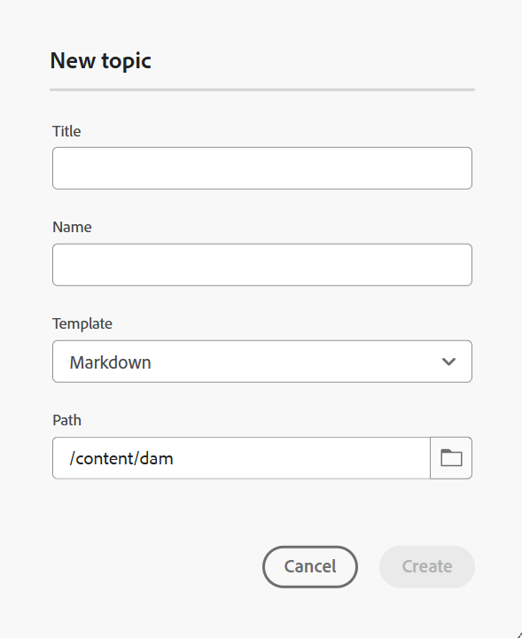

# 편집기에서 Markdown 문서 작성 {#id223MIE0B079}

Markdown은 일반 텍스트 문서에 서식 요소를 추가하는 데 도움이 되는 간단한 마크업 언어입니다. Adobe Experience Manager Guides은 편집기에서 Markdown \(.md\) 주제를 만들고, 작성하고, 미리 보는 기능을 제공합니다. 기존 Markdown 문서를 업로드하고 편집기에서 편집할 수도 있습니다.

## Markdown 항목 만들기

편집기에서 Markdown 주제를 만들려면 다음 단계를 수행하십시오.

1. 저장소 패널에서 을(를) 선택한 다음 드롭다운에서 **주제**&#x200B;를 선택합니다.
1. **새 항목** 대화 상자에서 다음 세부 정보를 제공합니다.

   {width="300" align="left"}

   * **제목**: 주제의 제목을 입력합니다.
   * **이름**: 제목 항목을 기반으로 파일 이름이 자동으로 제안됩니다. 관리자가 UUID 설정을 기반으로 자동 파일 이름을 활성화한 경우 이름 필드가 표시되지 않습니다.
   * **템플릿**: 드롭다운 목록에서 **Markdown**&#x200B;을(를) 선택합니다. 템플릿 **주제**&#x200B;이(가) 기본적으로 선택됩니다.
   * **경로**: 주제 파일을 저장할 경로를 찾습니다. 기본적으로 현재 저장소에서 선택한 폴더의 경로가 경로 필드에 표시됩니다.

   >[!NOTE]
   >
   > 업그레이드의 경우 사용 중인 현재 폴더 프로필에 Markdown 템플릿을 추가해야 합니다. [편집기에서 새 Markdown 템플릿을 만들거나](./web-editor-features.md#templates) Markdown 작성에 기존 템플릿을 사용할 수 있습니다. Experience Manager Guides에서 작성 템플릿을 추가하는 방법에 대한 자세한 내용은 [전역 또는 폴더 수준 프로필 구성](../cs-install-guide/conf-folder-level.md)을 참조하십시오.
1. **만들기**&#x200B;를 선택합니다.

   선택한 경로에 Markdown 주제가 만들어지고 편집을 위해 열려 있습니다.

   {width="650" align="left"}

>[!NOTE]
>
> 저장소 패널 내에 폴더에 대한 Markdown 주제를 만들 수도 있습니다. Markdown 주제를 만들 폴더를 선택하고 **새로 만들기**&#x200B;를 선택한 다음 옵션 메뉴에서 **주제**&#x200B;를 선택합니다. 이제 **주제 만들기** 대화 상자에 주제 세부 정보를 제공하여 Markdown 주제를 만들 수 있습니다.

## Markdown 주제에 대한 편집기 기능 이해

이 섹션에서는 Markdown 주제 작성용 편집기에서 사용할 수 있는 다양한 기능을 안내합니다. 작성 인터페이스는 다음 섹션이나 영역으로 나뉩니다.

* [도구 모음](#toolbar)
* [콘텐츠 편집 영역](#content-editing-area)
* [Source, 나란히 및 미리보기 모드](#source-side-by-side-and-preview-modes)
* [오른쪽 패널](#right-panel)

<!--
### Tab bar 

The tab bar features the file tabs of the topics or maps that are currently opened in the Editor along with other file-level options. 

Features available in the tab bar are explained as follows:

 {width="550" align="left"}

* **Topic tab**: Displays the currently opened topics in a tab. By default, you can view the file titles in the tab. As you hover over a file, you can view the file title and the file path as a tooltip.

    >[!NOTE]
    >
    > As an administrator, you can also choose to view the list of files by filenames in the tabs. View [User preferences](./intro-home-page.md#user-preferences) for details.
* **Save all**: Saves the changes you have made in all opened topics. If you have multiple topics opened in the Editor, selecting **Save all** or pressing `Crtl+S` shortcut keys saves all documents in one click. You do not have to individually save each document.
* **AI Assistant**: [AI-powered Smart Help](./ai-based-smart-help.md) feature that helps you find relevant content from the Adobe Experience Manager Guides Documentation.
* **More actions**: Allows you to navigate to the **Assets UI**. As an administrator, you also get an option to navigate to the **Settings** page. Learn how to work with [settings](./web-editor-features.md#main-toolbar) or editor settings. 
* **Expand view**: Allows you to expand the page view using the **Expand** icon. In this view, the header bar is hidden, maximizing the content space. To return to the standard view, use the **Exit the expanded view** icon.

-->

### 도구 모음

도구 모음은 탭 모음 바로 아래에 있습니다. 도구 모음에서 사용할 수 있는 기능은 다음과 같이 설명되어 있습니다.

{align="left"}

| 기능 | 설명 |
|----------------|----------------|
| 작업 편집 | **잘라내기**&#x200B;를 비롯한 다양한 문서 편집 기능에 대한 액세스를 제공합니다.  , **실행 취소**  , **다시 실행**  , **복사**  , **삭제**   및 **찾기 및 바꾸기**  . **메뉴** 드롭다운에서 사용 가능한 옵션에 액세스할 수 있습니다. |
| 텍스트 서식 옵션 | **제목**&#x200B;을 비롯한 다양한 텍스트 서식 옵션에 대한 액세스를 제공합니다.  , **굵게**  , **기울임꼴**  , **취소선**  , **코드**   및 **견적 차단**  . |
| 콘텐츠 삽입 옵션 | **번호 매기기 목록**&#x200B;을 삽입하는 옵션을 제공합니다.  , **정렬된 목록**  , **테이블**  , **이미지** , **상호 참조**   및 **기호**  문서에 을(를) 추가했습니다.   **참고**: 이미지 및 기타 파일을 Markdown 편집기로 끌어서 놓을 수도 있습니다. 파일은 상호 참조 링크로 추가되지만 이미지는 표준 이미지 요소로 표시됩니다. |
| 버전 내역 | Markdown 파일의 버전을 만들고 변경 내역을 볼 수 있습니다. 다른 버전을 비교하고 필요한 경우 이전 버전으로 되돌릴 수 있습니다. 버전 기록 옵션이 **메뉴** 드롭다운에 있습니다. |
| 새 버전으로 저장 | 주제의 변경 사항을 저장하고 주제의 새 버전도 만듭니다. 새로 만든 주제에 대해 작업하는 경우 버전 정보는 없음으로 표시됩니다. |
| 잠금/잠금 해제 | 현재 파일을 잠그거나 잠금 해제합니다. 파일을 잠그면 파일에 대한 단독 쓰기 액세스 권한이 제공됩니다. 이렇게 하면 다른 사용자가 파일을 편집할 수 없습니다. 다른 사용자가 편집 액세스 권한을 갖게 하려면 파일 잠금을 해제하십시오. 또한 관리자는 다른 사람이 잠근 파일의 잠금을 해제할 수 있는 **잠금 해제 강제** 기능에 액세스할 수 있습니다. |

>[!NOTE]
>
> **버전 기록** 기능 및 편집 작업, 텍스트 서식 및 콘텐츠 삽입에 언급된 기능은 Markdown 항목의 **Source** 및 **나란히** 보기에서 모두 액세스할 수 있습니다.

### 콘텐츠 편집 영역

콘텐츠 편집 영역에는 모든 콘텐츠를 편집할 수 있는 주제의 Markdown 소스가 표시됩니다. 사이드 바이 사이드 뷰에서 이 영역은 두 개의 섹션(왼쪽의 Markdown 소스 뷰 및 오른쪽의 미리보기)으로 분할됩니다. 여러 개의 주제를 동시에 열어 각 탭에 표시할 수 있습니다.

### Source, 나란히 및 미리보기 모드

Markdown 작성의 경우 편집기에서 컨텐츠 작성 및 형식을 지원하는 세 가지 보기 모드를 지원합니다.

{align="left"}

* 소스
* 나란히
* 미리보기

**소스**

편집기의 Markdown 코드 보기입니다. 일반 Markdown 편집기에서처럼 Markdown 주제를 편집할 수 있습니다. Source 보기에서는 문서 개정판 저장, 머리글 삽입, 표 삽입, 이미지 삽입 등의 옵션을 사용할 수 있습니다.

렌더링된 출력을 보지 않고 원시 Markdown 작성 및 편집에만 집중하려면 이 보기를 사용합니다.

**나란히**

이 모드는 편집기를 두 개의 패널로 분할합니다.

* 편집 중인 Markdown 주제를 표시하는 Source 패널입니다.
* Markdown 주제의 렌더링된 출력을 실시간으로 표시하는 미리보기 패널.

{width="550" align="left"}

Markdown 주제를 편집할 때 실시간으로 렌더링된 출력을 보려는 경우 이 보기를 사용합니다.

**미리보기**

미리보기 모드에서 Markdown 주제를 열면 브라우저에서 주제를 볼 때 표시되는 방식이 표시됩니다. 이 보기에서 모든 편집 기능은 도구 모음에서 제거됩니다. 그러나 도구 모음의 **새 버전으로 저장**, **잠금/잠금 해제** 기능 및 오른쪽 패널의 **파일 속성** 기능에 계속 액세스할 수 있습니다.

### 오른쪽 패널

오른쪽 패널에서는 **파일 속성 패널에 액세스할 수 있습니다.

파일 속성에는 다음과 같은 두 개의 섹션이 있습니다.

**일반**

일반 사항 섹션에서는 다음 기능에 액세스할 수 있습니다.

* **파일 이름**: 선택한 항목의 파일 이름을 표시합니다.
* **ID**: 선택한 주제의 ID를 표시합니다.
* **언어**: 주제의 언어를 표시합니다. 속성 페이지의 언어 필드에서 설정됩니다.
* **만든 날짜**: 항목을 만든 날짜와 시간을 표시합니다.
* **수정일**: 주제를 수정한 날짜와 시간을 표시합니다.
* **잠근 사용자**: 항목을 체크 아웃한 사용자를 표시합니다.
* **문서 상태**: 현재 열려 있는 항목의 문서 상태를 선택하고 업데이트할 수 있습니다. 자세한 내용은 [문서 상태](./web-editor-document-states.md)를 참조하세요.
* **태그**: 주제의 메타데이터 태그입니다. 속성 페이지의 태그 필드에서 설정됩니다. 드롭다운에서 입력하거나 선택할 수 있습니다. 드롭다운 아래에 태그가 표시됩니다. 태그를 삭제하려면 태그 옆에 있는 교차 아이콘을 선택합니다.
* **추가 속성 편집**: 파일 속성 페이지에서 추가 속성을 편집할 수 있습니다.

**참조**

참조(References) 섹션에서는 다음 기능에 액세스할 수 있습니다.

* **다음에서 사용됨**: 참조에서 사용됨 목록에는 현재 파일이 참조되거나 사용되는 문서가 있습니다.
* **송신 링크**: 송신 링크는 현재 문서에서 참조되는 문서를 나열합니다.

>[!NOTE]
>
> 모든 사용 위치 및 발신 링크 참조는 문서에 하이퍼링크됩니다. 연결된 문서를 쉽게 열고 편집할 수 있습니다.

## 기능 제한 사항

다음 Experience Manager Guides 기능은 현재 Markdown 작성에 적용할 수 없습니다.

1. 검토
2. 병합
3. AI 어시스턴트
4. 변경 내용 추적

**상위 항목:**[&#x200B;편집기 소개](web-editor.md)
