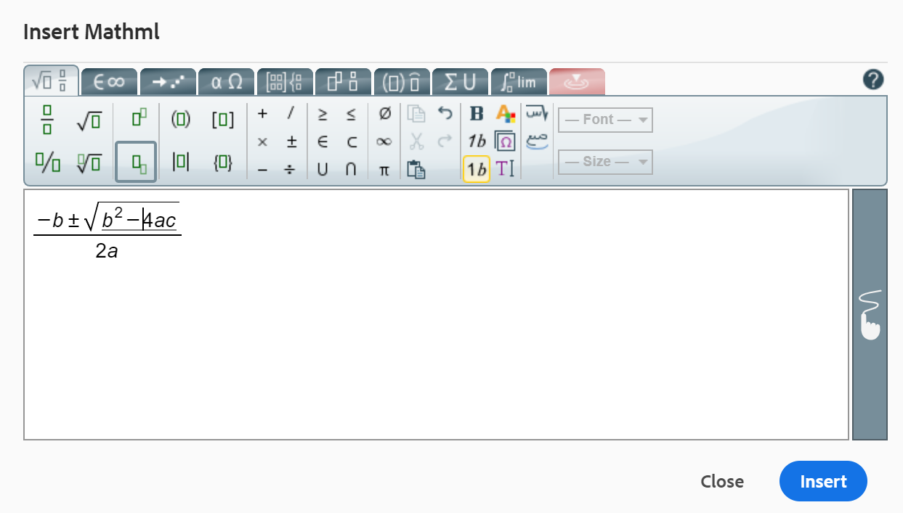

# 웹 편집기의 기타 기능 {#id2056B0B0YPF}

웹 편집기에는 다음과 같은 몇 가지 유용한 기능이 있습니다.

**파일의 탭에서 상황에 맞는 메뉴 기능**

웹 편집기에서 파일을 열면 컨텍스트 메뉴에서 다양한 작업을 수행할 수 있습니다. 미디어 파일을 열지, 단일 DITA 파일을 열지 또는 여러 파일을 열지 여부에 따라 다른 옵션이 표시될 수 있습니다.

**미디어 파일**

열린 미디어 파일 탭의 컨텍스트 메뉴에서 다음 함수를 사용할 수 있습니다.

{width="300" align="left"}

**단일 DITA 파일**

열린 파일 탭의 문맥 인식 메뉴에서 다음과 같은 기능을 사용할 수 있습니다.

:   {width="300" align="left"}

**여러 파일**

여러 파일이 열려 있으면 상황에 맞는 메뉴에서 더 많은 옵션을 사용할 수 있습니다.

{width="550" align="left"}

컨텍스트 메뉴의 여러 옵션은 아래에 설명되어 있습니다.

***저장***: 다음 옵션 중에서 선택할 수 있습니다.

- **저장**: 새 버전을 만들지 않고 파일을 저장하려면 을 선택합니다. **저장**. 새 주제를 만들 때마다 DAM에 해당 주제의 버전 없는 작업 복사본이 만들어집니다. 문서를 저장하면 DAM에서 문서의 작업 복사본이 업데이트됩니다. 이 버전에서 단순 저장을 해도 주제의 새 버전이 만들어지지 않습니다. 주제가 검토 중인 경우, 주제를 저장해도 검토자에게 변경된 주제 콘텐츠에 대한 액세스 권한이 부여되지 않습니다.

- **모두 저장**: 웹 편집기에 여러 문서가 열려 있는 경우 다음 옵션을 사용할 수도 있습니다. **모두 저장** 문서를 열었습니다.

***새 버전으로 저장***

파일의 새 버전을 생성하려면 다음을 선택합니다. **새 버전으로 저장**. 에 대한 자세한 내용 **저장** 및 **새 버전으로 저장**, 참조 [웹 편집기 기능 이해](web-editor-features.md#).

***복사***: 다음 옵션 중에서 선택할 수 있습니다.

- **UUID 복사**: 현재 활성 파일의 UUID를 클립보드에 복사하려면 를 선택합니다 **복사 \> UUID 복사**.
- **경로 복사**: 현재 활성 파일의 전체 경로를 클립보드에 복사하려면 **복사 \> 복사 경로**.

***위치***: 다음 옵션 중에서 선택할 수 있습니다.

- **맵**: 큰 DITA 맵을 열어 맵에서 파일의 정확한 위치를 찾으려면 다음을 선택합니다 **\> 맵에서 찾기**. 맵에서 찾기 옵션을 선택하면 \(옵션이 호출되는 위치\) 파일이 맵 계층 구조에 있고 강조 표시됩니다. 이 기능을 사용하려면 웹 편집기에서 맵 파일을 열어야 합니다. 맵 보기가 숨겨져 있으면 이 기능을 호출하면 맵 보기가 표시되고 파일이 맵 계층 구조에서 강조 표시됩니다.

- **저장소**: 맵에서 찾기 와 유사합니다. **\> 저장소에서 찾기** 저장소 \(또는 DAM\)에서 파일의 위치를 표시합니다. 저장소 뷰가 열리고 선택한 파일이 저장소에서 강조 표시됩니다. 파일이 폴더 내에 있으면 해당 폴더가 확장되어 선택한 파일의 위치가 저장소에서 표시됩니다.

***추가 대상***: 다음 옵션 중에서 선택할 수 있습니다.

- **즐겨찾기**: 선택한 파일을 즐겨찾기 컬렉션에 추가하려면 **즐겨찾기에 추가**. 자세한 내용은 **즐겨찾기** 의 기능 설명 [왼쪽 패널](web-editor-features.md#id2051EA0M0HS) 섹션.

- **재사용 가능한 콘텐츠**: 선택한 파일을 재사용 가능한 콘텐츠 목록에 복사하려면 **재사용 가능한 콘텐츠에 추가**. 자세한 내용은 **재사용 가능한 콘텐츠** 의 기능 설명 [왼쪽 패널](web-editor-features.md#id2051EA0M0HS) 섹션.

***속성***

선택한 파일의 AEM 속성 페이지를 보려면 **속성**.

***분할***: 다음 옵션 중에서 선택할 수 있습니다.

**위쪽, 아래쪽, 왼쪽 또는 오른쪽**

기본적으로 웹 편집기를 사용하면 한 번에 하나의 주제를 볼 수 있습니다. 두 개 이상의 주제를 동시에 보려는 인스턴스가 있을 수 있습니다. 편집기의 화면을 분할하면 여러 주제를 동시에 볼 수 있습니다. 예를 들어 편집기에서 A와 B라는 두 가지 항목이 열려 있는 경우, 항목 B를 마우스 오른쪽 버튼으로 클릭하고 선택 **분할 \>** 편집기 창을 두 부분으로 나눕니다. 위쪽 절반에는 주제 B가 표시되고 아래쪽 절반에는 주제 A가 표시됩니다. 마찬가지로 을 선택하여 화면을 가로로 분할할 수도 있습니다 **분할 \> 왼쪽** 또는 **오른쪽 분할 \>**. 다음 웹 편집기의 스크린샷에는 가로 및 세로로 분할된 주제가 표시됩니다. 각 분할에서 다른 보기를 가질 수 있습니다. 예를 들어 다음 스크린샷에서 화면 1은 소스 보기 모드이고 화면 2는 작성자 모드로 열린 두 개의 문서이며 화면 3은 미리보기 모드입니다. 파일 탭을 드래그하여 배치할 화면에 놓아 한 화면에서 다른 화면으로 문서를 이동할 수 있습니다. 마찬가지로 파일 탭을 기본 설정에 따라 드래그 앤 이동하여 순서를 변경할 수도 있습니다.

{width="800" align="left"}

***빠른 생성***

선택한 파일에 대한 출력을 생성합니다. 출력 사전 설정의 일부인 파일에 대해서만 출력을 생성할 수 있습니다. 자세한 내용은 [웹 편집기에서 문서 기반 게시](web-editor-article-publishing.md#id218CK0U019I).

***닫기***: 다음 옵션 중에서 선택할 수 있습니다.

**닫기**, **다른 항목 닫기**, 또는 **모두 닫기**

컨텍스트 메뉴를 호출한 파일을 닫으려면 다음을 선택합니다 **닫기 \> 닫기**. 사용 **닫기 \> 다른 항목 닫기** 현재 활성 파일을 제외하고 열려 있는 다른 모든 파일을 닫습니다. 열려 있는 파일을 모두 닫으려면 **닫기 \> 모두 닫기** 상황에 맞는 메뉴에서 선택하거나 웹 편집기를 닫도록 선택할 수도 있습니다. 세션에 저장되지 않은 파일이 있으면 해당 파일을 저장하라는 메시지가 표시됩니다.

**파일 닫기 및 저장 시나리오**

웹 편집기에서 연 파일을 닫으려고 할 때 **닫기** 파일 탭의 단추 또는 **닫기** 옵션 메뉴의 옵션을 선택하면 AEM Guides에 편집 내용을 저장하고 잠긴 파일의 잠금을 해제하라는 메시지가 표시됩니다.

프롬프트는 관리자가 선택한 다음 구성을 기반으로 합니다.

- **닫을 때 체크인 요청:** 편집기를 닫을 때 \(체크 아웃한\) 파일을 체크 인하는 옵션이 제공됩니다.
- **닫을 때 새 버전 요청**: 편집기를 닫을 때 \(편집한\) 파일을 새 버전으로 저장할 수 있는 옵션이 제공됩니다.

파일 저장 경험은 다음과 같은 세 가지 시나리오에 따라 다릅니다.

- 콘텐츠에 대한 변경을 수행하지 않았습니다.
- 콘텐츠를 편집하고 변경 사항을 저장했습니다.
- 콘텐츠를 편집했지만 변경 사항을 저장하지 않았습니다.

파일이 잠겨 있거나 잠겨 있지 않고 변경 내용을 저장했는지 또는 저장하지 않았는지 여부에 따라 다음 옵션이 표시될 수 있습니다.

- **잠금 해제 및 닫기**: 파일의 잠금이 해제되고 파일이 닫힙니다.

  {width="400" align="left"}

- **새 버전으로 저장**: 콘텐츠에 수행한 변경 사항이 저장되고 파일의 새 버전이 만들어집니다. 새로 저장된 버전에 대한 레이블과 주석을 추가할 수도 있습니다. 새 버전 저장에 대한 자세한 내용은 [새 버전으로 저장](web-editor-features.md#save-as-new-version-id209ME400GXA).

- **파일 잠금 해제**: 파일의 잠금을 해제하도록 선택하면 파일에 대한 잠금이 해제되고 변경 사항이 파일의 현재 버전에 저장됩니다.

  >[!NOTE]
  >
  > 파일의 잠금을 해제하는 옵션의 선택을 취소하면 변경 내용을 저장하지 않고 파일을 닫을 수 있는 옵션도 제공됩니다.

  예를 들어 다음 스크린샷에는 프롬프트 중 하나가 표시됩니다.

  {width="400" align="left"}

**끊어진 참조에 대한 시각적 큐**

- 주제에 끊어진 상호 참조나 콘텐츠 참조가 포함되어 있으면 빨간색 텍스트로 표시됩니다.

**Smart Copy-붙여넣기**

- 주제 내 및 주제 간에 붙여넣기 콘텐츠를 쉽게 복사할 수 있습니다. 소스 요소 구조는 대상에서 유지됩니다. 또한 복사된 콘텐츠에 콘텐츠 참조가 포함된 경우 해당 콘텐츠도 복사됩니다.

**마지막으로 검색한 위치 기억**

- 웹 편집기는 스마트 파일 검색 대화 상자를 제공합니다. 편집기는 참조 또는 콘텐츠를 삽입하는 동안 마지막으로 사용된 위치를 기억합니다. 삽입 참조 또는 삽입 재사용 컨텐트\를 통해 파일 찾아보기 대화 상자를 처음 호출하면 현재 문서가 저장된 위치로 이동합니다. 동일한 세션에서 다른 참조를 삽입하려고 하면 파일 찾아보기 대화 상자가 마지막 참조를 삽입한 위치로 자동 이동합니다.

>[!NOTE]
>
> 이미지, 오디오 또는 비디오 파일의 경우 파일 찾아보기 대화 상자의 기본값은 마지막으로 사용된 위치가 아니라 파일의 위치로 설정됩니다.

**문서 기반 게시 지원**

- 웹 편집기에서 하나 이상의 주제 또는 전체 DITA 맵에 대한 출력을 생성할 수 있습니다. DITA 맵에 대한 출력 사전 설정을 만들어야 하나 이상의 주제에 대한 출력을 쉽게 생성할 수 있습니다. 맵에서 몇 가지 주제를 업데이트한 경우 웹 편집기에서 해당 주제에 대한 출력만 생성할 수도 있습니다. 자세한 내용은 [웹 편집기에서 문서 기반 게시](web-editor-article-publishing.md#id218CK0U019I).

**Markdown 문서 지원**

- 웹 편집기를 사용하면 DITA 문서와 함께 Markdown 문서 \(.md\)를 사용할 수 있습니다. 웹 편집기에서 Markdown 문서를 쉽게 작성하고 미리 볼 수 있으며 DITA 맵 편집기를 통해 맵 파일에 추가할 수도 있습니다. 자세한 내용은 [웹 편집기에서 Markdown 문서 작성](web-editor-markdown-topic.md#).

**DITA 용어집 용어 주제 지원**

- 웹 편집기는 를 추가하여 삽입할 수 있는 DITA 용어집 용어를 지원합니다 `term` 또는 `abbreviated-form` 요소.

**MathML 방정식 삽입**

- Experience Manager 안내서는 와 통합함으로써 MathML 방정식 삽입을 위한 기본 지원을 제공합니다. [MathType 웹](https://docs.wiris.com/en/mathtype/mathtype_web/intro) 응용 프로그램. MathML 방정식을 삽입하려면 **요소 삽입** 아이콘을 클릭하고 mathml을 입력합니다. 목록에서 Mathml 요소를 선택하면 **MathML 삽입** 대화 상자가 표시됩니다.

{width="550" align="left"}

MathML 방정식 도구를 사용하여 방정식을 만들고 **삽입** 문서에 추가합니다. 방정식은 아래와 같이 밝은 회색 배경에 삽입됩니다.

{width="400" align="left"}

언제든지 기존 방정식을 마우스 오른쪽 버튼으로 클릭하고 를 선택하여 방정식을 업데이트할 수 있습니다 **MathML 편집** 컨텍스트 메뉴 아래의 제품에서 사용할 수 있습니다.

- **MathML 편집기에서 방정식 유효성 검사**

  Experience Manager 안내서는 방정식이 들어 있는 주제를 저장할 때 MathML 방정식의 유효성을 검사합니다.
MathML 편집기를 사용하여 방정식을 삽입하면 구문 문제가 있는 경우 Experience Manager 안내서에서 방정식을 빨간색으로 강조 표시합니다. 삽입하기 전에 수정할 수 있습니다. 변경하지 않고 을(를) 선택하는 경우 **삽입**&#x200B;에 경고가 표시됩니다.

  {width="400" align="left"}

  구문 오류가 포함된 MathML 방정식을 삽입하면 주제를 저장하려고 할 때 유효성 검사 오류가 발생합니다.

**각주 삽입**

- 를 사용하여 콘텐츠에 각주 삽입 `fn` 요소를 생성하지 않습니다. 작성 모드에서 각주 값은 콘텐츠와 함께 인라인으로 표시됩니다. 그러나 [미리 보기] 모드를 전환하거나 문서를 게시하면 항목의 끝에 각주가 나타납니다.

**요소 이름 바꾸기 또는 바꾸기**

- 웹 편집기는 항목 맨 위에 요소의 이동 경로를 표시합니다. 요소를 다른 요소로 바꾸거나 바꾸려는 경우 이동 경로의 컨텍스트 메뉴에서 바꾸거나 바꿀 수 있습니다. 예를 들어 를 교체할 수 있습니다 `p` 요소가 있는 `note` 또는 컨텍스트에서 다른 유효한 요소도 사용할 수 있습니다.

{width="400" align="left"}

이동 경로에서 바꿀 요소의 이름을 마우스 오른쪽 단추로 클릭한 다음 컨텍스트 메뉴에서 요소 이름 바꾸기를 선택합니다. 요소 이름 바꾸기 대화 상자에는 현재 위치에서 허용되는 모든 유효한 요소가 표시됩니다. 요소 이름 바꾸기 대화 상자에서 사용할 요소를 선택합니다. 원래 요소가 새 요소로 대체됩니다.

이동 경로의 컨텍스트 메뉴 외에도 다른 위치에서 요소 이름 변경 대화 상자에 액세스할 수 있습니다.

- 이동 경로에서 요소 이름을 클릭하여 요소의 콘텐츠를 선택하고 선택한 콘텐츠를 마우스 오른쪽 버튼으로 클릭하여 컨텍스트 메뉴를 표시합니다.

- 태그 보기를 활성화하고 요소의 여는 태그를 클릭한 다음 선택한 컨텐츠를 마우스 오른쪽 버튼으로 클릭하여 컨텍스트 메뉴를 표시합니다.

- 아웃라인 패널에서 요소의 옵션 메뉴를 호출하여 요소 이름 바꾸기 대화 상자에 액세스할 수 있습니다.

**요소 래핑**

- 요소를 둘러싸면 선택한 텍스트에 요소 태그를 추가할 수 있습니다. DITA 표준에 따라 텍스트를 자식 요소로 줄 바꿈할 수 있습니다. 예를 들어 다음 아래에 텍스트가 있는 경우 `note` 요소를 선택한 다음 텍스트를 `p` 요소를 생성하지 않습니다.

  다음 **요소 래핑** 옵션은 항목 이동 경로의 컨텍스트 메뉴에서 사용할 수 있습니다. 요소를 래핑하려면 요소를 마우스 오른쪽 단추로 클릭하고 컨텍스트 메뉴를 엽니다. 다음에서 요소를 선택합니다. **요소 래핑** 대화 상자. 텍스트가 새 요소에 나타납니다.

  콘텐츠에서 텍스트나 요소를 선택한 다음 **요소 래핑**  상황에 맞는 메뉴에서 옵션을 선택합니다.

**요소 래핑 해제**

- 요소의 래핑을 해제하면 선택한 텍스트에서 요소 태그를 제거하고 상위 요소와 병합할 수 있습니다. 예를 들어 `p` 다음 내에 있는 요소 `note` 요소, 다음을 unwrap할 수 있습니다 `p` 요소를 사용하여 내에서 직접 텍스트 병합 `note` 요소를 생성하지 않습니다. 다음 **요소 래핑 해제** 옵션은 항목 이동 경로의 컨텍스트 메뉴에서 사용할 수 있습니다. 요소의 래핑을 해제하려면 요소를 마우스 오른쪽 단추로 클릭하여 컨텍스트 메뉴를 연 다음 를 선택합니다 **요소 래핑 해제** 요소를 제거하고 요소의 텍스트를 상위 요소와 병합합니다.

**DITA 요소에 대한 공백 처리**

- XML에서 공백에는 공백, 탭, 캐리지 리턴 및 빈 줄이 포함됩니다. Experience Manager 안내선은 여러 개의 연속된 공백을 한 개의 공백으로 변환합니다. 이렇게 하면 웹 편집기의 WYSIWYG 보기를 유지할 수 있습니다.

  >[!NOTE]
  >
  >DITA 규칙에 따라 공백을 유지해야 하는 일부 요소에서는 연속된 여러 공백이 유지됩니다. 예를 들어, `<pre>` 및 `<codeblock>` 요소.

**줄 바꿈 및 들여쓰기 유지**

- 줄 바꿈과 공백이 포함된 DITA 요소는 작성자, 소스 또는 미리보기 모드와 최종 게시된 출력에서 해당 정의에 따라 지원되고 렌더링됩니다. 다음 스크린샷은 내의 콘텐츠를 보여 줍니다. `msgblock` 줄 바꿈과 공백 \(들여쓰기\)이 유지된 요소:

{width="500" align="left"}

**웹 편집기에서 줄바꿈하지 않는 공백 처리**

- 를 사용하여 문서에 줄바꿈하지 않는 공백을 삽입할 수 있습니다 **특수 문자 삽입**   아이콘 또는 **대체** + **공간** 바로 가기 키.  이러한 줄바꿈하지 않는 공백은 웹 편집기에서 항목을 편집하는 동안 표시기로 표시됩니다. 를 사용하여 줄바꿈하지 않는 공백 표시를 끌 수 있습니다. **작성자 모드에서 줄바꿈하지 않는 공백 표시기 표시** 옵션에서 **모양** 의 탭 **사용자 환경 설정** ..

- 외부 소스에서 줄바꿈 없는 공백이 포함된 컨텐츠를 복사하여 **작성자** 보기에서 줄바꿈하지 않는 공백은 공백으로 변환됩니다.
그러나 의 줄바꿈 없는 공백이 있는 콘텐츠를 복사하여 붙여넣으면 **작성자** 보기, 보존되어 있습니다.

**요소 ID 자동 생성**

- DITA 주제의 요소에 대한 ID를 자동으로 생성할 수 있습니다. 이러한 ID는 DITA 주제 내에서 고유합니다. 예를 들어 단락 요소에 대한 ID를 생성하는 경우 ID는 p\_1, p2, p\_3 등이 됩니다. 여러 요소를 선택하고 선택한 각 요소에 대한 ID를 생성할 수 있습니다.

하나 이상의 요소에 대한 ID를 자동으로 생성하려면 다음을 수행합니다.

1. 웹 편집기에서 주제를 엽니다.
1. ID를 지정할 콘텐츠를 선택합니다.
1. 마우스 오른쪽 단추를 클릭하고 선택 **컨텍스트 메뉴에서 ID를 생성합니다.**

   또는 이동 경로를 마우스 오른쪽 버튼으로 클릭하고 를 선택할 수 있습니다. **ID 생성**.

**상위 항목:**[&#x200B;웹 편집기 작업](web-editor.md)
