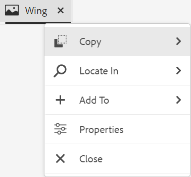
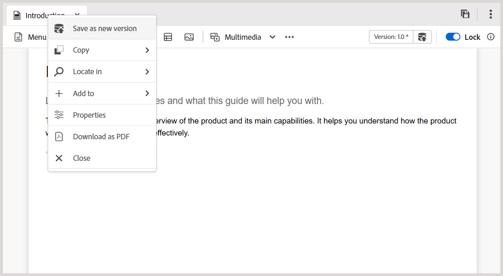
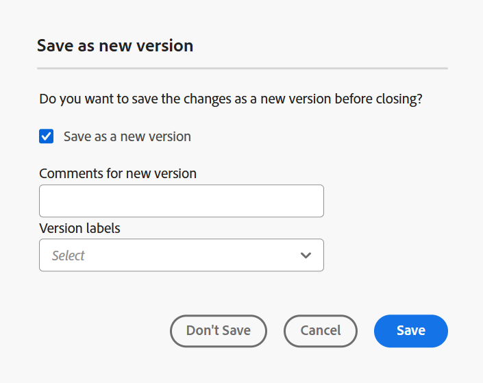
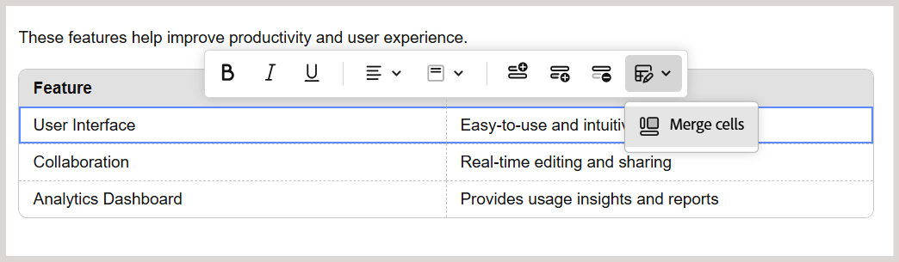
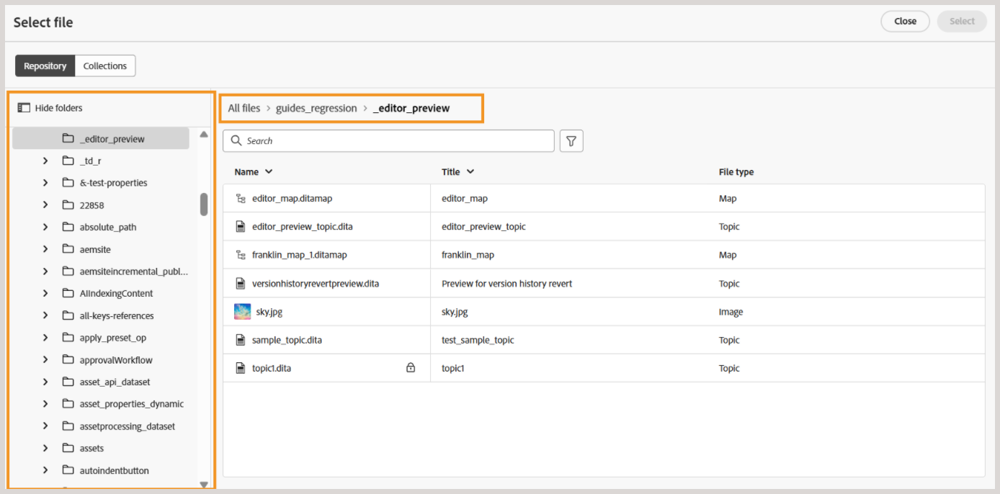
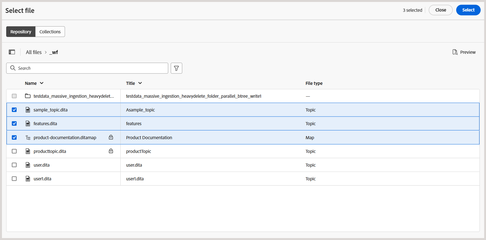
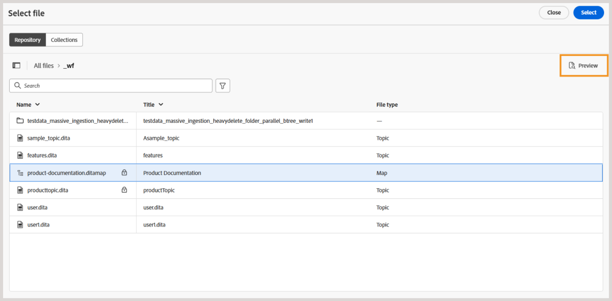
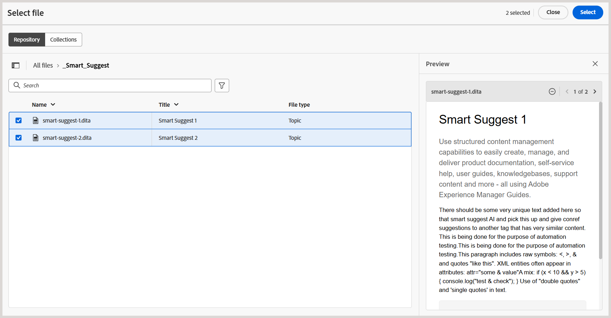
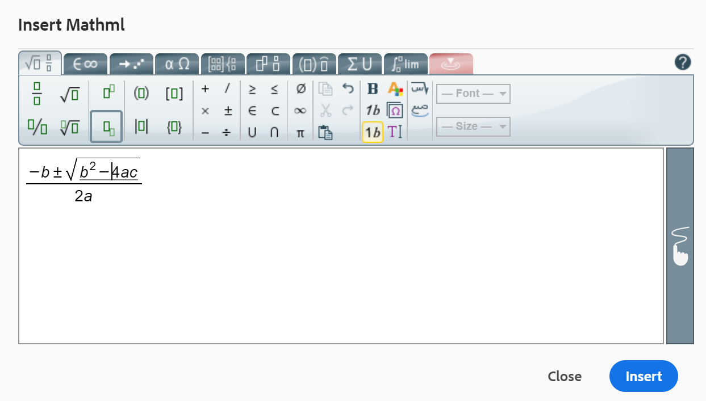

# 편집기의 추가 기능 {#id2056B0B0YPF}

편집기에는 다음과 같은 몇 가지 유용한 기능이 있습니다.

## 파일의 탭에서 상황에 맞는 메뉴 기능

편집기에서 파일을 열면 컨텍스트 메뉴에서 다양한 작업을 수행할 수 있습니다. 미디어 파일을 열지, 단일 DITA 파일을 열지 또는 여러 파일을 열지 여부에 따라 다른 옵션이 표시될 수 있습니다.

**미디어 파일**

열린 미디어 파일 탭의 컨텍스트 메뉴에서 다음 함수를 사용할 수 있습니다.

{width="300"}

**단일 DITA 파일**

열린 파일 탭의 문맥 인식 메뉴에서 다음과 같은 기능을 사용할 수 있습니다.

>[!BEGINTABS]

>[!TAB 새 편집기]

{width="400"}

>[!TAB 이전 편집기]

{width="400"}

>[!ENDTABS]

**여러 파일**

여러 파일이 열려 있으면 상황에 맞는 메뉴에서 더 많은 옵션을 사용할 수 있습니다.

>[!BEGINTABS]

>[!TAB 새 편집기]

{width="550"}

>[!TAB 이전 편집기]

{width="550"}

>[!ENDTABS]

컨텍스트 메뉴의 여러 옵션은 아래에 설명되어 있습니다.

***저장***: 다음 옵션 중에서 선택할 수 있습니다.

- **저장**: 새 버전을 만들지 않고 파일을 저장하려면 **저장**&#x200B;을 선택하세요. 새 주제를 만들 때마다 DAM에 해당 주제의 버전 없는 작업 복사본이 만들어집니다. 문서를 저장하면 DAM에서 문서의 작업 복사본이 업데이트됩니다. 이 버전에서 단순 저장을 해도 주제의 새 버전이 만들어지지 않습니다. 주제가 검토 중인 경우, 주제를 저장해도 검토자에게 변경된 주제 콘텐츠에 대한 액세스 권한이 부여되지 않습니다.

- **모두 저장**: 편집기에 여러 문서가 열려 있는 경우 **모두 저장** 옵션을 사용할 수도 있습니다.

***새 버전으로 저장***

파일의 새 버전을 만들려면 **새 버전으로 저장**&#x200B;을 선택합니다. **저장** 및 **새 버전으로 저장**&#x200B;에 대한 자세한 내용은 편집기에서 [도구 모음](web-editor-toolbar.md)을 참조하세요.

***복사***: 다음 옵션 중에서 선택할 수 있습니다.

- **UUID 복사**: 현재 활성 파일의 UUID를 클립보드에 복사하려면 **복사 \> UUID 복사**&#x200B;를 선택합니다.
- **경로 복사**: 현재 활성 파일의 전체 경로를 클립보드에 복사하려면 **경로 복사 \> 복사**&#x200B;를 선택합니다.

***다음 위치***: 다음 옵션 중에서 선택할 수 있습니다.

- **맵**: 큰 DITA 맵을 열어 맵에서 파일의 정확한 위치를 찾으려면 **맵에서 찾기**&#x200B;를 선택하십시오. 맵에서 찾기 옵션을 선택하면 \(옵션이 호출되는 위치\) 파일이 맵 계층 구조에 있고 강조 표시됩니다. 이 기능을 사용하려면 편집기에서 맵 파일을 열어야 합니다. 맵 보기가 숨겨져 있으면 이 기능을 호출하면 맵 보기가 표시되고 파일이 맵 계층 구조에서 강조 표시됩니다.

- **탐색기**: 맵에서 찾기와 마찬가지로 **탐색기에서 찾기**&#x200B;에는 탐색기 \(또는 DAM\)에서 파일의 위치가 표시됩니다. Explorer View가 열리고 Explorer에서 선택한 파일이 강조 표시됩니다. 파일이 폴더 내에 있으면 해당 폴더가 확장되어 탐색기에서 선택한 파일의 위치를 표시합니다.

  >[!NOTE]
  >
  >Cloud Service의 2025.11.0 릴리스와 온-프레미스의 5.2 릴리스에서 **Repository**&#x200B;의 이름이 **Explorer**(으)로 변경되었습니다. 5.2 이전 버전의 온프레미스 설정의 경우 저장소로 계속 사용할 수 있습니다.

***추가***: 다음 옵션 중에서 선택할 수 있습니다.

- **컬렉션**: 선택한 파일을 컬렉션에 추가하려면 **컬렉션에 추가**&#x200B;를 선택합니다. 자세한 내용은 [왼쪽 패널](web-editor-left-panel.md) 섹션에서 **컬렉션** 기능 설명을 참조하십시오.

- **재사용 가능한 콘텐츠**: 선택한 파일을 재사용 가능한 콘텐츠 목록에 복사하려면 **재사용 가능한 콘텐츠에 추가**&#x200B;를 선택합니다. 자세한 내용은 [왼쪽 패널](web-editor-left-panel.md) 섹션에서 **재사용 가능한 콘텐츠** 기능 설명을 참조하십시오.

***속성***

선택한 파일의 AEM 속성 페이지를 보려면 **속성**&#x200B;을 선택하십시오.

***분할***: 다음 옵션 중에서 선택할 수 있습니다.

**위쪽, 아래쪽, 왼쪽 또는 오른쪽**

기본적으로 편집기를 사용하여 한 번에 하나의 주제를 볼 수 있습니다. 두 개 이상의 주제를 동시에 보려는 인스턴스가 있을 수 있습니다. 편집기의 화면을 분할하면 여러 주제를 동시에 볼 수 있습니다. 예를 들어 편집기에서 A와 B라는 두 가지 항목이 열려 있는 경우, 항목 B를 마우스 오른쪽 단추로 클릭하고 **위로 분할**&#x200B;을 선택하면 편집기 창이 두 부분으로 나누어집니다. 위쪽 절반에는 주제 B가 표시되고 아래쪽 절반에는 주제 A가 표시됩니다. 마찬가지로 **왼쪽 분할 \>** 또는 **오른쪽 분할 \>**&#x200B;을 선택하여 화면을 가로로 분할할 수도 있습니다. 파일 탭을 드래그하여 배치할 화면에 놓아 한 화면에서 다른 화면으로 문서를 이동할 수 있습니다. 마찬가지로 파일 탭을 기본 설정에 따라 드래그 앤 이동하여 순서를 변경할 수도 있습니다.

<!--

***Quick Generate***

Generate the output for the selected file. Output can be generated only for files that are a part of an output preset. For more details, view [Article-based publishing from the Web Editor](web-editor-article-publishing.md#id218CK0U019I).

-->

***닫기***: 다음 옵션 중에서 선택할 수 있습니다.

**닫기**, **다른 항목 닫기** 또는 **모두 닫기**

컨텍스트 메뉴를 호출한 파일을 닫으려면 **닫기 \> 닫기**&#x200B;를 선택합니다. 현재 활성 파일을 제외하고 열려 있는 다른 모든 파일을 닫으려면 **닫기 \> 다른 파일 닫기**&#x200B;를 사용하십시오. 열려 있는 모든 파일을 닫으려면 상황에 맞는 메뉴에서 **닫기 \> 모두 닫기** 옵션을 선택하거나 편집기를 닫도록 선택할 수도 있습니다. 세션에 저장되지 않은 파일이 있으면 해당 파일을 저장하라는 메시지가 표시됩니다.

**파일 닫기 및 저장 시나리오**

파일 탭의 **닫기** 단추나 옵션 메뉴의 **닫기** 옵션을 사용하여 편집기에서 연 파일을 닫으려고 하면 Experience Manager Guides에서 편집 내용을 저장하고 잠긴 파일의 잠금을 해제하라는 메시지를 표시합니다.

프롬프트는 관리자가 선택한 다음 구성을 기반으로 합니다.

- **닫을 때 잠금 해제 요청:** 편집기를 닫을 때 \(잠근\) 파일의 잠금을 해제할 수 있는 옵션이 제공됩니다.
- **닫을 때 새 버전 요청**: 편집기를 닫을 때 \(편집한\) 파일을 새 버전으로 저장할 수 있는 옵션이 제공됩니다.

파일 저장 경험은 다음과 같은 세 가지 시나리오에 따라 다릅니다.

- 콘텐츠에 대한 변경을 수행하지 않았습니다.
- 콘텐츠를 편집하고 변경 사항을 저장했습니다.
- 콘텐츠를 편집했지만 변경 사항을 저장하지 않았습니다.

파일 잠금/잠금 해제 및 변경 내용을 저장했는지 아니면 저장하지 않았는지 여부에 따라 다음 옵션을 볼 수 있습니다.

- **잠금 해제 및 닫기**: 파일의 잠금이 해제되고 파일이 닫힙니다.
- **새 버전으로 저장**: 콘텐츠에 적용한 변경 사항이 저장되고 파일의 새 버전이 만들어집니다. 새로 저장된 버전에 대한 레이블과 주석을 추가할 수도 있습니다. 새 버전을 저장하는 방법에 대한 자세한 내용은 [새 버전으로 저장](web-editor-toolbar.md#version-information-and-save-as-new-version)을 참조하세요.

- **파일 잠금 해제**: 파일의 잠금을 해제하도록 선택하면 파일에 대한 잠금이 해제되고 변경 내용이 파일의 현재 버전에 저장됩니다.

  >[!NOTE]
  >
  > 파일의 잠금을 해제하는 옵션의 선택을 취소하면 변경 내용을 저장하지 않고 파일을 닫을 수 있는 옵션도 제공됩니다.

  예를 들어 다음 스크린샷에는 프롬프트 중 하나가 표시됩니다.

  {width="400"}

**끊어진 참조에 대한 시각적 큐**

주제에 끊어진 상호 참조나 콘텐츠 참조가 포함되어 있으면 빨간색 텍스트로 표시됩니다.

**Smart Copy-paste**

주제 내 및 주제 간에 붙여넣기 콘텐츠를 쉽게 복사할 수 있습니다. 소스 요소 구조는 대상에서 유지됩니다. 또한 복사된 콘텐츠에 콘텐츠 참조가 포함된 경우 해당 콘텐츠도 복사됩니다.

**마지막으로 검색한 위치 기억**

편집기는 스마트 파일 찾아보기 대화 상자를 제공합니다. 편집기는 참조 또는 콘텐츠를 삽입하는 동안 마지막으로 사용된 위치를 기억합니다. 삽입 참조 또는 삽입 재사용 컨텐트\를 통해 파일 찾아보기 대화 상자를 처음 호출하면 현재 문서가 저장된 위치로 이동합니다. 동일한 세션에서 다른 참조를 삽입하려고 하면 파일 찾아보기 대화 상자가 마지막 참조를 삽입한 위치로 자동 이동합니다.

>[!NOTE]
>
> 이미지, 오디오 또는 비디오 파일의 경우 파일 찾아보기 대화 상자의 기본값은 마지막으로 사용된 위치가 아니라 파일의 위치로 설정됩니다.

## 새 편집기에서 표 작업

새 편집기를 사용하면 다양한 컨텍스트 기반의 작업을 사용하여 콘텐츠 내에서 직접 표를 만들고, 형식을 지정하며, 구성할 수 있습니다. 다음은 새 편집기에서 사용할 수 있는 다양한 테이블 편집 기능을 사용하는 방법에 대한 짧은 비디오입니다.

>[!VIDEO](https://video.tv.adobe.com/v/3491344)

새 편집기에서 다음 표 편집 기능을 사용할 수 있습니다.

**상황에 맞는 메뉴를 사용하여 테이블을 수정합니다**

표 셀 내부를 마우스 오른쪽 단추로 클릭하면 상황에 맞는 메뉴가 표시됩니다. 작업 중인 테이블 유형에 따라 다음 옵션을 사용할 수 있습니다.

{width="550"}

- 행, 열 또는 셀 삽입

- 수평 또는 수직으로 셀 분할(단순 표에는 사용할 수 없음)

- 오른쪽 또는 아래쪽 셀 병합(단순 표에는 사용할 수 없음)

- 행 또는 열 삭제

**상황별 도구 모음을 사용하여 텍스트 서식 및 맞춤 설정**

상황별 도구 모음은 표 내의 콘텐츠나 셀을 선택할 때 표시됩니다. 도구 모음은 선택 항목과 관련된 옵션을 제공합니다.

- 셀 내용을 선택하여 다음 서식 옵션에 액세스합니다.

  {width="550"}

  굵게, 기울임꼴 또는 밑줄 옵션을 사용하여 텍스트 서식을 지정합니다.
- 단일 셀에 대한 상황별 도구 모음에 액세스하려면 Windows의 경우 `Ctrl+click`, macOS의 경우 `Command+click`을(를) 사용하십시오.

  {width="550"}

- 마찬가지로 여러 셀을 선택하고 상황별 도구 모음을 사용하여 텍스트 서식 및 맞춤을 한 번에 적용할 수도 있습니다.

  단일 또는 다중 행 선택에 사용 가능한 옵션:

  {width="550"}

   - 가로 텍스트 정렬(단순 표에는 사용할 수 없음)
   - 세로 텍스트 정렬(단순 표에는 사용할 수 없음)
   - 위에 행 삽입
   - 아래에 행 삽입
   - 행 제거
   - 셀 병합(단순 표에는 사용할 수 없음)

  단일 또는 다중 열 선택에 사용 가능한 옵션:

  {width="550"}

   - 가로 텍스트 정렬(단순 표에는 사용할 수 없음)
   - 세로 텍스트 정렬(단순 표에는 사용할 수 없음)
   - 위에 행 삽입
   - 아래에 행 삽입
   - 행 제거
   - 위에 열 삽입
   - 아래에 열 삽입
   - 열 제거
   - 셀 병합(단순 표에는 사용할 수 없음)

- 전체 표에 텍스트 서식 및 맞춤을 적용하려면 표를 선택합니다.

  {width="550"}

- 대화형 더하기 단추를 사용하여 행 또는 열 추가

  테이블 끝에 새 행을 추가하려면 마지막 행을 마우스로 가리킨 다음 **+** 단추를 선택합니다. 새 행이 테이블 하단에 추가됩니다.

  {width="550"}

  마찬가지로 마지막 열 위로 마우스를 가져간 다음 **+** 단추를 선택하여 테이블의 맨 오른쪽에 새 열을 추가합니다.

  {width="550"}

- 삽입 옵션을 사용하여 테이블에 여러 행 또는 열 추가(단순 테이블에는 사용할 수 없음)

  테이블에 여러 행 또는 열을 추가하려면 먼저 추가할 행 또는 열 수를 선택한 다음 행 삽입(위 또는 아래) 또는 열 삽입(왼쪽 또는 오른쪽) 옵션을 선택합니다. 선택한 항목에 따라 동일한 개수의 행 또는 열이 표에 추가됩니다.

- 행 및 열 끌어다 놓기(단순 표에는 사용할 수 없음)

  끌어다 놓기를 사용하여 표 내에서 행과 열을 쉽게 이동할 수 있습니다. 행이나 열을 드래그하면 이동 중임을 나타내기 위해 반투명 배경과 함께 표시됩니다. 파란색 선은 릴리스 시 행 또는 열이 배치될 대상 위치를 강조 표시합니다.

  {width="550"}

## Experience Manager Guides에서 파일 및 폴더 찾아보기

Experience Manager Guides에서는 콘텐츠 리포지토리 내의 파일이나 폴더를 효율적으로 탐색하고 선택할 수 있도록 직관적인 대화 상자(**파일 선택** 및 **경로 선택**)를 제공합니다.

>[!NOTE]
>
> 파일 및 폴더 경로 브라우저는 Experience Manager Guides as a Cloud Service 2601 릴리스에서 개선된 UI와 함께 도입되었습니다. 새 인터페이스는 기본적으로 활성화되어 있습니다. 이러한 업데이트 없이 기존 UI를 계속 사용하려면 고객 지원 팀에 문의하여 이 새로운 개선 사항을 비활성화하십시오.

### Experience Manager Guides에서 파일 찾아보기

파일 경로 브라우저를 사용하면 컨텐츠 저장소 내에서 특정 파일을 신속하게 찾아 선택할 수 있습니다. 이 기능은 맵에 주제 추가, 이미지 또는 상호 참조 연결, 재사용 가능한 콘텐츠 작성 등의 작업에 사용할 수 있습니다.

{width="350"}

파일 브라우저를 시작하면 **파일 선택** 대화 상자가 열립니다. 이 대화 상자에는 **저장소** 및 **컬렉션** 탭이 있습니다. 기본적으로 저장소 탭이 선택되어 있습니다.

{width="650"}

**저장소 탭에서 파일 탐색에 사용할 수 있는 기능**

**파일 및 폴더의 표 형식 보기**

저장소 탭에서는 컨텐츠 저장소의 파일 및 폴더를 테이블 형식으로 볼 수 있으므로 올바른 파일 경로를 쉽게 찾을 수 있습니다. 또한 상단의 이동 경로와 왼쪽의 폴더 탐색 패널을 사용하여 폴더를 이동할 수도 있습니다.

{width="650"}

**단일 및 다중 파일 선택**

파일을 사용하려면 파일을 선택하고 **선택**&#x200B;을 선택하면 됩니다.

{width="650"}

경우에 따라 이 경로 브라우저 대화 상자에서 여러 파일을 선택할 수도 있습니다. 예를 들어 재사용 가능한 콘텐츠에 대한 파일을 검색할 때 여러 파일을 선택하고 이를 재사용 가능한 콘텐츠의 일부로 만들 수 있습니다.

{width="650"}

현재 재사용 가능한 콘텐츠, 주제 참조, 스키마, 출력 사전 설정(DITAVAL 사용) 및 Workfront에 대해 여러 파일을 선택할 수 있습니다.

>[!NOTE]
>
> 경로 브라우저 대화 상자에서 파일을 선택하면 일부 폴더가 비활성화되어 나타날 수 있습니다. 이 동작은 특정 파일 유형에 대한 액세스를 제한하여 올바른 선택을 보장합니다. 예를 들어 재사용 가능한 콘텐츠를 만들 때는 주제 및 맵 파일만 사용해야 합니다. 이미지와 같이 잘못된 파일 형식을 사용하지 않도록 하기 위해 해당 파일이 경로 브라우저에서 선택되지 않도록 표시되지 않거나 비활성화됩니다.

**선택한 파일 미리 보기**

아래와 같이 **미리 보기** 단추를 사용하여 선택한 파일을 미리 볼 수 있습니다.

{width="650"}

선택한 파일의 미리보기가 오른쪽에 표시됩니다.

{width="650"}

여러 항목을 선택할 경우 쉽게 검토할 수 있도록 선택한 모든 파일의 미리보기가 미리보기 패널에 표시됩니다.

{width="650"}

**제거** 아이콘을 사용하여 미리 보기에서 일부 파일을 선택 취소할 수도 있습니다.

{width="650"}

**경험 검색 및 필터링**

저장소에서 파일을 검색할 때 이름, 제목 또는 선택한 경로 내의 컨텐츠별로 파일을 검색할 수 있습니다. 하나, 둘 또는 세 가지 기준을 모두 사용하여 검색할 수 있습니다. 기준을 선택하지 않으면 세 가지 기준 모두에 공통되는 결과가 포함됩니다.

{width="650"}

**필터 검색** \(\) 아이콘을 선택하여 오른쪽에 있는 필터 패널을 엽니다.

다음과 같은 옵션을 사용하여 파일을 필터링하고 검색 범위를 좁힐 수 있습니다.

- **다음에서 검색**: 저장소에 있는 파일을 검색할 경로를 선택하십시오.

- **파일 형식**: 특정 파일 형식을 기준으로 검색을 필터링합니다. 사용 가능한 옵션은 **주제**, **맵**, **DITAVAL**, **이미지**, **멀티미디어**, **문서** 및 **기타**&#x200B;입니다.

  >[!NOTE]
  >
  > 경우에 따라 **파일 형식** 필터는 작업을 기반으로 특정 파일 형식에 미리 적용되며 변경할 수 없습니다. 예를 들어, 이미지를 검색할 때 필터는 이미지 파일만 표시하도록 설정되고, 재사용 가능한 컨텐츠를 만들 때는 주제 및 맵 파일만 표시하도록 설정됩니다. 문서 상태, 태그 또는 마지막으로 수정한 날짜 등 다른 필터를 조정하여 검색 결과를 구체화할 수 있습니다.

- **문서 상태**: 파일의 현재 문서 상태를 기준으로 검색을 필터링할 수 있습니다. 사용 가능한 필터 값은 `ui_config.json file`의 `repositoryFilters` 필드에 정의되어 있으며 현재 사용 중인 폴더 프로필과 연결되어 있습니다.

  이것은 다음을 의미합니다.

   - 글로벌 프로필을 사용하는 경우 글로벌 프로필에 구성된 필터 값이 적용됩니다.
   - 특정 폴더 프로필을 선택하는 경우 해당 프로필에 정의된 필터 값을 가져옵니다.

  문서 상태에 사용할 수 있는 기본 필터 값은 초안, 편집, 검토 중, 승인됨, 검토됨 및 완료됨입니다. 문서 상태의 필터 값을 사용자 지정하는 방법에 대한 자세한 내용은 [문서 상태 필터 구성](../cs-install-guide/config-doc-state-filters.md)을 참조하십시오.

- **잠근 사용자**: 사용자 목록을 표시합니다. 목록의 페이지가 매겨지고 비동기적으로 로드되어 한 번에 제한된 사용자 세트를 표시하고 스크롤하거나 이동할 때 더 많은 사용자를 가져옵니다. 따라서 특히 많은 수의 사용자로 작업할 때 로드 속도와 전체 성능이 향상됩니다.

- **마지막 수정일**: 수정 날짜를 기준으로 콘텐츠를 필터링합니다. 달력에서 날짜 범위를 선택하거나 다음 시간대 옵션 중 하나를 선택합니다.
   - 지난 주
   - 지난 달
   - 작년

- **태그**: 태그를 기반으로 콘텐츠를 필터링합니다.

- **DITA 요소**: 다양한 DITA 요소를 기반으로 콘텐츠를 필터링합니다.

필요한 필터를 모두 적용한 후 [필터] 패널의 오른쪽 아래 모서리에서 **적용**&#x200B;을 선택합니다.

**파일 검색을 위해 컬렉션 탭에서 사용할 수 있는 기능**

**컬렉션** 탭에서는 빠른 액세스와 재사용을 위해 컬렉션에서 사용할 수 있는 파일을 선별하여 볼 수 있습니다. 전체 폴더 계층 구조를 표시하는 저장소 탭과 달리 모음을 사용하면 여러 폴더를 탐색하지 않고도 자주 사용하는 주제, 맵 및 이미지를 선택할 수 있습니다.

컬렉션 탭에서 다음을 수행할 수 있습니다.

- 상단의 이동 경로와 오른쪽의 폴더 탐색 패널을 사용하여 컬렉션을 쉽게 탐색할 수 있습니다.

  
- 특정 컬렉션 경로 내에 있는 파일을 선택하고 오른쪽 패널에서 미리 봅니다.

  

### 저장소 내의 브라우저 폴더

**폴더 선택** 대화 상자를 사용하여 폴더를 탐색할 때는 새 항목 만들기 또는 게시된 콘텐츠에 대한 출력 위치 지정과 같은 작업에 대해 저장소 내에서 올바른 폴더 경로를 선택하는 데 중점을 둡니다. 트리 구조의 명확한 폴더 보기를 제공하여 탐색을 직관적으로 수행하고 콘텐츠가 올바른 위치에 배치되도록 합니다.

{width="300"}

## 문서 기반 게시 지원

편집기에서 하나 이상의 주제 또는 전체 DITA 맵에 대한 출력을 생성할 수 있습니다. DITA 맵에 대한 출력 사전 설정을 만들어야 하나 이상의 주제에 대한 출력을 쉽게 생성할 수 있습니다. 맵에서 몇 가지 주제를 업데이트한 경우 편집기에서 해당 주제에 대한 출력만 생성할 수도 있습니다. 자세한 내용은 [문서 기반 게시](web-editor-article-publishing.md#id218CK0U019I)를 참조하십시오.

## Markdown 문서 지원

편집기에서 DITA 문서와 함께 Markdown 문서 \(.md\)를 사용할 수 있습니다. 편집기에서 Markdown 문서를 쉽게 작성하고 미리 볼 수 있으며 DITA 맵 편집기를 통해 맵 파일에 추가할 수도 있습니다. 자세한 내용은 편집기에서 [Author Markdown 문서](web-editor-markdown-topic.md#)를 참조하세요.

## DITA 용어집 용어 주제 지원

편집기에서 `term` 또는 `abbreviated-form` 요소를 추가하여 삽입할 수 있는 DITA 용어집 용어를 지원합니다.

## MathML 방정식을 사용한 작업

### MathML 방정식 삽입

Experience Manager Guides은 [MathType Web](https://docs.wiris.com/en/mathtype/mathtype_web/intro) 응용 프로그램과 통합하여 MathML 방정식 삽입을 위한 기본 지원을 제공합니다. MathML 식을 삽입하려면 **요소** 아이콘을 선택하고 mathml을 입력하십시오. 목록에서 mathml 요소를 선택하면 **MathML 삽입** 대화 상자가 표시됩니다.

{width="550"}

MathML 수식 도구를 사용하여 수식을 만들고 **삽입**&#x200B;을 선택하여 문서에 추가합니다. 방정식은 밝은 회색 배경과 함께 삽입됩니다.

언제든지 기존 방정식을 마우스 오른쪽 단추로 클릭하고 컨텍스트 메뉴에서 **MathML 편집**&#x200B;을 선택하여 방정식을 업데이트할 수 있습니다.

### MathML 편집기의 방정식 유효성 검사

Experience Manager Guides은 MathML 방정식이 포함된 항목을 저장할 때 방정식의 유효성을 검사합니다.
MathML 편집기를 사용하여 방정식을 삽입하면 구문 문제가 있는 경우 Experience Manager Guides에서 방정식을 빨간색으로 강조 표시합니다. 삽입하기 전에 수정할 수 있습니다. 변경하지 않고 **삽입**&#x200B;을 선택하면 경고가 표시됩니다.

{width="400"}

구문 오류가 포함된 MathML 방정식을 삽입하면 항목을 저장하려고 할 때 유효성 검사 오류가 발생합니다.

## 각주 삽입

`fn` 요소를 사용하여 콘텐츠에 각주를 삽입합니다. 작성 모드에서 각주 값은 콘텐츠와 함께 인라인으로 표시됩니다. 그러나 [미리 보기] 모드를 전환하거나 문서를 게시하면 항목의 끝에 각주가 나타납니다.

## 요소 이름 바꾸기 또는 바꾸기

항목 왼쪽 하단에 요소의 이동 경로가 표시됩니다. 요소를 다른 요소로 바꾸거나 바꾸려는 경우 이동 경로의 컨텍스트 메뉴에서 바꾸거나 바꿀 수 있습니다. 예를 들어 `p` 요소를 `note` 또는 컨텍스트에서 다른 유효한 요소로 교환할 수 있습니다.

>[!BEGINTABS]

>[!TAB 새 편집기]

{width="400"}

>[!TAB 이전 편집기]

{width="400"}

>[!ENDTABS]

이동 경로에서 바꿀 요소의 이름을 마우스 오른쪽 단추로 클릭한 다음 컨텍스트 메뉴에서 요소 이름 바꾸기를 선택합니다. 요소 이름 바꾸기 대화 상자에는 현재 위치에서 허용되는 모든 유효한 요소가 표시됩니다. 요소 이름 바꾸기 대화 상자에서 사용할 요소를 선택합니다. 원래 요소가 새 요소로 대체됩니다.

이동 경로의 컨텍스트 메뉴 외에도 다른 위치에서 요소 이름 변경 대화 상자에 액세스할 수 있습니다.

- 이동 경로에서 요소 이름을 선택하여 요소의 콘텐츠를 선택한 다음 선택한 콘텐츠를 마우스 오른쪽 버튼으로 클릭하여 컨텍스트 메뉴를 표시합니다.

- 태그 보기를 활성화하고 요소의 여는 태그를 선택한 다음 선택한 컨텐츠를 마우스 오른쪽 버튼으로 클릭하여 컨텍스트 메뉴를 표시합니다.

- 아웃라인 패널에서 요소의 옵션 메뉴를 호출하여 요소 이름 바꾸기 대화 상자에 액세스할 수 있습니다.

## 요소 줄바꿈 및 줄바꿈 해제

### 요소 래핑

- 요소를 둘러싸면 선택한 텍스트에 요소 태그를 추가할 수 있습니다. DITA 표준에 따라 텍스트를 자식 요소로 줄 바꿈할 수 있습니다. 예를 들어 `note` 요소 아래에 텍스트가 있는 경우 텍스트를 `p` 요소로 줄 바꿈할 수 있습니다.

- **요소 줄바꿈** 옵션은 항목 이동 경로의 컨텍스트 메뉴에서 사용할 수 있습니다. 요소를 래핑하려면 요소를 마우스 오른쪽 단추로 클릭하고 컨텍스트 메뉴를 엽니다. **요소 줄 바꿈** 대화 상자에서 요소를 선택합니다. 텍스트가 새 요소에 나타납니다.

- 콘텐츠에서 텍스트나 요소를 선택한 다음 컨텍스트 메뉴에서 **요소 줄바꿈** 옵션을 선택할 수도 있습니다.

### 요소 래핑 해제

요소의 래핑을 해제하면 선택한 텍스트에서 요소 태그를 제거하고 상위 요소와 병합할 수 있습니다. 예를 들어 `note` 요소 내에 `p` 요소가 있는 경우 `p` 요소의 래핑을 해제하여 `note` 요소 내에서 직접 텍스트를 병합할 수 있습니다. **요소 줄 바꿈 해제** 옵션은 항목 이동 경로의 컨텍스트 메뉴에서 사용할 수 있습니다. 요소를 래핑하려면 요소를 마우스 오른쪽 단추로 클릭하여 컨텍스트 메뉴를 연 다음, 마지막으로 **요소 래핑 해제**&#x200B;를 선택하여 요소를 제거하고 요소의 텍스트를 상위 요소와 병합합니다.

## DITA 요소에 대한 공백 처리

XML에서 공백에는 공백, 탭, 캐리지 리턴 및 빈 줄이 포함됩니다. Experience Manager Guides은 여러 개의 연속된 공백을 하나의 공백으로 변환합니다. 이렇게 하면 편집기의 WYSIWYG 보기를 유지하는 데 도움이 됩니다.

>[!NOTE]
>
> DITA 규칙에 따라 공백을 유지해야 하는 일부 요소에서는 연속된 여러 공백이 유지됩니다. 예: `<pre>` 및 `<codeblock>` 요소.

## 줄 바꿈 및 들여쓰기 유지

줄 바꿈과 공백이 포함된 DITA 요소는 작성자, Source 또는 미리보기 모드와 최종 게시된 출력에서 해당 정의에 따라 지원되고 렌더링됩니다. 다음 스크린샷은 줄 바꿈과 공백 \(들여쓰기\)이 유지된 `msgblock` 요소 내의 내용을 보여 줍니다.

## 편집기에서 줄바꿈하지 않는 공백 처리

- **Symobol**  아이콘 또는 **Alt** + **Space** 바로 가기 키를 사용하여 문서에 줄바꿈하지 않는 공백을 삽입할 수 있습니다.  이러한 줄바꿈하지 않는 공백은 편집기에서 항목을 편집하는 동안 표시기로 표시됩니다. [사용자 환경 설정](./intro-home-page.md#user-preferences)의 **모양** 탭에서 **작성자 모드에서 줄바꿈하지 않는 공백 표시기 표시** 옵션을 사용하여 줄바꿈하지 않는 공백 표시를 끌 수 있습니다.

- 외부 원본에서 줄바꿈하지 않는 공백이 포함된 콘텐츠를 복사하여 **작성자** 보기로 붙여넣으면 줄바꿈하지 않는 공백이 공백으로 변환됩니다.
그러나 **작성자** 보기에서 줄바꿈 없는 공백이 있는 콘텐츠를 복사하여 붙여넣으면 콘텐츠가 유지됩니다.

## 요소 ID 자동 생성

DITA 주제의 요소에 대한 ID를 자동으로 생성할 수 있습니다. 이러한 ID는 DITA 주제 내에서 고유합니다. 예를 들어 단락 요소에 대한 ID를 생성하는 경우 ID는 p\_1, p2, p\_3 등이 됩니다. 여러 요소를 선택하고 선택한 각 요소에 대한 ID를 생성할 수 있습니다.

하나 이상의 요소에 대한 ID를 자동으로 생성하려면 다음을 수행합니다.

1. 편집기에서 주제를 엽니다.
1. ID를 지정할 콘텐츠를 선택합니다.
1. 마우스 오른쪽 단추를 클릭하고 컨텍스트 메뉴에서 **ID 생성**&#x200B;을 선택합니다.

또는 이동 경로를 마우스 오른쪽 단추로 클릭하고 **ID 생성**&#x200B;을 선택할 수 있습니다.

## 작성자 보기 내의 맵 또는 주제 요소에 대한 중복 ID 식별

지정된 항목이나 맵에 중복 ID가 있는 요소가 포함된 경우 **중복 ID** 단추가 편집기 보기 옆의 콘텐츠 편집 영역 오른쪽 아래 모서리에 나타납니다.

{width="350"}

**중복 ID**&#x200B;을(를) 선택하면 모든 중복 ID를 나열하는 팝오버가 열립니다. 팝오버에서 표시된 ID를 선택하여 해당 요소로 이동한 다음 고유 ID로 업데이트할 수 있습니다.

>[!NOTE]
>
> **중복 ID** 단추는 **작성자** 보기에서만 사용할 수 있으며 유사한 요소 ID는 서로 다른 중첩 항목에서 허용됩니다.

## 편집기에서 큰 파일 처리

>[!NOTE]
>
> 이 섹션은 이전 편집기에만 적용됩니다. 새 편집기를 사용하면 실행 취소/다시 실행 지원 및 더티 마커 지원과 함께 더 빠른 로드와 더 반응형 상호 작용을 통해 크고 복잡한 주제에 대한 편집 환경이 개선됩니다.

대용량 파일 처리를 개선하기 위한 주요 기능은 다음과 같습니다.

- 성능을 향상시키기 위해 실행 취소, 다시 실행, 윤곽선 패널 및 더티 마커와 같은 특정 기능은 비활성화됩니다. 최적의 경험을 위해 주제를 더 작은 주제로 나누는 것이 좋습니다.

- 아래 스니펫과 같이 큰 파일의 맨 위에 경고 메시지가 표시됩니다. 이 경고는 uiconfig.json 파일의 **largeFileTagCount** 매개 변수에 지정된 값을 기반으로 요소 수를 강조 표시합니다. 기본적으로 **largeFileTagCount**&#x200B;은(는) 2500으로 설정됩니다.

  >[!NOTE]
  >
  > 이 경고 메시지는 구성된 `largeFileTagCount` 매개 변수를 기반으로 표시되는 이전 편집기에만 적용됩니다. 새 편집기에서 큰 파일은 경고를 트리거하지 않고 원활하게 로드됩니다. 또한 이전 편집기에서 작동하지 않는 관련 기능은 새 편집기에서 정상적으로 작동합니다.

{width="600"}

- 또한 인터페이스의 아래쪽 표시줄에 태그 수가 표시됩니다. 이 태그 수 값 위로 마우스를 가져가면 도구 설명이 나타납니다. **자세히 알아보기** 탭을 선택하면 대용량 파일 처리에 대한 세부 정보가 제공됩니다.

{width="600"}

- 경고 메시지는 DITA 파일에만 사용할 수 있으며 작성자, Source 및 레이아웃과 같은 모든 보기에서 볼 수 있습니다.

**상위 항목:**&#x200B;[&#x200B;편집기 소개](web-editor.md)
