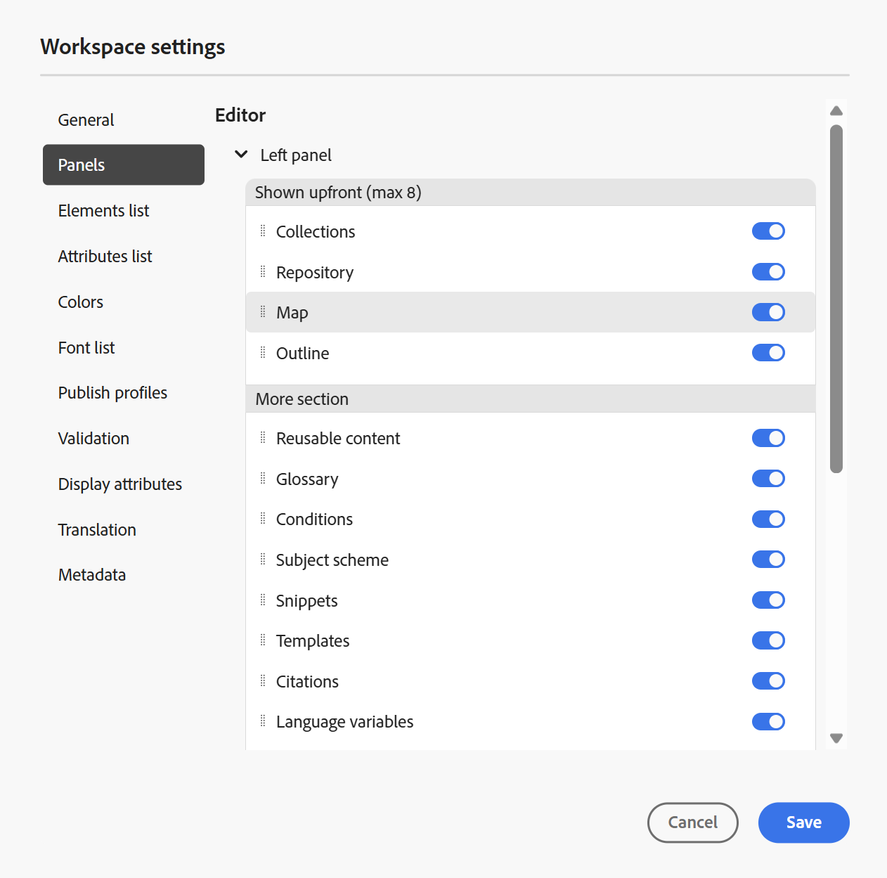

# 편집기 설정

편집기의 **탭 모음**&#x200B;에 있는 [설정](./web-editor-tab-bar.md) 옵션은 관리자 및 폴더 프로필 관리자만 사용할 수 있으며 다음 설정을 구성할 수 있습니다.

- [일반](#general)
- [패널](#panels)
- [요소 목록](#elements-list)
- [속성 목록](#attributes-list)
- [색상](#colors)
- [프로필 게시](#publish-profiles)
- [유효성 검사](#validation)
- [속성 표시](#display-attributes)
- [번역](#translation)
- [메타데이터](#metadata)

>[!NOTE]
>
> 기본 설정을 업데이트하는 경우 변경 사항을 적용하려면 문서를 다시 열어야 합니다.

## 일반

일반 설정을 사용하면 편집기를 사용하도록 설정을 구성할 수 있습니다. 이 탭에는 **AI 길잡이**, **작성**, **인용**, **조건** 및 **맞춤법 검사**&#x200B;의 5개 섹션이 포함되어 있습니다.

{width="350" align="left"}

- **AI 길잡이**
Experience Manager Guides에서 [AI Assistant](./ai-assistant.md) 기능을 활성화하려면 이 옵션을 선택하십시오. 기능을 비활성화하려면 선택 취소합니다.

  **AI Assistant** 토글을 활성화한 후 아래와 같이 **빠른 작업 작성** 메뉴를 사용하여 작성자가 **작성 탭**&#x200B;에 표시할 옵션을 구성할 수 있습니다.\
  이러한 변경 사항은 작업 중인 특정 폴더 프로필에 적용됩니다. 새 폴더 프로필을 만들면 기본적으로 **전역** 폴더 프로필에 정의된 편집기 설정을 상속합니다. **편집기 설정**&#x200B;을 사용하여 필요에 따라 이러한 설정을 수정하고 업데이트된 구성을 저장할 수 있습니다.\
  AI Assistant를 사용하여 작성할 수 있는 옵션에 대한 자세한 개요는 [AI Assistant를 사용하여 문서를 현명하게 작성](./ai-assistant-right-panel.md)하십시오.

  **빠른 작업 작성** 메뉴에서 다음을 수행할 수 있습니다.

   - 작성자가 AI Assistant를 사용하여 작업할 때 액세스할 수 있는 특정 옵션을 활성화하거나 비활성화하려면 전환을 사용합니다.

   - 옵션이 표시되는 순서를 변경하고 필요에 따라 끌어서 놓습니다.

  {width="350" align="left"}

- **작성**

   - **모두 바꾸기 사용**: **찾기 및 바꾸기** 패널에서 **모두 바꾸기** 아이콘을 보려면 이 항목을 선택하십시오.

- **인용**

  인용 유형을 변경합니다. 프로젝트에서 사용할 드롭다운에서 인용 스타일을 선택합니다. 자세한 내용은 [인용 스타일 변경](./web-editor-apply-citations.md#change-citation-style)을 참조하세요.

- **조건**

   - **작성자 보기에서 조건부 텍스트 강조 표시**: 작성자 보기에서 조건부 텍스트를 강조 표시하려면 이 항목을 선택합니다. 조건부 콘텐츠는 조건에 대해 정의된 색상을 사용하여 강조 표시됩니다.

   - **조건 특성으로 유효성 검사**: 특성에 대해 정의된 값의 유효성 검사를 허용하려면 이 항목을 선택하십시오. 이렇게 하면 잘못된 값을 추가할 수 없습니다.

   - **제목 구성표 패널에 제목이 있는 키 표시**: 제목 구성표의 제목과 함께 키를 표시하려면 이 항목을 선택하십시오. 이 옵션을 선택하지 않으면 제목만 표시됩니다. 예를 들어 여기에 &#39;os&#39;, &#39;audience&#39; 및 &#39;other&#39; 키도 제목과 함께 표시됩니다.

     {width="550" align="left"}

   - **조건 패널에 주제 구성표 표시**: 조건 패널에서 주제 구성표를 보려면 이 항목을 선택하십시오. 이 옵션을 선택 취소하면 정의된 조건이 [조건] 패널에 표시됩니다.

- **맞춤법 검사**
두 가지 옵션이 있습니다. **AEM 맞춤법 검사** 및 **브라우저 맞춤법 검사**. 기본적으로 편집기는 브라우저의 기본 제공 사전을 사용하여 맞춤법 검사가 수행되는 브라우저 맞춤법 검사 기능을 사용합니다. AEM 맞춤법 검사로 전환하여 Adobe Experience Manager 사전을 사용할 수 있습니다. 사용자 지정 단어 목록을 추가하도록 사용자 지정할 수도 있습니다. AEM 사전 사용자 지정에 대한 자세한 내용은 Adobe Experience Manager Guides as a Cloud Service 설치 및 구성 섹션에서 [AEM의 기본 사전 사용자 지정](../cs-install-guide/customize-aem-custom-dictionary.md) 섹션을 참조하십시오.

## 패널

이 설정은 편집기 및 맵 콘솔의 왼쪽 및 오른쪽 패널에 표시되는 패널을 제어합니다. 버튼을 전환하여 원하는 패널을 표시하거나 숨길 수 있습니다.

{width="650" align="left"}

패널에 있는 피쳐가 표시되는 순서를 정의할 수도 있습니다. 패널에서 사용할 수 있는 피쳐의 기본 순서를 변경하려면 점선 막대를 선택하여 피쳐 탭을 원하는 위치에 끌어다 놓습니다. 요구 사항에 따라 기능을 **자세히** 섹션에서 패널의 주 섹션으로 이동할 수도 있고 그 반대로 이동할 수도 있습니다. 재정렬되면 피쳐가 오른쪽 및 왼쪽 패널의 동일한 시퀀스에 나타납니다.

{width="650" align="left"}

한 번에 최대 8개의 패널을 표시할 수 있습니다. 패널 설정의 변경 사항은 즉시 적용됩니다.

>[!NOTE]
>
> 사용자 지정 패널이 구성된 경우 패널 목록에도 표시됩니다. 스위치를 전환하여 사용자 지정 패널을 표시하거나 숨길 수 있습니다.

## 요소 목록

관리자는 작성자가 파일에 삽입할 수 있는 요소 목록을 제어하고 요소의 표시 이름도 정의할 수 있습니다. 요소 목록 설정을 사용하면 DITA 사양에 따라 요소의 이름과 DITA 정의 요소 이름 대신 사용할 레이블을 지정할 수 있습니다.

{width="650" align="left"}

위의 스크린샷에서 `p` 요소에는 단락 레이블이 지정되었고, `codeblock`에는 다른 일부 요소와 함께 코드 블록 레이블이 지정됩니다. **위의 요소만 사용** 옵션을 선택하면 **요소 삽입** 대화 상자에 이 목록의 유효한 요소 \(현재 삽입 지점\)만 표시됩니다.

다음 스크린샷에서는 이전 스크린샷에서 구성된 4개 요소 중 3개만 현재 컨텍스트에 표시됩니다.

{width="300" align="left"}

## 속성 목록

요소 목록과 마찬가지로 속성 목록과 해당 표시 이름이 요소의 속성 목록에 표시되도록 제어할 수 있습니다. 다음 스크린샷에서는 3개의 속성만 요소의 속성 목록에 표시되도록 구성되었습니다.

{width="650" align="left"}

이 설정을 사용하면 요소에 속성을 추가하려고 할 때 목록에 구성된 속성 목록만 표시됩니다.

{width="300" align="left"}

## 색상

**Conditions**&#x200B;에 대해 미리 구성된 배경색 목록을 표시합니다. 사용자는 주제에 조건을 적용할 때 배경색을 선택할 수 있습니다. 관리자는 사용자 지정 배경색을 만들어 목록에 추가할 수도 있습니다. 새 색상을 추가하려면 **색상 이름** 필드에 원하는 이름을 입력하고 사용자 지정 색상을 선택한 다음 **+** 아이콘을 선택합니다. 사용자 정의 색상은 색상 목록 끝에 나타납니다.

## 프로필 게시

여기에는 **기술 자료** 출력을 게시하는 데 사용할 수 있는 프로필이 포함되어 있습니다. 대상 기술 자료에 대한 새 프로필을 만들 수 있습니다. 예를 들어 Salesforce 또는 ServiceNow가 있습니다.

**Salesforce 프로필 만들기**

**사전 요구 사항**

- Salesforce에 연결된 앱을 만듭니다. 자세한 내용은 [API 통합을 위해 OAuth 설정 사용](https://help.salesforce.com/s/articleView?id=sf.connected_app_create_api_integration.htm&type=5)을 참조하세요.

- 연결된 앱을 구성하는 동안 다음을 확인하십시오.

   - 콜백을 지정합니다.

     `URL: http://<server name>:<port>/bin/dxml/thirdparty/callback/salesforce`

   - 다음 OAuth 범위를 선택하십시오.
      - 전체 액세스(전체)
      - API(Manage user data via API)를 선택합니다

     앱이 구성되면 Salesforce에서 **소비자 키** 및 **소비자 암호**&#x200B;를 제공합니다. Salesforce 프로필을 만드는 데 사용할 수 있습니다.

   - Salesforce 프로필을 만들려면 **서버 유형** 드롭다운에서 **Salesforce** 기술 자료를 선택하십시오. 프로필 이름을 입력합니다. **사이트 URL**&#x200B;에서 출력을 게시하는 데 사용할 소비자 사이트를 입력한 다음 Salesforce 소비자 사이트에서 제공한 **소비자 키** 및 **소비자 암호**&#x200B;를 추가하십시오. 그런 다음 새로 만든 프로필을 **확인**&#x200B;하고 **저장**&#x200B;합니다.

     편집기 설정의 {width="550" align="left"}

     >[!NOTE]
     >
     >Experience Manager Guides에서 Salesforce용 프록시를 구성하려면 AEM에서 Apache HTTP 구성 요소 프록시 구성 을 사용합니다. [AEM 링크 검사기에 대한 프록시를 구성](https://helpx.adobe.com/experience-manager/kb/How-to-configure-proxy-for-the-AEM-Link-Checker-AEM.html)하는 방법을 알아봅니다.

**ServiceNow 프로필 만들기**

**사전 요구 사항**

자산을 업로드하도록 ServiceNow 서버를 구성합니다.

- **ServiceNow** 서버에 연결합니다.
- **시스템 속성** > **보안**(으)로 이동합니다.
- 다음 옵션을 선택 취소합니다.

  **업로드를 위해 MIME 유형 검사를 활성화하려면 이 속성을 설정해야 합니다(모든 버전 유레카 이상). 첨부 파일에 대한 MIME 유형 유효성 검사를 활성화(true)하거나 비활성화(false)합니다. Glide.attachment.extensions를 통해 구성된 파일 확장명은 업로드하는 동안 MIME 형식을 확인합니다.**

- **저장**&#x200B;을 선택합니다.

  앱을 구성했으면 **ServiceNow** 프로필을 만듭니다.

- 프로필을 만들려면 **서버 유형** 드롭다운에서 ServiceNow 기술 자료를 선택하십시오. **이름** 프로필을 입력하십시오. **ServiceNow URL**&#x200B;에서 출력을 게시하는 데 사용할 소비자 사이트를 입력한 다음 ServiceNow 소비자 사이트에서 제공한 **사용자 이름** 및 **암호**&#x200B;를 추가하십시오. 그런 다음 새로 만든 프로필을 **확인**&#x200B;하고 **저장**&#x200B;합니다.

  {width="550" align="left"}

  유효성을 검사한 후 DITA 맵의 출력 사전 설정에서 게시 프로필을 선택하고 이를 사용하여 선택한 **Salesforce** 또는 **ServiceNow** 서버에 대한 출력을 생성할 수 있습니다.

  [기술 자료](../user-guide/generate-output-knowledge-base.md) 출력 사전 설정에 대해 자세히 알아보세요.

## 유효성 검사

이 탭에는 편집기에서 Schematron 유효성 검사를 구성하는 옵션이 포함되어 있습니다. 다음 기능을 활성화할 수 있습니다.

- **파일을 저장하기 전에 유효성 검사 실행**: 저장 작업 전에 선택한 Schematron 파일을 사용하여 Schematron 유효성 검사를 실행하려면 이 옵션을 선택하십시오. + 아이콘을 선택하여 Schematron 파일을 추가할 수 있습니다. 선택한 Schematron 파일이 나열됩니다.

  >[!NOTE]
  >
  > 선택한 Schematron 파일이 선택한 폴더 프로필에 대해 유지됩니다.

  {width="550" align="left"}

  이렇게 하면 사용자가 선택한 Schematron 파일에 정의된 규칙을 벗어나는 파일을 저장할 수 없습니다. 이 옵션을 선택하지 않으면 변경 내용을 저장하기 전에 파일의 유효성을 검사하지 않습니다.

- **모든 사용자가 유효성 검사 패널에서 스키마 원본 파일을 추가할 수 있도록 허용**: 사용자가 편집기의 유효성 검사 패널에서 스키마 원본 파일을 추가할 수 있도록 하려면 이 옵션을 선택하십시오. 이를 통해 사용자는 Schematron 파일을 추가한 다음 Schematron 파일에 대해 항목을 확인할 수 있습니다. 이 옵션을 선택하지 않으면 편집기의 **유효성 검사 패널**&#x200B;에서 사용자가 **Schematron 파일 추가** 단추를 추가하는 옵션을 사용할 수 없습니다.

## 속성 표시

속성 목록과 마찬가지로 요소의 속성 목록에 표시할 속성 목록을 제어할 수 있습니다. 기본적으로 네 개의 **표시 특성**(대상, 플랫폼, 제품 및 prop)이 요소의 특성 목록에 표시되도록 구성되었습니다. 맨 위에 있는 **추가** 아이콘을 사용하여 표시 특성을 추가할 수도 있습니다. **삭제** 아이콘을 사용하여 표시 특성을 삭제할 수도 있습니다.

요소에 대해 정의된 속성이 레이아웃 및 아웃라인 뷰에 표시됩니다.

{width="550" align="left"}

## 번역

이 탭에는 언어 그룹을 만들고, 소스 레이블을 대상 버전에 전파하고, 번역 프로젝트를 정리하는 옵션이 포함되어 있습니다.

{width="550" align="left"}

- **언어 그룹**: 관리자는 언어 그룹을 만들어 콘텐츠를 번역할 수 있습니다.

  새 언어 그룹을 만들려면 다음 단계를 수행하십시오.

   1. **추가**&#x200B;를 선택합니다.
   1. 언어 그룹 이름을 입력합니다. 각 언어에는 고유한 이름이 있어야 합니다. 이름 필드가 비어 있거나 이름이 고유하지 않은 경우 오류를 볼 수 있습니다.
   1. 드롭다운에서 언어를 선택합니다. 여러 언어를 선택할 수 있습니다.

      원하는 언어를 필터링하려면 언어의 처음 몇 글자 또는 언어 코드를 입력합니다. 예를 들어 &#39;en&#39;을 입력하면 &#39;en&#39;이 포함된 모든 언어를 이름이나 코드의 시작 부분에 필터링합니다.

   1. 완료 아이콘을 선택하여 선택한 언어를 그룹에 추가합니다. 언어가 표시됩니다. 3개 이상의 언어를 추가하면 **더 보기** 옵션이 표시됩니다. **자세히 표시**&#x200B;를 선택하여 그룹에 있는 모든 언어를 볼 수 있습니다.

      >[!TIP]
      >
      > **자세히 표시**&#x200B;에서 **간단히 표시**(으)로 전환하고 일부 언어만 봅니다.

   1. 그룹의 언어 위로 마우스를 가져가 을 편집하거나 언어 그룹을 합니다.
   1. **설정**&#x200B;을 저장합니다.

      >[!NOTE]
      >
      >사용자는 폴더 프로필에 구성된 언어 그룹을 볼 수 있습니다.

- **원본 버전 레이블을 대상 버전에 전파**: 원본 파일 버전 레이블을 번역된 파일에 전달하려면 이 옵션을 선택하십시오. 기본적으로 비활성화되어 있습니다.
- **완료 후 번역 프로젝트 정리**: 번역 프로젝트를 번역 후 자동으로 사용하지 않도록 설정하거나 삭제하도록 구성하려면 이 옵션을 선택하십시오. 번역 후 프로젝트가 존재하도록 기본적으로 **없음**&#x200B;이 선택됩니다.

  나중에 사용하려면 번역 프로젝트를 비활성화할 수 있습니다. 프로젝트를 삭제하면 프로젝트에 있는 모든 파일과 폴더가 영구적으로 삭제됩니다.

## 메타데이터

**버전 기록** 대화 상자에 항목의 버전 메타데이터와 해당 값이 표시되도록 제어할 수 있습니다.  메타데이터 경로에서 메타데이터를 선택할 노드의 위치를 지정합니다. 메타데이터의 사용자 지정 이름을 레이블로 정의할 수도 있습니다. 기본 등록 정보는 제목, 문서 상태 및 태그입니다.

에셋의 `/jcr:content` 노드 아래에 있는 모든 속성에서 메타데이터를 선택할 수 있으므로 속성의 경로를 메타데이터 경로로 추가할 수 있습니다.

메타데이터 경로가 비어 있으면 오류가 표시됩니다. 레이블을 비워 두면 마지막 요소가 레이블로 선택됩니다.

편집기 설정의 {width="550" align="left"}

***버전 기록**대화 상자에 대한 메타데이터를 구성합니다.*

이러한 메타데이터 태그가 표시되는 순서를 정의할 수도 있습니다. 이러한 태그의 기본 순서를 변경하려면 점선 막대를 선택하여 원하는 위치에 태그를 드래그하여 놓습니다.
메타데이터 레이블은 편집기의 **버전 기록** 대화 상자에서 동일한 순서로 나타납니다.

**상위 항목:**[&#x200B;편집기 소개](web-editor.md)
