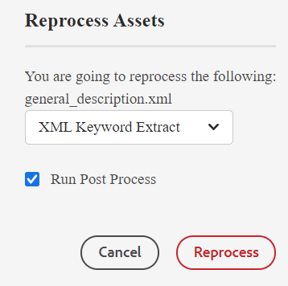

# 스마트 태깅 {#id216KH0ID0Y8}

>[!IMPORTANT]
>
> 스마트 태그 지정 기능은 즉시 사용할 수 없으며 시스템 관리자에게 문의해야 하는 사용자 지정 구현이 필요합니다.

Adobe Experience Manager Guides에는 스마트 태그를 추가하는 기능이 포함되어 있습니다. XML 키워드 추출 도구를 사용하여 스마트 태그를 추출할 수 있습니다. 이 도구는 인공 지능을 사용하여 내용을 이해하고 관련 키워드를 제공한다. 스마트 태그를 사용하여 검색 엔진 최적화 \(SEO\)를 개선하고 사용자가 관련 콘텐츠를 찾을 수 있도록 지원할 수 있습니다.

스마트 태그를 만들려면 다음 단계를 수행하십시오.

1. Assets UI에서 스마트 태그를 만들 주제로 이동합니다.
1. 미리 보기 모드에서 항목을 열고 기본 도구 모음에서 **Assets 다시 처리** 아이콘을 선택합니다.
1. XML 키워드 추출을 선택하여 관련 키워드를 추출합니다.

   {width="300"}

1. 사후 프로세스 실행 옵션을 선택합니다. 도구가 성공적으로 시작되면 메시지가 표시됩니다.
1. 태그는 자동으로 추출되며 선택한 주제의 속성 페이지에서 볼 수 있습니다.

   

   >[!NOTE]
   >
   > XML 키워드 추출 도구를 통해 키워드를 추출하는 것 외에도 속성 페이지에서 스마트 태그를 추가, 삭제 또는 사용자 지정할 수 있습니다.

*고객 지원 팀에 문의하여 환경에서 이 기능을 활성화하십시오. 기본 지원의 일부로 사용할 수 없습니다.*

**상위 항목:**[&#x200B;메타데이터 관리](manage-metadata.md)
