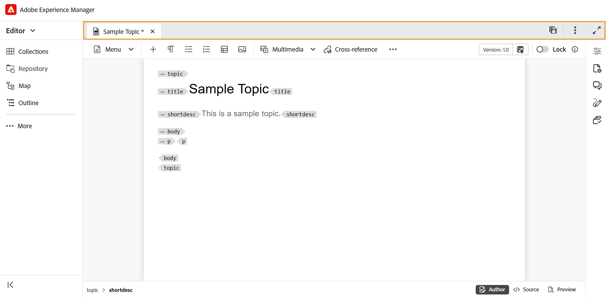

# 편집기의 탭 모음

탭 표시줄은 편집기 인터페이스 맨 위에 있으며 다음 기능에 대한 액세스를 제공합니다.

**탭**

편집기에서 현재 열려 있는 주제를 파일 탭으로 표시합니다. 여러 개의 주제를 동시에 열 수 있으며 탭 표시줄의 각 탭에 표시됩니다. 기본적으로 탭에서 파일 제목을 볼 수 있습니다. 파일 위로 마우스를 가져가면 파일 제목과 파일 경로를 도구 설명으로 볼 수 있습니다.

>[!NOTE]
>
> 관리자는 탭에서 파일 이름별로 파일 목록을 보도록 선택할 수도 있습니다. [사용자 환경 설정](./intro-home-page.md#user-preferences)에서 **편집기 파일 표시 구성** 섹션의 **파일 이름** 옵션을 선택하십시오.

파일 탭을 선택하면 새 버전으로 저장, 복사, 위치, 추가, 속성, 분할, PDF으로 다운로드 및 닫기 옵션이 있는 컨텍스트 메뉴가 열립니다.

**모두 저장**

열려 있는 모든 항목에서 변경한 내용을 저장합니다. 편집기에서 여러 항목을 연 경우 **모두 저장**&#x200B;을 선택하거나 **Ctrl**+**S** 바로 가기 키를 사용하면 한 번의 클릭으로 모든 문서가 저장됩니다. 각 문서를 개별적으로 저장할 필요는 없습니다.

>[!NOTE]
>
> **모두 저장** 작업은 새 버전의 주제를 만들지 않습니다. 새 버전을 만들려면 **새 버전으로 저장** 옵션을 사용하십시오.

**AI 길잡이**

스마트 도움말 및 작성 기능을 통해 생산성을 향상시키도록 설계된 강력한 AI 기반 도구입니다. 강력한 두 가지 AI 기능(**작성** 및 **도움말**)을 Experience Manager Guides 인터페이스에 포함시켜 콘텐츠를 작성하고 Experience Manager Guides 설명서에서 정보에 보다 빠르고 효율적으로 액세스할 수 있도록 합니다.

>[!NOTE]
>
> AI Assistant 기능은 현재 Adobe Experience Manager Guides as a Cloud Service에서 사용할 수 있습니다.

**보기 확장**: **확장** 아이콘을 사용하여 페이지 보기를 확장할 수 있습니다. 이 보기에서는 Adobe Experience Manager 로고가 포함된 헤더 막대가 숨겨집니다. 이렇게 하면 편집할 컨텐츠 공간이 최대화됩니다. 표준 보기로 돌아가려면 **확장된 보기로 끝내기** 아이콘을 사용합니다.

**추가 작업**: 추가 옵션에 대한 액세스를 제공합니다. 이 버튼을 선택하면 다음 옵션이 있는 메뉴가 열립니다.

- **Assets**: 설정에 따라 대상으로 이동합니다.
   - **클라우드 서비스**: 클라우드 서비스를 사용하는 경우 **Assets** 옵션을 선택하면 AEM 탐색 페이지로 이동합니다.

   - **온-프레미스 소프트웨어**: Adobe Experience Manager Guides(4.2.1 이상)를 사용하는 경우 **Assets** 옵션을 선택하면 Assets UI의 현재 파일 경로로 이동합니다.
- **설정**: 편집기 설정 대화 상자로 이동합니다. 자세한 내용은 [편집기 설정 작업](./web-editor-settings.md)을 참조하세요.

**상위 항목:**&#x200B;[&#x200B;편집기 소개](web-editor.md)
