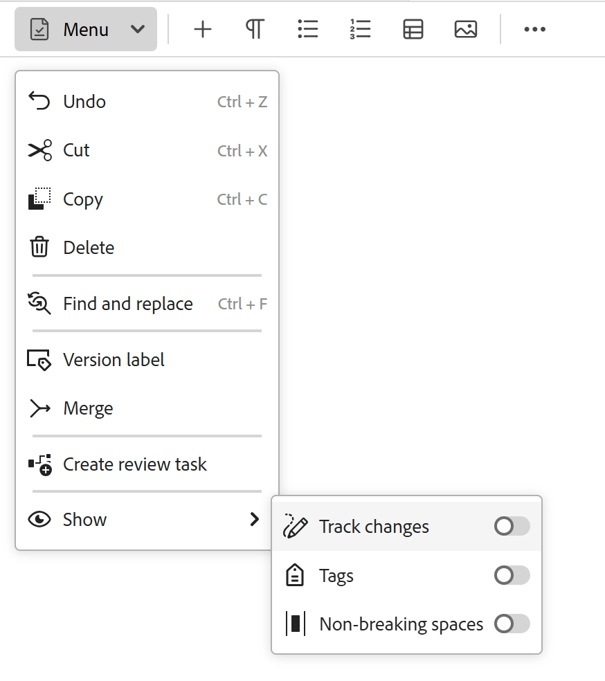
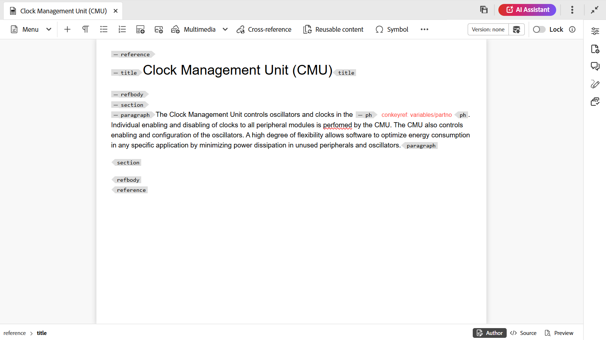
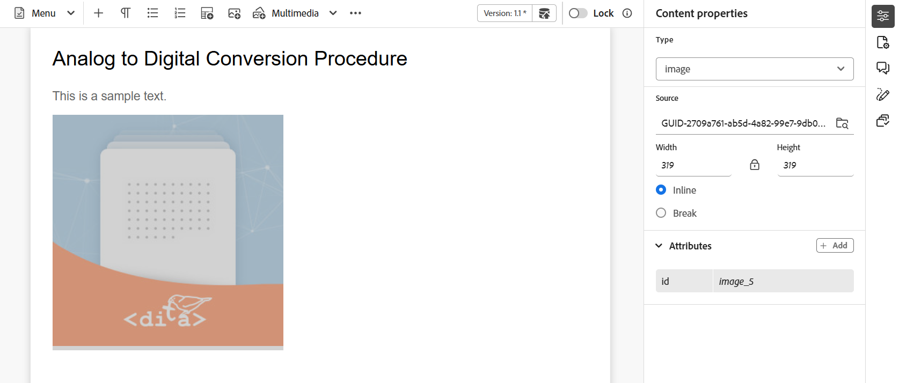
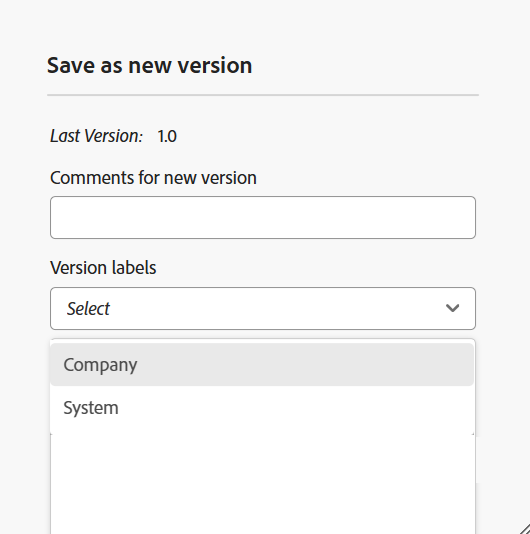

# 편집기의 도구 모음

도구 모음은 편집기에서 편집할 주제 또는 맵을 열 때 나타납니다. 도구 모음에서 사용할 수 있는 기능은 다음과 같습니다.

- [메뉴 드롭다운](#menu-dropdown)
- [콘텐츠 삽입 옵션](#content-insertion-options)
- [버전 정보 및 새 버전으로 저장 버튼](#version-information-and-save-as-new-version)
- [잠금/잠금 해제](#lockunlock)

>[!NOTE]
>
> 위에 나열된 기능은 주제 파일에만 적용됩니다. 맵 파일로 작업할 때 현재 맵 편집기 뷰를 기준으로 도구 모음에 다른 옵션이 표시됩니다. [맵 편집기 기능](./map-editor-advanced-map-editor.md) 문서에서 맵 편집기 도구 모음 옵션에 대해 알아봅니다.

## 메뉴 드롭다운

메뉴 드롭다운에서는 편집 작업, 찾기 및 바꾸기, 버전 기록, 버전 레이블, 병합, 검토 만들기 작업 및 표시 메뉴(변경 내용 추적, 태그, 줄바꿈 안 함 포함)에 액세스할 수 있습니다.

편집기 도구 모음의 {width="350" align="left"}

이러한 기능에 대한 자세한 설명은 다음과 같습니다.

**작업 편집**

편집기에서 주제를 편집할 때 메뉴 드롭다운에 있는 **잘라내기** 또는 ***Ctrl***+***X*** , **복사** 또는 ***Ctrl***+***C*** , **실행 취소** 또는 ***Ctrl***+***Z*** , **다시 실행** 또는 ***Ctrl***+***Y*** 및 **삭제** 등의 다양한 편집 작업에 액세스하십시오.

**찾기 및 바꾸기**

**찾기 및 바꾸기** 기능은 작성자 및 Source 보기 모드에서 사용할 수 있습니다. 활성화되면 항목 편집 영역 하단에 찾기 및 바꾸기 텍스트 막대가 나타납니다. 바로 가기 키 **CTRL**+**F**&#x200B;을 사용하여 찾기 및 바꾸기 표시줄을 호출할 수 있습니다.

{align="left"}

설정 아이콘 \(\)을 사용하여 **대/소문자 무시** 및 **단어 단위만** 검색 옵션을 전환할 수 있습니다. 대/소문자를 구분하지 않는 검색을 수행하려면 **대/소문자 무시** 옵션을 \(또는 select\) 설정합니다. 또는 대/소문자를 구분하는 검색을 수행하려면 **대/소문자 무시** 옵션을 \(또는 선택 해제\)하십시오. 전체 단어를 검색하도록 선택할 수도 있습니다.

검색은 즉시 수행됩니다. 즉, **찾기** 필드에 검색 구문이나 단어를 입력하면 검색어가 즉시 검색되어 항목에서 선택됩니다. 마찬가지로 주제의 텍스트를 바꾸려면 각 필드에 검색어와 바꾸기 항목을 입력하고 **바꾸기** 또는 **모두 바꾸기** 단추를 선택합니다.

Source 보기에서 **찾기 및 바꾸기** 기능은 특정 요소나 특성을 검색하는 데 매우 유용합니다. 예를 들어 `@product` 특성의 값을 바꾸려면 Source 보기에서 쉽게 수행할 수 있습니다. 작성자 보기에서는 속성 또는 요소를 기준으로 검색할 수 없습니다. 그러나 **모두 바꾸기** 기능을 사용하는 동안에는 XML 코드를 덮어쓸 수 있으므로 주의해야 합니다.

**버전 기록**

편집기의 **버전 기록** 기능을 사용하면 사용 가능한 DITA 파일 버전을 확인하고, 비교하고, 편집기 자체의 버전으로 되돌릴 수 있습니다. 현재 버전(작업 복사본일 수도 있음)의 콘텐츠 및 메타데이터와 동일한 파일의 이전 버전을 비교할 수 있습니다. 비교 버전에 대한 레이블과 주석을 볼 수도 있습니다.

>[!NOTE]
>
> 버전 기록 옵션은 주제나 맵의 첫 번째 버전에 변경 사항이 있는 경우에만 나타납니다.

    
 버전 기록에 액세스하는 단계 

1. 편집기에서 주제를 엽니다.
1. **메뉴** 드롭다운에서 **버전 기록**&#x200B;을 선택합니다.

   **버전 기록** 대화 상자가 나타납니다.

   {width="550" align="left"}

   *주제의 다른 버전에서 변경 내용을 미리 봅니다.*

1. **비교 대상** 드롭다운 목록에서 비교하거나 되돌릴 항목의 버전을 선택합니다.

   >[!NOTE]
   >
   > 버전에 레이블이 적용된 경우 버전 번호와 함께 \(대괄호\)로 표시됩니다.

1. 현재 및 비교 버전에 적용된 레이블 및 설명을 보려면 **레이블 및 설명 보기** 옵션을 활성화하십시오.
1. **버전 기록** 대화 상자에서도 다음 정보를 볼 수 있습니다.

   **미리 보기** 탭: 새로 추가된 콘텐츠는 녹색 글꼴이고 삭제된 콘텐츠는 빨간색 글꼴입니다.

   **메타데이터** 탭: 새로 추가된 메타데이터는 녹색 글꼴이고 삭제된 메타데이터는 빨간색 글꼴입니다.

   {width="550" align="left"}메타데이터 차이점

   *버전 기록에서 다른 버전의 메타데이터를 비교합니다.*

   >[!NOTE]
   >
   > 시스템 관리자는 **설정**&#x200B;의 메타데이터 탭에서 표시할 메타데이터를 변경할 수 있습니다. 자세한 내용은 **탭 모음**&#x200B;의 [추가 작업](./web-editor-tab-bar.md) 섹션을 참조하세요.

   현재 및 비교 버전의 사용자 및 시간 세부 사항을 볼 수도 있습니다.

   드롭다운 목록에서 버전을 선택하면 **선택한 버전으로 되돌리기** 옵션이 제공됩니다. 미리보기 창에는 현재 버전과 선택한 항목 버전 간의 차이점이 표시됩니다.

1. **선택한 버전으로 되돌리기**&#x200B;를 선택하여 선택한 버전의 항목으로 작업 복사본을 되돌립니다.

   버전 되돌리기 대화 상자가 나타납니다.

   {width="550" align="left"}

1. \(*선택 사항*\) 이전 버전으로 되돌리는 이유를 제공합니다. 주제의 현재 활성 작업 복사본에 대한 새 버전을 만들 수도 있습니다.

1. **확인**&#x200B;을 선택합니다.

   파일의 작업 복사본이 선택한 버전으로 되돌아갑니다. 현재 활성 작업 복사본의 새 버전을 만들도록 선택하면 모든 작업 변경 사항과 함께 파일의 새 버전도 만들어집니다.

   이전 버전으로 되돌리면 현재 작업 중인 버전이 최신 버전이 아님을 나타내는 시각적 큐가 표시됩니다.

   {align="left"}

**버전 레이블**

레이블은 DDLC \(Document Development Life Cycle\)에 특정 주제가 있는 단계를 식별하는 데 도움이 됩니다. 예를 들어 한 주제에 대해 작업할 때 레이블을 &quot;승인됨&quot;으로 설정할 수 있습니다. 주제가 게시되어 고객이 사용할 수 있게 되면 해당 주제에 &quot;릴리스됨&quot; 레이블을 할당할 수 있습니다.

Experience Manager Guides을 사용하면 자유 형식 텍스트 형식으로 레이블을 지정하거나 사전 정의된 레이블 세트를 사용할 수 있습니다. 사용자 지정 레이블을 사용하면 시스템의 모든 작성자가 선택에 따라 레이블을 지정할 수 있습니다. 이렇게 하면 유연성이 제공되지만 시스템에 일관되지 않은 레이블이 도입됩니다. 이 문제를 해결하기 위해 관리자는 사전 정의된 레이블 세트를 구성할 수 있습니다. 미리 정의된 레이블을 구성하는 방법에 대한 자세한 내용은 Adobe Experience Manager Guides as a Cloud Service 설치 및 구성에서 *XML Web Editor 구성 및 사용자 지정*&#x200B;을 참조하십시오.

이러한 레이블은 작성자가 레이블을 지정해야 하는 경우 드롭다운 목록 형태로 표시됩니다. 이렇게 하면 미리 정의된 일관된 레이블만 시스템에서 사용됩니다.

Assets UI의 [버전 내역](web-editor-use-label.md) 패널, [기준선](/help/product-guide/user-guide/generate-output-use-baseline-for-publishing.md) UI 및 편집기와 같이 주제에 레이블을 적용할 수 있는 다양한 방법이 있습니다. 편집기의 버전 레이블 기능을 사용하면 작성자가 주제에 레이블을 빠르고 쉽게 할당할 수 있습니다.

    
 편집기에서 주제에 레이블을 추가하는 단계 

1. 편집기에서 주제를 엽니다.

1. 메뉴 드롭다운에서 **버전 레이블**&#x200B;을 선택합니다.

   [버전 레이블 관리] 대화 상자가 표시됩니다.

   {width="350" align="left"}

   버전 레이블 관리 대화 상자는 두 부분으로 분할됩니다. 왼쪽 패널에는 레이블 드롭다운 목록 \(또는 레이블을 입력할 텍스트 상자\)과 함께 주제에 사용할 수 있는 버전 목록이 있고 오른쪽 패널에는 주제를 미리 볼 수 있습니다.

1. 레이블을 적용할 버전을 선택합니다.

   버전 목록에서 다른 버전의 항목을 선택하면 미리보기 패널에 현재 버전과 선택한 버전의 항목 사이에 변경 사항이 표시됩니다

   >[!NOTE]
   >
   > 레이블이 버전에 이미 적용된 경우 드롭다운 목록의 버전 번호 옆에 버전 선택 목록 아래에 표시됩니다. 레이블 옆에 있는 \(**x**\) 아이콘을 선택하여 기존 레이블을 제거할 수 있습니다.

1. 관리자가 레이블 목록을 정의한 경우 적용할 레이블을 선택할 수 있는 레이블의 드롭다운 목록이 표시됩니다. 드롭다운 목록에서 여러 레이블을 선택할 수 있습니다.

   또는 주제에 추가할 레이블을 입력할 수 있는 텍스트 상자가 표시됩니다.

   >[!NOTE]
   >
   > 여러 버전의 주제에 동일한 레이블을 적용할 수 없습니다. 기존 레이블을 연결하려고 하면 기존 버전에서 레이블을 제거하고 선택한 항목 버전에 적용할 수 있는 옵션이 제공됩니다.

1. **레이블 추가**&#x200B;를 선택합니다.

1. 레이블 적용 확인 메시지에서 레이블을 기존 버전에서 선택한 버전으로 이동하려면 **레이블 이동(다른 버전에서 사용하는 경우)** 옵션을 선택합니다. 이 옵션을 선택하지 않고 주제의 다른 버전에 지정된 레이블이 있는 경우 선택한 주제의 버전으로 이동되지 않습니다. 이러한 레이블은 레이블 적용 프로세스에서 무시됩니다.

**병합**

다중 작성자 환경에서 작업할 때 다른 작성자가 주제나 맵에서 변경한 내용을 추적하기가 어려워집니다. 병합 기능을 사용하면 변경 내용을 볼 수 있을 뿐만 아니라 문서의 최신 버전에서 유지되는 변경 내용도 보다 세밀하게 제어할 수 있습니다.

    
 주제 파일 병합 

항목의 변경 내용을 병합하려면 다음 단계를 수행합니다.

1. 편집기에서 주제를 엽니다.

1. **병합**&#x200B;을 선택합니다.

   병합 대화 상자가 나타납니다.

   {width="550" align="left"}

1. *\(선택 사항\)* 저장소의 다른 위치에서 새 파일을 찾아 선택할 수도 있습니다.

1. 파일의 현재 버전을 비교할 파일 버전을 선택합니다.

1. 옵션에서 다음을 선택합니다.

   - **선택한 버전에서 변경 내용 추적**: 이 옵션은 모든 콘텐츠 업데이트를 추적된 변경 내용 형식으로 표시합니다. 그런 다음 한 번에 하나씩 또는 한 번에 모두 문서의 변경 내용을 적용하거나 거부하도록 선택할 수 있습니다.

   - **선택한 버전으로 되돌리기**: 이 옵션은 문서의 현재 버전을 선택한 버전으로 되돌립니다. 이 옵션은 수락 또는 거부되는 콘텐츠에 대한 제어 권한을 제공하지 않습니다.

1. **완료**&#x200B;를 선택합니다.

1. **선택한 버전에서 변경 내용 추적** 옵션을 선택한 경우 선택한 버전에서 모든 변경 내용이 오른쪽 패널의 [추적된 변경 내용] 기능에 표시됩니다.

   [추적된 변경 내용] 패널의 모든 주석을 수락 또는 거부하거나 개별 주석을 수락 또는 거부하도록 선택할 수 있습니다.

    
 맵 파일 병합 

맵 파일에서 변경 사항을 병합하려면 다음 단계를 수행하십시오.

1. 편집기에서 맵을 엽니다.

1. **병합**&#x200B;을 선택합니다.

   병합 대화 상자가 나타납니다.

   {width="550" align="left"}

1. *\(선택 사항\)* 저장소의 다른 위치에서 새 파일을 찾아 선택할 수도 있습니다.

1. 파일의 현재 버전을 비교할 파일 버전을 선택합니다.

1. 옵션에서 다음을 선택합니다.

   - **선택한 버전에서 변경 내용 추적**: 이 옵션은 변경 내용 추적 형식으로 모든 콘텐츠 업데이트를 표시합니다. 그런 다음 한 번에 하나씩 또는 한 번에 모두 문서의 변경 내용을 적용하거나 거부하도록 선택할 수 있습니다.

   - **선택한 버전으로 되돌리기**: 이 옵션은 문서의 현재 버전을 선택한 버전으로 되돌립니다. 이 옵션은 수락 또는 거부되는 콘텐츠에 대한 제어 권한을 제공하지 않습니다.

1. **완료**&#x200B;를 선택합니다.

1. **선택한 버전의 변경 내용 추적** 옵션을 선택한 경우 선택한 버전의 모든 변경 내용이 [추적된 변경 내용] 패널 \(오른쪽\)에 표시됩니다.

   [변경 내용 추적] 패널에서 모든 변경 내용을 적용하거나 거부하도록 선택하거나 맵 파일에서 개별 변경 내용을 적용하거나 거부하도록 선택할 수 있습니다.

**검토 작업 만들기**

편집기에서 직접 현재 주제 또는 맵 파일의 [검토 작업을 만들](./review-send-topics-for-review.md)수 있습니다. 리뷰 작업을 만들 파일을 열고 메뉴 드롭다운에서 **리뷰 작업 만들기**&#x200B;를 선택하여 리뷰 만들기 프로세스를 시작합니다.

**메뉴 표시**

보기(Show) 메뉴는 다음 기능으로 구성됩니다.

- **변경 내용 추적:** 변경 내용 추적 모드를 사용하여 문서에 대한 모든 업데이트를 추적할 수 있습니다. 변경 내용 추적을 활성화하면 모든 삽입 및 삭제 내용이 문서에 캡처됩니다. 삭제된 모든 콘텐츠는 취소선을 사용하여 강조 표시되고 모든 삽입은 녹색 텍스트로 강조 표시됩니다. 또한 항목 페이지의 가장자리에 변경 막대가 표시됩니다. 삭제된 컨텐츠에 대해서는 빨간색 막대가 표시되고 추가된 컨텐츠에 대해서는 녹색 막대가 표시됩니다. 동일한 줄에 추가와 삭제가 있는 경우 녹색 막대와 빨간색 막대가 모두 표시됩니다.
다음 스크린샷에서는 변경 막대와 함께 삭제되고 삽입된 콘텐츠를 강조 표시합니다.
  {width="650" align="left"}

  문서의 변경 내용을 추적하는 일반적인 사용 사례는 동료 검토를 수행하는 것입니다. 변경 내용 추적을 활성화하고 검토할 문서를 공유할 수 있습니다. 그러면 검토자가 변경 내용 추적을 켜고 변경합니다. 문서를 받으면 변경 사항을 수락하거나 거부할 수 있는 편리한 방법과 함께 제안된 업데이트를 볼 수 있는 메커니즘이 있어야 합니다.

  Experience Manager Guides은 문서에서 수행한 업데이트에 대한 정보가 포함된 추적된 변경 사항 기능을 제공합니다. 추적된 변경 내용 기능은 수행한 업데이트, 수행한 사용자 및 시간에 대한 정보를 제공합니다. 변경 내용 추적 기능을 사용하면 문서에서 제안된 업데이트를 쉽게 수락하거나 거부할 수 있습니다.

  기능에 액세스하려면 오른쪽 패널에서 **변경 내용 추적** 아이콘을 선택하십시오.

  {width="300" align="left"}

  변경 내용을 추적하면 문서에서 변경된 내용이 선택됩니다. 변경 내용 적용 아이콘을 선택하여 변경 내용을 적용하거나, 변경 내용 거부를 선택하여 변경 내용을 거부할 수 있습니다.

  한 번의 클릭으로 모든 변경 내용을 적용하거나 거부하려면 **모든 변경 내용 적용** 또는 **모든 변경 내용 적용 취소**&#x200B;를 선택합니다.

  >[!NOTE]
  >
  > 미리보기 모드에서는 변경된 컨텐트의 마크업을 사용하거나 사용하지 않고 문서를 볼 수 있습니다. 자세한 내용은 [미리 보기](web-editor-views.md#preview-mode) 모드를 참조하십시오.

- **태그:** 편집기의 **태그** 기능은 DITA 요소의 가시성을 제어하는 토글 단추입니다. 활성화되면 컨텐츠 내에 구조적 태그가 표시되어 기본 DITA 요소를 보다 효과적으로 보고 관리할 수 있습니다. 비활성화되면 편집기는 이러한 태그를 숨겨 보다 깨끗하고 집중적인 작성 환경을 제공합니다.

  다음 스크린샷은 태그 보기가 활성화된 문서를 보여 줍니다.

  {width="650" align="left"}

  태그를 사용하는 문서에서 다음 작업을 수행할 수 있습니다.

   - **요소 선택**: 요소의 열기 또는 닫기 태그를 선택하여 해당 콘텐츠를 선택합니다.

   - **태그 확장 또는 축소**: 태그를 확장하거나 축소하려면 + 또는 - 기호를 선택합니다.

   - **상황에 맞는 메뉴 사용**: 상황에 맞는 메뉴는 선택한 요소를 잘라내거나 복사하거나 붙여넣을 수 있는 옵션을 제공합니다. 선택한 요소 앞 또는 뒤에 요소를 삽입할 수도 있습니다. 다른 옵션을 사용하면 ID를 생성하거나 선택한 요소에 대한 속성 패널을 열 수 있습니다.

   - **요소 드래그 앤 드롭**: 요소의 태그를 선택하여 문서에 쉽게 드래그 앤 드롭할 수 있습니다. 드롭 위치가 요소가 허용되는 유효한 위치인 경우 요소는 드롭된 위치에 배치됩니다.

  >[!NOTE]
  >
  > 사용자가 편집기에서 태그 보기를 활성화하면 세션 중에도 활성화된 상태로 유지됩니다. 즉, 나중에 액세스하기 위해 태그 보기를 다시 활성화할 필요가 없습니다. 새 사용자의 세션에 대한 태그 보기의 기본값은 `tagsView` 파일의 `ui\_config.json` 속성에 의해 결정됩니다. 자세한 내용은 Adobe Experience Manager Guides as a Cloud Service 설치 및 구성에서 [태그 보기에 대한 기본값 구성](../cs-install-guide/configure-default-value-tags-view.md) 섹션을 참조하십시오.

- **줄바꿈하지 않는 공백:** 편집기에서 편집하는 동안 줄바꿈하지 않는 공백에 대한 표시기를 표시하려면 이 옵션을 사용합니다. DITA 주제 및 DITA 맵에 대한 **작성자** 보기에서만 볼 수 있습니다.

## 콘텐츠 삽입 옵션

**요소** - 

현재 또는 다음 유효한 위치에 유효한 요소를 삽입합니다. 키보드 단축키 ***Alt***+***Enter***&#x200B;를 사용하여 요소 대화 상자를 열 수도 있습니다. 예를 들어, 단락을 편집한 다음 **요소** 대화 상자에서 단락에 삽입할 수 있는 요소 목록이 나타납니다. 삽입할 요소를 선택합니다. 키보드를 사용하여 요소 목록을 스크롤하고 ***Enter***&#x200B;를 눌러 필요한 요소를 삽입할 수 있습니다.

다음 두 가지 유형의 유효한 요소를 볼 수 있습니다.

- **현재 위치의 올바른 요소**: 현재 커서 위치 자체에 삽입할 수 있는 요소가 목록에 표시됩니다.

- **현재 위치 외부의 올바른 요소**: 요소 계층 구조 내에서 현재 요소의 부모 뒤에 삽입할 수 있는 요소가 목록에 표시됩니다.

예를 들어 인라인 `<b>` 요소 내에 있는 경우 `<u>`, `<xref>`, `<i>`과(와) 같은 요소를 현재 위치에 삽입할 수 있습니다. 반대로 `<table>` 및 `<topic>`과(와) 같은 요소를 현재 위치 외부에 삽입할 수 있습니다.

검색 상자에 문자나 문자열을 입력하고 문자열로 시작되는 요소를 검색할 수도 있습니다.

{width="300" align="left"}

*&#39;t&#39;로 시작하는 모든 유효한 요소를 검색하려면 &#39;t&#39;를 입력하십시오.*

`note`과(와) 같은 블록 요소 내에서 작업하는 경우 요소 삽입 아이콘을 사용하여 `note` 요소 뒤에 새 요소를 삽입합니다. 다음 스크린샷에서는 참고 요소가 p \(paragraph\) 요소 내부에 삽입되었습니다.

{align="left"}

메모 요소에서 Enter 키를 누르면 메모 요소 자체에 새 단락이 만들어집니다. 메모 외부에 새 요소를 삽입하려면 요소 경로에서 p 요소 \(스크린샷에 강조 표시\)를 선택한 다음 요소 아이콘을 선택하거나 ***Alt***+***Enter***&#x200B;를 눌러 요소 삽입 대화 상자를 엽니다. 그런 다음 원하는 요소를 선택하고 Enter 키를 눌러 메모 요소 뒤에 선택한 요소를 삽입합니다.

깜박이는 블록 커서가 나타날 때 두 요소 사이에 요소를 추가할 수도 있습니다.

{width="300" align="left"}

예를 들어, DITA 주제에서 작업 중일 때 짧은 설명과 본문 사이에 블록 커서가 깜박이면 `prolog` 요소를 추가한 다음 저작권, 작성자 및 기타 세부 정보를 추가할 수 있습니다.

컨텍스트 메뉴를 사용하여 새 요소를 입력할 수도 있습니다. 문서의 아무 곳이나 마우스 오른쪽 버튼으로 클릭하여 컨텍스트 메뉴를 호출합니다. 이 메뉴에서 **요소 삽입**&#x200B;을 선택하여 **요소 삽입** 대화 상자를 표시하고 삽입할 요소를 선택합니다.

{width="300" align="left"}

**단락** - 

현재 또는 다음 유효한 위치에 단락 요소를 삽입합니다.

**글머리 기호 목록** - 

현재 또는 다음 유효한 위치에 글머리 기호 목록을 만듭니다. 글머리 기호 목록에 있는 경우 이 아이콘을 선택하면 항목이 일반 단락으로 변환됩니다.

**번호 매기기 목록** - 

현재 또는 다음 유효한 위치에 번호 매기기 목록을 만듭니다. 번호 매기기 목록에서 이 아이콘을 선택하면 항목이 일반 단락으로 변환됩니다.

>[!NOTE]
>
>목록 항목의 컨텍스트 메뉴에서 **목록 분할** 옵션을 선택하여 현재 목록을 분할하고 동일한 수준에서 새 목록을 시작할 수도 있습니다.

**테이블** - 

현재 또는 다음 유효한 위치에 표를 삽입합니다. 표 아이콘을 선택하여 간단한 표 삽입 대화 상자를 엽니다.

{width="550" align="left"}

>[!NOTE]
>
> MS Word 또는 Excel에서 표를 복사하여 Experience Manager Guides 주제 파일에 붙여넣을 수도 있습니다. 복사된 테이블은 XML 편집기 구성에 구성된 설정에 따라 `<simpletable>` 또는 `<tgroup>`(으)로 붙여넣어집니다. 자세한 내용은 [붙여 넣은 테이블 표시 구성](../cs-install-guide/conf-pasted-tables.md)을 참조하십시오.

테이블에 필요한 행 및 열의 수를 지정할 수 있습니다. 첫 행을 테이블 머리글로 유지하려면 **첫 행을 머리글로 설정** 옵션을 선택합니다. 테이블에 제목을 추가하려면 제목 필드에 제목을 입력합니다.

테이블이 삽입되면 컨텍스트 메뉴를 사용하여 테이블을 수정할 수 있습니다.

{width="550" align="left"}

테이블의 컨텍스트 메뉴를 사용하여 다음과 같은 작업을 수행할 수 있습니다.

- 셀, 행 또는 열 삽입

- 오른쪽 및 아래쪽 방향으로 셀 병합

- 수평 또는 수직으로 셀 분할

- 셀, 행 또는 열 삭제

- ID 생성

    
 테이블의 여러 셀, 전체 행 또는 열에 대한 속성 정의 

테이블의 여러 셀, 전체 행 또는 열에 속성을 정의할 수도 있습니다. 예를 들어 표 셀을 정렬하려면 필요한 셀을 끌어서 선택합니다. 콘텐츠 속성 패널(오른쪽)에서 속성 **Type**&#x200B;이(가) **entry**(으)로 변경됩니다.

1. **특성** 섹션에서 **+추가**&#x200B;를 선택합니다.
1. `@valign`특성&#x200B;**드롭다운 목록에서** 특성을 선택합니다.
1. 값 드롭다운 목록에서 선택한 테이블 셀에 적용할 원하는 텍스트 정렬을 선택합니다.
1. **추가** 선택

{align="left"}

**이미지** - 

현재 또는 다음 유효한 위치에 이미지를 삽입합니다. 이미지 아이콘을 선택하여 이미지 삽입 대화 상자를 연 다음 삽입할 이미지를 검색하여 선택합니다.

>[!NOTE]
>
> 이미지를 로컬 시스템에서 문서에 끌어다 놓아 추가할 수도 있습니다. 이 경우 이미지 파일은 **Assets 업로드** 워크플로우를 사용하여 추가됩니다.  자세한 내용은 **왼쪽 패널** 섹션에서 [Assets 업로드](./web-editor-left-panel.md) 워크플로우를 참조하십시오.

{width="300" align="left"}

이미지 삽입 대화 상자에서 이미지에 대한 이미지/그림 제목과 그림 설명을 추가할 수 있습니다.

>[!NOTE]
>
> 이미지를 삽입하고 이미지에 대한 대체 텍스트를 지정하면 최신 DITA 표준에 따라 `<alt>` 요소 내에 추가됩니다. 대체 텍스트에 대한 `@alt` 특성은 더 이상 사용되지 않지만 이전 DITA 버전에서 지원됩니다.

**파일 선택** 옵션을 사용하면 파일 이름별로 필요한 이미지 파일을 검색할 수 있습니다. 또한 경로 \(\), 컬렉션, 파일 유형 및 태그로 검색 결과를 필터링할 수도 있습니다. 필요한 이미지 파일을 찾으면 파일을 선택하고 **선택**&#x200B;을 선택하여 문서에 이미지를 삽입합니다. `.png`, `.svg`, `.gif`, `.jpg`, `.eps`, `.ai`, `.psd` 등 다양한 형식의 이미지 파일을 삽입할 수 있습니다.

이미지를 삽입하면 [컨텐트 속성] 패널에서 높이, 너비, 배치 및 속성을 변경할 수 있습니다. 이미지 파일을 선택한 다음 오른쪽 패널의 [내용 속성] 패널에서 변경 작업을 수행합니다.

{align="left"}

Source 필드는 삽입된 이미지 파일의 UUID를 표시합니다. 마우스 포인터를 Source 필드 위로 가져가면 삽입된 이미지 파일의 전체 경로를 찾을 수 있습니다. 경로는 도구 설명에 표시됩니다.

이미지 파일에 [높이] 또는 [폭] 값을 제공하여 이미지 크기를 조정할 수 있습니다. 이미지의 종횡비는 자동으로 유지됩니다. 원할 경우 [종횡비 유지]의 잠금 아이콘 \(\)을 선택하고 [높이] 및 [폭] 값을 제공하여 이미지 파일의 종횡비를 유지하지 않도록 선택할 수도 있습니다.

이미지에 대한 [배치] 설정을 [인라인] 또는 [나누기]로 지정할 수도 있습니다. 브레이크 배치 옵션을 사용하도록 선택한 경우 이미지를 정렬할 위치(왼쪽, 가운데 또는 오른쪽)를 선택할 수 있습니다.

**특성** 필드에서 필요한 속성을 선택하여 이미지 파일에 대한 다른 속성을 추가할 수도 있습니다.

>[!NOTE]
>
>이미지에서 클릭 가능한 영역 \(image map\)을 정의할 수도 있습니다. 자세한 내용은 **왼쪽 패널** 섹션에서 [이미지 맵 삽입/편집](web-editor-left-panel.md) 기능 설명을 참조하십시오.

**이미지 또는 미디어 파일에 대한 상황에 맞는 메뉴**

상황에 맞는 메뉴를 사용하여 이미지 및 미디어 파일에 대한 몇 가지 일반적인 작업을 수행할 수도 있습니다. 이미지의 아무 곳이나 마우스 오른쪽 버튼으로 클릭하여 컨텍스트 메뉴를 호출합니다.

컨텍스트 메뉴에서는 이미지 또는 미디어를 잘라내거나 복사하거나 붙여넣을 수 있는 옵션을 제공합니다. 선택한 요소 앞 또는 뒤에 요소를 삽입할 수 있습니다. 요소의 이름을 바꾸거나 요소의 래핑을 취소할 수 있는 옵션도 있습니다. 저장소에서 선택한 이미지 또는 미디어를 찾거나 Assets UI에서 파일의 미리보기를 볼 수 있습니다.

컨텍스트 메뉴의 다른 옵션을 사용하면 경로를 복사하거나, 이미지 맵을 편집하거나, 요소 이름을 바꾸거나, 코드 조각을 만들거나, 선택한 요소에 대한 ID를 생성할 수 있습니다.

**이미지 맵 삽입/편집**

선택한 이미지에 이미지 맵을 삽입합니다. 항목 또는 웹 페이지에 연결되는 클릭 가능한 영역이 있는 이미지를 이미지 맵이라고 합니다.

현재 주제의 이미지를 선택하고 이미지 맵 삽입/편집 아이콘을 선택하여 이미지 맵 삽입 대화 상자를 엽니다.

{width="650" align="left"}

원하는 모양 사각형 , 원형  또는 다각형 을(를) 선택하여 링크로 사용할 이미지 위에 영역을 정의합니다. 영역을 정의한 후 내부 또는 외부 콘텐츠에 대한 링크를 지정해야 하는 참조 대화 상자가 나타납니다.

{width="650" align="left"}

영역이 겹치는 경우 도구 모음에서 해당 아이콘을 클릭하여 모양을 앞으로 가져오거나 뒤로 보낼 수 있습니다. 영역을 선택하고 삭제 아이콘을 클릭하여 제거할 수도 있습니다. 영역을 두 번 클릭하면 대상 링크를 변경할 수 있는 참조 대화 상자가 열립니다. 이미지의 필수 영역을 표시했으면 **완료**&#x200B;를 선택하여 변경 내용을 저장합니다.

**멀티미디어**

다양한 유형의 멀티미디어 파일을 삽입합니다. 멀티미디어 드롭다운 아이콘을 선택하고 삽입할 파일 유형을 선택합니다. 지원되는 멀티미디어 형식은 다음과 같습니다.

- 오디오 파일
- 비디오 파일
- YouTube
- Vimeo

오디오 또는 비디오 파일 옵션을 선택하면 원하는 파일을 찾아 선택할 수 있는 저장소 보기가 표시됩니다. YouTube 또는 Vimeo를 선택하면 멀티미디어 삽입 대화 상자가 표시됩니다. 웹 링크 필드에 비디오 파일의 링크를 붙여넣고 삽입 을 선택하여 문서의 현재 또는 다음 유효한 위치에 비디오를 추가합니다.

>[!NOTE]
>
> YouTube 비디오 링크를 추가하는 동안 URL에서 문자열 `watch?v=`을(를) `embed`(으)로 바꾸어야 합니다. 예를 들어 YouTube 비디오 링크 `https://www.youtube.com/**watch?v**=WlIKQOrmZcs`을(를) 추가하려면 `https://www.youtube.com/**embed/**WlIKQOrmZcs`(으)로 추가해야 합니다. 이 변경 사항으로 인해 비디오가 AEM 사이트 및 PDF 출력에 임베드됩니다.

멀티미디어 삽입 대화 상자에서 오디오 또는 비디오 파일을 추가할 수도 있습니다. 오디오/비디오 파일 옵션을 선택한 다음 찾아보기 아이콘을 선택하여 저장소 보기를 시작합니다. 리포지토리에서 오디오 또는 비디오 파일을 선택하고 **선택**&#x200B;을(를) 선택하여 오디오/비디오 파일 필드에 파일 링크를 추가합니다. 비디오 파일을 선택하면 파일의 미리 보기가 [미리 보기] 영역에도 표시됩니다. 비디오 파일을 재생하여 미리 보기를 볼 수 있습니다.

{width="650" align="left"}

**상호 참조**

유형의 참조 삽입 — 컨텐츠 참조, 컨텐츠 키 참조, 키 참조, 파일 참조, 웹 링크 또는 이메일 링크.

**파일 선택** 아이콘 \(컨텐츠 참조 및 파일 참조\) 또는 **루트 맵 선택** 아이콘 \(컨텐츠 키 참조 및 키 참조\)을 선택하고 연결할 파일이나 컨텐츠를 선택합니다.

{width="650" align="left"}

선택한 참조의 링크가 문서에 추가됩니다. 링크의 컨텍스트 메뉴에서는 다음 옵션을 사용할 수 있습니다.

- **요소 삽입**: 해당 컨텍스트에 삽입할 수 있는 올바른 요소 목록을 표시합니다.
- **UUID 복사**: 삽입된 참조의 UUID를 복사합니다.
- **경로 복사**: 삽입된 참조의 전체 경로를 복사합니다.
- **ID 생성**: 삽입된 참조에 대한 고유 ID를 생성합니다.

참조할 파일의 UUID를 사용하여 검색할 수도 있습니다. 컨텐트 및 키 참조 링크의 경우 링크할 파일의 UUID를 입력하면 파일이 자동으로 검색되어 미리보기 섹션에 표시됩니다. 파일의 UUID를 지정할 때 .xml 파일의 파일 확장명을 명시적으로 언급할 필요가 없습니다. .xml 확장명이 UUID에 자동으로 추가됩니다.

{width="650" align="left"}

관리자가 *XMLEditorConfig*&#x200B;에서 UUID 옵션을 활성화한 경우 **Link** 속성에서 참조된 콘텐츠의 UUID를 보게 됩니다.

{align="left"}

>[!NOTE]
>
> **UUID 활성화** 옵션이 활성화되어 있지 않으면 참조된 콘텐츠의 상대 경로가 표시됩니다.

>[!IMPORTANT]
>
> 참조된 콘텐츠의 상대 경로가 **Link** 속성에 표시되더라도 내부적으로 참조된 콘텐츠의 UUID를 사용하여 링크가 만들어집니다.

>[!TIP]
>
> 콘텐츠 참조에 대한 우수 사례를 알려면 우수 사례 안내서의 참조 섹션을 참조하십시오.

**검색 필터링**

AEM 저장소의 선택한 경로에 있는 파일에서 일부 텍스트를 검색할 수 있습니다. 예를 들어 &#39;general&#39;은 아래 스크린샷에서 검색됩니다. 향상된 필터를 사용하여 검색 범위를 좁힐 수도 있습니다. 선택한 경로에 있는 DITA 주제 및 DITA 맵과 같은 모든 DITA 파일을 찾을 수 있습니다.

선택한 경로에서 이미지 파일, 멀티미디어 및 문서와 같은 비 DITA 파일을 검색할 수 있습니다. DITA 요소의 속성에서 특정 값을 검색할 수도 있습니다. 지정된 사용자가 체크 아웃한 파일을 찾을 수도 있습니다.

{width="650" align="left"}

>[!NOTE]
>
> 시스템 관리자는 텍스트 필터를 구성하고 다른 필터를 표시하거나 숨길 수도 있습니다. 자세한 내용은 Adobe Experience Manager Guides as a Cloud Service 설치 및 구성 의 *텍스트 필터 구성* 섹션을 참조하십시오.

검색된 텍스트가 포함된 필터링된 파일 목록이 표시됩니다. 예를 들어 위 스크린샷에는 &#39;general&#39;이라는 텍스트가 포함된 파일이 나열됩니다. 파일 내용을 미리 볼 수도 있습니다.

**재사용 가능한 콘텐츠** - 

프로젝트의 다른 문서 내에 있는 콘텐츠를 재사용합니다. 파일의 콘텐츠에 직접 연결하거나 키 참조를 사용하여 콘텐츠를 삽입할 수 있습니다. [키 참조 확인](map-editor-other-features.md#id176GD01H05Z)을 보세요. 재사용 가능한 콘텐츠 아이콘을 선택하면 콘텐츠 재사용 대화 상자가 표시됩니다.

{width="650" align="left"}

컨텐트 재사용(Reuse Content) 대화상자에서 파일 참조에 대한 DITA 파일이나 키 참조가 포함된 DITA 맵 파일을 선택합니다. 선택하면 주제 또는 주요 참조가 대화 상자에 표시됩니다. 삽입하려는 주제의 ID/키를 선택하고 **완료**&#x200B;를 선택하여 주제 내에 콘텐츠를 삽입할 수 있습니다.

콘텐츠 참조를 삽입하려면 파일의 UUID를 입력하면 해당 파일에서 재사용 가능한 콘텐츠가 미리보기 섹션에 나열됩니다.

링크 삽입 설정에 따라 속성 패널 또는 Source 코드 보기에서 삽입된 콘텐츠의 UUID 또는 상대 경로를 볼 수 있습니다. 링크는 항상 참조된 콘텐츠의 UUID를 사용하여 생성됩니다. Adobe Experience Manager Guides as a Cloud Service 설치 및 구성에서 *UUID 기반 링크 구성*&#x200B;을 봅니다.

>[!NOTE]
>
> 참조된 콘텐츠의 앞 또는 뒤에 콘텐츠를 추가하려면 *Alt*+*왼쪽* 화살표 또는 Alt+*오른쪽* 화살표 키를 사용하여 커서를 원하는 위치로 이동합니다.

참조된 콘텐츠를 마우스 오른쪽 단추로 클릭하고 컨텍스트 메뉴에서 **참조로 바꾸기**&#x200B;를 선택하여 참조된 콘텐츠를 주제 내에 포함할 수도 있습니다.

**기호** - 

항목에 특수 문자를 삽입합니다. 기호 아이콘을 선택하여 특수 문자 삽입 대화 상자를 엽니다.

>[!NOTE]
>
> Experience Manager Guides은 이동 가능하고 크기 조정 가능한 대화 상자를 제공합니다. 오른쪽 아래 모서리에 두 개의 십자선이 있는 대화 상자의 크기를 조정할 수 있습니다. 특수 문자 대화 상자의 십자선이 아래에 표시됩니다.

{width="350" align="left"}

특수 문자 삽입 대화 상자에서 이름을 사용하여 특수 문자를 검색할 수 있습니다. 모든 특수 문자는 다양한 카테고리에 저장됩니다. 범주 선택 드롭다운 목록을 사용하여 범주를 선택합니다. 선택한 범주 내에서 사용할 수 있는 특수 문자가 표시됩니다. 화살표 키를 사용하여 특수 문자 목록을 탐색하거나 삽입하려는 문자를 선택할 수 있습니다. 선택한 특수 문자의 이름 및 16진수 코드가 목록 아래에 표시됩니다. **삽입**&#x200B;을 선택하여 문서에 선택한 문자를 삽입합니다.

**키워드** - 

DITA 맵에 정의된 키워드를 삽입합니다. 키워드 옵션을 선택하여 키 참조 대화 상자를 엽니다.

{width="550" align="left"}

키워드는 알파벳 순서로 나열되며 검색 상자에 검색 문자열을 입력하여 키워드를 검색할 수도 있습니다. 검색 결과는 ID 또는 값의 문자열을 포함하는 키워드를 반환합니다. DITA 맵에 정의된 키워드가 이 대화 상자에 나열됩니다. 삽입하려는 키워드를 선택하고 **삽입**&#x200B;을 선택합니다.

키워드를 마우스 오른쪽 단추로 클릭하고 속성 옵션을 선택하여 삽입된 키워드의 속성을 변경할 수도 있습니다. **Attributes for Keyword 대화 상자가 열립니다.

{width="550" align="left"}

키워드의 속성을 변경하거나 키워드에 새 속성을 추가할 수 있습니다.

**코드 조각** - 

현재 또는 다음 유효한 위치에 코드 조각을 삽입합니다. 이 기능을 사용하려면 시스템에 스니펫이 정의되어 있어야 합니다. 코드 조각 추가에 대한 자세한 내용은 **왼쪽 패널** 섹션에서 [코드 조각](./web-editor-left-panel.md) 기능 설명을 참조하십시오.

코드 조각 옵션을 선택하면 코드 조각 삽입 카탈로그가 표시됩니다. 카탈로그는 컨텍스트에 따라 다르며, 이는 현재 위치에서 허용된 경우에만 코드 조각이 표시됨을 나타냅니다.

다음 예제에서는 문서의 현재 위치에 삽입할 수 있는 두 개의 사전 구성된 코드 조각(경고 및 오류)을 보여 줍니다.

{width="300" align="left"}

목록에서 코드 조각을 선택하면 문서의 현재 또는 다음 유효한 위치에 코드 조각이 삽입됩니다. 다음 스크린샷은 문서에 삽입된 오류 코드 조각을 보여 줍니다.

{width="400" align="left"}

**인용** - 

인용 부호를 만들어 콘텐츠에 추가합니다. [콘텐츠에 인용을 추가하고 관리하는 방법](./web-editor-apply-citations.md)을 알아보세요.

**쿼리 데이터** - 

데이터 소스와 연결하고 데이터를 사용하여 콘텐츠를 만듭니다. [데이터 소스의 데이터를 사용하는 방법](./web-editor-content-snippet.md)에 대해 알아봅니다.

## 버전 정보 및 새 버전으로 저장

**버전 정보 및 새 버전으로 저장** 기능은 버전 추적 및 콘텐츠 저장을 하나의 기능으로 결합합니다.

- 버전 정보에는 주제 또는 맵의 현재 버전이 표시됩니다. 버전 번호 옆에 저장되지 않은 변경 내용을 나타내는 별표(*)가 나타납니다.

  버전 번호는 주제 또는 맵 파일에 대해 생성되는 모든 새 버전에 따라 변경됩니다. 새로 만든 문서에서 작업하는 경우 버전 정보는 **없음**&#x200B;으로 표시됩니다.

  {align="left"}

- **새 버전으로 저장**&#x200B;은(는) 주제에 대한 변경 사항을 저장하고 새로운 버전의 주제도 만드는 단추입니다.

  {align="left"}

**새 버전으로 저장**&#x200B;을 사용하여 주제 또는 맵을 저장하도록 선택하면 다음과 같은 대화 상자가 나타납니다.

{width="300" align="left"}

변경 내용을 식별하는 설명 및 버전 레이블을 입력하고 **저장**&#x200B;을(를) 선택하여 파일의 새 버전을 만듭니다.

**새 버전으로 저장** 옵션을 선택하면 DAM에 첫 번째 버전의 주제가 만들어지고 이 버전도 현재 활성화된 버전의 주제가 됩니다. 나중에 주제의 이전 버전으로 되돌릴 경우 해당 버전이 주제의 현재 활성 버전이 됩니다.

관리자가 버전 레이블을 미리 구성한 경우 드롭다운 목록에서 해당 레이블을 보게 됩니다. 사용 가능한 레이블 목록에서 레이블을 선택하고 문서를 저장할 수 있습니다.

{width="300" align="left"}

주제를 저장할 때 주제의 변경 사항을 지정하는 주석을 추가할 수 있습니다. 이 설명은 주제의 버전 기록에 표시됩니다.

주제가 검토 중인 경우 검토자는 새로운 버전의 주제를 사용할 수 있다는 알림을 받게 됩니다. 문서의 최신 수정 버전에 쉽게 액세스하고 주제의 최신 버전을 계속 검토할 수 있습니다.

주제 제목 위에 포인터를 놓으면 파일 제목, 파일 경로 및 버전 번호가 표시됩니다.

{align="left"}

>[!NOTE]
>
> 항목의 버전을 사용할 수 있게 되면 항목에 레이블을 추가할 수도 있습니다. 그런 다음 이러한 레이블을 사용하여 문서의 특정 버전을 게시하기 위한 기준선을 만들 수 있습니다. 항목에서 레이블을 사용하는 방법에 대한 자세한 내용은 [레이블 사용](web-editor-use-label.md#)을 참조하세요.

## 잠금/잠금 해제

현재 파일을 잠그거나 잠금 해제합니다. 파일을 잠그면 파일에 대한 단독 쓰기 액세스 권한이 제공됩니다. 이렇게 하면 다른 사용자가 파일을 편집할 수 없습니다. 다른 사용자가 편집 액세스 권한을 갖게 하려면 파일 잠금을 해제하십시오. 파일의 잠금이 해제되면 변경 사항이 파일의 현재 버전에 저장됩니다.

{align="left"}

맵 보기에서 상위 맵을 확장하는 경우 한 번의 클릭으로 맵의 모든 파일을 잠글 수 있습니다. 상위 맵 파일을 확장하고 상위 파일을 선택하면 맵 내의 모든 파일이 선택됩니다. **잠금** 을(를) 선택하여 맵 내의 모든 파일을 잠글 수 있습니다.

저장소 패널에서는 잠긴 파일이 잠금 아이콘과 함께 표시됩니다. 이 잠금 아이콘 위로 마우스를 가져가면 잠근 사용자/사용자 이름이 툴팁으로 표시됩니다.

{width="350" align="left"}

다른 사용자가 파일을 잠근 경우 저장소의 잠금 아이콘 위로 마우스를 가져가면 파일을 잠근 사용자의 이름이 표시됩니다. 이 경우 파일이 읽기 전용 모드로 열리고 버전 정보 옆에 **읽기 전용 액세스**&#x200B;가 표시됩니다.

관리자는 다른 사용자가 잠근 파일의 잠금을 해제할 수 있는 **잠금 해제 강제** 기능에 액세스할 수도 있습니다. 이 기능을 사용하여 다른 사용자가 잠근 파일의 편집 권한에 액세스할 수 있습니다.

{width="350" align="left"}
**상위 항목:**[&#x200B;편집기 소개](web-editor.md)
